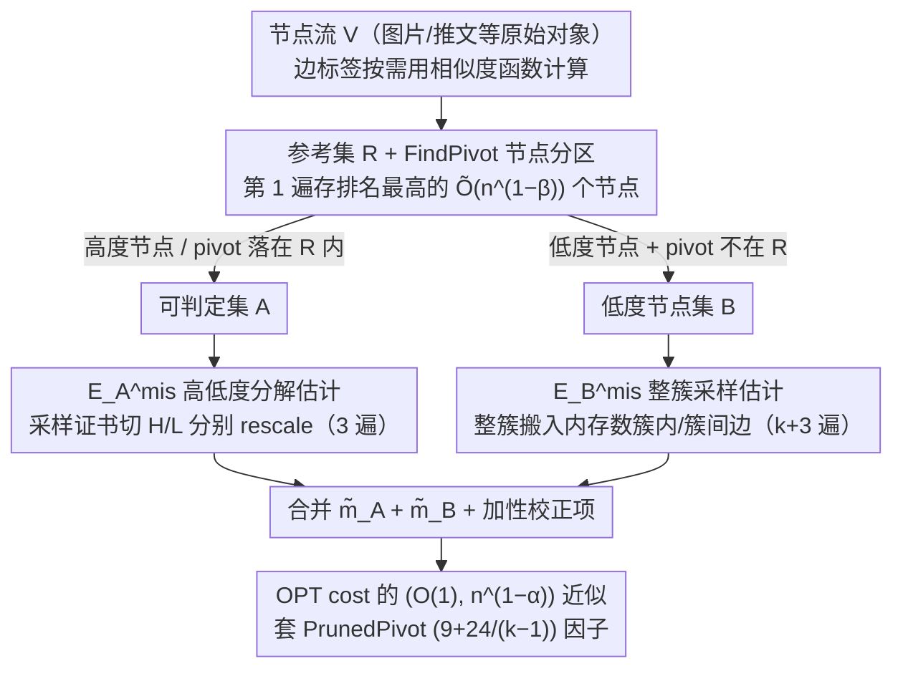

# Estimating Correlation Clustering Cost in Node-Arrival Stream

**会议**: ICML 2026  
**arXiv**: [2605.07091](https://arxiv.org/abs/2605.07091)  
**代码**: 无  
**领域**: 算法理论 / 数据流算法 / 图聚类  
**关键词**: 关联聚类、节点到达流、亚线性空间、Pivot 算法、参考集采样

## 一句话总结
本文研究「节点到达」数据流模型下相关聚类（correlation clustering）代价的近似估计问题：作者提出 C4Approx 算法，用 $O(n^{(3+\alpha)/4}\log n)$ 词的**亚线性**空间和常数遍数得到 $(O(1), n^{1-\alpha})$-近似，并配套两个匹配下界证明多遍与加性误差都不可避免；在真实数据上仅存 2% 节点即达 Pivot 同等效果。

## 研究背景与动机

**领域现状**：相关聚类是经典 NP/APX-hard 问题，给定 $\pm 1$ 完全图，要把节点划成簇使「正边跨簇 + 负边同簇」的不匹配对数最小，已有大量 $O(1)$-近似算法（其中 Pivot 算法以 3-近似最具代表性）。在大数据场景，已有诸多 edge-arrival 流算法，但都需要 $O(n\,\text{polylog}\,n)$ 空间。

**现有痛点**：现实数据（图片、推文、向量）天然以「节点流」形式出现，边标签由相似度函数按需计算 — 没人会显式存 $\binom{n}{2}$ 条边。在 node-arrival 模型下，前人工作几乎空白；唯一相关的 Assadi et al. 给出 $(O(1),\delta n^2)$ 近似，但加性项 $\delta n^2$ 太松。

**核心矛盾**：要输出聚类必须 $\Omega(n)$ 空间（簇数可达 $n$），但若只想估「可聚类性」（即 OPT cost），则有可能突破 $n$ — 然而在 node-arrival 中由于边只能在「两端都在内存」时被查，连枚举所有边都做不到，这是个本质性的访问受限挑战。

**本文目标**：在 $o(n)$ 空间和 $O(1)$ 遍下，给出 $(O(1), n^{1-\alpha})$ 形式的 cost 近似；同时刻画该模型下「多遍 + 加性误差」两者的必要性。

**切入角度**：核心观察是 — 不需要为每个节点都找到 pivot，只要内存里保存一个「按随机排列 $\pi$ 排名最高的少量节点」组成的参考集 $R$，就能为多数节点（高度 + pivot 落在 $R$ 内者）直接判定 pivot；剩下少量节点（必为低度）可用 sampling 单独估计。

**核心 idea**：「参考集 $R$ + 高低度分解」联手把 PrunedPivot 误匹配总数 $|E^{\text{mis}}|$ 拆成两块独立估计，从而把空间从 $O(n)$ 降到亚线性。

## 方法详解

### 整体框架
C4Approx 实现 5 步流水线。

第一遍：基于随机排列 $\pi$，把排名最靠前的 $r=48k n^{1-\beta}\log n$ 个节点存进参考集 $R$（$\beta=(1-\alpha)/4$）。

之后并行执行两个子例程：(i) Est-EA 用 3 遍估计 $|E_A^{\text{mis}}|$（至少一端在 $A$ 的不匹配对），(ii) Est-EB 用 $k+3$ 遍估计 $|E_B^{\text{mis}}|$（两端都在 $B$）。这里 $A$ 是「能借助 $R$ 直接判定 pivot 的节点」，$B=V\setminus A$ 为剩下的低度节点。

最终返回 $(\tilde m_A+\tilde m_B + \frac{3}{8}\epsilon n^{1-\alpha})/(1-\epsilon/8)$，配合 Theorem 2.1 (Dalirrooyfard et al.) 的 PrunedPivot $(9+\frac{24}{k-1})$-近似，组合得到对 OPT cost 的 $(O(1),n^{1-\alpha})$-近似，概率至少 $0.99$。整条流水线是「先建参考集分区、再双路并行估计、最后合并」的分支-汇合结构，下图三条贡献路径正对应后面三个关键设计。

### 关键设计

**1. 参考集 $R$ + FindPivot 节点分区：用亚线性内存做 pivot 判定的"部分预言机"**

直接保存所有节点的 pivot 信息需要 $\Omega(n)$ 空间。作者的核心观察是：不必为每个节点都找到 pivot，只要内存里存一个"按随机排列 $\pi$ 排名最高的少量节点"组成的参考集 $R$（$|R|=\tilde O(n^{1-\beta})$），就能服务掉大多数节点的判定。FindPivot 在 $R$ 内递归找排名更高的邻居（递归预算 $k$）：若成功，则 $\text{pivot}(u)\in R$ 或 $u$ 自己是 singleton，归入可判定集 $A$；若 timeout 且邻居都不在 $R$，归入 $B$。Lemma 2.5 保证"同一簇中节点要么全在 $A$ 要么全在 $B$"，于是两侧估计可独立做。关键的可行性来自 Lemma 2.6（用 Chernoff 严格证之）：高度节点的前 $k$ 个高排名邻居以高概率落入 $R$，所以 $R$ 已足够服务全部高度节点；剩下 $B$ 必为度 $\le n^\beta$ 的低度节点，可走采样路线。

**2. $E_A^{\text{mis}}$ 的高低度分解估计：控制重尾度数带来的方差爆炸**

估计"至少一端在 $A$"的不匹配对数，等价于估计 mismatch 子图 $G_A^{\text{mis}}$ 的平均度，但度数动态范围达 $\{0,\dots,n-1\}$，直接均匀采样方差会爆。作者采样一个小集 $S_1$ 作"高度证书"，按 $|N_A^{\text{mis}}(u)\cap S_1|$ 是否显著把 $V$ 切成高度集 $H$ 与低度集 $L$：对 $H$ 用 rescale-by-sampling 估其度，对 $L$ 直接子采样。Lemma 2.8 给出 $(1\pm\epsilon,\pm\epsilon n^{1-\alpha})$-近似，$O(\frac{1}{\epsilon^2}(n^{1-\beta}+n^{\alpha+\beta})\log n)$ 空间、3 遍。把"重尾、长尾"分开处理是控制估计方差的经典技巧，但在节点流里需要重新设计采样策略以适配"边只能查询同时在内存的节点对"这一限制。

**3. $E_B^{\text{mis}}$ 的整簇采样估计：用"簇小"换方差可控**

$B$ 上没法依赖 $R$ 做 mismatch 判定，但它有另一个 bound——所有簇都"小"（度上界 $n^\beta$）。于是可以直接从簇集合 $\mathcal{C}(B)$ 整簇采样，把抽中的簇整个搬进内存，再数其 intra/inter-cluster 边数并 rescale；pivot 的实际计算靠 Algorithm 2 流式实现的 PrunedPivot，用 $k$ 遍 + $O(k)$ 空间完成。Lemma 2.9 给出同样的近似与置信度，$O(\frac{k}{\epsilon^2}n^{\alpha+3\beta}\log n)$ 空间、$k+3$ 遍。每个采样簇的贡献被簇大小上界控住，方差自然小——这部分和 $E_A^{\text{mis}}$ 的估计合起来才完整覆盖 $E^{\text{mis}}$。

### 损失函数 / 训练策略
纯组合算法，无训练。关键参数：$k=37$、$\epsilon=1/10$、$\beta=(1-\alpha)/4$ 即得到主定理 $(O(1),n^{1-\alpha})$ 近似 + $O(n^{(3+\alpha)/4}\log n)$ 空间。

## 实验关键数据

### 主实验
作者在多种真实数据集上比较 C4Approx 与 Pivot、PrunedPivot 以及 Assadi et al. 的算法。代表性结果如下（趋势性总结，详细数字见原文 Section 4）。

| 数据集 / 设定 | 内存占比 | C4Approx cost | Pivot cost | 备注 |
|---|---|---|---|---|
| ImageNet-21K embedding + cosine 阈值 | 2% 节点 | 与 Pivot 持平 | 100% 节点存储 | 100× 内存压缩仍保精度 |
| 稀疏图（cluster 高度不均匀） | 2% | 显著好于 Assadi et al. | — | 稀疏图是 Assadi 算法的弱区 |
| 多次重复取均值 | 2% | 方差小 | — | 高低度分解抑制方差 |

### 消融实验

| 配置 | 表现 | 说明 |
|---|---|---|
| C4Approx (full) | 接近 Pivot | 高低度分解 + 整簇采样齐全 |
| 仅 SimpleSampling | 加性误差 $\Theta(n^2/\sqrt q)$ | 验证「naive 采样在 $o(n)$ 空间下加性误差无法压缩到 $o(n^{1.5})$」的理论判断 |
| 去掉高低度分解 | 方差暴涨 | 验证 Variance Reduction 关键性 |
| Assadi et al. 在稀疏图 | 不稳定 | 加性 $\delta n^2$ 难以同时取小 |

### 关键发现
- 在节点流模型里，加性误差是**必然存在**的（下界 (2)：$c$-近似且 $d=0$ 需 $\Omega(n)$ bit）；多遍也是**必然必要**的（下界 (1)：一遍 $(c,d)$-近似需 $\Omega(n)$ bit）。这给出了模型固有难度的清晰刻画。
- 仅存 $\sim 2\%$ 节点便能逼近 Pivot — 实证显示「亚线性内存 + 几次遍历」对节点流模型并非空头支票。
- 与 Assadi et al. 比较：要把对方的加性 $\delta n^2$ 压到 $n^{0.1}$ 需 $\delta = n^{-1.9}$，反推空间 $\Omega(n^{9.5})$ — 完全爆掉。

## 亮点与洞察
- **模型创新**：node-arrival 而非 edge-arrival 是更贴近现实大数据流的视角；这条线被以往严重低估，作者把它形式化并给出第一个有匹配下界的算法。
- **可迁移的「参考集 + 高低度分解」范式**：这套思路可能直接用于其它需要「按需边查询」的流式图问题（如三角形计数、社区检测、cut sparsifier）。
- **理论 + 实验闭环**：上界与下界配对，且实验确认理论选定的关键常数（如 $k=37$）切实可用，少见的「证完就能跑」的算法论文。

## 局限与展望
- $(O(1), n^{1-\alpha})$ 的加性误差天花板对**稠密真值**（$|E^{\text{mis}}|\gg n^{1-\alpha}$）影响不大，但在「近乎可完美聚类」的低 cost 场景下，加性项可能淹没真值。
- 算法依赖一次性给定随机排列 $\pi$，若流是对抗性的（如恶意节点先到），独立同分布假设会被破坏，相关稳健性留作未来工作。
- 实验主要在「embedding + 阈值」的合成相似度上做，对「相似度 oracle 本身昂贵」的场景（如 LLM judge）尚未评测。

## 相关工作与启发
- **vs Pivot / PrunedPivot**：本文继承其 $O(1)$-近似保证，关键贡献是把它移植到**亚线性内存 + 节点流**这套强约束模型。
- **vs Assadi et al. 2023 (edge stream)**：相同输出形式，但本文加性项 $n^{1-\alpha}$ 远紧于对方 $\delta n^2$；下界部分也比对方刻画的模型更细致。
- **vs 动态算法 (插入/删除流)**：那一脉关心更新时间，依旧需 $\Omega(n)$ 空间；本文与其互补。

## 评分
- 新颖性: ⭐⭐⭐⭐⭐ 第一份系统化的 node-arrival 相关聚类亚线性算法，配上下界，几乎奠基
- 实验充分度: ⭐⭐⭐ 真实数据有，但局限在 embedding 阈值生成的相似度图，模态相对单一
- 写作质量: ⭐⭐⭐⭐ 理论叙述工整、定义—引理—定理层次清晰
- 价值: ⭐⭐⭐⭐ 对大规模相似度图的「可聚类度量」一类应用直接可用，且范式可迁移

<!-- RELATED:START -->

## 相关论文

- [\[ICML 2025\] Sparse-Pivot: Dynamic Correlation Clustering for Node Insertions](../../ICML2025/learning_theory/sparse-pivot_dynamic_correlation_clustering_for_node_insertions.md)
- [\[ICML 2026\] Simple Algorithms for Bad Triangle Transversals with Applications to Correlation Clustering](simple_algorithms_for_bad_triangle_transversals_with_applications_to_correlation.md)
- [\[NeurIPS 2025\] Learning-Augmented Streaming Algorithms for Correlation Clustering](../../NeurIPS2025/learning_theory/learning-augmented_streaming_algorithms_for_correlation_clustering.md)
- [\[NeurIPS 2025\] Improved Approximation Algorithms for Chromatic and Pseudometric-Weighted Correlation Clustering](../../NeurIPS2025/learning_theory/improved_approximation_algorithms_for_chromatic_and_pseudometric-weighted_correl.md)
- [\[ICML 2026\] MMD-Balls as Credal Sets: A PAC-Bayesian Framework for Epistemic Uncertainty in Test-Time Adaptation](mmd-balls_as_credal_sets_a_pac-bayesian_framework_for_epistemic_uncertainty_in_t.md)

<!-- RELATED:END -->
