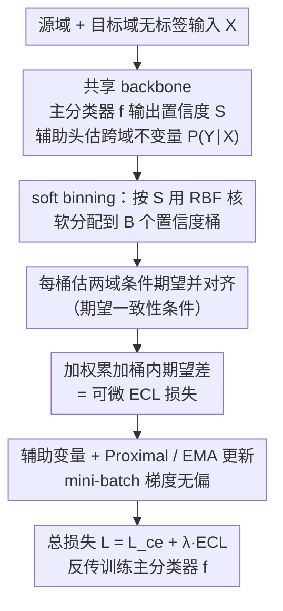

# Expectation Consistency Loss: Rethink Confidence Calibration under Covariate Shift

**会议**: ICML2026  
**arXiv**: [2605.21552](https://arxiv.org/abs/2605.21552)  
**代码**: https://github.com/NeuroDong/ECL (有)  
**领域**: AI 安全 / 置信度校准 / 协变量漂移  
**关键词**: 置信度校准, 协变量漂移, 期望一致性, 无监督域适应, 小批量可训练

## 一句话总结
ECL 证明在协变量漂移下完整对齐输入分布 $P_s(X) = P_t(X)$ 并非校准的必要条件，只要"在每个置信度水平集上 $P(Y_k=1|X)$ 的条件期望两域一致"即可，并据此构造一个对 canonical / class-wise / top-label 三类校准都通用、可微、且 mini-batch 梯度无偏的损失 ECL。

## 研究背景与动机

**领域现状**：现代分类模型尤其是深网普遍存在置信度过高/过低问题，置信度校准（confidence calibration）希望模型预测的概率向量真正等于事件发生频率。主流方法分两类：训练期校准（Soft-ECE、DECE、KDE）和后处理校准（temperature scaling、Dirichlet 校准、binomial 校准等）。这些方法默认源域（校准集）与目标域（测试集）IID。

**现有痛点**：现实场景里 IID 几乎总被违反——医疗模型跨人群、识别模型跨光照都属于协变量漂移 $P_s(X) \ne P_t(X)$ 但 $P(Y|X)$ 不变。现有协变量漂移下的校准方法（Weighted TS、FL+IW+Temp、TransCal、DRL）几乎清一色用重要性加权 $w(x) = P_t(x)/P_s(x)$ 来对齐分布，存在两大问题：(1) 密度比一旦大或无界，加权方差爆炸不稳定；(2) 它们只能处理最简单的 top-label 校准，对 class-wise 和 canonical 校准（最严格的多类联合校准）几乎没有支持。PseudoCal 用 mixup 合成伪目标域，效果取决于伪数据和真实目标域的相似度。

**核心矛盾**：作者敏锐指出准确率提升和置信度校准是两件事——前者要"学到新知识"所以必须重新对齐输入分布，后者只是"准确传达不确定性"不需要补知识。强行套用前者的思路用 IW 去做后者，等于解了一个更难的问题，自然引入额外不稳定性。换句话说**全局对齐输入分布是充分条件而非必要条件**，业界长期把它当必要条件用，浪费了校准自身的统计自由度。

**本文目标**：(1) 给出协变量漂移下置信度校准的"充要"条件，从理论上替换掉过强的分布对齐假设；(2) 据此构造一个不依赖密度比、对 canonical / class-wise / top-label 都通用、可微、可 mini-batch 无偏估计的校准损失；(3) 分析它的样本复杂度并给出实际工程化训练方案。

**切入角度**：把校准条件 $P_s(Y_k=1|S) = P_t(Y_k=1|S)$ 用全概率公式展开后会发现两边都可以表达为"在置信度 $S$ 的水平集上对真后验 $P(Y_k=1|X)$ 的期望"。只要这两个条件期望相等就够了——这只要求**在每个置信度桶里平均后的真后验跨域一致**，远比要求两域整个 $X$ 分布相同弱得多。

**核心 idea**：把"两域条件期望差"在所有桶上做加权 Frobenius 求和当作损失，用一个额外的分类头估 $P(Y|X)$（在源域上已经能学到，因为协变量漂移下 $P(Y|X)$ 是不变量），再通过 soft binning + 辅助变量 + EMA proximal 更新拿到一个 mini-batch 上梯度无偏的可训练版本。

## 方法详解

### 整体框架
ECL 的 pipeline 是：在源域上正常训练分类器 $f$ 和一个估计 $P(Y|X)$ 的辅助分类头（共享 backbone），然后在两域的无标签输入上联合优化"交叉熵 + $\lambda \cdot$ ECL"。ECL 只用源/目标域的输入 $X$ 和分类器输出 $S = f(X)$，不需要目标域标签，所以是**无监督域适应**。

具体三步：(1) 把每个样本按 $S$ 落到 $B$ 个 soft bin 里，用 RBF 核 $\omega_{ij} = \exp(-\|S^{(i)} - a_j\|_2^2/\tau)$ 做软分配；(2) 在每个 bin $j$ 内分别估算源/目标域的条件期望 $\hat{\mathbb{E}}_{d,j} = \sum_i \omega^d_{ij} p^{(i)} / (\sum_i \omega^d_{ij} + \varepsilon)$，其中 $p^{(i)} = P(Y|X_i)$ 由额外分类头给出；(3) 以目标域 bin 频率 $w_j = n^t_j / \sum_r n^t_r$ 加权累加 $\|\hat{\mathbb{E}}_{s,j} - \hat{\mathbb{E}}_{t,j}\|$ 得到 ECL 损失，作为正则项注入主分类器的训练。落到 mini-batch 上时，再用辅助变量 + proximal/EMA 把"先期望后取范数"的梯度偏置消掉，得到可端到端反传的可训练版本。

### 关键设计

**1. 期望一致性条件：把"全局对齐输入分布"这个过强假设，换成"每个置信度桶里平均后的真后验跨域一致"的真正充要条件**

之前所有重要性加权类方法本质上都在隐式追求 $P_s(X) = P_t(X)$，这是一个比校准本身更难的目标。定理 3.1 给出真正需要的充要条件：$\forall k$，$P_s(Y_k=1|S) = P_t(Y_k=1|S)$ 当且仅当 $\mathbb{E}_{X \sim P_s(X|S)}[P(Y_k=1|X)] = \mathbb{E}_{X \sim P_t(X|S)}[P(Y_k=1|X)]$，其中协变量漂移定义保证 $P(Y_k=1|X)$ 跨域不变。证明思路是把 $P_d(Y_k|S)$ 用条件期望式 $\int P(Y_k|X) P_d(X|S)\,dX$ 展开。论文还给了一个简洁的二分类反例（$P_s(X)$、$P_t(X)$ 分别是均值 $\pm 0.5$ 的高斯，$S_1 = -0.25 X^2 + 1$、$P(Y_1|X) = -0.5|X| + 1$）：协变量分布差异显著，但因为关于 y 轴对称导致两域条件期望恒等，校准误差恒为零——直接打破"必须对齐 $P(X)$"的直觉。这个判据把校准从"输入空间对齐"挪到"置信度水平集上的局部期望对齐"，统计上更省、工程上更稳，而且能直接推广到 top-label（把 $S$ 换成 $\hat{S}$）和 class-wise（换成单分量 $S_k$）校准。

**2. 可微的 ECL 损失与 soft binning：把期望一致性条件从理论判据变成可端到端反传的损失，并同时支持三种主流校准范式**

理论上的目标是 $L_{ecl} = \mathbb{E}_{P_t(S)} \|\mathbb{E}_{P_s(X|S)} P(Y|X) - \mathbb{E}_{P_t(X|S)} P(Y|X)\|$，但硬 binning 不可微。本文改用 soft binning：在单纯形 $\Delta_{K-1}$ 上放 $B$ 个锚点 $a_j$，软权重 $\omega_{ij} = \exp(-\|S^{(i)}-a_j\|_2^2/\tau) / \sum_r \exp(-\|S^{(i)}-a_r\|_2^2/\tau)$；每个 bin 的条件期望由一个额外分类头输出的 $p^{(i)} = P(Y|X_i)$ 加权得到 $\hat{\mathbb{E}}_{d,j}$；最终 $\hat{L}_{ecl} = \sum_j w_j \|\hat{\mathbb{E}}_{s,j} - \hat{\mathbb{E}}_{t,j}\|$。这里之所以能多养一个分类头估 $P(Y|X)$，是因为协变量漂移下 $P(Y|X)$ 本身是跨域不变量，在源域上就能学到。之前 covariate shift 校准只覆盖最简单的 top-label，是因为它们用 IW 在边际分布上做事；ECL 因为做的是"水平集上的条件期望对齐"，只需替换软分配里用的置信度变量（向量 $S$ / 单分量 $S_k$ / $\hat{S}=\max_k S_k$）就能直接复用同一框架处理更严格的 canonical 校准。Theorem 3.2 还给出样本复杂度 $\mathcal{O}(B/\varepsilon^2)$，与 ECE 的 histogram binning 同阶，权重 $w_j$ 又显式约束了稀疏 bin 的影响。

**3. 辅助变量 + Proximal 更新：把外层范数所需的两域期望显式参数化，让 ECL 在 mini-batch 上的梯度变成无偏估计**

直接把损失套到 mini-batch 会因为 $\|\cdot\|$ 与 $\mathbb{E}$ 不交换而引入梯度偏置——这正是 Soft-ECE 这类训练损失在小 batch 下经常崩的原因。Theorem 3.3 给出一个等价表达式 $L_{ecl}(\theta, u_j^s, u_j^t) = \sum_j w_j \|u_j^s - u_j^t\| + \sum_j \sum_{i \in D_s} \omega^s_{i,j} \|u_j^s - p^{(i)}(\theta)\|^2 + \sum_j \sum_{i \in D_t} \omega^t_{i,j} \|u_j^t - p^{(i)}(\theta)\|^2$，引入辅助变量 $u_j^s, u_j^t$ 去跟踪全数据集上的期望；在这个形式下整个损失变成对每个样本的二次型，梯度天然分解、小批量梯度无偏。算法 1 用交替 proximal 步骤更新 $u_j^s, u_j^t$（带 shrink 算子和阈值 $\tau_s = w_j/(2 n_{s,j})$、$\tau_t = w_j/(2 n_{t,j})$），并用 EMA 平滑 $u_j \leftarrow (1-\alpha_{ema}) u_j + \alpha_{ema} \tilde{u}_j$ 抑制噪声，再把 detached 的 $\tilde{u}_j$ 回填到 $\|u_j - p^{(i)}(\theta)\|^2$ 项反传。这一招把校准训练真正打通到了现代 SGD pipeline 里——几乎所有相关工作都在小 batch 下不稳，就是卡在这个"先期望、后非线性"的结构上。

### 损失函数 / 训练策略
总目标 $L = L_{ce} + \lambda L_{ecl}$，权重 $\lambda$ 用自适应策略 $\lambda = \beta^\gamma$ 其中 $\beta = (\sum_i L_{ce}^{(i)}) / (\sum_i L_{ecl}^{(i)})$、$\gamma = 1$ 给出线性比例，消融显示这个量级合适。辅助分类头训练 $P(Y|X)$ 时冻结 backbone，可选择再在源域上用 Soft-ECE 做一次后校准。

## 实验关键数据

### 主实验
在三个真实协变量漂移数据集上做 top-label 校准的 ECE 对比：数字识别（MNIST/USPS/SVHN 互为源/目标）、PACS（4 个域）、ImageNet-Sketch；网络包括 LeNet-5、ResNet20、DenseNet40、Wide-ResNet、ViT。代码已开源。

| 任务（目标→源） / 网络 | Uncal ECE | PseudoCal | DRL | ECL (Ours) | Oracle | $\Delta$ACC (%) |
|---|---|---|---|---|---|---|
| → MNIST / LeNet-5 | 27.3 | 9.08 | 22.3 | **8.52** | 0.30 | $-0.92$ |
| → MNIST / DenseNet40 | 23.4 | 9.72 | 14.8 | **9.15** | 1.40 | $+0.68$ |
| → USPS / DenseNet40 | 15.7 | 5.34 | 7.92 | **4.96** | 2.54 | $-0.76$ |
| → SVHN / LeNet-5 | 61.9 | 52.4 | 23.7 | **21.5** | 1.03 | $+1.65$ |
| → SVHN / ResNet20 | 68.2 | 48.2 | 40.1 | **36.8** | 0.50 | $+2.12$ |
| → SVHN / DenseNet40 | 80.8 | 64.7 | 42.0 | **38.4** | 0.86 | $-1.15$ |

### 消融实验

| 配置 | ECE / 稳定性 | 说明 |
|---|---|---|
| Full ECL（辅助变量 + Proximal + EMA） | 最优、稳定 | Algorithm 1 完整版 |
| Mini-Batch Non-Trainable ECL（直接 Eq. 8 on batch） | 不稳定、偏差大 | 范数与期望不交换造成梯度偏置 |
| ECL 不带额外分类头估 $P(Y|X)$ | 退化为分布对齐 | 失去"水平集期望"几何意义 |
| 损失权重 $\lambda = \beta^\gamma$，$\gamma = 1.0$ | 校准/精度 trade-off 最佳 | $\gamma$ 过小欠校准，过大伤精度 |

### 关键发现
- ECL 在三种校准范式（canonical、class-wise、top-label）上同时显著降 ECE，是表 1 中唯一对四个维度（covariate shift / 三种校准范式 / 无界密度比 / mini-batch 可训练）全打勾的方法，PseudoCal 紧随其后但缺乏 canonical 和 class-wise 支持。
- 漂移越严重 ECL 越突出：在 → SVHN 这种"自然图片 vs 数字"巨大漂移上，ECL 把 LeNet-5 的 ECE 从 61.9% 一路压到 21.5%，比 PseudoCal 的 52.4% 还低一倍多；而 IW 类方法（TransCal、DRL）在此类极端漂移下密度比爆炸基本失灵。
- $\Delta$ACC 多数为正：校准的同时小幅提高分类精度（如 SVHN/ResNet20 提升 2.12%），暗示 ECL 的水平集对齐对分类边界也有正向影响而不是简单的概率拉伸。

## 亮点与洞察
- "校准 ≠ 准确率提升"的视角刷新：作者很明确地把这两个长期被混为一谈的目标拆开，并据此把校准的统计要求降级——这是一个非常清晰的概念性贡献，给所有 OOD 校准研究指明了"用更弱的条件做更对症的事"的方向。
- 反例 + 严格判据：那个简洁的高斯/二次型反例（图 1）非常具有说服力，它直接展示"协变量分布完全不同但校准误差为零"是可以构造的，把"必须对齐 $P(X)$"的直觉打破得很彻底，可作为讲解 covariate shift 校准时的标准 illustrative example。
- 辅助变量化简非线性期望：把 $\|\mathbb{E}[\cdot] - \mathbb{E}[\cdot]\|$ 拆成 $\|u^s - u^t\|$ 加两个二次惩罚项以打破"范数包期望"的偏置，这个 trick 可迁移到任何"先 batch 内聚合再外层非线性"的损失（如 ECE 训练、对抗校准、IRM 等），技术普适性高。

## 局限与展望
- 作者承认的局限：假设 $P(Y|X)$ 跨域不变，这是协变量漂移的定义本身，遇到 label shift 或 concept drift（$P(Y|X)$ 改变）则失效，是未来工作要打通的方向。
- 自己发现的局限：辅助分类头估 $P(Y|X)$ 的质量直接影响 ECL 信号——若源域分类头本身严重失校，会带偏 ECL 优化目标；soft binning 引入了温度 $\tau$、锚点数 $B$、proximal 步数 $N_{prox}$、EMA 系数 $\alpha_{ema}$ 等多个超参，工程实践上需要标准化默认值；对极端类别不均衡场景里的 class-wise 校准 ECL 是否同样有效，论文未充分讨论。
- 改进思路：把 ECL 扩展到联合协变量+标签漂移，可引入对 $P(Y)$ 比的额外参数；考虑用 Sinkhorn-like 软分配替代 RBF 软 binning 以拿到更稳定的梯度；和 conformal prediction 这类无分布假设的方法结合，可能拿到更稳健的区间式校准。

## 相关工作与启发
- **vs TransCal / DRL / Weighted TS（IW 类）**：他们用密度比 $w(x) = P_t(x)/P_s(x)$ 对齐输入分布，在大漂移下方差爆炸；ECL 不需要密度比，只需要桶内条件期望，根本绕开 IW 的不稳定问题。
- **vs PseudoCal（Hu et al., 2024）**：用 mixup 合成伪目标域去近似 $P_t(X)$，效果取决于合成数据的相似度；ECL 直接用真实目标域无标签输入 + 不变的 $P(Y|X)$ 估计，理论上更直接。
- **vs Soft-ECE / DECE / KDE（i.i.d. 训练期校准）**：他们假设源/目标同分布，遇到漂移直接退化；ECL 是在"漂移已经发生"的前提下设计的，且仍然兼容 mini-batch 训练。
- **vs 后处理 TS / 经典 Guo et al.**：TS 是无监督单参数缩放，无法处理 class-wise；ECL 同时覆盖 top-label/class-wise/canonical 且支持训练期联合优化。

## 评分
- 新颖性: ⭐⭐⭐⭐⭐ "校准只需期望一致而非分布一致"是一个明确的概念级洞察，再加严格充要条件证明，新颖度很高。
- 实验充分度: ⭐⭐⭐⭐☆ 数字识别+PACS+ImageNet-Sketch 三个真实数据集 + 模拟实验 + 多网络 + 三种校准范式，唯一缺憾是没和最新的 conformal 方法横向比。
- 写作质量: ⭐⭐⭐⭐⭐ 理论-反例-损失-工程化-实验的逻辑链一气呵成，定理陈述清楚，反例图直击人心。
- 价值: ⭐⭐⭐⭐⭐ 给了协变量漂移下的校准一条理论上严格、工程上可落地的新通用 baseline，对所有部署到非 IID 真实场景的安全敏感系统都有直接借鉴价值。

<!-- RELATED:START -->

## 相关论文

- [\[ICML 2026\] Matroid Algorithms Under Size-Sensitive Independence Oracles](matroid_algorithms_under_size-sensitive_independence_oracles.md)
- [\[ICML 2026\] Realizable Bayes-Consistency for General Metric Losses](realizable_bayes-consistency_for_general_metric_losses.md)
- [\[ICML 2026\] Provably Data-driven Multiple Hyper-parameter Tuning with Structured Loss Function](provably_data-driven_multiple_hyper-parameter_tuning_with_structured_loss_functi.md)
- [\[ICLR 2026\] An Efficient, Provably Optimal Algorithm for the 0-1 Loss Linear Classification Problem](../../ICLR2026/learning_theory/an_efficient_provably_optimal_algorithm_for_the_0-1_loss_linear_classification_p.md)
- [\[ICML 2025\] Near-Optimal Consistency-Robustness Trade-Offs for Learning-Augmented Online Knapsack Problems](../../ICML2025/learning_theory/near-optimal_consistency-robustness_trade-offs_for_learning-augmented_online_kna.md)

<!-- RELATED:END -->
