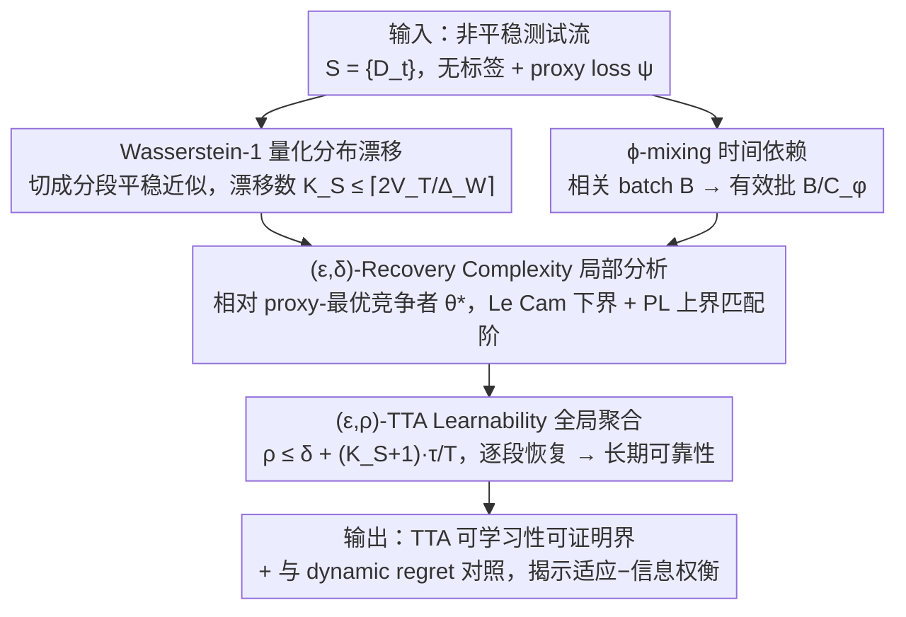

# On the Learnability of Test-Time Adaptation: A Recovery Complexity Perspective

**会议**: ICML 2026  
**arXiv**: [2605.28057](https://arxiv.org/abs/2605.28057)  
**代码**: 无  
**领域**: 学习理论 / Test-Time Adaptation / 非平稳在线学习  
**关键词**: TTA可学习性、恢复复杂度、Wasserstein 量化、ϕ-mixing、minimax 下界

## 一句话总结
本文首次为测试时自适应（TTA）建立可学习性理论框架，用 $(\epsilon,\delta)$-Recovery Complexity 衡量分布漂移后模型把超额风险压到 $\epsilon$ 所需时间，并配合 $(\epsilon,\rho)$-TTA Learnability 把局部恢复推广到整条非平稳测试流，导出匹配阶的 minimax 上/下界，揭示了 TTA 的"适应速度—信息约束"内在权衡。

## 研究背景与动机

**领域现状**：TTA 在视觉、表格、NLP 任务上经验上很成功（Tent、CoTTA、NOTE、ODS 等），范式是只用无标签测试数据、靠一个 proxy loss $\psi$ 对模型做 online 更新。但在复杂分布漂移下方法常常崩，社区开始反思"什么条件下 TTA 是可靠的"。

**现有痛点**：一方面，在线学习理论（regret 框架）只刻画累计性能，不回答"漂移之后多久能恢复"这种瞬时可靠性问题；另一方面，已有的 TTA 理论分析（如 AdaNPC 限定 memory-based、ATTA 假设可主动取标签）都对算法或标签可用性下了过强假设，撑不起一般 unlabeled stream 的实际场景。

**核心矛盾**：TTA 的目标本质是"在每一个时间步都得保持可接受的瞬时风险"，而现有理论框架要么不刻画 post-shift recovery，要么不刻画无标签流上 proxy 与真实 loss 错配带来的信息约束，两者都接不上 TTA 的核心需求。

**本文目标**：构造一个统一框架，能同时表达 (i) 连续/突变两类分布漂移，(ii) 时间相关性，(iii) proxy-task 错配，(iv) 漂移后恢复速度，并能在 stochastic proxy-gradient oracle 下导出匹配阶上下界。

**切入角度**：把测试流先用 Wasserstein-1 距离离散化成"分段平稳"近似，把每段当成一个独立的恢复问题来分析；再用 ϕ-mixing 系数刻画 batch 内时间依赖；最后用 Le Cam 两点法刻画信息论下界。

**核心 idea**：用"恢复复杂度" $\tau(\epsilon,\delta)$ 把瞬时可靠性变成可分析的复杂度量，再把多段恢复行为聚合成全局 $(\epsilon,\rho)$-TTA Learnability，从而把 TTA 学习性问题归约到经典 stochastic optimization 的样本/批次复杂度分析。

## 方法详解

### 整体框架
理论框架由四块拼成、前后衔接成一条"归约流水线"：(1) 测试流形式化——Wasserstein-1 量化的分布漂移 + ϕ-mixing 的时间依赖，把非平稳流压成可分析的分段平稳近似；(2) 竞争目标——proxy-optimal competitor $\theta_t^\star \in \arg\min_{\theta\in\mathcal{N}_r(\theta_1)} \psi_t(\theta)$ 及其真实任务风险 $R_t:=\ell_t(\theta_t^\star)$，作为超额风险的参照系；(3) 局部分析——单次漂移后 $(\epsilon,\delta)$-recovery complexity 的 minimax 上下界；(4) 全局聚合——把每段恢复行为汇总成 $(\epsilon,\rho)$-TTA Learnability 并与 dynamic regret 做对照。输入是一条 non-stationary stream $\mathcal{S}=\{D_t\}_{t=1}^{T}$，输出是关于"在什么参数体制（$\alpha$ 对齐度、$\zeta$ 错配偏置、batch 大小 $B$、mixing 常数 $C_\phi$、漂移幅度 $\Delta_W$）下 TTA 可学习"的可证明界。整条链路如下图：前两块是两路工具，汇入局部 recovery complexity 分析，再被抬升成全局可学习性。

### 关键设计

**1. Wasserstein-1 量化的分布漂移近似：把非平稳轨迹压成一段段平稳近似**

TTA 的核心需求是"在每个时间步都保持可接受的瞬时风险"，但要分析一条连续漂移、还掺着突变的非平稳流几乎无从下手。作者的做法是先用 Wasserstein-1 距离把轨迹 $\{\mathcal{P}_t\}$ 离散化成分段平稳近似 $\{\tilde{\mathcal{P}}_t\}$，并保证近似误差不超过 $\Delta_W/2$。具体是一个贪心算法：维护一个 anchor，下一时刻 $\mathcal{P}_t$ 与 anchor 的 $W_1$ 距离 $\le \Delta_W/2$ 就继承 anchor、置 shift 指示 $\tilde{S}_t=0$，否则宣告漂移、重置 anchor、$\tilde{S}_t=1$，可证总漂移数 $\tilde{K}_S(T) \le \lceil 2V_T/\Delta_W\rceil$（$V_T:=\sum_t W_1(\mathcal{P}_t,\mathcal{P}_{t+1})$ 为总变差）。选 $W_1$ 而非 KL/TV 不是随意的——它能在 joint space $\mathcal{X}\times\mathcal{Y}$ 上对 covariate 漂移和 label 漂移做统一刻画，也支撑了后面信息论下界里的两点构造。这一步是整套理论的脊柱：它把"全局非平稳分析"归约成"每段独立的恢复分析 + 漂移计数"，后面所有结果都建在这上面。

**2. ϕ-mixing 时间依赖与有效 batch size：把时间相关性凝结成一个标量 $C_\phi$**

TTA 的测试流里 batch 内样本通常不是 i.i.d.（视频帧、传感序列高度相关），直接当独立处理会高估信息量。作者用 ϕ-mixing 系数刻画这种依赖：假设 $\phi(i)\le \varrho^i$ 几何衰减，则一个大小为 $B$ 的相关 batch，其 batch-mean 梯度方差等价于一个大小 $B_{\text{eff}} = B/C_\phi$ 的 i.i.d. batch，其中

$$C_\phi = 1 + \frac{4\varrho^{1/2}}{1-\varrho^{1/2}},$$

$\varrho=0$（完全独立）时退化回 $B_{\text{eff}}=B$。这个设计的妙处在于把一个棘手的随机过程性质，最终压缩成单个标量 $C_\phi$ 进入复杂度界，于是"批多大"和"批内有多独立"这两个看似不同的影响，能在同一个 $B/C_\phi$ 里同台比较——后面的下界 $\tau \gtrsim \frac{C_\phi}{B}\cdot\frac{1}{\alpha(\sqrt{\zeta+2\alpha\epsilon}+\sqrt{\zeta})^2}$ 也因此能同时反映两者。

**3. $(\epsilon,\delta)$-Recovery Complexity 的 minimax 上下界：给"漂移后多久恢复"配上匹配阶的难度刻画**

有了前两块工具，作者就能把 TTA 真正关心的"瞬时可靠性"形式化。定义超额风险 $\mathcal{E}_t:=\ell_t(\theta_t)-R_t$，恢复复杂度为

$$\tau(\epsilon,\delta):=\inf\{t: \sup_{u\ge t}\mathbb{P}(\mathcal{E}_u>\epsilon)\le \delta\},$$

即"漂移后多快能把超额风险压到 $\epsilon$ 之下、且失败概率 $\le\delta$"。下界用 Le Cam 两点法构造两个 $W_1$ 距离恰好 $\Delta_W$ 的难例，证明任何 stochastic proxy-gradient oracle 算法都逃不过 $\tau \ge \Omega\big(\frac{C_\phi}{B}\cdot\frac{1}{\alpha(\sqrt{\zeta+2\alpha\epsilon}+\sqrt{\zeta})^2}\big)$；上界则给一个简化 TTA baseline，在 $L$-smooth + PL 条件下做收敛分析，得到同阶的 $\tau \le \tilde{O}(\cdot)$。上下界匹配阶是这套框架最硬的成果，它一次性揭示三件本质的事：$\zeta>0$（proxy 错配）时即便 $\epsilon\to 0$ 复杂度也不归零——错配会形成 error floor；$\tau$ 随 $1/\alpha^2$ 缩放——proxy-task 对齐强度有二次放大效应；$\tau$ 不显式依赖 $\Delta_W$——漂移幅度只决定"要不要适应"，恢复难度则由 $\alpha,\zeta,B,C_\phi$ 共同定。

**4. $(\epsilon,\rho)$-TTA Learnability：把逐段恢复聚合成整条流的长期可靠性**

Recovery complexity 只刻画"单次漂移后多久恢复"，但 TTA 实际跑在一整条非平稳流上，真正要保证的是"长期里绝大多数时间步都可靠"。作者据此定义 $(\epsilon,\rho)$-TTA Learnability：

$$\frac{1}{T}\sum_{t=1}^{T}\mathbb{P}\big(\ell_t(\theta_t)-R_t>\epsilon\big)\le\rho,$$

即"超额风险超过 $\epsilon$ 的时间步占比不超过 $\rho$"，$\rho$ 就是允许的失效时间比例，直接对应自动驾驶、金融交易这类"绝大多数时刻必须低风险"的部署需求。这一块的核心是 Theorem 4.3 给出的局部→全局转换：只要算法在量化流的每一段上都有 $(\epsilon',\delta)$-recovery complexity $\tau$（其中 $\epsilon'=\epsilon-\Lambda\Delta_W$ 先扣掉量化近似带来的误差），整条流就是 $(\epsilon,\rho)$-learnable，且

$$\rho\le\delta+\frac{(\tilde{K}_S(T)+1)\,\tau(\epsilon',\delta)}{T}.$$

这条 bound 把前三块工具串成闭环：漂移数 $\tilde{K}_S$ 来自设计 1 的 $W_1$ 量化、$\tau$ 来自设计 3 的匹配阶界（其中已含设计 2 的 $C_\phi$）。它的意义在于把"设计可学习的 TTA"归约成"改进局部 recovery complexity"——后者好分析得多（Remark 4.5 称之为 strong transfer：任何更快恢复或更少漂移都直接压低失效率 $\rho$）。最后作者用 Theorem 4.6 把 learnability 接到 dynamic regret，点明二者语义不同：learnability 要求每段都恢复到 $\epsilon$ 以下，dynamic regret 只看累计差距，且 persistent shift 下后者会被迫线性增长。

### 损失函数 / 训练策略
本文是理论分析，不引入新的训练算法。所用 TTA baseline 是带步长 $\eta$ 的 stochastic proxy-gradient descent on $\psi$，在局部邻域 $\mathcal{N}_r(\theta_1)$ 内更新，关键超参为 $\eta$、$B$；分析所依赖的关键假设是 (Assumption 2.1) $(\alpha,\zeta)$-Alignment、(Assumption 2.2) $L$-smooth + PL + 梯度方差 $\sigma^2$ 有界，以及 (Assumption 2.4/2.7) Wasserstein 量化 + ϕ-mixing。

## 实验关键数据

### 主实验
本文以理论结果为主，"主实验"对应 Theorem 3.3（下界）、Theorem 3.9（上界）以及 Section 4 的 TTA Learnability 推广。下表对比本文框架与已有理论工具在 TTA 关键维度上的可表达性。

| 框架 | 瞬时可靠性 | 无标签 proxy 错配 | 非平稳流形态 | 时间相关 batch | 信息论下界 |
|------|------|------|------|------|------|
| 静态在线学习 regret (Shalev-Shwartz) | 否 | 否 | 仅 fixed comparator | 弱 | 无 |
| Dynamic regret (Zhao et al.) | 部分 | 否 | 任意路径变差 | 弱 | 无 |
| AdaNPC (Zhang et al.) | 否 | 限 memory-based | 仅 covariate | 否 | 无 |
| ATTA (Gui et al.) | 部分 | 需 active label | 一般 | 否 | 无 |
| **本文** | **是** | **$\alpha,\zeta$ 显式** | **$W_1$ 量化** | **ϕ-mixing → $C_\phi$** | **Le Cam 匹配** |

### 消融实验
下表给出 recovery complexity 下界中各因子被关闭时的退化结果，对应原文 Remark 3.4–3.7。

| 配置 | 下界量级 | 说明 |
|------|------|------|
| Full bound | $\Omega\big(\frac{C_\phi}{B\alpha}(\sqrt{\zeta+2\alpha\epsilon}+\sqrt{\zeta})^{-2}\big)$ | 完整匹配阶下界 |
| $\zeta=0$（proxy 与 task 完美对齐） | $\Omega(C_\phi/(B\alpha^2\epsilon))$ | 与经典 stochastic optimization 下界同阶 |
| $\varrho=0$（batch 内独立，$C_\phi=1$） | $\Omega(1/(B\alpha^2\epsilon))$ | 时间相关项消失 |
| $\alpha\downarrow$ | $\tau\uparrow$ 以 $1/\alpha^2$ | proxy-task 对齐越弱、恢复越慢 |
| $\Delta_W$ 改变 | 下界不变 | 漂移幅度只决定"是否触发恢复"，不影响内在难度 |

### 关键发现
- proxy 错配 $\zeta$ 形成 error floor：$\epsilon\to 0$ 时下界不归零，意味着任何 unlabeled TTA 都存在不可消除的最小风险，再多样本也压不下去。
- batch size $B$ 和 ϕ-mixing $C_\phi$ 联合主导难度：实践中"增大 batch"不能弥补"高时间相关"，需要看的是有效批 $B/C_\phi$。
- 对齐强度 $\alpha$ 的影响是平方级的，意味着设计更对齐的 proxy loss（如 entropy 改进版、对齐到任务梯度的辅助监督）回报率非常高。
- TTA Learnability 与 dynamic regret 有形式联系但目标不同：前者要求每段都恢复到 $\epsilon$ 之下，后者只关心累计差距；本文给出从前者到后者的转换以及反例区分。

## 亮点与洞察
- 用 Wasserstein-1 把任意非平稳轨迹离散化成有限段平稳近似，这一步把"非平稳分析"硬生生归约成"分段平稳 + 漂移计数"的复合问题，是整个理论能跑通的脊柱设计，思路可迁移到其他 streaming learning 场景（如 continual learning、在线 RL）。
- 把 ϕ-mixing 一路压缩成 $C_\phi$ 这个标量进入复杂度界，让"时间相关性"变成可与 batch size、对齐度同台比较的可量化因子，这种"把过程性质数值化"的技巧值得借鉴。
- $\zeta$ 引入的 error floor 在概念上对应 noisy supervision，把 self-training/pseudo-label 类 TTA 的失败给出了形式化解释；对算法设计的启示是优先想办法降低 $\zeta$（如更好的 proxy 设计、label refinement）而非追求 $\epsilon\to 0$。

## 局限与展望
- 全部分析都在局部邻域 $\mathcal{N}_r(\theta_1)$ 内，假设 PL + smoothness 在该邻域内成立，且更新迭代不离开，这一前提在大幅 distribution shift 或长序列下未必满足。
- 上界依赖一个简化 TTA baseline（stochastic proxy-gradient descent），实际方法如 Tent/CoTTA 用了 BN-only update、teacher-student 等机制，理论与实际算法之间仍有 gap。
- 没有给出对应的算法层贡献，框架更多是"度量"而非"指导设计"；可改进方向是结合 $\alpha,\zeta,C_\phi$ 估计在线自适应步长或动态决定 reset 时机。
- 实验验证缺失（属理论 paper），是否在 CIFAR-C / ImageNet-C 等 TTA benchmark 上量化复杂度因子值得后续工作。

## 相关工作与启发
- **vs Dynamic Regret 框架（Zhao et al., 2024）**：dynamic regret 关心累计差距，本文关心每段恢复时间；作者形式上给出了 $(\epsilon,\rho)$-Learnability 到 regret 的转换条件，并指出二者刻画的是不同语义的"非平稳学习能力"。
- **vs AdaNPC（Zhang et al., 2023）**：AdaNPC 只对 memory-based non-parametric 分类器给出 bound，本文不限定算法族；区别在于本文用 stochastic gradient oracle 把分析抽象到了 algorithm-class level。
- **vs ATTA（Gui et al., 2024）**：ATTA 假设可以 active 取标签，从而把问题简化到有监督 online learning；本文坚持 unlabeled 设定，必须显式建模 proxy-task 错配 $\zeta$，这是最根本的难度来源。
- **vs Tent/CoTTA/NOTE 经验工作**：这些方法各自处理 covariate shift、sequential shift、temporally correlated stream，本文用统一框架解释了它们各自针对的"难度因子"（$\Delta_W$、$V_T$、$\varrho$）并指出共同的 trade-off。

## 评分
- 新颖性: ⭐⭐⭐⭐⭐ 首个 TTA 可学习性理论框架，递归地把非平稳问题拆成可分析的分段恢复问题，从概念到工具都是新的
- 实验充分度: ⭐⭐ 纯理论 paper，无实证验证，对实际 TTA 算法的解释力靠后续工作补
- 写作质量: ⭐⭐⭐⭐ 结构清晰、定义/定理/Remark 串得很顺，但符号密集对非理论背景读者门槛较高
- 价值: ⭐⭐⭐⭐ 给 TTA 社区提供了一个可证明的语言，未来设计 proxy loss / reset 策略时有了形式化目标

<!-- RELATED:START -->

## 相关论文

- [\[ICML 2026\] MMD-Balls as Credal Sets: A PAC-Bayesian Framework for Epistemic Uncertainty in Test-Time Adaptation](mmd-balls_as_credal_sets_a_pac-bayesian_framework_for_epistemic_uncertainty_in_t.md)
- [\[ICML 2026\] Semi-Supervised Noise Adaptation: Transferring Knowledge from Noise Domain](semi-supervised_noise_adaptation_transferring_knowledge_from_noise_domain.md)
- [\[ICML 2025\] Positional Attention: Expressivity and Learnability of Algorithmic Computation](../../ICML2025/learning_theory/positional_attention_expressivity_and_learnability_of_algorithmic_computation.md)
- [\[NeurIPS 2025\] The Parameterized Complexity of Computing the VC-Dimension](../../NeurIPS2025/learning_theory/the_parameterized_complexity_of_computing_the_vc-dimension.md)
- [\[NeurIPS 2025\] The Structural Complexity of Matrix-Vector Multiplication](../../NeurIPS2025/learning_theory/the_structural_complexity_of_matrix-vector_multiplication.md)

<!-- RELATED:END -->
