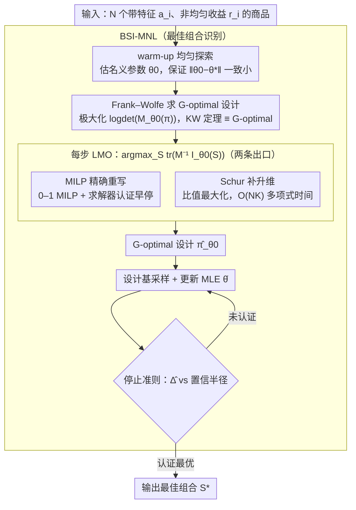

# Optimal Design for Multinomial Logit Model with Applications to Best Assortment Identification

**会议**: ICML2026  
**arXiv**: [2605.25592](https://arxiv.org/abs/2605.25592)  
**代码**: 待确认  
**领域**: others（多项式逻辑斯蒂 bandits / 实验设计 / 纯探索）  
**关键词**: MNL bandits, G-optimal design, Frank-Wolfe, 混合整数规划, 最佳组合识别

## 一句话总结
在多项式逻辑斯蒂（MNL）bandit 的组合动作空间里首次给出**计算可行**的 G-optimal 实验设计——把 Frank–Wolfe 线性最大化谱写成 0–1 MILP 或多项式时间 Schur 补松弛——并据此造出第一个面向"线性效用 + 非均匀收益"的最佳组合识别算法，样本复杂度 $\tilde{\mathcal{O}}(d\log N / \Delta^2)$。

## 研究背景与动机

**领域现状**：在线广告、推荐、动态定价里，决策者每一步要给用户**呈现一个子集** $S$（最多 $K$ 件商品），用户根据 MNL 模型挑一件（或不挑）。MNL bandit 文献近五年已经在 regret minimization 上做得很扎实（Agrawal 2019、Oh 2021、Perivier 2022、Lee 2024），但**纯探索/最佳组合识别**几乎是空白——尤其当商品带特征向量、效用线性 $\mathbf{a}_i^\top \theta^*$ 时，没人给出过样本复杂度界。

**现有痛点**：把线性 bandit 的标准武器——G-optimal design + Frank–Wolfe + KW 等价定理——直接搬过来会立刻撞墙：(1) MNL 的 Fisher information $\mathbf{I}_\theta(S) = \sum_{i\in S} p(i|S,\theta)(\mathbf{a}_i - \bar{\mathbf{a}}_\theta(S))(\mathbf{a}_i - \bar{\mathbf{a}}_\theta(S))^\top$ **不能拆成单臂之和**，它依赖整个子集通过 MNL 概率耦合；(2) 设计空间不再是 $N$ 个单臂，而是 $|\mathcal{S}|=\mathcal{O}(N^K)$ 个组合，Frank–Wolfe 每步要解的线性最大化谱（LMO）天然是 NP-hard 的组合优化；(3) 唯一相关工作 DopeWolfe（Thekumparampil 2024）用随机采样近似 LMO，但理论上仍要 $\mathcal{O}(N^K)$ 个样本才能保证近似误差，相当于没解决问题。

**核心矛盾**：实验设计要的是**统计效率**（让 Fisher 信息矩阵 $\mathbf{M}$ 在所有方向上都"覆盖好"），而组合动作空间要的是**计算效率**。两者之间没有现成桥梁。

**本文目标**：(i) 把 MNL 的 G-optimal design 写成一个能被现代求解器处理的 0–1 MILP 或多项式可解松弛；(ii) 利用得到的设计构造一个有样本复杂度保证的最佳组合识别算法。

**切入角度**：作者注意到 MNL Fisher 信息 $\mathbf{I}_\theta(S)$ 可以表示成**升维（lifting）** 后的简单二阶矩 $\widetilde{\mathbf{I}}_\theta(S) = \sum_{i\in S} p(i|S,\theta) \tilde{\mathbf{a}}_i \tilde{\mathbf{a}}_i^\top$（其中 $\tilde{\mathbf{a}}_i = (\mathbf{a}_i^\top, 1)^\top$）的 Schur 补；这把"减去均值"的非线性中心化项变成升维矩阵的一个线性块，让组合优化结构变得清晰。

**核心 idea**：把"难的非线性 LMO"分两条路出口——要精确就走 MILP（NP-hard 但有 solver 认证早停），要快就走 Schur 补松弛后的比值优化（多项式时间，误差有上界）。

## 方法详解

### 整体框架

整个 pipeline 围绕**局部 G-optimal design** 展开：(1) 给定名义参数 $\theta_0$（最佳组合识别里用 warm-up 探索阶段估出）；(2) 跑 Frank–Wolfe 极大化 D-optimal 目标 $f_{\theta_0}(\pi) = \log\det(\mathbf{M}_{\theta_0}(\pi))$（KW 等价定理保证它和 G-optimal 同一最优解）；(3) 每一步 FW 迭代解一个 LMO $S_m \in \arg\max_S \text{tr}(\mathbf{M}_m^{-1} \mathbf{I}_{\theta_0}(S))$——本文两个核心贡献就是给这个 LMO 写两种解法（MILP 精确重写 / Schur 补升维）；(4) 把整套设计包进 BSI-MNL（Best aSsortment Identification for MNL）算法：warm-up 估 $\theta_0$ → 设计基采样并更新 MLE → 停止准则认证后输出最佳组合 $S^*$。下图把 BSI-MNL 的外层流程与内部 FW/LMO 的两条出口画在一起。

### 关键设计

**1. MILP 精确重写 + 求解器认证早停：给组合 LMO 一条"理论可行也能跑"的出口**

Frank–Wolfe 每步要解的线性最大化谱 $\arg\max_S\text{tr}(\mathbf{M}_m^{-1}\mathbf{I}_{\theta_0}(S))$ 是在 $\mathcal{O}(N^K)$ 个组合上的优化，天然 NP-hard。本文先走精确路线：把它写成变量数和约束数都只是 $N$ 多项式的 0–1 MILP（Theorem 3.3）。具体做法是把 MNL 概率 $p(i|S,\theta_0)=w_i/\sum_{j\in S}w_j$ 的分母 $\sum_{j\in S}w_j$ 引入辅助变量、配合 big-M 约束，把 $\text{tr}(\cdot)$ 表达成关于 0–1 子集指示器的线性函数，中心化项 $\bar{\mathbf{a}}_\theta(S)\bar{\mathbf{a}}_\theta(S)^\top$ 则用 McCormick 包络线性化。MILP 最坏情形虽 NP-hard，但工业级分支定界求解器在跑的过程中同时维护当前最优可行解和任意解的上界，两者之差就是 solver-certified optimality gap，可在用户指定 $\epsilon_{\text{LMO}}$ 时安全早停。配合 Proposition 3.4 给出的 FW 总迭代数 $\tilde{\mathcal{O}}(d/\tilde\epsilon)$（$\tilde\epsilon=\epsilon-\epsilon_{\text{LMO}}/d$），即便每步 LMO 都早停近似，整体设计仍是 $\epsilon$-准确——这把"理论可行 vs 实际可跑"之间的最后一公里打通，让 $N\sim10^3$、$K\sim5$ 的问题秒级出认证最优解。

**2. Schur 补升维 + 比值最大化：用统计效率换严格多项式时间**

MILP 给了精度极限，但对超大 $N$ 仍没有时间保证，所以本文给第二条出口。关键观察是 MNL Fisher 信息其实是升维矩阵的 Schur 补：定义 $\tilde{\mathbf{a}}_i=(\mathbf{a}_i^\top,1)^\top\in\mathbb{R}^{d+1}$ 和升维 Fisher $\widetilde{\mathbf{I}}_{\theta_0}(S)=\sum_{i\in S}p(i|S,\theta_0)\tilde{\mathbf{a}}_i\tilde{\mathbf{a}}_i^\top$，则原 Fisher 满足 $\mathbf{I}_{\theta_0}(S)=\bar{\mathbf{A}}_{\theta_0}(S)-\bar{\mathbf{a}}_{\theta_0}(S)\bar{\mathbf{a}}_{\theta_0}(S)^\top$。把 LMO 换成升维版后，目标塌缩成一个比值形式

$$\text{tr}(\widetilde{\mathbf{M}}_m^{-1}\widetilde{\mathbf{I}}_{\theta_0}(S))=\frac{\sum_{i\in S}w_i s_i}{\sum_{j\in S}w_j},\quad s_i=\tilde{\mathbf{a}}_i^\top\widetilde{\mathbf{M}}_m^{-1}\tilde{\mathbf{a}}_i,\ w_i=\exp(\mathbf{a}_i^\top\theta_0)$$

这正是经典的 MNL ratio-of-sums assortment optimization，有 $\mathcal{O}(NK)$ 时间精确算法（Rusmevichientong 2010）。代价是升维设计与真设计有差距，但该差距由 mismatch 矩阵 $\Delta_{\theta_0}(\pi)=\widehat{\mathbf{M}}_{\theta_0}(\pi)-\mathbf{M}_{\theta_0}(\pi)$ 控制，论文给出显式 PSD 上界。"先 lift 再 Schur 补"在矩阵优化里是常见套路，但用到 MNL bandit 实验设计上是首次。

**3. BSI-MNL：基于设计的最佳组合识别算法**

有了可解的 LMO，就能把线性 bandit 经典的 G-optimal pure exploration 模板（Soare 2014, Fiez 2019）首次落到 MNL 上，识别收益最大的组合 $S^*=\arg\max_S R(S,\theta^*)$（$R(S,\theta)=\sum_{i\in S}r_ip(i|S,\theta)$ 含非均匀收益 $r_i$）。算法分三段：先做短暂均匀探索拿到名义参数 $\theta_0$、保证 $\|\theta_0-\theta^*\|$ 一致小；再调用上面的 G-optimal design $\hat\pi_{\theta_0}$ 按它采样组合并更新 MLE；最后用"最佳与次佳收益差 $\hat\Delta$ 配合 $\|\cdot\|_{\mathbf{M}^{-1}}$ 置信半径"的停止准则，一旦认证最优即停。最终样本复杂度 $\tilde{\mathcal{O}}(d\log(N/\delta)(\Delta_{\min}^{-2}+(\kappa\Delta_{\min})^{-1}))$，小 gap 区简化为 $\tilde{\mathcal{O}}(d\log N/\Delta_{\min}^2)$（Theorem 4.4）。其中 $\Delta_{\min}^{-2}$ 主项与无 context 情形匹配、对 $N$ 只有 log 依赖，正是设计基采样相对均匀采样的核心优势；多出的 $(\kappa\Delta_{\min})^{-1}$ 项则是 logistic 类反馈"难辨别区"的固有难度，作者没有掩盖。

### 损失函数 / 训练策略
最大化负对数似然 $\ell_t(\theta) = -\sum_{i\in S_t} y_{ti}\log p(i|S_t,\theta)$ 做 MLE，停止规则基于 GLRT 风格的统计量 $\|\hat\theta - \theta\|_{\mathbf{V}_t}^2$，$\mathbf{V}_t$ 是累计 Fisher。无需训练神经网络，整个算法是凸优化 + 设计求解。

## 实验关键数据

> 论文以理论为主，主文没给出实验图表，下面按理论对比口径整理。

### 主实验：样本复杂度对比

| 设置 | 算法 | 样本复杂度 | 是否需特征 | 是否覆盖非均匀收益 |
|------|------|------------|-----------|--------------------|
| MNL bandit, context-free | Saure & Zeevi (2013), Yang (2021) | $\tilde{\mathcal{O}}(N/\Delta_{\min}^2)$ | 否 | 部分 |
| 线性 bandit 纯探索 | Soare et al. (2014) | $\tilde{\mathcal{O}}(d\log N/\Delta_{\min}^2)$ | 是 | N/A |
| MNL bandit, 线性效用 | **BSI-MNL（本文）** | $\tilde{\mathcal{O}}(d\log N/\Delta_{\min}^2)$ | 是 | 是 |

### 消融实验：LMO 实现方式对比

| LMO 实现 | 单步复杂度 | FW 总迭代 | 最坏情形保证 | 实际表现 |
|----------|------------|-----------|--------------|----------|
| 枚举 | $\mathcal{O}(N^K)$ | $\tilde{\mathcal{O}}(d/\epsilon)$ | 精确 | $N>30$ 即不可行 |
| DopeWolfe (Thekumparampil 2024) | 采样 $\mathcal{O}(N^K)$ | 预先指定 | $\epsilon$-准确（高概率） | 仍卡在组合维数 |
| **MILP + 早停（本文）** | NP-hard（实际秒级） | $\tilde{\mathcal{O}}(d/\tilde\epsilon)$ | 精确或 solver-certified $\epsilon_{\text{LMO}}$ | 适合 $N\sim 10^3$ |
| **Schur 补松弛（本文）** | $\mathcal{O}(NK)$ | $\tilde{\mathcal{O}}(d/\epsilon)$ | $\epsilon$-准确 + 有界设计偏差 | 对超大 $N$ 仍可扩展 |

### 关键发现
- **$\log N$ 是 context 化的全部胜利来源**：从 context-free 的 $\mathcal{O}(N)$ 降到 $\mathcal{O}(\log N)$ 完全靠特征结构，这与线性 bandit 的直觉一致。
- **两条 LMO 路径是"精度—可扩展"的两端**：MILP 路线给精度极限，松弛路线给规模极限；KW 等价定理保证只要 $g_{\theta_0}(\pi) \le (1+\epsilon)d$ 设计就 $\epsilon$-最优。
- **设计的支持集大小有界**：Proposition 3.2 证明存在最优设计 $|\text{supp}(\pi^*_{\theta_0})| \le d(d+1)/2$——意味着实际部署里只需要轮换很少的组合即可达到 G-optimal，对工程实现极友好。

## 亮点与洞察
- **lifting + Schur 补这套手法的迁移价值高**：任何"Fisher 信息 = 二阶矩 - 均值外积"的结构（generalized linear, softmax, Plackett–Luce）都可以套用，把中心化项推到升维矩阵的一个块里以解锁线性化；对未来扩展到 ranking bandits、Plackett–Luce bandits 是直接的入口。
- **求解器认证早停的工程意义被严肃对待**：理论论文很少把 MILP 求解器的 dual bound 当成"理论工具"使用，本文用 Proposition 3.4 把"实际能跑多快"和"理论近似精度"做了量化绑定，是个值得借鉴的写作策略。
- **匹配线性 bandit 的渐近最优界**：$\tilde{\mathcal{O}}(d\log N/\Delta_{\min}^2)$ 在 MNL bandit 里之前从未达成；这意味着"组合 + MNL 反馈"在最佳组合识别上**没有额外样本代价**——一个相当强的结论。
- **诚实地处理 $\kappa$ 项**：复杂度里多出的 $(\kappa\Delta_{\min})^{-1}$ 项与 MNL 的"难辨别区"有关，作者没掩盖，并把它说清楚是 logistic 类反馈的固有难度，与 Faury 等人对 logistic bandit 的处理一脉相承。

## 局限与展望
- **依赖名义参数 $\theta_0$**：BSI-MNL 第一段 warm-up 探索的复杂度被吸收到 $\tilde{\mathcal{O}}$ 里，但实际里它可能不小；如果 warm-up 估出来的 $\theta_0$ 离 $\theta^*$ 远，G-optimal 设计可能严重偏离。
- **MILP 不是真的多项式**：虽然有 solver-certified gap 兜底，但对 $N>10^4$、$K\ge 10$ 的 LMO，求解时间没保证。
- **Schur 松弛的误差界依赖参数范围**：mismatch 上界依赖 $\|\theta_0\|$、$\|\mathbf{a}_i\|$ 等量，在极端长尾特征下界可能松。
- **只考虑组合大小约束**：实际推荐里还有 cardinality + 兼容性 + 多样性等约束，能否被 MILP 框架原生支持仍待验证。

## 相关工作与启发
- **vs DopeWolfe (Thekumparampil 2024)**: 他们用随机化避免精确 LMO，但样本规模仍是 $\mathcal{O}(N^K)$；本文用 MILP + 松弛真正破了组合维数障碍。
- **vs Soare et al. (2014) / Fiez et al. (2019)**: 线性 bandit 纯探索奠基工作；本文把 G-optimal design 模板搬到 MNL 上，证明结构性优势依旧保留。
- **vs Yang et al. (2021)**: context-free MNL 最佳组合识别；本文用特征结构把复杂度的 $N$ 依赖降到 $\log N$。
- **vs Mukherjee et al. (2024)**: 他们给出矩阵值 KW 等价定理；本文在 MNL 下做了对应的 Proposition 3.2，把工具具体化到组合 bandit。
- **vs Faury et al. (2022) Logistic bandit**: $\kappa$ 出现在样本复杂度里是 logistic 类反馈的共性，本文继承了这一处理。

## 评分
- 新颖性: ⭐⭐⭐⭐⭐ 第一个让 MNL bandit 实验设计在组合空间里"理论上漂亮 + 实际能跑"的工作。
- 实验充分度: ⭐⭐⭐ 主文几乎全理论，实验细节都在附录，缺乏与 DopeWolfe 的直接 wall-clock 对比。
- 写作质量: ⭐⭐⭐⭐⭐ 定理与算法环环相扣，两条 LMO 路径的优劣讲得很清楚。
- 价值: ⭐⭐⭐⭐ 给推荐 / 广告 / 定价系统的纯探索阶段提供了可执行的设计与样本复杂度参考。

## 评分
- 新颖性: 待评

## 相关论文

- [\[ICML 2025\] Near Optimal Best Arm Identification for Clustered Bandits](../../ICML2025/others/near_optimal_best_arm_identification_for_clustered_bandits.md)
- [\[ICML 2026\] Optimal Regularization for Performative Learning](optimal_regularization_for_performative_learning.md)
- [\[ICML 2026\] Conditional KRR: Injecting Unpenalized Features into Kernel Methods with Applications to Kernel Thresholding](conditional_krr_injecting_unpenalized_features_into_kernel_methods_with_applicat.md)
- [\[ICML 2026\] Comprehensive AI Governance Requires Addressing Non-Model Gains](comprehensive_ai_governance_requires_addressing_non-model_gains.md)
- [\[ICML 2025\] Optimal Auction Design in the Joint Advertising](../../ICML2025/others/optimal_auction_design_in_the_joint_advertising.md)

<!-- RELATED:END -->

<!-- RELATED:START -->

## 相关论文

- [\[ICML 2025\] Near Optimal Best Arm Identification for Clustered Bandits](../../ICML2025/learning_theory/near_optimal_best_arm_identification_for_clustered_bandits.md)
- [\[ICML 2026\] Conditional KRR: Injecting Unpenalized Features into Kernel Methods with Applications to Kernel Thresholding](conditional_krr_injecting_unpenalized_features_into_kernel_methods_with_applicat.md)
- [\[ICML 2026\] Towards Optimal Robustness in Learning-Augmented Paging](towards_optimal_robustness_in_learning-augmented_paging.md)
- [\[ICML 2026\] Simple Algorithms for Bad Triangle Transversals with Applications to Correlation Clustering](simple_algorithms_for_bad_triangle_transversals_with_applications_to_correlation.md)
- [\[ICML 2025\] Provably Efficient Algorithm for Best Scoring Rule Identification in Online Principal-Agent Information Acquisition](../../ICML2025/learning_theory/provably_efficient_algorithm_for_best_scoring_rule_identification_in_online_prin.md)

<!-- RELATED:END -->
