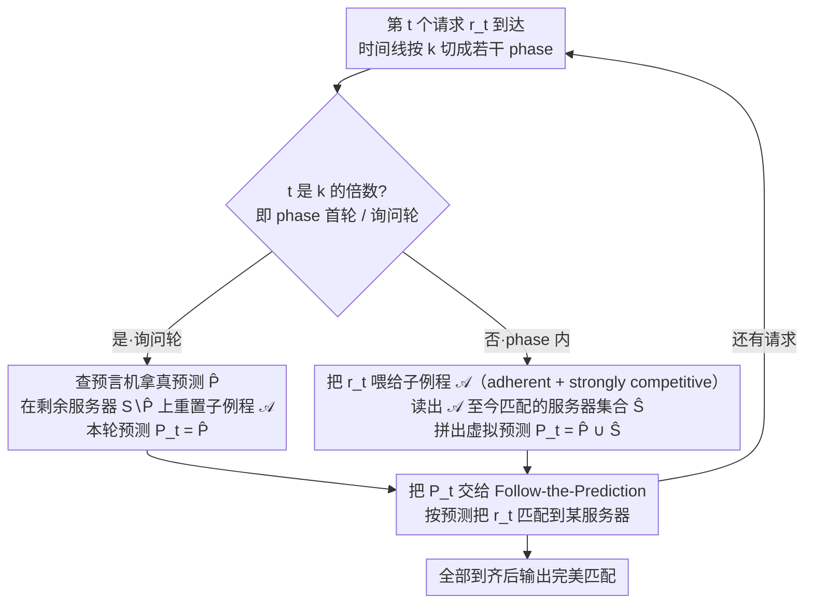

# Parsimonious Learning-Augmented Online Metric Matching

**会议**: ICML 2026  
**arXiv**: [2605.26886](https://arxiv.org/abs/2605.26886)  
**代码**: 无（论文为理论 + 数值实验）  
**领域**: 在线优化 / 学习增强算法 / 在线度量匹配  
**关键词**: 在线度量匹配, 学习增强算法, 节俭预测, Follow-the-Prediction, 竞争比

## 一句话总结
本文回答了 Im et al. (2022) 留下的公开问题：把"按动作预测的"在线度量匹配带进"节俭预测"框架——预测被昂贵地按 $k$ 步一次发放——并通过 Follow-the-Prediction 框架 + 自动补齐"虚拟预测"的元算法，给出与已知下界基本匹配的确定性和随机性竞争比上界。

## 研究背景与动机

**领域现状**：在线度量匹配（Online Metric Matching, OMM）是在线优化里最经典的问题之一：$n$ 个服务器位置先知道，$n$ 个请求依次到达，每个请求要立刻、不可撤回地匹配给一个尚未占用的服务器，目标是最小化总匹配距离。30 年前 Kalyanasundaram–Pruhs 与 Khuller 已经给出 $(2n-1)$ 确定性竞争比，Bansal et al. (2014) 把随机算法推到 $O(\log^2 n)$，且这些界（在常数因子内）紧。

**现有痛点**：经典上界与下界的鸿沟主要来自"对未来一无所知"。学习增强（learning-augmented）框架希望借助预测打破最坏情形，Antoniadis et al. (2023b) 的 Follow-the-Prediction（FtP）算法在每一轮都向预言机要一次 action 预测 $P_t$，然后保证 $9 \cdot \min\{\text{cost}(\text{OPT}) + 2\eta, (2n-1)\text{cost}(\text{OPT})\}$。问题是——预测自身往往要跑一个大模型，按轮调用代价惊人。

**核心矛盾**：好预测能极大缩短上下界鸿沟，但调一次预测就要烧一次推理。如何在"预测次数受限/必须稀疏"的约束下，仍尽可能榨干已用预测的价值？这是 Im et al. (2022) 在 caching 场景里开的口子，本文把它推广到 OMM。

**本文目标**：在两种"节俭"机制下设计 OMM 算法并给出竞争比上下界——(i) well-separated queries：每 $k$ 轮才能查一次；(ii) bounded budget：总预测次数不超过 $B$。

**切入角度**：FtP 在每一轮都需要一个预测 $P_t$，那能不能"在两个真预测之间用算法自我合成虚拟预测"？只要这个合成器对中间匹配质量有保障，就能把 FtP 的分析延展过去。

**核心 idea**：定义两个新算法性质——adherence（中间匹配的"集合距离"接近最优最大匹配）与 strong competitiveness（中间匹配代价接近最优最大匹配）——并证明任何同时满足这两条的子例程都能"插补"出可用的虚拟预测，从而把单次预测的功效在 $k$ 轮内继续吃干。

## 方法详解

### 整体框架

整体算法是 FtP 的"节俭化"包装。把时间线按 $k$ 切成若干 phase：每个 phase 的第一轮去问预言机拿真预测 $\widehat P = P_{ik}$，phase 内剩余的 $k-1$ 轮用一个辅助子例程 $\mathcal A$ 在"剩余服务器 $S \setminus \widehat P$、阶段内到达请求"上跑，把 $\mathcal A$ 当前匹配到的服务器集合 $\widehat S$ 与 $\widehat P$ 拼起来作为这一轮的"虚拟预测" $P_t = \widehat P \cup \widehat S$。然后整个 $\{P_t\}_t$ 喂给标准 FtP 即可。直觉上，$\widehat P$ 给出"大方向"，$\mathcal A$ 在局部用真实到达信息打磨细节，二者拼接成每一轮都能用的预测序列。

### 关键设计

**1. Adherence + Strong Competitiveness：刻画"可当虚拟预测器用"的子例程**

要把单次真预测的价值在 $k$ 轮里继续榨干，得先说清楚"用算法合成的中间匹配"满足什么条件才能被 FtP 的分析吸收。本文给子例程 $\mathcal A$ 提出两条结构性质。固定瞬时匹配 $\mathcal A_t$（记其匹配过的服务器集合为 $S_t$、请求集合为 $R_t$，$\mathcal M_t$ 是恰好匹配 $R_t$ 的所有最大匹配）：称 $\mathcal A$ 是 $\gamma$-adherent，若任意 $t$ 都有 $\mathsf{dist}(S_t,R_t)\le\gamma\cdot\min_{M\in\mathcal M_t}\mathsf{cost}(M)$；称 $\mathcal A$ 是 strongly $\rho$-competitive，若 $\mathbb E[\mathsf{cost}(\mathcal A_t)]\le\rho(t)\cdot\min_{M\in\mathcal M_t}\mathsf{cost}(M)$。前者控制"中间状态在集合层面接近最优"、后者控制"中间状态的累积代价接近最优"。这两条之所以有用，是因为传统 OMM 只在终点 $t=n$ 看输出，但 Kalyanasundaram–Pruhs、Nayyar–Raghvendra、Bansal 等经典算法其实"顺便"在每一时刻都维持着好的部分匹配——把这种"过程友好"显式化，它们就能即插即用地充当虚拟预测器。

**2. Follow-the-Prediction 的节俭化元算法：用子例程补齐缺失的 $k-1$ 个预测**

FtP 要求每轮都有一个预测 $P_t$，直接套用到节俭场景会因为缺了 $k-1$ 个真预测而代价无界。本文的元算法把时间线按 $k$ 切成 phase：每个 phase 首轮去预言机拿真预测 $\widehat P$，并在剩余服务器 $S\setminus\widehat P$ 上重置一个新的 $\mathcal A$ 实例；之后每个非询问轮把请求喂给 $\mathcal A$、读出它当前匹配的服务器集合 $\widehat S$，拼成虚拟预测 $P_t=\widehat P\cup\widehat S$ 交给 FtP。这一构造保证 $|P_t|=t$ 且 $P_t\subseteq S$，是合法预测。分析的关键是 Lemma 3.2 把 FtP 代价用 $\sum_t\mathsf{dist}(P_t,P_{t-1}\cup\{r_t\})$ 控制，按 phase 拆开后跨 phase 部分用 adherence + 三角不等式（Lemma 3.5）、phase 内部分用 strong competitiveness（Lemma 3.4）分别约束，最终给出统一界

$$(1+\gamma+\rho(k-1))\,\text{cost}(\text{OPT}) + (2+\gamma+\rho(k-1))\,\eta(Q)$$

直觉上 $\widehat P$ 给出大方向、$\mathcal A$ 用阶段内真实到达信息打磨细节，二者拼接成的代理预测"足够接近真预测"，于是 FtP 的逐轮三角不等式才能平滑接上。

**3. 配套下界：在 star metric 上推广经典硬实例，证明上界本质最优**

节俭框架很容易做出"看起来更好"的上界，但不配下界就无法判断节俭代价是否已被吃干。本文在 $n$ 个叶子的 star metric 上构造对手序列：即便确定性算法、预测完全准确，在最多 $B$ 次询问下也至少损失 $\frac{2n}{B+1}-1$ 倍（Theorem 4.1），在 well-separated 询问机制下至少损失 $2k-1$ 倍（Theorem 4.2）；随机算法侧给出 $\Omega(\log k)$（well-separated）与 $1+o(\frac{\log(n/B)}{B})$（bounded budget）的下界（Theorem 4.3–4.4）。这套统一的对抗构造把上下界对齐，使 Theorem 1.1 的 $2k-1$ 常数因子在确定性 + perfect prediction 下近乎紧——这在只给上界就收尾的 learning-augmented 文献里相对少见。

### 训练策略 / 鲁棒化

为了应对预测完全错乱的情况，作者沿用 Fiat–Rabani–Ravid 的 combination trick：把"重预测"的 Ours 与"无预测"的 baseline（确定性 $(2n-1)$-competitive 或 Greedy）做 9 倍 min 组合（Theorem 2.3），换来全局鲁棒性。这一组合既是上界 $9 \cdot \min\{\cdot, \cdot\}$ 中那个 $9$ 的来源，也是实验里 Comb-Comp / Comb-Greedy 的实现基础。

## 实验关键数据

### 主实验：合成 & 真实数据上的节俭收益（perfect prediction，$k$ 从 1 扫到 20）

| 实例类 | 度量 | 评估目标 | Ours 表现 |
|--------|------|---------|-----------|
| Line | 1D 绝对差 | $k\uparrow$ 时近似比的退化曲线 | 随 $k$ 单调上升但远低于 Comp/Greedy |
| Plane | 2D 欧氏 | 同上 | 同样优于其他 baseline，Comb 系列退化更慢 |
| Taxi (Chicago 2013–2023) | Manhattan | 真实订车数据 | Ours 全程领先，Comb-Greedy 偶尔被 Greedy 反超 |

注：所有实例固定 $n=100$ 服务器 + $100$ 请求，结果是 100 个独立实例上的平均比值。论文同时把 $k=1$ 退化情况验证为 Antoniadis et al. (2023b) 的 FtP。

### 消融 / 噪声鲁棒：噪声半径 $r$ 扫描下的退化曲线

| 配置 | 在准确预测附近 | 在高噪声下 | 解释 |
|------|----------------|-----------|------|
| Ours（$k=1$，等价 FtP） | 接近最优 | 退化最剧烈 | 每轮都吃预测，噪声放大最严重 |
| Ours（$k$ 较大） | 略劣于 $k=1$ | 退化坡度显著变缓 | 用预测频次低，对单次错预测的敏感度下降 |
| Comb-Comp / Comb-Greedy | 与 Ours 接近 | 退化最缓 | fallback 算法兜底 |
| Comp / Greedy | 与 Ours 持平或略差 | 与噪声无关 | 不读预测 |

### 关键发现

- 节俭的真正代价在 perfect prediction 下是"竞争比从 $9$ 量级抬到 $\Theta(k)$"，但换来的是预测调用从 $n$ 次砍到 $\lceil n/k \rceil$ 次，这对推理成本高的预测模型极有吸引力。
- 随机算法侧 $O(\log n \cdot \log k)$ 的上界揭示了一个有趣分解：$\log n$ 来自 HST 嵌入扭曲，$\log k$ 来自 phase 内子例程在 $k-1$ 个请求上的随机匹配，两者相乘。
- combination 算法在实验里偶尔比单独 fallback 更差（如 Plane / Taxi 上 Comb-Greedy 输给 Greedy），说明 9 倍因子并非紧、切换开销在中等差距时可能盖过收益，论文将此列为未来改进方向。
- 在 line 和 2-HST 等结构化度量上，Theorem 1.2 的随机界可以进一步压到 $O(\log k)$（Corollary 3.8–3.9），意味着度量结构越好，节俭代价越温和。

## 亮点与洞察

- 把"过程友好"的两条性质显式化（adherence + strong competitiveness），既给出了一组可即插即用的子例程清单，也为后续把节俭框架移植到其他在线问题（如 $k$-server、metrical task systems）提供了模板。
- "用算法当虚拟预测器"的思路非常巧妙：经典在线算法本身就是一个"对未来无信息时的最佳猜测"，把它当预测器，相当于在没有真预测时退化到经典算法、有真预测时叠加修正，行为是单调可解释的。
- 上下界基本配对是这类工作里相对少见的——很多 learning-augmented 论文只给上界就完事，而这里通过推广 star metric 的对抗构造，使 Theorem 1.1 的 $2k-1$ 因子在确定性 + perfect prediction 下基本紧。
- 可迁移：节俭机制 + 虚拟预测器的两段式设计，可以原样套到学习增强 caching 之外的多类在线问题；只要能定义合适的"中间匹配/中间配置"度量，并找出 adherent + strongly competitive 的子例程即可。

## 局限与展望

- 随机算法上界仍带 $\log n$ 因子，下界只到 $\Omega(\log k)$；作者明确希望去掉 $\log n$ 或证明它不可避免。
- combination 算法的 9 倍乘性常数偏大，且实验里在 Plane/Taxi 上有"组合后反而变差"的反例，说明现有 robust-consistent 折中并非紧的，有改进空间。
- 当前预测模型是 Antoniadis et al. (2023b) 的 action prediction，预测的是"前 $t$ 轮 OPT 占用的服务器集合"。是否存在更弱、更便宜、却仍可被节俭利用的预测语义（如只预测下一个服务器、或仅预测优先级），是开放问题。
- 仅在合成 + 单一真实数据集（Chicago Taxi）上验证；ride-hailing 以外更复杂的资源分配场景（如内容分发、广告竞拍）能否复现节俭收益尚需检验。

## 相关工作与启发

- **vs Antoniadis et al. (2023b)（FtP）**：本文是其严格扩展，$k=1$ 时退化为原算法；新增的"虚拟预测构造"为 FtP 提供了在非密集预测场景下的可用形式。
- **vs Im et al. (2022)（parsimonious caching）**：同样在节俭框架下做经典在线问题，但 caching 的状态是"集合"，OMM 的状态是"匹配"，本文创新点在于为匹配定义了 adherence/strong competitiveness 这两条专属的过程性度量。
- **vs Sadek & Eliás (2024)（parsimonious MTS/caching）**：沿用了 well-separated queries 的形式，但 OMM 不能像 MTS 那样直接复用预测，必须显式地构造虚拟预测，所以工程门槛和分析复杂度都更高。
- **vs Bansal et al. (2014)（randomized OMM）**：作者直接把 Bansal 的 2-HST 算法当作 strongly $O(\log t)$-competitive 子例程，是"已有在线算法 → 节俭子例程"的最佳示例。

## 评分
- 新颖性: 待评
- 实验充分度: 待评
- 写作质量: 待评
- 价值: 待评

<!-- RELATED:START -->

## 相关论文

- [\[NeurIPS 2025\] Learning-Augmented Online Bipartite Fractional Matching](../../NeurIPS2025/learning_theory/learning-augmented_online_bipartite_fractional_matching.md)
- [\[ICML 2026\] Towards Optimal Robustness in Learning-Augmented Paging](towards_optimal_robustness_in_learning-augmented_paging.md)
- [\[ICML 2026\] Realizable Bayes-Consistency for General Metric Losses](realizable_bayes-consistency_for_general_metric_losses.md)
- [\[AAAI 2026\] A Switching Framework for Online Interval Scheduling with Predictions](../../AAAI2026/learning_theory/a_switching_framework_for_online_interval_scheduling_with_pr.md)
- [\[ICML 2025\] Learning-Augmented Algorithms for MTS with Bandit Access to Multiple Predictors](../../ICML2025/learning_theory/learning-augmented_algorithms_for_mts_with_bandit_access_to_multiple_predictors.md)

<!-- RELATED:END -->
