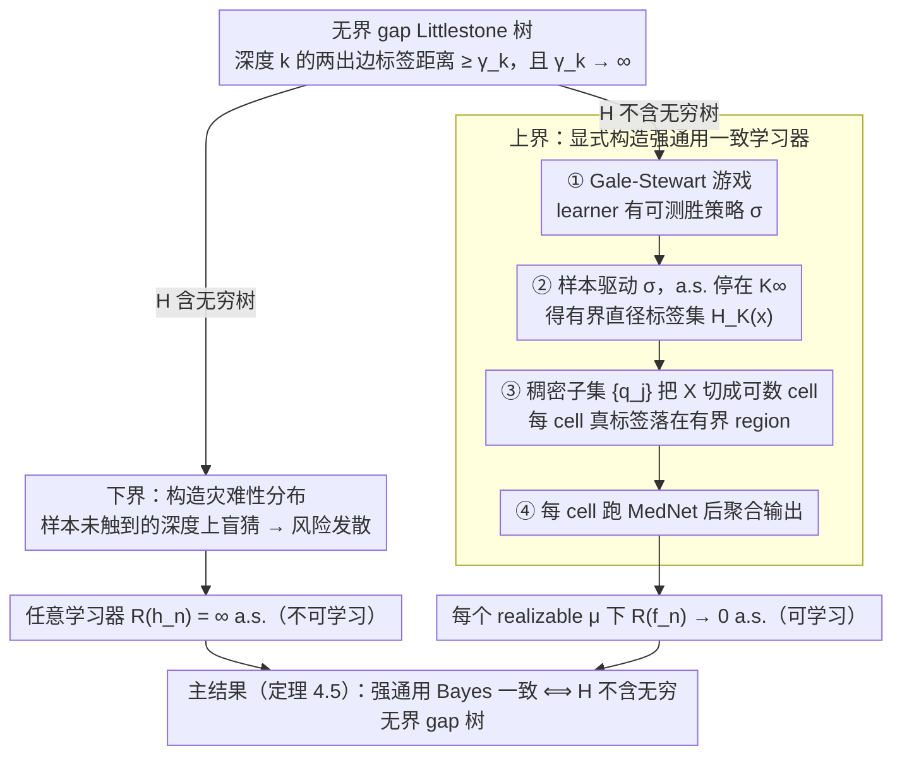

# Realizable Bayes-Consistency for General Metric Losses

**会议**: ICML 2026  
**arXiv**: [2605.03823](https://arxiv.org/abs/2605.03823)  
**代码**: 无  
**领域**: 学习理论 / 度量损失 / Bayes 一致性  
**关键词**: 可学习性, 度量损失, Littlestone tree, 通用一致性, Gale-Stewart game

## 一句话总结
本文对"在一般（可能无界）度量损失下，假设类 $\mathcal{H}$ 何时存在分布无关的强通用 Bayes 一致学习算法"这一开放问题在 realizable 情形下给出锐刻画——充分必要条件是 $\mathcal{H}$ 不包含一种新的"无界 gap Littlestone 树"组合障碍。

## 研究背景与动机

**领域现状**：通用一致性 (universal consistency) 是统计学习理论里一个很经典的目标——能不能造一个分布无关的算法，使得对任意数据分布它的风险都几乎必然收敛到最优。对 0-1 分类，Bousquet et al. (2020) 用 Littlestone 树 + Gale-Stewart 游戏给出了完整刻画；多分类被 Hanneke et al. (2023) 推广；实值回归（绝对损失）被 Attias et al. (2024b) 用 scaled Littlestone tree 刻画。这一脉沿着"组合障碍 ↔ 不可学习"思路推进。

**现有痛点**：上述结果都是有界损失或固定 scale，但很多实际任务（结构化输出、edit distance、cost-sensitive 预测）天然在度量标签空间 $(\mathcal{Y}, \ell)$ 上、且 $\ell$ 可能无界。在无界损失下，realizability 这种"看起来很强"的假设也压不住"小概率 + 大代价"的灾难性 rare event——学习者可能在一个概率以 $1/n$ 衰减的事件上犯错，但损失 scale 涨得比 $n$ 还快，期望风险照样发散到无穷。

**核心矛盾**：在无界度量损失下，"概率上犯错少"和"风险小"之间脱钩了。Tsir Cohen & Kontorovich (2022) 提出 MedNet 算法，但需要 BIE（bounded-in-expectation）条件并留下了 open problem：什么是 $\mathcal{H}$ 上分布无关 Bayes 一致性的真正充要条件？一个朴素猜想是 $R^* < \infty$，但本文 Section 3 给出反例：在 $\mathcal{X} = (0,1)$、$\mathcal{Y} = \mathbb{N}_0$、$\mathcal{H}$ 在每段 $I_k = (2^{-k}, 2^{-(k-1)})$ 上只能取 $\{0, 2^{2k+1}\}$ 的构造下，$R^* = 0$ 但无任何学习器能强一致。

**本文目标**：在 realizable 情形下，找出对一般度量损失（可能无界）的强通用 Bayes 一致性的充要组合刻画，封闭 Tsir Cohen & Kontorovich (2022) 的开放问题（realizable case）。

**切入角度**：把 Attias et al. 的 scaled Littlestone tree 思想推到 metric loss、并允许 gap 沿深度发散——也就是"如果学习者在某些区域被迫在距离越拉越大的两个标签间盲猜，那一定输"。组合上这对应一个 "非递减 $(\gamma_k)$-Littlestone tree with $\gamma_k \to \infty$"。

**核心 idea**：realizable 强通用 Bayes 一致性 ⟺ $\mathcal{H}$ 不存在无穷的 non-decreasing-$\gamma_k$ Littlestone tree（其中 $\gamma_k \to \infty$）。

## 方法详解

### 整体框架

定理 4.5（主结果）：在 Polish $(\mathcal{X}, \rho)$、$(\mathcal{Y}, \ell)$ 和带紧参数空间 $\Theta$、$h$ 在 $\theta$ 上连续的 $\mathcal{H}$ 下，下列等价：（1）存在分布无关学习规则 $\mathcal{A}$ 使得对每个 realizable $\mu$ 都有 $R_\mu(h_n) \to 0$ a.s.；（2）$\mathcal{H}$ 不含无穷 non-decreasing $(\gamma_k)$-Littlestone tree（$\gamma_k \to \infty$）。整个证明围绕一个组合二分展开——$\mathcal{H}$ 到底含不含这棵"无界 gap 树"：含 ⟹ 走下界，构造灾难性分布把任意学习器逼到风险发散；不含 ⟹ 走上界，把 learner 的胜策略落地成一个显式的、可数局部化的学习器。两个方向合起来正好夹出充要刻画。

### 关键设计

**1. 无界 gap Littlestone 树（Unbounded-gap Littlestone Tree）：把经典 Littlestone 树的 label gap 沿深度放到无穷，刻画无界度量损失下独有的"对抗能力 × 灾难规模"组合障碍**

之前的 scaled Littlestone tree（Attias et al.）把 gap 当成固定 scale 参数，只刻画有界损失下的对抗复杂性。本文的关键 insight 是：在无界损失下光有对抗能力不够，必须同时捕捉"对抗能造成多大代价"。于是它把 binary label 推广成"标签距离 $\geq \gamma_k$"，并允许 $\gamma_k \uparrow \infty$——深度 $k$ 的内部节点标 instance $x_{k,i}$，两条出边的标签满足 $\ell(y_{k,i,1}, y_{k,i,2}) \geq \gamma_k$，且每条有限 root-to-leaf 路径都被某 $h \in \mathcal{H}$ 实现，"realizable infinite" 进一步要求每条无穷路径被单一 $h$ 实现。配套的 Lemma 4.3（bridging lemma）在 compact $\Theta$ + $h$ 连续条件下证明：有限前缀可实现能自动推出无穷路径可实现（用紧空间的有限交性质）。gap 沿深度发散，正好对应"对抗能在越深的位置造成越大代价"这一无界损失独有的现象。

**2. 下界证明：从一棵 unbounded-gap tree 构造出让任意学习器风险发散到无穷的灾难性分布**

这是经典 Littlestone 论证（adversary 把学习器逼到必须盲选）的 metric-loss 版升级。因为 $\gamma_k \to \infty$，可以选深度 $k_1 < k_2 < \cdots$ 使 $\gamma_{k_m} \geq m^2$，给深度 $k_m$ 节点分配概率 $p_m \propto 1/m^2$，再扔独立公平硬币 $(B_k)$ 决定每个 $k_m$ 节点上哪条出边是真标签（tree 的可实现性保证这种随机标签确实被某 $f_B^* \in \mathcal{H}$ 实现）。对任何固定 $n$，样本 $S_n$ 最多触到 $n$ 个 $k_m$，剩下无穷多个 $k_m$ 上 $B_{k_m}$ 对学习器仍是 fresh 公平硬币——在这些未见深度上，学习器盲猜两个相距 $\geq m^2$ 的标签，三角不等式给出条件期望损失 $\geq m^2/2$，乘上概率 $p_m\cdot 1/2 = \Theta(1/m^2)$ 贡献 $\Theta(1)$。第二 Borel-Cantelli 引理保证无穷多次"坏事件"几乎必然发生，故 $R(h_n) = \infty$ a.s.。关键升级在于：盲选本身的代价以 $\gamma_k$ 发散，所以不止错误率打不下来，连风险都打不到有限。

**3. 上界证明：Gale-Stewart 游戏 + 字典分割 + MedNet 嵌套，显式造一个强通用 Bayes 一致学习器**

直接处理无界 metric loss 太难，但只要能把问题"局部化"——证明对每个 $x$、真标签几乎必落在某个有界 region 里——就能复用现成的 bounded-range 算法。四步走：**第一步**把"是否存在无穷 tree"翻译成 Gale-Stewart 游戏（adversary 每轮出 $(\xi_k, \eta_{k,1}, \eta_{k,2})$ 且 $\ell(\eta_{k,1}, \eta_{k,2}) \geq \gamma_k$、需有某 $h$ 同时一致，learner 选一边，learner 赢当 adversary 无合法着），无 tree 等价于 learner 有可测胜策略 $\sigma$；**第二步**用样本驱动 $\sigma$，扫描 $S_\infty$ 遇到合法着就推进游戏，因 $\sigma$ 是胜策略几乎必然有限步停在 $K_\infty < \infty$；**第三步**定义 history-conditional label set $H_k(x)$，引理 6.2 证明 $\text{diam}(H_k(x)) \leq \gamma_{k+1}$、引理 6.3 证明 $\Pr(Y \in H_{K_\infty}(X)) = 1$ a.s.；**第四步**用 $\mathcal{Y}$ 的可数稠密子集 $\{q_j\}$ 把 $\mathcal{X}$ 切成可数 cell，每 cell 的真实标签都在有界 region $\mathcal{Y}_{k,j} = \{y : \ell(y, q_j) \leq 2\gamma_{k+1}\}$ 里，在每个 cell 上跑 MedNet（Tsir Cohen & Kontorovich 2022 的有界范围学习器），并用 sample-split 一半驱动游戏、一半学预测器。Gale-Stewart 游戏加 tree 对应是 universal learning 的标准武器，真正新的成分是 history-conditional label set 和稠密集分割，这两步把"局部有界但全局可能无界"的窘境转成可数个独立有界子问题。

### 损失函数 / 训练策略

理论论文，无具体训练 loss。算法在 Section 6.5 描述：sample-split 后第一半驱动 Gale-Stewart 游戏稳定到 $K$，第二半按 $j_K(x)$ 分桶后在每桶里跑 MedNet（restricted to $\mathcal{Y}_{K,j}$）。输出 $\hat{f}_n(x) = \hat{f}_{n, j_K(x)}(x)$。

## 实验关键数据

理论论文，无实验。核心定量结果是两个定理：

### 主结果

| 结果 | 内容 |
|------|------|
| Theorem 4.5（主刻画） | realizable 强通用 Bayes 一致 ⟺ 不存在无穷 non-decreasing-$\gamma_k$ Littlestone tree（$\gamma_k \to \infty$） |
| Section 3（反例） | $R^* < \infty$ 不足以保证可学习——构造 $\mathcal{X} = (0,1)$、$\mathcal{Y} = \mathbb{N}_0$、$\mathcal{H}$ 在 $I_k$ 上取 $\{0, 2^{2k+1}\}$，realizable 但任意学习器风险 $\infty$ |

### 下界 / 上界配对

| 方向 | 关键 lemma / theorem |
|------|---------------------|
| 下界 (Theorem 5.1) | tree 存在 ⟹ 对任意 $\mathcal{A}$ 存在 realizable $\mu$ 使 $\mathbb{E}_{S_n}[R(\mathcal{A}(S_n))] = \infty$ |
| Bridging lemma (4.3) | compact $\Theta$ + $h$ 在 $\theta$ 连续 ⟹ 有限前缀可实现 ⟹ 无穷路径可实现 |
| 上界 (Theorem 6.5) | 无 tree ⟹ 显式 sample-split + Gale-Stewart + MedNet 学习器实现 $R_\mu(\hat{f}_n) \to 0$ a.s. |
| Diameter lemma (6.2) | $\text{diam}(H_k(x)) \leq \gamma_{k+1}$，把"局部有界"做实 |

### 关键发现
- $R^* < \infty$（finite Bayes risk）和 BIE（label space bounded in expectation）这种 distributional 条件**都不能**单独刻画 metric loss 下的可学习性——必须看 $\mathcal{H}$ 自己的组合结构
- compact parameterization 假设 mild 但必要：Appendix A.4 给出反例显示去掉它后"有限前缀可实现"和"无穷路径可实现"会拆开
- 上界算法虽然显式但很重——需要 measurable 胜策略 + sample split + 稠密集 + 嵌套 MedNet，实际运行复杂度未讨论
- agnostic 情形（不要求 $\inf_h R_\mu(h) = 0$）仍未解决，作者在 Appendix A.5 列出主要障碍

## 亮点与洞察
- **"无界 gap"是 metric loss 区别于 0-1 / 实值回归的核心新维度**——之前的 scaled Littlestone tree 把 scale 当固定参数，本文让 scale 沿深度发散，第一次把"对抗能力 × 灾难规模"耦合进组合障碍
- **下界用 Borel-Cantelli + 独立公平硬币** 把"概率上学不全"放大成"风险无穷"，证明手法干净优雅
- **上界把 history-conditional label set + Polish 稠密集分割** 当桥梁，把"每个 $x$ 局部有界"嵌套到"可数子问题各自可学"，是处理无界目标空间的 powerful template，可以推广到其他类似设定
- **realizable case 的封闭**给 Tsir Cohen & Kontorovich (2022) 的开放问题划上半个句号，且明确指出 agnostic case 的剩余障碍

## 局限与展望
- 只解决 realizable case；agnostic 推广涉及"近似 realizable history"的概念，作者承认目前的 Gale-Stewart 框架不直接 work
- compact $\Theta$ + $h$ 在 $\theta$ 连续是 mild 但仍是技术性假设；去掉它后两种 tree 定义会分裂
- 上界算法理论存在但非常间接：需要 measurable 胜策略（用 Jankov-von Neumann 选择定理），落到实际数据上几乎没法运行
- 没给出 rates of convergence，只是 a.s. 收敛
- Polish 假设虽然标准但排除了某些 pathological 情形

## 相关工作与启发
- **vs Bousquet et al. (2020)**：奠基性工作，0-1 分类下用 Littlestone tree + Gale-Stewart 给出 universal learning 刻画；本文是其在 metric loss / unbounded label space 上的直接 generalization
- **vs Attias et al. (2024a, b)**：scaled Littlestone tree 把 label gap 当固定 scale 参数刻画 bounded regression；本文核心区别是 $\gamma_k$ 沿深度发散，捕捉无界损失下的灾难性
- **vs Tsir Cohen & Kontorovich (2022)**：他们提出 MedNet 处理 metric loss 但需 BIE 条件，本文一是反例证明 BIE / $R^*<\infty$ 不充分，二是给出真正的组合刻画并复用 MedNet 作为局部学习器
- **vs Brukhim et al. (2022)** DS-dimension 刻画多分类 PAC 可学习性——本文走的是 universal / strong learning 路线，依赖的是无穷 tree 而非有限维度

## 评分
- 新颖性: ⭐⭐⭐⭐⭐ 解决了一个 4 年前提出的 open problem 的一半，并引入了"unbounded-gap tree"这个干净的新组合对象
- 实验充分度: N/A（理论论文，没有实验维度，反例构造已经很到位）
- 写作质量: ⭐⭐⭐⭐ 主定理叙述简洁，下界论证清晰；上界四步走流程长但有 roadmap，可读
- 价值: ⭐⭐⭐⭐ 对学习理论的 universal consistency 这条线是重要推进，但 agnostic case 留白限制了实际应用价值

<!-- RELATED:START -->

## 相关论文

- [\[ICML 2026\] Parsimonious Learning-Augmented Online Metric Matching](parsimonious_learning-augmented_online_metric_matching.md)
- [\[ICML 2026\] Expectation Consistency Loss: Rethink Confidence Calibration under Covariate Shift](expectation_consistency_loss_rethink_confidence_calibration_under_covariate_shif.md)
- [\[ICML 2025\] Near-Optimal Consistency-Robustness Trade-Offs for Learning-Augmented Online Knapsack Problems](../../ICML2025/learning_theory/near-optimal_consistency-robustness_trade-offs_for_learning-augmented_online_kna.md)
- [\[ICML 2026\] Estimating Correlation Clustering Cost in Node-Arrival Stream](estimating_correlation_clustering_cost_in_node-arrival_stream.md)
- [\[ICML 2026\] Towards Optimal Robustness in Learning-Augmented Paging](towards_optimal_robustness_in_learning-augmented_paging.md)

<!-- RELATED:END -->
