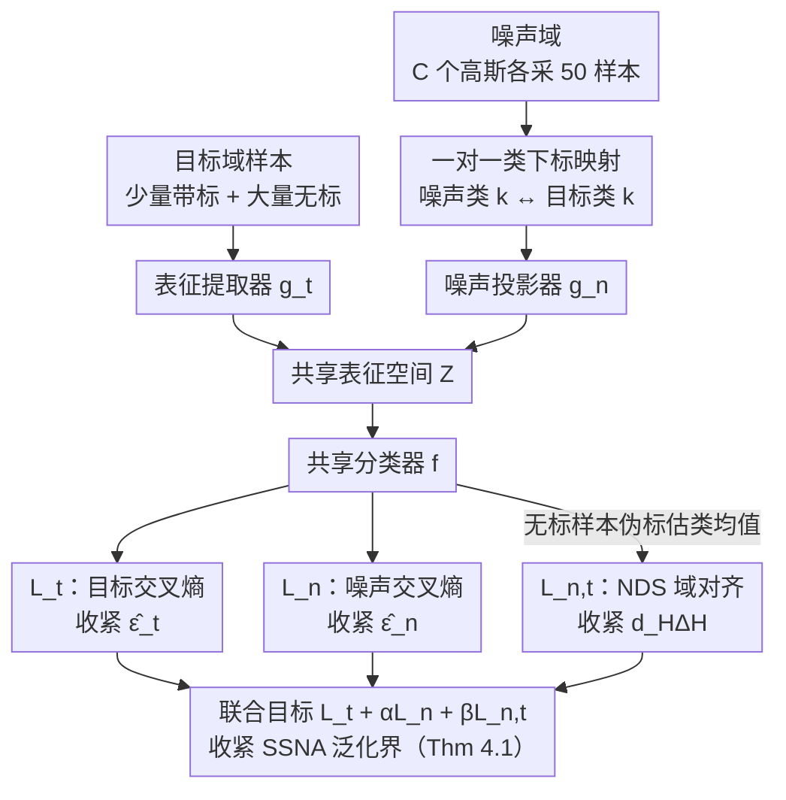

# Semi-Supervised Noise Adaptation: Transferring Knowledge from Noise Domain

**会议**: ICML 2026  
**arXiv**: [2606.00558](https://arxiv.org/abs/2606.00558)  
**代码**: https://github.com/AIResearch-Group/SSNA  
**领域**: 迁移学习 / 半监督学习  
**关键词**: 半监督噪声适应, 替代源域, 泛化界, 域对齐, NDS

## 一句话总结
作者把"从高斯噪声生成的合成域"当作半监督迁移学习里的替代源域，先证明这种"无语义但有判别结构"的噪声能给目标域带来可量化的泛化界改进，再用三损失的 Noise Adaptation Framework（NAF）联合优化两域风险与分布差异，使 CIFAR-10 上 4-shot ResNet-18 比 ERM 提升 12.35%。

## 研究背景与动机

**领域现状**：半监督迁移学习的主流套路是从一个"语义相关、富标注"的源域（如 ImageNet）向"少标注、同语义"的目标域迁移；分析时常用 Ben-David 等 2010 的 $\mathcal H\Delta\mathcal H$ 散度泛化界。最近 Yao 等 2025 给出反直觉发现：在保留可判别性与可迁移性的前提下，从简单分布（高斯）采样的噪声也能当源域。

**现有痛点**：(i) Yao 2025 的工作只有经验观察，缺一个解释"噪声为什么能帮上忙"的泛化界；(ii) 其实验也回避了 CIFAR-10/100、ImageNet-1K 这些标准基准，使结论的适用范围存疑；(iii) 真正的应用场景中，可用源数据常受隐私、版权、保密限制，迫切需要一种"完全自合成、可任意构造"的源域替代方案。

**核心矛盾**：噪声本身没有任何语义信息，凭什么能"教会"目标域？答案藏在表征空间：噪声虽无语义，但通过把噪声类下标与目标类下标做一一对应，再让分类器在共享表征空间里学会区分噪声类，就能为目标域诱导出一个"现成的判别结构"——少量已标注目标样本只起到对齐两域类下标的桥梁作用。

**本文目标**：(i) 把"用噪声作为替代源域"这件事正式化为 SSNA 问题；(ii) 在 SSNA 设定下推导一个不含"两域联合最优误差 $\lambda$"项的泛化界；(iii) 设计能直接最小化该泛化界三大可控分项的算法，并在标准视觉/文本基准上做完整验证。

**切入角度**：把 Ben-David 2010 的半监督迁移泛化界中"源域是语义数据"这一假设松开，让源域可以是合成噪声；噪声的离散类下标 $\{0,\dots,C-1\}$ 与目标类下标共享，从而绕过"两域必须语义相关"的传统前提。

**核心 idea**：泛化界拆出来的 $\hat\epsilon_t,\hat\epsilon_n,\hat d_{\mathcal H\Delta\mathcal H}$ 三项都能在共享表征空间 $\mathcal Z$ 里被显式最小化——分别对应"目标分类损失 / 噪声分类损失 / 域对齐损失"——于是一个三项加权的目标函数就把"理论上能收紧的界"变成"实践中可优化的 loss"。

## 方法详解

### 整体框架

SSNA 设定：目标域 $\mathcal D_t=\mathcal D_l\cup\mathcal D_u\cup\mathcal D_e$ 由少量带标 $\mathcal D_l$（$n_l$ 个）、大量无标 $\mathcal D_u$（$n_u\gg n_l$）、测试集 $\mathcal D_e$ 组成；噪声域 $\mathcal D_n=\{(\mathbf n_i,y_i)\}$ 由 $C$ 个不同高斯分布（每类一个均值 + 单位协方差）采样得到，其类下标 $y_i\in\{0,\dots,C-1\}$ 仅为整数标识、无语义。训练前固定一对一映射，把噪声类 0 绑给目标类"cat"、噪声类 1 绑给目标类"dog"等。

NAF 由三个部件构成：表征提取器 $g_t:\mathcal X\to\mathcal Z$（处理目标像素，论文用 ResNet-18/50 backbone）、噪声投影器 $g_n:\mathcal E\to\mathcal Z$（把 1024 维高斯噪声映到同一表征空间）、共享分类器 $f:\mathcal Z\to\{0,\dots,C-1\}$。目标和噪声在 $\mathcal Z$ 里被监督地拉到对应类下标的簇上，同时还要拉近两个簇分布。三个损失分别对应泛化界里三个可控分项，联合最小化它们就等于收紧目标域的泛化界。

### 关键设计

**1. SSNA 泛化界（Theorem 4.1）：把"噪声域对目标泛化的影响"写成一条能直接读出"该最小化什么"的不等式**

要让"用噪声当源域"这件反直觉的事站得住，得先有理论支点。本文在共享表征空间 $\mathcal{Z}$ 上沿用 Ben-David 2010 的两域框架，但因为噪声不在原像素空间，需要先把它映射进 $\mathcal{Z}$ 再测散度。核心不等式形如 $\epsilon_t(\hat f)\le\epsilon_t(f_t^*)+\mathcal{O}(\gamma\sqrt{(d\log m+\log(1/\delta))/m})+2(1-\alpha)[\tfrac12\hat d_{\mathcal H\Delta\mathcal H}(\mathbb U_n,\mathbb U_t)+\hat\epsilon_n(\hat f)+\hat\epsilon_t(\hat f)+\dots]$，其中 $\gamma=\sqrt{\alpha^2/\beta+(1-\alpha)^2/(1-\beta)}$。和传统迁移界相比，这条界最关键的特点是**不含**两域联合最优误差项 $\lambda$——语义源里 $\lambda$ 很小，但语义无关源里 $\lambda$ 可能很大、根本无法保证小。本文把"语义相关"假设替换成"在 $\mathcal{Z}$ 中可对齐"，于是合法地把噪声当源用，这正是整篇论文的理论入口。

**2. NAF 三损失联合优化：把泛化界里三个可控分项各对应一个 loss，端到端训练**

泛化界拆出来的 $\hat\epsilon_t,\hat\epsilon_n,\hat d_{\mathcal H\Delta\mathcal H}$ 三项，本文分别赋予一个具体可微 loss：优化目标 $\min_{g_t,g_n,f}\mathcal L_t+\alpha\mathcal L_n+\beta\mathcal L_{n,t}$ 中，$\mathcal L_t$ 是目标带标样本的交叉熵；$\mathcal L_n$ 是噪声样本的交叉熵，让噪声在 $\mathcal{Z}$ 里形成 $C$ 个紧致可分的类簇；$\mathcal L_{n,t}$ 是两域分布差异，作者从 5 种实现中实证选定 Negative Domain Similarity（NDS）——把两域的全局均值与类内均值算 cosine 相似度后取平均并取负，无标目标样本的类下标用分类器 $f$ 的伪标在线估计。把"理论上影响泛化"的三项落成具体 loss，是从抽象界面走到工程实现的关键一步；用类均值加伪标的 NDS 还避开了对抗式对齐的不稳定，又能捕到类条件对齐而不止边缘对齐。

**3. 类下标一对一映射 + 伪标自更新：在没有共享像素空间的两域间架一座"语义桥"**

噪声本身没有任何语义，凭什么能教会目标域？答案在于固定的一对一类下标映射：训练前把噪声类 $\{0,\dots,C-1\}$ 与目标类 $\{0,\dots,C-1\}$ 随机但唯一地配对（噪声类 0 绑给 cat、类 1 绑给 dog……），让"噪声类簇"成为目标类簇的"先成型支架"。训练中分类器 $f$ 对所有无标目标样本输出伪标，用于在线估计目标域的类条件均值（NDS 需要类均值），随迭代刷新。少量带标目标样本（如 4/类）只够把分类器初步对齐到正确类索引，无标样本则在 NDS 的拉力下被推向对应噪声簇——消融 Q6 已验证：完全没有这点带标桥梁时，仅靠噪声训练的分类器在真实目标域上等同乱猜，因为噪声与目标根本不共享像素空间。

### 损失函数 / 训练策略
总目标 $\mathcal L=\mathcal L_t+\alpha\mathcal L_n+\beta\mathcal L_{n,t}$。噪声构造：$C$ 类各从一个不同的 1024 维高斯（均值采自标准正态、协方差为单位阵）采 50 个样本。视觉数据集每类带标 4 个，ImageNet-1K 每类 100 个；其余作为无标目标。Backbone 为 ResNet-18/50，文本数据集 AG News-4 单独适配。

## 实验关键数据

### 主实验

| 数据集 | Backbone | ERM Top-1 | NAF Top-1 | 提升 |
|--------|---------|-----------|-----------|------|
| CIFAR-10 | ResNet-18 | 55.55 | 67.90 | +12.35 |
| CIFAR-10 | ResNet-50 | 58.83 | 73.98 | +15.15 |
| CIFAR-100 | ResNet-18 | 41.43 | 49.04 | +7.61 |
| CIFAR-100 | ResNet-50 | 46.71 | 52.82 | +6.11 |
| DTD-47 | ResNet-18 | 45.80 | 50.18 | +4.38 |
| Caltech-101 | ResNet-18 | 79.20 | 81.94 | +2.74 |
| CUB-200 | ResNet-18 | 41.92 | 50.86 | +8.94 |
| OxfordFlowers-102 | ResNet-18 | 81.07 | 86.58 | +5.51 |
| StanfordCars-196 | ResNet-18 | 28.01 | 35.75 | +7.74 |
| ImageNet-1K（100/类） | ResNet-18 | — | — | +0.99 |

### 与 SSL 方法的叠加增益

| 基础方法 | 数据集 | 基础准确率（平均） | +NAF | 提升 |
|---------|--------|------------------|------|------|
| UDA | CIFAR-10 | 54.80 | 75.79 | +20.99 |
| UDA | CIFAR-100 | 43.66 | 45.61 | +1.95 |
| FixMatch | CIFAR-10 | 68.31 | 77.93 | +9.62 |
| FixMatch | CIFAR-100 | 41.15 | 43.31 | +2.16 |

### 关键发现
- $\mathcal L_n,\mathcal L_{n,t}$ 在 ERM 下没被显式优化，其训练值始终高于 NAF；这与"NAF 更紧收紧泛化界"的理论预期吻合，且伴随精度大幅提升，说明合成噪声**确实**带来了正向迁移。
- t-SNE 显示 NAF 的噪声表征形成清晰可分簇并与对应目标类对齐，ERM 下的目标表征则相对混乱——验证了"噪声判别结构 + 对齐"才是涨点根因。
- NAF 可叠加在 UDA / FixMatch 这类成熟 SSL 方法上仍带显著增益（CIFAR-10 上 UDA+NAF 提升近 21 个点），说明它解决的是与 pseudo-label 类 SSL 正交的另一个泛化瓶颈——表征结构的可分性。
- 少量带标目标样本（Q6 消融）不可或缺：完全无监督时一对一映射无法建立，噪声训练的分类器在目标域上等同于乱猜。

## 亮点与洞察
- 把"用 Gaussian 噪声当源域"这一反直觉做法用一条干净的泛化界站稳脚跟——界中**不含**联合最优误差 $\lambda$，正是允许使用"语义无关"源的理论入口。
- NDS 这种基于类均值的 cosine 对齐设计简单、无对抗、显式利用类条件信息，在保留可解释性的同时把对齐做成了 plug-in，可与现有 SSL 框架自由组合。
- 噪声分布完全由开发者控制（高斯参数、维度、类数），从而绕开了源数据采集中的隐私、版权、合规问题——这一点对工业部署尤其有吸引力。
- "噪声判别结构 → 目标判别结构"的提升机制揭示了一个普适思路：源域不必和目标共享语义，只要在表征空间里能提供一个"结构骨架"，目标域就能借力——这条路可能被推广到机器人、医学等数据极稀缺场景。

## 局限与展望
- 噪声分布形式被固定为各向同性 Gaussian + 单位协方差，类均值随机采样；论文未系统研究其他分布（如重尾、多模态）或类间距离对迁移效果的影响，留有大量调参空间。
- 一对一类下标映射是随机指定的，作者没分析"配对方式是否影响收敛/最终精度"——例如把噪声类 0 配给视觉上简单类与复杂类，是否会出现不对称的迁移。
- 大规模实验只到 ImageNet-1K，且每类 100 带标，相对常见的"严苛少标注"场景已较宽松；在 1-shot/5-shot 真正稀缺的设定下增益是否仍显著仍待验证。
- NDS 依赖伪标估计类均值，若分类器初期质量太差会引入累计误差；论文未给出针对早期伪标噪声的稳健化策略（如置信度门限或 EMA 平滑）。

## 相关工作与启发
- **vs Yao 等 2025**：本文延续其"噪声可作源域"的关键观察，但补全了 (i) 泛化界理论解释、(ii) CIFAR/ImageNet 等标准基准、(iii) 一个干净可复现的算法 NAF，使该方向从"奇闻"升级为"可落地方法"。
- **vs Baradad Jurjo 等 2021**：那条线用噪声做对比预训练，是表征学习视角的"自监督替代品"；本文则把噪声纳入半监督迁移的源域角色，理论分析与训练目标都完全不同。
- **vs FixMatch / UDA 等 SSL 方法**：传统 SSL 全靠目标域无标样本和强弱增强一致性；NAF 与其正交，新增了"异质噪声源"作为额外判别结构，所以叠加增益仍很显著。
- **vs 经典域适配 DANN**：DANN 用对抗对齐边缘分布；NAF 用 NDS 类均值对齐显式做类条件对齐，无对抗训练，避免了 GAN 式优化不稳定，同时充分利用了一对一类映射这一强先验。

## 评分
- 新颖性: ⭐⭐⭐⭐⭐ "用噪声当源域"在直觉上反常识，把它理论上正名并工程化是首次。
- 实验充分度: ⭐⭐⭐⭐ 覆盖 CIFAR/DTD/Caltech/CUB/Flowers/Cars/ImageNet/AG News，背骨与超参也较完整；可惜噪声分布只比较 Gaussian。
- 写作质量: ⭐⭐⭐⭐ 推理链条清晰，泛化界与算法的对应关系交代得很到位。
- 价值: ⭐⭐⭐⭐ 给"无法访问真实源数据"的迁移场景提供了一个 plug-and-play 的强基线，且可与 SSL 方法自由叠加。

<!-- RELATED:START -->

## 相关论文

- [\[NeurIPS 2025\] Prediction-Powered Semi-Supervised Learning with Online Power Tuning](../../NeurIPS2025/learning_theory/prediction-powered_semi-supervised_learning_with_online_power_tuning.md)
- [\[ICML 2025\] Theoretical Performance Guarantees for Partial Domain Adaptation via Partial Optimal Transport](../../ICML2025/learning_theory/theoretical_performance_guarantees_for_partial_domain_adaptation_via_partial_opt.md)
- [\[ICML 2026\] On the Learnability of Test-Time Adaptation: A Recovery Complexity Perspective](on_the_learnability_of_test-time_adaptation_a_recovery_complexity_perspective.md)
- [\[ICML 2026\] MMD-Balls as Credal Sets: A PAC-Bayesian Framework for Epistemic Uncertainty in Test-Time Adaptation](mmd-balls_as_credal_sets_a_pac-bayesian_framework_for_epistemic_uncertainty_in_t.md)
- [\[NeurIPS 2025\] Keep It on a Leash: Controllable Pseudo-label Generation Towards Realistic Long-Tailed Semi-Supervised Learning](../../NeurIPS2025/learning_theory/keep_it_on_a_leash_controllable_pseudo-label_generation_towards_realistic_long-t.md)

<!-- RELATED:END -->
