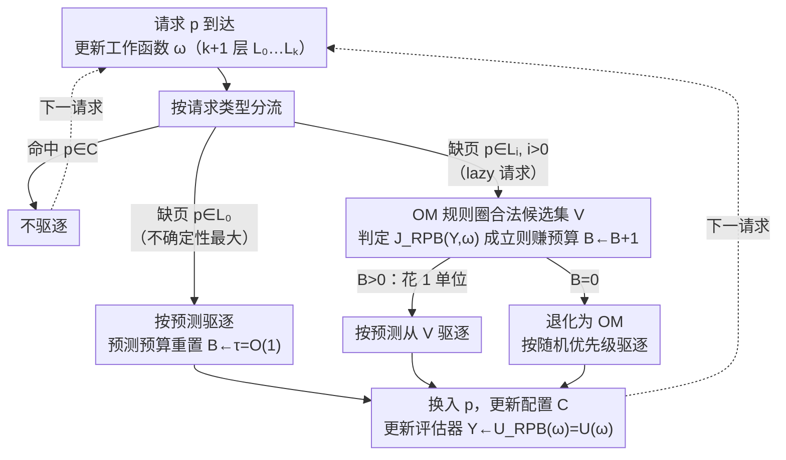

# Towards Optimal Robustness in Learning-Augmented Paging

**会议**: ICML 2026  
**arXiv**: [2606.01342](https://arxiv.org/abs/2606.01342)  
**代码**: 无  
**领域**: 在线算法 / 学习增强算法 / 缓存调页  
**关键词**: learning-augmented paging, competitive ratio, OnlineMin, relative prediction budget, robustness

## 一句话总结
本文为带预测的随机化在线调页提出统一的「相对预测预算」(RPB) 视角，并基于 OnlineMin 设计 RPB-OnOPT 框架，把可证的鲁棒竞争比从既有的 $2H_k+O(1)$ 一举推到信息论下界附近的 $H_k+O(1)$，同时保持 1-一致性。

## 研究背景与动机

**领域现状**：在线调页是经典的在线决策原型问题——给定容量为 $k$ 的缓存与陆续到达的页面请求序列，命中不付费、缺页需要驱逐并换入。任何确定性算法竞争比下界为 $k$，LRU 即达到该下界；随机化的下界是 $H_k=\sum_{i=1}^{k}1/i\approx \ln k$，由 Equitable、K_Equitable、OnlineMin 等基于工作函数 (work function) 的算法逼近。学习增强 (algorithms with predictions, ALPS) 路线则在请求序列上叠加一个可能不准的 ML 预测（典型形式是下次访问时间 next-arrival time），目标是同时拿到 1-consistency（预测完美时贴近 OPT）和有界 robustness（预测任意差时仍接近经典竞争比）。

**现有痛点**：以 Marker 为骨架的 PredictiveMarker、LMarker 等算法的鲁棒上界停在 $2H_k+O(1)$ 附近；Trust&Doubt、F&R 系列虽然能拿 1-consistency，但 robust 常数仍偏离最优 $H_k$。换言之，已有方案在「最差情形」上整整差了 OPT 一倍——这背后是 Marker 标记机制本身的硬上界，以及预测预算与预测质量解耦的设计。

**核心矛盾**：要 1-consistency 就得「敢用预测」，要 $H_k$ 级 robustness 就得「敢忽略预测」。当前算法要么在固定阈值上「过度信任」预测（PredictiveMarker 用 $H_k$ 阈值，错误放大成 $4H_k$），要么「过度保守」（LMarker 用阈值 1，错失大量准确预测）；都缺一个能把预测质量与鲁棒基线代价同时纳入的细粒度调度。

**本文目标**：(i) 把现有所有「鲁棒-一致」算法的设计本质显式化为一个统一原语；(ii) 在该原语之上构造可证达到 $H_k+O(1)$ robust 的框架；(iii) 同时保留 1-consistency 且在真实 workload 上实测好用。

**切入角度**：作者发现，所有鲁棒学习增强调页算法本质都在维护一个「相对于鲁棒基线 $\mathcal{A}$ 的非负预算 $B_t$」——只有当 $B_t>0$ 时才允许偏离 $\mathcal{A}$ 去执行预测建议；区别只在「赚预算」和「花预算」的粒度。同时，OnlineMin 这类在线最优算法天然维护「合法配置 (valid configuration)」的工作函数层结构，是一个比 Marker 更优、可直接嫁接预测的鲁棒底座。

**核心 idea**：把 RPB 这套预算簿记挂载到 OnlineMin 上，让预算的赚取与「过去若干步的预测有效性 vs 在线最优的最坏期望代价」直接挂钩，从而首次同时拿到最优一致性与近最优鲁棒性。

## 方法详解

### 整体框架
输入：在线请求序列 $\sigma=\langle r_1,\dots,r_n\rangle$ 以及每步可选的下次访问时间预测；输出：缓存驱逐决策。算法在每一步维护四样东西：(1) 当前工作函数 $\omega$（用 $k+1$ 个层 $L_0,\dots,L_k$ 紧凑表示，$L_0$ 是支撑外页，$L_i,i>0$ 是支撑层）；(2) 当前缓存配置 $C$（始终是一个 valid configuration）；(3) 非负预算 $B$；(4) 评估器变量 $Y=U(\omega)=k-|R(\omega)|$，即未揭示层数。

请求到达时，先按工作函数更新规则更新 $\omega$，再分流：

- 命中：什么都不做。
- 缺页且 $p\in L_0$（支撑外，最大不确定性）：按预测驱逐，并把预算重置为常数 $\tau=O(1)$；
- 缺页且 $p\in L_i,\,i>0$（lazy 请求）：先按 OM 规则圈出候选集 $V$，再用判定函数 $\mathcal{J}_{RPB}(Y,\omega)$ 决定是否给预算 +1；若 $B>0$ 就花掉 1 单位、按预测从 $V$ 里驱逐，否则退化为 OM 的优先级驱逐。

最终请求处理后，更新 $Y\leftarrow \mathcal{U}_{RPB}(\omega)$ 供下一步评估。整套流程统一在算法 RPB-OnOPT 里，把不同的 $\mathcal{J}_{RPB},\mathcal{U}_{RPB}$ 实例化即可得到不同强度的鲁棒-一致权衡。

### 关键设计

**1. 相对预测预算（Relative Prediction Budget, RPB）：用一面镜子照清所有现存算法的预测使用强度**

要解释"为什么之前的鲁棒上界都卡在 $2H_k$"，得先有一把统一的尺子。作者发现所有鲁棒学习增强调页算法本质都在维护一个"相对于鲁棒基线 $\mathcal{A}$ 的非负预算 $B_t$"——只有 $B_t>0$ 时才敢偏离 $\mathcal{A}$ 去听预测，区别只在"赚预算"和"花预算"的粒度。据此可以把 BlindOracle&LRU、PredictiveMarker、LMarker、F&R 全部重新解读成"不同赚取规则下的 RPB 算法"：PredictiveMarker 在每个 clean request 上一次性赚 $H_k$ 单位，LMarker 只赚 1 单位，F&R 则在每步与 Belady 同代价时赚 1 单位。问题一目了然——这些规则都没把"预测到底有没有用"细粒度地纳入赚取条件，鲁棒常数因此被锁死。RPB 的改法是让预算赚取同时挂钩"过去若干步本算法的表现"和"基线在最坏 lazy 对抗下的期望代价"，既诊断出谁过度信任、谁过度保守，也指明了往哪儿做能突破到 $H_k+O(1)$。

**2. RPB-OnOPT 框架：把预算装在在线最优底座上，而不是装在 Marker 上**

这是把上界从 $2H_k$ 推到 $H_k$ 的根本一步。Marker 的标记机制本身就限制了 $2H_k+O(1)$ 的下界，所以作者干脆换底座，把 RPB 挂到 OnOPT（OnlineMin 是其实例）这类步步停在合法配置（valid configuration）上的在线最优算法上。具体分两种情形：当请求落在支撑外层 $L_0$（不确定性最大）时，按预测驱逐并把预算重置为常数 $\tau=O(1)$——定理 5.1 证明此时"按预测驱逐"对完美预测即可达成最优，是 1-consistency 的最小预测使用量；当请求落在 $L_i,i>0$ 时，先用 OM 的候选集规则 $V=C\cap\bigcup_{l=1}^{z}L_l$（$z$ 是最小满足 $|C\cap\bigcup_{l=1}^{j}L_l|=j$ 的下标）保证驱逐仍处在某个 valid configuration 内，再让 RPB 决定是否听预测。OnOPT 把"保持在 valid configuration 内"算法化，给后续 $H_k$ 级势函数分析提供了不破的基底，竞争比的基线于是从 $2H_k-1$ 直接降到 $H_k$。

**3. RPB-OM 实例化与判定函数 $\mathcal{J}_{RPB}$：让赚预算的触发条件与势函数的指数衰减对齐**

框架要落到一个可证同时 1-consistent 且 $(H_k+O(1))$-robust 的具体算法。RPB-OM 把 OnOPT 里的自定义优先级替换成 OM 的随机优先级，评估器取未揭示层数 $Y=U(\omega)=k-|R(\omega)|$（越小说明已揭示越多、过去预测越有效），判定函数取 $\mathcal{J}_{RPB}(Y,\omega)=\big(U(\omega)\le (Y+2)/e-2\big)$，更新函数取 $\mathcal{U}_{RPB}(\omega)=U(\omega)$。直觉是：预算只在"当前未揭示层数显著小于过去同期、说明预测确实减少了不确定性"时才 +1，避免被对抗序列骗着无脑加预算。鲁棒性证明靠两条新性质对上 OM 势函数的衰减结构：在 $L_0$ 上服务请求时 OM 势函数最多增加 $H_k-1$（推论 5.5），在 lazy adversary 请求 $p\in N(\omega)$ 上势函数至少减少 $1/(U(\omega)+1)$（引理 5.6）。两者合起来，无论预测多差，算法的累计偏离也只比 OM 多一个 $O(1)$ 加性项——这正是用 $U(\omega)$ 而非"全局过去代价"做触发的好处，后者会引入乘性 2 倍因子。

### 损失函数 / 训练策略
本文不涉及任何 ML 训练；预测被视为黑盒。所有"训练"开销都在 RPB 的常数 $\tau$、判定阈值与势函数证明中显式给出。

## 实验关键数据

### 主实验
作者在 LIRS 与 SPC1 两类经典 trace 上对比所有主流学习增强调页算法，预测来自简单的下次访问时间预测器（含人工注入误差）；指标是相对 OPT 的代价比 (cost/OPT)，越小越好。

| 算法 | 预测完美 | 中等误差 | 对抗预测 | 鲁棒理论上界 |
|------|---------|---------|---------|-------------|
| BlindOracle | 1.00 | 飙升 | 不有界 | $\infty$ |
| BlindOracle & LRU | 1.05 | 1.3-1.5 | $\le 2k$ | $2k$ |
| PredictiveMarker | $\sim$2 | 1.4-1.8 | $\le 4H_k$ | $4H_k$ |
| LMarker | $\sim$2 | 1.4-1.6 | $\le 2H_k+4$ | $2H_k+4$ |
| **RPB-OM (本文)** | **1.00** | **1.1-1.3** | **$\le H_k+O(1)$** | **$H_k+O(1)$** |

### 消融实验
| 配置 | 平均 cost/OPT | 说明 |
|------|--------------|------|
| RPB-OM 完整 | 1.10-1.30 | 完整方法，预算挂钩 $U(\omega)$ |
| RPB-OM, $\mathcal{J}_{RPB}\equiv\text{true}$ | $\sim$1.5 | 每步都加预算，退化到激进策略，鲁棒变差 |
| RPB-OM, $\mathcal{J}_{RPB}\equiv\text{false}$ | $\sim$1.4 | 永不加预算，等价于纯 OM，consistency 丢失 |
| RPB on Marker 底座 | $\sim$1.6 | 把 OnOPT 换回 Marker，复现既有 $2H_k$ 上界 |

### 关键发现
- 把鲁棒底座从 Marker 换成 OnOPT，是把上界从 $2H_k$ 推到 $H_k$ 的根本原因；只在底座上换 RPB 而不换基线，最终上界仍卡在 $2H_k$。
- 判定函数 $\mathcal{J}_{RPB}$ 用 $U(\omega)$ 而非「全局过去代价」是关键：前者天然与势函数衰减率 $1/(U+1)$ 对齐，给出加性常数；后者会引入乘性 2 倍因子。
- 在真实 trace 上，即便预测器不完美，RPB-OM 也比 LMarker / PredictiveMarker 平均省 10%-20% 的缺页，说明「相对鲁棒基线赚预算」比「按 eviction chain 长度赚预算」更能利用中等准确度的预测。

## 亮点与洞察
- **统一视角的杠杆**：RPB 不是新算法，而是一面镜子——它一次性把 BlindOracle&LRU、PredictiveMarker、LMarker、F&R 都映射到同一个「预算簿记」上，让人一眼看清谁过度信任、谁过度保守，进而指出可改进的方向。
- **「换底座」比「调阈值」更有杠杆**：以往工作都在 Marker 上调阈值/标记规则，鲁棒上界硬上限是 $2H_k+O(1)$；本文证明只有换到 OnOPT 这种「步步停在 valid configuration 上的在线最优算法」才能逼近 $H_k$，这一观察对整个 ALPS 设计哲学有迁移价值（例如可推广到 $k$-server、metrical task systems）。
- **势函数新性质可单独引用**：推论 5.5 与引理 5.6 给出 OM 势函数在 $L_0$ 请求与 lazy 请求上的精确变化界，这两条引理本身就是分析任何在 OM 上做学习增强变体的通用工具。

## 局限与展望
- 鲁棒上界是 $H_k+O(1)$，距 $H_k$ 仍有加性常数；作者明确指出再去掉这个常数等价于不使用任何预测，已属设定外。
- RPB-OM 的判定函数 $\mathcal{J}_{RPB}$ 形式仍偏简（只用 $U(\omega)$），若想直接对齐 OM 每步真实期望代价，需要更复杂的预算函数，理论分析与工程实现复杂度都会上升。
- 实验只覆盖了下次访问时间这一类预测，对带噪声/缺失的更现实预测形态（例如概率分布预测、流式更新预测）没有展开。
- 框架天然限于「随机化调页」，未触及确定性设定（下界 $k$）与多缓存层级（hierarchical caching）。

## 相关工作与启发
- **vs BlindOracle&LRU (Wei, 2020)**：他们在两个算法间全局切换，预算粒度粗、最差 $2k$；本文用 RPB 在 OnOPT 内部细粒度切换，鲁棒从 $2k$ 收紧到 $H_k+O(1)$。
- **vs PredictiveMarker / LMarker (Lykouris-Vassilvtiskii 2018; Rohatgi 2020)**：他们在 Marker 上分别用 $H_k$ 和 1 这两个固定阈值赚预算，分别落到 $4H_k$ 与 $2H_k+4$；本文证明 Marker 底座本身就被锁死在 $2H_k+O(1)$，必须换底座。
- **vs F&R / F&R (FitF) (Sadek & Elias, 2024)**：他们首次达 $\mathcal{O}(\log k)$ robust，但前导常数非最优；本文把前导常数直接拍到 1。
- **启发**：在 $k$-server、ski rental、knapsack 等其他 ALPS 问题里，可以同样问「我们的鲁棒底座是不是已经是该问题的在线最优算法」——如果不是，换底座往往比调阈值收益大得多。

## 评分
- 新颖性: ⭐⭐⭐⭐⭐ 首次同时拿到 1-consistency 与近最优 $H_k+O(1)$-robustness，并给出统一原语 RPB。
- 实验充分度: ⭐⭐⭐ trace 上比较扎实，但预测器与噪声形态较窄。
- 写作质量: ⭐⭐⭐⭐ 把复杂的工作函数/势函数分析按 Observation 1-4 的方式串成清晰故事，可读性高。
- 价值: ⭐⭐⭐⭐⭐ 既给出最优鲁棒结果，也给出对整个 ALPS 子领域有指导意义的视角换底座观察。

<!-- RELATED:START -->

## 相关论文

- [\[ICML 2025\] Near-Optimal Consistency-Robustness Trade-Offs for Learning-Augmented Online Knapsack Problems](../../ICML2025/learning_theory/near-optimal_consistency-robustness_trade-offs_for_learning-augmented_online_kna.md)
- [\[ICML 2026\] Parsimonious Learning-Augmented Online Metric Matching](parsimonious_learning-augmented_online_metric_matching.md)
- [\[ICML 2026\] Multi-task Linear Regression without Eigenvalue Lower Bounds: Adaptivity, Robustness and Safety](multi-task_linear_regression_without_eigenvalue_lower_bounds_adaptivity_robustne.md)
- [\[ICML 2025\] Learning-Augmented Hierarchical Clustering](../../ICML2025/learning_theory/learning-augmented_hierarchical_clustering.md)
- [\[ICML 2026\] Optimal Design for Multinomial Logit Model with Applications to Best Assortment Identification](optimal_design_for_multinomial_logit_model_with_applications_to_best_assortment_.md)

<!-- RELATED:END -->
