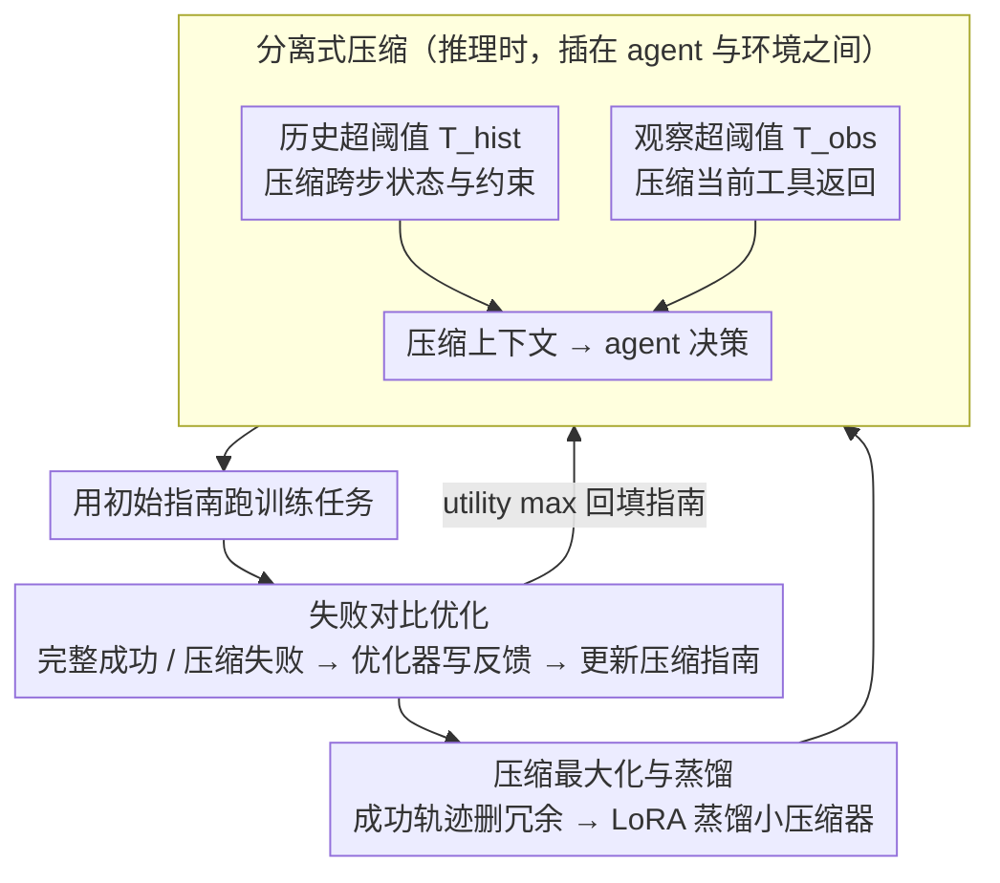

# ACON: Optimizing Context Compression for Long-horizon LLM Agents

**会议**: ICML2026  
**arXiv**: [2510.00615](https://arxiv.org/abs/2510.00615)  
**代码**: https://github.com/microsoft/acon  
**领域**: LLM Agent / 上下文压缩 / 长程任务  
**关键词**: LLM Agent、上下文压缩、Prompt优化、轨迹对比、压缩蒸馏  

## 一句话总结
Acon 用失败轨迹对比来优化自然语言压缩指南，同时压缩 agent 的历史和观察上下文，在 AppWorld、OfficeBench 和多目标 QA 上把峰值 token 降低 26% 到 54%，并保持或提升长程任务成功率。

## 研究背景与动机
**领域现状**：LLM agent 已经被用于办公自动化、应用操作、搜索问答等多步任务。与单轮问答不同，agent 需要持续保存观察、动作、工具输出和中间状态，后续每一步决策都依赖这些交互历史。

**现有痛点**：长程 agent 的上下文会不断增长，带来两类问题。第一，Transformer 推理和 KV cache 成本随上下文变长而上升，内存和延迟都不可控。第二，长上下文里混入大量过时或无关信息后，模型更容易被噪声分散注意力，尤其是较小模型会明显掉任务成功率。

**核心矛盾**：上下文压缩必须同时“狠”和“准”。如果只截断或泛泛总结，文件路径、API 参数、账户状态、工具返回中的约束等关键状态很容易丢失；如果保留太多，又不能真正降低成本。更难的是，很多 proprietary LLM 不能做梯度更新，RL 式压缩策略也需要昂贵 rollout。

**本文目标**：作者希望构造一个模型无关的压缩框架，在不改 agent 权重的前提下，自动学习不同环境中的压缩规则，使压缩后的上下文既短又保留完成任务所需状态，并且能把压缩器蒸馏到小模型以降低额外开销。

**切入角度**：论文的观察是，压缩失败会在轨迹层面留下很强的诊断信号：同一个任务在完整上下文下成功、压缩上下文下失败，说明压缩器漏掉了某些关键状态。把这种前后上下文对比交给 LLM 分析，可以生成自然语言反馈，用来更新压缩 prompt。

**核心 idea**：不用微调 agent，而是在自然语言空间里迭代优化“应该保留什么、删掉什么”的压缩指南，再用成功轨迹蒸馏小型压缩器。

## 方法详解
Acon 可以看成一个插在 agent 与环境之间的上下文管理层。Agent 仍然用原始 ReAct 或 benchmark 指定的工具格式决策；Acon 只在历史或观察超过阈值时调用压缩器，把长文本改写成更短但信息密度更高的状态摘要。关键不在于手写一个通用总结 prompt，而是用训练任务中的成功/失败轨迹自动改进这个 prompt。

### 整体框架
输入是一个长程 agent benchmark、固定的 agent LLM、固定系统 prompt、以及一批训练任务。每个时间步，agent 会看到历史 $h_{t-1}$ 和最新观察 $o_t$。如果历史长度超过阈值 $T_{hist}$，Acon 用压缩器 $f(h_t;\phi,P_{hist})$ 生成压缩历史；如果观察超过阈值 $T_{obs}$，则用 $f(o_t,h_{t-1};\phi,P_{obs})$ 生成压缩观察。压缩后的上下文替换原上下文进入下一步决策。

训练阶段先用初始压缩指南跑任务，收集“完整上下文成功、压缩上下文失败”的 contrastive subset。优化器 LLM 阅读原始上下文、压缩上下文和失败信息，写出压缩遗漏了什么、哪些状态应该保留。随后另一个 update prompt 汇总多条反馈，更新压缩指南。第一轮主要最大化任务成功率，论文称为 utility maximization；第二轮只在压缩后成功的任务上分析哪些信息实际被用到，进一步压短上下文，称为 compression maximization。最后，作者用优化后的大模型压缩器产生输入输出对，LoRA 微调 Qwen3/Phi 等小模型作为压缩器。

### 关键设计
1. **历史与观察的分离式压缩：两种上下文膨胀分开治**

	长程 agent 的 token 爆炸有两个来源——一是 agent 历史随步数不断增长，二是单步工具调用就可能返回一张大表、一封长邮件或整页网页。Acon 不用一个通用 summary prompt 一锅烩，而是把两路分开触发：只有历史长度超过阈值 $T_{hist}$ 时才调用历史压缩 $f(h_t;\phi,P_{hist})$，它关注跨步状态、动作结果和未来约束；只有单步观察超过阈值 $T_{obs}$ 时才调用观察压缩 $f(o_t,h_{t-1};\phi,P_{obs})$，它聚焦当前工具返回里的有效字段，并可回看历史判断哪些字段相关。两类压缩各用一套独立优化的指南，比一个泛化 prompt 更贴合任务结构，阈值也能按环境分别调——这正对应框架图里 agent 与环境之间那一层。

2. **基于失败对比的压缩指南优化：把稀疏成败信号翻译成可读反馈**

	压缩指南该"留什么、删什么"很难手写，直接用 RL 优化又要大量 rollout、还动不了无法做梯度更新的 API 模型。Acon 的关键观察是：同一个任务在完整上下文下成功、却在压缩上下文下失败，这组前后对比几乎就是压缩器的错误定位。于是它收集这种 contrastive subset，让优化器 LLM 对比完整上下文 $H$ 和压缩版 $H'$，明确写出"压缩漏掉了哪些必要信息、哪些状态本该保留"，再把多条自然语言反馈聚合成新的压缩指南 $P^{(1)}$（还会生成多个候选 prompt、在对比任务上择优）。这一步只在自然语言空间迭代、对任意 agent 模型都可用，比只看最终的稀疏终止奖励更容易转成可执行的修改。

3. **压缩最大化与压缩器蒸馏：先保对、再压短、最后降本**

	只追求成功率容易产生保守摘要、token 降不下来；只追求短又会丢状态。Acon 把目标拆成两阶段：utility maximization 先确保不丢关键状态、把成功率顶上去；compression maximization 再只在已经压缩成功的轨迹上分析哪些内容真正被用到，要求 LLM 删掉冗余描述、进一步压短。两阶段把 reward 和 cost 解耦处理，避免一步到位顾此失彼。最后一步是蒸馏：用优化指南下的大模型压缩器产出 $(x,y)$ 训练对（历史压缩 $x=h_t,y=h'_t$，观察压缩 $x=(h_{t-1},o_t),y=o'_t$），以标准 next-token 交叉熵 LoRA 微调 Qwen3/Phi 等小模型当压缩器，免得每步都调昂贵大模型做压缩。

### 损失函数 / 训练策略
方法的目标可写成 $\max_\psi E[R(s_T(\psi))]-\lambda E[C(H'(\psi))]$，其中 $R$ 是任务终止奖励，$C$ 是动态上下文成本。实际优化不对 LLM 权重做梯度更新，而是用文本反馈更新压缩指南。蒸馏阶段使用教师压缩器生成 $(x,y)$ 对，对学生压缩模型做标准 next-token cross-entropy 训练；历史压缩时 $x=h_t,y=h'_t$，观察压缩时 $x=(h_{t-1},o_t),y=o'_t$。

## 实验关键数据

### 主实验
主结果覆盖 AppWorld、OfficeBench 和 8-objective QA。下面选取核心表格中的代表性数字，重点看任务性能与峰值 token 的权衡。

| Benchmark / 设置 | 方法 | 任务指标 | Steps | Peak tokens | Dependency | 说明 |
|------------------|------|----------|-------|-------------|------------|------|
| AppWorld / history / gpt-4.1 | No compression | 56.0 Acc | 16.14 | 9.93K | 5.96M | 完整上下文上界，成本最高 |
| AppWorld / history / gpt-4.1 | Prompting | 43.5 Acc | 24.01 | 6.93K | 5.29M | 普通压缩显著掉成功率 |
| AppWorld / history / gpt-4.1 | Acon UT | 51.2 Acc | 20.92 | 7.17K | 4.49M | token 降低且中等难度任务更稳 |
| AppWorld / history / gpt-4.1 | Acon UT+CO | 56.5 Acc | 22.82 | 7.33K | 4.69M | 达到或略超完整上下文，同时峰值 token 降约 26% |
| AppWorld / observation / gpt-4.1 | Prompting | 42.3 Acc | 17.38 | 6.58K | 4.09M | 普通 observation 压缩仍丢关键信息 |
| AppWorld / observation / gpt-4.1 | Acon UT+CO | 53.6 Acc | 18.12 | 7.43K | 4.93M | 比 baseline 压缩更高成功率 |

OfficeBench 与 8-objective QA 上，Acon 同样改善准确率/效率权衡。

| Benchmark | 方法类别 | 主要结果 | 论文结论 |
|-----------|----------|----------|----------|
| OfficeBench | history compression | Acon 将 peak context 降近 30%，准确率保持 74% 以上 | 办公任务需要精确信息，UT 通常比过度压缩更稳 |
| 8-objective QA | history compression | Acon 在 EM/F1 上超过 no compression，同时 peak tokens 和 dependency 分别降 54.5% 和 61.5% | 检索问答中去掉冗余上下文可提升事实聚焦 |
| 小 agent Qwen3-14B | distilled compressor + compressed trajectories | AppWorld 从 25.6% 到 33.9%，8-objective QA EM 从 0.158 到 0.23 | 压缩能缓解小模型的长上下文干扰 |
| 压缩器成本 | gpt-4.1-mini / Qwen3-14B distill | 成本从 gpt-4.1 的 $0.045 降到 $0.014 或 $0.0004 | 蒸馏显著降低压缩模块开销 |

### 消融实验
论文主要分析 compression threshold、prompt optimizer 和实际 API/延迟成本。

| 消融维度 | 配置 | AppWorld 平均 Acc | 结论 |
|----------|------|-------------------|------|
| Prompt optimizer | o3 + contrastive feedback | 51.2 | 默认设置最好 |
| Prompt optimizer | o3，无 contrastive | 50.6 (-0.6) | 只看失败轨迹不如成功/失败对比 |
| Prompt optimizer | gpt-4.1 + contrastive | 47.6 (-3.6) | 优化器模型弱一些仍可用，但指南质量下降 |
| Prompt optimizer | gpt-5 + contrastive | 50.6 (-0.6) | 不同强模型差距小于是否有对比反馈 |

| 实际效率设置 | API cost / task | Latency / task | 说明 |
|--------------|-----------------|----------------|------|
| No Compression | $0.331 | 73.24s | 无压缩器调用，token 成本高 |
| Acon history | $0.285 | 87.68s | 降低 API 成本，但多一次压缩调用带来延迟 |
| Acon observation | $0.272 | 101.92s | 成本最低，延迟最高 |

| 阈值分析 | 观察 | 启示 |
|----------|------|------|
| 阈值过小 | token 更少，但压缩调用更频繁且准确率下降 | 过早压缩会把仍有用的信息改写掉 |
| 阈值过大 | 准确率更接近 no compression，但成本较高 | 压缩收益不足 |
| 中等阈值 | history 4096、observation 1024 效果最好 | 作为默认部署折中 |

### 关键发现
- Acon 最重要的收益不是单纯省 token，而是把上下文变得更“任务相关”。在 AppWorld hard/medium 等长轨迹上，普通压缩会严重掉分，Acon 能保留关键状态。
- UT 和 CO 是可选择的 trade-off。AppWorld 这类工具输出冗余多的环境适合 UT+CO；OfficeBench 和 QA 这种细节敏感任务中，UT 往往更稳。
- 压缩器可以小模型化。蒸馏后的小压缩器保留超过 95% 教师表现，把压缩成本降到接近可忽略，但仍会引入额外延迟。
- 小 agent 受益尤其明显。压缩后的轨迹减少 distractor，让 Qwen3-14B 这类较小模型在长程任务中更容易做对决策。

## 亮点与洞察
- 这篇论文把“压缩 prompt 怎么写”从手工规则变成了可优化对象，而且优化信号来自 agent 真正失败的轨迹，比泛泛总结更贴近任务。
- 失败对比的设计很实用。完整上下文成功、压缩上下文失败时，差异几乎就是压缩器的错误定位，这比只看最终 reward 更容易转成自然语言反馈。
- Acon 不是和 agent 绑死的模型优化方法。它不要求访问 agent 权重，因此对 API LLM、闭源模型和已经部署的 agent 系统都更现实。
- 压缩在这里还有“去噪”作用。实验中部分压缩设置超过 no compression，说明长上下文并不总是信息越多越好，保留合适状态有时比保留全部上下文更利于推理。

## 局限与展望
- Acon 需要训练任务 rollout 来收集成功/失败对比，虽然比 RL 轻，但仍依赖 benchmark 或可重复环境。
- 压缩引入额外延迟。即使 API 成本下降，真实交互系统可能更在意 wall-clock latency，需要异步压缩、缓存或更小压缩器进一步优化。
- 指南优化依赖强 LLM 作为 optimizer。论文显示 gpt-4.1 可替代 o3 但性能下降，说明优化器质量仍是瓶颈。
- 目前实验主要是文本工具环境，尚未覆盖更复杂的多模态 agent、浏览器 GUI、大规模代码仓库等上下文结构。
- 压缩错误很难完全避免。高保真任务中 CO 可能删掉细微事实，因此部署时需要根据任务风险选择保守或激进压缩策略。

## 相关工作与启发
- **vs FIFO / Retrieval**: FIFO 只保留最近历史，Retrieval 只按相似度取片段，二者都缺少“任务状态应该保留什么”的环境知识；Acon 用失败对比学习这种知识。
- **vs LLMLingua / generic prompting**: 这些方法压缩文本本身，但不一定理解 agent 的动作后果和未来依赖；Acon 的指南针对 trajectory failure 优化。
- **vs ReSum / RL-based agent compression**: ReSum 和类似方法往往优化 agent 或策略模型，Acon 不更新 agent 权重，更适合闭源 API agent。
- **vs KV cache compression**: KV 压缩作用在底层注意力缓存，Acon 作用在语义上下文文本；两者可互补，一个降低底层存储，一个降低输入冗余和推理干扰。

## 评分
- 新颖性: ⭐⭐⭐⭐☆ 用轨迹对比做自然语言压缩指南优化，切中长程 agent 的真实痛点。
- 实验充分度: ⭐⭐⭐⭐☆ 覆盖三个长程 benchmark、两类压缩、小模型蒸馏和成本分析；真实开放环境仍可更多。
- 写作质量: ⭐⭐⭐⭐☆ 问题、方法和实验都比较清楚，附录表格丰富；个别符号和 prompt 优化流程读起来略密。
- 价值: ⭐⭐⭐⭐⭐ 对长程 LLM agent 的部署成本、上下文干扰和小模型可用性都有直接帮助。

<!-- RELATED:START -->

## 相关论文

- [\[ACL 2026\] OCR-Memory: Optical Context Retrieval for Long-Horizon Agent Memory](../../ACL2026/llm_agent/ocr-memory_optical_context_retrieval_for_long-horizon_agent_memory.md)
- [\[ICLR 2026\] Solving the Granularity Mismatch: Hierarchical Preference Learning for Long-Horizon LLM Agents](../../ICLR2026/llm_agent/solving_the_granularity_mismatch_hierarchical_preference_learning_for_long-horiz.md)
- [\[ICLR 2026\] Harnessing Uncertainty: Entropy-Modulated Policy Gradients for Long-Horizon LLM Agents](../../ICLR2026/llm_agent/harnessing_uncertainty_entropy-modulated_policy_gradients_for_long-horizon_llm_a.md)
- [\[AAAI 2026\] When Refusals Fail: Unstable Safety Mechanisms in Long-Context LLM Agents](../../AAAI2026/llm_agent/when_refusals_fail_unstable_safety_mechanisms_in_long-context_llm_agents.md)
- [\[ACL 2026\] TiMem: Temporal-Hierarchical Memory Consolidation for Long-Horizon Conversational Agents](../../ACL2026/llm_agent/timem_temporal-hierarchical_memory_consolidation_for_long-horizon_conversational.md)

<!-- RELATED:END -->
