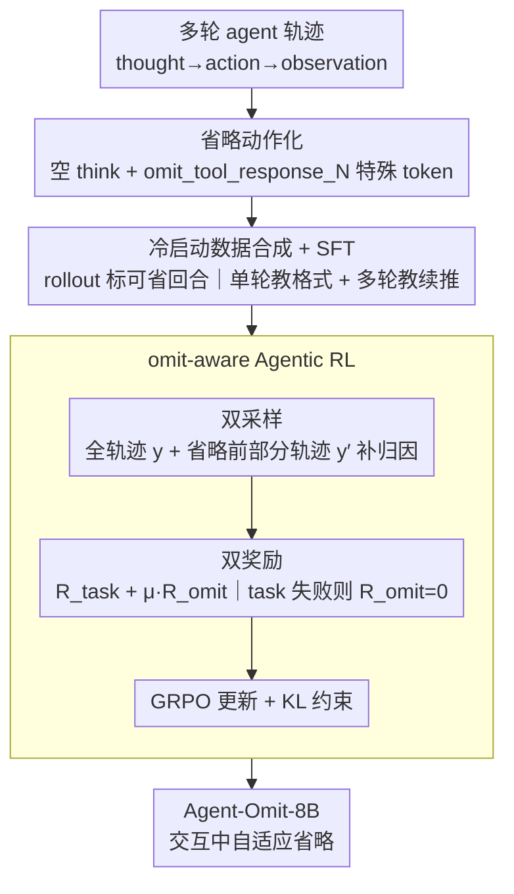

# Agent-Omit: Adaptive Context Omission for Efficient LLM Agents

**会议**: ICML 2026  
**arXiv**: [2602.04284](https://arxiv.org/abs/2602.04284)  
**代码**: https://github.com/usail-hkust/Agent-Omit (有)  
**领域**: LLM Agent / 高效推理 / Agentic Reinforcement Learning  
**关键词**: 上下文管理, 思维省略, 观察省略, GRPO, 双采样

## 一句话总结
通过 Monte-Carlo rollout 量化"哪些回合的 thought / observation 可以省"，再用冷启动 SFT + 双采样 omit-aware GRPO 训出能自适应跳过冗余思考和观测的 8B agent，五个基准上 token 用量大降而准确率与七大前沿模型持平。

## 研究背景与动机

**领域现状**：LLM agent 通过 thought→action→observation 多轮循环解决任务（ReAct / agentic RL），Kimi-K2、DeepSeek-V3.2 等 agent 已经在 deep search、网页购物、具身决策、科学发现等场景展现强能力。但多轮交互让上下文越拉越长、token 成本飞涨。

**现有痛点**：现有提效方法分三类——只压思考（ToolLight、DEPO）、只剪观察（Observation-Mask、DeepMiner）、或两者合二为一做摘要（MEM-Agent、ReSum）。它们都把整条轨迹"一视同仁"地压缩，忽略了不同回合贡献度差异巨大。

**核心矛盾**：thought 和 observation 的"必要性"是 turn-dependent 的——早期高层规划往往把后续几轮的思考直接决定了；末轮做汇总时大多数早期观测早就过时。一刀切的压缩既会误删必要信息（影响准确率），也会保留无用 token（影响效率）。

**本文目标**：分两步：(1) 用可控干预定量证明"按回合选择性省略"的可行性；(2) 训练一个能在交互过程中自适应决定"这一轮的思考要不要写、之前哪些观测要不要丢"的策略。

**切入角度**：把 agent 的省略行为本身建模成动作空间的一部分——thought 输出空字符串、观测通过特殊 token `<omit_tool_response_N>` 显式删除——这样省略就可以在 SFT 和 RL 框架里自然学习。

**核心 idea**：让 agent 主动输出"思考省略"和"观测省略"动作，再用一个把"任务奖励"和"token 节省"耦合（且 task 失败时省略奖励清零）的 omit-aware GRPO 来训练，并辅以双采样解决"省略后看不到原信息"的归因难题。

## 方法详解

### 整体框架
要解决的问题是：agent 多轮 thought→action→observation 循环里，思考和观测的 token 越堆越多，但不同回合的"必要性"差别极大。Agent-Omit 把"省什么"从外部后处理变成 agent 自己输出的一阶动作，再分两阶段把这套动作教会并优化好——先用 Monte-Carlo rollout 标注出每条轨迹里"可省的回合"做冷启动 SFT 打开省略格式，再用一套带双采样和双奖励的 omit-aware GRPO 让模型在交互中自适应决定每一轮要不要省。

### 关键设计

**1. 把省略从启发式升级成可学习的显式动作：先证明灰区存在，再给它语言接口**

动机是现有提效方法都把整条轨迹一视同仁地压，而思考和观测的必要性其实是 turn-dependent 的。作者先在 WebShop + Qwen3-8B 上做可控干预——逐一"挖掉第 $t$ 轮的思考 $\tau_t$ 或观测 $o_t$"再让 agent 走完，统计 token 与 Pass@1，发现 thought 占 45.1%、observation 占 52.2%、action 仅 2.7%，且中间轮思考可省、首轮思考和末轮观测不能省，中间存在大片"准确率不降但 token 显著减"的灰区。证明灰区非空后，再给省略一个 tokenizer 原生兼容的接口：思考省略输出空的 `<think> </think>`，观测省略输出 `<omit_tool_response_N_...>` 对历史观测集 $\Gamma \subseteq \{1,\dots,t-1\}$ 显式 mask。这样省略就成了能被 SFT 和 RL 直接监督的合法动作，而不再是按时间窗删的硬规则。

**2. 冷启动数据合成：用 rollout 标注可省回合，单轮教格式、多轮教续推**

直接上 RL 会因为基础模型根本不会输出省略符号而采不到任何正样本，所以需要先 SFT 把"省略是一个合法动作"植入模型。作者对训练轨迹做 forward rollout 识别可省回合——某回合省去后 token 减少且 accuracy 不降即标记为 omittable（论文 Figure 4 给出 $\tau_2,\tau_3,o_3$ 等示例）。然后分两层造数据：Single-Turn omission 用专门 system prompt 教 agent 输出空 thought 或 omit_tool_response 命令，把"格式"先打开；Multi-Turn omission 把整条轨迹里所有可省的 thought/observation 都换成对应省略符号，强迫 agent 在历史已被省的情况下仍保持推理连续、不丢上下文。最后做全参 SFT，损失为 $\mathcal{L} = -\mathbb{E}_{(x,y)\sim \mathcal{D}_{single}\cup\mathcal{D}_{multi}}[\log \mathcal{P}_{\pi_\theta}(y\mid x)]$，并对环境观测部分加 loss mask。

**3. Omit-aware Agentic RL：用双采样补上归因缺口，用双奖励防 reward hacking**

把省略当一阶决策学习有个死结——一旦某轮信息被省，agent 之后就再也看不到原信息，没法对"该不该省"做 credit assignment。dual sampling 正是为补这个缺口设计的：对每个输入先采全轨迹 $y$（执行省略动作的完整 episode），再针对每个发生省略的回合，把"省略前的上下文 + 该轮 thought/action"截出作为部分轨迹 $y'$，每个 $y$ 派生 $p(y)$ 个 $y'$，让 agent 在 $y'$ 上能看到尚未省略时的反事实上下文来学习归因。奖励则分两路：task reward $R_{task}$ 对全、部分轨迹都给；omit reward $R_{omit}=\mathrm{Tok}(\tau_{omitted})/\mathrm{Tok}(y) + \mathrm{Tok}(o_{omitted})/\mathrm{Tok}(y)$ 只对全轨迹给，且一旦 $R_{task}=0$ 就强制清零，把"提速不能降准确率"硬编码进去以杜绝"为省而省"的 collapse。综合奖励 $r(\cdot)=(1-\mu)R_{task}+\mu R_{omit}$（$\mu=0.2$），$r'(\cdot)=R_{task}$，用 GRPO 优化并加 KL 约束 $-\beta \mathbb{D}_{KL}[\pi_\theta \| \pi_{ref}]$。

### 损失函数 / 训练策略
SFT 阶段是标准 LM loss 加环境观测 loss mask；RL 阶段的优化目标为
$\max_{\pi_\theta} \mathbb{E}_{x,\{y_i,\{y'_{i,j}\}\}}\big[\tfrac{1}{n}\sum_i \big(r(x,y_i) + \tfrac{1}{p(y_i)}\sum_j r'(x,y'_{i,j})\big)\big] - \beta \mathbb{D}_{KL}[\pi_\theta \| \pi_{ref}]$，基础模型为 Qwen3-8B。理论上作者在 semantic Lipschitz 假设下证明效果 / 效率的偏差被 $\delta + K' \cdot \mathrm{KL}(\pi^\ast,\pi_\theta)$ 上界约束，即随 KL 减小可以单调逼近 Monte-Carlo 标注的最优省略前沿。

## 实验关键数据

### 主实验
五个 agent 环境（DeepSearch、WebShop、TextCraft、BabyAI、SciWorld），与七个前沿 LLM（DeepSeek-R1-0528、DeepSeek-V3.2、o3 / o4-mini、Qwen3-235B-A22B、Qwen3-Next-80B-A3B、Qwen3-32B）以及七个高效 agent 构造方法比较。

| 对比对象 | Pass@1 准确率 | Token 成本 | 备注 |
|----------|---------------|-------------|------|
| Agent-Omit-8B（基于 Qwen3-8B） | 与七个前沿 LLM 整体相当 | 显著更低 | 8B 用大模型一半甚至更少的 token 达到同级准确率 |
| 七个高效 agent 方法（TM / OM / TOM） | 各有所长 | 各有所长 | Agent-Omit 取得"最佳效果-效率 trade-off" |
| Qwen3-8B 原生 | 基线 | 基线 | 不省略时 thought 45.1% + observation 52.2% 占比 |

### 消融实验

| 配置 | 关键现象 | 解读 |
|------|----------|------|
| 仅 SFT（无 RL） | 学到省略格式但收益有限 | RL 才能学到自适应何时省 |
| 无 dual sampling | 省略策略难收敛 | 部分轨迹是省略 credit assignment 的必要桥梁 |
| 无 $R_{omit}$ | 与原 agent 几乎一致 | 缺乏显式效率激励 |
| $R_{omit}$ 不与 $R_{task}$ 耦合 | 出现 reward hacking，准确率掉 | 强约束 "task 失败则 omit 奖励为 0" 是必要的 |
| 单轮 omission only | 多轮场景泛化差 | 多轮合成数据强迫模型学习"无原信息也能续推" |
| 训练后 agent 行为分析 | 自适应省 3–4 轮 thought/observation，集中在中间轮 | 与 Section 3 量化分析的"可省灰区"高度一致 |

### 关键发现
- 一刀切的 TM / OM / TOM 方法因为漠视回合差异，在准确率或 token 上总要牺牲一边；Agent-Omit 同时拿到准确率和 token 上的最佳前沿。
- "首尾不能省、中间可省"的规律在五个环境中跨任务一致，说明省略策略本身具有跨域可迁移性。
- 理论的 KL 上界与实际训练曲线一致：随 GRPO 训练进行，agent 不断逼近 Monte-Carlo 标注的最优省略前沿。
- 把 omission 当作一阶动作学习要比把它当作 post-hoc 后处理（如摘要）更有效，因为前者能利用 RL 的 task-aware 反馈。

## 亮点与洞察
- 把"上下文压缩"从一个静态后处理问题转成"agent 自身的一阶决策"，这是范式上的位移——之前的工作都是"模型在外面被压缩"，本文是"模型自己决定省什么"。
- dual sampling 解决"省略后无法归因"的死锁，是 agentic RL 处理"删信息"类动作的可复用 trick；这套思路可以迁移到任何带"删除 / 合并"动作的策略学习场景。
- 显式 token 接口（`<omit_tool_response_N>`）让省略与现有 LLM tokenizer / API 完全兼容，部署成本低；对生产系统是个很好的"软改造"路径。
- "task 失败则 omit 奖励清零"是个简单但极其关键的 reward shaping 设计，避免了任何 efficiency-only reward 都会遇到的 collapse 模式。

## 局限与展望
- 实验都在 Qwen3-8B + 五个文本类 agent 环境上，跨更大规模模型 / 多模态 / 长 horizon (>20 轮) 任务效果尚待验证。
- 省略动作目前只覆盖 thought 全省和历史 observation 删除，但部分压缩（只省一部分思考、用摘要替换观测）的"细粒度省略"空间还没探索。
- dual sampling 让 RL 采样成本翻倍以上，计算开销大；对实际部署到 100B+ 规模的训练成本是潜在瓶颈。
- 理论分析依赖 semantic Lipschitz 假设，实际 LLM 在 prompt 微小变化下的奖励不连续性可能让上界变松。

## 相关工作与启发
- **vs ToolLight / DEPO（思考压缩）**：他们做 token-level 压缩；本文做 turn-level 决策，更精细且 RL 可学。
- **vs Observation-Mask / DeepMiner（启发式删观察）**：他们用固定规则；本文用学到的策略，跨环境一致。
- **vs MEM-Agent / ReSum（LLM 摘要）**：摘要会引入 LLM 召唤成本和信息扭曲；省略直接 mask，无信息扭曲，且省 token 更彻底。
- **vs Agentic RL 主流（如 GRPO/Verl 训练 search agent）**：本文在 GRPO 之上引入双采样和 omit-aware 奖励，是对 agentic RL 的扩展，可与 ReAct / search agent 框架正交叠加。

## 评分
- 新颖性: ⭐⭐⭐⭐ 把上下文压缩重新定义为 agent 的一阶动作，并解决 credit assignment 的双采样设计有清晰创新。
- 实验充分度: ⭐⭐⭐⭐ 五个异质环境 + 七 LLM + 七效率方法的对比足够全面，唯独跨更大模型尺寸缺少 scaling 曲线。
- 写作质量: ⭐⭐⭐⭐ 从量化分析 → 框架 → 理论 → 实验逻辑顺畅，图 3 的可视化非常说服。
- 价值: ⭐⭐⭐⭐⭐ 对真实部署 agent 系统直接有用——上下文成本是当前 agent 落地最贵的部分之一，本方法可与现有 RL pipeline 即插即用。

<!-- RELATED:START -->

## 相关论文

- [\[ICML 2026\] ACON: Optimizing Context Compression for Long-horizon LLM Agents](acon_optimizing_context_compression_for_long-horizon_llm_agents.md)
- [\[ICML 2026\] Learning Efficient Guardrails for Compliance](learning_efficient_guardrails_for_compliance.md)
- [\[AAAI 2026\] AgentSwift: Efficient LLM Agent Design via Value-guided Hierarchical Search](../../AAAI2026/llm_agent/agentswift_efficient_llm_agent_design_via_value-guided_hierarchical_search.md)
- [\[ICLR 2026\] Efficient Agent Training for Computer Use](../../ICLR2026/llm_agent/efficient_agent_training_for_computer_use.md)
- [\[ACL 2026\] AdaRubric: Task-Adaptive Rubrics for Reliable LLM Agent Evaluation and Reward Learning](../../ACL2026/llm_agent/adarubric_task-adaptive_rubrics_for_reliable_llm_agent_evaluation_and_reward_lea.md)

<!-- RELATED:END -->
