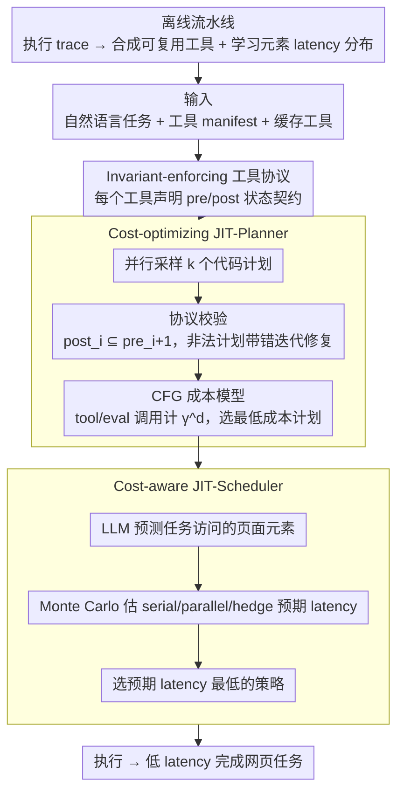

# Agent JIT Compilation for Latency-Optimizing Web Agent Planning and Scheduling

**会议**: ICML 2026  
**arXiv**: [2605.21470](https://arxiv.org/abs/2605.21470)  
**代码**: 无公开代码  
**领域**: LLM Agent / Web 自动化  
**关键词**: computer-use agent, JIT compilation, web automation, tool protocol, cost-aware scheduling  

## 一句话总结
这篇论文把网页 Computer-Use Agent 从逐步截图-调用 LLM-执行的循环，改造成类似 JIT 编译器的系统：把自然语言任务编译成可校验、可缓存、可并行调度的代码计划，从而让 JIT-Planner 比 Browser-Use 快 10.4×且准确率高 28pp，让 JIT-Scheduler 比 OpenAI CUA 快 2.4×且准确率高 9pp。

## 研究背景与动机
**领域现状**：Computer-use agents 试图用自然语言控制浏览器，执行订餐、购物、邮件、代码仓库和论坛等网页任务。主流实现一般是循环式 agent：观察截图或 DOM，调用 LLM 生成下一步 click/type/scroll，执行后再观察下一状态。

**现有痛点**：这种循环有三个突出问题。第一，工具集合过于原子化，click/type/scroll 虽然通用，但每个任务需要很多步骤，错误率高。第二，执行高度串行，每一步都要等 LLM，长任务 latency 很高。第三，计划生成后仍然不断引入非确定性 LLM 调用，很多本可用代码完成的数据处理或循环也被拆成多次推理。

**核心矛盾**：网页任务既需要 LLM 的语义理解，又包含大量可编译、可缓存、可静态检查的确定性操作。传统 agent 把所有步骤都当作在线决策，导致 latency 和错误都被 LLM 调用放大。

**本文目标**：作者希望把 agent 运行时优化从“选下一个动作”提升到“生成并优化整段可执行计划”。系统需要能检查工具调用顺序是否满足页面状态约束，估计不同候选计划的成本，并为可并行任务选择合适调度策略。

**切入角度**：论文借用 JIT compiler 的思想：自然语言任务像高层程序，系统在运行时把它编译成低层代码计划。多个候选计划都可能正确，但 latency 差异很大，因此要像编译器优化一样做静态验证和成本选择。

**核心 idea**：用 invariant-enforcing tool protocol 保证工具组合合法，用 CFG cost model 在候选代码计划中选最低成本方案，再用 Monte Carlo latency estimation 选择 serial/parallel/hedge 执行策略。

## 方法详解

### 整体框架
Agent JIT 把"网页 agent 执行下一步动作"的在线决策问题，改写成"运行时把自然语言任务编译成一段可执行代码计划再优化"的编译问题，借此把大量原本要逐步调 LLM 的确定性操作沉淀到代码里。系统由三个在线组件和一条离线缓存流水线组成：离线流水线从成功执行 trace 中合成可复用工具、并学习网页元素交互的 latency 分布；在线时输入自然语言任务、工具 manifest、缓存工具和历史 latency 分布后，JIT-Planner 并行采样多个代码计划（计划里可以混有普通工具调用、LLM eval 调用和控制流），靠 tool protocol 检查每个工具的 pre/post 状态是否可组合、再用成本模型在合法候选里选最便宜的一个，最后由 JIT-Scheduler 为可调度任务在 serial/parallel/hedge 三种执行策略中挑预期 latency 最低的那种。

### 关键设计

**1. Invariant-enforcing tool protocol：给工具加状态契约，让非法工具序列在编译期就被排除**

作者发现网页自动化中 45–50% 的错误其实来自错误的工具调用顺序——典型如还没进入详情页就调用了详情页专属工具——而这类错误传统上要等浏览器真的执行失败才暴露。为此协议把每个工具从"可调用函数"升级成带状态契约的可组合 building block：工具 manifest 除 input/output schema 外，还声明 pre、post 以及可选的 pre_check/post_check 和 execute。一段计划里相邻两个工具只有当前一个的 postcondition 能满足后一个的 precondition 时才合法，即状态流必须满足 $post_i \subseteq pre_{i+1}$。把这种状态不变量放进协议，相当于在编译阶段就把大批走不通的计划筛掉，而不是把检查推迟到运行时。

**2. Cost-optimizing JIT-Planner：同一任务有很多等价实现，要在合法候选里选 latency 最低的那份代码**

同一个网页任务往往有多种等价写法，比如直接用代码汇总整张列表，或者逐项调用 LLM 去判断——两者都能跑通，但实测 best-cost 与 worst-cost plan 的平均 latency 能差 5.3×，所以"能跑"远不够，还得做成本优化。planner 让多个 worker 并行向 LLM 采样计划，采样失败的计划会带着 protocol 给出的验证错误迭代修复，直到攒够 $k$ 个合法候选。随后为每个候选构建 CFG 估成本：一次工具调用计 $C_{tool}\gamma^d$，一次 AI eval 调用计 $C_{eval}\gamma^d$，其中 $d$ 是循环/嵌套深度、$\gamma=10$ 是深度惩罚因子，专门重罚"把昂贵 LLM 调用塞进循环"这种写法。最后返回估计成本最低的合法计划。

**3. Cost-aware JIT-Scheduler：没有一种执行策略永远最优，用 latency 分布做 Monte Carlo 估计来自适应选择**

并行适合互相独立的子任务，hedge 适合容易卡在某个 UI 元素上的任务，serial 适合短的线性任务，没有哪一种恒优，硬写人工调度规则又容易失准。scheduler 先让 LLM 预测各策略下任务大概会访问哪些网页元素，再从离线学到的元素 latency 分布里 Monte Carlo 采样，估出三种策略的预期耗时：serial 是所有交互耗时直接求和；parallel 是串行部分加上最慢 worker 的耗时；hedge 是开多个冗余 worker、取最快完成者的耗时再加上调度 overhead。系统选平均 latency 最低的那种执行。

### 一个完整示例
以一个 19 步的 GitLab 长任务为例走一遍三段协同。planner 并行采样出若干代码计划，其中一份在进入仓库页前就调用了详情页工具——protocol 检查发现该步的 precondition 没被上一步的 postcondition 满足（$post_i \not\subseteq pre_{i+1}$），把它判为非法并把错误反馈回去让 worker 修复；这一关让长任务的 valid-plan 候选大幅增多（Gemini-2.5-Pro 上 Pass@3 从 9% 升到 100%）。在攒齐的合法候选里，CFG 成本模型发现"逐项 LLM 判断"那版把 ai_eval 放进了循环、深度惩罚 $\gamma^d$ 让它成本飙高，于是选中"用代码批量处理列表"的低成本版本。最后 scheduler 预测该任务会反复访问若干会卡顿的 DOM 元素，Monte Carlo 估计显示 hedge 比 serial/parallel 都快，便采用 hedge 执行——整体在 8 秒内达到 100% Pass@t，而关掉 protocol 的对照只停在 22%。

### 损失函数 / 训练策略
本文是系统论文，没有模型训练损失，优化目标落在计划与调度两层的 latency-accuracy trade-off 上：JIT-Planner 的成本模型显式惩罚 tool calls、AI eval calls 和嵌套循环，JIT-Scheduler 用缓存的 latency 分布做 Monte Carlo 估计。离线缓存流水线则从执行 trace 中抽取 page schema、把动作映射到 schema elements、拟合 latency 分布，并合成可复用的 code tools。

## 实验关键数据

### 主实验
| 对比 | Latency | Accuracy | 结论 |
|------|---------|----------|------|
| Browser-Use | 122.1s | 基线 | 每步都调用 LLM，73% latency 来自推理 |
| Browser-Use +cache | 80.1s | 高于 Browser-Use | 有缓存工具但仍是逐步 agent loop，仅 1.5× 加速 |
| JIT-Planner | 11.7s | +28pp vs Browser-Use | 平均 10.4× 快于 Browser-Use，6.8× 快于 +cache |
| Worst-cost plan | 61.7s | 同为合法候选 | 与 best-cost 计划均值相差 5.3×，说明成本排序重要 |
| OpenAI CUA | 258.7s | 77.8% | 专用 CUA 仍串行执行 |
| Anthropic CUA | 141.7s | 79.0% | 准确率接近但 latency 高于 JIT-Scheduler |
| JIT-Scheduler (Gemini-2.5-Pro) | 109.9s | 86.4% | 比 OpenAI CUA 快 2.4×，准确率高 9pp |

### 消融实验
| 配置 / 现象 | 指标 | 结果 | 说明 |
|-------------|------|------|------|
| Protocol 对 valid-plan rate | GPT-4.1 | 78% → 91% | 工具不变量显著提高合法计划比例 |
| Protocol 对 valid-plan rate | Gemini-2.5-Pro | 79% → 96% | 长任务 Pass@k 也显著改善 |
| Protocol 对 valid-plan rate | Gemini-2.5-Flash | 74% → 85% | 小/快模型同样受益 |
| 长 GitLab 任务 Pass@3 | Gemini-2.5-Pro | 9% → 100% | 19 步任务中 protocol 让少量候选就能找到合法计划 |
| Tool-ordering failures | 无 protocol vs 有 protocol | 59% → 25% | 错误类型从状态顺序违规中被明显削减 |
| CUA +cache vs JIT-Planner | REAL 三应用 | JIT 快 1.5–2.4× | 相同缓存工具下仍更快，隔离出 planning optimization 的贡献 |

### 关键发现
- 协议不是文档装饰，而是实质提升 planner 搜索效率。Gemini-2.5-Pro 在长 GitLab 任务上的 Pass@3 从 9% 到 100%，并且 parallel hedging 在 8 秒内达到 100% Pass@t，而无 protocol 时停在 22%。
- 成本模型主要通过消除不必要 LLM inference 和循环中的 ai_eval 来加速。Browser-Use 的 73% latency 来自 LLM 调用，JIT-Planner 把任务编译成代码后能把很多推理移到计划阶段或完全删掉。
- 任务复杂度对 speedup 影响较小。JIT-Planner 在 C-Low/C-Medium/C-High 上分别有 10.8×、8.7×、11.8× speedup，在短/中/长任务上也保持约 10×，说明收益主要来自执行范式变化而不是某类任务特化。
- 调度策略确实需要自适应。GPT-4.1 下 Serial/Parallel/Hedge latency 分别为 157.3/166.2/130.3s，Gemini-2.5-Pro 为 129.6/148.5/98.4s；但最低 latency 策略不一定最高 accuracy，JIT-Scheduler 在两者之间取得更稳的 Pareto 点。

## 亮点与洞察
- 论文最强的工程洞察是把 web agent 看成编译问题，而不是纯 policy 问题。很多网页任务一旦抽象出 reusable tools，就更像程序合成和优化，而不是每一步都要重新“思考”。
- Invariant protocol 把 MCP 式类型检查推进到状态流检查，这对 agent 工具生态很重要。只检查参数类型不足以保证“当前页面是否能调用这个工具”。
- JIT-Planner 的 cost model 很朴素但有效：惩罚 LLM eval、惩罚嵌套循环，已经足以排序出明显更快的 plan。这说明很多 agent latency 优化不需要更大模型，而需要更好的运行时表示。
- Scheduler 用 latency distribution 而不是固定规则，贴近真实网页环境。网页元素交互常有长尾，hedging 在这种场景下比简单并行更合理。

## 局限与展望
- 系统依赖离线 trace 和缓存工具。对完全陌生网站、动态前端频繁变化或缺少成功轨迹的场景，工具合成和 latency 分布都需要重新建立。
- 任务覆盖 5 个应用和 37 个任务，已经比 toy demo 强，但距离真实开放网页仍有差距。尤其是登录、支付、验证码、个性化推荐等现实因素没有充分展开。
- Invariant manifest 需要工具作者或自动合成流程准确写出 pre/post 条件；如果不变量过松会漏错，过紧会误杀可行计划。
- Cost model 主要优化 latency，对 monetary cost、风险、权限、安全审计和用户可解释性考虑较少。未来的 agent compiler 可能需要多目标优化。

## 相关工作与启发
- **vs Browser-Use**: Browser-Use 是典型 observe-act loop，每步都依赖 LLM；Agent JIT 把任务编译成代码计划，减少执行期推理。
- **vs CUA**: OpenAI/Anthropic CUA 使用固定动作空间和串行执行；JIT 系统引入缓存工具、计划验证和调度选择，因此 latency 与准确率都更好。
- **vs code-action agents**: 既有 code action 工作让 agent 输出代码，但没有系统研究多个代码计划之间的 latency 差异；本文把代码计划当作可优化对象。
- **vs MCP/tool protocols**: MCP 主要强调工具接口和类型；本文进一步要求状态 pre/post invariant，使工具组合能做静态验证。

## 评分
- 新颖性: ⭐⭐⭐⭐ 把 agent 运行抽象成 JIT 编译和调度优化很有启发，组件本身借鉴编译器/系统思想但组合得扎实。
- 实验充分度: ⭐⭐⭐⭐ 覆盖五个应用、多模型、planner/scheduler/协议/缓存消融和显著性检验；开放网页泛化仍需更大规模验证。
- 写作质量: ⭐⭐⭐⭐ 系统架构、算法伪代码和结果分析清晰，附录给了足够细节；部分模型命名和 CUA 设置需要读者熟悉背景。
- 价值: ⭐⭐⭐⭐⭐ 对实际 web agent 降 latency 和提可靠性很有参考价值，也指出 agent 工具协议应包含状态不变量。

<!-- RELATED:START -->

## 相关论文

- [\[ICML 2026\] Weasel: 通过重要性-多样性数据选择实现 Web Agent 的域外泛化](weasel_out-of-domain_generalization_for_web_agents_via_importance-diversity_data.md)
- [\[ICML 2026\] ACON: Optimizing Context Compression for Long-horizon LLM Agents](acon_optimizing_context_compression_for_long-horizon_llm_agents.md)
- [\[ACL 2026\] TheraAgent: Self-Improving Therapeutic Agent for Precise and Comprehensive Treatment Planning](../../ACL2026/llm_agent/theraagent_self-improving_therapeutic_agent_for_precise_and_comprehensive_treatm.md)
- [\[ICML 2026\] NaviAgent: Graph-Driven Bilevel Planning for Scalable Tool Orchestration](naviagent_graph-driven_bilevel_planning_for_scalable_tool_orchestration.md)
- [\[CVPR 2026\] Ego2Web: A Web Agent Benchmark Grounded in Egocentric Videos](../../CVPR2026/llm_agent/ego2web_a_web_agent_benchmark_grounded_in_egocentric_videos.md)

<!-- RELATED:END -->
