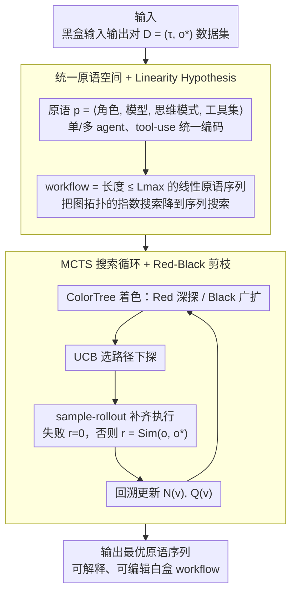

# AgentXRay: White-Boxing Agentic Systems via Workflow Reconstruction

**会议**: ICML 2026  
**arXiv**: [2602.05353](https://arxiv.org/abs/2602.05353)  
**代码**: 论文未明确标注（无明确链接）  
**领域**: LLM Agent / 可解释性 / 组合优化  
**关键词**: Agentic Workflow Reconstruction, MCTS, Red-Black Pruning, 黑盒解释, 多智能体

## 一句话总结
作者把"对黑盒 agent 系统反推一个等价白盒 workflow"作为新任务 AWR，用 MCTS 在 agent 原语序列空间中搜索，再配上一种基于评分动态着色的 Red-Black 剪枝来平衡深度与宽度，在五个真实领域上实现可解释的白盒重建。

## 研究背景与动机

**领域现状**：LLM agent / 多智能体系统（MAS）通过 role specialization 和工具调用解决复杂任务（ChatDev、MetaGPT 等）。但实际部署的高性能 agent 通常是黑盒——内部的 prompt、agent 拓扑、工具链都不可见。

**现有痛点**：用户只能看到输入和输出，无法理解决策过程；调试、改造、安全审计都受阻；现有 agent 可解释性研究要么针对单步 LLM 推理，要么需要白盒访问（如模型蒸馏），无法对纯黑盒 API 工作。

**核心矛盾**：黑盒系统的内部状态空间巨大（agent 角色 × 模型 × 思维模式 × 工具集 × 顺序），即便允许我们采样输入输出对，也无法穷举搜索；而经典蒸馏需要模型参数，根本不适用。

**本文目标**：定义一个新任务 Agentic Workflow Reconstruction (AWR)：仅靠 $(\tau, o^\ast)$ 输入输出对，合成一个显式、可解释、可编辑的白盒 workflow，使其执行后输出与黑盒尽量一致。

**切入角度**：(1) Linearity Hypothesis——多数实际 agent 系统执行时都串行化成一条 action-observation 序列（即便设计上是图），所以把搜索空间限制为长度 $\le L_{\max}$ 的原语链。(2) 输出相似度作为 proxy 指标，绕开真值功能等价的判定难题。

**核心 idea**：把 AWR 表述为离散原语序列空间上的组合优化，再用 MCTS + Red-Black 剪枝在 token 预算下高效逼近最优 workflow。

## 方法详解

### 整体框架
AgentXRay 要解决的是：给一个只能看到输入输出的黑盒 agent 系统 $\mathcal{M}_{\text{black}}$，反推出一个能复现它行为的白盒 workflow。输入是数据集 $\mathcal{D}=\{(\tau_i, o_i^\ast)\}$（任务 + 黑盒输出对），方法先把所有可能的 agent 构件统一编码成原语 $p=\langle \rho, \mu, \pi, T_{\text{local}}\rangle$（角色、底层模型、思维模式、工具集），把候选 workflow 表示成长度 $L \le L_{\max}$ 的线性原语序列 $\mathbf{s}=[s_1,\dots,s_L]$；然后在这个离散序列空间上用 MCTS 搜索，目标是最大化代理相似度 $\mathbf{s}^\ast = \arg\max_{\mathbf{s}} \mathbb{E}_{(\tau,o^\ast)}[\mathrm{Sim}(\Phi(\mathbf{s},\tau), o^\ast)]$（$\mathrm{Sim}$ 是任务特定度量，代码用 AST、文本用余弦）；搜索过程中用 Red-Black 着色逐节点决定该"深探"还是"广扩"，最后输出搜出来的那条最优序列作为白盒重建。

### 关键设计

**1. 统一原语空间 + Linearity Hypothesis：把图拓扑搜索压成线性序列搜索**

纯图拓扑搜索在中等规模的原语集上就直接爆炸——枚举所有 agent 拓扑是 $O(2^{|\Omega|^2})$，根本走不动。作者的破局点是两层抽象。第一层是把异构构件统一成同一个搜索单元：每个原语都是 $\langle$role, model, thought pattern, local tools$\rangle$，纯推理 agent 就是 $T_{\text{local}}=\emptyset$、工具增强 agent 就是 $T_{\text{local}}\ne\emptyset$，于是单 agent、多 agent、tool-use 系统都落在同一个空间 $\Omega$ 里。第二层是 Linearity Hypothesis：借 MacNet (Qian 2025) 指出多 agent DAG 执行时也会被拓扑排序、ReAct/WebArena 等交互天然就是一条 ordered trace 的观察，把搜索空间限制到长度 $\le L_{\max}$ 的线性序列，复杂度从 $O(2^{|\Omega|^2})$ 降到 $O(|\Omega|^{L_{\max}})$。它有效的关键在于，重建追求的是"行为保真"（输入输出匹配）而非还原内部拓扑——复现可观测的执行序列就够了，所以线性化是一个与任务对齐的剪枝，而不是会丢真值的近似。

**2. MCTS 搜索循环：用统计采样摊薄稀疏奖励的搜索代价**

即便压成线性序列，$|\Omega|^{L_{\max}}$ 仍然不可穷举，而且 $\mathrm{Sim}$ 是个延迟奖励——只有把 workflow 走到接近完整、真正执行一遍才能观测。AgentXRay 用 MCTS 处理这个稀疏信号：每次迭代抽一条 $(\tau, o^\ast)$，从根节点（一条 workflow 前缀，每条边追加一个原语）按 UCB 选路径下探，到达待扩节点时做 sample-rollout——把序列采样补齐到 $L_{\max}$ 并真正执行得到输出 $o$，执行失败记 $r=0$、否则 $r=\mathrm{Sim}(o, o^\ast)$，再沿路径回溯更新访问次数 $N(v)$ 和价值 $Q(v)$。比起穷举，MCTS 用采样把搜索代价 amortize；UCB 在角色/模型/工具各不相同的异构 action 空间里仍能稳健平衡探索与利用；rollout 一旦撞上无效原语就早停，不再为它烧完整条链的 token。

**3. Red-Black Pruning：用评分动态着色，让搜索预算花在"既有潜力又有深度可挖"的子树上**

标准 MCTS 在大 $\Omega$ 上容易卡在两端——要么宽得铺不下去走不深，要么一头扎进坏分支出不来。Red-Black 剪枝把"要不要继续 refine 当前路径"做成节点级的动态决策：每次迭代前用 ColorTree 给整棵树重新着色，评分高且访问次数足够的节点判为 Red（当前选择已稳定），就沿 UCB 继续往深走；尚未充分探索的节点判为 Black，优先创建新子节点把宽度撑开。整个 search loop（Algorithm 1）就由 color-guided descent (Line 9) + 早停 rollout (Lines 11–13) + reward backprop (Line 22) 三件事组成。和静态阈值剪枝不同，这里用"是否有信心继续深挖"的评分来量化决策，把资源引到值得深挖的子树上，因此在同等 iteration 预算下能走到更深的 workflow 层级、拿到更高的保真度。

### 损失函数 / 训练策略
非梯度方法，无训练阶段。"损失"就是负代理相似度 $-\mathrm{Sim}(\Phi(\mathbf{s},\tau), o^\ast)$，"优化器"是 MCTS + Red-Black Pruning。每次执行 workflow 都要真实调用 LLM API（GPT / Gemini 等），所以预算不按梯度步而按 iteration 数 $N$ 和总 token 来度量。

## 实验关键数据

### 主实验
五个领域、五个目标系统：软件开发 (ChatDev) / 数据分析 (MetaGPT) / 教育 (TeachMaster) / 3D 建模 (ChatGPT GPT-5.2 API) / 科学计算 (Gemini 3 Pro)。代理相似度用 Static Functional Equivalence (SFE)。

| 领域 / 目标系统 | 度量 | AgentXRay 平均 SFE | 备注 |
|-----------------|------|--------------------|------|
| 软件开发 / ChatDev | AST-based | 高 SFE（综合均值 0.426） | 重建出可执行的 dev workflow |
| 数据分析 / MetaGPT | AST + 文本 | 同上 | 多 agent 协作被线性化复现 |
| 教育 / TeachMaster | 文本相似度 | 同上 | 教学流程被还原 |
| 3D 建模 / ChatGPT | 输出对比 | 同上 | 单 agent + 工具调用链 |
| 科学计算 / Gemini 3 Pro | 输出对比 | 同上 | 长链科学推理也能近似 |
| 综合 | — | 0.426 SFE | 比无剪枝基线明显更高 |

### 消融实验

| 配置 | 现象 | 解读 |
|------|------|------|
| 完整 AgentXRay（MCTS + Red-Black） | 最佳 SFE，token 减少 8–22% | 剪枝在同预算下让搜索更深 |
| 无 Red-Black 剪枝（纯 MCTS） | SFE 较低 + token 多 | 节点选择缺乏评分引导，资源被均匀分散 |
| 无线性化假设（图拓扑搜索） | 不可行 | $O(2^{|\Omega|^2})$ 搜索爆炸 |
| 不同 $L_{\max}$ | 中等长度最优 | 太短表达力不够，太长 rollout 失败率上升 |
| 不同评分函数（仅 Sim vs Sim + 深度） | 多维评分更优 | "代理质量 + 搜索深度"联合评分让 Red-Black 更敏感 |

### 关键发现
- Red-Black 剪枝是 token 效率的关键开关：同样的 iteration 预算下，剪枝后能走到更深的 workflow 层级，从而拿到更好的 fidelity。
- Linearity Hypothesis 在五个截然不同的领域（含真正多 agent 的 ChatDev、MetaGPT）下都能给出可用 fidelity，验证了"执行时拓扑序"是黑盒可观测的主要信号。
- 即便目标系统是 GPT-5.2 或 Gemini 3 Pro 这种闭源 API，AgentXRay 仍能在仅 IO 访问下逼近行为；这意味着白盒重建对真正的"商用黑盒"也有效。
- 重建出的 workflow 是可编辑的——使用者可以替换某个角色 / 工具，从而做下游适配；这是与模型蒸馏的根本差异。

## 亮点与洞察
- 把可解释性问题转化为可观测层面的"行为等价 + 结构白盒"，避免了必须打开模型参数的不可能任务；这是把"interpretability"务实落地的一个范式。
- 统一原语定义同时覆盖 agent 与工具，使搜索空间在概念上对单 agent + tool-use 系统也成立——这扩大了适用面，不只限于多 agent 系统。
- Red-Black 剪枝把"剪 vs 不剪"做成节点级的动态决策（依赖评分），比静态阈值剪枝更稳健，可迁移到任何稀疏奖励的 LLM agent 搜索。
- 用 SFE 作为代理度量绕开"true functional equivalence"的不可判定性，是面对开放式多文件输出的现实折衷，思路可复用到 code synthesis / agent eval 领域。

## 局限与展望
- Linearity Hypothesis 是上界：真正强依赖并发 / 异步多 agent 的系统（同步对话、循环反馈）可能被线性序列错过本质行为。
- 评估指标 SFE 是代理度量；在某些任务上 AST 匹配或文本相似度并不能区分真正功能差异——可能导致评分误导 MCTS。
- Rollout 需要真实执行 workflow，单次成本就是若干次 LLM 调用，搜索 $N$ 次后 token 开销巨大；目前 8–22% 的节省主要是相对的，绝对成本仍高。
- 原语空间 $\Omega$ 需要事先准备 role / model / pattern / tool 候选；如果黑盒里用了未在 $\Omega$ 的特殊 trick，则永远重建不出来。

## 相关工作与启发
- **vs 模型蒸馏**：蒸馏要参数访问、产出黑盒小模型；AWR 仅要 IO，产出白盒可编辑 workflow。
- **vs MacNet / 多 agent 图结构（Qian 2025）**：MacNet 用 DAG 训练新 agent；本文相反——从黑盒 agent 反推一个等价线性 workflow。
- **vs ReAct / WebArena 等交互 agent**：那些工作设计 agent；本文用观察来逆向 agent，给出可解释表示。
- **vs MCTS-for-LLM 路线（如 ToT、AgentTrek）**：他们用 MCTS 搜索单条推理路径；本文用 MCTS 搜索"agent 构造图本身"，是更高一层抽象。

## 评分
- 新颖性: ⭐⭐⭐⭐⭐ AWR 任务定义本身是新的，Red-Black 评分剪枝也是对 MCTS 的实质改进。
- 实验充分度: ⭐⭐⭐⭐ 五个领域 + 真实闭源 API 覆盖，但每个领域细节展开不够，统计显著性可再加强。
- 写作质量: ⭐⭐⭐⭐ 任务动机、统一原语、Linearity 论证都很清晰；Algorithm 1 写得直接可复现。
- 价值: ⭐⭐⭐⭐ 对 agent 部署的可解释 / 可控 / 可审计有直接帮助，可成为"逆向工程闭源 agent API"的实用工具。

<!-- RELATED:START -->

## 相关论文

- [\[AAAI 2026\] A2Flow: Automating Agentic Workflow Generation via Self-Adaptive Abstraction Operators](../../AAAI2026/llm_agent/a2flow_automating_agentic_workflow_generation_via_self-adaptive_abstraction_oper.md)
- [\[ICML 2026\] Answer Only as Precisely as Justified: Calibrated Claim-Level Specificity Control for Agentic Systems](answer_only_as_precisely_as_justified_calibrated_claim-level_specificity_control.md)
- [\[ACL 2026\] Rethinking Reasoning-Intensive Retrieval: Evaluating and Advancing Retrievers in Agentic Search Systems](../../ACL2026/llm_agent/rethinking_reasoning-intensive_retrieval_evaluating_and_advancing_retrievers_in_.md)
- [\[AAAI 2026\] With Great Capabilities Come Great Responsibilities: Introducing the Agentic Risk & Capability Framework for Governing Agentic AI Systems](../../AAAI2026/llm_agent/with_great_capabilities_come_great_responsibilities_introducing_the_agentic_risk.md)
- [\[CVPR 2026\] Simple Agents Outperform Experts in Biomedical Imaging Workflow Optimization](../../CVPR2026/llm_agent/simple_agents_outperform_experts_in_biomedical_imaging_workflow_optimization.md)

<!-- RELATED:END -->
