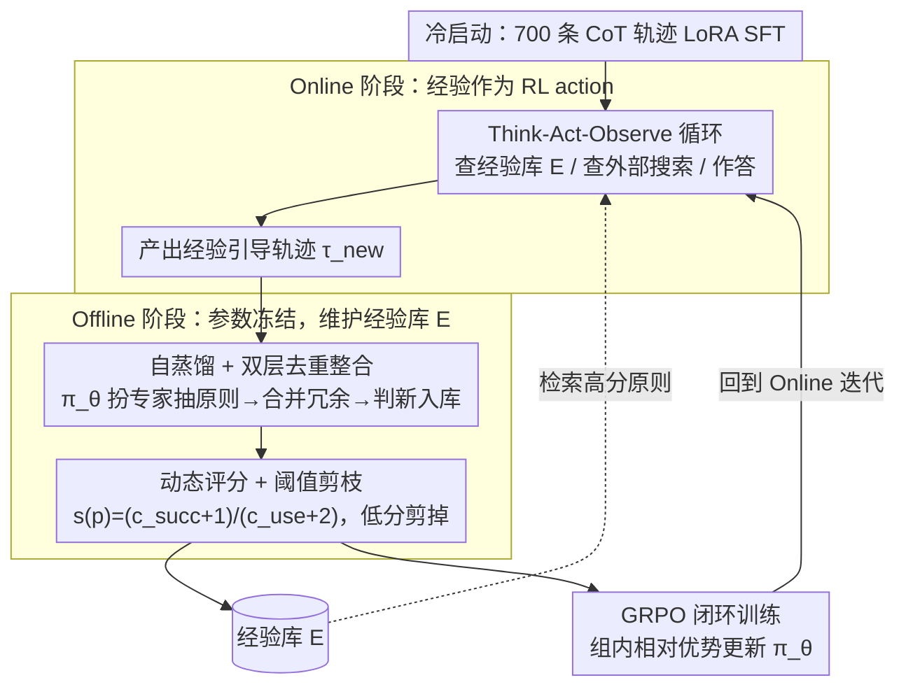

# EvolveR: Self-Evolving LLM Agents through an Experience-Driven Lifecycle

**会议**: ICML 2026  
**arXiv**: [2510.16079](https://arxiv.org/abs/2510.16079)  
**代码**: https://github.com/Edaizi/EvolveR (有)  
**领域**: LLM Agent / 持续学习 / 强化学习  
**关键词**: 经验生命周期、自蒸馏原则库、动态评分、GRPO、多跳问答

## 一句话总结
EvolveR 给 LLM agent 套一个「在线交互 → 离线自蒸馏成原则库 → GRPO 策略进化」的闭环生命周期：agent 不再丢弃过去轨迹，而是把自己的成功失败抽象成可检索的「策略原则」，再用 RL 学会**如何用自己的原则**去解新问题，在 7 个多跳 QA benchmark 上明显跑赢 Search-R1 等 RL agent baseline。

## 研究背景与动机

**领域现状**：LLM agent（ReAct、Reflexion、ExpeL、Search-R1 等）在工具调用上已能跑通，但绝大多数是「无状态」的：每次任务独立、过去经验要么直接丢、要么靠外部 LLM 教师 distill 出 hint 临时灌入。

**现有痛点**：(1) Reflexion 类方法把反思当成「一次性 hint」，agent 内在 policy 未更新；(2) 用 raw trajectory 检索（Case-based）容易在新任务上 overfit / 直接抄答案，而非抽象策略；(3) 用外部强教师 distill 经验，可能与 agent 自身能力分布不匹配（cognitive misalignment），小模型尤其如此；(4) Search-R1 / O2-Searcher 之类 RL agent 把「与外部搜索」的策略学得很好，但完全没解决「从自己经验中学习」的问题。

**核心矛盾**：人类专家通过「交互—反思—抽象」的连续循环成长；现有 agent 框架要么短路了反思（无状态），要么短路了抽象（raw case），要么短路了内化（仅 prompt，不更新 policy）。

**本文目标**：构造一个完整闭环 — agent 自己产生轨迹、自己蒸馏出可复用的策略原则、自己用 RL 学会用这些原则，整套系统不依赖外部教师。

**切入角度**：把「原则库」做成 agent 显式可检索的工具（与 search engine 同等地位）；让 GRPO 不仅学「怎么解题」还学「怎么用经验」。

**核心 idea**：自蒸馏原则 + 动态评分维护 + 实验经验作为 action — 把经验 lifecycle 与 RL policy 进化拧成一根绳。

## 方法详解

### 整体框架
EvolveR 要解决的是 agent「做完一题就忘」的问题，办法是把一个交替执行的两阶段生命周期拧成闭环。**Online 阶段**里 agent 在 Think-Act-Observe 循环中可发三类 action：`<search_experience>` 查自己的经验库 $\mathcal E$、`<search_knowledge>` 查外部搜索、`<answer>` 给最终答案，产生的轨迹 $\tau_{\text{new}}$ 全部留下来；到了 **Offline 阶段**参数冻结，agent 用自己当前的 policy $\pi_\theta$ 扮「专家」角色回看最近一批轨迹，按成败把它们蒸馏成「成功原则 / 失败原则」（每条原则 = 一段自然语言描述 + 若干结构化知识三元组），经去重合并和打分后写回 $\mathcal E$，最后用 GRPO 在这批轨迹上更新 $\pi_\theta$，回到 Online。整套循环不依赖任何外部教师，正式迭代前先用 ~700 条 NQ/HotpotQA 的 CoT 轨迹做一遍 LoRA SFT 冷启动，稳住早期 RL。

### 关键设计

**1. 自蒸馏 + 双层去重整合的经验库 $\mathcal E$：让经验从轨迹里长出来，又不让库膨胀**

agent 过去的轨迹要么被丢、要么靠外部强教师 distill，而强教师产出的原则常常超出 agent 自身的执行能力（cognitive misalignment），小模型尤甚。EvolveR 索性让每条轨迹 $\tau$ 都由 $\pi_\theta$ **自己**按 prompt 抽出一条候选原则 $p_{\text{cand}}$，蒸馏者和执行者是同一个 policy，原则天然落在 agent 能用得上的能力分布内。但自蒸馏会产生大量重复，于是接一道双层整合：第一层先把同一问题下因 GRPO 多次采样得到的语义等价原则合并；第二层再在全库 $\mathcal E$ 里做 embedding 检索 + 二分类语义判定，若 $\max_{p\in\mathcal E}\text{sim}(p_{\text{cand}},p)<\theta_{\text{sim}}$ 就作为新条目入库 $\mathcal E\leftarrow\mathcal E\cup\{p_{\text{cand}}\}$，否则把来源轨迹 $\tau_{\text{src}}$ Merge 到最相似的已有条目 $p^*$ 下，只丰富它的证据而不新增冗余。这样既绕开了外部教师的分布错配，又避免了 raw case 库爆炸、重复条目稀释检索质量。

**2. 动态评分 + 阈值剪枝：让库自己优胜劣汰**

光往库里塞原则，时间一长高价值和噪声原则混在一起，检索就被拖垮。EvolveR 给每条原则 $p$ 挂两个计数——被检索使用次数 $c_{\text{use}}(p)$ 和随后任务成功次数 $c_{\text{succ}}(p)$——用 Laplace 平滑算一个分数 $s(p)=\frac{c_{\text{succ}}(p)+1}{c_{\text{use}}(p)+2}$，低于阈值 $\theta_{\text{prune}}$ 的周期性剪掉。Laplace 平滑这里很关键：分子分母各加常数，让刚入库、使用次数极低的新原则有一个合理的默认分，不至于一上来就被剪；随着 $c_{\text{use}}$ 增大，分数又会收敛到真实成功率。retrieval 优先返回高分原则，prune 持续清掉低分噪声，库才能长期不塌成垃圾堆——这正是 ExpeL 类「经验越用越脏」毛病的解法。

**3. 经验作为 RL action + GRPO 闭环训练：不只读经验，还学会怎么用经验**

把原则库当成只读的 RAG，policy 本身并不会进化；EvolveR 的关键一步是把 `<search_experience>` 设成和外部搜索平起平坐的 first-class action，让 RL 的梯度直接打在「什么时候该查经验、查哪条最有用」上。reward 是 outcome reward（answer 与 ground truth 的 EM）和 format reward 的加权和 $R(\tau)=w_o R_{\text{outcome}}+w_f R_{\text{format}}$，其中 format reward 鼓励 think、search、answer 各至少出现一次、且 `search_experience` 与 `search_knowledge` 都被调用过。policy 用 GRPO 优化，每个 prompt 采 $G=8$ 条轨迹做组内相对优势估计：

$$\mathcal J_{\text{GRPO}}(\theta)=\mathbb E_\tau\Big[\sum_t \min\big(\rho_t \hat A_t,\ \text{clip}(\rho_t,1-\epsilon,1+\epsilon)\hat A_t\big) - \beta D_{\text{KL}}[\pi_\theta\|\pi_{\text{ref}}]\Big]$$

GRPO 无需额外 critic、训练更稳，而它在「经验引导」轨迹之间做相对比较的特性，恰好能把「检索到某条成功原则 → 任务成功」的因果连接强化进 policy——这是整个闭环真正能进化的地方。

### 损失函数 / 训练策略
冷启动用 LLaMA-Factory 在 700 条 CoT 样本上做 LoRA SFT；RL 阶段用 Verl 框架跑 GRPO，batch 128 个 prompt、每 prompt $G=8$、Adam lr $1\times 10^{-6}$、warmup 20、mini-batch 128，8 张 A100。format reward 具体为 $R_{\text{format}}=\mathbb I(\tau_{\text{complete}})\cdot (R_{\text{think}}+R_{\text{search}})/2$，在轨迹结构完整的前提下同时奖励合理的 think 步数与多类型 search 调用。

## 实验关键数据

### 主实验
7 个 QA benchmark，分 In-domain（NQ、HotpotQA）与 OOD（TriviaQA、PopQA、2Wiki、Musique、Bamboogle）。EM 作为主指标，Qwen2.5-3B 与 7B 全面对比。

| 模型 | 方法 | NQ | HotpotQA | TriviaQA | PopQA | 2Wiki | Musique | Bamboogle | **Avg** |
|---|---|---|---|---|---|---|---|---|---|
| 3B | Direct | .106 | .149 | .288 | .108 | .244 | .020 | .024 | .134 |
| 3B | RAG | .348 | .255 | .544 | .387 | .226 | .047 | .080 | .270 |
| 3B | Search-R1-instruct | .341 | .324 | .545 | .378 | .319 | .103 | .264 | .325 |
| 3B | **EvolveR** | **.434** | **.373** | .584 | .434 | **.381** | **.137** | **.328** | **.382** |
| 7B | RAG | .349 | .299 | .585 | — | — | — | — | — |
| 7B | **EvolveR** | — | — | — | — | — | — | — | **.417** |

（更多 7B 行号原文 Table 1 给出；3B 上 EvolveR 平均 +5.7 EM 优于最强 baseline Search-R1-instruct。）

### 消融实验

| 配置 | 平均 EM 变化 | 说明 |
|---|---|---|
| Full EvolveR | 0.382 (3B) | 完整经验生命周期 |
| 去掉自蒸馏，用外部强教师 distill | 3B 下降，7B 持平 | 验证 cognitive alignment 在小模型上更重要 |
| 去掉去重 + 评分 | 库膨胀，性能下降 | curation 关键 |
| 去掉 `<search_experience>` action | 退化为 Search-R1 | RL 学不到「用自己经验」 |
| 仅 prompt + raw case 检索 | 显著下降 | 抽象原则 ≫ raw trajectory |

### 关键发现
- 在 3B 小模型上**自蒸馏胜过用更强外部教师 distill** — 这反直觉但合理：教师产出的原则可能超出 agent 自身执行能力，反而不可用。
- experience action 与 RL 的协同最关键：单纯把原则库当 RAG 用不更新 policy，提升幅度远小于 EvolveR。
- OOD 数据集（Bamboogle 等对抗多跳）上提升更显著，说明蒸馏出的「策略原则」相比记住具体事实有更好的泛化迁移。

## 亮点与洞察
- **「经验作为可学习 action」的设计**：把 `<search_experience>` 与 `<search_knowledge>` 并列为 first-class action，让 GRPO 直接对「查/不查经验」打梯度 — 这是 EvolveR 与所有 prompt-only memory 框架的本质分水岭。
- **认知对齐 (cognitive alignment)**：自蒸馏让经验匹配 agent 自身能力分布，是开放性洞察 — 暗示 self-improvement 系统的「教师」不一定越强越好。
- **闭环可滚动**：动态评分 + 剪枝让库长期可维护，避免了 ExpeL 类「经验越用越脏」的常见塌缩。

## 局限与展望
- 在 7B 模型上自蒸馏与外部 distill 表现接近，说明随着 base model 变强，「认知对齐」红利减弱 — 在 30B/70B 上是否还成立未知。
- 实验集中在多跳 QA，对长程 agentic 任务（web nav、code agent）尚未验证；而那才是 lifecycle 最该发光的场景。
- 原则库随训练增长，retrieval 延迟、embedding drift 等工程问题在长期部署中未充分讨论。
- format reward 工艺化（强制各类 action 都出现）可能引入虚假调用，是否伤害真实最优策略仍需进一步验证。

## 相关工作与启发
- **vs Reflexion / ExpeL**：他们存反思 / 经验但不更新 policy；EvolveR 经验同时驱动 retrieval 与 RL。
- **vs Search-R1 / O2-Searcher**：它们用 RL 学外部知识检索；EvolveR 多走一步，把 agent 自身经验也变成可学习目标。
- **vs Mem0 / G-Memory**：原则结构受其启发（自然语言 + 知识三元组），但 EvolveR 把这种结构嵌入完整 RL lifecycle，而非单纯做检索。

## 评分
- 新颖性: ⭐⭐⭐⭐⭐ 把经验生命周期 + 自蒸馏 + GRPO 三件套拧成闭环，是 agent 持续学习方向上少见的端到端方案
- 实验充分度: ⭐⭐⭐⭐ 7 个 benchmark + 多 scale 消融 + cognitive alignment 对照，覆盖面广
- 写作质量: ⭐⭐⭐⭐ 系统组件介绍清晰、Figure 1 四种 paradigm 对照直观
- 价值: ⭐⭐⭐⭐ 提供了「agent 自我进化」的可复现工程范式，对 long-horizon agent 路线有方法贡献

<!-- RELATED:START -->

## 相关论文

- [\[ICML 2026\] Towards Feedback-to-Plan Decisions for Self-Evolving LLM Agents in CUDA Kernel Generation](towards_feedback-to-plan_decisions_for_self-evolving_llm_agents_in_cuda_kernel_g.md)
- [\[ACL 2026\] Mem²Evolve: Towards Self-Evolving Agents via Co-Evolutionary Capability Expansion and Experience Distillation](../../ACL2026/llm_agent/mem2evolve_towards_self-evolving_agents_via_co-evolutionary_capability_expansion.md)
- [\[ICML 2026\] Talk, Judge, Cooperate: Gossip-Driven Indirect Reciprocity in Self-Interested LLM Agents](talk_judge_cooperate_gossip-driven_indirect_reciprocity_in_self-interested_llm_a.md)
- [\[ICML 2026\] AutoRPA: Efficient GUI Automation through LLM-Driven Code Synthesis from Interactions](autorpa_efficient_gui_automation_through_llm-driven_code_synthesis_from_interact.md)
- [\[ICML 2026\] SE-GA: Memory-Augmented Self-Evolution for GUI Agents](se-ga_memory-augmented_self-evolution_for_gui_agents.md)

<!-- RELATED:END -->
