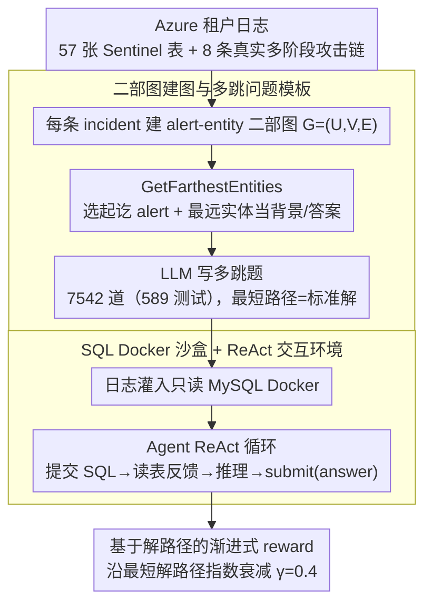

# ExCyTIn-Bench: Evaluating LLM Agents on Cyber Threat Investigation

**会议**: ICML 2026  
**arXiv**: [2507.14201](https://arxiv.org/abs/2507.14201)  
**代码**: https://github.com/microsoft/ExCyTIn-Bench (SecRL)  
**领域**: LLM Agent / 网络安全 / Benchmark  
**关键词**: 威胁调查、SQL Agent、二部图问答、Azure Sentinel、ReAct

## 一句话总结
本文构建了首个评测 LLM Agent 端到端做"网络威胁调查"的 benchmark ExCyTIn-Bench：从真实 Azure 租户的 57 张安全日志表里，用 alert-entity 二部图自动生成 7542 道带证据链的 SQL 问答题，并提供 MySQL 环境让 Agent 通过查询日志、多跳追踪证据来回答，目前最强模型 Claude-Opus-4.5 也只能拿 0.606 的 reward。

## 研究背景与动机

**领域现状**：云端攻击在 2022→2023 年增长 75%，传统的行为分析、特征匹配、异常检测都越来越难挡住攻击者；SOC（安全运营中心）分析师每天要手工翻几十张异构日志表，做多跳证据链推理才能定位攻击。LLM 在 SWE-Bench、AutoGen 等任务上已经能做多步观察-推理-动作，自然地，把 LLM Agent 用在威胁调查上是个明显方向。

**现有痛点**：已有 cyber 相关 benchmark（CTIBench、SECURE、SecQA、CyBench 等）几乎都在测"知识记忆"或"文本理解"——给一段 CTI 报告判断 MITRE 技战术、做 CTF 题目、答多选题。**没有一个 benchmark 真正让 Agent 在一个有几十张日志表的环境里，从一条 seed alert 出发主动查询、跳转、串证据**。这导致研究者无法系统比较不同模型/方法在端到端调查上的差距。

**核心矛盾**：真实威胁调查是一个 **environment-interactive、long-horizon、需要领域专业知识** 的任务，而现有评测形式（多选/文本理解）天然回避了这三点。要补这个空缺，关键在于：(1) 怎么拿到带 ground-truth 的真实多阶段攻击数据；(2) 怎么自动而非手工地生成大量有"唯一确定答案"+"可解释解路径"的问题。

**本文目标**：构建一个 (a) 基于真实多阶段攻击的安全日志环境，(b) 大规模带 ground-truth 解路径的问答集，(c) 可执行的 SQL 沙盒，让 Agent 真正"查日志做调查"。

**切入角度**：作者观察到——人类 SOC 分析师其实是在一个**隐含的 alert-entity 二部图**上"游走"：从 seed alert 出发，通过共享实体（IP、账号、域名等 IoC）跳到相邻 alert，再继续扩散。这个图天然提供了"问题源点→答案终点"的最短路径，可以直接被 LLM 当作模板生成多跳问题。

**核心 idea**：用真实 Azure 租户里 8 条多阶段攻击链作为数据源，把所有 alert 和 entity 抽出来组成二部图，挑两个 alert 当 start/end，用图上**最远实体**当背景上下文与答案，再让 LLM 写问题——既保证问题不可重复、又保证 ground-truth 唯一、解路径可解释。

## 方法详解

### 整体框架
ExCyTIn-Bench 把"网络威胁调查"做成一个可交互、可判分的闭环，由数据、出题、环境三层拼起来。数据层从微软用于安全演示的虚构 Azure 租户 "Alpine Ski House" 采集 57 张 Sentinel 日志表（EmailEvents、SecurityAlert、SecurityIncident 等），里面注入了 8 条独立的多阶段攻击链（Manatee Tempest 勒索、BEC 账号接管、SAP 财务篡改等），每条都有真实历史攻击的剧本依据，alert 数从 7 到 7739 不等、时间跨度 2 小时到 5 天。出题层在每条攻击链上用 alert-entity 二部图自动生成 7542 道题（589 道作测试集）。环境层把全部日志灌进一个只读 MySQL Docker，Agent 拿到一道带 seed alert 和起始实体上下文的安全问题后，以 ReAct 循环反复"提交 SQL 查询 → 读表格反馈 → 推理"，直到给出 final answer 字符串，再用 ground-truth 实体匹配、按是否摸到解路径上的中间节点算 partial reward。

### 关键设计

**1. 二部图建图与多跳问题模板：把"出题"从凭经验变成图上采样**

直接让 LLM 通读一整条 incident 自由出题，写出来的往往泛泛、没有唯一答案，难度也无法量化。作者注意到人类 SOC 分析师其实是在一张隐含的 alert-entity 二部图上游走，于是把它显式化：对每条 incident 定义 $G=(U,V,E)$，$U$ 是 alert 节点、$V$ 是 entity 节点（IP、账号、域名等 IoC），边 $E$ 由 alert 表里 "entities" 列出现的实体连出。出题时挑两个 alert 节点 $u_s, u_t$ 作起讫，调用 `GetFarthestEntities` 从 $u_s$ 选 $k=2$ 个离 $u_t$ 最远的实体当背景 $V_s$、从 $u_t$ 选 1 个最远实体 $v_e$ 当答案，让 LLM 围绕 $(u_s, V_s, v_e, u_t)$ 写一道"已知 X、朝 Y 调查"的题，两点间的最短路径自动成为标准解。这样一次性把三件事结构化：问题难度 = 路径长度、答案 = 终点节点、IoC = 路径上的节点；既保证答案唯一、解路径可解释，又能无缝平移到任何新灌入的日志。

**2. SQL Docker 沙盒 + ReAct 交互环境：用确定性动作空间贴近真实 SOC 工作流**

要测"端到端调查"就不能只让模型读文本，得让它真去查日志。本文参考 InterCode 把动作空间收成 SQL：每一步 Agent 输出一条 SQL（动作），只读的 MySQL 环境返回查询结果（观察），如此往复直到 Agent 调用 `submit(answer)`。选 SQL 而非开放工具调用有两层考虑——一是 KQL/SQL 查日志本就是 SOC 分析师的日常，贴近真实工作流；二是把"自然语言意图 → 可验证动作"压成确定性接口，避免开放工具调用带来的评测噪声。环境外层还挂了 ReAct、Best-of-N、Self-Reflection、Expel 等可替换 wrapper，方便在同一套题上横向比较各种 test-time scaling 策略。

**3. 基于解路径的渐进式 reward：用衰减式部分奖励拉开模型差距**

威胁调查很难一击命中，若用 0/1 二元评分，所有 Agent 看起来都差不多、benchmark 要么全员零分要么很快饱和。本文改成沿最短解路径给部分奖励：设解路径 $\mathcal{S}=[s_1,\dots,s_n]$，先 check 最终答案，正确直接给 1；否则从终点反向回溯，对每个中间节点 $s_i$ 用 `check_step` 判断 Agent 的历史轨迹里是否查到过，按指数衰减累加

$$r=\sum_i d\cdot\gamma^{\,|\mathcal{S}|-i},\quad \gamma=0.4$$

越靠近最终答案的节点权重越高（$\gamma<1$ 让远端浅层节点贡献被压低）。这样既鼓励多跳推进、给"走到一半"的 Agent 应得的分，又不会奖励那些靠瞎走蹭到浅层节点的轨迹，从而在所有模型间拉出有区分度的分数。

### 损失函数 / 训练策略
本文是 benchmark 论文，**不训练任何模型**，只评测现成 LLM。出题阶段用 GPT-4 类模型按上面的二部图模板生成 QA + solution，再人工抽检；评测阶段把所有 baseline 跑在统一的 SQL 环境里，按解路径 partial reward 打分。

## 实验关键数据

### 主实验

8 条 incident、589 道测试题上的平均 reward（越高越好）：

| 模型 | 平均 reward | 备注 |
|------|------------|------|
| Claude-Opus-4.5 | **0.606** | 当前最强 |
| GPT-4.1 | 0.338 | 大 chat 模型最优 |
| o4-mini | 0.39 左右 | reasoning 模型有优势 |
| GPT-4o | 0.293 | 通用旗舰 |
| Llama4-17B-Maverick | 0.290 | 开源最佳 |
| GPT-4.1-mini | 0.271 | 小型 chat |
| Llama4-17B-Scout | 0.262 | |
| o3-mini | 0.296 | reasoning 小模型 |
| o1-mini | 0.222 | |
| GPT-4o-mini | 0.192 | |
| GPT-4.1-nano | 0.136 | 最弱 nano |
| Phi-4-14B | 0.085 | 小模型基本不能做 |

按 incident 横向看，差距巨大：incident 38（Fileless Attack，只有 25 alert）相对好做（多数模型 0.2–0.5），而 incident 166（SAP Financial Manipulation，88 alert + 跨表多）和 incident 39（475 alert 的人为入侵链）最难，多数模型 reward 跌到 0.15–0.25。

### 消融实验

| 配置 | 平均 reward | 关键发现 |
|------|------------|----------|
| ReAct (default) | 基线 | 标准多步推理 |
| + Self-Reflection | 略升 | 错误自反思有用，但提升有限 |
| + Best-of-N | 升 | 算力换性能，提升与 N 接近线性 |
| + Expel (从经验回放) | 升 | 离线经验抽取有效 |
| 直接给最短路径 | 大幅升 | 验证 partial reward 设计合理 |

### 关键发现
- **顶级 reasoning 模型也远未饱和**：连 Claude-Opus-4.5 都只有 0.606，意味着 ~40% 的题它都没摸到 ground-truth；说明"长链多跳安全调查"在 frontier 模型上仍是真实挑战，benchmark 不会被很快刷穿。
- **小模型几乎不可用**：Phi-4-14B 才 0.085，GPT-4.1-nano 才 0.136；这告诉社区 cyber agent 任务对模型容量的最低门槛很高，蒸馏/小模型路线不能简单照搬通用 benchmark 的结论。
- **incident 难度 ≠ alert 数量**：incident 55 有 7739 个 alert 但 reward 反而高（GPT-4.1 拿到 0.474），而 incident 166 只有 88 个 alert 但所有模型都做得差；说明真正难的是**跨表 join + 实体歧义**，不是日志吞吐量。
- **test-time scaling 有效但有上限**：Best-of-N / Reflection 都能稳定加分，但都比不过换更强的底模型；这暗示 cyber agent 的瓶颈在"领域知识 + 长程规划"而不是"采样不够"。

## 亮点与洞察
- **用二部图自动生成多跳安全题** 是一个非常聪明的设计：把"出题"从"凭经验"变成"图上采样 + LLM 改写"，既保证答案唯一、又保证难度可量化（最短路径长度天然就是难度）。这套范式可以平移到任何"实体-事件"型领域（医疗诊断、金融审计、运维 RCA）。
- **partial reward 沿解路径衰减** 不是新想法，但把它嫁接到"日志查询动作空间"上能直接拉开模型差距，避免 benchmark 一上来就饱和或全员零分，对未来 cyber agent 评测是个值得复用的 trick。
- **诚实的难度选择**：用 8 条**真实历史攻击**剧本（Manatee Tempest、BEC、SAP 入侵等）而不是合成攻击，让 benchmark 与真实 SOC 工作流的差距尽可能小；同时 incident 数（8 条）和题量（7542）平衡得不错，既能覆盖多场景又不至于太大跑不动。

## 局限与展望
- 数据来源单一：只用了一个 Azure 租户 + Microsoft Sentinel 生态，对 AWS GuardDuty / Splunk / Elastic 等其他云/SIEM 平台的迁移性未验证；不同厂商的日志 schema 差异极大，benchmark 上的结论未必能直接照搬。
- 评测只覆盖 SQL 查询动作：真实 SOC 还要用 EDR、网络抓包、沙盒重放等工具；本 benchmark 把动作空间收窄成 SQL，会高估"会写 SQL 的 LLM"的实际威胁狩猎能力。
- 8 条 incident 的难度分布不均（reward 范围 0.085–0.491），少数 incident 几乎拉满全部分数差距，未来需要扩到几十条 incident 才能做更稳定的模型对比。
- 二部图生成的题倾向于"找最后一个 IoC"型问题，对"判断攻击者意图""归因到 APT 组织"等更高阶分析任务覆盖不足。

## 相关工作与启发
- **vs CTIBench / SECURE / SecQA**：它们都是闭卷多选题或文本理解题，测的是"LLM 记住多少 cyber 知识"；ExCyTIn 是开卷交互题，测的是"LLM 能不能在日志里自己挖出答案"，更接近真实工作流。
- **vs CyBench (CTF)**：CyBench 是攻击者视角的 CTF 挑战；ExCyTIn 是防御者视角的 forensics 调查，两者互补构成"红蓝双视角"的 cyber agent 评测体系。
- **vs InterCode**：本文直接复用了 InterCode 的 SQL 交互环境设计；启发是——**先有通用的 environment shell，再往里灌特定领域数据**，比从头造 environment 容易得多。

## 评分
- 新颖性: ⭐⭐⭐⭐ 首个 cyber 调查 agent benchmark + 二部图问题生成范式，方向独到
- 实验充分度: ⭐⭐⭐⭐ 覆盖 12+ 主流模型 + 4 种 prompting 策略 + 8 个 incident，量足
- 写作质量: ⭐⭐⭐⭐ 动机讲得清楚，benchmark 三部分结构干净；附录给了详细 prompt 和 SQL 示例
- 价值: ⭐⭐⭐⭐⭐ 填补 cyber agent 评测空白，且任务远未饱和，能持续吃住 frontier 模型的提升

<!-- RELATED:START -->

## 相关论文

- [\[ACL 2025\] LegalAgentBench: Evaluating LLM Agents in Legal Domain](../../ACL2025/llm_agent/legalagentbench_evaluating_llm_agents_in_legal_domain.md)
- [\[ACL 2025\] MultiAgentBench: Evaluating the Collaboration and Competition of LLM Agents](../../ACL2025/llm_agent/multiagentbench_evaluating_the_collaboration_and_competition_of_llm_agents.md)
- [\[ICLR 2026\] ZeroDayBench: Evaluating LLM Agents on Unseen Zero-Day Vulnerabilities for Cyberdefense](../../ICLR2026/llm_agent/zerodaybench_evaluating_llm_agents_on_unseen_zero-day_vulnerabilities_for_cyberd.md)
- [\[NeurIPS 2025\] EU-Agent-Bench: Measuring Illegal Behavior of LLM Agents Under EU Law](../../NeurIPS2025/llm_agent/eu-agent-bench_measuring_illegal_behavior_of_llm_agents_under_eu_law.md)
- [\[ICML 2026\] Hunt Instead of Wait: Evaluating Deep Data Research on Large Language Models](hunt_instead_of_wait_evaluating_deep_data_research_on_large_language_models.md)

<!-- RELATED:END -->
