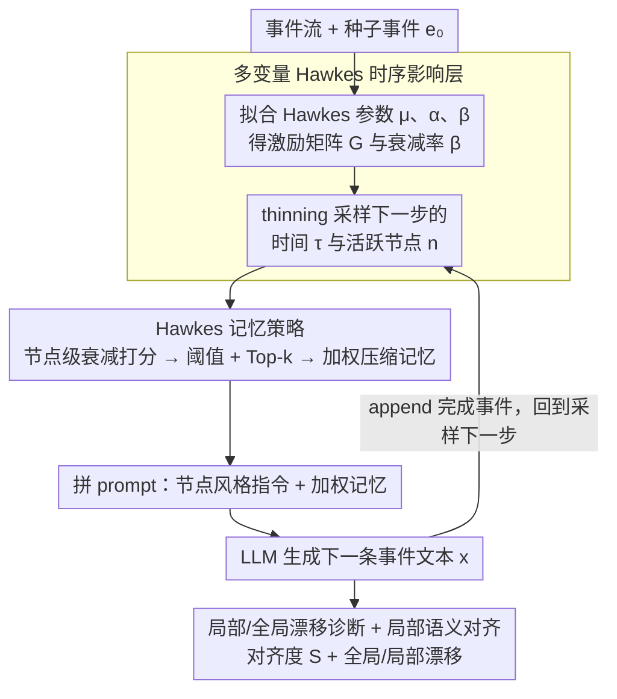

# HawkesLLM: Semantic Uncertainty Propagation in Agentic Text Simulation

**会议**: ICML 2026  
**arXiv**: [2605.23043](https://arxiv.org/abs/2605.23043)  
**代码**: 待确认  
**领域**: LLM Agent / 文本模拟 / 不确定性  
**关键词**: Hawkes 过程, 语义不确定性, 智能体文本模拟, 级联生成, 记忆选择

## 一句话总结
HawkesLLM 把多变量 Hawkes 点过程嫁接到 LLM 智能体文本模拟循环中：Hawkes 负责安排"何时由哪个节点生成"以及"用哪些历史节点的输出作为压缩记忆"，LLM 只负责把被选中的记忆写成下一条事件，在 GDELT Artemis II 新闻级联上获得了在紧凑提示预算下仍随时间上升的后段语义对齐度。

## 研究背景与动机
**领域现状**：当前对 LLM 不确定性的研究主要聚焦在单轮生成层面，例如语义熵、黑箱置信度估计、智能体内部的不确定性感知与工具调用决策。这些方法把不确定性看作"对当前问题的一次回答"。

**现有痛点**：在"边写边读"的 agentic 文本模拟（如新闻级联、社媒叙事、多步智能体交互）里，每一条早先生成的文本都会变成后续 prompt 的一部分。早期的语义模糊会沿着轨迹传播，单步级别的不确定性度量看不到这种路径依赖，长上下文 LLM 又被证明并不会均匀利用所有上下文，无差别堆叠历史并不能解决问题。

**核心矛盾**：要让后续生成稳定，就需要"哪些历史最该进 prompt"的结构化信号；但纯靠 LLM 自己挑选既不可解释也不可控；而图级联模型给了节点结构，却不带文本。

**本文目标**：把"时序影响建模"和"文本生成"解耦——前者决定何时由谁说话、说话时该回看谁，后者只做语言层；并且要在轨迹级别度量语义不确定性，而不是只在结尾。

**切入角度**：作者观察到 Hawkes 点过程恰好同时给出两件事——节点的发生强度（决定下一个谁活跃）与节点对节点的累积激励矩阵（决定该回看谁），把它拟合在事件流上即可作为"可检视的记忆调度信号"。

**核心 idea**：用多变量 Hawkes 过程驱动节点选择和提示记忆权重，让 LLM 在每一步基于"按时序影响打分挑出的"压缩记忆生成下一条事件，从而把语义不确定性的传播变成可监控的轨迹问题。

## 方法详解

### 整体框架
论文把"边写边读"的文本级联建模在一张固定有向图 $\mathcal{G}_0=(\mathcal{N},\mathcal{E})$ 上，每个节点是一个"文本生成智能体"，每个事件 $e_m=(\tau_m, n_m, x_m)$ 是一条"时间戳—节点—文本"三元组。核心做法是把"调度"和"语言化"彻底拆开：从种子事件 $e_0$ 出发循环 $L$ 步，每一步都先让拟合好的多变量 Hawkes 过程决定**何时由哪个节点说话**、并据此打分挑出**该回看哪些历史节点**作为压缩记忆 $\mathcal{M}_t$，再把这段记忆连同节点风格指令 $a_{n_t}$ 拼成 prompt $p_t$ 交给 LLM 采样下一条文本 $x_t \sim g_{\text{LLM}}(\cdot\mid p_t)$。整条流水线里 LLM 只负责写字，时间、节点、记忆全由 Hawkes 控制，于是语义不确定性的传播就被框成一个可监控、可读的轨迹问题。

### 关键设计

**1. 多变量 Hawkes 时序影响层：把"谁该说话、谁影响谁"写成可读的参数化点过程**

传统做法要么让 LLM 自己挑历史（不可解释），要么用图级联模型给结构却不带文本。这里换成参数化 Hawkes：节点 $i$ 的条件强度 $\lambda_i(s) = \mu_i + \sum_{(j,i)\in\mathcal{E}} \sum_{\tau_m<s, n_m=j} \phi_{j,i}(s-\tau_m)$ 用指数核 $\phi_{j,i}(u)=\alpha_{j,i} e^{-\beta u}$ 描述历史事件的衰减激励，背景强度 $\mu_i$ 决定自发频率。拟合时固定一组 $\beta$ 候选，对每个 $\beta$ 在带收缩惩罚 $\eta\Omega(\boldsymbol{\alpha})$ 的对数似然下最大化 $(\boldsymbol{\mu},\boldsymbol{\alpha})$，再按"似然 + 稳定性（激励矩阵谱半径 $\rho(\mathbf{G})$ 受控）"挑出最佳稳定拟合。之所以坚持参数化而不用表达力更强的神经 TPP，是因为它直接产出可读的激励矩阵 $G_{j,i}=\alpha_{j,i}/\beta$ 和单一衰减 $\beta$——这两个量能原样暴露给 prompt 当调度信号，是后面记忆策略可控、可审计的前提。

**2. Hawkes 记忆策略：用节点级 Top-$k$ 把"该回看谁、多重要"压成紧凑 prompt**

长上下文 LLM 并不会均匀利用所有历史，无差别堆叠记忆只会稀释注意力，所以需要一个结构化的"该回看谁"信号。在已采样的 $(\tau_t, n_t)$ 下，对每个候选前驱节点 $j$ 维护一个节点级衰减状态 $h_{j,t}=\sum_{m<t,n_m=j} e^{-\hat{\beta}(\tau_t-\tau_m)}$，再算它朝当前节点的累计 Hawkes 贡献 $q_{j,t}=\hat{\alpha}_{j,n_t} h_{j,t}$。先用原始阈值 $\epsilon_{\text{raw}}$ 与归一化阈值 $\epsilon_{\text{norm}}$ 滤掉可忽略的节点，再取 Top-$k$ 集合 $\mathcal{I}_t$，每个保留节点的权重归一化为 $w_{j,t}=q_{j,t}/\sum_{\ell\in\mathcal{I}_t} q_{\ell,t}$。关键是做**节点级而非事件级**聚合：每个保留节点只放它最近一次活跃（事件索引 $r_t(j)$）的那条代表文本，并把权重以注释形式写进 prompt。这样 Hawkes 的连续激励分数天然回答了"该回看谁、多重要"，Top-$k$ 与阈值只是把它工程化压缩成至多 $k$ 条的紧凑记忆，语义来源仍是 Hawkes，因此调度层和语言层能各自独立审计。

**3. 局部/全局漂移诊断 + 局部语义对齐：把轨迹级不确定性拆成两个可比较的锚点**

精确续写本就不可恢复——同一时刻多家媒体会写出不同标题，没法要求逐字命中；但"是否还待在话题邻域内"是可比较的。于是用嵌入函数 $\mathbf{z}(\cdot)$ 定义局部语义对齐 $S_t = \cos\!\big(\mathbf{z}(x_t),\ \tfrac{1}{|\mathcal{R}_t|}\sum_{r\in\mathcal{R}_t} \mathbf{z}(r)\big)$，其中 $\mathcal{R}_t$ 是 $\pm 12$ 小时（必要时放宽到 $\pm 24$）内同节点的真实 held-out 文本，衡量生成文本有没有落在本地参考邻域里。同时把漂移拆成两条互补的轴：全局漂移 $D_t^{\text{global}}=1-\cos(\mathbf{z}(x_t),\mathbf{z}(x_0))$ 看"离种子有多远"，局部漂移 $D_t^{\text{local}}=1-\cos(\mathbf{z}(x_t),\bar{\mathbf{z}}_t)$ 看"离刚喂进 prompt 的加权记忆有多远"，其中前驱中心 $\bar{\mathbf{z}}_t=\sum w_{j,t}\mathbf{z}(x_{r_t(j)})$ 正好复用了上一步的记忆权重。两条轴一起看，才能把"长程缓慢漂走"和"局部突然脱钩"这两种不同的失败模式区分开。

### 损失函数 / 训练策略
LLM 端完全不微调，只是被 Qwen2.5 / Ollama 调用（temperature 0.35、top-p 0.9、最多 75 new tokens），真正的"训练"只发生在 Hawkes 层：在指定 $\beta$ 下最大化带收缩惩罚的对数似然 $\ell_\beta(\boldsymbol{\mu},\boldsymbol{\alpha};\mathcal{D})=\sum_m \log\lambda_{n_m}(\tau_m) - \sum_i \int_0^T \lambda_i(s)\,ds$，再用似然 + 稳定性挑 $\beta$。held-out 评测时 Hawkes 只在 train 段（198 事件）上重拟合，保证测试段不泄漏。

## 实验关键数据

### 主实验
数据来自 GDELT 上 2026-04-01—11 的 Artemis II 报道窗口，去重后 248 条英文事件、跨约 263 小时；节点定义为 5 类人工策划的媒体类别（local_tv / mass_market / specialist_science_tech / business_finance / general_news）。按时间切 198 训练 / 50 测试，每条生成事件在同节点 $\pm 12$ h 内匹配真实 held-out 标题集，62 条生成事件全部成功匹配。

| 方法 | k | Mean $S_t$ | 趋势 | Late-stage $S_t$ |
|------|---|-----------|------|-----------------|
| **HawkesLLM** | 3 | **0.636** | **递增** | **0.682** |
| Chronological last-$k$ | 3 | 0.581 | 递减 | 0.541 |
| Random-$k$ | 3 | 0.621 | 递减 | 0.594 |

HawkesLLM 是三者中唯一"语义对齐随时间上升"的方法，后段相对最近基线高约 14 个百分点。

### 消融实验 ($k$ 敏感性)

| 方法 | $k$ | Mean $S_t$ | 趋势 | Late-stage $S_t$ |
|------|-----|-----------|------|-----------------|
| HawkesLLM | 3 | 0.635 | 递增 | **0.703** |
| HawkesLLM | 5 | 0.634 | 递增 | 0.703 |
| HawkesLLM | 7 | 0.634 | 递增 | 0.703 |
| Chronological | 3 | 0.578 | 递减 | 0.497 |
| Chronological | 5 | 0.556 | 递减 | 0.454 |
| Chronological | 7 | 0.694 | 平 | 0.636 |
| Random | 3 | 0.633 | 递减 | 0.557 |
| Random | 5 | 0.597 | 递减 | 0.537 |
| Random | 7 | 0.642 | 递减 | 0.627 |

漂移诊断（多轮平均）：全局漂移 $0.450\pm 0.019$，局部漂移 $0.185\pm 0.072$，所有 run 都满足 global > local。

### 关键发现
- **Hawkes 真正的甜区在"紧凑预算 + 后段表现"**：增大 $k$ 时 HawkesLLM 几乎不动（因为多数步本来就只有少于 3 个有意义的加权邻居），而 chronological 在 $k=7$ 能拉高 mean 但 late-stage 仍输给 HawkesLLM，说明 Hawkes 提供的是"该回看谁"的结构性收益而不是单纯的"多塞点东西"。
- **全局漂移持续大于局部漂移**：轨迹一边沿种子方向缓慢飘走，一边在每一步都贴近自己刚被喂进 prompt 的记忆，这种"局部稳定 + 全局累积"的图景恰好印证了 path-dependent 不确定性必须分层度量。
- **唯一递增的对齐曲线**：基线随时间下降，HawkesLLM 上升，说明结构化记忆调度延缓了语义脱锚——这是文本级 chain-of-events 系统少见的现象。

## 亮点与洞察
- **把"何时／谁／回看谁"全部交给一个可拟合、可读的概率模型**：相比让 LLM 自己挑历史，Hawkes 给出了显式的 $\alpha_{j,i}$ 矩阵和衰减 $\beta$，记忆策略因此变成"读数+排序+截断"，所有调度决定都能被审计。
- **节点级聚合而非事件级聚合**：每个保留节点只放一条最新文本，把"时序衰减"压成"每个节点至多一条"的形式，巧妙避开了长上下文 LLM 的注意力稀释问题。
- **drift 拆解可以迁移到任意智能体循环**：只要循环里存在"种子文本"和"加权前驱中心"两个锚点，就可以同时跟踪长程漂移和局部脱钩，是诊断多步 agent / RAG / 自我对话的通用工具。
- **解耦哲学**：调度层换成神经 TPP 或图扩散模型不会破坏其他模块；同样语言层换成更强 LLM 也不需要改 Hawkes —— 这种分层在工程上比端到端"all-in-one"agent 更易扩展。

## 局限性 / 可改进方向
- **节点分类是手工策划的小词表**：5 类媒体分类是针对 Artemis II 任务现做的，特别是 specialist_science_tech 在测试段稀疏，泛化到其它话题或更细粒度节点时需要重新设计。
- **评测嵌入与生成器同源**：$\mathbf{z}(\cdot)$ 与 $g_{\text{LLM}}$ 都是 Qwen2.5/Ollama，可能高估自一致性，作者也明确建议补充独立嵌入后端、人评与事实性检查。
- **只覆盖标题级文本与单一新闻窗口**：是 case study 而非 benchmark，文本短、事件少、仅 3 次重复 run，需扩展到正文级、跨话题、跨语言场景。
- **时间核固定为指数**：单一全局衰减 $\beta$ 对所有节点对一致，可能掩盖异质的影响时长；可换成多核或神经核做条件衰减。
- **Top-$k$ 截断 + 阈值是工程参数**：未做超参鲁棒性扫描，阈值过严会丢有用记忆，过松又破坏紧凑性，需要校准方法。

## 相关工作与启发
- **vs 智能体不确定性 (Han et al. 2024 / Zhao et al. 2025)**：他们把不确定性当作"单步是否该调用工具"的控制信号；本文把对象搬到生成轨迹本身，关心"早期模糊如何沿轨迹放大"，是从决策层到状态层的视角切换。
- **vs 语义熵 / 黑箱置信 (Farquhar et al. 2024, Lin et al. 2023)**：他们比较同一问题的多个候选答案；本文则在序列上度量每一步与本地参考邻域的对齐，关心轨迹漂移而非单次回答置信度。
- **vs 神经时序点过程 (Mei & Eisner 2017; Zuo et al. 2020)**：神经 TPP 表达力更强，但权重不可读；本文坚持参数化 Hawkes 是为了让"激励矩阵"可以直接进 prompt 作为可解释的调度信号，体现"可审计 > 表达力"的取舍。
- **vs 经典 RAG (Lewis et al. 2020)**：RAG 用语义相似度检索外部文档，状态由检索器维护；本文的"记忆"完全来自被自己生成的历史，并由时序级联动态而非语义相似度调度，相当于把"检索器"换成了"时序影响估计器"。
- **vs LLM 社会模拟 (Park et al. 2023; Sun et al. 2024)**：那一类工作侧重多智能体行为涌现，调度多为启发式；本文给出了一个可拟合的概率调度层，可以反过来嵌入到社会模拟里替换 ad-hoc 调度规则。

## 评分
- 新颖性: ⭐⭐⭐⭐ 把多变量 Hawkes 显式当作"记忆调度器"嵌入 LLM 智能体循环，并配套提出局部/全局漂移诊断，组合角度新。
- 实验充分度: ⭐⭐⭐ 仅在 GDELT Artemis II 单窗口 + 3 次 run + 标题级文本上做诊断式评估，作者也承认是 case study；说明性强但不构成 benchmark。
- 写作质量: ⭐⭐⭐⭐ 公式记号统一、算法块完整、把"是什么 / 为什么 / 评测如何配套"讲得清楚，可复现细节较多。
- 价值: ⭐⭐⭐⭐ 解耦调度与生成、暴露可解释影响矩阵、给出 path-dependent 不确定性的可操作度量，对 agent / 多步生成 / 新闻级联模拟有方法论贡献。

<!-- RELATED:START -->

## 相关论文

- [\[AAAI 2026\] BayesAgent: Bayesian Agentic Reasoning Under Uncertainty via Verbalized Probabilistic Graphical Modeling](../../AAAI2026/llm_agent/bayesagent_bayesian_agentic_reasoning_under_uncertainty_via_.md)
- [\[AAAI 2026\] PerTouch: VLM-Driven Agent for Personalized and Semantic Image Retouching](../../AAAI2026/llm_agent/pertouch_vlm-driven_agent_for_personalized_and_semantic_image_retouching.md)
- [\[ACL 2026\] Uncertainty Quantification in LLM Agents: Foundations, Emerging Challenges, and Opportunities](../../ACL2026/llm_agent/uncertainty_quantification_in_llm_agents_foundations_emerging_challenges_and_opp.md)
- [\[ACL 2026\] HAG: Hierarchical Demographic Tree-based Agent Generation for Topic-Adaptive Simulation](../../ACL2026/llm_agent/hag_hierarchical_demographic_tree-based_agent_generation_for_topic-adaptive_simu.md)
- [\[ICLR 2026\] Harnessing Uncertainty: Entropy-Modulated Policy Gradients for Long-Horizon LLM Agents](../../ICLR2026/llm_agent/harnessing_uncertainty_entropy-modulated_policy_gradients_for_long-horizon_llm_a.md)

<!-- RELATED:END -->
