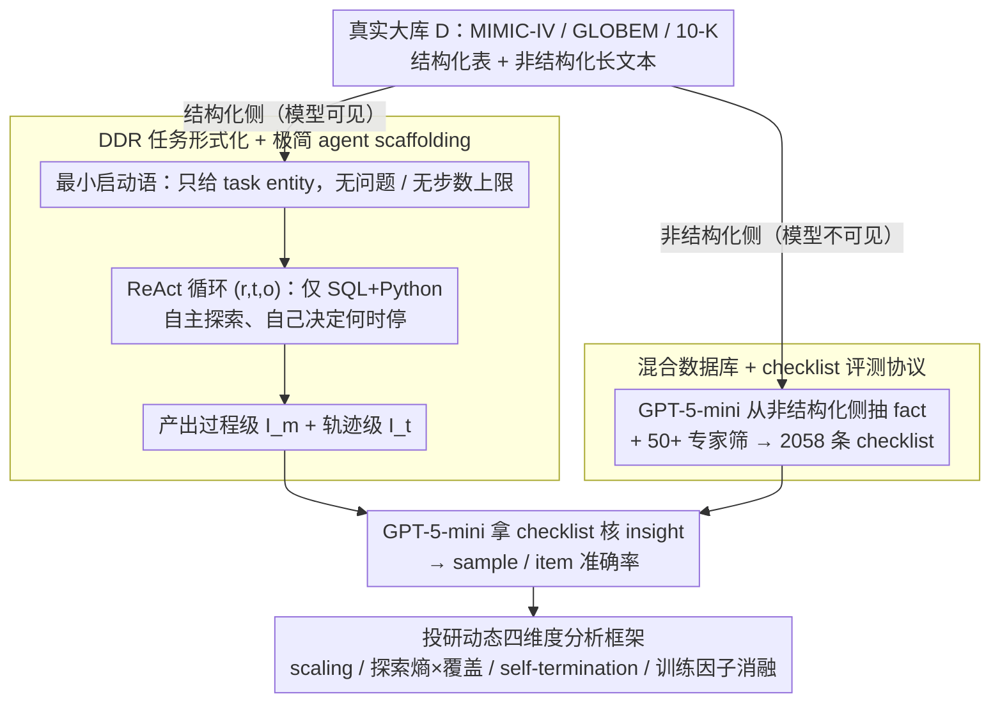

# Hunt Instead of Wait: Evaluating Deep Data Research on Large Language Models

**会议**: ICML 2026  
**arXiv**: [2602.02039](https://arxiv.org/abs/2602.02039)  
**代码**: 待确认  
**领域**: LLM Agent / Agentic Benchmark / 数据科学 Agent  
**关键词**: Deep Data Research, 投研型智能, ReAct Agent, Checklist 评估, 长程探索

## 一句话总结
本文提出 Deep Data Research（DDR）这一开放式 agentic 任务范式——只给 LLM 一个结构化数据库和最小工具集（SQL+Python），不给任何具体问题或回合上限，要求模型自主探索、提出假设并决定何时停止；并构建 DDR-Bench（MIMIC-IV / GLOBEM / 10-K，291 个实体、2058 条 checklist），用从非结构化文本抽取的可验证 fact checklist 客观评测主流 LLM 的"investigatory intelligence"，结果显示即使 Claude 4.5 Sonnet 也只能拿到 47.7% 平均准确率。

## 研究背景与动机

**领域现状**：Agentic LLM 已经能挂工具+记忆做长程任务，主流 benchmark（包括 LLM4DS 和 deep research）默认任务目标已经在 prompt 里给定，模型只需要"按指令把事干完"。

**现有痛点**：这种设置只测了 *executional intelligence*（执行预定目标的能力），完全没有测 *investigatory intelligence*（自己决定"该研究什么"的能力）。即使是号称"开放式"的 LLM4DS report generation，prompt 里仍藏着大量"investigate what"的隐含指令，且交互一般只有几十步；deep research benchmark 又主要在非结构化网页上做搜索，工具受限，评测也多靠 LLM-as-a-Judge 这类主观打分。

**核心矛盾**：要测真正的 agentic 投研能力，就必须同时满足三件互相牵制的事——任务必须开放到没有预设问题、交互必须长到逼出长程行为、评测又必须客观可复现到能被工业化使用。三者很难兼得：完全开放就难以验证，强约束就退化成 QA。

**本文目标**：把这三件事一次性解决——给出一个"不给问题、不限步数、不上脚手架"的 agent 任务定义；构造一个真实大库上的 benchmark；并设计一个既能衡量开放式洞见、又能客观打分的评测机制。

**切入角度**：作者注意到真实大型数据库通常既有结构化表（数值），也有非结构化文本（病历、年报）。把非结构化文本里能被验证的事实抽出来当 checklist，让模型只用结构化部分去探索，就能既保留开放式探索、又获得 ground-truth 锚点。

**核心 idea**：用"结构化探索 + 非结构化派生 checklist"的混合数据库设计，把开放式 agentic 任务变成可批量、客观、抗污染评测的 benchmark。

## 方法详解

### 整体框架
DDR 把"投研型智能"做成一个任何主流 LLM 都能直接跑的开放式任务，再配一套能客观打分的混合数据库 benchmark。任务形式化为 $I = DDR(LLM, D, T)$：只给数据库 $D$ 和工具集 $T$，系统 prompt 不给具体问题、只丢一句最小启动语（例如"开始分析 userid=2048 的用户"），模型通过 ReAct 风格的 $(r, t, o)$ 循环（reasoning token、tool call、observation）反复查库，没有任何回合上限、由它自己决定何时停止，最终交出两类 insight——逐回合产出的 message-wise insight $I_m$ 与轨迹末尾全局综合的 trajectory-wise insight $I_t$。评分这一侧靠的是预先从数据库非结构化文本里抽出的 fact checklist：模型探索时看不到这些 fact，交完答案后才由 GPT-5-mini 逐条核对 insight 是否支撑该 fact，从而得到 sample-averaged 与 item-averaged 两种准确率。

### 关键设计

**1. DDR 任务形式化 + 极简 agent scaffolding：把投研型智能从执行型智能里干净剥出来**

以往 agentic benchmark 默认任务目标已经写在 prompt 里，模型只需"按指令把事干完"，而且往往还套着 planner / memory / 复杂 workflow 的脚手架——结果是分数里混着"基模能力"和"prompt 工程"，分不清谁的功劳。DDR 同时卡死三条约束来把这层混淆拆掉：(a) 不给问题，prompt 只指定一个 task entity；(b) 不给回合上限，由模型自己判断该停了；(c) 只暴露 SQL 与 Python 两个原子工具，通过 MCP 调用，显式 planning / memory / workflow 模块一律禁用。在这套极简 scaffolding 下，模型被要求产出两类 insight 分别考察不同能力：$I_m$ 是模型在每个 ReAct 回合后立即基于当回合 $(r_i, t_i, o_i)$ 解释出的一段过程级 insight，$I_t = \text{Summarize}(\{(r_i, t_i, o_i)\}_{i=1}^M)$ 则是模型自终止后回溯整条轨迹综合出的全局 insight。剥到只剩 ReAct + 两个工具，分数才真正反映 LLM 已经内化的 agentic 能力，而不是外挂脚手架的功劳。

**2. 混合数据库 + checklist 评测协议：用同一份库的两侧，把"开放任务无法客观评"的死结解开**

"完全开放式探索"和"客观可批量打分"天然冲突——构造 QA 会退化成执行型任务，LLM-as-a-Judge 又太主观、验证代码执行也覆盖不了开放洞见。本文的破法是选用三个**同时含结构化表与非结构化长文本**的真实大库：MIMIC-IV（200M+ 记录的电子病历，结构化 Hosp/ICU + 非结构化临床 note）、GLOBEM（可穿戴信号 + 心理健康问卷）、10-K（XBRL 财报 + 业务描述与风险文本）。先用 GPT-5-mini 从**非结构化**侧抽出可验证 fact 形成 checklist，再过 50+ 领域专家筛选，保证 fact-domain 到 data-domain 的"surjective"映射——即每一条 fact 都能从**结构化**数据里分析出来。于是模型探索时只看结构化数据、看不到任何 checklist 与问题，评测时 GPT-5-mini 才拿 checklist 去核 insight。这等于从同一份数据库的非结构化侧免费拿到一批"领域专家会问出来的好问题"，把开放式任务退化成可自动评判的 fact recall；又因为交互期完全没有问答格式数据，天然抗训练集污染。最终覆盖 291 个 task entity、2058 条 checklist item。

**3. 投研动态四维度分析框架：单一准确率掩盖了行为差异，要把"何时探、怎么探、何时停"拆开看**

同样拿 30% 的两个模型，走的探索策略可能完全不同，所以本文在准确率之外补了四套诊断。其一是 **test-time scaling**，从三种横轴看性能增长——interaction（回合数，呈 sigmoid）、token（成本 token，曲线"前平后陡"）、cost（美元，对数轴），由此暴露 plan-then-act 这类隐式规划行为。其二是**探索模式**，用归一化探索熵 $H_{\text{norm}} = \frac{-\sum_{i=1}^n p_i \log_2 p_i}{\log_2 n}$（$p_i$ 为各数据域被访问的频率分布）配 database coverage 画散点，一张图同时读出 breadth 与 depth，强模型集中在"中等熵 + 中等覆盖"的平衡区。其三是 **self-termination**，用 $\frac{1}{N}\sum_{i=1}^N \log P(t_i \mid t_1, \dots, t_{i-1}, T_{\text{partial}})$ 衡量模型在不同轨迹长度下生成结束 token 的对数概率，Qwen3 单调上升（停止信心持续增长）、Qwen2.5 则剧烈波动。其四是**训练因子消融**，横向对比 Qwen2.5 / Qwen3 / Qwen3-Next 各代各尺寸，把"参数量 / 上下文长度 / agentic 训练"三个维度的贡献解耦开来。靠这四维度，本文才能把"为什么 agentic 训练比放大参数更重要"用可视化和指标直接坐实。

### 损失函数 / 训练策略
本文是 benchmark + 评测协议，不训练模型；评测端只调 GPT-5-mini 做 checklist 判定与 pairwise novelty 比较（用 Bradley-Terry 模型把成对偏好聚合成全局排名，以缓解 position bias）。

## 实验关键数据

### 主实验
在 DDR-Bench 三个场景上评测 8 个商用模型 + 13 个开源模型，最终用 4 类准确率（sample×item × $I_m$×$I_t$）的均值作为 Overall：

| 模型 | MIMIC ($I_m$) | GLOBEM ($I_m$) | 10-K ($I_m$) | Overall Avg |
|------|---------------|----------------|--------------|-------------|
| Claude 4.5 Sonnet | 36.07 | 40.13 | 77.61 | **47.73** |
| GPT-5.2 | 28.85 | 38.81 | 44.89 | 37.09 |
| GPT-5.1 | 28.37 | 38.31 | 37.12 | 36.27 |
| DeepSeek-V3.2 | 28.98 | 38.46 | 60.08 | 38.80 |
| GLM-4.6 | 25.03 | 41.56 | 60.31 | 37.52 |
| Kimi K2 | 33.61 | 37.14 | 51.06 | 36.42 |
| Qwen3-Next-80B-A3B | 18.01 | 35.75 | 44.76 | 30.56 |
| Qwen2.5-72B | 15.65 | 28.83 | 27.13 | 21.08 |
| Llama3.3-70B | 10.59 | 23.99 | 9.91 | 12.30 |

只有 Claude 4.5 Sonnet 一家越过 40%，且在 10-K 上一骑绝尘（77.61）；新一代 GPT/Gemini 与 top 开源模型差距明显小于在 QA 类 benchmark 上的差距，说明 DDR 这个 setting 把"自主投研"这一维拉了出来。

### 消融实验

| 配置 | 关键指标 | 说明 |
|------|---------|------|
| Qwen3-Next default reasoning | 10-K 45.58 / GLOBEM 35.40 / MIMIC 16.80 | 平均每回合仅 1.20 个 reasoning token（10-K） |
| Qwen3-Next longer reasoning | 10-K 36.40 ↓ / GLOBEM 36.78 ↑ / MIMIC 16.67 ↓ | reasoning token 增到 357，但交互回合从 27.93 掉到 11.89，整体性能波动而非单调上升 |
| Qwen3-Next 无 memory | 10-K Traj 31.10 / MIMIC Traj 20.80 | 默认极简 ReAct |
| Qwen3-Next 加 long-short memory | 10-K Traj 25.21 ↓ / MIMIC Traj 14.34 ↓ | 加 memory 反而让模型更激进、更早停 |
| Proactive (DDR) | Avg 32.59 / 28.26 | 自主提问 |
| Reactive (把 checklist 转成 query) | Avg 43.21 ↑ | 给定明确目标后大幅提升，但 GLOBEM 反而下降，且远未饱和 |

### 关键发现
- 失败模式分析（人工标注 206 条错误）显示 **58% 的错误来自"探索不足"**——要么覆盖广度不够（key field 没看），要么深度不够（看了表面没追问）；其余 40% 在强模型上以"过度推理/无依据假设"为主，在弱模型上以"上下文丢失/重复 debug/总结遗漏"为主。
- 参数量翻 10 倍只换来 < 3% 准确率提升，长上下文版本（Qwen2.5-7B-1M / 14B-1M）也没系统改善；Qwen3-Next-4B 反而能超过 Qwen2.5-72B。**Agentic 能力主要来自训练范式（pre-/post-train 时是否系统强调 reasoning + agency），而不是 scale**。
- Token scaling 曲线不是 sigmoid 而是"前平后陡"——后期少量、精准、参数复杂的工具调用（往往只换来 binary 反馈，因为验证逻辑被编码进了 query 本身）贡献了大部分性能增量，这正是从 breadth-first 切换到 depth-first 的标志。
- Novelty 排名（用 GPT-5-mini 做 pairwise + Bradley-Terry 聚合）与 checklist 准确率排名高度一致，说明 checklist 评测虽然只覆盖部分有效 insight，但抓住了"主导信号"，不会系统性低估那些专注于 checklist 之外内容的模型。
- 幻觉率普遍低（Claude 4.08% / Gemini 系列 < 1%），且幻觉率与 checklist 准确率无统计相关——排除了"靠记忆胡编"刷分的可能。

## 亮点与洞察
- **"non-structured → checklist, structured → exploration"的混合库设计极其聪明**：用同一份真实数据库的两侧自然解耦了"模型能看的"和"评测要核的"，免费获得专家级 ground truth，几乎不可能用其他方式以同等成本达到。
- **明确把 investigatory 与 executional 两种 agentic 智能切开来量化**：reactive 模式给出的 43.21% vs proactive 32.59% 的 ~10 个点差距，第一次给了一个数字化的、"自己决定该问什么有多难"的度量。
- **Exploration entropy × coverage 散点图**是一个非常可复用的 agentic 行为可视化工具——任何 ReAct agent 都可以套用这套两轴，立刻看出它是"探得太散""探得太窄"还是处在平衡区，比单一准确率有信息量得多。
- **Self-termination 的对数概率诊断**也是个轻量但可迁移的指标，可以直接用于评估任何 agent base model 在"什么时候该停"上的内在信心稳定性，特别适合做 RL 训练前的诊断。
- "agentic ≠ scale"这条经验性结论虽然不是首次提出，但本文在控制 backbone 家族（Qwen 全谱）+ 控制脚手架（极简 ReAct）的条件下给出了相对干净的证据，对后续做 agentic 训练的人是个明确信号。

## 局限与展望
- 评测端依赖 GPT-5-mini 做 fact-checking，事实上把"评测可靠性"绑在了一个商业 LLM 的判断力上；即使做了人工 spot-check，在大规模刷榜场景下仍可能成为隐式 ceiling。
- 三个场景的覆盖广但仍偏窄——都是"读现有数据库写洞见"，没有覆盖需要建模、做实验、写代码、与外部环境互动的真实数据科学闭环（如生成 ML pipeline 并训练）。
- Tool set 只给 SQL + Python，对评测干净度有利，但也意味着"工具选择能力"这一维 agentic intelligence 完全没被测——真实数据科学家工具箱要大得多。
- Checklist 是从非结构化文本里"已经写出来的事实"派生的，本质上偏向"模型能不能复现专家已经发现过的洞见"，对"原创性洞见"的覆盖弱（虽然作者用 novelty pairwise 部分弥补）。
- 没有给出 RLHF / agentic SFT 等具体训练方案——本文只指出"训练范式重要"，但 *怎么训* 留给了后续工作；这其实是这个 benchmark 真正会被怎么用的关键。
- Memory 实验只比较了一种 long-short note 设计就得出"memory 不一定好"的结论，结论可能过强；不同 memory 架构（向量检索、结构化笔记本、subagent 等）应该被纳入更系统的对照。

## 相关工作与启发
- **vs LLM4DS Report Generation（Zhang et al., 2025c 等）**：他们在 prompt 里仍给出"investigate what"的细化指令、且交互限制在几十步内、评分依赖 LLM-as-a-Judge 主观 rubric；本文把这三个约束全部松掉（无问题、无步数限制、客观 checklist），所以测的是更纯粹的 investigatory intelligence。
- **vs Deep Research Benchmarks（Wong et al., 2025; Wan et al., 2025）**：那些 benchmark 在非结构化网页上跑、工具基本只有 search/browse、依赖 faithfulness to reference website 这种代理指标；本文换到了结构化数据库 + SQL/Python 工具，评测从代理指标升级为可验证 fact。
- **vs Table QA（Lu et al., 2025a）**：Table QA 仍是预设问题的执行型任务；DDR 把问题去掉，把任务从"answer the question"换成"discover the question"。
- **vs Agentic Scaffolding 路线（复杂 planner + memory + workflow）**：本文用极简 ReAct + 实验证据（memory 不必然提升、reasoning budget 存在 trade-off）支持"capability should be internalized into the model"这条路线，对走相反路线（堆 scaffold）的工作是一种反向压力。
- 对未来 agentic RL/SFT 工作的启发：DDR-Bench 提供了一个"无问答数据 + 长程 + 客观可验证"的训练-评测闭环候选，比当前主流的多轮 tool-use SFT 数据（多为短程、有明确目标）更接近真实投研场景。

## 评分
- 新颖性: ⭐⭐⭐⭐⭐ 第一次把 investigatory intelligence 从 executional intelligence 干净切出来，且用"混合库 checklist"巧妙化解了开放任务无法客观评的死结。
- 实验充分度: ⭐⭐⭐⭐⭐ 21 个模型 × 3 个真实大库 × 4 维 scaling × 探索熵 × self-termination × memory/reasoning/reactive 消融 × 206 条人工失败模式标注 × 幻觉率，覆盖面在 benchmark 论文里属于顶尖。
- 写作质量: ⭐⭐⭐⭐ 概念区分（investigatory vs executional）讲得非常清楚，scaling 三视角与 entropy/coverage 可视化讲解到位；某些 module analysis 章节信息密度偏高、表格读起来略累。
- 价值: ⭐⭐⭐⭐⭐ 作为 agentic LLM 时代评测真实投研能力的 benchmark，几乎肯定会成为 2026 年起 agentic 训练工作的标准对照之一；评测协议本身也是可复用的方法论贡献。

<!-- RELATED:START -->

## 相关论文

- [\[ACL 2026\] ImplicitMemBench: Measuring Unconscious Behavioral Adaptation in Large Language Models](../../ACL2026/llm_agent/implicitmembench_measuring_unconscious_behavioral_adaptation_in_large_language_m.md)
- [\[ACL 2025\] ToolHop: A Query-Driven Benchmark for Evaluating Large Language Models in Multi-Hop Tool Use](../../ACL2025/llm_agent/toolhop_multi_hop_tool_use.md)
- [\[ACL 2026\] Agent-GWO: Collaborative Agents for Dynamic Prompt Optimization in Large Language Models](../../ACL2026/llm_agent/agent-gwo_collaborative_agents_for_dynamic_prompt_optimization_in_large_language.md)
- [\[ACL 2026\] AnchorMem: Anchored Facts with Associative Contexts for Building Memory in Large Language Models](../../ACL2026/llm_agent/anchormem_anchored_facts_with_associative_contexts_for_building_memory_in_large_.md)
- [\[ICLR 2026\] ToolWeaver: Weaving Collaborative Semantics for Scalable Tool Use in Large Language Models](../../ICLR2026/llm_agent/toolweaver_weaving_collaborative_semantics_for_scalable_tool_use_in_large_langua.md)

<!-- RELATED:END -->
