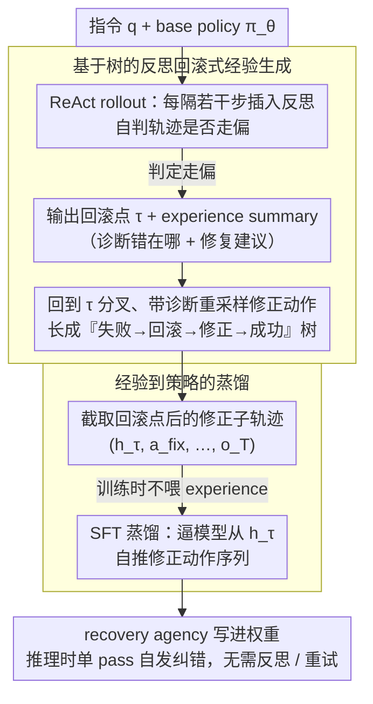

# Internalizing Agency from Reflective Experience

**会议**: ICML 2026  
**arXiv**: [2603.16843](https://arxiv.org/abs/2603.16843)  
**代码**: 未公开  
**领域**: LLM Agent / 长程交互训练  
**关键词**: agentic LLM, 反思经验, 回溯探索, 经验蒸馏, Pass@k

## 一句话总结
本文提出 LEAFE 框架，让 LLM agent 通过反思失败轨迹生成「失败→回滚→修正→成功」的经验数据，再用 SFT 蒸馏出 feedback-grounded 的恢复能力，在 CodeContests、WebShop、ALFWorld 等长程任务上把 Pass@128 拉高最多 14%，远胜 GRPO 等 outcome-driven RL。

## 研究背景与动机

**领域现状**：LLM 从被动回答转向自主 agent，常用的 post-training 方法是 RL with verifiable rewards（RLVR / GRPO）——多轮采样、终局给一个 scalar 奖励、用策略梯度推高成功轨迹的概率。

**现有痛点**：在长程交互场景里，终局 scalar 奖励信息密度极低。多数 rollout 拿不到奖励，更新被少数已经能成功的样本主导，模型学到的只是把「已经会做的」做得更稳；环境其实在每一步都给了丰富反馈（错误信息、状态转移、编译错误），但全被压缩成 0/1 信号扔掉。结果就是 distribution sharpening：Pass@1 涨、Pass@1024 不动甚至掉。

**核心矛盾**：分布锐化 vs agency 内化是两件事。要真的扩大模型能解的问题集合，模型得学会「我现在轨迹失败了，错在哪一步，怎么修」，而 outcome-driven 训练只教它「这条轨迹整体好」。

**本文目标**：把「识别关键决策点 → 在该点回滚 → 用环境反馈做有针对性的修正」这一恢复程序内化进模型权重，而不是在推理时靠 best-of-$k$ 重试或 Tree-of-Thoughts 外挂搜索。

**切入角度**：与其只奖励整条成功轨迹，不如显式制造失败案例、找出错误位置、监督修正动作。环境反馈不再被压成 scalar，而被结构化成自然语言的「诊断 + 修复指令」（experience summary）作为训练监督。

**核心 idea**：用反思生成「失败→回滚→修正→成功」的实验性轨迹，再 SFT 蒸馏 post-rollback 的修正动作，从而把 recovery agency 写进权重。

## 方法详解

### 整体框架
LEAFE 想解决的是「outcome-driven RL 只会把已经会做的做得更稳、却扩不大模型能解的问题集合」这个困境，办法是把恢复能力（哪一步错了、回退到哪、怎么改）直接写进权重。整条流水线分两阶段：先在 base policy $\pi_\theta$ 上 rollout 轨迹，每隔若干步让模型自己反思，一旦判断走偏就回退到关键决策点 $\tau$、带着「失败诊断 + 修复建议」重新分叉出修正动作，从而把一条失败 trace 长成一棵「失败→回滚→修正→成功」的树；再从所有最终成功的修正子轨迹里截出「回滚点之后该做什么」做 SFT 蒸馏，让模型在推理时即使没人提示反思，也能在类似失败信号下自发切换到修正模式。

### 关键设计

**1. 基于树的反思回滚式经验生成：把一条失败 trace 长成多条「修正后成功」的训练数据**

scalar reward 的根本毛病是看不到「哪一步出错」，可 LLM 本身就有读环境反馈、定位错误的能力——LEAFE 要做的就是把这种 in-context 能力外化成显式的训练信号。在 ReAct 范式下，时间步 $t$ 的状态是 $h_t=(o_0,a_0,\ldots,o_t)$，动作 $a_t\sim\pi_\theta(\cdot\mid h_t,q)$。每隔若干步插入一次反思 prompt，模型自己判断要不要回滚；若要回滚，就输出两样东西：回滚点 $\tau$，以及一段自然语言的 experience summary $e$（讲清「错在哪 + 怎么改」）。随后用 $\pi_\theta(\cdot\mid h_\tau,q,e)$ 在 $\tau$ 处采样新动作开出 branch，一条原始 rollout 因此能衍生多个 $(\text{failure}\to\text{rollback}\to\text{fix}\to\text{success})$ 三元组。对比 outcome-driven RL 就能看出差别：GRPO 把同一 prompt 的 $G$ 条 trace 算成 group-relative advantage $\hat{A}_i=(r_i-\bar{r})/\sigma_r$ 再做 policy gradient，本质是给整条 trace 加权，于是只会把 base 模型 long-tail 里少数已经会的高频模式推得更尖（distribution sharpening，Pass@1 涨而大 $k$ 的 Pass@$k$ 不动）；LEAFE 给的则是「回滚后应该输出什么」这种逐 token 的决策级监督，把每一步丰富的环境反馈重新利用起来、而不是压成 0/1 扔掉，从而把行为分布往没覆盖到的新区域推——这正是后面实验里两者在大 $k$ 上彻底分道扬镳的根源。

**2. 经验到策略的蒸馏：训练时喂 experience、推理时不喂，逼模型从环境信号自己推出修正逻辑**

第一阶段造出的修正动作还停在数据里，要让部署时无需任何 reflection prompt 也能自然纠错，就得把它蒸馏进权重。做法是对每条成功的修正轨迹，从回滚点 $\tau$ 起截取那段「带 experience 提示生成的修正后子轨迹」，构造 SFT 样本 $(h_\tau,\,a^{\rm fix}_\tau,\ldots,o_T)$。关键的一步是：**训练时并不把 experience summary 喂进去，只让模型在 $h_\tau$ 之后直接产出修正动作序列**。这等于强迫模型把「该怎么改」这件事条件化在没有外部诊断的 $h_\tau$ 上自行推断，于是测试时一遇到类似失败模式，它就能内生地切到修正模式，而不必每次推理都跑昂贵的反思 + 重试。这也正是「agency 被 internalize」的具体含义——恢复程序进了权重，而非挂在推理时的外部搜索上。

### 一个例子：CodeContests 上的一次回滚
拿一道程序合成题：模型先写出一版解法并提交，执行器返回某个测试用例上的 runtime error。反思 prompt 触发后，模型读到这条报错，判断轨迹已经走偏，于是回滚到「选定算法策略」那一步（$\tau$），并写下 experience summary——比如「越界源于没处理空输入边界，应在主循环前加判空」。随后从 $\tau$ 分叉，带着这条诊断重采样出修正版代码，这次通过全部测试。这条原始失败 trace 于是贡献了一个完整的 failure→rollback→fix→success 三元组；蒸馏阶段只取「回滚点之后那段修正代码」当监督目标，且不把那句 experience summary 喂回去，让模型学会单看报错就自己补上判空。

### 损失函数 / 训练策略
Stage 1 完全用 base policy 自采样 + 反思生成数据，不做任何梯度更新；Stage 2 是标准 SFT 交叉熵 $\mathcal{L}=-\sum_t \log \pi_\theta(a^{\rm fix}_t\mid h_t)$，且损失只计修正后的 action token，不计环境反馈 token。反思频率、回滚预算等超参在 appendix 给出。

## 实验关键数据

### 主实验
5 个 agentic benchmark：CodeContests（程序合成 + 执行反馈）、WebShop（购物 agent）、ALFWorld（家务 agent）、ScienceWorld（科学探索）、Sokoban（推箱子）。所有方法在固定交互预算下评测。

| 任务 | 指标 | Base | GRPO | Early Exp. | LEAFE | 相对最强 baseline |
|--------|------|------|----------|---|---|---|
| CodeContests | Pass@1 | base | 略涨 | 略涨 | 显著涨 | 提升 |
| 长程任务平均 | Pass@128 | base | ≈base | + | +14% | +14% |
| 通用 | Pass@1 | base | + | + | ++ | 一致领先 |

### 消融实验

| 配置 | Pass@1 | Pass@128 | 说明 |
|------|---------|---------|------|
| Base | 低 | 低 | 不做 post-training |
| GRPO (outcome RL) | 中-高 | ≈Base | 典型 sharpening |
| Early Experience (无回滚) | 中 | 中 | 只蒸馏成功轨迹，无 recovery 信号 |
| LEAFE w/o rollback | 中 | 中 | 去掉树式 branch，退化为线性 SFT |
| LEAFE w/o experience summary | 中-高 | 中-高 | 仅有「修正动作」没诊断说明 |
| **完整 LEAFE** | **高** | **高 (+14%)** | 完整框架 |

### 关键发现
- 大 $k$ 才能暴露真正差异：Pass@1 上 GRPO 也能涨，但 Pass@128 上 GRPO 几乎不动，LEAFE 一骑绝尘——说明 RLVR 真的只是把已有支持集里的高频模式锐化，没有扩展覆盖。
- 经验摘要（experience summary）和回滚是协同的：单独去掉任一项都会让 Pass@128 大幅下降，说明「诊断 + 修正动作」共同构成了 decision-level 监督。
- LEAFE 训出的模型即使在推理时不被提示「请反思」，也会在内部自发触发修正——验证了 agency 真被 internalize 到了权重里。
- 数据效率高于 Early Experience：在相同 SFT 样本量下，LEAFE 的回滚式构造把「失败 trace」也利用起来，每条 failure 平均产出多条成功子轨迹。

## 亮点与洞察
- 「distribution sharpening vs agency internalization」是个非常清晰的概念切分，能帮社区跳出「Pass@1 涨就好」的评估陷阱。
- 把环境反馈结构化成「自然语言诊断 + 修正建议」是个可复用的 pattern：在 tool use、code agent、web agent 等任何「环境会喊错误」的场景都适用。
- 蒸馏时**不喂** experience 但训练时**喂**了——这种「训练辅助、推理自洽」的设计让模型必须从环境信号自身推导出修正逻辑，比单纯把 experience 当 prompt 喂泛化更好。

## 局限与展望
- 反思触发频率、回滚预算都是超参，对不同任务可能要重调；自动决定何时反思仍是开放问题。
- 反思模块依赖 base policy 自己的 self-assessment 能力，若 base 太弱（如 7B 以下小模型）可能根本认不出失败。
- 实验主要在「环境反馈丰富 + 有 verifier」的场景；在反馈稀疏（如开放对话）或反馈延迟的场景需进一步验证。
- 没有和 best-of-$N$ + 自反思（如 Reflexion）做直接计算开销对比，部署阶段两者真实成本差异需更系统化测算。

## 相关工作与启发
- **vs GRPO / DeepSeek-R1 风格 RLVR**：本文同样在 LLM 上做 post-training，但用结构化反思替代 scalar reward；GRPO 大 $k$ 不涨、本文涨。
- **vs Early Experience**：Early Experience 也用 reflective trajectory 但不做回滚式分叉，等于只蒸馏成功 trace 没利用 failure 信号；本文进一步用失败 trace 当数据源。
- **vs Reflexion / Tree-of-Thoughts**：那些方法把反思 / 树搜索留在推理时，每次都要多轮调用；本文把这种 agency 内化进权重，推理时单 pass 即可。

## 评分
- 新颖性: ⭐⭐⭐⭐ 「反思生成数据 + 蒸馏到权重」组合不算原创，但 explicit rollback + decision-level supervision 的框架化和 Pass@k 视角是清晰贡献
- 实验充分度: ⭐⭐⭐⭐ 5 个 agentic benchmark 覆盖 coding/web/家务/科学/推箱子，但缺与 Reflexion 等 inference-time 方法直接成本对比
- 写作质量: ⭐⭐⭐⭐ 「sharpening vs internalization」叙事清晰，Pass@k 曲线极有说服力
- 价值: ⭐⭐⭐⭐ 给 agentic LLM post-training 提供了和 RLVR 互补的新范式，部署成本低，方法可复用到 tool / code agent 多个场景

<!-- RELATED:START -->

## 相关论文

- [\[ICML 2026\] EvolveR: Self-Evolving LLM Agents through an Experience-Driven Lifecycle](evolver_self-evolving_llm_agents_through_an_experience-driven_lifecycle.md)
- [\[CVPR 2026\] Learning to Select Visual Tools from Experience](../../CVPR2026/llm_agent/learning_to_select_visual_tools_from_experience.md)
- [\[ACL 2025\] R2D2: Remembering, Replaying and Dynamic Decision Making with a Reflective Agentic Memory](../../ACL2025/llm_agent/r2d2_reflective_agentic_memory.md)
- [\[CVPR 2026\] Experience Transfer for Multimodal LLM Agents in Minecraft Game](../../CVPR2026/llm_agent/experience_transfer_for_multimodal_llm_agents_in_minecraft_game.md)
- [\[ACL 2026\] ExpSeek: Self-Triggered Experience Seeking for Web Agents](../../ACL2026/llm_agent/expseek_self-triggered_experience_seeking_for_web_agents.md)

<!-- RELATED:END -->
