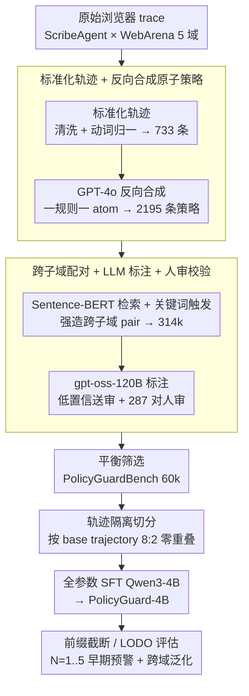

# Learning Efficient Guardrails for Compliance

**会议**: ICML 2026  
**arXiv**: [2510.03485](https://arxiv.org/abs/2510.03485)  
**代码**: 项目主页 learning-efficient-guardrails-for-compliance（论文给出 project page 链接）  
**领域**: LLM 安全 / Agent 合规 / Guardrail  
**关键词**: 策略合规、轨迹审计、Guardrail 模型、Web Agent、Prefix 检测

## 一句话总结
本文构造了一个 60k 规模的 PolicyGuardBench（5 个域、733 条标准化轨迹 × 2195 条原子策略 → 6 万 trajectory-policy 对，含跨子域和前缀截断设置），并基于 Qwen3-4B-Instruct 全参数 SFT 出一个轻量 guardrail 模型 PolicyGuard-4B，在 22.5 ms/样本的延迟下取得 90.14% 准确率 / 87.59% F1，匹配甚至超过 70B 级开源模型和 Claude-Sonnet-4，并展现了强跨域泛化（LODO OOD F1≈0.91）。

## 研究背景与动机

**领域现状**：当前自治 Web Agent（ScribeAgent、WebArena 上的 planning/reasoning 工作）能完成长 horizon 任务，但部署时通常要受外部规则约束——平台政策、企业制度、伦理与监管要求。现有 guardrail 研究主要属于"安全导向"路线：LlamaGuard 系列、ShieldGemma 检测 prompt 有毒/越狱/危险代码，AGrail/ShieldAgent/LlamaFirewall 偏向针对 OS 级攻击或形式化验证。

**现有痛点**：作者实测发现 LlamaGuard-3/4、ShieldGemma 等安全 guardrail 在策略合规任务上几乎不可用——LlamaGuard 系列把几乎所有输入预测成同一类，准确率徘徊在 42–58%，F1 退化到 0 附近或者只剩一个常数类。另一方面，靠 70B+ 的通用 LLM 当 guardrail 虽然准确率能到 88–90%，但 latency 200–3600 ms/样本，难以做在线 intervention。再有，现有评测如 ST-WebAgentBench、SafeArena、WebSuite 虽然观察到了 task-completion 与 completion-under-policy 的 gap，但缺一个大规模、系统化标注、覆盖跨子域和早期检测的数据集。

**核心矛盾**：作者主张"安全（safety）"与"合规（policy compliance）"是正交的两个维度——前者关心内容毒性/越狱/不可逆灾难，后者关心轨迹是否违反具体业务规则（如"购买总额不超过 $200"、"删除前必须二次确认"）。把它们当一回事会导致两个失败：用安全 guardrail 做合规检测严重过拟合到 toxicity 这类粗粒度信号；用 frontier LLM 做合规检测则在线性效率不可接受。同时，违规通常具有 cumulative 性（"已经加过一块蛋糕，再加第二块就违规"），所以好的 guardrail 还得能在 trajectory 没跑完时就预判，避免不可逆操作的执行。

**本文目标**：(i) 把 policy-trajectory compliance 立成一个独立任务并构造一个公认的大规模 benchmark；(ii) 训出一个既准又快的小尺寸 guardrail，证明 4B 量级足够；(iii) 引入"前缀检测"设置，量化模型能否在轨迹早期就发现违规苗头。

**切入角度**：作者观察到，绝大多数 web agent 的策略违规都能在原子化的规则下被 checkable，只要先把异构浏览器事件标准化成统一动作词表（Click/Input/Scroll/...），再用 GPT-4o 从轨迹反向合成"一条规则一个 atom"的策略，然后把同一 domain 内不同 subdomain 的策略与轨迹组合配对（强行造出跨子域 negative/positive 对），就能在不依赖 RLHF 的前提下，把合规检测打成"二分类指令跟随"任务，从而让小模型也能跑。

**核心 idea**：用"标准化轨迹 + 反向合成原子策略 + 跨子域配对 + 前缀截断"四步搭出 60k 高质量 binary 数据，再做单任务 SFT 把 Qwen3-4B 教成专用 guardrail，从而在 4B 尺寸下打过 70B+ 通用 LLM 和现有所有安全 guardrail。

## 方法详解

### 整体框架
这套方案要回答的问题是：能不能不靠人写规则、也不靠 70B 大模型，就训出一个又准又快、还能跨域泛化的合规 guardrail。作者把它拆成数据和模型两侧。数据侧从 ScribeAgent 在 WebArena 五个 domain（Reddit / Map / GitLab / Shopping-Admin / Shopping）上跑出的原始浏览器 trace 出发，依次走标准化轨迹、反向合成策略、跨子域配对、违规标注四步，把 733 条 base trajectory 和 2195 条策略撞成 314,556 条 raw pair，再筛成 59,997 条 label 平衡（42.4% 违规 / 57.6% 合规、41.6% 跨子域）的 PolicyGuardBench。模型侧把 `(policy, 标准化轨迹动作序列, domain metadata)` 拼成一条指令、输出 `{violation, no_violation}` 二元 label，按 base trajectory 做 8:2 切分（保证 train/test 轨迹零重叠）后全参数微调 Qwen3-4B-Instruct，得到 PolicyGuard-4B。下图把"数据侧造 60k benchmark → 模型侧 SFT → 三套评估"这条主线串起来，三个关键设计分别对应图中前两个分组与底部的切分/评估环节。

### 关键设计

**1. 标准化轨迹 + 反向合成原子策略：把异构的规则和轨迹都收敛成统一接口**

合规检测最棘手的地方在于规则和轨迹两边都极其异构——浏览器事件五花八门、平台规则措辞各异，小模型根本对不齐。作者的做法是把两边都"原子化、模式化"。轨迹侧先做噪声清洗（去空事件、去重复 rendering）和动词归一（统一到 Click/Input/Scroll/Select/Navigate/Submit），把对象规范成 `link 'My Account'`、`button 'Search'` 这种命名，再序列化成 "Step 1: Click link 'My Account'; Step 2: Scroll page; ..." 的句子化文本。规则侧则反着来——不让人去写规则，而是把 trajectory + outcome 喂给 GPT-4o，要求它为每条轨迹写出 2-3 条**每条只含一个约束**的 atomic 规则（如 "Do not click 'Delete' without a prior confirmation step"），再人工过滤、去重、剪掉模糊不可验证的，最终留下 2195 条，每条都挂着 `source_subdomain` 和最多 2 个 `target_subdomain` 的结构化 schema。这一步之所以关键，是因为它把 LLM 标注器和 guardrail 模型面对的输入都压成了同一套接口，"一规则一 atom"天然可机审；而给策略挂上跨子域 schema，则是后面能造出跨子域评测的前提。

**2. 跨子域配对 + LLM 标注 + 人审校验：用两阶段标注把 60k pair 标到 ~90% 一致率**

光有轨迹和规则还不够，要让 guardrail 真正学到 transferable 的合规模式而不是死记某条轨迹，就得在数据里灌进跨子域的泛化压力。作者先用 Sentence-BERT 做 embedding 检索为每条轨迹召回候选策略，再叠加关键词触发器（出现 `delete`/`confirm` 就触发对应规则），用启发式 + LLM scoring 过滤；然后刻意把策略和它原生 subdomain（source）以及最多 2 个不同 subdomain（target）的轨迹组合，强行制造跨子域 pair，最终 41.6% 都是跨子域；负例则在同 domain 内随机配未违规策略并校验不会"误中"违规。60k pair 不可能全靠人标，作者于是用 gpt-oss-120B 模拟先验人工标注 pattern 给出 label + confidence，把低 confidence 的 flag 出来交人审；最后再抽 287 对做独立人审复标，与原 label 一致率 89.8%，分歧主要落在模糊策略和需要领域常识的轨迹上。这种"LLM 模仿人 + 低置信送审"的两阶段法，是在标注预算有限下逼近全人审质量的实用折衷。

**3. 轨迹隔离切分 + 前缀截断评估：既堵住记忆泄漏，又量化"早期预警"能力**

如果按 pair 随机切 train/test，同一条轨迹的不同 pair 会同时落进两边，模型只要记住轨迹就能作弊。作者因此把 8:2 切分锚在 733 条 base trajectory 上而非 pair 上，强制 0% 轨迹重叠。在此之上叠两层更狠的考法：一是前缀检测，把违规样本截到前 $N$ 步（$N=1,\dots,5$，覆盖到平均长度 9.3 的一半左右），用截断后的 prefix 重新和策略匹配、re-label 后喂给同一模型，逼它在轨迹没跑完时就预判；二是 leave-one-domain-out（LODO），每次抽掉一个 domain 当 OOD，看模型在完全没见过的 domain 上掉多少。前者对应的是合规违规的不可逆性——删库、超额付款一旦执行就无法回滚，必须在第 $N$ 步就拦住；后者和轨迹级隔离合在一起，才能把"记 trajectory 模式"和"学 compliance 模式"真正区分开。

### 损失函数 / 训练策略
PolicyGuard-4B 走的是最朴素的 supervised instruction tuning：在 Qwen3-4B-Instruct 上做 full-parameter SFT，输入是 `(policy, 动作序列, domain metadata)` 拼成的统一 prompt 模板，输出严格被 instruction-formatted 成 `violation` 或 `no_violation`，损失即标准的 next-token cross-entropy；具体 lr/batch/epoch 在 Appendix A，全程在 H100 80GB 上、temperature=0 解码以保证可复现。作者刻意没引入 reward model 或多任务 head，因为目标就是验证"小模型 + 干净 binary SFT"足够当 guardrail。

## 实验关键数据

### 主实验：full-trajectory 合规检测（PolicyGuardBench 12k 测试集）

| 模型 | 类型 | Size | Accuracy | F1 | Latency (ms/ex) |
|------|------|------|----------|-----|------------------|
| Claude-Sonnet-4 | Closed frontier | – | 0.8983 | 0.8678 | 1238 |
| Gemini-1.5-Pro | Closed frontier | – | 0.8713 | 0.8502 | 596 |
| DeepSeek-V3.1 (non-think) | Open frontier | 685B | 0.8613 | 0.8407 | 3270 |
| Llama-3.3-70B-Instruct | IT | 70B | 0.9054 | 0.8883 | 305 |
| Qwen2.5-72B-Instruct | IT | 72B | 0.8825 | 0.8607 | 205 |
| Gemma-3-12B-IT | IT | 12B | 0.8964 | 0.8773 | 51.3 |
| Qwen3-4B-Instruct (base) | IT | 4B | 0.6897 | 0.5348 | 25.6 |
| LlamaGuard-3 | Safety guardrail | 8B | 0.4246 | 0.5952 | 164.8 |
| LlamaGuard-4 | Safety guardrail | 12B | 0.4239 | 0.5954 | 175.3 |
| ShieldGemma-27B | Safety guardrail | 27B | 0.5555 | 0.1834 | 45.0 |
| **PolicyGuard-4B (Ours)** | **FT** | **4B** | **0.9014** | **0.8759** | **22.5** |

### 前缀检测（不同前缀长度 $N$ 下的 Accuracy；越靠前越要"预判"）

| 模型 | $N{=}1$ | $N{=}2$ | $N{=}3$ | $N{=}4$ | $N{=}5$ | 平均 |
|------|------|------|------|------|------|------|
| Llama-3.2-3B-Instruct | 0.9086 | 0.8199 | 0.7348 | 0.6377 | 0.5693 | 0.7341 |
| Qwen3-4B-Instruct (base) | 0.8832 | 0.8231 | 0.8038 | 0.7688 | 0.7330 | 0.8024 |
| Llama-3.3-70B-Instruct | 0.9298 | 0.8441 | 0.8368 | 0.8305 | 0.8191 | 0.8521 |
| Llama-4-Scout-17B | 0.9389 | 0.8854 | 0.8583 | 0.8355 | 0.8237 | 0.8684 |
| Qwen3-235B-A22B | 0.8976 | 0.8752 | 0.8644 | 0.8569 | 0.8498 | 0.8688 |
| Gemini-1.5-Pro | 0.8990 | 0.8779 | 0.8667 | 0.8630 | 0.8543 | 0.8722 |
| **PolicyGuard-4B** | **0.9101** | **0.8648** | **0.8441** | **0.8276** | **0.8190** | **0.8531** |

### 跨域泛化 LODO

| Domain | ID Acc | ID F1 | OOD Acc | OOD F1 |
|--------|--------|-------|---------|--------|
| GitLab | 0.9314 | 0.9272 | 0.9116 | 0.9116 |
| Map | 0.9361 | 0.9343 | 0.9020 | 0.9078 |
| Reddit | 0.9326 | 0.9338 | 0.9024 | 0.9055 |
| Shopping | 0.9362 | 0.9370 | 0.9174 | 0.9137 |
| Shopping-Admin | 0.9276 | 0.9288 | 0.9079 | 0.9044 |
| **Average** | **0.9328** | **0.9322** | **0.9083** | **0.9086** |

### 关键发现
- 安全 guardrail 整体 *崩盘*：LlamaGuard 系列 F1 退化到只剩一个常数预测（要么全 safe 要么全 unsafe），ShieldGemma-27B F1=0.18，说明 toxicity 监督完全不迁移到 compliance，作者的"安全与合规正交"主张得到实证支持。
- 同一 Qwen3-4B-Instruct，base 模型只有 68.97% / 0.5348，SFT 后变 90.14% / 0.8759，提升幅度 ≈ +21pp acc / +34pp F1，证明任务专门化 SFT 比扩 scale 性价比高得多。
- 前缀检测里大多数模型在 $N{=}1$ 就有 0.88–0.94 准确率然后随 $N$ 增长反而下降——作者解读是早期违规通常是显式动作（直接 click 'alcohol'），中后段更多是 cumulative violation（金额超 $200），更难判，PolicyGuard-4B 在该曲线上和 Gemini-1.5-Pro / 235B Qwen 同档。
- LODO OOD 平均 F1=0.9086，相对 ID 只掉 ~2.4pp，证明确实学到了跨 domain 的 transferable compliance pattern，而非记 trajectory。
- 论文 appendix 的 error 分析显示失败模式以 false negative 为主，多发生在 cumulative constraint 和 conditional UI rule 上，是后续工作的明确切入口。

## 亮点与洞察
- **"safety ≠ compliance" 的正交性论断 + 实证拆解**：作者不只声称两者不同，还用 LlamaGuard/ShieldGemma 在 PolicyGuardBench 上几近随机的表现作为反证，把这个 conceptual gap 钉成了一个可量化的实验事实，给整条 agent 安全研究路线提供了一个清晰的新维度。
- **"反向合成原子策略"是绕开人写规则的关键 trick**：传统 compliance 数据要么靠人写规则成本爆炸，要么用 ToS 文本噪声极大；本文把方向反过来——先有轨迹再让 GPT-4o 写"这条轨迹应当遵守的原子规则"，天然保证规则与轨迹可对齐、原子可执行，这种"trajectory → policy"反向工程思路完全可以迁移到 API 调用合规、SQL 操作合规等领域。
- **4B FT 打平 70B+ frontier 的范式样本**：22.5 ms latency + 90% acc 的组合在实际 deployment 里几乎没有竞品（最近的 Gemma-3-12B 也要 51 ms），证明在合规这种 narrow 任务上 SFT 一个小模型 + 高质量 binary 数据，比堆 scale 更划算，给后续 agent 在线 guardrail 设计提供了一个可直接复用的尺寸/延迟 anchor。

## 局限与展望
- 数据全部来自 WebArena × ScribeAgent，UI 风格、动作粒度、领域分布都偏向 WebArena 的 5 个网站，迁移到企业内部 SaaS、移动 app、API 调用 trace 时还需要重新做 standardization。
- 策略合成 + 标注几乎全依赖 GPT-4o / gpt-oss-120B，存在 LLM 偏置（如倾向写"显式禁止类"规则、忽略 timing/race condition 类约束），即便 287-pair 人审一致率 89.8% 也不能完全排除系统性偏差。
- 评测仍是 binary，没有量化"违规严重度"或多标签（一次轨迹同时违反多条规则），实际部署需要的可解释性（高亮违规动作 + 引用违规规则）也未做。
- 前缀检测虽好但是评的是"离线截断"，没回答"在线 sequential decision"——agent 在 $N$ 步收到 guardrail 预警后该怎么 backtrack 才能保证可逆 / 最小成本，留作后续工作。
- 没看到对 adversarial / paraphrase 策略的鲁棒性测试，攻击者只要稍微换写规则措辞或在轨迹里插入诱导词就可能绕过——作为 safety component 这是必须补的实验。

## 相关工作与启发
- **vs LlamaGuard-3/4、ShieldGemma**：他们做 prompt/output 级 toxicity & unsafe detection，本文做 trajectory × policy 级 compliance；本文用实测证明前者无法迁移过来，奠定了 compliance 作为独立 guardrail 任务的位置。
- **vs ShieldAgent（Chen et al., 2025b）**：他们把自然语言规则编译成概率电路做形式化验证，强在可证明性但需手写规则；本文走纯 SFT + LLM 合成数据，强在 scalability 和真实 web 复杂动作，二者其实是 complement——ShieldAgent 适合高 stakes 场景做兜底，PolicyGuard-4B 适合大量低-中 stakes 在线 intervention。
- **vs AGrail（Luo et al., 2025）/ LlamaFirewall**：他们偏 OS / system-level 攻击防御，本文聚焦平台业务规则；这条线其实很适合在 AGrail 这种 lifelong adaptive guardrail 里嵌一个 PolicyGuard-4B 作为"compliance 模块"。
- **vs ST-WebAgentBench / SafeArena / WebSuite**：他们是 evaluation benchmark，只能"诊断"问题；PolicyGuardBench + PolicyGuard-4B 是"诊断 + 治疗"配套，建议后续 agent 工作直接拿 PolicyGuard-4B 当 in-the-loop reward 或 critic 来训 compliance-aware policy。

## 评分
- 新颖性: ⭐⭐⭐⭐ 把"合规"从"安全"里拆出来并系统化，再加"反向合成原子策略"的数据 pipeline，方向新；模型侧本身是标准 SFT，所以扣一星。
- 实验充分度: ⭐⭐⭐⭐⭐ 跨 22 个 baseline、5 个 domain、5 个 prefix length、LODO、效率 (EA-F1/FLOPs)、287-pair 人审一致率全到位。
- 写作质量: ⭐⭐⭐⭐ 逻辑链清晰，pipeline 图 / 表格组织合理；规则示例略少，原子策略 schema 的更多 sample 放在 appendix 略影响 main text 直观性。
- 价值: ⭐⭐⭐⭐⭐ 直接可部署的 4B 小模型 + 公开 60k benchmark，能立刻被 web agent / RPA / 企业自动化的 safety 团队拿去用，工程价值很高。

<!-- RELATED:START -->

## 相关论文

- [\[ICML 2026\] Agent-Omit: Adaptive Context Omission for Efficient LLM Agents](agent-omit_adaptive_context_omission_for_efficient_llm_agents.md)
- [\[ICLR 2026\] Efficient Agent Training for Computer Use](../../ICLR2026/llm_agent/efficient_agent_training_for_computer_use.md)
- [\[ACL 2026\] WebClipper: Efficient Evolution of Web Agents with Graph-based Trajectory Pruning](../../ACL2026/llm_agent/webclipper_efficient_evolution_of_web_agents_with_graph-based_trajectory_pruning.md)
- [\[ICML 2026\] On Information Self-Locking in Reinforcement Learning for Active Reasoning of LLM Agents](on_information_self-locking_in_reinforcement_learning_for_active_reasoning_of_ll.md)
- [\[ICML 2026\] AutoRPA: Efficient GUI Automation through LLM-Driven Code Synthesis from Interactions](autorpa_efficient_gui_automation_through_llm-driven_code_synthesis_from_interact.md)

<!-- RELATED:END -->
