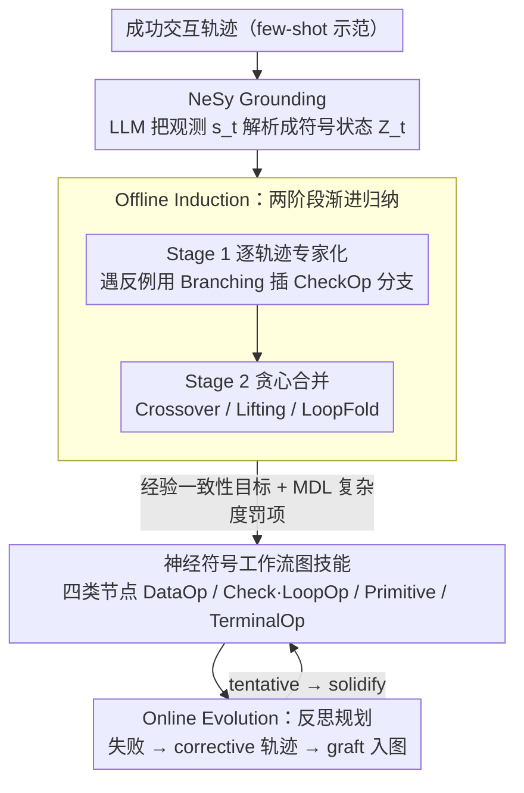

# Lifting Traces to Logic: Programmatic Skill Induction with Neuro-Symbolic Learning for Long-Horizon Agentic Tasks

**会议**: ICML 2026  
**arXiv**: [2605.01293](https://arxiv.org/abs/2605.01293)  
**代码**: 无  
**领域**: LLM Agent / 神经符号 / 长时程规划  
**关键词**: 技能归纳, 一阶逻辑, 工作流图, 反思规划, ALFWorld

## 一句话总结
NSI 把 LLM agent 的交互轨迹 "提升" 为带显式条件分支和动态变量绑定的神经符号工作流图，使技能从无状态脚本进化成可状态感知的逻辑程序，在 ALFWorld / WebShop / TextCraft 上分别拿到 98.0 / 76.5 / 95.2 的成功率，全面碾压 ASI 和 AWM 等编程式技能基线。

## 研究背景与动机

**领域现状**：基础模型驱动的 agent 在长时程任务中越来越依赖 "技能归纳" (skill induction)——把过往成功轨迹蒸馏成可重用的 Python 函数 (如 ASI、AWM)，扩展动作空间从而避免每次都重新推理。这相当于把 System-2 思考凝固成 System-1 肌肉记忆。

**现有痛点**：当前的技能要么是文本 workflow (AWM, 不可执行)，要么是无状态参数化脚本 (ASI, 如 `Open(Receptacle) → Pick(Object)`)。这些脚本在环境出现轻微偏差时直接失败——比如冰箱里没有 "apple"，脚本仍然机械执行 Pick，根本不会查询状态再判断。

**核心矛盾**：编程式技能与真实环境的 "条件性" 不匹配——LLM 在合成代码时只看到一条线性轨迹，于是把所有动作 hardcode 进顺序结构，无法表达 "打开冰箱后若苹果存在则取之，否则搜其他位置" 这类分支逻辑。表达能力的缺失让 ASI 在 WebShop 上得分仅 7.7 (远低于 AWM 的 49.2)。

**本文目标**：把技能从线性脚本升级到带显式控制流 + 动态变量绑定的图程序；让 agent 能从极少示范 (单次轨迹) 中归纳出泛化能力强的逻辑，并能在部署期通过反思持续修补。

**切入角度**：作者从神经符号视角出发——LLM 擅长把感知映射到语义谓词 (System-1 like)，而符号解释器擅长执行精确的 if/loop 逻辑 (System-2 like)。两者解耦后能既保留 LLM 的灵活感知又获得程序的可验证性。

**核心 idea**：用 "轨迹到逻辑" (trace-to-logic) 的提升机制把示范抽象为一阶逻辑 + 工作流图；通过 intra-trajectory 一致性 + inter-trajectory 合并的两阶段算法归纳出全局技能；运行时用 reflective planning 把失败子图 graft 到失败节点上让技能自演化。

## 方法详解

### 整体框架
NSI 要把 LLM agent 一次性走通的交互轨迹 "提升" 成一段带条件分支、能查状态再决策的逻辑程序。它把一个技能定义为三元组 $\pi_\omega = (\theta_\omega, \phi_\omega, G_\omega)$——调用参数 $\theta_\omega$、神经感知模块 $\phi_\omega$ (让 LLM 当语义解析器，把原始观测翻译成符号状态 $Z_t$)、以及符号执行图 $G_\omega$ (由一个确定性解释器逐节点执行)。整条 pipeline 走三步：先 NeSy Grounding 把环境感知映射到一阶逻辑谓词空间，再 Offline Induction 把成功轨迹归纳成模块化技能入库，最后 Online Evolution 在部署期用反思规划拿运行反馈修补技能的逻辑分支与可行域。下图沿这三步展开，三个关键设计分别落在"技能用什么表征""怎么把轨迹归纳成技能""归纳服从什么目标"上。

### 关键设计

**1. 四类节点的神经符号工作流表征：让技能从无状态脚本变成能查状态的图程序**

ASI 式的线性脚本之所以一遇环境偏差就崩，是因为它把所有动作 hardcode 成一条顺序流，没有任何 "先看一眼再决定" 的余地。NSI 把技能改写成有向图，节点分四类各司其职：DataOp 负责动态变量绑定，合成一个程序 $f_v: \mathcal{C} \times \mathcal{Z} \to \mathcal{C}$（例如 `target = select_one(x, is_type(x, 'apple') ∧ contains(loc, x))`，从当前符号状态里挑出真正存在的目标）；CheckOp/LoopOp 负责控制流，前者合成布尔判别式如 `is_closed(y) ∧ locates('agent', y)` 决定走哪条分支，后者把重复结构卷成循环；PrimitiveOp 是原子动作，参数直接引用上游 DataOp 绑定的变量；TerminalOp 在成功或失败时终止，失败时还会自动吐出 "$\nexists x, \text{is\_type}(x, \text{apple})$" 这类诊断信息。这种模块化既让 agent 可以只重写某个 CheckOp 而不必重生成整个技能，又用显式逻辑节点逼着 LLM 把 "为什么" 和 "什么时候" 形式化下来，不再无条件跳过判断。

**2. Empirical Programmatic Consistency：用历史轨迹一致性代替跑不动的在线验证**

embodied / web 环境往往没法完美重置，想靠反复 rollout 来验证一个候选技能对不对几乎不可行。NSI 因此把归纳目标建立在轨迹一致性上：技能 $\pi_\omega$ 在轨迹 $\tau$ 的状态 $s_h$ 上算 "一致"，当且仅当它从 $s_h$ 出发产出的所有非空动作 $\hat{a}_k$ 都能匹配上专家动作 $a^\ast_{h+m(k)}$。在此之上优化目标

$$\max_{\pi_\omega} \sum_\tau \big|\widehat{\mathcal{R}}_{\pi_\omega}^\tau\big| - \lambda |\pi_\omega|$$

一边最大化技能能 "忠实复现" 的经验覆盖区域，一边按 MDL 原则用 $\lambda |\pi_\omega|$ 压住程序复杂度。这样既不用重启环境，又保留了 "必须严格再现专家行为" 的强约束，复杂度罚项还顺手压制了过拟合。

**3. 两阶段渐进归纳 + 四类结构算子：先把每条轨迹拟合成专家，再贪心合并成全局技能**

直接在程序空间里优化上面那个全局目标会组合爆炸，NSI 用 "分而治之" 绕开它。Stage 1 对每条轨迹各合成一个局部技能 $\pi_\tau$，每遇到一个反例状态 $s_{\text{err}}$ 就用 Branching 算子在那里插一个 CheckOp 分支，先把单条轨迹喂饱。Stage 2 再贪心合并：每轮挑出当前覆盖最差的硬轨迹技能 $\pi_{\text{hard}}$，与全局技能做 $\mathtt{Consolidate}(\pi_{\text{glb}}, \pi_{\text{hard}})$，只有当合并严格扩展了可行域才接受。合并时三类算子各管一摊——Crossover 把子图嫁接过来，Lifting 把常量提升为参数好让技能跨实例泛化，LoopFold 把重复结构抽象成 LoopOp。先专家化再泛化的好处是 LLM 每次只用解决一个局部冲突，既高效又让产出的技能可读可解释。

### 损失函数 / 训练策略
NSI 全程不更新 LLM 参数，所有 "训练" 都发生在程序空间里。Stage 1 靠迭代一致性检测 + LLM 程序合成，Stage 2 靠贪心的 feasibility dominance 验证来决定是否接受合并。在线阶段的 Reflective Planning 一旦检测到失败，就调 LLM 生成一条 corrective trajectory，再用同一套结构算子把它并进 skill graph——新分支先以 tentative 状态存在，反复成功后才 solidify 固化下来，避免一次性错误恢复污染整张技能图。Backbone 用 GPT-4o，温度设为 0 以保证可重复。

## 实验关键数据

### 主实验

| 方法 | ALFWorld SR (%) | WebShop Score | WebShop SR (%) | TextCraft SR (%) |
|------|-----------------|---------------|-----------------|--------------------|
| ReAct | 85.8 | 44.0 | 20.0 | 62.0 |
| Reflexion | 84.3 | 40.8 | 23.0 | 59.0 |
| AWM | 91.3 | 49.2 | 30.0 | 92.5 |
| ASI | 70.6 | 7.7 | 7.5 | 77.8 |
| **NSI w/o online honing** | **93.5** | **58.8** | **30.5** | 78.5 |
| **NSI (Ours)** | **98.0** | **76.5** | **44.5** | **95.2** |

### 消融实验

| 配置 | 现象 | 解读 |
|------|------|------|
| ASI (无逻辑分支) | WebShop Score 仅 7.7 | 线性脚本完全无法表达条件逻辑 |
| NSI offline only | 已经超过所有 baseline | 离线归纳的逻辑表征本身就够强 |
| NSI full (含 online honing) | 三个 benchmark 全面 SOTA | 反思规划把运行失败转为永久能力 |
| 平均 atomic steps / skill | NSI $\approx 7.4$ vs ASI 较低 | NSI 把 7+ 步逻辑压进一个技能 |

### 关键发现
- ASI 把经验形式化为脚本反而比 AWM 的纯文本工作流更差——说明 "表达力不足的程序" 比 "非可执行的文本" 还要糟糕，验证了逻辑分支的必要性。
- ALFWorld 的 "长时程崩塌" 现象：baseline 在 $>22$ 步时成功率断崖式跌到 0，而 NSI 在 53+ 步还能维持，因为它把 7.4 个原子动作压进一个技能从而 "压缩" 了规划地平线。
- Reflexion 的文本记忆增益相对 ReAct 几乎可忽略，再次说明长时程任务的瓶颈不是 "想起来" 而是 "执行得稳"。

## 亮点与洞察
- "trace-to-logic lifting" 的概念非常通用——任何 LLM agent 都可以通过这种方式把示范升级为可验证的程序，跨任务迁移到 SWE-bench、机器人操作等更复杂场景。
- Reflective Planning 把失败信号转化为 "local subgraph grafting"，相当于持续学习的程序合成版，避免了灾难性遗忘 (技能图是单调增长的)。
- MDL 罚项 + 四类结构算子的组合让 LLM 在搜索程序空间时有明确的偏好（既要覆盖又要简洁），这对未来 "程序合成 + LLM" 的方法都是一个可复用的模板。

## 局限与展望
- 所有实验都建立在 "环境提供可枚举谓词词表" 的假设上 (ALFWorld / WebShop 都有结构化反馈)；对真实开放世界，predicate 的发现本身就是难题。
- GPT-4o 作为合成器成本高，作者没探讨小模型能否驱动这套合成器。
- 在线 honing 依赖 LLM 自己提出 corrective trajectory，若 LLM 给出错误恢复方案，graft 进图后可能污染技能；论文用 "tentative → solidify" 的双轮接受缓解但没量化失败率。
- TextCraft 的提升相对最小 (95.2 vs AWM 的 92.5)，说明在 "递归分解" 已经够用的任务上，逻辑分支的边际价值有限。

## 相关工作与启发
- **vs ASI**：ASI 把技能合成为参数化脚本，无 CheckOp/LoopOp 类显式控制流；NSI 通过 predicate invention 主动合成分支判别式，把 ASI 在 WebShop 上的 7.7 拉到 76.5。
- **vs AWM**：AWM 的技能是文本模板，不可执行；NSI 的技能是符号图程序，可被解释器验证并精确执行。
- **vs Agentic Workflow Generation (AFlow, GPTSwarm)**：他们组装预定义节点 (Debate / Voting)；NSI 的节点是 "被发明出来" 的内部逻辑，粒度更细，泛化更强。
- **vs 经典 RL 选项 (Sutton 1999)**：传统 options 是黑盒神经策略，需要大量参数优化；NSI 的技能是可读 Python 代码，与 LLM 的生成能力天然对齐。

## 评分
- 新颖性: ⭐⭐⭐⭐⭐ 把 "轨迹提升为逻辑程序" 这一神经符号思想用 LLM 实现并落地到 agent 框架
- 实验充分度: ⭐⭐⭐⭐ 三个主流 agent benchmark + 充分消融 + 长时程分析
- 写作质量: ⭐⭐⭐⭐ 算法 + 节点定义讲得清晰，部分形式化稍多
- 价值: ⭐⭐⭐⭐⭐ 给 LLM agent 的技能学习提供了表达力跃升的新范式

<!-- RELATED:START -->

## 相关论文

- [\[ICML 2026\] Skill-Pro: Learning Reusable Skills from Experience via Non-Parametric PPO for LLM Agents](skill-pro_learning_reusable_skills_from_experience_via_non-parametric_ppo_for_ll.md)
- [\[ACL 2026\] SOLAR-RL: Semi-Online Long-horizon Assignment Reinforcement Learning](../../ACL2026/llm_agent/solar-rl_semi-online_long-horizon_assignment_reinforcement_learning.md)
- [\[ICLR 2026\] Solving the Granularity Mismatch: Hierarchical Preference Learning for Long-Horizon LLM Agents](../../ICLR2026/llm_agent/solving_the_granularity_mismatch_hierarchical_preference_learning_for_long-horiz.md)
- [\[ICML 2026\] ACON: Optimizing Context Compression for Long-horizon LLM Agents](acon_optimizing_context_compression_for_long-horizon_llm_agents.md)
- [\[ACL 2026\] FregeLogic at SemEval 2026 Task 11: A Hybrid Neuro-Symbolic Architecture for Content-Robust Syllogistic Validity Prediction](../../ACL2026/llm_agent/fregelogic_at_semeval_2026_task_11_a_hybrid_neuro-symbolic_architecture_for_cont.md)

<!-- RELATED:END -->
