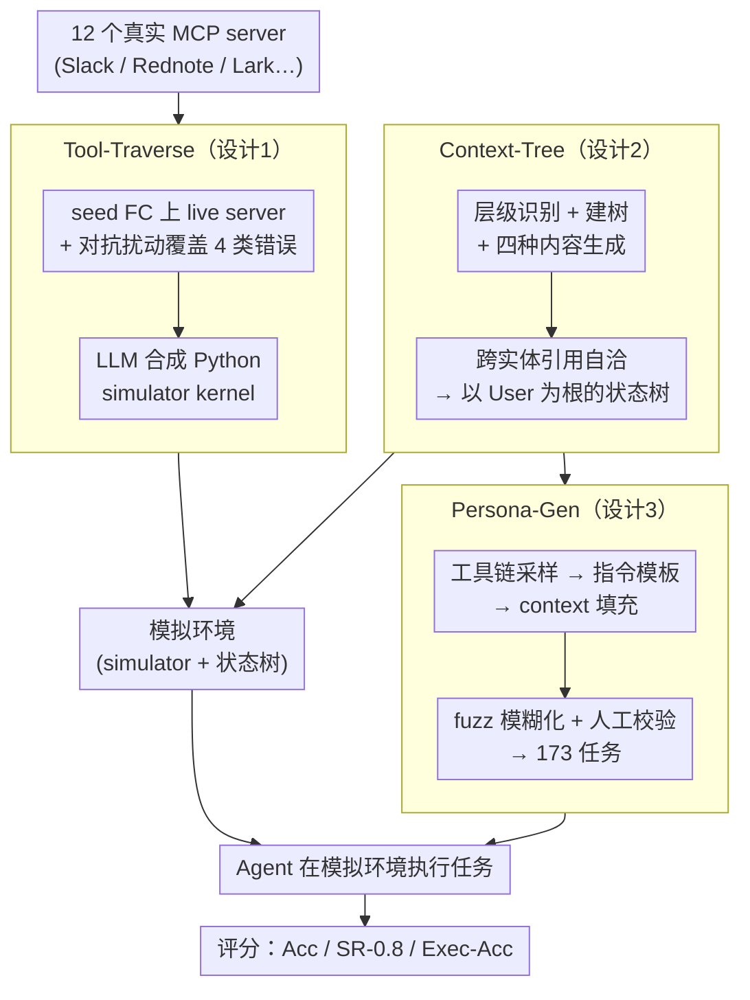

# MCP-Persona: 用环境模拟评估 LLM agent 在真实个人化应用上的能力

**会议**: ICML 2026  
**arXiv**: [2606.02470](https://arxiv.org/abs/2606.02470)  
**代码**: https://github.com/wwh0411/MCP-Persona  
**领域**: LLM Agent / Benchmark / 工具使用  
**关键词**: MCP, 个人化, agent benchmark, 环境模拟, 工具调用

## 一句话总结
MCP-Persona 是首个针对真实个人化 MCP 工具（Slack/Rednote/Instagram/Lark 等 12 服务器）的 LLM agent benchmark；提出 Tool-Traverse + Context-Tree + Persona-Gen 三套方法，用 LLM 自动 synthesize Python simulator 代码避免真实账号问题；测 10+ SOTA agent 发现连 Claude-Sonnet-4.5 也只达 38.66% Acc，证明个人化工具使用是被严重低估的能力短板。

## 研究背景与动机

**领域现状**：MCP 是 LLM 接外部工具的标准协议，已被 Anthropic Skills、OpenClaw 等广泛采用。但现有 tool-use benchmark（AppWorld、PersonaBench、MCP-Universe、ToolAthlon）大多用通用 information-seeking 工具或合成工具，没有评测"绑定用户账号、操作本地状态"的个人化工具。

**现有痛点**：个人化 MCP 评测面临三个困难——(1) 真实部署需要 private user data 和大量人工配置；(2) 隐私和安全限制开放数据共享；(3) 维护稳定可执行的模拟环境是非平凡技术挑战。

**核心矛盾**：真实评测要真实数据（隐私问题）；合成评测有 distribution gap（评测信号不可信）。现有 benchmark 选了合成路线，对 Slack/Instagram/Lark 等广泛使用的应用没覆盖。

**本文目标**：建一个既反映真实个人化工具行为又不依赖真实用户数据的 evaluation platform，覆盖社交媒体、企业协作、邮件、内容管理四大类别。

**切入角度**：traverse-then-simulate 范式——先在 sandbox 真实账号 traverse 真实 MCP server 的成功+失败 FC 记录行为；然后用 LLM autonomously synthesize Python code 当 simulator，保证 distribution 接近真实。User context 用 tree hierarchy 建模，task 用 tool chain sampling + instruction fuzzification + 人工校验生成。

**核心 idea**：三套工具——(1) Tool-Traverse：seed FC + adversarial generation 扩 pool，记录真实行为，LLM 写 Python simulator；(2) Context-Tree：User→Calendar→Event 这种 hierarchy 表征 entity；(3) Persona-Gen：tool chain 采样 → prototype → context 注入 → fuzz → 人工校验得 173 任务。

## 方法详解

### 整体框架

MCP-Persona 要解决的核心矛盾是：评测个人化工具既要真实账号行为、又不能碰真实用户隐私数据。它的破局方式是 traverse-then-simulate——先在 sandbox 账号上真实遍历每个 MCP server 的成功与失败调用、把行为记录下来，再让 LLM 把这些行为"写成"一份可执行的 Python simulator 来替代真实 server。整条流水线由三个组件串成：Tool-Traverse 产出每个 server 的 simulator kernel，Context-Tree 产出一棵以 User 为根的个人化数据树作为 simulator 的状态，Persona-Gen 在这棵树上采样工具链、生成并人工校验出 173 个任务。Agent 最终在这个模拟环境里执行任务，用 Acc / SR-0.8 / Exec-Acc 三个指标评分。

### 关键设计

**1. Tool-Traverse：把真实 server 的行为"遍历"出来再让 LLM 写成代码**

手工 mock 一个 MCP server 很难——既漏掉各种 error handling，又 scale 不到 12 个服务器。Tool-Traverse 的思路是不去手写 simulator，而是先在真实 server 上把行为采全。它分三步：先做 Bootstrapping，人工写一条合法的 seed call $x_{\text{seed}}$ 在 live server 上执行，记录下 $(t, x_{\text{seed}}, y_{\text{seed}}, \tau)$ 这条成功轨迹；再做 Adversarial Failure Induction，让 LLM 系统性地扰动 seed 输入，覆盖 Type Mismatch / Schema Violation / Boundary / Semantic Conflict 四类错误，逐个打到真服务器上、记录它返回的失败响应；最后是 Code-Based Simulation，LLM 拿着 (tool schema, 行为轨迹, context handler API) 自动 synthesize 出一份 Python 文件 $K_t$，实现状态转移 $f_t: (\mathcal{C}_{\text{current}}, x) \to (\mathcal{C}_{\text{new}}, y)$，里面带齐 input validation、entity check、error response 的完整逻辑。这样做之所以有效，是因为 adversarial 那一步把错误模式系统性采全了、simulator 能准确复刻 server 的报错行为，而 LLM-as-coder 把人工成本从"写一整套 simulator"压到只需"写几条 seed FC"，12 个 server 才得以铺开。

**2. Context-Tree：用一棵以 User 为根的树承载个人化状态**

simulator 光有工具行为还不够，个人化任务要求它支持有状态的多轮操作（发了 10 条帖子之后还能查回来）。Context-Tree 把用户上下文建成一棵层级树来匹配真实 MCP server 的数据结构。先做 Hierarchy Identification，从工具调用池里聚合出 entity 类型、字段和关系，人工校验后得到一棵 root-at-User 的层级（如 Lark 是 User→Calendar→Event）；Tree Construction 阶段，父实体下同类子节点用 identifier 索引的 map 存、跨类型实体之间用 foreign key 关联，从而支持高效的 lookup/update；Content Generation 阶段，LLM 按字段性质分配四种生成方式——Enumerate（如 `iplocation` 这类枚举值）、Free-Form（如 `channel_name`）、Random（如 `chat_id`）、Authentic（直接采真实 Rednote post 文本）；最后 Cross-Entity Linking 让引用类字段从已生成内容里 sample 出 identifier，保证树内引用自洽。这套"树结构 + 四种内容生成"的组合，既让数据贴近真实分布（authentic 真文本提升真实度），又把敏感字段替换成 fake 守住隐私。

**3. Persona-Gen：两阶段生成 + fuzzification + 人工校验造出 173 个任务**

纯自动生成的任务往往要么不真实、要么太简单，Persona-Gen 用一条五步流水线在 scale 和质量之间找平衡。先做 Tool Chain Sampling，用 topological sampling 采出满足五条原则（Dependency / Personalization / Deduplication / Coherence / Realism）的工具链；Instruction Prototyping 让 LLM 用带类型的 placeholder $P$ 把指令抽象成模板 $S_{\text{proto}}$；Context Enrichment 从 context-tree 里 sample 真实 entity 值替换 placeholder 得到具体指令 $S_{\text{inst}}$；关键一步是 Fuzzification——移除那些 implicit context（比如同事的 user_id 其实能通过共享群组推断出来）得到模糊指令 $S_{\text{fuzz}} = \mathcal{F}(S_{\text{inst}} \setminus \mathcal{C}_{\text{imp}})$，这一步专门模拟"用户说话不完整、agent 要从环境里自己补全信息"这个现实难点，也是 benchmark 难度的主要来源；最后 Human Verification 校验一致性并刻意加难（把 1 个 post 扩到 10 个、剪掉不必要的 context），最终得到覆盖 single-server 与 cross-server 的 173 个高质量任务。

## 实验关键数据

### Benchmark 对比

| Benchmark | Real-World | Personal Context | Social Media | Collab | Email | Content |
|---|---|---|---|---|---|---|
| AppWorld | ✗ | ✓ | ✗ | ✗ | ✓ | ✓ |
| PersonaBench | ✗ | ✓ | ✗ | ✗ | ✓ | ✓ |
| InfoMosaic-Bench | ✓ | ✗ | ✗ | ✗ | ✗ | ✗ |
| MCP-Universe | ✓ | ✗ | ✗ | ✗ | ✗ | ✓ |
| TOOLATHLON | ✓ | ✗ | ✗ | ✗ | ✓ | ✓ |
| **MCP-Persona** | ✓ | ✓ | ✓ | ✓ | ✓ | ✓ |

唯一覆盖全部 5 维度，特别是 Social Media 和 Collaboration Platform 是其他 benchmark 完全没有的。

### 主实验：SOTA agent 在 MCP-Persona

| Model | Collab | Content | Social | Email | Lark | Rednote | Hodgepodge | Acc | SR-0.8 | Exec-Acc |
|---|---|---|---|---|---|---|---|---|---|---|
| Claude-Sonnet-4.5 | 39.94 | 19.76 | 47.04 | 43.63 | 40.81 | 42.37 | 12.50 | **38.66** | 10.40 | 41.50 |
| GPT-5 | 43.50 | 22.57 | 42.64 | 47.17 | 37.67 | 34.66 | 12.50 | 36.99 | 6.94 | 41.45 |
| Claude-Opus-4.1 | 38.79 | 13.56 | 44.79 | 9.71 | 39.67 | 34.70 | 25.00 | 34.52 | 7.05 | 36.77 |
| o4-mini | 34.38 | 21.22 | 35.61 | 53.83 | 30.43 | 25.25 | 6.25 | 30.70 | 5.78 | 34.73 |
| o3 | 26.41 | 14.55 | 32.78 | 41.08 | 34.64 | 26.05 | 37.50 | 29.79 | 5.20 | 30.27 |
| GPT-4o | 24.50 | 7.58 | 36.98 | 12.57 | 30.65 | 20.29 | 25.00 | 25.56 | 4.35 | 20.02 |

**Claude-Sonnet-4.5 总体仅 38.66% Acc**，证明个人化工具是当前 LLM agent 严重短板。Hodgepodge（cross-server 混合）尤其差 12-25%。

### 关键发现

- **SOTA 没到 50%**：所有模型 Acc < 50%，远低于通用 tool benchmark 上 70-80%+，证明个人化工具是被严重低估的能力短板。
- **Cross-server 是关键瓶颈**：Hodgepodge 普遍 12-25%，跨多服务协调能力远低于 single-server。
- **Content Management 最难**：所有模型在 Content Mgmt 表现最差（< 25%），需要深度理解用户历史内容而非简单 CRUD。
- **Email 任务的模型间差异极大**：o4-mini 53.83、GPT-5 47.17 但 Claude-Opus-4.1 只 9.71、GPT-4o 12.57，可能跟训练数据中 email 样本量有关。
- **Simulation 有效性验证**：作者实验显示 simulator response 与真实 server prediction accuracy 高，证明 Tool-Traverse 可靠。

## 亮点与洞察

- **第一个真正覆盖个人化工具的 MCP benchmark**：Slack/Rednote/Instagram/Lark 评测一直是空白，本文填补关键 gap。
- **Traverse-then-simulate 范式**：真实账号 traverse 行为 + LLM 写 simulator 代码，人工成本从 prohibitive 降到可行，simulator 行为接近真实 server。
- **Tool-Traverse 的错误模式覆盖**：4 类错误（Type/Schema/Boundary/Semantic）系统化 adversarial generation 让 simulator 准确复制 server 的 error handling，比手工 mock 完整。
- **Context-Tree 的 hierarchy + content generation 混合**：tree 结构匹配真实数据，4 种 content generation 方式（含 authentic real text）兼顾真实和隐私。
- **Persona-Gen 的 fuzzification**：通过移除 implicit context 模拟"用户说话不完整、agent 要从环境补全"的核心难点，是 benchmark 难度的关键来源。
- **结论震撼**：SOTA 不到 50% 让社区清楚知道还有大量个人化工具能力工作要做。

## 局限与展望

- **173 任务规模偏小**：相比 MMLU 万级题量，173 任务可能在某些维度上 statistical power 不够。
- **覆盖应用仍有限**：12 个 MCP server 主要英语/中文，对其他语言生态（如 LINE、KakaoTalk）覆盖不足。
- **Simulator 的细节失真**：尽管 traverse-then-simulate 接近真实，但实际部署可能有 simulator 没捕捉到的 edge case，benchmark 信号可能 over-estimate agent 能力。
- **没分析失败原因**：知道 SOTA 不到 50% 但缺乏 failure analysis（是 information seeking 失败？还是 multi-step 协调失败？）。
- **隐私处理需更严格**：Authentic content 虽替换敏感字段，但完整审计需要更系统的隐私保证。
- **没考虑 adversarial users**：真实用户可能给故意模糊或对抗性指令，benchmark 全是 well-intentioned task。
- **缺 agent 训练 baseline**：benchmark 只评测现有 SOTA，没探索是否可通过特定 fine-tuning 提升个人化工具能力。

## 相关工作与启发

- **vs AppWorld / PersonaBench**：他们也试图评测 personalized agent 但工具是 synthetic；MCP-Persona 用真实 MCP 工具。
- **vs ToolAthlon**：Real-world 但不覆盖 Social Media 和 Collaboration（账号绑定难）；MCP-Persona 用 simulation 绕开难题。
- **vs Tau-Bench**：第一个 tool-agent-user benchmark 但用 synthetic airline/retail tools；MCP-Persona 真实 distribution。
- **vs InfoMosaic-Bench / MCP-Universe**：他们覆盖 real-world 但不个人化；MCP-Persona 唯一同时具备 real + personal。
- **启发**：(1) 任何"真实部署需要私人数据但 benchmark 要开源"的领域都可以用 traverse-then-simulate 范式；(2) LLM-as-coder 写 simulator 是 scalable benchmark 建设的关键 trick；(3) 个人化 agent 能力的 evaluation gap 提醒社区不要被通用 tool benchmark 高分迷惑，部署到真实个人化场景能力可能远低于预期。

## 评分

- 新颖性: ⭐⭐⭐⭐⭐ Traverse-then-simulate 范式 + LLM-as-coder simulator + Context-Tree hierarchy 都是 benchmark 建设方法学创新。
- 实验充分度: ⭐⭐⭐⭐ 10+ SOTA agent 评测 + simulator 有效性验证 + 多类别 benchmark 对比，扎实；缺 failure analysis 和 finetuning experiment。
- 写作质量: ⭐⭐⭐⭐ 三组件流水线介绍清晰，Figure 1 直观，Table 2 一表道尽 SOTA gap；少数 LLM 写 simulator 的 prompt 细节放 appendix 影响 reproducibility。
- 价值: ⭐⭐⭐⭐⭐ 直接揭示 LLM agent 个人化能力短板，对 agent 训练社区是必要的 evaluation foundation，开源 + 涵盖 Slack/Lark 等高 demand 应用对工业有直接价值。

<!-- RELATED:START -->

## 相关论文

- [\[ACL 2026\] MCP-Flow: Facilitating LLM Agents to Master Real-World, Diverse and Scaling MCP Tools](../../ACL2026/llm_agent/mcp-flow_facilitating_llm_agents_to_master_real-world_diverse_and_scaling_mcp_to.md)
- [\[ICML 2026\] Agent-Omit: Adaptive Context Omission for Efficient LLM Agents](agent-omit_adaptive_context_omission_for_efficient_llm_agents.md)
- [\[ICML 2026\] SafeHarbor: Defining Precise Decision Boundaries via Hierarchical Memory-Augmented Guardrail for LLM Agent Safety](safeharbor_hierarchical_memory-augmented_guardrail_for_llm_agent_safety.md)
- [\[ACL 2026\] OPeRA: A Dataset of Observation, Persona, Rationale, and Action for Evaluating LLMs on Human Online Shopping Behavior Simulation](../../ACL2026/llm_agent/opera_a_dataset_of_observation_persona_rationale_and_action_for_evaluating_llms_.md)
- [\[ICML 2026\] Weasel: 通过重要性-多样性数据选择实现 Web Agent 的域外泛化](weasel_out-of-domain_generalization_for_web_agents_via_importance-diversity_data.md)

<!-- RELATED:END -->
