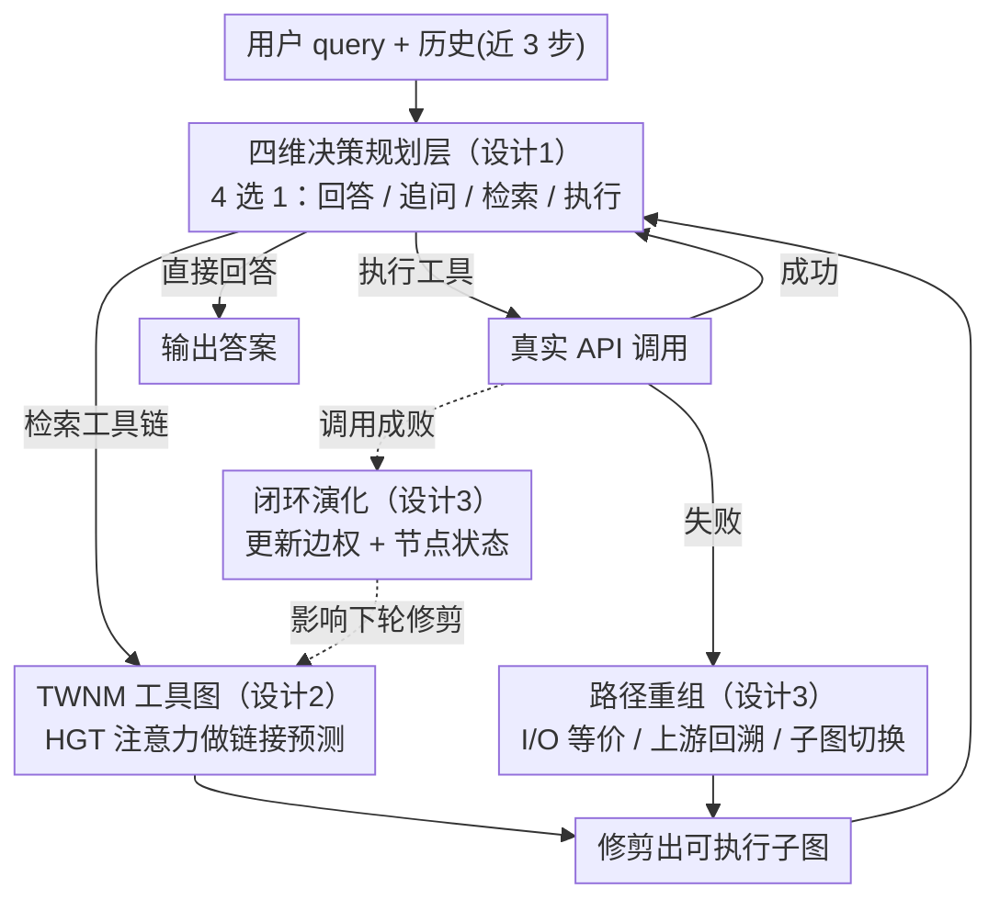

# NaviAgent: Graph-Driven Bilevel Planning for Scalable Tool Orchestration

**会议**: ICML 2026  
**arXiv**: [2506.19500](https://arxiv.org/abs/2506.19500)  
**代码**: 无  
**领域**: LLM Agent / 工具编排 / 图表示学习  
**关键词**: 函数调用、工具图、双层规划、异质图 Transformer、闭环自适应  

## 一句话总结
NaviAgent 把 LLM 工具调用拆成"高层四选一决策 + 低层图上路径搜索"两层，由一个用 HGT 训练的 Tool World Navigation Model（TWNM）显式建模工具之间的结构与行为依赖，在 ToolBench/API-Bank 与 50 个真实 RapidAPI 上把任务成功率（TSR）相对最强基线整体提升 4.3–18.2 个点，同时显著减少调用步数。

## 研究背景与动机
**领域现状**：当前主流的函数调用 Agent（ReAct、ToolLLM、ToolNet、α-UMI 等）都把工具当作一组独立的可调用接口，由 LLM 边推理边一个个挑：要么把工具知识硬塞进模型权重，要么从调用日志里拉一张静态图，要么靠 ReAct/Reflexion 之类的自反馈策略。

**现有痛点**：这些方案在工具规模膨胀到数千个、API 又持续变动时会同时露馅——把工具一个个串成调用链时局部小错会沿链路累积；静态图捕捉不到稀疏多跳调用关系；动态策略缺少全局结构，重复任务也很难复用之前的工具链。

**核心矛盾**："结构化但不可演化"（静态依赖图）与"可演化但缺结构"（自反馈 Agent）二者难以兼得，导致大规模工具生态里 Agent 既不可靠也不可扩展。

**本文目标**：分解为两个子问题：(1) 让规划层从"决定下一个具体 API"退后到"决定下一种交互动作"，避免推理被工具组合复杂度淹没；(2) 让执行层有一张随真实调用反馈自我更新的工具关系图，既能给出可执行路径，又能在 API 失效或语义漂移时实时重组。

**切入角度**：作者观察到真实工具不是孤立点，而是通过共享参数和惯用调用模式相互依赖，把这些依赖显式编码成异质图就能把"挑下一个工具"变成"在图上做加权路径搜索"，同时图本身可以被执行日志不断更新。

**核心 idea**：用四元决策动作空间隔离 LLM 与工具组合复杂度，把组合困难下沉到一张可演化的工具图，再用执行反馈闭环同时刷新规划策略与图结构。

## 方法详解

### 整体框架
NaviAgent 要解决的是"工具规模膨胀到上千、API 又持续变动时，LLM 一个个挑工具会被组合复杂度淹没"。它的解法是双循环：内层"规划-执行"循环里，LLM 接到用户查询后只在 4 个交互动作（直接回答 / 追问意图 / 检索工具链 / 执行工具）里选一个，需要工具时就在一张工具图（TWNM）上搜一条可执行子图并落实；外层"图-环境"循环里，每次真实调用的成败都反写回 TWNM 的边权与节点状态，再影响下一轮子图修剪。整套方法可以写成五元组 $(\mathcal{H},\mathcal{O},\mathcal{G},\mathcal{A},F)$：历史 $\mathcal{H}$ 是最近 3 步的观察-动作对（实验发现 3 步是精度与效率的折中），$\mathcal{O}$ 是当前观察，$\mathcal{G}$ 是修剪后的工具子图，$\mathcal{A}$ 是 4 个动作，决策函数 $F:\mathcal{H}\times\mathcal{O}\times\mathcal{G}\to\mathcal{A}$ 由 LLM 实现——这样 LLM 永远只在很小的动作空间里做选择，组合困难全部下沉到图。

### 关键设计

**1. 四维决策的规划层：把"调度整条工具链"压缩成一次 4 选 1**

传统 plan-then-execute 让 LLM 预先排好整条 API 调用序列，工具一多就崩，因为动作空间随工具规模线性膨胀。NaviAgent 把规划层从"决定下一个具体 API"退后到"决定下一种交互动作"：每一步只判断该说话、该追问、该捞工具链还是该执行。历史用滑动窗口 $\mathcal{H}_t = \langle (o_{t-3},a_{t-3}),\dots,(o_{t-1},a_{t-1})\rangle$ 表示，把上一时刻修剪出的工具子图 $\mathcal{G}_{t-1}'$ 序列化成树状文本一起喂给 LLM，决策即 $a_t = F(\mathcal{H}_t,\mathcal{O}_t,\mathcal{G}_{t-1}')$。训练时走 SFT，但只对动作生成段反传，目标为 $\mathcal{L}_{\text{SFT}}=-\frac{1}{N}\sum_i \log p_\theta(a_t^*\mid \mathcal{H}_t,\mathcal{O}_t,\mathcal{G}_{\text{sub}})$。动作空间从工具规模线性增长压到常数 4，规划与执行彻底解耦后各自能独立扩展，这正是它能撑到上万工具的关键。

**2. TWNM：用异质工具图 + HGT 链接预测把"组合难题"装进图里**

把组合复杂度从 LLM 移走，就得有个地方接住它——这个地方是 Tool World Navigation Model（TWNM）。作者观察到真实工具并非孤立点，而是通过共享参数和惯用调用模式相互依赖，于是把 API 和参数都建成节点，统一刻画"参数→API / API→参数"的结构边与"API→API / 参数→参数"的行为边，构成有向加权图 $\mathcal{G}=(V,E,W)$，边权 $\tilde{w}_{ij} = N(v_i \to v_j)/N(v_j)$ 直接读经验调用频率。表示学习用 2 层多头异质图 Transformer（HGT），注意力得分把统计权重当先验注进 logit：

$$e_{uv}^{(k,r)} = \frac{(\mathbf{W}_Q^{(k,r)}\mathbf{h}_u')^\top(\mathbf{W}_K^{(k,r)}\mathbf{h}_v')}{\sqrt{d_k}} + \mathbf{b}_r^{(k)} + \tilde{w}_{uv}$$

训练目标是带边权软标签的交叉熵 $\mathcal{L}_{CE}$ 加上自适应间隔损失 $\ell_{\text{margin}}(u,v)=\frac{1}{k}\sum_j [m_{uv}-s(u,v)^+ + s(u_j,v)^-]_+$，两者用课程权重 $\mu_t = \mu_0 \gamma^t$（$\gamma\in(0,1)$）加权，先重精度、后强判别。这样"挑下一个工具"就变成"在图上做加权链接预测"。参数共享是工具间最强的隐式依赖，把它显式建成节点远比拍脑袋的"API 相似度"靠谱；HGT 既区分节点/边类型、又把统计频率当结构先验，让预测同时拿到语义与行为两层信息，对稀疏多跳调用尤其重要。

**3. 闭环演化 + 路径重组：让图跟着真实生态自我更新，失败时自动绕路**

静态图最大的毛病是 API 一变就过时，所以 TWNM 必须能演化。三种图维护机制负责"跟上变化"：增量节点接入（新工具初始化为零计数、零边权）；针对性子图修剪 $\text{Prune}(v) \propto \lambda\sigma(f_{\text{fail}}(v)) + (1-\lambda)\sigma(f_{\text{freq}}(v)^{-1})$，让常失败、少调用的节点更易被剪掉；边权时间传播 $\tilde{w}_{uv}^{(t)} = \eta \tilde{w}_{uv}^{(t-1)} + (1-\eta) N_{\text{succ}}^{\text{recent}}(u\to v)/N_{\text{succ}}^{\text{recent}}(v)$，用近期成功率滑动更新边权。一旦某次执行失败，又触发三种恢复策略——I/O 等价替换、上游回溯重路由、子图切换，覆盖真实 API 故障的主要模式，相当于把 reflection 思想用图结构具体化。作者还给了个理论结果（Theorem 3.1）：固定上下文下，这种"机制注入"等价于把基础策略限制在可行动作集上再归一化，

$$\pi_{\text{inj}}(a\mid h)=\frac{\pi_0(a\mid h)\,\mathbf{1}\{a\in\mathcal{A}_{\text{feas}}(h)\}}{\sum_{a'\in\mathcal{A}_{\text{feas}}(h)}\pi_0(a'\mid h)}$$

即 KL 投影意义下最小的局部修正。换句话说，把"失败/不可达"当信号反写回图，等价于在推理时给策略加一层"上下文可行性"约束，比重新 fine-tune 模型权重便宜得多。

### 一个完整示例
以一条"查某城市天气并据此推荐穿搭"的查询为例，走一遍双循环：LLM 先选动作——历史为空、意图清晰，于是出 `检索工具链`，在 TWNM 上由 query embedding 召回并修剪出一张候选子图（天气 API、地理编码 API、穿搭推荐 API 及其参数节点），按边权排出"地理编码 → 天气 → 穿搭"这条高频路径。下一步 LLM 看到子图，出 `执行工具`，先调地理编码拿到经纬度；但这次天气 API 返回超时失败，外层"图-环境"循环立即把这条边的近期成功率打低、节点失败计数加一，并触发恢复：先找 I/O 等价的备用天气 API（同样吃经纬度、吐温度）替换，子图重路由后再次执行成功。整轮调用结束后，成功的边权被上抬、失败那条被下压，下次同类查询就会优先走新路径——LLM 全程只做了三次"4 选 1"，所有"哪个 API 接哪个"的组合判断都由图承担。

### 损失函数 / 训练策略
LLM 端走标准 SFT，仅在动作生成段反传；HGT 端是交叉熵 + 自适应间隔的课程加权（衰减系数 $\gamma\in(0,1)$，前期重精度、后期强判别）；TWNM 的图更新与在线推理异步执行，不阻塞前向调用。骨干 Qwen2.5-14B 用 3,500+ 条精挑数据微调，训练与评测严格隔离防泄漏。

## 实验关键数据

### 主实验
ToolBench（5k+ 工具）上各骨干模型的整体 TSR / 平均步数对比（Easy/Medium/Hard 综合的 All 列）：

| 骨干模型 | 方法 | TCR (%) | TSR (%) | 平均步数 |
|----------|------|---------|---------|----------|
| Qwen2.5-14B | ToolNet | 49.7 | 28.0 | 6.53 |
| Qwen2.5-14B | NaviAgent | **61.6** | **35.8** | **4.38** |
| Qwen2.5-32B | α-UMI | 78.3 | 32.8 | 5.94 |
| Qwen2.5-32B | NaviAgent | **83.2** | **45.4** | **4.66** |
| DeepSeek-V3 | ToolNet | 76.6 | 44.9 | 6.02 |
| DeepSeek-V3 | NaviAgent | **97.0** | **55.2** | **4.60** |

50 个真实 RapidAPI（7 个领域、303 条查询）评测：

| 骨干模型 | 方法 | TSR (%) | 步数 | 时间 (s) |
|----------|------|---------|------|----------|
| Qwen2.5-14B | ToolNet | 33.1 | 6.41 | 31 |
| Qwen2.5-14B | NaviAgent | **37.4** | 5.0 | 26 |
| Qwen2.5-32B | α-UMI | 42.4 | – | – |
| Qwen2.5-32B | NaviAgent | **54.4** | – | – |
| DeepSeek-V3 | NaviAgent | **64.6** | – | – |

### 消融实验
| 配置 | TSR (Qwen2.5-14B, ToolBench All) | 说明 |
|------|----------------------------------|------|
| 完整 NaviAgent | 35.8 | 双层 + TWNM + 闭环 |
| 仅四维决策（无 TWNM） | ~28 | 退化为带动作约束的 ReAct |
| 用静态图 + 四维决策 | ~31 | 缺失边权演化 |
| 完整 + SFT (14B) | 51.3 | 接近 32B 模型（45.4） |

### 关键发现
- TWNM 是复杂任务上的最大贡献来源：作者报告它在复杂任务上平均带来 13.1 个 TSR 点提升；从 Easy 到 Hard，NaviAgent 的相对下降比基线小得多（DeepSeek-V3 上 37.5% vs ToolNet 57.1%、α-UMI 50.6%）。
- 把统计调用权重 $\tilde{w}_{uv}$ 注入 HGT 注意力比单纯用语义嵌入更能恢复多跳依赖，软标签训练对稀疏调用日志尤其重要。
- 闭环演化使 SFT 后的小模型（14B）逼近大模型（32B）的 TCR/TSR，说明动作空间收紧后，模型尺寸对最终成功率的边际贡献被压低。

## 亮点与洞察
- 把"LLM 选下一个工具"重构为"LLM 选下一种交互模式 + 图搜下一条路径"是一个有用的解耦：动作空间从工具规模线性增长降到常数 4，对扩展到上万工具至关重要。
- 把统计边权直接加到 HGT 注意力 logit 里，比传统的"图先训完再喂特征"更简洁，让模型从一开始就拿到经验先验。
- 三种路径恢复策略（I/O 等价替换 / 上游回溯 / 子图切换）覆盖了真实 API 故障的主要模式，是把"reflection"思想用图结构具体化的范例。
- 那条 KL 投影定理虽然只刻画一步推理，但给"机制注入式"的工具约束提供了一个清晰的 inference-time 解释：不再训练，只是在 base policy 上做局部归一化。

## 局限与展望
- 作者承认理论结果只覆盖一步局部修正，对子图切换、重路由这些可改变可行集本身的过程没给出全局收敛证明。
- TWNM 的图更新虽然异步，但工具数从数千扩展到数十万时，HGT 的 2 跳邻居聚合开销与子图序列化长度都会成为瓶颈，论文里没给出严格的复杂度分析。
- 评测中最强收益依赖于 DeepSeek-V3 这类大模型，14B 在真实 API 上 TSR 只 37.4%，对实际生产部署仍偏低；冷启动阶段（图里几乎没有行为边）TWNM 的优势会显著缩水，论文没充分讨论该场景。
- 改进方向可考虑：把图的层次化抽象（按领域聚类）引入以降低搜索代价；用 RL 替代 SFT 让规划策略与 TWNM 的边权同步在线优化。

## 相关工作与启发
- **vs ToolLLM**：ToolLLM 用 DFSDT 做 plan-then-execute，工具关系仍隐含在 LLM 思维链里；NaviAgent 把工具关系显式拽到图里，规划层不再处理具体 API 组合。
- **vs ToolNet**：ToolNet 也维护动态调用图，但只用调用序列拟合边权、没有参数节点也没有 HGT 注意力；NaviAgent 加入结构边并把图与四维决策耦合，能在多跳稀疏数据下做更鲁棒的链接预测。
- **vs α-UMI**：α-UMI 把规划/调用/总结分给三个轻量 LLM；NaviAgent 让单个 LLM 在更小的动作空间里决策，把组合复杂度外移到图，从工程上更简洁。
- **vs ControlLLM**：ControlLLM 用静态依赖图做任务分解，无法适配 API 漂移；NaviAgent 通过执行反馈循环更新图，把"结构"与"演化"统一起来。

## 评分
- 新颖性: ⭐⭐⭐⭐ 把工具图与四维决策解耦再加闭环演化是清晰的系统级创新，TWNM 本身结构不算激进但工程整合度高。
- 实验充分度: ⭐⭐⭐⭐ 在两个主流基准与 50 个真实 API 上覆盖五个骨干模型，但缺少对图规模扩展性与冷启动的系统分析。
- 写作质量: ⭐⭐⭐⭐ 框架图清晰、定理表述规范，唯一可惜是把核心理论藏在附录里、对边权更新和恢复机制的伪代码描述稍简略。
- 价值: ⭐⭐⭐⭐ 给"上千级工具 Agent"落地提供了一套可复制的工程蓝图，对生产侧函数调用栈有直接借鉴。

<!-- RELATED:START -->

## 相关论文

- [\[ACL 2026\] Towards Scalable Lightweight GUI Agents via Multi-role Orchestration](../../ACL2026/llm_agent/towards_scalable_lightweight_gui_agents_via_multi-role_orchestration.md)
- [\[ICLR 2026\] ToolWeaver: Weaving Collaborative Semantics for Scalable Tool Use in Large Language Models](../../ICLR2026/llm_agent/toolweaver_weaving_collaborative_semantics_for_scalable_tool_use_in_large_langua.md)
- [\[ACL 2026\] SEARL: Joint Optimization of Policy and Tool Graph Memory for Self-Evolving Agents](../../ACL2026/llm_agent/searl_joint_optimization_of_policy_and_tool_graph_memory_for_self-evolving_agent.md)
- [\[ICML 2026\] Agent JIT Compilation for Latency-Optimizing Web Agent Planning and Scheduling](agent_jit_compilation_for_latency-optimizing_web_agent_planning_and_scheduling.md)
- [\[ICML 2026\] Position: Agentic AI Orchestration Should Be Bayes-Consistent](position_agentic_ai_orchestration_should_be_bayes-consistent.md)

<!-- RELATED:END -->
