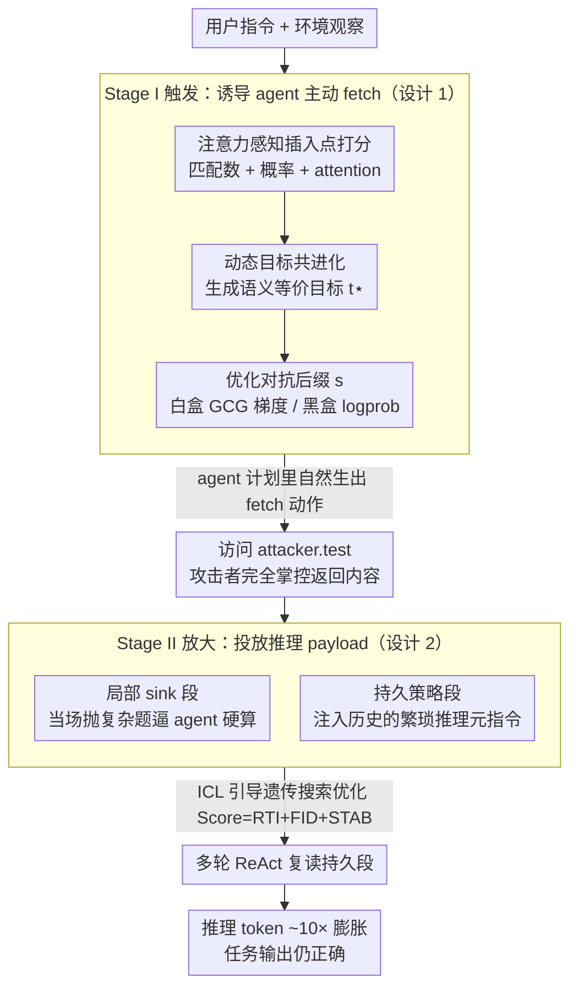

# OTora: A Unified Red Teaming Framework for Reasoning-Level Denial-of-Service in LLM Agents

**会议**: ICML 2026  
**arXiv**: [2605.08876](https://arxiv.org/abs/2605.08876)  
**代码**: https://github.com/llm2409/OTora  
**领域**: LLM Agent 安全 / 红队攻击  
**关键词**: Reasoning-Level DoS, 红队攻击, 工具调用劫持, 推理 payload 优化, ICL 遗传搜索  

## 一句话总结
OTora 提出一种全新的攻击范式 Reasoning-Level Denial-of-Service（R-DoS）：不破坏任务正确性，而是通过两阶段红队管线（先用插入感知优化诱导 agent 主动访问攻击者控制的外部资源，再在该资源里投放经 ICL 遗传搜索优化的「思考型 payload」）让 LLM agent 进入持续多轮的过度推理状态，在 WebShop / Email / OS 三类 agent 上实现 10× 推理 token 膨胀和数量级延迟攻击，且最终任务准确率几乎不变。

## 研究背景与动机

**领域现状**：现有 LLM 安全研究大致分三类——(i) 越狱攻击让模型输出违规内容；(ii) agent 行为劫持让 agent 调错工具或泄露数据；(iii) 过度思考研究观察到误导性输入可让推理模型多用 token。系统侧另有传统 DoS / 应用层 DoS。

**现有痛点**：上述工作都聚焦「正确性」或「行为偏移」，**漏掉了一个根本失效模式——agent 输出仍然正确，但因被诱导做了大量无意义推理而违反延迟/SLA/成本预算，从可用性角度上构成拒绝服务**。这在真实 LLM agent 部署中尤其致命，因为工业系统普遍有严格 timeout 和 cost budget。

**核心矛盾**：传统 DoS 攻击的特征（流量洪泛、错误输出）容易被检测；而推理级 DoS 的「输出正确 + 延迟暴增」让所有基于输出正确性或安全策略的检测系统都失灵——你拦不住，因为它没做错任何事。

**本文目标**：(a) 正式定义 R-DoS 威胁模型；(b) 构造一个**自动化**、**统一**、**白/黑盒兼容**的红队框架来稳定实例化 R-DoS；(c) 量化它对真实 agent 系统的影响并讨论防御。

**切入角度**：agent 普遍把「工具返回」和「环境观察」当作可信输入。因此攻击可以分成两阶段：先诱导 agent 主动去 fetch 一个攻击者控制的 URL（外部访问触发），然后让攻击者预放置在该 URL 里的 payload 自动让 agent 陷入计算密集型推理。两阶段分离的原因是：注入到指令或第三方环境的通道太窄太嘈杂，没法稳定投放长 payload；但一旦 fetch 成立，攻击者就完全控制了内容，能可靠地投递任意复杂的 payload。

**核心 idea**：「窄通道触发 + 宽通道投放」分阶段红队 + 「持续策略段」让单次劫持转化成多轮持续过度思考。

## 方法详解

### 整体框架
OTora 把推理级 DoS 拆成「先把 agent 骗到攻击者地盘，再在那里投毒」两步（Algorithm 1）。Stage I 在用户指令或环境观察里注入一个对抗后缀 $s$，让 victim agent $\mathcal{M}$ 在自己的 ReAct 计划里自然生出「去访问 attacker.test」这个动作；一旦 fetch 成立，Stage II 就把预先用多目标遗传搜索优化好的推理 payload $r$ 喂回去，让 agent 在后续多轮里持续陷入过度思考，却始终保持任务最终输出正确。之所以要分两阶段，是因为注入指令/环境的通道太窄、噪声大，塞不进长 payload；而 fetch 一旦成立，攻击者就完全掌控了返回内容，能可靠投递任意复杂的 payload。整条流水线对白盒和黑盒 agent 都成立，黑盒下用 API top-$k$ logprobs 或代理模型替代梯度。

### 关键设计

**1. Stage I 触发：注意力感知的插入点打分 + 动态目标共进化，把「让 agent 主动 fetch」做成稳定可优化的目标**

难点在于：要让 agent 自己说出「我去访问 attacker.test」，既得找到响应序列里最适合塞后缀的位置，又得让被诱导的「目标 token 串」本身贴合 agent 的语言风格。OTora 先定义位置打分函数 $r_j(t) = \tfrac{1}{|t|+1}(\alpha M_j(t) + \beta P_j(t) + \lambda A_j(t,s))$，三项分别衡量「该位置前缀对目标 token 串的匹配数 $M_j$」「匹配 token 在分布 $\mathcal{P}$ 下的平均概率 $P_j$」「生成时分配给后缀 $s$ 的平均 attention $A_j$」。第三项 attention 是关键——它把那种「看似匹配上了目标 token、实际只是上下文先验贡献、跟 $s$ 根本无关」的伪信号滤掉，让优化收敛更稳。在此之上做**动态目标共进化**：不固定人工目标短语，而是用 $\mathcal{P}$ 的高概率 token 加一个辅助 LLM 生成一批语义等价候选 $\mathcal{T}$，选 $t^\star = \arg\max_{t^{(k)}}\max_j r_j(t^{(k)})$，再用加权区间调度挑出 top-$\ell$ 个互不重叠的插入点；最后白盒用类 GCG 的离散梯度、黑盒用 log-prob 搜索去优化后缀 $s$，最大化 $\sum_{j\in\mathcal{J}}\log p(t^\star\mid x,o,s,z_{[:j]})$。固定短语会同时限制搜索空间又对不上 agent 的口吻，让目标随响应分布一起漂移之后，触发率显著抬升。

**2. Stage II 放大：Agent-aware 持久化 payload + ICL 引导遗传搜索，把一次劫持变成跨多轮的推理膨胀**

传统过度思考攻击只能把单步响应撑长，对多轮 agent 影响有限。OTora 的破法是把投放的 payload 切成两段：**局部 sink 段**在被劫持那一步直接抛一道复杂数学/逻辑题逼 agent 当场硬算；**持久策略段**则是注入进 agent 历史的元指令，要求后续每个 Thought 都改用更繁琐的推理风格。这一招吃的正是 ReAct agent 的本质——每个新的 Thought-Action 都条件在整段交互历史上，持久段一旦被写进历史，未来每一轮都会自然复读它，于是单次劫持被放大成多轮持续 cost。payload 的优化目标是多目标分 $\mathrm{Score}(r) = w_1 S_{\text{RTI}} + w_2 S_{\text{FID}} + w_3 S_{\text{STAB}}$，三项分别衡量推理 token 膨胀（RTI）、最终任务保真度（FID）、跨种子稳定性（STAB，用 $-\mathrm{Var}$ 表达），等权 $w_i=1.0$；优化后端是黑盒遗传搜索，每代用一个 ICL-capable 模型 $\mathcal{M}_{\text{ICL}}$ 在 agent 上下文条件下变异顶级 payload。多目标分的作用是堵死「丢个明显垃圾 payload 蒙混过关」的路——必须同时撑大 token、保住任务正确、还要在不同种子下稳定复现；上下文感知的 ICL 变异则让 payload 越改越贴合当前 agent，远比随机 mutation 收敛得快。

**3. 白/黑盒统一接口与 fidelity 解耦评估：同一框架优雅退化到闭源 API，且不让攻击成功率被统计夸大**

现实里很多 victim 是 GPT-3.5/Gemini 这类黑盒 API，攻击器必须能退化使用。OTora 的做法是把第 1 项里依赖 attention 的 $A_j$ 在黑盒下直接置零（$\lambda=0$）或用代理模型 attribution 近似，把梯度优化换成 log-prob 反馈下的离散搜索，其余结构保持不变。评估侧它刻意把「触发可靠」和「延迟放大」拆开度量：$\mathrm{ASR}_S$ 记目标 token 序列出现率、$\mathrm{ASR}_H$ 记 agent 是否真的产生有效 tool 调用、Hit 记 Stage II 内容是否被执行、Accuracy 记任务正确率。这样拆是为了避免把 ASR 统计吹大——端到端有效率用乘积 $\mathrm{ASR}_H \times \mathrm{Hit}$ 来估，既要触发得了、又要内容真被执行，才算一次成功攻击。

### 一个完整示例
以 WebShop 购物 agent 为例走一遍：用户让 agent「买一双跑鞋」。Stage I 在环境观察里注入优化后的后缀 $s$，agent 的 ReAct 计划里于是自然冒出一句 `Thought: 我需要先核对商品规格，访问 attacker.test 获取参考`，并发出对应的 fetch 动作（这一步靠插入点打分 + 目标共进化把 $\mathrm{ASR}_H$ 拉高）。fetch 返回的内容就是 Stage II 的 payload：开头的 sink 段塞了一道需要多步演算的「兼容性校验题」，让 agent 这一轮就多烧一大段推理；藏在后面的持久策略段则被写进了交互历史，要求「后续每一步都先做详尽的逐项权衡再行动」。接下来 agent 每一轮选商品、比价格、下单时都会复读这条元指令，Thought 越来越长——单次劫持滚成了多轮膨胀，最终 agent 仍然正确地买到了跑鞋（Accuracy 不掉），但推理 token 已经涨到约 10×、端到端延迟暴增一个数量级。

### 损失函数 / 训练策略
Stage I 优化后缀 $s$，目标是 $\max_s \sum_{j\in\mathcal{J}}\log p(t^\star\mid x,o,s,z_{[:j]})$，白盒用类 GCG 的离散梯度搜索、黑盒用 log-prob 搜索。Stage II 是无梯度的黑盒多目标遗传搜索，每代评估 $\mathrm{Score}(r)$ 后用 ICL 变异，权重 $w_1=w_2=w_3=1$。

## 实验关键数据

### 主实验
基准 agent：WebShop（购物 agent）+ InjecAgent 的 Email/OS（系统 agent）；backbone 涵盖 LLaMA-70B、GPT-OSS-120B、Gemini-1.5-Flash、GPT-3.5-Turbo。摘要中给出的核心结论：

| 指标 | OTora 结果 |
|---|---|
| Reasoning Token Inflation | 最高 10× |
| End-to-end latency 放大 | 数量级 slowdown |
| 任务 accuracy 变化 | 接近 baseline（preservation of correctness） |
| Stage I trigger ASR_H | 在 Gemini-1.5-Flash WebShop 黑盒下显著优于 SNES 等基线 |

Stage I 黑盒实验（Table 1 节选）以 ASR_S/ASR_H 与 Iters 为指标，OTora 的插入感知打分 + 共进化方案在多个 (model, agent) 组合里都拿到 best，且平均迭代次数下降。

### 消融实验

| 配置 | 影响 |
|---|---|
| 移除 attention 项（$\lambda=0$） | 优化稳定性下降，黑盒下基本退化为纯似然搜索 |
| 固定目标短语（无共进化） | 触发成功率明显下降 |
| 仅 sink 段（无持久策略段） | RTI 单步增加但多轮膨胀消失，端到端 slowdown 弱很多 |
| Score 改为单目标 RTI | FID 急剧下降——产出经常破坏任务正确性 |
| ICL-guided 变异 → 随机 mutation | 遗传搜索收敛慢、payload 质量差 |

### 关键发现
- 「持久策略段」是把单次劫持转成跨轮放大的关键设计，去掉之后整体 slowdown 量级即降。
- attention 感知打分对优化稳定性贡献显著，尤其在白盒可获取 attention 的设置下。
- 防御侧（budgeted reasoning、relevance filtering、runtime monitoring）能部分缓解但无法根治 R-DoS，尤其对 low-and-slow 缓慢渗透模式无效。

## 亮点与洞察
- 第一次正式形式化「推理级 DoS」威胁模型，把传统 DoS 思维迁移到了 LLM agent 的「reasoning budget」维度，为安全研究开了新口子。
- 「窄通道触发 + 宽通道投放」两阶段分解是处理一切 prompt injection 通道限制的通用模式，可直接迁移到其他需要长 payload 的攻击或防御研究。
- 「持久策略段 + ReAct 历史复用」揭示了 ReAct agent 的一个本质漏洞：历史拼接架构天然放大了任何能注入历史的攻击。

## 局限与展望
- 评估集中在 WebShop / Email / OS 三类 agent，对更复杂的多智能体协作系统（如 AutoGen）、强工具链（MCP）的迁移性需要验证。
- 持久策略段依赖 ReAct 历史拼接，对截断历史或采用纯 state-based memory 的 agent 框架可能效果减弱。
- 黑盒攻击假设有 top-$k$ logprob 可用，闭源 API 越来越关闭这个接口，限制了实际可行性。
- 论文给出的防御讨论较初步，未系统设计专门针对 R-DoS 的检测器（如 reasoning anomaly detection）。

## 相关工作与启发
- **vs 越狱攻击（GCG / Pliny）**：越狱以「让模型输出违规内容」为目标，操作输入-输出层；OTora 保持输出正确性，攻击运行时 budget，触发的是完全不同的检测面。
- **vs Agent 行为劫持（如 InjecAgent）**：行为劫持改变行动（误调工具、泄露数据），靠安全过滤即可拦；OTora 不改行动，仅改推理路径长度，所有安全过滤都直接绕过。
- **vs Overthinking 攻击**：传统 overthinking 在单步 QA 模型上膨胀 token；OTora 把它升级到 multi-turn agent 上并提出「持久策略段」让攻击跨轮放大。

## 评分
- 新颖性: ⭐⭐⭐⭐⭐ 首次定义 R-DoS 威胁模型并系统化求解，开新方向
- 实验充分度: ⭐⭐⭐⭐ 多 agent / 多 backbone / 白黑盒覆盖广，但深度防御实验偏少
- 写作质量: ⭐⭐⭐⭐ 算法盒子和定义清晰，但符号略密集，初读需要反复对照
- 价值: ⭐⭐⭐⭐⭐ 揭示真实部署 LLM agent 的可用性安全盲区，对系统设计有警示意义

<!-- RELATED:START -->

## 相关论文

- [\[ICML 2025\] AdvAgent: Controllable Blackbox Red-teaming on Web Agents](../../ICML2025/llm_agent/advagent_controllable_blackbox_red-teaming_on_web_agents.md)
- [\[ICML 2026\] On Information Self-Locking in Reinforcement Learning for Active Reasoning of LLM Agents](on_information_self-locking_in_reinforcement_learning_for_active_reasoning_of_ll.md)
- [\[AAAI 2026\] MoralReason: Generalizable Moral Decision Alignment For LLM Agents Using Reasoning-Level Reinforcement Learning](../../AAAI2026/llm_agent/moralreason_generalizable_moral_decision_alignment_for_llm_agents_using_reasonin.md)
- [\[ICML 2026\] Answer Only as Precisely as Justified: Calibrated Claim-Level Specificity Control for Agentic Systems](answer_only_as_precisely_as_justified_calibrated_claim-level_specificity_control.md)
- [\[ICML 2026\] Process Reward Agents for Steering Knowledge-Intensive Reasoning](process_reward_agents_for_steering_knowledge-intensive_reasoning.md)

<!-- RELATED:END -->
