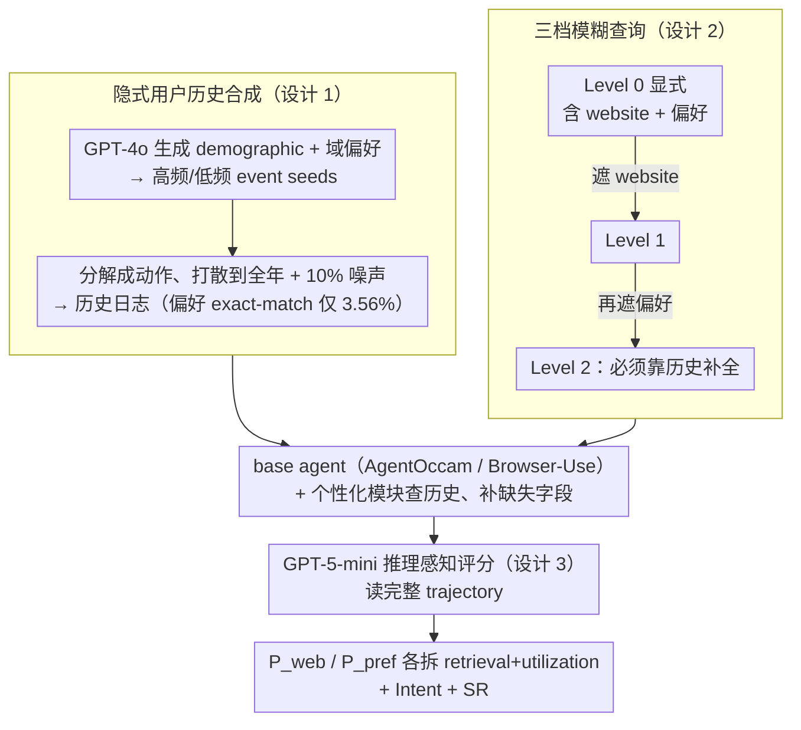

# Persona2Web: Benchmarking Personalized Web Agents for Contextual Reasoning with User History

**会议**: ICML 2026  
**arXiv**: [2602.17003](https://arxiv.org/abs/2602.17003)  
**代码**: 待公布（论文标注 [CODE]）  
**领域**: LLM Agent / Web Agent / 个性化 Benchmark  
**关键词**: 个性化 web agent, 用户历史, 模糊查询, clarify-to-personalize, 推理感知评估

## 一句话总结
本文提出首个针对个性化 web agent 的开放网页 benchmark Persona2Web，用「隐式用户历史 + 三档模糊查询 + 推理感知评分」逼迫 agent 从浏览记录中推断用户偏好来消歧 ambiguous query；在 GPT-4.1 / o3 等 5 个主流模型上，即使提供历史，level-2 query 的成功率也只有 13%，揭示当前 web agent 缺乏真正的个性化能力。

## 研究背景与动机
**领域现状**：LLM 驱动的 web agent（WebArena、Mind2Web、WebVoyager、AssistantBench 等）已能在浏览器里执行多步任务，但所有主流 benchmark 都默认用户会写出完整、显式的 query（"在 zocdoc.com 搜 Southside Jacksonville 附近的女医生"）。

**现有痛点**：真实用户从不把每个细节都说清楚——他们假设系统自然知道"我常用的网站"、"我偏好的医生性别"。当前 agent 面对这种模糊指令时，要么随便填缺失字段、要么直接反问然后放弃，根本无法消歧。已有的个性化 benchmark 又只覆盖对话（Apollonion、LongMemEval）或抽象 function call（PersonalWAB），不接触真实网页交互。

**核心矛盾**：模糊性 (ambiguity) 是个性化的本质前提，但现有 web agent benchmark 完全消灭了模糊性；而个性化 LLM benchmark 又完全脱离了 web 环境。两者交集是空集。

**本文目标**：构造一个能在真实开放网页上评测个性化能力的 benchmark，需要同时具备 (i) 合乎真实分布的用户历史、(ii) 真正需要历史才能解的模糊 query、(iii) 能区分"个性化失败"与"导航失败"的细粒度评估。

**切入角度**：作者把个性化重新定义为 **clarify-to-personalize**——agent 必须靠用户历史去澄清 query 缺失的部分，而不是靠用户把所有约束写在 prompt 里。这样一来，"会不会用 history" 就直接体现在"能不能补齐模糊字段"上，绕开了显式偏好声明带来的"指令跟随当作个性化"假象。

**核心 idea**：用三档 ambiguity 的 query (Level 0/1/2) × 隐式 browsing history × 推理感知评分，把个性化能力解耦为「检索历史 + 利用历史 + 完成导航」三段独立可测的子能力。

## 方法详解

### 整体框架
Persona2Web 把"评测个性化"这件事拆成两条主线：一条是**数据构造**，从用户档案出发，生成事件种子、分解成具体动作、聚合成全年浏览历史，最后从一个显式 query 反向遮蔽出三档模糊 query；另一条是**评估架构**，在 AgentOccam / Browser-Use 两个 base agent 之上挂一个负责查历史、补字段的个性化模块，再用 GPT-5-mini 当 reasoning-aware judge 读完整轨迹打分。最终数据集含 50 个用户、102,568 条历史、150 个 task（每 task 派生 3 个 ambiguity 档），覆盖 21 个子领域、105 个真实网站；agent 端则在 5 个 backbone × 2 个 base 架构 × 3 种 history 访问方案（no-history / on-demand / pre-execution）下做全交叉评测。

### 关键设计

**1. 隐式用户历史：把偏好藏进行为里，逼 agent 归纳而非匹配**

如果用户偏好直接写在 prompt 里，那 agent 只要会跟指令就够了，根本测不出"个性化"。所以本文把每个用户的偏好编码成一份长达一年、跨多领域、共 2000+ 条记录的隐式 browsing log，让 agent 必须从行为模式里把偏好归纳出来。历史由一条四阶段 pipeline 合成：先用 GPT-4o 生成 demographic，并从 21 个 domain 里选 $K$ 个、各附一段 rationale，进而生成域偏好 $\mathrm{Pref}(u)=\{\mathcal{M}(d^{(k)},\pi^{(k)},\rho^{(k)},\mathrm{Dem}(u))\}_{k=1}^K$；再用 demographic + rationale 派生高频 / 低频 event seeds $(\mathcal{E}_u^{\mathrm{HF}},\mathcal{E}_u^{\mathrm{LF}})$；每个 event 进一步分解成动作序列 $(a_{i,1},\ldots,a_{i,L_i})=\mathcal{M}(E_i)$，打散到全年时间轴上，并对约 10% 记录注入取消 / 修改噪声。最终每条历史只保留 timestamp / type / object / website 四个字段，type 限定在 web search / web visit / purchase / booking / review 五类。整套设计的关键控制是：用户的偏好值以 exact string 形式出现在历史里的比例仅 **3.56%**——event seed 给偏好提供可追踪的锚点保证一致性，时间打散加噪声又让它无法被简单聚类规则破解，于是 agent 只能靠跨长程历史的模式整合来推断，而不是字符串匹配。

**2. 三档模糊查询：用"消歧必须靠历史"的梯度对照隔离 ambiguity**

以往 benchmark 默认所有 query 都写得清清楚楚，于是"会跟指令"和"会用历史"被混为一谈。本文的做法是先写一个完全显式的 Level 0 query（同时含 website 和偏好两个约束），再机械地往外遮字段，派生出难度递增的两档：Level 1 遮掉 website 关键词（变成 "in my preferred website"），Level 2 连偏好关键词一起遮掉（"in my usual area that match my preferred provider gender"）。Level 2 才是真正的考核 target——agent 必须从历史里推断出 zocdoc.com 是这个用户的常用网站、用户偏好女医生，才能把这两个空补上。由于三档 query 是从同一个显式 query 遮蔽而来，它们的 ground-truth 完全一致，于是 ambiguity 被干净地隔离成唯一变量：agent 在 Level 0→2 上的性能衰减，直接量化了它对显式 cue 的依赖度。实验里平均 SR 从 Level 0 的 23.8% 一路掉到 Level 2 的 7.8%，正好印证了这条维度确实在拉开能力差距。

**3. 推理感知评估：沿 pipeline 拆 rubric，区分"没找到历史"和"找到了没用对"**

开放 web 上同一目标常有多条合法路径，逐 action 比对会误杀正确轨迹，而只看最终结果又看不见中间推理出在哪。本文让 GPT-5-mini 读完整 trajectory（actions + reasoning traces），把分数拆成 $\mathcal{P}_{\text{web}}$、$\mathcal{P}_{\text{pref}}$、Intent、SR 四个维度，并沿着个性化 pipeline 进一步把每个 $\mathcal{P}_*$ 切成两条 rubric：retrieval accuracy（是否访问了正确的历史条目）和 utilization accuracy（取出来的信息有没有真用进 action 规划）。Intent satisfaction 单独考核任务本身是否完成，且对"计划正确但被网站故障 / 动态内容打断"给部分分；SR 则只有在 PS 和 Intent 都满分时才判成功。这样一份轨迹就能同时回答三个问题：agent 是输在没找到历史、找到了却没用对、还是用对了但浏览器操作翻车。在 meta evaluation 里（50 条新 query 对比人类标注），这套 reasoning-aware 评分在 Preference 指标上拿到 Spearman 0.72 / 准确率 0.88，远高于 action-wise (0.40 / 0.56) 和 outcome-based (0.22 / 0.46)，直接说明读 reasoning trace 对个性化评测是必需的。

### 训练策略
本文是 benchmark + 评测协议，不训练任何模型。Agent 侧用 5 个现成 backbone (o3 / GPT-4.1 / Gemini-2.5-Flash / Qwen3-80B-Instruct / Llama-3.3-70B) 在两个 base 架构 (AgentOccam, Browser-Use) 上推理，并按 on-demand（planner 触发时才查历史）/ pre-execution（开局生成多 query 一次性拉完）两种访问方案 zero-shot 执行。

## 实验关键数据

### 主实验
在 Browser-Use 架构、Level 2 query 下的核心结果：

| Backbone | No-history SR | On-demand $\mathcal{P}_{\text{avg}}$ | On-demand SR | Pre-exec $\mathcal{P}_{\text{avg}}$ | Pre-exec SR |
|----------|--------------|---------------------------------------|--------------|--------------------------------------|-------------|
| o3 | 0.00 | 0.655 | **0.13** | 0.671 | 0.10 |
| GPT-4.1 | 0.00 | **0.767** | **0.13** | 0.727 | **0.13** |
| Gemini-2.5-Flash | 0.00 | 0.597 | 0.02 | 0.659 | 0.03 |
| Qwen3-80B-Inst. | 0.00 | 0.674 | 0.03 | 0.720 | 0.03 |
| Llama-3.3-70B | 0.00 | 0.612 | 0.01 | 0.680 | 0.02 |

无历史时所有模型成功率均为 0%，加入历史后最强配置（GPT-4.1 + Browser-Use）也只到 13%——证明"给 agent 配 history 还远远不够"。

### 消融实验

| 实验 | 对比 | 关键发现 |
|------|------|----------|
| Ambiguity 等级 (Level 0/1/2) | 平均 SR：23.8% → 16.3% → 7.8% | 即使有 history，ambiguity 升高 agent 仍逐档崩盘 |
| 隐式 history vs 显式 profile (Browser-Use + GPT-4.1, On-demand) | $\mathcal{P}_{\text{pref}}$ 从 0.731 → 0.887, SR 从 0.13 → 0.25 | 给显式偏好声明大幅虚高分数 → 反向证明隐式编码确实在考"推断能力" |
| Meta evaluation vs 人类标注 (Preference, Spearman) | 0.72 (ours) vs 0.40 (action-wise) vs 0.22 (outcome) | 必须读 reasoning trace 才能可靠评分 |
| 跨架构 (AgentOccam vs Browser-Use, 同 backbone) | Browser-Use 在所有 backbone 上 $\mathcal{P}$ 都更高 | DOM 全树观察 > AgentOccam 的剪枝 accessibility tree |
| 重复执行 (3 runs, Browser-Use) | 最大 std = 0.025 | 开放 web 上分数稳定，benchmark 可复现 |

### 关键发现
- **task completion 与个性化解耦**：Llama-3.3-70B + Browser-Use pre-exec 拿到 $\mathcal{P}_{\text{avg}}=0.680$ 但 Intent 只有 0.197（个性化对，导航翻车）；Gemini-2.5-Flash + AgentOccam on-demand 拿到 Intent=0.403 但 $\mathcal{P}_{\text{avg}}=0.486$（导航对，个性化翻车）——两者 SR 都是 0.02，但失败原因截然相反，没有 reasoning-aware 评估根本看不见。
- **backbone 与 scheme 有匹配关系**：GPT-4.1 在 on-demand 上明显更强（situational awareness），Qwen3-80B-Instruct / Llama-3.3-70B 反而在 pre-execution 更强（long-horizon planning）——同一 backbone 在不同 scheme 上的能力差异是个未被充分研究的现象。
- **clear query 也会个性化失败**：Level 0 上 $\mathcal{P}_{\text{pref}}$ 平均只有 0.92，远未到 1.0，主要错在 (i) 多约束只用部分（应用了容量和接口但忘了预算 < $120）、(ii) 不知道何时何处填入信息——说明"利用 (utilization)" 而不仅是检索是个独立瓶颈。

## 亮点与洞察
- **"clarify-to-personalize" 是 benchmark 设计的范式级 trick**：与其去定义"什么叫好的个性化"，不如制造一个"不会个性化就一定失败"的环境（模糊 query + 隐式 history + exact-match ratio 仅 3.56%），让能力差异自动浮现。可以迁移到任何需要把"隐式能力"量化的场景——比如 long-context、心智理论、对话记忆。
- **retrieval / utilization 两段 rubric 的拆分** 直接对应到 RAG 社区争论很久的 "retriever 不行 vs generator 不行" 问题，给 web agent 提供了一个可操作的归因框架。这种"沿着 pipeline 拆 rubric"的写法值得借鉴到 tool-use、code agent 评测里。
- **显式 profile vs 隐式 history 的对照**是个非常干净的小实验（Table 7）：同一份信息换一种暴露方式，分数立刻+10~20 个点，反过来证明"benchmark 的难度来自编码方式"——对于做 benchmark 论文这是非常有说服力的设计选择，值得在自己写新 benchmark 时复用。
- **时间漂移测评 (Table 9)**：跨 3 个月重测时 SR 系统性下降 ~10 个点（网站改版/库存变化），这是开放 web benchmark 必须正面回应的脆弱性，作者老老实实报出来，比偷偷固定快照诚实得多。

## 局限与展望
- 用户历史完全由 GPT-4o 合成，虽然过人评但仍可能带有 LLM 自身的偏好分布偏置；与真实匿名 browsing 数据集对齐会更可信。
- 21 个 domain × 105 个网站偏向英语圈日常服务，跨文化 / 跨语言场景的鲁棒性未知。
- 评测全程用 GPT-5-mini 当 judge，存在"judge 与某些 backbone 同源"的潜在偏置（Appendix B 有讨论但篇幅有限）；多 judge 投票或开源 judge 的更系统对比仍有空间。
- 最强 SR 只有 13%，意味着"超过 benchmark 上限"还很远——但论文没有给出基线的个性化训练方案（如 SFT on 历史、preference RAG fine-tune），可作为下一步明显的研究入口。
- 三档 ambiguity 是离散的；ambiguity 是连续维度，是否可以做出连续可调的 ambiguity slider，会让 benchmark 更有诊断力。

## 相关工作与启发
- **vs PersonalWAB (Cai 2024)**：同样做用户历史驱动的个性化，但 PersonalWAB 把交互抽象成 function call，本文真的让 agent 在 105 个真实网站上跑 DOM，导航失败和个性化失败被严格区分，更贴近部署场景。
- **vs WebVoyager / WebCanvas / AssistantBench**：这些是 web agent 的强 benchmark，但 query 全是显式的，等价于本文的 Level 0；本文额外引入 Level 1/2 + 用户历史，把"个性化"维度正交地叠加进来，与它们互补而非替代。
- **vs LongMemEval / Apollonion / PrefEval**：都做 LLM 的 personalization / memory 评测，但全在对话 / 文本生成场景，不接触 web 行动。本文把"从历史推偏好"的能力评测搬到带状态的真实网页环境，是这条 line 的自然延伸。
- **vs Mind2Web 系列**：Mind2Web 提供 cached web pages，本文用 open web；两者各有取舍——cached 可复现但失去 dynamics，open web 真实但需要 Table 8/9 这种重复 / 跨期实验来证明稳定性。

## 评分
- 新颖性: ⭐⭐⭐⭐⭐ 首个开放 web 上的个性化 agent benchmark，clarify-to-personalize 是一个清晰且可迁移的设计原则。
- 实验充分度: ⭐⭐⭐⭐⭐ 5 backbone × 2 架构 × 3 scheme × 3 ambiguity 全交叉，外加 meta-eval、显式/隐式对照、重复执行、时间漂移四组 ablation，对 benchmark 论文已属上乘。
- 写作质量: ⭐⭐⭐⭐ 结构清晰、表格紧凑、动机和评估部分讲得透，但 method 章节符号略密，初读对 retriever / generator 的边界要稍想一下。
- 价值: ⭐⭐⭐⭐⭐ 揭示了"最强模型 SR 只有 13%" 这种黑天鹅级别的差距，会直接推动后续 personalized web agent 训练与 retrieval 方法的研究，benchmark 本身也具备长期可用性。

<!-- RELATED:START -->

## 相关论文

- [\[AAAI 2026\] History-Aware Reasoning for GUI Agents](../../AAAI2026/llm_agent/history-aware_reasoning_for_gui_agents.md)
- [\[ICML 2026\] Scaling, Benchmarking, and Reasoning of Vision-Language Agents for Mobile GUI Navigation](scaling_benchmarking_and_reasoning_of_vision-language_agents_for_mobile_gui_navi.md)
- [\[ICLR 2026\] Web-CogReasoner: Towards Knowledge-Induced Cognitive Reasoning for Web Agents](../../ICLR2026/llm_agent/web-cogreasoner_towards_knowledge-induced_cognitive_reasoning_for_web_agents.md)
- [\[ICML 2026\] Weasel: 通过重要性-多样性数据选择实现 Web Agent 的域外泛化](weasel_out-of-domain_generalization_for_web_agents_via_importance-diversity_data.md)
- [\[ICML 2026\] Process Reward Agents for Steering Knowledge-Intensive Reasoning](process_reward_agents_for_steering_knowledge-intensive_reasoning.md)

<!-- RELATED:END -->
