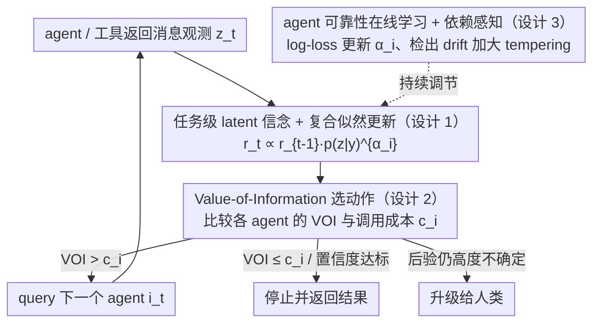

# Position: Agentic AI Orchestration Should Be Bayes-Consistent

**会议**: ICML 2026 (Position Paper)  
**arXiv**: [2605.00742](https://arxiv.org/abs/2605.00742)  
**代码**: 无  
**领域**: Agent / 贝叶斯决策理论 / LLM 编排 / 不确定性量化  
**关键词**: 贝叶斯控制层, 期望效用, value of information, agent 编排, 复合似然

## 一句话总结
这篇 position paper 主张：不要再尝试让 LLM 本身 "Bayesian"（那条路在工程上和理论上都跳不过去），而是把贝叶斯结构搬到 agentic AI 的**编排控制层**——让控制器维护一个低维任务级隐变量的信念，按 Bayes 规则在 agent/工具返回的"消息观测"上更新，并用期望效用或 value-of-information 做路由、停止、升级和预算分配。

## 研究背景与动机
**领域现状**：LLM 已经成为构建现代 AI 应用的核心，但许多高价值部署的瓶颈不是"产生看起来合理的 token"，而是**在不确定性下做决策**：什么时候停？哪个工具调？什么时候问澄清问题？什么时候升级给人？工具调用花钱、慢、有风险，决策本质是 cost-quality-latency 的取舍。Bayesian decision theory（Berger 1985、DeGroot 2004）就是为这类问题设计的：维护隐变量信念、收到证据按 Bayes 更新、按期望效用或 value of information 选动作。

**现有痛点**：把贝叶斯思想塞进 LLM 体系有两条路。(a) **让 LLM 本身贝叶斯**——维护模型参数的后验、做积分。BDL 在 90 年代起努力了几十年（Laplace、mean-field、Hinton 1993 等），但至今没有像二阶优化那样真正改变 LLM 训练 SOTA；过参数化模型的参数后验作为 epistemic uncertainty 表示还被质疑（Kirsch 2025）。即便 LLM 在某些受限场景看起来"in-context 像贝叶斯"，Falck 等 2024 已经用 martingale 检验显示它在一般情形下违反 Bayesian belief update 的标准性质。(b) **prompt-based 启发式**——chain-of-thought、ReAct、各种 workflow，在短任务低风险下确实够用；但随着任务变长、栈变深，证据相关性、成本权衡、升级阈值很难只用固定 workflow 表达。

**核心矛盾**：决策需要 **任务级语义** 的不确定性（"代码会不会通过单元测试"），但 LLM 给的是 **token 级** 的概率——两者尺度根本不同。token 分布可以很 sharp 而任务级却很不确定，反之亦然；并且 LLM 的 in-context update 不一定满足 exchangeability 和 martingale，强行把 token 概率当 belief state 不可靠。

**本文目标**：(1) 把"agentic AI 应该 Bayesian"的口号定位精确——是 **控制层**，不是 LLM 内部；(2) 给出适合现代软件栈和人机协作的实用属性清单；(3) 用三个具体例子（代码生成、多 agent 辩论、路由）和一组 design pattern 证明这个 paradigm 工程上可实施；(4) 提出 benchmarking / 建模 / 部署 / 理论四方面的 call to action。

**切入角度**：作者把"贝叶斯结构"分层 — 训练里、推理里、控制里都可以放。本文聚焦控制层：LLM 当 black-box predictor，但**编排**它们的逻辑层有一个显式 belief state，按观测模型更新，按期望效用选动作。这跳过了"参数后验"，把贝叶斯放在它最擅长的地方——**显式、低维、有可测量结果的决策变量**。

**核心 idea**：Bayesian agentic system 由控制层定义——维护任务级隐变量 $Y$（如代码是否通过测试 / 哪个根因假设 / 哪个工具更可靠）的后验，把 LLM 输出当噪声似然，按 $r_t(y)\propto r_{t-1}(y)\,p_{i_t}(z_t\mid y)^{\alpha_{i_t}}$ 做 tempered/复合似然更新，按 expected utility 或 value-of-information 决定下一步路由/停止/升级。

## 方法详解

### 整体框架
这篇 position paper 主张的不是某个新算法，而是一个 **编排控制层的架构模板**：让 LLM 当 black-box predictor，但在它们之上的编排器维护一个显式的、定义在低维任务级隐变量上的后验信念 $r_t(\cdot)=p(\cdot\mid\mathcal{D}_{1:t})$，每收到一个 agent/工具返回的"消息观测"就按 Bayes 规则更新，再用期望效用或 value-of-information 决定路由、停止、升级和预算分配。论证主线是：先指出贝叶斯结构可以放在训练里、推理里或控制里，本文聚焦控制层；再用任务级 latent、复合似然更新、VOI 决策、在线可靠性学习四块拼出一个工程上可实施、又保留概率解释的编排器。

### 关键设计

**1. 任务级 latent 信念 + 复合似然 Bayes 更新：把不确定性放在编排真正关心的低维变量上**

决策需要的是任务级语义的不确定性（"这段代码会不会通过单元测试"），而 LLM 给的是 token 级或参数级的概率，两者尺度根本对不上，所以第一步是把信念从 LLM 内部搬出来、安置在一个低维决策变量上。以代码生成为例，令 $Y\in\{0,1\}$ 表示候选代码是否通过全部单元测试，orchestrator 维护后验 $r_t(y)=p(Y=y\mid\mathcal{D}_{1:t})$，其中 $\mathcal{D}_{1:t}=\{(i_s,Z_s):s\le t\}$ 是已 query 过的 agent 序列和它们返回的消息序列。每来一个新观测就按

$$r_t(y)\propto r_{t-1}(y)\,p_{i_t}(z_t\mid y)^{\alpha_{i_t}}$$

更新；若用判别式预测 $q_i(y\mid z)$，等价写成 $r_t(y)=r_{t-1}(y)\,\ell_{i_t}(y;z_t)^{\alpha_{i_t}}/Z$，其中 likelihood ratio $\ell_i(y;z)=q_i(y\mid z)/p_0(y)$。关键在指数 $\alpha_i$：它是 tempering 指数（generalized Bayes / power-posterior，Bissiri 2016）。朴素 Bayes 默认条件独立，但同源 LLM agent 共享 prompt、底模、检索 pipeline，输出明显相关，直接连乘 likelihood 会让 belief 过度自信；tempering 把这种相关性吸收进 likelihood 的强度里，比强行精确建模 joint 容易实现也更鲁棒，等于把"该多信赖每个 agent 的话"从启发式升格成一个可学的参数。

**2. Value-of-Information 驱动的动作选择：用一个 decision-theoretic 目标统一 routing / stopping / escalation**

有了后验之后，下一步该 query 哪个 agent、还是干脆停下来返回结果或升级给人，全部交给同一个准则。每个 agent $i$ 有已知调用成本 $c_i>0$，从 Bayesian decision-theoretic 视角，动作选成最大化后验期望效用：

$$a_t^\star=\arg\max_a\sum_h u(a,h)\,r_t(h),$$

并且仅当某次 agent 调用的 expected value of information 超过其成本 $c_i$ 才真正发出调用——VOI 严格定义为"调用前后效用差的期望"，实时计算可用 one-step lookahead 或 amortized surrogate 近似。这一招是冲着固定 workflow 的短板来的：像"调 3 个 agent 然后 ensemble"这种写死的流程在 short-horizon/low-stakes 还够用，可一旦任务变长、成本高度不对称（一个 safety 检查和一个 unit-test runner 的价钱差很多），固定流程就无法自适应。VOI 把"何时值得多花钱多调一次"显式量化进编排决策，在 incident diagnosis、多 agent debate 这类场景里可以直接表达成"当前最大后验置信度低于阈值就再 query 一个 agent"。

**3. Agent reliability 在线学习 + 依赖感知证据池：让 belief 收敛得保守，并能持续自校准**

编排里有两类 corruption 要处理——agent 自身能力随分布漂移、以及消息之间的相关性——这一块把两者一并管起来。对前者，定义累计 log-loss $L_i=\sum_{s:i_s=i}-\log q_i(y_s\mid z_s)$，按 exponential weights $w_i\propto\exp(-\beta L_i)$ 在线更新，归一化后映成 tempering 系数 $\alpha_i=\alpha_\text{max}\tilde w_i$（Cesa-Bianchi & Lugosi 2006），表现差的 agent 影响自动被压低。对后者（尤其"同一 agent 反复查询"带来的相关性），要么把交互历史并进观测模型的条件，要么扩充 latent state、引入 agent-specific 的 shared-error 变量；一旦 rolling calibration diagnostics 检出 drift，就自动加大 tempering 或触发 abstention/escalation。这两条合起来让 belief 不会因为几条相关消息就过度自信。值得强调的是，这里训练的不是 LLM 而是 **编排器自身的元学习**：$q_i(y\mid z)$ 从带 outcome 标签的历史交互日志学得，$\alpha_i$ 在线更新，再用 held-out 任务做 calibration 校验（empirical coverage、proper scoring rules），检测到 drift 就 retemper。设计原则要求观测模型能从 measurable outcomes（pass/fail、human ratings、task completion）持续 recalibrate，这与 RLHF / online learning 的工程惯例完全兼容，也顺带定义出可验证的工程接口（confidence thresholds、cost scales），让生产系统能把简单旋钮暴露给用户。

## 实验关键数据

> 注：position paper 不做大规模 empirical benchmark，但通过三个具体示例展示设计可行性，并把"agentic 系统应有的 Bayesian 性质"提炼成 7 条可操作属性（详见 Section 2）。

### 主实验
三个示例与对应的 latent variable 设计：

| 示例 (Section) | 编排场景 | 隐变量 $Y$/$H$ | 观测 $Z$ | 决策 |
|----------------|---------|----------------|---------|------|
| 4.1 多 agent 代码生成 | code generator + retrieval + safety checker + unit-test runner | $Y\in\{0,1\}$：能否通过全部单元测试 | 候选代码 / 引用 / 警告 | 何时停下返回、调谁 |
| 4.2 多 agent 辩论 | 多 LLM 专家辩论一个科学/政策问题（如根因诊断） | $H\in\{h_1,\dots,h_k\}$：哪个假设/根因 | 各 agent 的论证消息 | 何时停止、升级给人 |
| C 路由 (附录) | 在 agent 池里按任务路由 | 跨任务 competence 参数 | agent 历史表现 | 选最合适的 agent |

### 消融实验（思想实验型）

| 配置 | 含义 | 论文论证 |
|------|------|----------|
| 把 belief 放参数空间（"贝叶斯 LLM"） | 让 LLM 内部 Bayesian | Falck 2024 证明 in-context update 不是真 Bayesian；过参数化下参数后验对 epistemic uncertainty 表达力差；工程代价巨大 |
| 把 belief 放 token 概率 | 用 next-token 分布当 belief state | Kuhn 2023 / Aichberger 2025：syntactic uncertainty ≠ semantic；token 分布 sharp 不代表任务级有把握 |
| 仅 prompt-based heuristic | ReAct / Reflexion 等 | short-horizon 够用；long-horizon、tool ecosystem 大、cost 不对称时 fixed workflow 难以表达 routing/stopping |
| Robust control / Bandits（不用显式后验） | UCB、worst-case | 适合纯 reward-driven，但不能自然表达 VOI、abstention、cost-aware escalation |
| 任务级 latent + VOI + 复合似然（本文） | Bayes-consistent 控制层 | 显式接口、可工程化、依赖处理有原则、与人机协作兼容 |

### 关键发现
- **不确定性尺度错配是关键**：token 不确定性 ≠ 任务不确定性 ≠ 参数不确定性；agentic 决策需要任务级 latent，把它从 LLM 内部分离出来比让 LLM 内部贝叶斯更可行。
- **复合似然 + tempering 解决相关性**：同源 agent 输出相关是不可避免的，简单乘 likelihood 会过度自信；用 power-posterior 把 $\alpha_i$ 学出来，让"不可靠/相关"的 agent 自动被压制。
- **value-of-information 是显式的"何时该多花钱"准则**：把启发式 workflow 换成 VOI 让 routing/stopping/escalation 全部统一在一个 decision-theoretic 目标下。
- **七条性质让工程化可行**：(1) 控制层易接入；(2) 与现有 typed agent schema 兼容；(3) 暴露 confidence threshold 等简单旋钮；(4) 支持 abstention / escalation；(5) 维护可管理的 context window；(6) 把人类反馈作为同款 probabilistic observation；(7) 支持 logging belief 与 decisions（参见 Section 2）。

## 亮点与洞察
- **"哪一层放贝叶斯"是关键问题**：本文最重要的贡献是把模糊的"agentic AI 应该贝叶斯"切成精确的命题——不是参数空间，不是 token 空间，而是 task-level latent + control policy。这让 BDL 多年累积的工具（复合似然、generalized Bayes、VOI、Bayesian bandit）在 agent 时代找到了真正合适的位置。
- **复合似然 + tempering 是优雅的"工程妥协"**：完全建模 LLM 间相关性几乎不可能；用 $\alpha_i$ 当 single-knob 替代品，既保留概率解释又承认现实噪声，比朴素乘法和完全独立都更鲁棒。
- **value-of-information 给 long-horizon agent 一个原则化的"何时停"**：实践中 agent 经常 over-call 工具（成本高）或者 under-call（精度不够），VOI 把"调一次值不值"显式量化，工程上比手调阈值优雅。
- **跨子社区的桥梁**：把 PAC-Bayes、generalized Bayes、Bayesian bandit、Bayesian filtering 这些原本散落的工具串成一个 agentic 编排 narrative，对 BDL 社区是一次 reframing。
- **可迁移设计 pattern**：(a) 任何"用多个不可靠预测器做联合决策"的系统（医疗多专家会诊、自动驾驶感知融合、量化投研多策略加权）都可以套这套 belief + likelihood + VOI 模板；(b) 把人类反馈也当 noisy probabilistic observation 与 agent 消息同一通道处理，是统一 RLHF/HCI 接口的好思路。

## 局限与展望
- **观测模型可能 misspecified**：$q_i(y\mid z)$ 是从历史日志学的，分布漂移下校准会失效；论文承认必须持续监控 rolling calibration、stronger tempering、降级到 abstention。
- **高维 agent 消息的 likelihood 是开放问题**：text-level $Z$ 怎么映成 latent $y$ 的 likelihood？现实中只能用 embedding-based discriminative 模型近似，与"严格 Bayesian"还有距离。
- **VOI 在组合编排下计算昂贵**：multi-step VOI 在树状/图状 agent 调用图上指数爆炸；论文建议 amortized controller 或一步近似，但精确解仍是开放问题。
- **依赖 measurable outcomes**：很多 agentic 任务的成功不可二值化（创意写作、政策建议），belief state 怎么定义、observation model 怎么学都需要更精细的领域工程。
- **没有大规模实证**：作为 position paper 没给 benchmark，作者主要呼吁建立 outcome-based / cost-aware / dependence-aware 的标准化评测平台。
- **大规模工业系统的延迟约束**：VOI 计算可能给每个 routing decision 加上几百毫秒，工业系统能否容忍仍待验证。

## 相关工作与启发
- **vs Bayesian Deep Learning 主流（Mackay 1992、Blundell 2015、Gal & Ghahramani 2016 等）**：BDL 把贝叶斯放参数空间，本文明确说这条路对 LLM 工程上和理论上都不通；提议改放控制层。
- **vs Falck 2024 / Chlon 2025 / Atwell 2026 "LLM 是不是贝叶斯"研究**：这些研究证明 LLM in-context 行为偏离 martingale；本文把这些结果当**论据**说明"别指望 LLM 内部 Bayesian"，因此控制层贝叶斯更现实。
- **vs ReAct / Reflexion / chain-of-thought**：这些是 prompt heuristic 编排，本文承认其在短任务有效，但论证 long-horizon、tool ecosystem 大时需要原则化的 Bayesian 控制。
- **vs Bayesian bandit / robust control**：这些可以不维护显式 belief 而做决策；本文论证当 abstention、escalation、value-of-information 重要时，显式 belief state 是更自然的接口。
- **vs Bengio 2025 "Bayesian Oracle"**：Bengio 等也提议用 Bayesian oracle 阻止 agent harm，与本文 vision 同向；本文进一步给出 control-layer 的 design pattern。
- **启发**：(1) 想把 LLM agent 工程化、长期化的团队，可以从"在 orchestrator 里加 belief logging + VOI based routing"开始落地；(2) BDL 研究者可以把工具搬到这个新 niche，比死磕"参数级 Bayesian LLM"现实得多；(3) 评估社区应该把 outcome calibration / cost-aware metric 写进 agent benchmark 标准。

## 评分
- 新颖性: ⭐⭐⭐⭐ 不是新算法，但**精准 reframing**了"agentic AI 应该 Bayesian"——把模糊主张切成"控制层 + 任务级 latent + VOI + 复合似然"四件具体设计原则。
- 实验充分度: ⭐⭐⭐ 作为 position paper 不做 benchmark；三个具体示例 + 设计模板足够说明可行性，但缺少端到端实证；这是 position paper 的天然限制。
- 写作质量: ⭐⭐⭐⭐⭐ 论证结构清晰：先定位"哪一层贝叶斯"，再说为什么 LLM 内部不行，再给设计模板，再列七条可操作属性，再呼吁四个方向；引用扎实（横跨 BDL、决策论、agent、bandit）。
- 价值: ⭐⭐⭐⭐ 对 BDL 社区和 agent 社区都是一次重要的边界划定——BDL 多年没找到能用进 LLM 的杀手锏，本文把它的应用面挪到了控制层这个真正合适的位置，未来几年大概率会有一批工作沿这条路走。

<!-- RELATED:START -->

## 相关论文

- [\[ICML 2026\] Position: Assistive Agents Need Accessibility Alignment](position_assistive_agents_need_accessibility_alignment.md)
- [\[ACL 2026\] How Adversarial Environments Mislead Agentic AI](../../ACL2026/llm_agent/how_adversarial_environments_mislead_agentic_ai.md)
- [\[NeurIPS 2025\] Orchestration Framework for Financial Agents: From Algorithmic Trading to Agentic Trading](../../NeurIPS2025/llm_agent/orchestration_framework_for_financial_agents_from_algorithmic_trading_to_agentic.md)
- [\[ICML 2026\] NaviAgent: Graph-Driven Bilevel Planning for Scalable Tool Orchestration](naviagent_graph-driven_bilevel_planning_for_scalable_tool_orchestration.md)
- [\[ICLR 2026\] SR-Scientist: Scientific Equation Discovery With Agentic AI](../../ICLR2026/llm_agent/sr-scientist_scientific_equation_discovery_with_agentic_ai.md)

<!-- RELATED:END -->
