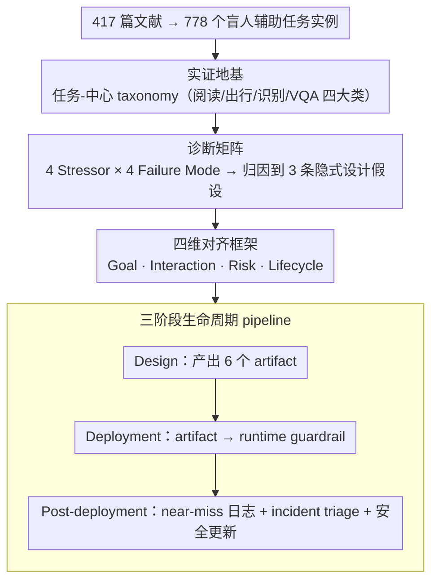

# Position: Assistive Agents Need Accessibility Alignment

**会议**: ICML 2026  
**arXiv**: [2605.13579](https://arxiv.org/abs/2605.13579)  
**代码**: 无  
**领域**: Agent / 无障碍 AI / 人本对齐  
**关键词**: 盲人辅助、accessibility alignment、agentic AI、风险校准、生命周期设计

## 一句话总结
这是一篇 position paper，作者通过对 417 篇文献中 778 个盲人辅助任务实例做系统综述，论证 "accessibility alignment" 应当被视为与 helpful/harmless/honest 并列的 Agent 一级对齐目标，并提出覆盖目标-交互-风险-生命周期四维度的设计 pipeline。

## 研究背景与动机
**领域现状**：当前 agentic AI 在多步推理、工具调用、自主决策上发展迅速，研究者也开始把它们用到盲人导航、街景理解、UI 操作等无障碍场景，希望用通用 Agent 替代传统的白手杖 / 屏幕阅读器。

**现有痛点**：作者列出大量证据表明，即便是 GPT-4o、ChatGPT 实时视频聊天、StreetReaderAI 这种 SOTA Agent，在动态街景、模糊药品标签、过马路等场景里仍会输出 "自信但错误" 的指令；而由于盲人用户无法独立验证视觉输出，错误一旦发生往往无法被检测，甚至直接造成人身伤害。

**核心矛盾**：根本原因是当前 Agent 的设计、训练、评测全部隐式假设了三件事——用户能用视觉快速核对输出、错误是低成本可迭代纠正的、用户和 Agent 共享同一视觉上下文。这三条假设在 BVI（Blind and Visually Impaired）人群上全部失效，于是产生了 silent failure、overconfident hallucination、miscalibrated autonomy、cognitive overload 四类系统性失败。

**本文目标**：(1) 用大规模实例数据刻画盲人辅助任务的真实分布；(2) 论证无障碍不是 UI 补丁能解决的问题，而是 Agent 的 alignment 问题；(3) 给出一套可落地的设计 pipeline。

**切入角度**：作者把自己定位为 "position paper"，先用 778 个真实任务做统计画像，再用 "stressor → failure mode → 设计假设违背" 的因果链做诊断，最后提出 alignment 框架——这是典型的从经验数据出发反推理论框架的做法。

**核心 idea**：把 accessibility 从 HCI 接口层提升到 Agent 内核层，作为与 helpfulness / harmlessness 并列的第三类对齐目标，并通过 "goal / interaction / risk / lifecycle" 四维度框架落地。

## 方法详解
这篇 position paper 没有算法，它的"方法"是一条从实证数据出发、反推到对齐框架的论证链。

### 整体框架
作者的核心主张是：盲人辅助 Agent 反复犯的安全错误，根子不在多模态能力不够，而在于当前 Agent 把"用户能用眼睛核对输出"当成了隐式前提，所以 accessibility 应当被提升到 alignment 层、与 helpful/harmless/honest 并列。论证分四步推进——先用 778 个真实任务实例建立任务-中心的 taxonomy 当地基，再从 BVI 场景的环境约束推出 4 类系统性失败模式，接着把这些失败归因到 3 条站不住的设计假设，最后给出一套四维对齐框架配三阶段生命周期 pipeline 作为补救方案。

### 关键设计

**1. 用 778 个任务实例做实证地基，堵死"accessibility 是边缘问题"的反驳**

position paper 最大的软肋是"凭感觉立场"，所以作者第一步不是讲道理而是摆数据：从 2012–2025 年横跨 CV / GenAI / Robotics / HCI 的 417 篇论文里抠出 task description，做 qualitative coding，得到 778 个细粒度任务实例及其频次分布。最终归成四个大类——Reading & Text Access（35%）、Mobility & Safety（34%）、Object Recognition & Daily Operations（12%）、VQA Goal-directed Query（18%），每个子类都带实例数（如 hazard perception 108、path planning 116、interactive digital reading 100）。这组统计画像证明盲人辅助任务体量大、覆盖广，而且明显集中在 mobility 和 reading 这两类"错就出事"的高风险方向，后续所有论证都锚在这块实证地基上，不再是纯思辨。

**2. 4 Stressor × 4 Failure Mode 的诊断矩阵，把无障碍失败变成可逆向工程的问题**

作者先抽出 BVI 场景区别于普通用户的四个环境特性（stressor）：limited verifiability（用户无法独立核对视觉输出）、high-cost errors（错误不可逆甚至造成人身伤害）、cognitive burden（音频/触觉通道带宽窄）、privacy exposure（家居/医疗场景高度敏感）。再从这些约束推出四类系统性失败模式：silent failure、overconfident hallucination、miscalibrated autonomy、interaction-induced cognitive overload。关键在于每个 failure mode 都被钉在一个具体的 stressor 组合上——例如 silent failure 由 limited verifiability + asymmetric cost 共同驱动——形成"环境约束 → 失败现象 → 设计责任"的因果链。这样一来，"无障碍做得差"就从 anecdotal 抱怨变成了可被反向工程的工程问题：只要 Agent 设计能 close 掉对应的 stressor，那类 failure mode 原则上就能被消除。作者还指出这四类失败会互相加强（silent failure 和 hallucination 逼用户脑内验证每条输出、加重认知负担，miscalibrated autonomy 又在高风险时阻塞验证、低风险时浪费带宽），所以必须用统一框架联合处理，不能各自打补丁。

**3. 四维 Accessibility Alignment 框架 + 三阶段 Lifecycle Pipeline，让 framing 可审计、可反驳**

针对上面诊断出的失败，作者把 alignment 拆成四个维度并各配具体 artifact：Goal（用 accessibility 重新定义"成功"，含 safety margin / critical-field reliability / recovery procedure，落到 Accessibility Success Specification）、Interaction（chunked / landmark-based 的低带宽非视觉协议，落到 Interaction Contract）、Risk（不确定性触发保守动作、隐私 by default，落到 Risk and Uncertainty Policy、Privacy Manifest、Autonomy Calibration Specification）、Lifecycle（日志 / 反馈 / 安全更新）。这四维由 Design / Deployment / Post-deployment 三阶段串起来：Design 阶段产出 6 个 artifact；Deployment 阶段把 artifact 翻译成 runtime guardrail（risk-triggered autonomy downgrade、safe pause、escalation）；Post-deployment 阶段做 near-miss 日志、把 incident triage 归到具体 alignment 维度、再做带回归测试的安全更新。配套地，作者主张评测指标也要随之迁移——从 SPL / 路径长度 / OCR accuracy 这类 task-completion 指标，转向 unsafe instruction rate、risk-trigger compliance、abstention precision/recall、critical-field accuracy、critical hallucination rate 这类 safety-aware 指标。整套框架刻意把每个抽象维度都绑死到具体 artifact 和 runtime 行为上，正是为了回应 position paper "只立 flag 不给方案"的天然质疑，让主张能被审计、也能被反驳。

## 实验关键数据
这篇论文没有定量实验，所谓 "实验" 是 778 个任务实例的统计描述和两个 case study 的 qualitative 演示。

### 主实验
778 任务实例的分布表：

| 大类 | 实例数 | 占比 | 代表子任务（实例数） |
|------|------|------|--------|
| Reading & Text Access | 约 293 | 35% | General Document Reading (95) / Interactive Digital Reading (100) / Non-linear Visual Doc (98) |
| Mobility & Safety | 约 253 | 34% | Hazard Perception (108) / Path Planning & Navigation (116) / Localization & Relocation (29) |
| VQA Goal-directed Query | 约 141 | 18% | Situational Understanding (96) / Goal-directed Object Queries (45) |
| Object Recognition & Daily Operations | 约 91 | 12% | Object Understanding (56) / Object-Centered Interaction (35) |

### 消融实验
用两个 case 对比未对齐 baseline 和 accessibility-aligned 设计在四个 operational 维度上的差异：

| Case | Red-line failure | Uncertainty trigger | 评测指标迁移 | Runtime 行为 |
|------|------|------|------|------|
| 导航辅助 | 在定位漂移 / 路口几何不可靠时仍给出果断过马路指令 | 定位漂移 / 遮挡 / 地图证据模糊 / 动态障碍 | SPL、路径长度 → 不安全指令率、risk-trigger 合规率、recovery 成功率、置信度校准 | 保守路径选择、autonomy 降级、landmark 指令、safe pause、人类升级 |
| 药品标签阅读 | 从模糊 / 部分证据自信报告剂量 / 禁忌 / 相互作用 | 模糊 / 遮挡 / 弯折包装 / OCR-VLM 候选冲突 / 数值字段低置信 | OCR accuracy、CER / WER、answer accuracy → critical-field accuracy、critical hallucination rate、abstention precision/recall、recapture success | 字段级置信度、ambiguity detection、结构化输出、recapture policy、关键字段 verify、abstention、升级到药师 |

### 关键发现
- Reading 和 Mobility 合计占 69%，且都是 "错就出事" 的高风险任务，说明无障碍 Agent 的研发重点必须放在 verification 缺失下的安全保证上，而不是泛泛的多模态能力。
- 同一组 stressor 在不同 case 里会触发不同的 runtime 行为，但 "uncertainty 必须在决策点而非上游被表达" 是普适原则——这是作者从两个 case 抽出的核心工程教训。
- silent failure 和 hallucination 会反过来加重 cognitive burden（用户被迫在脑中验证每条输出），miscalibrated autonomy 又会在高风险时阻塞验证 / 低风险时浪费带宽，四种 failure mode 互相加强，所以必须用统一框架 jointly 处理，不能各自打补丁。

## 亮点与洞察
- 把 "accessibility 是 alignment" 这个 framing 立稳了：通过强调 BVI 用户无法验证、错误不可逆，作者把无障碍直接挂到 RLHF 时代主流的 helpful/harmless/honest 三元组上，使学界更容易接受为一级目标，而不是 UI 工程问题。
- 778 个实例做 anchor 这个动作很关键。Position paper 最大的天敌就是 "凭感觉立场"，而这种 "先做大规模文献编码、再做框架" 的写法明显更难被驳倒，可以迁移到任何想立 framing 的 survey-style 论文。
- Stressor → failure mode → assumption 的三层因果分解是可复用 trick：先用 "环境给的客观约束" 解释 "系统的可观察 bug"，再把 bug 归因到设计假设违背，这种写法既有解释力又能直接导出补救措施。
- 在 lifecycle pipeline 里坚持 "conservative by default + escalation pathway 是必须 enforced 的 runtime 属性，而不是 nice-to-have"，这一观点在 LLM safety 之外也适用，比如医疗、金融 Agent。

## 局限与展望
- Taxonomy 来自论文而非真实 deployment，可能低估了非学术场景下的需求分布，比如真实 BVI 用户更看重的可能是社交、就业等论文里很少触及的场景。
- 框架停留在 design specification 层，没有给出可直接落地的 architecture 或 system，未来需要 longitudinal 部署 + 量化的 trust / uncertainty calibration 指标来验证。
- "Goal / Interaction / Risk / Lifecycle" 四维之间的耦合还相对感性，缺乏形式化的相容性证明，例如如何形式化 verify 一个 Agent 满足某个 Accessibility Success Specification。
- 主要面向 BVI 群体，对听障、肢体障碍、认知障碍等其他 disability 是否能直接套用同一框架，作者并未讨论。

## 相关工作与启发
- **vs HCI accessibility 路线（Lazar 等）**：HCI 路线把无障碍当 UI/screen reader 问题；本文论证 Agent 是主动决策实体，错误根源在 policy/goal 而不在 interface，必须从架构层对齐。
- **vs 通用 Agent scaling 路线（Ferrag、Acharya 等）**：scaling 路线相信能力上去后无障碍自然解决；本文用 ChatGPT-4o、StreetReaderAI 的实证表明 scale 不能消除 silent failure，反而 confidence 上升后伤害更大。
- **vs RLHF 三元组对齐**：HHH 框架默认用户是 sighted 且能纠错；本文为对齐范式追加 verifiability、risk asymmetry、interaction bandwidth 三个新维度，是 alignment 研究面向 underrepresented user 的自然延伸。

## 评分
- 新颖性: ⭐⭐⭐⭐ 把 accessibility 重塑为 alignment 问题在 Agent 文献里属于较早的系统化呼吁，但 framing 本身在 HCI 内部已有源头。
- 实验充分度: ⭐⭐⭐ 778 实例的统计画像扎实，但缺少真实部署或量化用户研究。
- 写作质量: ⭐⭐⭐⭐⭐ 结构清晰，stressor→failure→assumption→framework→pipeline 的因果链极强，case study 把抽象原则落到具体设计。
- 价值: ⭐⭐⭐⭐ 对正在做 Agent 安全、医疗、辅助场景的研究者有直接的设计指导价值，框架可被借用。

<!-- RELATED:START -->

## 相关论文

- [\[ICML 2026\] Position: Agentic AI Orchestration Should Be Bayes-Consistent](position_agentic_ai_orchestration_should_be_bayes-consistent.md)
- [\[ACL 2026\] Taming Actor-Observer Asymmetry in Agents via Dialectical Alignment](../../ACL2026/llm_agent/taming_actor-observer_asymmetry_in_agents_via_dialectical_alignment.md)
- [\[ACL 2025\] Multiple LLM Agents Debate for Equitable Cultural Alignment](../../ACL2025/llm_agent/multiple_llm_agents_debate_for_equitable.md)
- [\[AAAI 2026\] MoralReason: Generalizable Moral Decision Alignment For LLM Agents Using Reasoning-Level Reinforcement Learning](../../AAAI2026/llm_agent/moralreason_generalizable_moral_decision_alignment_for_llm_agents_using_reasonin.md)
- [\[CVPR 2025\] ATA: Adaptive Transformation Agent for Text-Guided Subject-Position Variable Background Generation](../../CVPR2025/llm_agent/ata_adaptive_transformation_agent_for_text-guided_subject-position_variable_back.md)

<!-- RELATED:END -->
