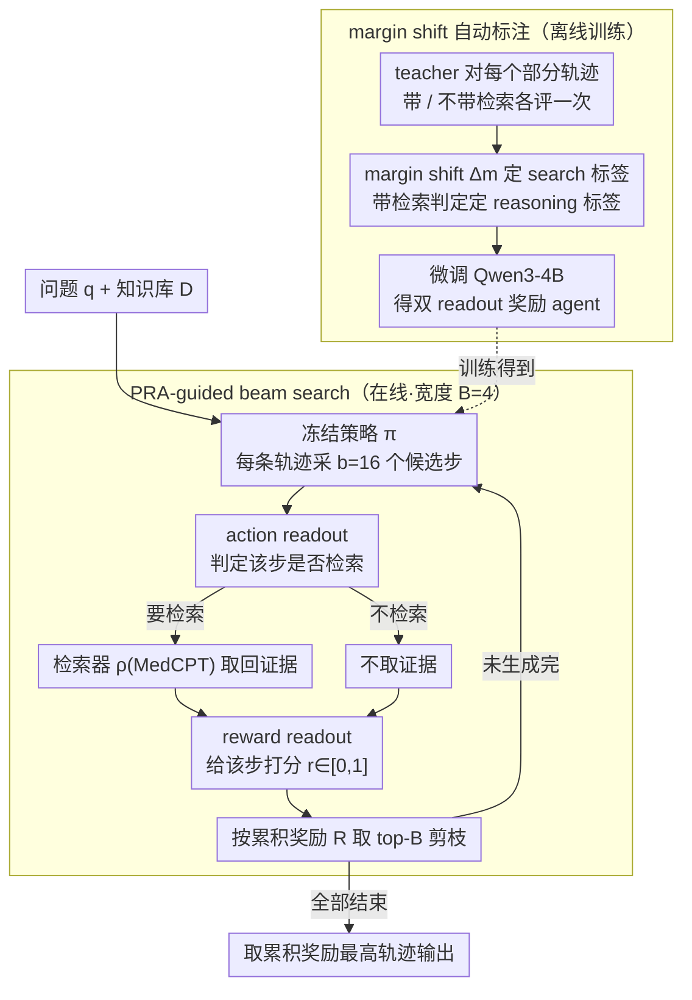

# Process Reward Agents for Steering Knowledge-Intensive Reasoning

**会议**: ICML 2026  
**arXiv**: [2604.09482](https://arxiv.org/abs/2604.09482)  
**代码**: https://process-reward-agents.github.io/ (有)  
**领域**: LLM Agent / 过程奖励 / 医学推理  
**关键词**: Process Reward Model, Beam Search, 检索增强, 医学推理, 冻结策略

## 一句话总结
把过程奖励模型从"事后打分"重构成一个**在线 agent**：在每个推理步实时决定是否检索证据并给出奖励，借助 beam search 对冻结策略的候选轨迹进行剪枝，使 Qwen3-4B 在 MedQA 上达到 81.9% 的 4B-scale SOTA，且能直接迁移到 0.5B–8B 各种未见骨干（最高带来 25.7% 提升）。

## 研究背景与动机

**领域现状**：数学和代码这类任务里，每个推理步都能用形式化规则或编译器机械地验证；但在医学这类知识密集型领域，要判断一步是否正确，往往得跨多份指南、文献、临床规范综合证据，没有局部可验证的"axiom"。现有做法主要有两条线：(1) 把检索到的文档塞进 policy 上下文（RAG）；(2) 训练过程奖励模型（PRM）对完整推理轨迹做事后打分（如 Med-PRM、Med-S3）。

**现有痛点**：事后打分意味着错误已经一路传播到底，再纠正就晚了；它也不能在生成过程中做分支、剪枝或重排，限制了 inference-time scaling 的空间。把文档全塞进 policy 上下文则会让上下文膨胀，且不保证模型会在"正确的时机"看"正确的证据"。另一头，PRM 的 off-policy 泛化能力差——换个骨干模型，分布偏移就让奖励信号失真。

**核心矛盾**：奖励信号需要"在线、步级、有外部证据支撑"才能真正介入生成；而现有 PRM 要么离线、要么只能事后用，且与策略强耦合。

**本文目标**：把"什么时候检索 + 这一步对不对"的判断从 policy 中剥离出来，做成一个独立的、可在线介入 beam search 的奖励模块，同时保持策略冻结、可热替换。

**切入角度**：奖励模型不必是一个被动打分器，可以是一个 **agent**——在每一步主动选择"检索"或"直接打分"两个动作，再给当前步打一个 0-1 的奖励。这样既能把外部知识动态接入推理过程，又能解耦 policy 和奖励，使两者独立演化。

**核心 idea**：用一个共享参数的轻量级 agent（同模型两个 token 级 readout）同时输出 **action（要不要 search）** 和 **reward（这一步对不对）**，把它的累积奖励作为 beam search 的剪枝信号，把过程奖励从事后打分变成在线控制。

## 方法详解

### 整体框架
PRA 要解决的是医学这类知识密集型任务里"没有局部可验证 axiom、又不能事后才纠错"的难题，做法是把奖励从被动打分器升级成一个在线介入生成的 agent。系统有三个组件协同：冻结的推理策略 $\pi$、过程奖励 agent $\mu_\phi$（一个 Qwen3-4B）、稠密检索器 $\rho$（MedCPT）。给定问题 $q$ 和知识库 $\mathcal{D}$，beam search 维护宽度为 $B$ 的部分轨迹集合 $\{\tau_t^{(j)}\}_{j=1}^B$；每一步先由 $\pi$ 对每条轨迹采样 $b$ 个候选下一步（共 $B\times b$ 个新轨迹），再由 $\mu_\phi$ 的 action readout 判断每条要不要检索——要就调 $\rho$ 取回 $D_t$，不要就置 $D_t=\varnothing$——然后 reward readout 在 $(q,\tau_t,D_t)$ 条件下给该步打分 $\hat r_t\in[0,1]$，按累积奖励 $R(\tau_t^{(j)})=\sum_{i=1}^t\hat r_i^{(j)}$ 取 top-$B$ 保留、其余剪掉；全部轨迹生成结束后取累积奖励最高的一条作为答案。整个流程里 policy 看到的输入和原始 CoT 完全一样，检索和打分都外化在 reward agent 上。

### 关键设计

**1. 双 readout：让奖励 agent 同时输出"要不要检索"和"这一步对不对"**

以往 PRM 只吐一个 reward，被动接受外部塞进来的检索结果，无法自己决定"该不该看证据"。PRA 把这个决定内化为 agent 的 action：在输出序列里固定两个槽位 $\ell^{(1)},\ell^{(2)}$，各自对 token "0" 和 "1" 的 logit 做 two-way softmax——奖励 $\hat r_t=\text{softmax}(\ell^{(1)})_{[1]}$ 直接当作"当前步正确"的概率，动作 $\hat a_t\sim\text{softmax}(\ell^{(2)})$ 决定是否触发检索。两个 readout 共享同一个 Qwen3-4B 主干，只额外占两个 token 就完成了 agent 控制加步级打分，几乎不增推理开销。这一改动让奖励模块能按当前推理状态自适应地索取外部证据，等于给 inference-time scaling 新开了一条轴：除了 scale 采样数，每步还能可选地花检索预算换更强的奖励信号。

**2. 用 teacher 的 margin shift 自动生成 reasoning + search 双标签**

PRA 需要两套步级监督——"这一步对不对"（reasoning label）和"这一步要不要检索"（search label），但人工标 step-level 太贵，MC rollout 噪声大（错误中间步也可能蒙对答案），不接证据的 LLM-as-judge 在医学场景又容易判错。本文用 Qwen3-235B-Instruct 当 teacher，对每个部分轨迹做两次评估——一次带检索文档、一次不带——各取 token 0/1 的 log-prob，得到 margin $m=\log p(1)-\log p(0)$ 与 $m_d$。两者之差 margin shift $\Delta m=m-m_d$ 度量"这步的对错判断有多依赖外部证据"：$|\Delta m|>\epsilon_{\text{global}}$（阈值取全训练集中位数，自然形成 50/50 切分）就标需要 search，否则标 reward；reasoning label 则直接取 teacher 在带检索条件下的二元判定。这本质上是 Bayesian 视角下的"后验更新幅度"——只有当新增证据真正撼动 teacher 的信念时才标"需要检索"，于是 PRA 学到的是选择性检索而非每步盲检。

**3. PRA-guided beam search：在线步级剪枝 + 阶段级全局批处理**

事后打分（outcome-level 或 post-hoc process-level）只能在完整轨迹上聚合，错误已经一路传播到底再纠正就晚了；只有在线步级奖励能在错误扩散前剪枝。PRA 用宽度 $B=4$、分支因子 $b=16$ 的 beam search，让采样预算 $B\times b=64$ 恰好等于 self-consistency 的 64 路采样以保证算力公平——窄 beam、大分支既给了 PRA 足够候选去"挑"，又不让全局队列爆炸。工程上更关键的是调度：不同问题、不同 beam 因可变长度推理和条件检索而进度错位，PRA 不按"问题"而按"阶段"组织，把全局所有 active trace 放进一个队列，按 policy 生成 / 检索 / readout 三种 pending stage 分桶，每个 stage 整批执行后再回队列。这样即便有些步跳过 $\rho$、有些步要检索，GPU 利用率也能维持高位。

### 一个完整示例
以一道 MedQA 题为例走一遍：beam 宽度 $B=4$，初始 4 条部分轨迹各让 $\pi$ 采样 16 个下一步，得到 $4\times16=64$ 个候选新轨迹。对这 64 个候选，PRA 的 action readout 逐个判断——比如其中涉及具体药物剂量、需要查指南的步触发检索取回 $D_t$，纯逻辑推断的步则跳过检索；reward readout 随后给每个候选打 $\hat r_t$，并加到各自的累积奖励 $R$ 上。按 $R$ 排序取 top-4 保留、其余 60 个剪掉，进入下一步又扩成 64 个候选……如此逐步收缩。若某条早期就走错的轨迹累积奖励一直低，它会很快被挤出 beam；最终在所有轨迹生成完后，取累积奖励最高的那条线性 step 序列输出答案。

### 损失函数 / 训练策略
PRA 由 Qwen3-4B-Instruct fine-tune 而来：每个步同时预测 reasoning label 和 search label 两个二元 token，loss 就是这两个位置的交叉熵。主实验里 search label 固定为 1（always-search 设定，保证奖励评估时永远有证据）；只有在分析 search–accuracy trade-off 时才用 margin-shift 标签，让 PRA 学会按阈值 $\theta_{\text{dep}}$ 选择性检索。训练数据来自 MedQA train split 的 10,178 个问题，每问题由冻结 Qwen3-4B 采 8 条推理轨迹，对每个部分轨迹做检索，得到大量步级训练样本。

## 实验关键数据

### 主实验
七个医学推理 benchmark 上，与 Direct/CoT/RAG（含 self-consistency 64 路）对比，policy 统一为 Qwen3-4B-Instruct。

| 数据集 | 指标 | PRA | RAG+SC | 提升 |
|--------|------|------|----------|------|
| MedQA (ID) | Acc | 81.9 | 76.7 | +5.2 |
| Medbullets | Acc | 65.9 | 58.4 | +7.5 |
| MedMCQA | Acc | 66.2 | 64.8 | +1.4 |
| MMLU-Med | Acc | 86.6 | 86.2 | +0.4 |
| GPQA | Acc | 65.1 | 54.4 | +10.7 |
| Lancet | Acc | 70.9 | 61.0 | +9.9 |
| NEJM | Acc | 68.0 | 66.9 | +1.1 |
| **平均** | Acc | **72.1** | 66.9 | **+5.2** |

跨骨干迁移（PRA 仅在 Qwen3-4B 轨迹上训过，所有非 † 标记的 policy 完全未见）：

| Policy | CoT | +SC | +PRA | $\Delta$ vs CoT |
|--------|-----|-----|------|----|
| Llama-3.1-8B | 67.0 | 75.1 | 82.3 | +15.3 |
| Llama-3.2-3B | 56.0 | 66.2 | 79.1 | +23.1 |
| Qwen2.5-3B | 49.5 | 54.0 | 74.9 | +25.4 |
| Llama-3.2-1B | 36.2 | 44.0 | 61.2 | +25.0 |
| Qwen2.5-0.5B | 28.4 | 31.9 | 54.1 | +25.7 |

### 消融实验
Table 3 拆解 reward agent / 训练 / 检索三个因子（policy 固定为 Qwen3-4B，采样预算均为 64）：

| 配置 | Acc. | 说明 |
|------|------|------|
| CoT | 72.7 | 单样本基线 |
| CoT + SC | 74.8 | 64 路自洽 |
| RAG + SC | 76.7 | 检索 + 自洽 |
| PRA w/o 训练 w/o search | 74.4 | 用未训练 Qwen3-4B 当 reward agent，仅靠 beam search 结构 |
| PRA w/o 训练 w/ search | 76.7 | 加上检索，追平 RAG+SC |
| **PRA (完整)** | **81.9** | 训练后的 reward agent + 在线检索 |

Table 4 进一步拆解 reward 的 level 和 timing（同一套训练好的 PRA 参数，只换用法）：

| 用法 | Reward Level | Timing | Acc. |
|------|--------------|--------|------|
| PRA (Last) | Outcome | Post hoc | 75.7 |
| PRA (Min) | Process | Post hoc | 74.3 |
| PRA (Max) | Process | Post hoc | 77.5 |
| PRA (Average) | Process | Post hoc | 77.6 |
| **PRA (Ours)** | Process | **Online** | **81.9** |

### 关键发现
- **训练 reward agent 是单点最大贡献**：未训练版本 +search 只追平 RAG+SC（76.7），训完直接跳到 81.9，比"训练 + 在线 + 检索"的拆解显示训练贡献最大。
- **在线 > 事后**：同一套 PRA 参数，事后打分（Average）只到 77.6，在线 beam search 介入直接 +4.3 到 81.9——说明性能不只来自更强的 reward，更来自"在错误传播前就剪枝"的能力。
- **越小越受益**：PRA 给 Qwen2.5-0.5B 带来 90.5% 相对提升（28.4→54.1），暴露了小模型被低估的推理潜力；这意味着可以在不重训 policy 的前提下，靠换 reward agent 适配新领域。
- **Self-consistency 在难题上反而掉点**：GPQA、Lancet 这类 policy 频繁出错的 benchmark，多采样反而被 majority vote 放大错误，PRA 因为有外部证据接入则稳定提升。
- **Margin shift 与正确性相关**：correct 轨迹越到后期 margin shift 越大（依赖外部证据做最终判断），incorrect 轨迹越到后期 margin shift 越小（teacher 不靠证据也能察觉内部不一致），为"何时该检索"提供了可解释信号。

## 亮点与洞察
- **把 PRM 重铸为 agent**：以往 PRM 是被动的打分器，PRA 把"是否检索"内化为 action，奖励模块本身就成了一个迷你 agent。这一变化让奖励信号在线、可控、可分支，是 inference-time scaling 的一个新维度——以前只能 scale 采样数，现在还可以 scale 检索预算 × beam 宽度。
- **policy 与 reward 彻底解耦**：策略全程不接触检索文档，也不更新参数；新骨干 plug-and-play 直接用。这对工业部署意义巨大——医学知识库每月更新，只需重训一个 4B reward agent 而非整个 LLM 栈。
- **阶段级全局批处理**：PRA-guided beam search 的工程实现把"问题独立"的传统调度换成"阶段独立"的全局队列，把可变长度推理和条件检索带来的 desync 隐藏在批维度里，是任何用 PRM 跑 benchmark 的人都可以借鉴的 trick。
- **margin shift 作为检索必要性的代理**：用 teacher 模型在"带证据 vs 不带证据"下的 log-prob 差作为标签，绕开了昂贵的人工"何时该检索"标注，是其他知识密集型领域（法律、金融）都可以复用的标签生成范式。

## 局限与展望
- **仅在医学上验证**：所有实验都是 MedQA + 医学 OOD，作者承认这是 method 贡献而非 deployable 系统；其他知识密集型领域（法律、科学发现）是否一样有效尚未验证。
- **检索 always-on 是上界**：主结果用 always-search 配置，"在每步都检索"意味着推理成本远高于 self-consistency；selective search 的 Pareto 前沿虽然存在，但选择性检索版本的 MedQA 上限低于 always-search。实际部署需要权衡。
- **依赖一个强 teacher**：标签由 Qwen3-235B 生成，PRA 的天花板被 teacher 的医学判断质量限制；teacher 错了 PRA 也会跟着错。
- **beam search 仍是单链推理**：PRA 选 top-$B$，但每条轨迹本身仍是线性的 step 序列，没有支持 step-level 回溯/重写；如果某个早期步被 PRA 错杀，可能整个 beam 都被带偏。
- **可改进方向**：(i) 把 action 空间从二元 {search, reward} 扩到多动作（如"换检索器"、"回溯到第 k 步重生成"）；(ii) 用强化学习直接优化最终答案正确率而非两个二元标签，让 PRA 学到的奖励更贴合下游指标；(iii) 在 reward agent 里加 calibration，让 $\hat r_t$ 真的是后验概率而非任意 logit。

## 相关工作与启发
- **vs Med-PRM (Yun et al., 2025)**: 都是检索增强的 PRM，但 Med-PRM 在完整轨迹生成完后才打分，PRA 在每步打分并嵌入 beam search；前者无法在线介入生成，后者能剪枝早期错误。
- **vs Med-S3 (Jiang et al., 2025)**: Med-S3 联合训练 policy + reward 做 self-evolution，没用 search；PRA 反而把 policy 完全冻结，让 reward 独立演化，更适合频繁更换骨干的场景。
- **vs RAG / RAG+SC**: 传统 RAG 把检索文档塞进 policy 上下文，依赖 policy 自己"挑重点"；PRA 把检索完全外化给 reward agent，policy 看到的输入和原始 CoT 一模一样，因此 policy 的输出分布不被破坏，也避免了 context 膨胀。
- **vs 数学领域的 PRM (Lightman 2023, Wang 2023, Zhang 2025b)**: 数学题的步级标签可以靠 MC rollout 近似，但医学的"正确"需要外部证据；PRA 用 margin shift 把"什么时候需要证据"也学出来，是数学 PRM 向知识密集型迁移时必须解决的新问题。

## 评分
- 新颖性: ⭐⭐⭐⭐ 把 PRM 重构为带 action 的 agent + 用 margin shift 自动生成 search 标签的组合，是 PRM 路线一次有意义的范式微调，但单看 beam search + PRM 不算全新。
- 实验充分度: ⭐⭐⭐⭐⭐ 7 个 benchmark + 6 个 0.5B–8B 跨骨干 + 训练/检索/timing/level 多维消融 + 检索-精度 Pareto，medical 领域里少见的完整对照。
- 写作质量: ⭐⭐⭐⭐ 问题动机和方法之间的逻辑链清晰，公式与文字配合得当；margin shift 这一块的 Bayesian 解释稍嫌跳跃。
- 价值: ⭐⭐⭐⭐⭐ "冻结 policy + 可热替换 reward"的范式直接对工业医学 LLM 部署友好，4B 突破 80% MedQA 也是个有说服力的 milestone。

<!-- RELATED:START -->

## 相关论文

- [\[ICLR 2026\] WebArbiter: A Principle-Guided Reasoning Process Reward Model for Web Agents](../../ICLR2026/llm_agent/webarbiter_a_principle-guided_reasoning_process_reward_model_for_web_agents.md)
- [\[ACL 2026\] Exploring Reasoning Reward Model for Agents](../../ACL2026/llm_agent/exploring_reasoning_reward_model_for_agents.md)
- [\[ICML 2026\] Reward Hacking Benchmark: Measuring Exploits in LLM Agents with Tool Use](reward_hacking_benchmark_measuring_exploits_in_llm_agents_with_tool_use.md)
- [\[ICLR 2026\] Web-CogReasoner: Towards Knowledge-Induced Cognitive Reasoning for Web Agents](../../ICLR2026/llm_agent/web-cogreasoner_towards_knowledge-induced_cognitive_reasoning_for_web_agents.md)
- [\[ACL 2026\] Rethinking Reasoning-Intensive Retrieval: Evaluating and Advancing Retrievers in Agentic Search Systems](../../ACL2026/llm_agent/rethinking_reasoning-intensive_retrieval_evaluating_and_advancing_retrievers_in_.md)

<!-- RELATED:END -->
