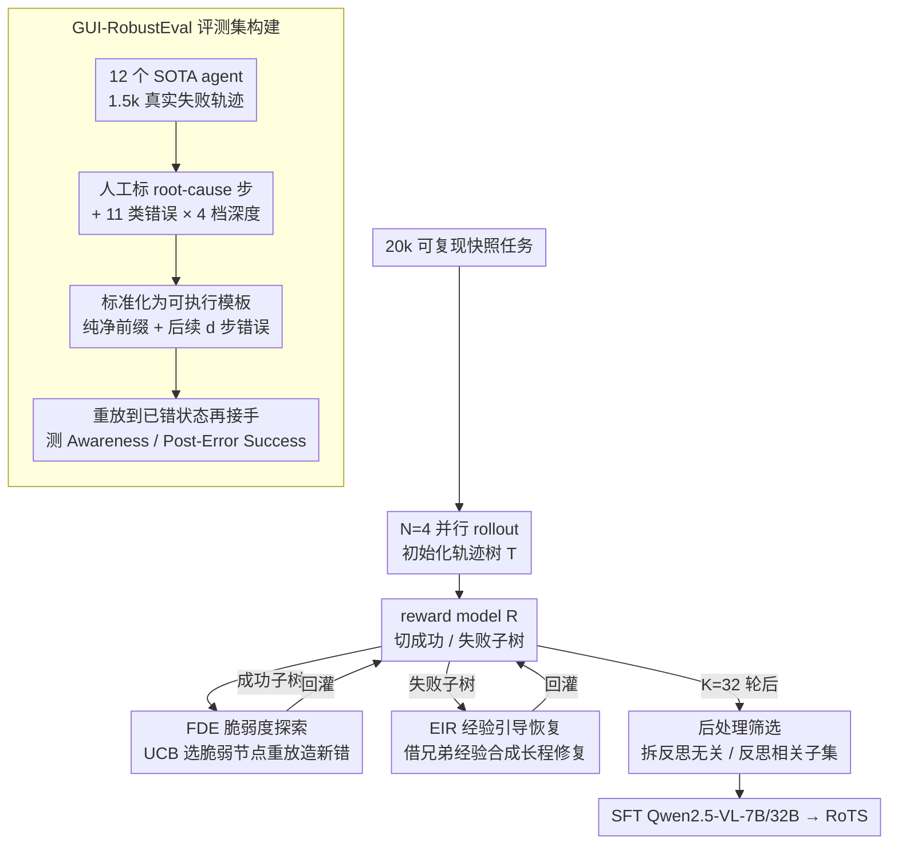

# Recovering Policy-Induced Errors: Benchmarking and Trajectory Synthesis for Robust GUI Agents

**会议**: ICML 2026  
**arXiv**: [2605.29447](https://arxiv.org/abs/2605.29447)  
**代码**: https://github.com/AlibabaResearch/RoTS (有)  
**领域**: Agent / GUI Agent / 鲁棒性 / 数据合成  
**关键词**: GUI智能体, 策略诱发错误, 错误恢复, 轨迹树合成, 反思数据

## 一句话总结
针对 GUI 智能体在真实部署中容易陷入"自己造的错误"无法恢复这一痛点，作者一边搭出 GUI-RobustEval（1216 个可执行测试，覆盖 11 种策略诱发错误 + 4 档错误深度）做细粒度评测，一边提出 RoTS——一种基于轨迹树的在线数据合成框架：在成功子树上用脆弱度 UCB 主动暴露新错误，在失败子树上用邻居经验做长程恢复回滚，最终合成 800k 反思数据，使 RoTS-32B 在 OSWorld 上拿到 47.4% SR / 33.8% All-Pass@4 的开源 SOTA。

## 研究背景与动机
**领域现状**：GUI agent 这一年靠 VLM（GPT-5.1、Claude 4.5、Qwen3-VL、UI-TARS、OpenCUA 等）已经把 OSWorld 这种桌面任务做到了 30~40% 的平均成功率，主流训练范式是"人类演示轨迹 SFT + 在线 RL"，主流评测指标是 grounding 精度、规划精度和整体任务成功率。

**现有痛点**：智能体在真实部署中频繁出现 *policy-induced errors*——它自己 grounding 错了、读屏读错了、子目标拆错了——一旦错了就陷进去出不来。但既有 benchmark 衡量的是"注入式噪声"或"对抗攻击"等外源扰动，训练数据里的反思样本要么是人工编的，要么是离线增广出来的，分布完全偏离策略真正会犯的错误。框架层往往靠塞一个 reflection sub-agent 兜底，并没有真正在训练层面教会模型"识别并修复自己造的错"。

**核心矛盾**：作者把这种不匹配显式拆成两条 gap：(1) **错误类型不匹配**——训练数据里 dominate 的是低层执行错误（无效点击），真实失败更多是组合性的规划/进度感知错误；(2) **错误时程不匹配**——训练数据里的错误大多在 1 步内可识别，但策略诱发错误往往要再走几步才暴露，需要长程回溯。

**本文目标**：同时在评测端和数据端缝合这两条 gap：在评测端造一个能按错误类型和错误深度做细粒度诊断的 benchmark；在数据端造一个能主动暴露多样错误模式、并合成长程恢复轨迹的可扩展 pipeline。

**切入角度**：作者从一个观察出发——既然真实的 policy-induced 错误本身就是策略在与环境交互时"分叉出来"的，那最匹配这个分布的合成器就应该是策略自己在一棵可回放的轨迹树上反复 rollout。成功分支用来主动找新错误（"探索"），失败分支用来合成恢复轨迹（"复活"），二者共生扩展，自然覆盖类型和时程两条 gap。

**核心 idea**：用"探索-恢复共扩展"的在线轨迹树代替人工反思数据，让 agent 自己生成的失败-恢复对，去训自己的鲁棒性。

## 方法详解

### 整体框架
这篇要解决的是"GUI agent 会陷在自己造的错里出不来"，办法是评测和数据两端同时缝合错误类型、错误时程两条 gap。评测侧 GUI-RobustEval 从 12 个 SOTA agent 在 OSWorld 上的 1.5k 失败轨迹里，由人工标定 root-cause step 和错误类型，归纳出 11 类策略诱发错误、4 档错误深度 $d \in \{0,1,3,5\}$；每个测试 case 是"一段人工修干净的正确前缀 + root-cause 步 + 接下来 $d$ 步错误执行"，把环境快照重放到这个已经犯了错的状态后再让被测 agent 接手收尾，报告 *Error-Awareness Rate*（接手第一步是否意识到出错，VLM 判）和 *Post-Error Success Rate*（最终能否完成）两个互补指标。

数据侧 RoTS 则在 20k 个有可复现快照的任务上建轨迹树 $T=(O,A,E)$（节点是 screenshot，边是 action）：先并行跑 $N=4$ 条 rollout 初始化，再迭代 $K=32$ 轮 "explore-recovery co-expansion"，每轮按外层 reward model $\mathcal{R}$ 把树切成成功子树 $T^{\text{corr}}$ 和失败子树 $T^{\text{fail}}$ 各扩展一次——前者主动找新错误，后者合成恢复轨迹。最后做后处理筛选，组装成 800k 训练样本去 SFT Qwen2.5-VL-7B/32B。

### 关键设计

**1. GUI-RobustEval：从真实失败里反推可控的错误前缀**

既有 benchmark（GUI-Reflection、GUI-Robust、D-GARA、RedTeamCUA）衡量的都是合成扰动、环境扰动或对抗攻击，没有一个是策略自己造的错，于是评测信号和真实失败分布对不上。GUI-RobustEval 的做法是先从 12 个 SOTA agent 的 1.5k 失败轨迹里挖出 root-cause step 和错误类型分布，再把每个 case 标准化成"纯净前缀 + root-cause + 后续 $d$ 步"的可执行模板（统一成 action summary + PyAutoGUI，测试时再转回各 agent 原生格式）；评测时从系统快照重放前缀到指定深度 $d \in \{0,1,3,5\}$，把 agent 直接扔进"已经错了 $d$ 步"的状态，看它能否意识到并修复。这样 1216 个 case 全部源自真实 SOTA agent 失败，且第一次把错误深度抽成可控的一阶变量——Fig. 3(d) 显示几乎所有 agent 的成功率都随深度单调下降，说明长程恢复是个被严重低估的维度。

**2. 脆弱度驱动探索 FDE：在成功子树里主动找新错误**

直接 parallel sampling 会一直从根重复采，算力浪费且错误类型覆盖窄，训练数据里因此 dominate 的全是低层执行错误。FDE 转而在 $T^{\text{corr}}$ 上挑"看似走对了但其实很容易翻车"的节点分叉：对每个节点 $o_i$ 用 pre-operative 进度评分器 $\mathcal{R}_p$ 从策略采 $N$ 个候选 action，平均得到 step-level 成功率 $r_i = \tfrac{1}{N}\sum_n r_{i,n}$，再算脆弱度分 $f_i = (1-r_i) + c\sqrt{\ln(V^f_{p(i)}+1)/(V^f_i+1)}$（UCB 形式，$V^f$ 是 FDE 视角的访问次数），选 $i^*=\arg\max_i f_i$ 把环境重放回 $o_{i^*}$ 让原策略 $\pi_\theta$ 继续走。"复用正确前缀 + 在最不稳节点分叉"把采样预算精准砸在最容易暴露错误的位置，UCB 的探索项又防止反复盯同一节点，从而扩张错误类型的覆盖面。

**3. 经验引导恢复 EIR：在失败子树里合成长程修复**

策略诱发错误往往要再走几步才暴露，需要长程回溯，可训练数据里的错误大多 1 步内就能识别，时程不匹配。EIR 把失败轨迹里的信息榨出来：对每条失败轨迹 $\tau^{\text{fail}}$，先聚合它在树里的兄弟分支经验 $\mathcal{E}(\tau^{\text{fail}})=\{E_{\tau^{\text{nb}}}\}$（reward model 顺手抽出来的可复用 trajectory experience，相当于"对的人怎么走"），喂给反思器 $\pi^{er}_\theta$ 产出 $(i, g_i, p_i)$——候选错误步、恢复指引、扩展优先级；再用 UCB 风格的 $s_i = p_i + c\sqrt{\ln(V^r_{p(i)}+1)/(V^r_i+1)}$ 选要修的节点，重放到 $o_{i^*}$ 后由恢复 actor 跑 $\tau^{\text{rec}} \sim \pi^{rec}_\theta(u, o_{i^*}, h_{i^*-1}, g_{i^*})$。把"兄弟分支经验"和"反思器建议"合进一个 advice-conditioned rollout，就能稳定产出"先错→识别→恢复→完成"的长程样本。后处理再用 progress critic $\mathcal{R}_p$、action critic $\mathcal{R}_a$、reflection validator $\mathcal{R}_f$ 把样本拆成反思无关子集 $\mathcal{D}_{\text{agn}}$ 和反思相关子集 $\mathcal{D}_{\text{ref}}$。

### 一个完整示例：一轮 co-expansion 怎么转

拿一棵长出 4 条初始 rollout 的轨迹树举例。某轮 reward model $\mathcal{R}$ 把它切成成功子树和失败子树后两侧并行扩展：在成功子树这边，FDE 给每个节点算脆弱度——比如某个"已经成功提交表单前一步"的节点，$N=4$ 个候选里有 2 个会点错按钮，$r_i=0.5$，脆弱度偏高，于是被选中重放、继续 rollout，结果真的分叉出一条新的失败分支（点错了下拉框）；在失败子树这边，EIR 对一条"5 步前选错搜索框、后面越走越偏"的失败轨迹，先从它兄弟分支里取经验、由反思器判出 root-cause 在第 5 步并给出"先 Ctrl+A 清空再重输"的恢复指引，恢复 actor 据此重放到第 5 步、跑出一条"识别错误→撤销→重做→完成"的恢复轨迹。两条新分支都回灌进同一棵树，下一轮接着切——成功分支不断造新错、失败分支不断补修复，错误类型和错误时程两条覆盖面就这样共生扩张，32 轮后产出的样本同时富含多样错误和长程恢复。

### 损失函数 / 训练策略
训练混合两类数据：$\mathcal{D}_{\text{train}} = \mathcal{D}_{\text{agn}} \cup \lambda_{\text{ref}} \mathcal{D}_{\text{ref}}$，其中 $\lambda_{\text{ref}} \in [0,1]$ 控制反思样本占比，最终选 $\lambda_{\text{ref}}=0.1$（720k 反思无关 + 80k 反思相关）。每个训练样本是 $x_i=(u, h_{i-1}, o_i, a_i)$，损失是标准 teacher-forcing NLL $\mathcal{L}(\theta) = \mathbb{E}_{(u,h,o,a)\sim\mathcal{D}_{\text{train}}}[-\log \pi_\theta(a|u,h,o)]$，只对 $a_i$ 的 token 算 NLL，历史 $h$ 仅作上下文以避免把不完美 rollout 的噪声带进梯度。基座是 Qwen2.5-VL-7B 和 32B，纯 SFT。

## 实验关键数据

### 主实验

GUI-RobustEval 上不同错误深度的成功率（开源模型）：

| Agent | 深度 0 | 深度 1 | 深度 3 | 深度 5 | 降幅 | Awareness |
|------|--------|--------|--------|--------|------|-----------|
| Qwen2.5-VL-7B | 5.1 | 3.0 | 2.9 | 1.3 | ↓75% | — |
| GUI-Owl-7B | 28.7 | 15.6 | 8.1 | 10.4 | ↓64% | 5.9 |
| UI-TARS1.5-7B | 39.6 | 34.2 | 27.8 | 23.3 | ↓41% | 38.0 |
| OpenCUA-7B | 40.7 | 30.3 | 23.3 | 19.0 | ↓53% | 46.3 |
| OpenCUA-32B | 45.5 | 37.2 | 28.6 | 25.9 | ↓53% | 50.3 |
| **RoTS-7B** | 43.5 | 36.6 | 30.1 | 26.7 | **↓38%** | 51.9 |
| **RoTS-32B** | **49.7** | **41.8** | **36.5** | **33.2** | **↓33%** | **58.8** |

OSWorld-Verified 主对比（max 50 步，All-Pass@4 衡量 4 次独立运行的全部通过率）：

| Agent | 数据来源 | All-Pass@4 | Max 15 | Max ≥50 |
|------|---------|-----------|--------|---------|
| Claude 4.5 Sonnet | 闭源 | – | 42.9 | 58.1 |
| GPT-OpenAI CUA | 闭源 | – | 26.0 | 31.3 |
| Qwen3-VL-Plus | 闭源 | 24.5 | 33.1 | 35.2 |
| OpenCUA-7B | 开源 | 12.5 | 24.3 | 28.2 |
| GUI-OWL-7B | 闭源 | 14.7 | 27.1 | 29.4 |
| OpenCUA-32B | 开源 | 15.5 | 29.7 | 34.1 |
| **RoTS-7B** | 开源 | **26.3** | 31.7 | **36.3** |
| **RoTS-32B** | 开源 | **33.8** | **42.8** | **47.4** |

RoTS-32B 在开源阵营把 All-Pass@4 从 OpenCUA-32B 的 15.5 直接拉到 33.8，相对平均成功率的降幅也从 ↓54.5% 收窄到 ↓28.7%，是这篇最 striking 的数字。

### 消融实验
100k 数据规模下的 rollout 策略消融（PS = parallel sampling）：

| 数据来源 | Aware. | Post.Succ. | All-Pass@4 | OSWorld(50) | 说明 |
|---------|--------|-----------|-----------|-------------|------|
| PS | 19.9 | 12.1 | 8.6 | 18.1 | 纯并行采样 baseline |
| + FDE | 22.5 | 14.4 | 9.1 | 19.6 | 加脆弱度探索，主要涨 OSWorld |
| + EIR | 28.3 | 18.1 | 12.1 | 19.5 | 加恢复回滚，主要涨鲁棒性 |
| + FDE + EIR | **32.1** | **22.1** | **14.1** | **21.4** | 共扩展最佳 |

数据来源对比 AgentNet（人类演示）：

| Training Data | All-Pass@4 | OSWorld(50) | 说明 |
|--------------|-----------|-------------|------|
| $\mathcal{D}_{\text{agn(hum)}}$ | 7.8 | 15.3 | 纯人类反思无关 |
| $\mathcal{D}_{\text{agn(hum)}} \cup \mathcal{D}_{\text{ref(hum)}}$ | 8.4 | 16.1 | 加人类反思样本 |
| $\mathcal{D}_{\text{agn(hum)}} \cup \mathcal{D}_{\text{ref}}$ | 11.6 | 18.8 | 把人类反思换成 RoTS 反思 |
| $\mathcal{D}_{\text{agn}} \cup \mathcal{D}_{\text{ref}}$ | **14.1** | **21.4** | 全部 RoTS 数据 |

### 关键发现
- **EIR 贡献鲁棒性，FDE 贡献整体成功率**：单加 EIR 把 All-Pass@4 从 8.6 推到 12.1（+3.5），但 OSWorld 几乎没动；单加 FDE 把 OSWorld 从 18.1 推到 19.6 但 All-Pass@4 只 +0.5。共扩展同时拿到两边的好处，验证了"探索找错 + 经验修错"的分工是真的有效。
- **数据分布比数据数量更重要**：100k 人类反思数据只比 100k 反思无关数据涨 0.6 点 OSWorld 成功率，但把同样规模换成 policy-induced 的 RoTS 反思数据直接涨 5.3 点。说明真正卡瓶颈的不是"有没有反思样本"，而是"反思样本是否匹配策略真正会犯的错"。
- **$\lambda_{\text{ref}}$ 存在最优区间**：反思数据占比在 0.1 时最佳，>0.2 反而比 $\lambda_{\text{ref}}=0$ 还差（14.8% vs 起点），说明"过度反思"会让模型把无错的步也强行反思，搞砸正常 rollout，反思和非反思样本需要 careful 平衡。
- **扩展是平滑可 scale 的**：扩展轮数从 0 → 32 把成功率从 15.8 推到 21.4；数据规模从 50k → 1000k 把 OSWorld 成功率推到 36.4 才开始 saturate，作者把饱和归因于 $N=4$、32 轮的固定 budget，暗示加大 $N$ 还能继续涨。

## 亮点与洞察
- 把 GUI agent 鲁棒性从"加 reflection sub-agent"这条工程路线拽回到了"训练数据分布对齐"的本质问题上：合成器本身就是策略 + 环境的交互产物，因此天然匹配真实策略诱发错误的分布——这一点对所有 agent 数据合成都有迁移价值。
- "成功子树用脆弱度 UCB 探索 + 失败子树用邻居经验回滚"的对偶设计很巧妙：一棵树同时承担"造错"和"修错"两件事，且都靠 UCB 平衡覆盖与利用，prefix 又能跨分支共享，几乎是把 MCTS 的思想搬到了 agent 数据合成上，但跳过了 value backup 的复杂度。
- 把错误深度作为评测的一阶变量（而不是和错误类型混在一起算一个总分），让 "long-horizon recovery" 第一次有了可对比的曲线，类似把 chain-of-thought 评测从 single-step 拆出来的影响——这一招同样可以套到 RL agent、tool-use agent 等其他长程任务的 benchmark 设计上。

## 局限与展望
- 当前只覆盖桌面 OS（Ubuntu / Windows 11），移动端和边端的 GUI 任务尚未验证；移动端的视觉结构差异、状态空间差异都可能让 RoTS 的"快照重放 + 兄弟分支经验"假设不成立。
- 评测时不可避免地要把统一格式的前缀注入到各 agent 的原生 CoT/action 空间，跨格式转换可能引入额外退化；作者承认"within-agent 趋势仍然成立"，但 across-agent 的绝对数值比较其实带噪。
- 训练完全靠 SFT，没把合成数据放回 online RL 里做闭环——作者也写明"data flywheel / RL self-evolving"是 future work，不上闭环意味着模型一旦能力外溢出反思器/恢复 actor 的范围就再没法迭代。
- 800k 样本背后是 32 张 A100 + 120 路并行 + Qwen3-VL-Plus API + 20k 任务快照，复现成本极高，开源界很难直接 reproduce 整条 pipeline；只放权重和数据可能让社区误以为"反思即 free lunch"，忽略真正贵的是合成基础设施。
- 失败案例显示 RoTS 偶尔会 over-reflection，把推理预算耗在不该反思的步上；这暗示"反思能力"本身可能是把双刃剑，需要更精细的触发机制（例如条件式反思或 reward-shaping）。

## 相关工作与启发
- **vs GUI-Reflection / GUI-Robust / D-GARA / RedTeamCUA**：他们衡量的是合成扰动、环境扰动或对抗攻击下的鲁棒性，本文衡量的是策略自己犯错后的恢复能力，且错误深度可控；优势是对真实失败模式直接负责，劣势是构造成本更高（需要先收集大量真实失败轨迹）。
- **vs AgentNet / AgentTrek / GUI-Reflection 数据**：它们靠人类演示或离线增广产生反思样本，分布偏向人类容易犯的低层错误；RoTS 让策略自己分叉出错误，分布天然匹配 policy-induced 失败，相同规模下数据效率高得多（Table 5 同 100k 样本 OSWorld 涨 6 个点）。
- **vs Agent S / UFO 等带 reflection 子模块的框架**：它们在推理时塞 reflection agent 兜底，rebustness 来自 inference-time 工程；RoTS 把鲁棒性"烧"进权重里，部署时不需要额外子智能体，省推理成本，但训练成本上去了。
- **vs Zheng et al. 2025 / Yuan et al. 2025 等 self-training 范式**：它们也用模型自身产数据训自己，但本文额外引入了"轨迹树 + UCB + advice-conditioned recovery"，把 self-training 推到长程反思场景，提供了一套更结构化的 self-training schema。

## 评分
- 新颖性: ⭐⭐⭐⭐ "探索-恢复共扩展"在 GUI agent 数据合成里是新组合，但 MCTS-style 采样和 self-training 思路本身在 LLM agent 圈已有铺垫
- 实验充分度: ⭐⭐⭐⭐⭐ 自建 1216 题 benchmark + 两个公开 benchmark + rollout 策略消融 + 数据来源消融 + $\lambda_{\text{ref}}$ 扫描 + scaling 曲线 + 人类一致性研究，几乎覆盖了能问的问题
- 写作质量: ⭐⭐⭐⭐ 两条 gap 的叙事清晰，但算法 1 和符号体系略密集，初读容易被 $V^f / V^r / \pi^{er} / \pi^{rec}$ 这套上下标劝退
- 价值: ⭐⭐⭐⭐⭐ 数据 + benchmark + 模型权重全开，给社区一套可直接用的"教 GUI agent 怎么救自己"工具箱，OSWorld 47.4% / All-Pass@4 33.8% 的开源 SOTA 也实打实

<!-- RELATED:START -->

## 相关论文

- [\[CVPR 2026\] HATS: Hardness-Aware Trajectory Synthesis for GUI Agents](../../CVPR2026/llm_agent/hats_hardness-aware_trajectory_synthesis_for_gui_agents.md)
- [\[ACL 2026\] Robust Tool Use via Fission-GRPO: Learning to Recover from Execution Errors](../../ACL2026/llm_agent/robust_tool_use_via_fission-grpo_learning_to_recover_from_execution_errors.md)
- [\[ICML 2026\] Rule2DRC: Benchmarking LLM Agents for DRC Script Synthesis with Execution-Guided Test Generation](rule2drc_benchmarking_llm_agents_for_drc_script_synthesis_with_execution-guided_.md)
- [\[ICML 2026\] Scaling, Benchmarking, and Reasoning of Vision-Language Agents for Mobile GUI Navigation](scaling_benchmarking_and_reasoning_of_vision-language_agents_for_mobile_gui_navi.md)
- [\[ACL 2025\] OS-Genesis: Automating GUI Agent Trajectory Construction via Reverse Task Synthesis](../../ACL2025/llm_agent/os_genesis_gui_agent_trajectory.md)

<!-- RELATED:END -->
