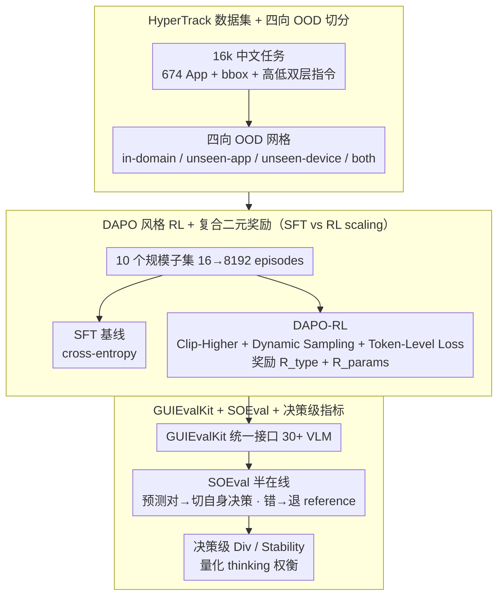

# Scaling, Benchmarking, and Reasoning of Vision-Language Agents for Mobile GUI Navigation

**会议**: ICML 2026  
**arXiv**: [2605.27134](https://arxiv.org/abs/2605.27134)  
**代码**: https://github.com/xiaomi-research/guievalkit (有)  
**领域**: Agent / 多模态VLM  
**关键词**: 移动 GUI 导航, VLM Agent, 数据 Scaling, DAPO-RL, 半在线评测

## 一句话总结
小米团队针对 VLM 移动 GUI 智能体提出"数据-评测-推理"三位一体的系统性研究：发布 16k 任务 / 674 个中文 App 的 HyperTrack 数据集和支持 30+ 模型的 GUIEvalKit 评测工具，证明 DAPO 风格 RL 在 OOD 场景明显胜过 SFT、并用半在线评测 SOEval 揭示了"显式 reasoning 会牺牲 PASS@1 稳定性但提升 PASS@n 多样性"的核心权衡。

## 研究背景与动机

**领域现状**：VLM 驱动的 GUI Agent（UI-TARS、AgentCPM-GUI、GUI-Owl 等）已成为移动端自动化操作的主流方案，训练范式集中在 SFT + 偏好对齐（DPO）+ 近期的 GRPO/DAPO 风格 RL。

**现有痛点**：(1) 数据侧 —— 主流 benchmark（AITW、AndroidControl、AMEX、GUI Odyssey）几乎都是英文 App，最大的中文数据集 CAGUI 仅 600 任务 / 22 个 App，无法覆盖长尾应用；(2) 评测侧 —— 各家自建脚本、动作空间不一致、步级 / 集级指标定义混乱，模型间难以横向对比；(3) 训练侧 —— 在 GUI 场景下 SFT vs RL 的 scaling law 完全没人系统画过；(4) 推理侧 —— "thinking mode 到底有没有用"在多个 benchmark 上结论矛盾，缺少决策级（不是步级）的分析工具。

**核心矛盾**：GUI 导航本质上是 long-horizon + 多模态感知 + 序列决策的组合任务，离线指标（用 ground-truth 历史喂模型）和真实在线执行差距大；而完全在线评测又太贵无法规模化。需要一个既能反映 on-policy 行为又能复用静态数据的评测协议。

**本文目标**：分解为四个子问题 —— (a) 构建覆盖中文长尾 App 的大规模数据；(b) 提供统一的多模型多 benchmark 评测工具；(c) 厘清 SFT/RL 在不同数据规模下的 in-domain vs OOD 表现；(d) 用决策级指标解释"显式 reasoning 何时帮倒忙"。

**切入角度**：作者观察到离线评测之所以和在线脱节，是因为喂给模型的历史是 reference trajectory，而真实部署时模型只能看到自己刚刚做的决定。如果在模型预测正确的步骤上"切换"到模型自己的决策 artifact、错误时退回到 reference，就可以在不放弃静态数据可复现性的前提下，逼近 on-policy 评测的真实分布。

**核心 idea**："数据-工具-训练-评测"四件套联动 —— HyperTrack 提供 16k 中文任务、GUIEvalKit 统一接口、DAPO-RL 在 OOD 上完胜 SFT、SOEval + 决策级 diversity/stability 量化 reasoning 的真实代价。

## 方法详解

### 整体框架
这篇论文不发布新模型，而是把"数据—训练—评测"拧成一根分析链条，专门回答"GUI Agent 上 SFT 还是 RL、要不要 thinking"这两个争议问题。链条的起点是 HyperTrack 数据集（16080 个真实中文任务，每步带截图、文本指令、低级动作描述和 bbox），UI-TARS-1.5-7B / Qwen3-VL-8B 在它切出的 10 个规模子集（16→8192 episodes）上分别做 SFT 和 DAPO-RL；训练好的模型交给 GUIEvalKit，统一动作空间后跨 5 个 benchmark（AndroidControl、AiTZ、GUI Odyssey、CAGUI、HyperTrack）算 step-type/exact-match 和 episode-progress/success 四个指标；最后 SOEval 把离线评测拉近真实 on-policy 分布，决策级 Diversity/Stability 把"thinking 的代价"量化成一条权衡曲线。

### 关键设计

**1. HyperTrack 数据集 + 四向 OOD 切分：给中文长尾 App 补上带 bbox 的大规模数据**

主流 benchmark 几乎都是英文 App，最大的中文集合 CAGUI 只有 600 任务 / 22 个 App，根本撑不起一条 scaling law 曲线。HyperTrack 从 674 个中文 Android App、17 个类别（含长尾和平板专属应用）采集 16080 个 episode，平均 5.1 步，动作空间统一为 OPEN/CLICK/SCROLL/TYPE/STOP；每一步都标了 high-level 任务描述、截图、低级动作描述，以及所有 clickable 元素的 ground-truth bbox。它最关键的安排是切分方式：训练集只放手机数据，于是平板就天然成了 unseen-device 测试集，配合 unseen-app 一起拼出 in-domain / unseen-app / unseen-device / unseen-app&device 四向 OOD 网格。相比 AITW（没 bbox）、AndroidControl（英文）、CAGUI（太小），HyperTrack 是第一个同时具备「层级化 UI 文档 + bbox + 屏幕描述 + 中文 + 高低双层指令」的大规模集合，这套标注密度正是后面做 scaling 实验和细粒度 reward 的前提。

**2. DAPO 风格 RL + 复合二元奖励：把 SFT vs RL 的 scaling 行为画成可量化曲线**

GUI 场景下"SFT 还是 RL"一直只有直觉、没有系统证据。作者在 16→8192 episode 区间上同时跑两条训练路线，RL 这边用 GRPO 框架叠加 DAPO 的三件套——Clip-Higher 抬高上裁剪界让低概率正确动作有机会被放大、Dynamic Sampling 替换掉 advantage 为零的样本以保住梯度信号、Token-Level Policy Gradient Loss 让长短序列里每个 token 等权贡献。目标函数为 $\mathbb{E}_{q,o_i}\frac{1}{\sum|o_i|}\sum_{i,t}\min(r_{i,t}\hat A_{i,t}, \text{clip}(r_{i,t},1-\epsilon_{\text{low}},1+\epsilon_{\text{high}})\hat A_{i,t})$，取组大小 $G=16$、$\epsilon_{\text{low}}=0.2$、$\epsilon_{\text{high}}=0.3$、$\beta=0$（干脆不要 reference model，省显存）。奖励是复合二元的 $R = R_{\text{action-type}} + R_{\text{params}}$——先看动作类型对不对，类型对了再判参数（click 要落在 bbox 内、scroll 方向要对、text 要完全匹配），这样把 GUI 决策的"选什么动作"和"动作的落点"拆成两级信号。实测下来 performance 随训练 episode 数呈对数近似线性增长，而 RL 在 unseen-app 上对 SFT 的领先幅度明显大于 in-domain：这正是全文最硬的实证结论，把"为什么 GUI Agent 要上 RL"从直觉变成一条可外推的 scaling 现象，而且换成 Qwen3-VL-8B + Gaussian spatial reward 后趋势依旧，说明它不依赖某个特定 backbone。

**3. GUIEvalKit + SOEval + 决策级指标：把离线评测拉近在线，并量化 thinking 的真实代价**

离线评测之所以和在线脱节，是因为它一直喂 reference trajectory，而真实部署时模型只能看到自己刚做的决定。GUIEvalKit 先用 `ABCModel` 三件套 `prepare_input / generate / parse_response` 把 30+ 个 VLM 套进统一接口（支持 vLLM 后端和 `enable_thinking` 开关），再在评测协议上动刀：SOEval 在每步用一个历史选择算子，当模型这一步预测正确（$\hat a_t = a_t$）就切到模型自己的 artifact $\psi=\phi(o_t,\hat a_t,\hat\tau_t)$，错了才退回 reference $\phi(o_t,a_t)$——"对了用自己的，错了退回标准答案"，让评测上下文随着 rollout 渐进逼近 on-policy 分布，又不丢掉静态数据的可复现性。最后一层是决策级分析：把 $n=512$ 次 rollout 用密度聚类映射到决策空间 $\mathcal D$，再定义两个互补指标——多样性 $\text{Div} = H(p(d|M,S,s))$ 是决策分布的熵（越高说明模型在同一状态下越发散），稳定性 $\hat\theta = p(d^*|M,S,s)$ 是落在主导决策 $d^*$ 上的概率（越高越一致）。这套组合的价值在于它能拿在线数据当裁判：以 AndroidWorld 在线成功率为金标准，SOEval 的 step exact match 相关性达到 Spearman $\rho=0.771$、$R^2=0.624$，明显高于纯离线的 $\rho=0.657$、$R^2=0.482$，说明它确实是更可信的离线代理；而 Div/Stability 则直接解释了 thinking mode 的悖论——显式 reasoning 把工作点沿权衡曲线推向"高多样性、低稳定"，于是在 PASS@1 上输给 instruct，到 PASS@8 又靠多样性反超。

### 损失函数 / 训练策略
SFT 用标准 cross-entropy；RL 用 DAPO-GRPO（$G=16$、$\epsilon_{\text{low}}=0.2$、$\epsilon_{\text{high}}=0.3$、$\beta=0$），主奖励是 action-type + params 的复合二元奖励，另附 Gaussian spatial reward 做消融。Backbone 主用 UI-TARS-1.5-7B，再用 Qwen3-VL-8B-Thinking 复现一遍以验证 scaling 趋势的普适性。

## 实验关键数据

### 主实验：跨 benchmark 离线评测（step type / exact match，节选）

| Model | AndroidControl-low | GUI-Odyssey | AiTZ | CAGUI | HyperTrack |
|-------|--------------------|-------------|------|-------|-----------|
| Qwen3-VL-8B-Thinking | 81.08 / 71.10 | 74.01 / 46.98 | 66.90 / 47.27 | 78.37 / 56.89 | 77.03 / 59.35 |
| Qwen3-VL-8B-Instruct | 82.36 / 72.20 | 77.85 / 51.78 | 72.77 / 52.64 | 83.83 / 63.94 | 81.48 / 66.28 |
| MiMo-VL-7B-RL（w/o thinking）| 94.03 / 90.23 | 85.64 / 67.08 | 79.38 / 66.91 | 79.27 / 61.60 | 92.56 / 76.41 |
| UI-TARS-7B-SFT | 98.08 / 94.81 | 86.94 / 68.82 | 82.92 / 67.34 | 89.99 / 70.62 | 90.40 / 75.40 |
| UI-TARS-72B-SFT | 98.17 / 95.05 | 89.80 / 72.27 | 84.27 / 69.83 | 91.08 / 74.53 | 90.16 / 75.20 |
| AgentCPM-GUI-8B | 92.80 / 88.60 | 90.82 / 74.84 | 85.46 / 76.08 | **96.88 / 91.32** | 82.80 / 54.26 |

发现：(a) 专用 GUI Agent 普遍胜过通用 VLM；(b) UI-TARS 从 2B→72B 持续涨点；(c) **thinking mode 在多个模型上反而掉点**（Qwen3-VL 全系、MiMo-VL、GUI-Owl 都有 w/o thinking 的更高分）。

### 关键对比表：SOEval vs Offline（5-benchmark 平均 exact match）

| Model | Offline | SOEval | Δ |
|-------|---------|--------|---|
| Qwen3-VL-4B-Instruct | 59.39 | 63.05 | +3.66 |
| Qwen3-VL-8B-Instruct | 60.39 | 62.84 | +2.45 |
| GUI-Owl-7B | 65.49 | 67.37 | +1.88 |
| UI-Venus-Navi-72B | 74.09 | 76.16 | +2.07 |

SOEval 一致抬升 PASS@1，且与 AndroidWorld 在线成功率的相关性（Spearman 0.771）显著强于 offline（0.657）。

### 决策级分析（reasoning vs instruct-only）
- **稳定性 shift**（SOEval 相对 offline，按趋势分桶）：GUI-Owl-7B 上升组 +0.4500 / 下降组 −0.3882；UI-TARS-1.5-7B +0.2343 / −0.2052 —— 即 SOEval 主要救回 offline 下不稳定的样本，但轻微伤害已经稳定的样本。
- **reasoning–execution 一致性**（GUI-Owl-7B）：R-E consistent 样本成功率 73.70%，inconsistent 仅 18.29%，绝对差 55.4 pp，$\chi^2 = 2389.58$，$\phi = 0.489$，相对风险 4.03 —— reasoning 和 execution 不对齐基本等价于失败。
- **失败原因拆解**：action-type mismatch 占 61.1%（高层决策错），action-target mismatch 次之（grounding 错），说明 thinking mode 的主要伤害在"想得多、动作类型选错"。

### 关键发现
- 性能随训练 episode 数的对数近似线性增长，且 **RL 的斜率 + OOD 增益始终高于 SFT**，换 backbone（Qwen3-VL-8B）和换 reward（Gaussian spatial）都成立。
- thinking mode 不是免费午餐：它扩大决策多样性、救回低稳定样本，但同时让高稳定样本变不稳，在 PASS@1 下净亏；到 PASS@8 才反超 instruct，说明评测协议本身决定了"该不该 think"。
- SOEval 揭示当前模型缺少"自适应平衡近因 on-policy 上下文 vs 维持稳定决策"的机制 —— 增加 on-policy 历史的 OSR 单调提升 EM，但增加得太多会干扰原本稳定的决策。

## 亮点与洞察
- **SOEval 的设计非常巧妙**：用一个 $\psi$ 算子在"对了切 on-policy / 错了退 reference"之间无缝切换，既保留了静态数据可复现，又让评测分布渐进逼近真实部署 —— 这个 trick 可以直接迁移到任何需要长 horizon 评测的 agent 场景（web agent、code agent）。
- **把"thinking 有没有用"上升为 stability-diversity 权衡曲线**：作者用 512-rollout 决策级聚类 + 联合分布图，把直观的"think 更好/更差"争论变成可量化的"reasoning 把工作点沿曲线向高 diversity / 低 stability 方向移动"，这种视角对未来设计 adaptive thinking gate 非常有启发。
- **DAPO 在 OOD 上对 SFT 的拉开幅度远大于 in-domain**：这条经验对所有"训练数据有限 + 部署场景多变"的 agent 项目都是一颗定心丸 —— 别再纠结要不要上 RL 了。

## 局限与展望
- 作者公开的只是 HyperTrack preview subset，完整 16k 数据没放，外部团队难以复现 scaling 实验。
- 决策级聚类依赖密度方法且需要 $n=512$ 次 rollout，开销大，不适合在线监控；论文也承认聚类阈值需要按 benchmark 调。
- SOEval 仍是"on-track"假设 —— 一旦模型偏离 reference 就退回 ground truth，对真正会"自我恢复"的 agent 不公平，无法替代真在线评测（作者自己强调过）。
- 全部实验只在 Android 移动端 + 中文 App，跨平台（桌面 / web）/ 跨语言泛化没有验证。
- 改进思路：把 SOEval 的 $\psi$ 算子扩展到"软切换"（按预测置信度加权混合），并引入自适应 thinking gate，根据 baseline stability 决定要不要展开显式 reasoning。

## 相关工作与启发
- **vs UI-TARS / AgentCPM-GUI**：这些是被本文评测的对象。本文不发布新模型而是发布"数据+工具+方法论"，定位类似 GUI Agent 领域的 HELM/Big-Bench，长期 leverage 更大。
- **vs DAPO（Yu et al. 2025）原始论文**：DAPO 原本针对推理任务，本文把 Clip-Higher / Dynamic Sampling / Token-Level Loss 三件套搬到 GUI 动作预测上并设计了 action-type + params 的复合 binary reward，验证了 DAPO 思路在 multimodal sequential decision 上的可迁移性。
- **vs AndroidWorld（在线评测）**：AndroidWorld 是金标准但贵，本文用 SOEval 提供了一个相关性 0.77 的廉价代理，对资源受限的研究组特别友好。
- **vs CAGUI**：CAGUI 是之前中文 GUI 数据集的代表（600 任务 / 22 App），HyperTrack 在 task 数量上 ×27、App 数量上 ×30，质量上多了 hierarchical UI docs 和 bbox。

## 评分
- 新颖性: ⭐⭐⭐⭐ 数据集 + 工具不算理论突破，但 SOEval 和决策级指标的组合在 GUI Agent 领域是首创
- 实验充分度: ⭐⭐⭐⭐⭐ 5 benchmark × 30+ 模型 × 10 个数据规模 × 多 backbone，体量惊人
- 写作质量: ⭐⭐⭐⭐ 结构清晰，但部分图表（决策级联合分布）需要附录配合才能完全看懂
- 价值: ⭐⭐⭐⭐⭐ 中文 GUI Agent 社区从此有了统一的"数据 + 评测 + 训练经验"基线，工程价值极高

<!-- RELATED:START -->

## 相关论文

- [\[CVPR 2026\] Towards GUI Agents: Vision-Language Diffusion Models for GUI Grounding](../../CVPR2026/llm_agent/towards_gui_agents_vision-language_diffusion_models_for_gui_grounding.md)
- [\[ICML 2026\] Persona2Web: Benchmarking Personalized Web Agents for Contextual Reasoning with User History](persona2web_benchmarking_personalized_web_agents_for_contextual_reasoning_with_u.md)
- [\[ICML 2026\] Scaling Small Agents Through Strategy Auctions](scaling_small_agents_through_strategy_auctions.md)
- [\[CVPR 2026\] GUI-CEval: A Hierarchical and Comprehensive Chinese Benchmark for Mobile GUI Agents](../../CVPR2026/llm_agent/gui-ceval_a_hierarchical_and_comprehensive_chinese_benchmark_for_mobile_gui_agen.md)
- [\[CVPR 2026\] SenseSearch: Empowering Vision-Language Models with High-Resolution Agentic Search-Reasoning via Reinforcement Learning](../../CVPR2026/llm_agent/sensesearch_empowering_vision-language_models_with_high-resolution_agentic_searc.md)

<!-- RELATED:END -->
