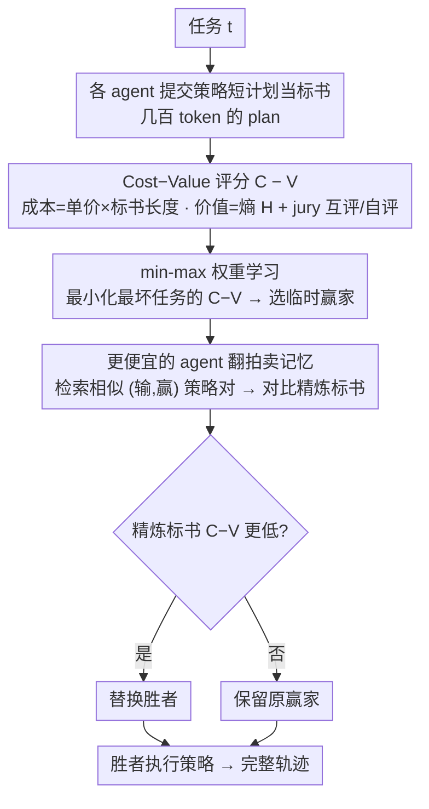

# Scaling Small Agents Through Strategy Auctions

**会议**: ICML 2026  
**arXiv**: [2602.02751](https://arxiv.org/abs/2602.02751)  
**代码**: 待确认  
**领域**: LLM Agent / 多智能体路由  
**关键词**: 策略竞拍, 异构智能体路由, 自由职业市场, 测试时自改进, deep search

## 一句话总结
论文提出 sale（Strategy Auctions for Workload Efficiency）：让大小不一的 Qwen3 智能体在每个任务上提交"策略短计划"作为竞拍标书，按 cost-minus-value 选出执行者，并用历史竞拍记忆让便宜 agent 持续精炼自己的标书；在 deep search 与 coding 上既超过最大模型的 pass@1，又把对最大 agent 的依赖降低 52%、总开销降低 35%。

## 研究背景与动机
**领域现状**：业界对"小模型 + 工具 → 顶替大模型做 agentic 工作流"普遍乐观，认为小 LLM agent 把推理外包给环境与工具后就够用。

**现有痛点**：作者用 Qwen3 4B/8B/14B/32B 在 deep search 与 coding 上沿"人类求解时间"τ(t) 做细粒度评测，发现简单任务上最小 agent 能拿到最大 agent 约 87–92% 的 pass@1，但到最复杂的一档（τ ≤ 60 分钟）只剩 17–25%。即小 agent 性能并不随任务复杂度伸缩，而单一选择"大模型兜底"又会在简单任务上严重浪费算力。

**核心矛盾**：现有路由策略二选一都不合身。Non-predictive 路由（让多模型都跑出完整答案再选）在 agentic 场景下成本爆炸（轨迹动辄上百万 token）；Predictive 路由（学一个额外的小路由模型）则要专门训练、绑死具体模型集合，且在难任务上反而退化，更没有 test-time 自改进能力。

**本文目标**：设计一种路由机制，需同时满足：① 推理开销几乎可忽略；② 可即插即用到任意现成 agent；③ 在长程任务上仍保持精度；④ 能让小 agent 随用随强，逐渐承担更多工作量。

**切入角度**：借鉴自由职业市场——招聘方挂出任务，自由职业者用"我打算怎么做"的短方案投标，平台按价 / 质打分定标；落选者通过观察过往案例升级自己的方案。Sun et al. (2024) 等已证明 plan 质量与 execution 质量强相关，因此用 plan 当 bid 兼具信息量与极低成本。

**核心 idea**：把异构 agent 排成一个 test-time 拍卖市场，标书是策略短计划而非完整解，胜者按 cost-minus-value 选；并用"过往中标 / 落标"记忆驱动小 agent 自我迭代，把任务路由与自改进合二为一。

## 方法详解
### 整体框架
sale 把异构 agent 集合 $\mathcal{A} = \{a_i\}_{i=1}^{|\mathcal{A}|}$（论文里是 4 个 Qwen3 规格）排成一个测试时拍卖市场：拿到任务 t 后，每个 agent 先吐一段"我打算怎么做"的短策略当标书，市场用 cost-minus-value 给标书打分选出临时赢家，比赢家便宜的 agent 还能翻历史竞拍记忆精炼标书来抢单，最终胜者才真正执行其策略生成完整轨迹。关键在于整个竞拍只让每个 agent 吐几百 token 的 plan，token 与时延上占总推理不到 1%，于是把"要不要用大模型"这件事变成一次几乎免费的市场出清。

### 关键设计

**1. 策略短计划作为标书：用几百 token 的 plan 代替跑完整解来做路由**

agentic 轨迹动辄数十万到上百万 token，non-predictive 路由（让每个 agent 都跑到底再选）在这里成本爆炸，而 predictive 路由（纯靠任务描述训一个小路由模型）又对长程任务失灵。sale 走中间一条"部分预测式路由"：让每个 agent 只产出一段"如何分解任务、用哪些工具、可能踩哪些坑"的策略 $s_{t,i}$ 当标书。这一招之所以成立，是因为 plan 质量与 execution 质量已被证明强相关（Sun et al. 2024），所以短策略既是廉价的质量信号，又自带一份可直接执行的 roadmap——胜出的 agent 不必重新规划，照着自己的标书往下做即可。

**2. Cost-Value 评分与 min-max 权重学习：把"该不该派 $a_i$ 去做 t"压成一个越小越该派的标量**

每份标书的得分是 $C_{t,i} - V_{t,i}$。成本侧用 $C_{t,i} = w_c \cdot \pi(a_i) \cdot |s_{t,i}|$，把 agent 的每百万 token 单价 $\pi(a_i)$ 乘上标书长度——长策略既预示更长的执行轨迹（Goebel & Zips 2025）、又意味着更高失败率（Xiong et al. 2025a），于是标书长度成了一个免费拿到的双重成本/风险代理。价值侧用

$$V_{t,i} = w_h \cdot H(s_{t,i}) + \sum_{a_j \in \mathcal{A}} w_j \cdot \gamma_j(s_{t,i}),$$

其中 $H(s_{t,i})$ 是标书的 token 级平均熵（熵高意味着信息密度大、冗余少，对应更好的规划），$\gamma_j \in \{0,\dots,5\}$ 是包括自评在内的 jury 给出的 0–5 Likert 打分。这样 value 同时兼顾内在质量（熵）与外在认可（jury 互评+自评），都是不必额外训练就能算出的信号。权重 $w = (w_c, w_h, \{w_j\})$ 不靠平均损失而靠 min-max 学：$\min_{w,x,Q} Q\ \text{s.t.}\ z_t \leq Q\ \forall t$，即最小化所有任务里最坏那个的 $C-V$，避免某个长尾任务被极差分配拖死——消融里平均损失在难任务上明显更脆。

**3. 拍卖记忆驱动的策略精炼：让落选的便宜 agent 复盘历史输赢、重写标书来抢单**

光选一次还不够，sale 想让小 agent 越用越能接活。每轮竞拍后把结果存进共享记忆 $\mathcal{M}(t') = (t', \{s_{t',i}\}, y_{t'})$，其中 $y_{t'}$ 是输赢标签。新任务 t 来时，只有那些比临时赢家更便宜的 agent 才启动精炼：按文本 embedding 余弦相似度检索 top-$\tilde{k}$ 个相似历史任务的 (lose, win) 策略对（至少一条来自它自己），用 contrastive prompt 让 agent 看清"上次我输在哪、对手赢在哪"，据此产出精炼标书 $s^r_{t,i}$ 并重新打分；只要某份精炼标书把 $C-V$ 压得比临时赢家更低就替换胜者，否则保留原赢家。把精炼限定在"更便宜且可能翻盘"的 agent 上，既保留了"小 agent 自己已经赢了就直接走"的捷径、不让 token 翻倍，又让额外算力精准花在有翻盘价值的地方——记忆越多，便宜 agent 中标越频繁，路由因此被升级成了一个持续自改进的过程。

### 训练策略
sale 不训练任何路由网络或精炼网络，全程用现成 Qwen3 推理。唯一需要"学"的是标量权重 $w = (w_c, w_h, \{w_j\})$，通过带 big-M 约束的 min-max MIP（附录 D）在一个训练子集上拟合一次后用于全测试集；精炼阶段则完全靠 prompt 与 retrieval 在测试时即时完成。

## 实验关键数据

### 主实验
评测数据集 HST-Bench（753 个任务，5 个复杂度 bin，按人类求解时间 τ(t) 分档）；agent 池为 Qwen3 4B / 8B / 14B / 32B，单价分别 $0.05 / $0.09 / $0.16 / $0.36 每百万 token；指标 pass@1（LLM-as-judge）+ 每百万 token 实际花费 $/Mt。所有 sale 数字为 5 次随机任务顺序的平均。

| 域 | 设定 | 32B agent pass@1 | sale pass@1 | sale 相对增益 | sale $/Mt | 32B $/Mt | 成本下降 |
|---|---|---|---|---|---|---|---|
| Deep search | All | 63.8 | 67.3 | +3.5 | 0.21 | 0.36 | -42% |
| Deep search | τ≤0.1（最简单） | 87.5 | 91.3 | +3.8 | 0.22 | 0.36 | -39% |
| Deep search | τ≤60（最难） | 12.5 | 16.3 | +3.8 | 0.23 | 0.36 | -36% |
| Coding | τ≤0.1 | 95.0 | 98.3 | +3.3 | 0.18 | 0.36 | -50% |
| Coding | τ≤0.5 | 79.7 | 82.0 | +2.3 | — | 0.36 | — |

整体上 sale 把对最大 agent 的依赖在 deep search 减少 65%、在 coding 减少 40%，跨域综合 -52%；总花费 deep search -42%、coding -25%，综合 -35%。

### 消融与对照
| 配置 | 表现/现象 | 说明 |
|---|---|---|
| 任意单一 Qwen3 agent | 都被 sale 在 pass@1 与 $/Mt 上同时支配 | 证明 sale 把 Pareto 前沿外推 |
| 现成 predictive router（基于任务描述） | 要么 pass@1 不如最大 agent，要么省不下钱，常两头都丢 | 说明在 agentic 场景下"看 task 描述"是错信号 |
| 去掉 jury 自评 / 缩小 jury 规模 | pass@1 下降（附录 I） | 自评 + 互评的混合 jury 不可替代 |
| 不用熵作为价值 | pass@1 下降 | 印证高熵 plan ↔ 更优规划 |
| 不用 memory refinement | 便宜 agent 中标比例无法随时间增长 | refinement 是"scaling up small agents"的关键 |
| 用 random / 单 LLM 当 router 的成本 | sale 拍卖阶段 < 总推理成本 1% | overhead 可忽略 |

### 关键发现
- pass@1 随 τ(t) 单调下降，4 个尺寸都如此，说明 HST-Bench 的人时刻度确实和 LLM 难度对齐，可作为之后 agent 评测的标尺。
- 大 agent 并没有用"更短轨迹"摊薄高单价——只在简单任务上 trace 略短，复杂任务下 token 数差不多甚至更多，所以"贵 agent 更值"在长程任务上不成立。
- 随拍卖记忆增长，小 agent 中标比例显著上升，复现了"自由职业者越接活越接得动"的市场动力学。
- sale 的提升对任务顺序的随机扰动相当稳健（5 次 perm 的 std 都很小，如 0.5–1.8 pass@1）。

## 亮点与洞察
- 把 routing 的代价信号从"训一个路由模型"换成"让 agent 多吐几百 token 的 plan"，思路非常轻，落地阻力低；这也是文中称之为"partially predictive routing"的关键。
- 用 plan 长度同时当 cost 与 risk 代理，是个非常实用的双关变量——既预测花销又预测失败概率，相当于把两个常被分开建模的量合成一个免费可得的标量。
- "便宜 agent 才有精炼机会"的非对称设计，把"提升小模型"与"控制额外推理 token"两个目标天然耦合，是 system-level 设计的好例子，可推广到任何需要 test-time self-improvement 的多模型系统。
- min-max 权重学习对长尾任务更友好，提示后续做 agent routing 的人应避免直接用平均损失。

## 局限性 / 可改进方向
- 异构 agent 池只测了同一家族的 4 个 Qwen3 尺寸，跨家族（如 Qwen × Llama × GPT）的 jury 是否还稳健、价格差距更大时 cost-value 权重是否要重学，论文没给答案。
- jury 让所有 agent 互评带来 $O(|\mathcal{A}|^2)$ 评分调用，agent 池一旦扩到几十个会变成新瓶颈，需要稀疏 jury 或层级 jury。
- 评估完全依赖 LLM-as-judge 的 pass@1，对 coding 这种可单元测试的域其实可以加更严的执行级评估，否则 jury 偏好与真实正确率可能脱钩。
- 记忆只存策略对，不存执行轨迹，便宜 agent 学到的是"怎么写更好的 plan"而非"怎么修轨迹中的错误"；如果 task 复杂度再上一档，可能需要 trace 级 memory。
- 权重通过 min-max MIP 在小训练集学得，迁移到 distribution shift 大的新基准时如何在线再校准，是个未解问题。

## 相关工作与启发
- **vs Predictive Router（Hu et al. 2024 / Stripelis 等）**: 这一类要训独立的 router 网络、绑死候选模型集合，且在难任务上反而失灵；sale 不训 router，靠"agent 自己提交 plan"做部分预测式路由，可即插即用并随经验改进。
- **vs Non-predictive Router（Chen et al. 2024 等）**: 让所有候选模型跑出完整解再选，在 agentic 长轨迹下成本爆炸；sale 用短 plan 截断这条路，把开销压到 < 1%。
- **vs Kwa et al. 2025 / Sinha et al. 2026 的 agent scaling 研究**: 前者关注"单个模型在长任务上的 50% 成功时间"，后者用合成任务揭示长程失败的累积性；sale 把视角从"单 agent scaling"转到"系统级 scaling"，证明改造市场结构本身就能突破单模型 Pareto。
- **vs Tomasev et al. 2025 / Dütting et al. 2024 的 agent virtual economy**: 这些工作多在概念层面讨论 agent 经济，sale 把 auction 机制具象到"workload efficiency"这一可量化目标，并交付了端到端可跑的实现。
- **vs Memory-driven agent（Cao 2026 / Salama 2025 等）**: 传统 agent memory 存 trace、user history 用来增强单 agent reasoning；sale 把 memory 用作"市场反馈信号"，存竞拍输赢，用来重新分配劳动而不是改进单 agent 的内部状态——这是一种新的 memory 用途。

## 评分
- 新颖性: ⭐⭐⭐⭐⭐ 把"strategy 当 bid + auction memory 驱动 self-improvement"两件事合在一个测试时框架里，确实是少见的视角。
- 实验充分度: ⭐⭐⭐⭐ HST-Bench 753 任务 × 5 复杂度 × 5 次随机顺序 + 多个对照 router + 充分 ablation；不过只测了 Qwen3 同家族，跨家族证据缺。
- 写作质量: ⭐⭐⭐⭐⭐ 动机、公式、附录交叉引用清晰，cost-value 设计的"双重 motivation"叙述很有说服力。
- 价值: ⭐⭐⭐⭐⭐ 给"小 agent 时代到底怎么用"提供了一个可立即复刻的系统级答案，对工业部署多模型 agent 的同学非常实用。

<!-- RELATED:START -->

## 相关论文

- [\[ICML 2026\] Scaling, Benchmarking, and Reasoning of Vision-Language Agents for Mobile GUI Navigation](scaling_benchmarking_and_reasoning_of_vision-language_agents_for_mobile_gui_navi.md)
- [\[ICML 2026\] EvolveR: Self-Evolving LLM Agents through an Experience-Driven Lifecycle](evolver_self-evolving_llm_agents_through_an_experience-driven_lifecycle.md)
- [\[ACL 2026\] Polaris: A Gödel Agent Framework for Small Language Models through Experience-Abstracted Policy Repair](../../ACL2026/llm_agent/polaris_a_gödel_agent_framework_for_small_language_models_through_experience-abs.md)
- [\[NeurIPS 2025\] AgentTTS: Large Language Model Agent for Test-time Compute-optimal Scaling Strategy in Complex Tasks](../../NeurIPS2025/llm_agent/agenttts_large_language_model_agent_for_testtime_computeopti.md)
- [\[ICML 2026\] AutoRPA: Efficient GUI Automation through LLM-Driven Code Synthesis from Interactions](autorpa_efficient_gui_automation_through_llm-driven_code_synthesis_from_interact.md)

<!-- RELATED:END -->
