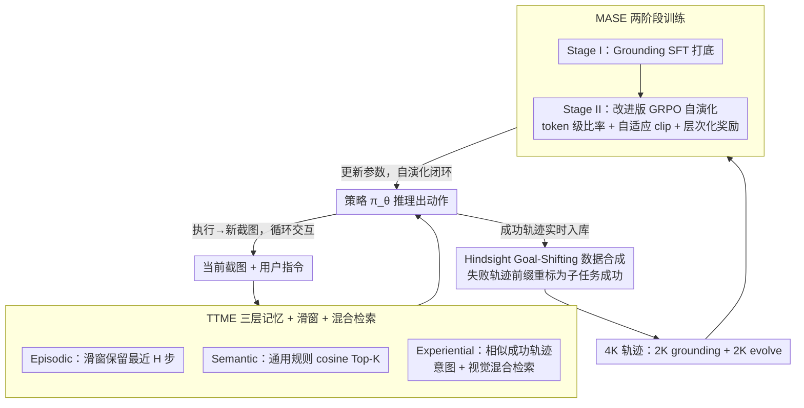

# SE-GA: Memory-Augmented Self-Evolution for GUI Agents

**会议**: ICML 2026  
**arXiv**: [2605.16883](https://arxiv.org/abs/2605.16883)  
**代码**: https://github.com/jinshilong-dev/SE-GA (有)  
**领域**: Agent / 多模态VLM / 强化学习  
**关键词**: GUI Agent, 分层记忆, 自演化, GRPO, Hindsight Goal-Shifting

## 一句话总结
SE-GA 给基于 VLM 的 GUI 智能体配了一套"情景+语义+经验"三层记忆库（TTME）+ 一个两阶段记忆增强自演化训练流程（MASE，SFT→改进版 GRPO），把 Qwen2.5-VL-7B 在 ScreenSpot 推到 89.0、AndroidControl-High 推到 75.8、AndroidWorld 推到 39.0，全面超越同规模基线甚至打平 72B 模型。

## 研究背景与动机

**领域现状**：当前 GUI 智能体主流做法是把 VLM（如 Qwen2.5-VL、UI-TARS）直接当成"看截图→出动作"的策略网络，通过 SFT 在固定轨迹数据集上行为克隆，少数工作进一步用 GRPO 等 RL 算法对齐人类意图。

**现有痛点**：作者点出两个具体瓶颈。其一是**上下文窗口有限 + 仅依赖当前截图**：GUI 导航是部分可观测、历史相关的 POMDP，关键信息可能只出现在早期某一步，但现有方法（ShowUI、OS-Atlas 等）只塞最近若干步进窗口，长程任务里一个早期遗忘就会引发不可逆失败。其二是**静态策略 + 无统一记忆组织**：现实任务往往是历史成功任务的变体或组合，但现有 agent 要么用固定数据集训出后冻结，要么只做临时 RAG 文本检索，无法把"哪些操作策略真的成功过"沉淀成长期可复用知识，更没法把这些显式经验回灌进模型参数里。

**核心矛盾**：GUI 任务**长程依赖**的本性 与 VLM 智能体**短窗口 + 静态参数**的工程现实之间存在结构性 trade-off — 既要让 agent 在推理时拿到 100 步前的关键观察，又要让 agent 能从过去成功轨迹里持续进化策略，单靠扩窗口或单靠多训一轮都解决不了。

**本文目标**：把 GUI agent 从"静态命令执行器"改造成"动态学习者"，具体拆成两个子问题：(1) 推理时如何**精确管理长程上下文** —— 不只是 episodic 短期窗口，还要能跨任务检索抽象规则和相似历史经验；(2) 训练时如何**把检索到的成功经验稳定地编码回策略参数** —— 在 GUI 这种稀疏奖励、高方差环境下让 GRPO 训得动。

**切入角度**：作者借鉴人类认知架构的三类记忆（情景/语义/经验），假设 GUI agent 同样可以靠分层记忆解耦"近期上下文"vs"通用规则"vs"相似成功经验"，且经验记忆本身可以在推理阶段动态积累、再喂回训练阶段，形成自演化闭环。

**核心 idea**：用一个三层分层记忆库（episodic + semantic + experiential）做推理期的精确上下文检索，再用一个两阶段训练管线（grounding SFT + 改进版 GRPO）把记忆里的高质量轨迹回灌成策略参数，让 GUI agent 在线持续进化。

## 方法详解

### 整体框架
SE-GA 把 GUI 导航形式化为 POMDP $\langle\mathcal{S},\mathcal{A},\mathcal{O},\mathcal{T},\mathcal{R},\gamma\rangle$，目标是把一个只会"看截图出动作"的 VLM 策略，改造成能跨任务检索经验、还能把经验回灌进参数的自演化 agent。每一步 $t$，agent 拿到用户指令 $Q$、当前截图 $o_t$，再从三层记忆库 $\mathcal{M}=(M^{EPI},M^{SEM},M^{EXP})$ 检索出结构化记忆 $M_{retrieved}$，拼成输入 $x_t=(o_t,Q,M_{retrieved})$ 喂给策略 $\pi_\theta(a_t|x_t)$ 出动作。系统由三件事咬合成一个自演化闭环：推理期的 **TTME**（Test-Time Memory Extension）负责分层检索上下文、同时把新跑出来的成功轨迹实时入库；这些原始轨迹再经 **Hindsight Goal-Shifting** 把失败轨迹的成功前缀回收、扩成 4K 条高质量数据；训练期的 **MASE**（Memory-Augmented Self-Evolution）分两阶段（Grounding SFT → 改进版 GRPO）把这批数据烧回 VLM 参数，更强的策略又能在推理时攒出更高质量的轨迹。Base model 是 Qwen2.5-VL-7B，4×A800 训练。

### 关键设计

**1. TTME 三层记忆 + 滑窗 + 多模态混合检索：让 agent 推理时同时看到近期上下文、通用规则和历史成功策略**

GUI 导航是部分可观测的，关键线索可能藏在 100 步前的某一张截图里，可现有方法只塞最近几步进窗口，长程任务一旦早期遗忘就不可逆失败。TTME 把上下文按认知科学的三分法拆开、各自定义、各自检索。**Episodic** 层 $M^{EPI}_t=[\langle o_k,a_k,o_{k+1}\rangle]_{k=1}^{t-1}$ 存原始动作序列，但只用固定长度 $H$ 的滑窗 $\mathcal{C}^{epi}_t=[m_k]_{k=\max(1,t-H)}^{t-1}$ 保留最近 $H$ 步，避免陈旧步骤反过来误导决策。**Semantic** 层存通用交互规则 $m^{sem}_i=\langle k^{sem}_i,d_i\rangle$（如"访问受限页面前先登录"），用 cosine 相似度 $S^{sem}(Q,m^{sem}_i)=\phi(Q)\cdot k^{sem}_i / (|\phi(Q)||k^{sem}_i|)$ 取 Top-K，解决跨任务通用知识迁移。**Experiential** 层存历史成功轨迹及其反思摘要 $m^{exp}_i=\langle\tau_i,g(\tau_i),k^{intent}_i,k^{task}_i\rangle$，专治"重复造轮子"。

experiential 的检索是这一层最关键的设计：它用**意图 + 视觉混合检索** $S^{exp}(Q,o_t)=\lambda\cdot\text{Sim}(\phi(Q),k^{intent}_i)+(1-\lambda)\cdot\text{Sim}(\psi(o_t),k^{task}_i)$，把文本 query 的相似度和当前截图 $\psi(o_t)$ 的视觉相似度加权融合。原因是 GUI 任务高度依赖界面布局，纯文本 RAG 会忽略"当前界面长什么样"这个关键线索，意图相近但界面完全不同的历史轨迹反而会误导——必须把视觉相似度也算进来才检得准。三层上下文 $\mathcal{C}^{epi},\mathcal{C}^{sem},\mathcal{C}^{exp}$ 全部拼进 agent 输入。更妙的是 TTME 是个动态 buffer，推理时新跑成功的轨迹直接入库，等于"边干边攒数据"，为下游训练源源不断供料。

**2. Hindsight Goal-Shifting 数据合成：把失败轨迹的前半段回收成子任务成功样本**

TTME 在线攒下的轨迹要喂给下游训练，可高质量 GUI 轨迹极稀缺，本文只凑得出 4K 条，大量失败轨迹白白浪费。Hindsight Goal-Shifting 借鉴 HER（Hindsight Experience Replay），把它从连续控制搬到符号化的 GUI 动作空间：给定一条原本目标 $g$ 的失败轨迹 $\tau=(s_0,a_0,\ldots,s_T)$，如果它的某个前缀 $\tau_{0:k}$ 其实完成了一个**替代子目标** $g'$（比如"成功打开 App 但后续搜索失败"，那 $g'$ 就是"打开 App"），就把 $\tau_{0:k}$ 重新标注成 $g'$ 的成功样本，构成 $\mathcal{D}_{GS}=\{(\tau_{0:k},g')\mid \text{Verify}(\tau_{0:k},g')=1\}$ 并入总数据集。这样原本零奖励的失败轨迹的"前半段成功部分"也能产生梯度，几乎是免费把数据利用率翻倍，对小数据集尤其关键。最终 4K 轨迹拆成 2K 给 grounding、2K 给 self-evolution。

**3. MASE 两阶段训练：Grounding SFT 打底 + 改进版 GRPO 自演化，把记忆烧进参数**

有了上面这批数据，还得真正回灌进模型参数才能让 agent 变强，但 GUI 是稀疏奖励、高方差环境，直接上 RL 训不稳。MASE 因此先 SFT 后 RL。**Stage I（Grounding Training）** 是记忆感知的行为克隆，目标 $\mathcal{L}_{SFT}(\theta)=-\mathbb{E}_{(x,y)\sim\mathcal{D}_{ground}}[\frac{1}{|y|}\sum_t\log\pi_\theta(y_t|o_t,Q,M,y_{<t})]$，先把 grounding 基础能力打牢、防止 Stage II 灾难性遗忘。**Stage II（Self-Evolution Training）** 在 GRPO 基础上做了三点针对 GUI 的改造，每一点都对应一个具体的训练失败模式。

其一是 **token-level importance ratio**（借鉴 DAPO），$\rho_{i,t}=\pi_\theta(y_{i,t}|x,y_{i,<t})/\pi_{\theta_{old}}(\cdot)$，把比率算到 token 级，避免序列级聚合让无关 token 把梯度拉爆。其二是 **adaptive clipping**，clip 上界 $\epsilon_{cur}$ 按 cosine schedule 从 $\epsilon_{init}$ 衰减到 $\epsilon_{end}$，

$$\epsilon_{cur}=\epsilon_{end}+\tfrac{1}{2}(\epsilon_{init}-\epsilon_{end})(1+\cos(\pi k/K))$$

让训练前期允许大步探索、后期收紧稳住。其三是 **hierarchical reward** $R_{total}=w_f R_{format}+w_a R_{acc}$，先卡输出格式再算精度——$R_{format}=0$ 时直接砍掉精度奖励，精度奖励再细分成动作类型奖励 + 参数奖励（click 任务用"点是否落在 bbox 内"的指示函数 $R_{point}=\mathbb{I}((x_p,y_p)\in B_{gt})$，scroll 任务用 IoU 配阈值 $\tau_{IoU}$ 的软门控）。这套"格式优先、类型与坐标都管"的层次化奖励正好对应 GUI 输出"格式必须严格、动作类型与坐标精度缺一不可"的特点。最终优化目标 $\mathcal{J}(\theta)=\mathbb{E}[\frac{1}{\sum|y_i|}\sum_{i,t}(\min(\rho_{i,t}A_i,\rho_{i,t}^{clip}A_i)-\beta\mathbb{D}_{KL}(\pi_\theta||\pi_{ref}))]$。三件套合起来，原本在 GUI 长轨迹上梯度爆炸或方差过大的 GRPO 才真正稳定收敛。

### 损失函数 / 训练策略
Stage I SFT：lr=2e-6，global batch=16；Stage II GRPO：lr=2e-5，global batch=256，group size $G$=16；4×A800 GPU。数据来源 AITW + AMEX + GUIOdyssey + Android 模拟器自采，经 Qwen-VL 过滤简单/含糊样本 + Hindsight Goal-Shifting 扩充。

## 实验关键数据

### 主实验

| 数据集 | 指标 | 本文 (7B) | 之前 SOTA | 提升 |
|--------|------|-----------|-----------|------|
| ScreenSpot | Avg Grounding Acc | **89.0** | UI-TARS-72B 88.4 / Aguvis-7B 84.4 | +0.6 vs 72B / +4.6 vs 同规模 |
| AndroidControl-Low | Success Rate | **88.6** | OS-Atlas-7B 85.2 | +3.4 |
| AndroidControl-High | Success Rate | **75.8** | UI-TARS-72B 74.7 / OS-Atlas-7B 71.2 | +1.1 vs 72B / +4.6 vs 同规模 |
| GUIOdyssey | Step SR | **83.9** | OS-Atlas-7B 62.0 / UI-TARS-72B 88.6 | +21.9 vs 同规模（72B 仍领先 4.7） |
| GUIOdyssey | Type Acc | **96.5** | UI-TARS-72B 95.4 | +1.1（同规模反超 72B） |
| AndroidWorld（在线） | SR | **39.0** | UI-TARS-7B 33.0 / GUI-Critic-R1 27.6 | +6.0 |

### 消融实验

| 配置 | AC-Low SR | AC-High SR | GUIOdyssey SR | 说明 |
|------|-----------|------------|---------------|------|
| Full SE-GA | 88.6 | 73.8 | 83.9 | 完整模型 |
| w/o TTME | 83.0 | 61.4 | 74.9 | 去掉分层记忆：短程任务掉 5.6，长程任务掉 12.4 |
| w/o MASE | 74.3 | 59.7 | 60.4 | 去掉自演化训练：所有任务全面崩盘（GUIOdyssey 掉 23.5） |

### 关键发现
- **MASE 是地基、TTME 是脚手架**：去掉 MASE 比去掉 TTME 掉得猛得多（GUIOdyssey 从 83.9 → 60.4 vs 74.9），说明记忆增强训练把基础 grounding 和决策能力烧进参数才是性能基石，TTME 是在好底座上做的长程增益。
- **TTME 的价值随任务长度放大**：AC-Low（短程）去掉只掉 5.6，AC-High（长程）去掉直接掉 12.4，验证了"分层记忆主要解决长程上下文遗忘"的假设。
- **7B 打 72B**：在 ScreenSpot 和 AndroidControl-High 上 SE-GA-7B 全面超越 UI-TARS-72B 和 Qwen2.5-VL-72B，说明在 GUI 这种结构化任务上，数据/训练机制的改进价值远大于堆参数。
- **在线 > 离线增益更明显**：AndroidWorld（动态在线）领先第二名 6 分，比离线 benchmark 上的领先幅度更大，体现自演化机制在真实动态环境下的适配优势。

## 亮点与洞察
- **三层记忆 + 视觉混合检索的工程化方案**：把认知科学里的 episodic/semantic/experiential 三分法直接对应到 GUI agent 的"近期窗口/通用规则/历史成功策略"，并在 experiential 检索里引入视觉相似度 $\psi(o_t)$，这一点对 GUI 这种界面布局强相关的任务是必要的 — 纯文本 RAG 会忽略当前界面长什么样的关键线索。
- **TTME 与 MASE 形成自演化闭环**：TTME 推理时收集新成功轨迹 → MASE 离线把它们 fine-tune 进参数 → 更强的 agent 又能收集更高质量轨迹，这种"非参数记忆 ↔ 参数化策略"的循环可以迁移到任何 agent 类任务（代码、机器人、对话）。
- **针对 GUI 任务定制 GRPO 的三件套**（token-level ratio + cosine 衰减自适应 clipping + 格式-类型-参数三级层次化奖励）展示了 RL 工程化的细节力 — 直接用原版 GRPO 在 GUI 上会因稀疏奖励 + 序列级聚合而训不动，每一点改动都对应一个具体的训练失败模式。
- **Hindsight Goal-Shifting 把 HER 思想搬到符号化动作空间**：在数据稀缺的 agent 任务里，"前半段成功就重标为子任务成功样本"几乎是免费的数据扩充，可迁移到 web agent、tool-use agent 等所有有明确中间状态的场景。

## 局限与展望
- **作者承认**：随 experiential memory 持续累积，基于 embedding + 视觉特征的混合检索会成为推理延迟瓶颈，影响实时响应。
- **训练规模仍小**：只有 4K 轨迹，难以充分验证大规模数据下的扩展性，未来需要扩到更大语料和更多任务类型。
- **缺乏跨平台泛化实验**：所有训练数据集中在 Android 移动端 + ScreenSpot，论文未在 Web 或桌面 GUI 上做迁移评估，跨平台是否需要重新构建 semantic memory 库尚未验证。
- **TTME 自身的失败模式没分析**：当 experiential memory 检索到的"相似历史成功轨迹"其实是误检（intent 相近但界面状态完全不同）时会不会反而误导决策？论文没给负面案例分析。
- **没有 ablate $\lambda$（视觉-文本权重）和滑窗长度 $H$**：这两个核心超参对最终性能很可能很敏感，缺失敏感性曲线。

## 相关工作与启发
- **vs UI-TARS（同期顶级 GUI agent）**：UI-TARS 走"大模型 + 大数据"路线，72B 参数在 ScreenSpot 拿 88.4；SE-GA 仅 7B 通过分层记忆 + 自演化训练把分数推到 89.0，证明在 GUI 这种结构化任务上工程机制的优化空间远大于参数扩展。SE-GA 在 AndroidWorld 动态环境上的优势更突出，体现"静态预训练 vs 在线自演化"的范式差异。
- **vs OS-Genesis / GUI-Critic-R1（同期 7B baseline）**：他们走 SFT-only 或 critic-based RL 路线，缺乏统一的 episodic+semantic+experiential 三层记忆组织，因此在长程任务（AndroidControl-High、AndroidWorld）上明显落后；SE-GA 把"记忆"从工程模块抬升为"信息组织 + 持续进化"的核心抽象。
- **vs ShowUI / 各种 RAG-based agent**：他们主要靠纯文本 vector DB 做检索，缺少视觉相似度通道；SE-GA 的混合检索 $\lambda\cdot\text{Sim}(\phi(Q),k^{intent})+(1-\lambda)\cdot\text{Sim}(\psi(o_t),k^{task})$ 是针对 GUI 空间/结构特性的必要扩展。
- **vs DAPO / 原版 GRPO**：直接借鉴 DAPO 的 token-level importance ratio 思路，进一步加上 cosine 衰减的 adaptive clipping 和针对 GUI 的层次化奖励，是 GRPO 在结构化 agent 任务上的工程化模板，值得后续 web agent / tool-use agent 借鉴。
- **vs HER（Hindsight Experience Replay）**：Hindsight Goal-Shifting 把 HER 从连续控制搬到符号化的 GUI 动作空间，证明"前缀子任务回标"在 agent 数据扩充上的普适性。

## 评分
- 新颖性: ⭐⭐⭐⭐ 三层记忆架构本身在 LLM agent 圈不是全新（CoALA、Reflexion 早有类似），但把 episodic + semantic + experiential 三者同时落到 GUI 场景 + 加视觉混合检索 + 与 RL 训练形成闭环，整体组合度和工程完成度高。
- 实验充分度: ⭐⭐⭐⭐ 覆盖了 ScreenSpot/AndroidControl/GUIOdyssey/AndroidWorld 四类 benchmark + 完整消融，但缺 $\lambda$ 和滑窗 $H$ 的敏感性、缺 TTME 失败案例、缺跨平台迁移。
- 写作质量: ⭐⭐⭐⭐ 逻辑清晰，动机-方法-实验链条完整，公式齐全；个别地方（如 reward 设计）符号略多但都给出了清晰定义。
- 价值: ⭐⭐⭐⭐ 7B 打 72B 的结果对实际部署的 GUI agent 产品有直接价值，TTME+MASE 这套"记忆-训练"闭环也是可迁移到其他 agent 任务的通用范式。

<!-- RELATED:START -->

## 相关论文

- [\[AAAI 2026\] Co-EPG: A Framework for Co-Evolution of Planning and Grounding in Autonomous GUI Agents](../../AAAI2026/llm_agent/co-epg_a_framework_for_co-evolution_of_planning_and_groundin.md)
- [\[ICML 2026\] SafeHarbor: Defining Precise Decision Boundaries via Hierarchical Memory-Augmented Guardrail for LLM Agent Safety](safeharbor_hierarchical_memory-augmented_guardrail_for_llm_agent_safety.md)
- [\[ACL 2026\] From Storage to Experience: A Survey on the Evolution of LLM Agent Memory Mechanisms](../../ACL2026/llm_agent/from_storage_to_experience_a_survey_on_the_evolution_of_llm_agent_memory_mechani.md)
- [\[ICML 2026\] EvolveR: Self-Evolving LLM Agents through an Experience-Driven Lifecycle](evolver_self-evolving_llm_agents_through_an_experience-driven_lifecycle.md)
- [\[ICLR 2026\] Exploratory Memory-Augmented LLM Agent via Hybrid On- and Off-Policy Optimization](../../ICLR2026/llm_agent/exploratory_memory-augmented_llm_agent_via_hybrid_on-_and_off-policy_optimizatio.md)

<!-- RELATED:END -->
