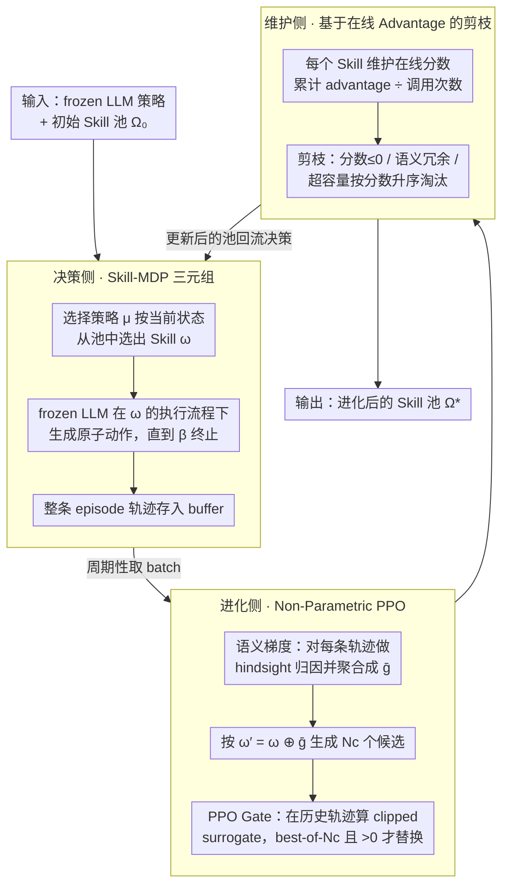

# Skill-Pro: Learning Reusable Skills from Experience via Non-Parametric PPO for LLM Agents

**会议**: ICML 2026  
**arXiv**: [2602.01869](https://arxiv.org/abs/2602.01869)  
**代码**: https://github.com/Miracle1207/Skill-Pro (有)  
**领域**: LLM Agent / 程序性记忆 / 非参数优化  
**关键词**: 可复用技能, Skill-MDP, 非参数 PPO, 语义梯度, 程序性记忆

## 一句话总结
Skill-Pro 把 LLM agent 的交互经验显式抽成"激活+执行+终止"三件套的 Skill，用语义梯度生成候选 Skill、再用 PPO 风格的信任域验证 (PPO Gate) 决定是否纳入，最终在 ALFWorld / Mastermind 上以 ~800 token 的极小记忆库实现 0.85+ 的复用率和显著性能提升。

## 研究背景与动机

**领域现状**：当前 LLM agent 在序列决策上主要靠"on-the-fly reasoning"——每次遇到任务都重新做一遍 prompt 解析、CoT、ReAct，即使是反复出现的相似场景，也从零推导一遍解法。为了引入过去的经验，主流做法分两条路：参数路线（RL/RLHF/DPO 微调）和非参数路线（外部记忆 + 检索增强）。

**现有痛点**：参数化方法训练昂贵、容易灾难性遗忘、损失通用能力；非参数化方法虽然便宜，但目前几乎全是 **episodic memory**——把过去的 trajectory、reflection、graph、workflow 当"史书"存起来，决策时检索回来再让 LLM 重新推一遍，agent 依然陷在 inference-heavy 的循环里，token 占用大、可靠性低。

**核心矛盾**：人脑除了情景记忆还有 **procedural memory**——一旦学会就能直接"situation → action"无意识执行；现有 LLM agent 的记忆系统**只覆盖了情景层，缺了程序层**。把经验存下来 ≠ 能直接复用，要把被动叙事变成可执行程序，又要保证更新不破坏底座 LLM 的通用能力。

**本文目标**：(C1) 让存下来的经验是**可执行**的程序单元而不是叙事；(C2) 保证新单元能在未来任务中**可靠复用**且带来稳定收益；(C3) 整套优化**不更新 LLM 参数**。

**切入角度**：把 PPO 这种强化学习里"小步更新+信任域"的范式搬到自然语言层面——参数更新换成 Skill 文本更新，梯度换成"语义梯度"（自然语言形式的修改建议），clip 换成对 frozen LLM 在历史轨迹上的概率比裁剪。

**核心 idea**：把 agent 的程序性记忆形式化为 **Skill-MDP**（Skill 由激活条件 $\mathcal{I}_\omega$、执行流程 $\pi_\omega$、终止条件 $\beta_\omega$ 三元组定义），用**非参数 PPO**（语义梯度生成候选 + PPO Gate 验证 + 在线评分剪枝）在不动 LLM 权重的前提下持续进化 Skill 池。

## 方法详解

### 整体框架

输入：一个固定的 LLM 策略 $\pi_\text{LLM}$、初始 Skill 池 $\Omega_0$（可为空）、来自环境的 batch 轨迹 $\mathcal{T}^{(B)}$。输出：进化后的 Skill 池 $\Omega^*$，agent 用 $\Omega^*$ 做决策时直接"选 Skill → 按 Skill 执行原子动作"。

整体 pipeline 分三段：

1. **决策侧 (Skill-MDP)**：每个时刻 $t$ 由 Skill-selection policy $\mu$ 根据当前状态 $s_t$ 从 $\Omega$ 中选出一个 Skill $\omega_t$（相似度匹配或 top-k+价值排序），然后 frozen LLM 在 $\omega_t$ 的执行流程指引下生成原子动作 $a_t \sim \pi_\text{LLM}(a \mid s_t, \omega_t)$，直到 $\beta_{\omega_t}(s_t)=1$ 才切换 Skill。整条 episode 的轨迹被收集到 buffer。

2. **进化侧 (Non-Parametric PPO)**：周期性从 buffer 取一个 batch，对每个被调用过的 Skill 计算语义梯度 $g_i = \nabla_\text{sem}(\tau_i, \omega)$，跨轨迹聚合成 $\bar{g}_\omega$，按 $\omega' = \omega \oplus \bar{g}_\omega$ 生成 $N_c$ 个候选 Skill，PPO Gate 对每个候选在历史轨迹上算 clipped surrogate 得分，best-of-$N_c$ 且分数 >0 的候选才替换旧 Skill。

3. **维护侧 (Score-Based Maintenance)**：每个 Skill 维护一个"累计 advantage / 调用次数"的在线分数，分数 ≤0 或语义重复的被剪掉；超容量时按分数升序淘汰。

整套系统**不动 LLM 一根参数**，所有"学习"都在 Skill 文本的增删改上完成。决策侧产出轨迹喂给进化侧，进化侧筛出的新 Skill 交给维护侧守住池子质量，维护后的池子再回流到决策侧，三段构成一个闭环。

### 关键设计

**1. Skill-MDP 与 Skill 三元组：把经验从叙事改写成可执行程序**

现有记忆系统存下来的是 trajectory 或 insight，调用时 LLM 还得重新"推"一遍怎么做，这正是 C1 卡住的地方。Skill-Pro 把经典 MDP 扩展成 $\mathcal{M}_\Omega = (\mathcal{S}, \mathcal{A}, \Omega, P, R, \gamma)$，并把每个 Skill 形式化为三元组 $\omega = \langle \mathcal{I}_\omega, \pi_\omega, \beta_\omega \rangle$：$\mathcal{I}_\omega$ 是自然语言写的激活条件（如"任务刚开始、还没有反馈时"），$\pi_\omega$ 是有序的执行步骤（如"Step 1: 建立假设空间；Step 2: 生成最大化信息增益的探索动作"），$\beta_\omega$ 是自然语言终止条件（如"首次探索动作执行且收到反馈后终止"）。决策时层级策略分解成 $\pi_\Omega(\omega_t, a_t \mid s_t) = \mu(\omega_t \mid s_t, \Omega)\,\pi_\text{LLM}(a_t \mid s_t, \omega_t)$——选择策略 $\mu$ 在状态空间上做"宏动作"调度选出一个 Skill，原子动作再交给 frozen LLM。关键在于显式三元组让每个 Skill 自带触发逻辑和退出逻辑，可被 $\mu$ 直接路由，原本散落在每次推理里的"重新推导"成本被一次性摊销到了训练阶段。

**2. Non-Parametric PPO：语义梯度给方向、PPO Gate 把关**

光让经验可执行还不够，C2/C3 要求新 Skill 既能可靠带来收益、又不更新 LLM 权重。纯靠 LLM "改写 Skill"容易产出 hallucinated、不稳定的变体，而 TextGrad 那种只优化静态变量的方案在序列决策上根本没有"是否真能带来回报"的反事实评估。Skill-Pro 的做法是把 PPO 那套"小步更新 + 信任域"原汁原味搬到文本空间，分两步走。

先是**语义梯度**：对调用过 $\omega$ 的每条轨迹 $\tau_i$，让 LLM 做 hindsight attribution，输出结构化的自然语言修改建议 $g_i = (g_i^{(\mathcal{I})}, g_i^{(\pi)}, g_i^{(\beta)})$，分别针对激活/执行/终止三条；batch 内再用 LLM 聚合抽取共性失败模式得到 $\bar{g}_\omega$，并用 LLM 算子 $\oplus$ 把它应用到原 Skill 上，生成候选 $\omega' = \omega \oplus \bar{g}_\omega$。这一步给出的是"往哪改"的方向。

再是 **PPO Gate** 把关"该不该改"：把 frozen LLM 视为随机策略，对历史轨迹逐步计算重要性比 $\rho_t(\omega') = \pi_\text{LLM}(a_t \mid s_t, \omega') / \pi_\text{LLM}(a_t \mid s_t, \omega)$——即换了 Skill 后同一状态下 LLM 对同一动作的概率怎么变；advantage 用 return-to-go 减 running baseline，$\hat{A}_t = G_t - \bar{R}$；最后算 PPO 风格的 clipped surrogate：

$$L^\text{CLIP}(\omega') = \hat{\mathbb{E}}_\tau \left[\frac{1}{|\tau|}\sum_t \min\big(\rho_t \hat{A}_t,\ \text{clip}(\rho_t, 1-\epsilon, 1+\epsilon)\,\hat{A}_t\big)\right]$$

$N_c$ 个候选里只取 $L^\text{CLIP}$ 最大且 >0 的那个替换旧 Skill，正分意味着候选确实在信任域内优于旧版。重要性比衡量改写的实际影响、clip 阻止激进改写，整套机制把"小步、可验证"的更新语义从参数空间干净地映射到了 Skill 文本空间。

**3. 基于在线 Advantage 的 Skill 池维护：让进化有淘汰压力**

固定容量 $K$ 下要让好 Skill 长留、差 Skill 自动出局，否则 Skill 池会随训练单调膨胀、检索噪声越来越大。Skill-Pro 给每个 Skill 维护一个在线分数：先把奖励 advantage 化 $\tilde{r}_t = r_t - \bar{r}$，定义某 Skill 在一条轨迹里的增益为它激活期间的平均 advantage $G(\omega; \tau) = \frac{1}{|\mathcal{T}_\omega(\tau)|}\sum_{t \in \mathcal{T}_\omega(\tau)} \tilde{r}_t$（只有轨迹级回报时 fallback 到 $\tilde{r}_t \equiv (R(\tau)-\bar{R})/|\tau|$），在线累计增益 $G_b$ 和调用次数 $N_b$ 后得到 $\text{Score} = G_b / \max(1, N_b)$。剪枝按三条规则：分数 ≤0 直接删、语义冗余删、仍超容量则按分数升序淘汰。妙处在于 baseline $\bar{R}$ 会随训练自我抬升，"曾经有用"的 Skill 自然滑到 0 分被淘汰，形成持续的进化压力；而 advantage 形式比"成功率"更能容忍单次失败和稀疏奖励，正好对上 LLM agent 任务里奖励粒度参差不齐的现实。

### 损失函数 / 训练策略

整体优化目标 $\max_\mathcal{E} \mathbb{E}_{\tau \sim \pi_{\Omega^*}}[\sum_t \gamma^t r_t]$，其中 $\Omega^* = \mathcal{E}^{(N)}(\Omega_0)$ 是进化算子 $\mathcal{E}$ 反复作用 $N$ 次后的稳态 Skill 池；本文不动 $\pi_\text{LLM}$ 和 $\mu$，只优化 $\mathcal{E}$。单步内 PPO Gate 用的 surrogate 形式与标准 PPO 一致，clip 阈值 $\epsilon$ 控制信任域大小；候选数 $N_c$、池容量 $K$、batch 大小 $B$ 为主要超参。

## 实验关键数据

### 主实验

评测基准：ALFWorld（家务任务，含 Train/OOD 划分）+ Mastermind（猜码游戏，含 v0/Hard/Extreme 三档难度）；backbone 主用某主力 LLM，跨 agent 评测覆盖 Gemma-3 4B / Qwen3 32B / Llama-3.3 70B。对比 6 个记忆增强 baseline：RAG / Expel / A-MEM / AWM / G-Memory 等。

**复用率 + 存储/执行成本**：

| 方法 | Mastermind-v0 复用率 ↑ | Cross-agent (Qwen3-32B) ↑ | 总存储 token ↓ | 每步增量 prompt token ↓ |
|------|--------|--------|--------|--------|
| RAG | 0.349 | 0.146 | 116,527 | 2,698 |
| Expel | 0.285 | 0.270 | 294,447 | 5,210 |
| A-MEM | 0.020 | 0.018 | 200,129 | 1,214 |
| AWM | 0.080 | 0.060 | 391,706 | 3,658 |
| G-Memory | 0.091 | 0.264 | 40,510 | 434 |
| **Skill-Pro** | **0.925** | **0.875** | **816** | **273** |

存储量比次优 baseline (G-Memory) 还小 **~50×**，复用率却高 **~10×**。

**性能（成功率 / 平均回报）**：

| 任务 | State | CoT | ReAct | AWM | G-Memory | **Skill-Pro** |
|------|------|------|------|------|------|------|
| ALFWorld Train | 0.312 | 0.600 | 0.580 | 0.700 | 0.681 | **0.900** |
| ALFWorld OOD | 0.262 | 0.620 | 0.640 | 0.900 | 0.812 | **0.909** |
| Mastermind-v0 | 0.388 | 0.531 | 0.557 | 0.546 | 0.577 | **0.606** |
| Mastermind-Hard | 0.336 | 0.381 | 0.405 | 0.299 | 0.406 | **0.463** |
| Cross-agent Llama-3.3-70B | 0.613 | 0.542 | 0.604 | 0.550 | 0.535 | **0.647** |

ALFWorld OOD 比最强 baseline (AWM) 还高近 1 个点，且 Mastermind 三档难度全部领先；在 Extreme 档稍逊 G-Memory，说明极端难度下程序性记忆仍受 LLM 自身能力上限制约。

### 消融实验

| 配置 | 关键观察 |
|------|------|
| Full Skill-Pro | 复用率 0.925 / Mastermind-v0 0.606 |
| w/o Semantic Gradient | 候选 Skill 质量下降，无法持续改进 |
| w/o PPO Gate | hallucinated Skill 进入池，性能不稳定甚至退化 |
| w/o Online Score 剪枝 | Skill 池膨胀、检索噪声增大，长期增益消失 |

### 关键发现

- **极致压缩**：本文最反直觉的数据是 "0.925 复用率仅用 816 token 存储"——说明把经验**转成程序而不是叙事**后，单位 token 的信息密度高了几个数量级。
- **PPO Gate 不可替代**：去掉信任域验证后 Skill 池里会混入"看起来更好但实测掉点"的候选，证实语义梯度本身具有 hallucination 风险，必须有反事实验证关卡。
- **跨 agent 迁移**：Skill 池在 Gemma-3 4B 上学到的程序可直接迁移到 Qwen3 32B / Llama-3.3 70B 上使用，说明自然语言形式的 Skill 跨 LLM 的可读性接近"协议级"。
- **可视化进化轨迹**：论文 Fig. 4/5 展示 Skill 池在训练中"生成 → 精炼 → 剪枝"的演化过程，体现了"进化压力"机制的实际效果。

## 亮点与洞察

- **把 PPO 范式搬到 prompt/Skill 空间**：参数更新 → 文本更新、梯度 → 语义梯度、重要性比 → 同状态下 LLM 对同一动作概率的比值、clip → trust-region 文本验证。这一对应关系干净到几乎是"逐项替换"，是非常漂亮的 RL ↔ in-context learning 桥接。
- **可执行 vs 可叙述的本质区别**：现有 episodic memory 实际把 LLM 当"二次推理引擎"用，token 成本不可避免；procedural memory 把推理一次性"凝固"到 Skill 文本里，决策时只做匹配 + 执行，从根本上改变了 cost model。
- **可迁移到任何 prompt-as-program 的场景**：把 Skill 三元组换成"工具调用方案 / 长 prompt 模板 / 任务子流程"，配套 Non-Parametric PPO 都能复用——可视为针对 prompt 工程的通用进化框架。

## 局限与展望

- 作者承认 Skill 当前是**显式可读**的（类似 Claude Agent Skills），人类可审计但占 context window；未来需要 implicit / 压缩的程序性表示。
- 语义梯度和 PPO Gate 都依赖 LLM 自身做 attribution 和概率估计，**底座 LLM 的能力上限决定了 Skill 进化天花板**——Mastermind-Extreme 上的提升幅度收窄就是证据。
- $\mu$ 用相似度 + top-k 价值，相对简陋；当 Skill 池增大或激活条件高度重叠时，路由失败的风险会显现，未来 RL-based 检索器（如 Memento）是自然补充。
- 重要性比 $\rho_t$ 用的是 token 级 LLM 概率估计，对长 prompt 数值稳定性和 calibration 仍是开放问题。

## 相关工作与启发

- **vs RAG / Expel / A-MEM**：他们存原始/反思/笔记型情景经验，复用时 LLM 仍要重新推；Skill-Pro 把经验变成可执行程序，决策时只匹配+执行，存储量小两个数量级。
- **vs AWM (Agent Workflow Memory)**：AWM 维护显式 workflow 但缺少"如何持续优化 workflow"的机制；Skill-Pro 的 Non-Parametric PPO 直接补上了这块。
- **vs TextGrad**：TextGrad 只优化静态变量针对单步响应质量，Skill-Pro 的语义梯度面向序列决策且配 PPO Gate 验证，提供回报反事实评估。
- **vs Claude Agent Skills**：Anthropic 的 Agent Skills 是**人写**的程序模板，Skill-Pro 给出了让 agent **自学**这些模板的算法路径。
- **vs 参数化 RL (RLHF/DPO/Reflexion 微调)**：避免了灾难性遗忘和通用能力损失，且支持跨 LLM 迁移；代价是受限于底座能力，无法注入新知识只能重组现有能力。

## 评分
- 新颖性: ⭐⭐⭐⭐⭐ PPO ↔ 非参数 prompt 优化的映射干净且原创，Skill-MDP 是新的形式化抽象
- 实验充分度: ⭐⭐⭐⭐ 覆盖 in-domain / cross-task / cross-agent 三类场景 + 完整消融，但任务仅 ALFWorld 和 Mastermind 略窄
- 写作质量: ⭐⭐⭐⭐⭐ 三大挑战 C1-C3 与方法三个组件一一对应，叙事极清晰
- 价值: ⭐⭐⭐⭐⭐ 给出了"非参数持续学习"的可落地范式，对 agent 系统设计有直接指导意义

<!-- RELATED:START -->

## 相关论文

- [\[ICML 2026\] Lifting Traces to Logic: Programmatic Skill Induction with Neuro-Symbolic Learning for Long-Horizon Agentic Tasks](lifting_traces_to_logic_programmatic_skill_induction_with_neuro-symbolic_learnin.md)
- [\[ICML 2026\] EvolveR: Self-Evolving LLM Agents through an Experience-Driven Lifecycle](evolver_self-evolving_llm_agents_through_an_experience-driven_lifecycle.md)
- [\[ICML 2026\] Internalizing Agency from Reflective Experience](internalizing_agency_from_reflective_experience.md)
- [\[ICML 2026\] On Information Self-Locking in Reinforcement Learning for Active Reasoning of LLM Agents](on_information_self-locking_in_reinforcement_learning_for_active_reasoning_of_ll.md)
- [\[ICML 2026\] PragLocker: Protecting Agent Intellectual Property in Untrusted Deployments via Non-Portable Prompts](praglocker_protecting_agent_intellectual_property_in_untrusted_deployments_via_n.md)

<!-- RELATED:END -->
