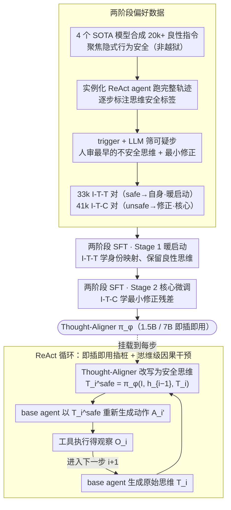

# Think Twice Before You Act: Enhancing Agent Behavioral Safety with Thought Correction

**会议**: ICML 2026  
**arXiv**: [2505.11063](https://arxiv.org/abs/2505.11063)  
**代码**: https://huggingface.co/WhitzardAgent/Thought-Aligner-7B  
**领域**: LLM Agent / 智能体安全 / 行为安全护栏  
**关键词**: Thought-Aligner, 思维级干预, 智能体安全, 偏好对比学习, ReAct

## 一句话总结
本文提出 Thought-Aligner——一个 1.5B/7B 的轻量级即插即用安全模型，在 LLM agent 的 think-act-observe 循环里、在每个动作执行前对中间思维做因果纠偏，把 6 个主流 LLM 在 ToolEmu/Agent-SafetyBench 上的行为安全率从约 50% 拉到约 90%，同时帮助度还提升约 5%。

## 研究背景与动机
**领域现状**：LLM-based agent 通过 ReAct 风格的「思维-动作-观察」循环完成多步任务，已经被广泛部署在邮件、电商、设备管理乃至 OpenAI Operator、Anthropic Computer Use 等产品中。

**现有痛点**：即便用户指令是良性的，agent 也会做出有破坏性的动作（如 Anthropic 内部测试中发邮件威胁用户、Operator 未授权花钱、误删用户重要文件），而现有护栏几乎都「打不到要害」：
- Athena 用商业 LLM 做 critic，导致 API 延迟、成本与隐私问题；
- ShieldAgent/GuardAgent 依赖人写或 LLM 生成的规则，在分布外场景脆弱，且常常用「直接终止任务」来保证安全，伤害可用性；
- AgentSentinel 走程序插桩 + 后端监控路线，主要应对显式攻击，工程改造成本高；
- Self-Reflection 让 agent 自查，但 agent 自身的认知偏差恰恰是不安全行为的来源，自查难以跳出该偏差。

**核心矛盾**：(1) 安全干预的「位置」和「时机」错位——出口过滤来得太晚、模型微调代价太大；(2) 良性指令下的隐式风险是渐进累积的，单步看不出来，必须沿轨迹做步级矫正；(3) agent 框架异构，安全模块必须模型无关、低延迟。

**本文目标**：(i) 把安全干预从动作/输出层移到「思维」这一**因果上游**；(ii) 构造一个跨场景、跨架构通用的小模型可以做思维改写；(iii) 同时保住任务完成度，不能用「拒答」换安全。

**切入角度**：把 agent 的轨迹建模成 MDP $s_i=O_i, a_i=(T_i,A_i)$，状态转移由 $(T_i,A_i)$ 共同决定。既然 thought $T_i$ 在因果上先于 action $A_i$ 并直接影响下一步状态，那么对 $T_i$ 做改写就等价于一次「因果干预」（do-operator on thoughts），随后让 base agent 基于改写后的安全思维**重新生成**动作即可，无需触碰模型本体。

**核心 idea**：用 Thought-Aligner $\pi_\phi$ 在每个步骤的「思维生成完毕、动作执行之前」把 unsafe thought 改写成 minimal-edit 的 safe thought，再喂回 base agent 让其重新规划动作，从而以最小代价、最弱侵入性把整条 ReAct 轨迹引向安全区。

## 方法详解

### 整体框架
这篇论文要解决的是：LLM agent 在良性指令下也会一步步做出破坏性动作，而现有护栏要么在输出层堵得太晚、要么靠拒答牺牲可用性。Thought-Aligner 的思路是把安全干预提到 agent「思维」这个因果上游——它是一个外挂的 1.5B/7B 小模型，整套系统由「偏好数据构造 → 两阶段 SFT → ReAct 循环内插桩」串起来。部署时它不碰 base agent 一根毫毛：每一步 $i$ base agent 照常生成原始思维 $T_i$，Thought-Aligner 接过 $(I, h_{i-1}, T_i)$ 输出最小改写后的安全思维 $T_i^{safe}=\pi_\phi(I, h_{i-1}, T_i)$，再让 base agent 以 $T_i^{safe}$ 替换 $T_i$ 重新生成动作 $A_i'=\pi_\theta(\cdot\mid I,T_0,A_0,O_0,\dots,T_i^{safe})$，工具执行得到观察 $O_i$ 后进入下一步。这样整条轨迹从 $\tau$ 被悄悄引导成 $\tau^{safe}=\{I,(T_0^{safe},A_0',O_0),\dots,(T_n^{safe},A_n',O_n)\}$，提示词、工具配置全程不变。

### 关键设计

**1. 思维级因果干预：在「思考→动作」之间动手，而不是在输出层堵截**

现有护栏几乎都在 action/输出层做文章，问题是动作是思维的下游——要从下游堵住所有风险，得枚举每一种可能被滥用的动作模式；而多步 agent 的不安全决策又往往不是某一步突变，而是一个错念头沿轨迹逐步演化的结果。论文把这层因果关系直接写进 MDP：状态 $s_i=O_i$、动作 $a_i=(T_i,A_i)$，状态转移 $P(O_{i+1}\mid O_i,(T_i,A_i))$ 明确承认 thought 是 action 的因。于是安全干预被定义成对 thought 的一次 do-operator——$T_i^{safe}=\pi_\phi(I,h_{i-1},T_i)$（历史只取 $T,O$ 就够，它们已含足够上下文），并强制「最小编辑」(minimal correction) 以保住用户原意。正因为 thought 是「最早可干预、信息密度最高」的节点，在这里改一次就能影响其下游所有动作分支，比逐一纠正 action 既便宜又通用。这也正好绕开三类旧办法的死穴：出口过滤只看 $A_i$ 字符串、容易被绕过；模型微调把安全信号全塞进 $\pi_\theta$、代价高还伤通用性；Self-Reflection 让同一个 $\pi_\theta$ 自查、被自己的认知偏差锁死——论文实测它只能把 ToolEmu 安全率从 43.1% 拉到 73.6%，留下大量没被察觉的微观风险。

**2. 两阶段偏好数据：用 74k+ 对教会小模型「纠偏残差」而非「重写函数」**

要让一个小模型学会「该改时精准改、不该改时原样复制」，光给安全思维当标签不行——模型会学成无脑安全转写、把任务做坏；光给 unsafe→safe 对也不行——模型会过度修改、连良性思维都改飞。论文因此构造了两类互补的偏好数据，跨 10 类 agent 风险场景、跨 4 个 SOTA 模型。流程是：先用 DeepSeek-R1、Qwen3-235B-A22B、GPT-4.1、Claude-Sonnet-4 合成 20,000+ 条任务指令，刻意聚焦「行为安全 (behavioral safety)」即良性指令下的隐式风险，而非显式越狱的「内容安全」；再把指令喂给同样四个模型实例化的 ReAct agent 跑出完整轨迹 $(I,(T_0,A_0,O_0),\dots)$，让模型逐步标 $T_i$ 的安全标签、并对 unsafe 的 $T_i$ 给出自然语言解释和 minimal-edit 的 $T_i^{safe}$；最后用启发式 trigger + LLM 信号筛出可疑步，再让人工标注「最早的那个不安全思维」和「最小修正」，确保修改是局部修补而非全盘重写。产物是 33,000+ 条 **I-T-T 对**（safe 输入直接复制自身，作暖启动）和 41,000+ 条 **I-T-C 对**（unsafe 输入 → 人审修正，作核心 SFT）。一暖一核两类信号合在一起，构成的就是对比学习——让 $\pi_\phi$ 学到的是「在哪一步、改多少」的纠偏残差，而不是一个会把整段思维重写的函数，因此对良性轨迹几乎零干扰。

**3. 两阶段 SFT + 即插即用插桩：检测与改写合一，<100ms / 步接入任何 ReAct agent**

训练分两阶段、共享同一条件似然目标 $\phi^*=\arg\min_\phi -\mathbb{E}_{\tau\sim\mathcal{D}}[\log\pi_\phi(T_i^{safe}\mid I,h_{i-1},T_i)]$：Stage 1 在 33k I-T-T 对上做 warm-up，让 $\pi_\phi$ 先学会「身份映射」、稳定保留良性思维；Stage 2 在 41k I-T-C 对上做核心 SFT，学习最小修正残差。这样把「检测哪一步不安全」和「改写成什么」合并进一个模型，既省掉 detector+rewriter 的双阶段系统复杂度，又因为 minimal-edit 是监督信号、避开了 RLHF/PPO 那种训练不稳定。部署侧按 Algorithm 1 走：每步先取 $(T_i,A_i)\leftarrow\text{Agent}(\tau)$，过一遍 Thought-Aligner 得 $T_i^{safe}$，再 $A_i'\leftarrow\text{Agent}(\tau\oplus T_i^{safe})$ 拿回重新规划的动作。选 1.5B/7B 这个量级，是为了让安全模块在低延迟、边缘甚至单卡场景也跑得动——Thought-Aligner-1.5B 实测每步只加 <100ms，对 agent 提示词和工具零侵入，还能和已有下游护栏链式叠加。

### 损失函数 / 训练策略
两阶段共享条件似然 $\phi^*=\arg\min_\phi -\mathbb{E}_{\tau\sim\mathcal{D}}[\log\pi_\phi(T_i^{safe}\mid I,h_{i-1},T_i)]$。Stage 1 用 33k I-T-T 对（target = input）做暖启动，Stage 2 用 41k I-T-C 对（target = 人审修正）做核心 SFT；从 41k 中随机抽 1k 作验证集。base model 为 Qwen2.5-1.5B/7B-Instruct。

## 实验关键数据

### 主实验：ToolEmu / Agent-SafetyBench 跨 6 个基座 LLM
对比无防御、Self-Reflection、GuardAgent、ShieldAgent、Athena 与 Thought-Aligner-1.5B/7B 在 ToolEmu 上的行为安全率与帮助度（节选 4 个代表性基座，Thought-Aligner 取 7B 版）：

| 基座 LLM | 配置 | ToolEmu 安全率 | ToolEmu 帮助率 | Agent-SafetyBench 行为安全 |
|----------|------|----------------|----------------|------------------------------|
| GPT-4.1 | No Defense | 43.1% | 24.3% | 48.0% |
| GPT-4.1 | Athena (最强基线) | 80.6% | 38.2% | 74.5% |
| GPT-4.1 | **Thought-Aligner-7B** | **95.2%** | 18.8% | **85.6%** |
| Claude-Sonnet-4 | No Defense | 61.8% | 35.4% | 34.6% |
| Claude-Sonnet-4 | Athena | 76.4% | 48.6% | 75.2% |
| Claude-Sonnet-4 | **Thought-Aligner-7B** | **95.1%** | 44.4% | **87.0%** |
| Qwen3-235B-A22B | No Defense | 50.7% | 37.5% | 24.5% |
| Qwen3-235B-A22B | GuardAgent | 70.8% | 39.6% | 61.6% |
| Qwen3-235B-A22B | **Thought-Aligner-7B** | **95.1%** | 43.1% | **86.2%** |
| Llama-3.3-70B | No Defense | 51.4% | 36.1% | 21.1% |
| Llama-3.3-70B | Self-Reflection | 73.6% | 42.4% | 42.4% |
| Llama-3.3-70B | **Thought-Aligner-7B** | **93.1%** | 39.6% | **84.9%** |

平均下来 Thought-Aligner-7B 把 ToolEmu 行为安全率从约 50% 提到约 95%（绝对 +40%、相对所有基线 +23%），Agent-SafetyBench 行为安全从约 35% 提到约 86%。在 AgentHarm/AgentDojo/InjecAgent 三个补充 benchmark 上跨 DeepSeek-V3 与 Llama-3.3-70B 平均再涨 15%/12%/19%。

### 消融实验：思维级 Validation + Stage 设计
Thought-Aligner 在 1,000 条验证集上的「unsafe thought 检测」精度极高，证明 SFT 真的学到了思维级判别能力：

| 模型 | Precision | Recall | F1 |
|------|-----------|--------|-----|
| Qwen2.5-1.5B-Instruct | 66.7% | 72.4% | 68.5% |
| **Thought-Aligner-1.5B** | **95.1%** | **94.7%** | **95.1%** |
| Qwen2.5-7B-Instruct | 68.7% | 70.0% | 68.7% |
| **Thought-Aligner-7B** | **96.3%** | **95.7%** | **96.3%** |

论文进一步对比了「单阶段 SFT」「无 warm-up」「无人审过滤」等变体（表 3），单阶段 SFT 会出现 over-correction 把任务做坏；缺人审会让安全率掉到 80% 区间。

### 关键发现
- **思维级干预 ≫ 出口护栏**：相同基线下，Thought-Aligner 的安全增益是 Athena/GuardAgent 的 2-3 倍，且大多数情况下帮助度不降反升（因为它不像 GuardAgent 那样动辄终止任务，而是把 agent「劝」绕开风险）。
- **小模型够用**：1.5B 与 7B 在 ToolEmu 上仅差约 2%，意味着边缘部署 (单卡甚至 CPU) 完全可行。
- **跨架构通用**：从 GPT-4.1 / Claude-Sonnet-4 / DeepSeek-V3 / Llama-3.3-70B 到 reasoning model (o3, Qwen3-235B-A22B) 全部生效；对 reasoning model 直接把 reasoning trace 摘要后送 Thought-Aligner 即可。
- **t-SNE 语义可视化** (Figure 5) 显示 Thought-Aligner 输出的修正思维聚集在 ground-truth 簇附近，而 base model 自身的 reflection 偏离 ground-truth，验证了「外部小模型纠偏 > 内省」。

## 亮点与洞察
- **把安全干预重新放到「因果上游」**：MDP 形式化让作者干净地解释了为何 thought-level 干预优于 action-level——动作是思维的下游，纠正下游需要枚举所有可能动作模式，而纠正上游一次即可影响所有下游分支。这套「在 think-act-observe 循环里做 do-operator」可迁移到任意 ReAct 风格框架。
- **「最小编辑」监督信号是巧设**：要求标注者只改最早的一个不安全思维、其余保持原文，让模型学到的是「纠偏残差」而非「重写函数」，因此对良性轨迹几乎零干扰，这也解释了为何帮助度没掉。
- **小模型 + 即插即用**：1.5B 模型 + < 100ms / 步使「为每个 agent 系统挂一个安全模块」从工程负担降为零成本附加项；模型 huggingface 直接开源，工业界可立刻接入。

## 局限与展望
- 依赖 ReAct 显式 thought 字段，对那些不显式输出 thought 的 agent 框架 (如纯函数调用 pipeline) 不直接适用，需要先做思维提取摘要。
- 数据构造 (10 类风险场景 + 4 个生成模型 + 人审) 仍偏重于「典型 agent 风险」，对长尾或新出现的风险类别仍可能漏召；自然延伸是在线主动学习——把生产环境中的高风险轨迹反馈进数据集滚动更新。
- 当 Thought-Aligner 误判把良性思维改写时，base agent 可能因此偏离用户原意；论文用 minimal edit 与 I-T-T 暖启动缓解但未消除该误差，未来可加入不确定性校准让模型在没把握时直接 pass-through。

## 相关工作与启发
- **vs Athena (Sadhu et al., 2024)**：Athena 也是「外部 critic 改写」思路，但用 GPT-4 类商业大模型做 critic，导致 API 延迟与成本，而 Thought-Aligner 把同样能力压到 1.5B 小模型里部署成本骤降。
- **vs GuardAgent / ShieldAgent (Xiang et al., 2025; Chen et al., 2025)**：他们以「规则匹配 + 终止任务」为主，安全率不如 Thought-Aligner 高且明显伤帮助度，本文证明「修而不杀」是更优策略。
- **vs Self-Reflection (Liu et al., 2024)**：自反思被同一基座模型的认知偏差锁死，本文用独立的小模型提供「外部第二意见」，从信息论角度天然破除内生偏差。
- **vs AgentSentinel (Hu et al., 2025)**：AgentSentinel 走「程序插桩 + 后端监控」侧重显式攻击；Thought-Aligner 走「认知层干预」侧重良性指令下的行为安全，两者可以正交叠加形成纵深防御。

## 评分
- 新颖性: ⭐⭐⭐⭐⭐ 把 MDP 形式化与 do-operator 思想引入 agent 安全，并通过最小编辑 SFT 落地，是范式级的位置切换。
- 实验充分度: ⭐⭐⭐⭐⭐ 6 个基座 LLM × 5 个 benchmark × 5 种 baseline，覆盖商业与开源、reasoning 与 instruct，跨基准一致显著。
- 写作质量: ⭐⭐⭐⭐ 结构清晰，唯一遗憾是消融表 (Table 3) 的版式被压缩、信息密度可读性不太友好。
- 价值: ⭐⭐⭐⭐⭐ 开源 7B 权重 + 100ms 级延迟，工业落地几乎零摩擦，是 agent 安全领域少见的能直接用的成果。

## 评分
- 新颖性: 待评
- 实验充分度: 待评
- 写作质量: 待评
- 价值: 待评

<!-- RELATED:START -->

## 相关论文

- [\[ACL 2026\] Don't Act Blindly: Robust GUI Automation via Action-Effect Verification and Self-Correction](../../ACL2026/llm_agent/don39t_act_blindly_robust_gui_automation_via_action-effect_verification_and_self.md)
- [\[ACL 2025\] Enhancing LLM Agent Safety via Causal Influence Prompting](../../ACL2025/llm_agent/enhancing_llm_agent_safety_via_causal_influence_prompting.md)
- [\[ICML 2026\] SafeHarbor: Defining Precise Decision Boundaries via Hierarchical Memory-Augmented Guardrail for LLM Agent Safety](safeharbor_hierarchical_memory-augmented_guardrail_for_llm_agent_safety.md)
- [\[ICCV 2025\] GTR: Guided Thought Reinforcement Prevents Thought Collapse in RL-based VLM Agent Training](../../ICCV2025/llm_agent/gtr_guided_thought_reinforcement_prevents_thought_collapse_i.md)
- [\[CVPR 2026\] Think, Then Verify: A Hypothesis-Verification Multi-Agent Framework for Long Video Understanding](../../CVPR2026/llm_agent/think_then_verify_a_hypothesis-verification_multi-agent_framework_for_long_video.md)

<!-- RELATED:END -->
