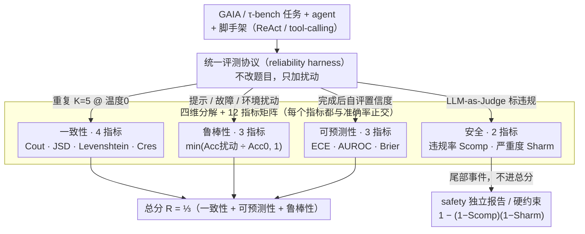

# Towards a Science of AI Agent Reliability

**会议**: ICML2026  
**arXiv**: [2602.16666](https://arxiv.org/abs/2602.16666)  
**代码**: https://hal.cs.princeton.edu/reliability/ (交互式 dashboard)  
**领域**: LLM Agent / 评测  
**关键词**: AI agent, 可靠性评测, 一致性, 鲁棒性, 校准, 安全可靠工程  

## 一句话总结
论文借鉴航空 / 核能 / 汽车等安全关键工程的成熟做法，把 AI agent 的"可靠性"分解为一致性、鲁棒性、可预测性、安全四个维度共 12 个与准确率无关的指标，在 GAIA 和 $\tau$-bench 两个基准上系统评测 15 个前沿模型，得出"过去 24 个月准确率猛涨、可靠性几乎没动"这一行业级结论。

## 研究背景与动机
**领域现状**：当前 agent 评测几乎完全围绕单次跑的平均任务成功率（mean accuracy），从 GAIA、$\tau$-bench 到 WebArena 都是同一套范式：一条提示词、一种环境配置、一次执行，取平均。

**现有痛点**：平均准确率掩盖了一切真正决定 agent 能否上生产的关键信号——多次跑同一任务能否得到同样结果？换个等价说法的指令还能跑通吗？工具偶尔超时怎么办？置信度高的时候是否真的更可能成功？发生错误时损失有多大？过去一年里 Replit AI 删生产库、OpenAI Operator 未授权下单、NYC 政府 chatbot 给违法商业建议，全部是"benchmark 看着不错、部署里翻车"的典型例证。Anthropic 一项 8 万人调研也把"不可靠性"列为对 AI 最大的担忧。

**核心矛盾**：可靠性本质上是多维度属性，但 ML 社区把它拆成若干孤立现象（prompt sensitivity、calibration、selective prediction 等）分别研究，缺一个统一的、与能力解耦的评估框架。能力（capability）和可靠性（reliability）应当是两条独立的进展轴，把它们混在一个准确率里会让两者都看不清。

**本文目标**：(i) 把跨行业 safety-critical 的可靠性概念翻译成 agent 可计算的指标；(ii) 在主流 benchmark 上系统测一遍现状；(iii) 给出 agent 评测、开发、治理三层面的具体建议。

**切入角度**：作者把 FAA、NRC、ISO 26262 等行业标准里反复出现的可靠性维度归纳成四类——consistency / robustness / predictability / safety；这四类在 ML 社区都有零散对应（如 pass$\wedge k$、prompt rephrasing、ECE、refusal evaluations），但从未被组织进同一框架。

**核心 idea**：用安全关键工程的"四维分解 + 12 指标"取代单一准确率，并通过 $K=5$ 次重复 + 提示扰动 + 故障注入 + 环境扰动 + 置信度抽取的统一协议在 15 个模型上落地。

## 方法详解

### 整体框架
这是一篇方法论 position：核心主张是"能力（capability）和可靠性（reliability）应该是两条独立的进展轴，不能再被单一准确率裹挟"。论文的论证方式是把航空 / 核电 / 汽车等安全关键工程里反复出现的可靠性维度翻译成 agent 可计算的指标，再用一套统一协议在 GAIA + $\tau$-bench 上把 15 个前沿模型测一遍，用实证数据反推出"准确率猛涨、可靠性停滞"的行业级结论。具体落地拆成三件事：先把现有 benchmark 改造成统一的可靠性测量台（**统一评测协议**），再把跑出来的信号映射进四维分解下的 12 个与准确率正交的指标（**四维分解 + 12 指标矩阵**），最后用 **safety 独立于总分** 的聚合策略合成可比分数——一套扰动各自喂给不同维度，一次运行就同时产出全部 12 个指标。

### 关键设计

**1. 统一评测协议：用同一套扰动让旧 benchmark 同时测全 12 指标**

框架要落地，关键在于不重新造题，而是把 GAIA、$\tau$-bench 包成一个可靠性测量台（reliability harness）：每题跑 $K=5$ 次、温度设 0（任何方差都归因于 floating-point / batch / kernel 调度等系统源而非采样），用 GPT-4o 自动生成 $J=5$ 种等价改写测 prompt 鲁棒性，对工具调用注入概率 $p_\text{fault}=0.2$ 的失败/超时，环境扰动改 JSON 字段名 / 顺序 / 日期格式，agent 完成后被提示"给自己打分"抽取 confidence，再用 LLM-as-Judge 对照约束集标安全违规。脚手架上 GAIA 用 ReAct + 浏览 / 代码 / 文件工具、$\tau$-bench 用 tool-calling。这套扰动各自喂给不同维度——重复跑喂一致性、三类扰动喂鲁棒性、置信度自评喂可预测性、违规标注喂安全——于是一次 apples-to-apples 的运行就同时产出全部 12 个指标的原始信号。$\tau$-bench 只取 Cuadron et al. 清理后的 26 题子集，因为论文对比完整集和清洗集发现清洗后 calibration 大幅改善，证明 benchmark 自身的质量都会扭曲可靠性测量——这也顺手把所有扰动参数公开成可复现的旋钮。

**2. 四维分解 + 12 指标矩阵：把"可靠吗"翻译成可计算标量**

协议跑出的原始信号要变成可比的标量，靠的是论文最核心的论点：可靠性不是一个模糊感受，而是可以被锚定到成熟工程标准上的一组量。作者把它拆成 consistency / robustness / predictability / safety 四维，每维都对应一条安全关键工程的成熟做法——consistency 对应 FAA flight-critical software 的"确定性执行"，robustness 对应汽车 / 航空对环境扰动的 graceful degradation，predictability 对应 NRC 的故障模式建模与分级风险分类，safety 对应 SIL 4 那种 $<10^{-5}$ 的危险失效率。每个维度再落 2–4 个 $[0,1]$ 区间的指标共 12 个：一致性用每任务成功率方差 $C_\text{out}=\frac{1}{T}\sum_t(2\hat p_t-1)^2$（以最大伯努利方差 0.25 归一）、轨迹层面的 JSD 与 Levenshtein、资源层面的 $C_\text{res}=\exp(-\overline{\text{CV}_r})$；鲁棒性统一成 $\min(\text{Acc}_\text{perturb}/\text{Acc}_0,1)$ 的 clipped ratio；可预测性用 ECE / AUROC / Brier 分测校准、判别、联合（聚合时取兼顾两者的 Brier 作 $\mathcal R_\text{Pred}$）；安全分 compliance（违规率）和 harm（条件期望严重度），合成成风险公式 $1-(1-S_\text{comp})(1-S_\text{harm})$。关键约束是每个指标都必须"与准确率正交"——比如 $C_\text{out}$ 在 $\hat p_t=0$ 和 $\hat p_t=1$ 两端都拿满分，于是一个总失败但稳定失败的 agent 不会被罚到 0，"稳不稳"由此从"会不会"里被彻底剥离出来。

**3. safety 独立于总分：常态可平均、尾部不可平均**

拿到 12 个指标后，怎么聚合本身就是一个有立场的设计：作者主张安全属于尾事件，绝不能和其他维度求平均掩盖掉。所以整体可靠性只取三维 $\mathcal R=\frac{1}{3}(\mathcal R_\text{Con}+\mathcal R_\text{Pred}+\mathcal R_\text{Rob})$，把 safety 单独以 hard constraint 形式报告，任何安全指标退化都触发独立警报。其依据是 Kaplan & Garrick 风险公式与 SIL 4 / FAA"一亿飞行小时一次灾难"的尾部视角——若与其他维度平均，"99% 安全 + 1% 灾难"会被压成"看起来挺安全"。同样的防主导思路也用在一致性内部，轨迹分量 $C_\text{traj}=\frac{1}{2}(C_\text{traj}^d+C_\text{traj}^s)$ 用 1/2 加权，避免它因 sub-metric 多而主导整维。这条设计把"评估必须区分常态指标与尾部指标"立成了原则。

## 实验关键数据

### 主实验

| 维度 | 24 个月内最强模型 vs 24 个月前 | 趋势 | 备注 |
|------|------|------|------|
| Accuracy ($\tau$-bench clean) | 显著上升 | 持续提升 | 主要驱动 |
| $\mathcal R$ (overall reliability) | 小幅上升 | 几乎停滞 | 与发布日期弱相关 |
| Outcome consistency $C_\text{out}$ | 持平 | 无系统提升 | 所有 frontier 都聚类似 |
| Prompt robustness $R_\text{prompt}$ | 小幅上升 | 仍是关键差异点 | 模型间差异大 |
| Calibration $P_\text{cal}$ | 明显提升 | 主要 Claude 推动 | 表明被显式优化 |
| Discrimination $P_\text{AUROC}$ | 不一致 | GAIA 上甚至下降 | 校准和判别需分别评估 |

### 维度内对比

| 配置 | 表现 | 说明 |
|------|------|------|
| GAIA Level 1→3 | 一致性单调变化 | 难度↑ 时 consistency 不形成 U 形而是单调下降 / 上升 |
| Reasoning vs non-reasoning | 可靠性略高 | 但提升幅度小于准确率 |
| 小模型 vs 大模型 | 一致性反而高 | 大模型多解路径增加 run-to-run 方差 |
| $\tau$-bench 完整 vs clean | 清洗后 predictability 显著改善 | 错误 ground truth 会误判 calibration |
| Safety 违规类型 | financial accuracy 最常见 | 数值推理在事务场景最脆 |

### 关键发现
- 24 个月准确率猛涨，但整体可靠性几乎不动，说明 "reliability is an industry-wide plateau rather than a vendor-specific limitation"。三家厂商在 $\mathcal R$ 上聚成一团，没有谁能在不增加能力的情况下显著买到可靠性。
- "What but not when" 模式：agent 在 distribution consistency（动作类型分布）上还行，但 sequence consistency（执行顺序）很差，说明动作选择 OK，规划层不稳。
- prompt robustness 仍然是模型间最大的区分器——面对等价 paraphrase 时模型差异巨大，且这种脆弱性反直觉地比工具超时 / 字段重排（环境扰动）更严重。
- safety 违规以"金融数值出错"最高发，模型规模 ↑ 时高严重度违规率显著下降，但 tail risk 不能用平均隐藏，因此必须独立报告。

## 亮点与洞察
- 把可靠性显式拆成"常态四维 + 尾部一维（safety 独立）"的聚合策略很值得复用：很多 ML 评测都犯了"平均掉尾事件"的错，这套设计可以直接搬到任何安全敏感的评测里。
- $C_\text{out}=(2\hat p_t-1)^2$ 这一关于伯努利方差的标准化巧妙地让"总是成功"和"总是失败"都拿满分，把"稳定性"从"会不会"完全剥离——非常清爽的指标设计。
- 论文把 $\tau$-bench 的 ground truth 错误问题量化进可靠性评估里（清洗前后 calibration 大幅改善），这其实是 benchmark hygiene 第一次被纳入可靠性框架——提醒所有人"评估器本身的噪声会污染被评估属性"。

## 局限与展望
- 仅覆盖 GAIA + $\tau$-bench 两个 benchmark，长程编程 agent（SWE-bench）、多模态浏览（VisualWebArena）都没测，结论的外推性需要打问号。
- 每个 benchmark 只用一套脚手架，scaffold 与可靠性的耦合是未解之谜——同一模型换 prompt + 工具策略可能直接换掉 reliability profile。
- 安全部分用 LLM-as-Judge 标违规，judge 本身的可靠性没在论文里独立测量；这是"用一个不可靠系统去判另一个系统是否可靠"的递归问题。
- temperature 固定为 0 高估了一致性—— production 通常用 $T>0$，这种情况下方差更大，论文给的 $\mathcal R$ 数值是乐观下界。
- 12 个指标 / 4 维分解 + 聚合权重都是设计选择，作者也承认存在其他合理拆分；未来可以做敏感性分析或允许部署者按场景配权。

## 相关工作与启发
- **vs HELM (Liang et al., 2022)**：HELM 也强调多维度评测，但聚焦能力子集（accuracy、bias、fairness），本文显式定义"reliability ≠ capability"并把维度限定在可靠性内部，更瘦更专。
- **vs pass$\wedge k$ / 一致性评估单点指标**：这些工作只盯一致性单维，本文把一致性置入更大框架，并加上鲁棒、可预测、安全三轴，提供更完整画像。
- **vs ML 校准 / 选择性预测文献**：现有 calibration 工作几乎只在分类任务上做，本文第一次系统把 ECE / AUROC / Brier 落在多步 agent 上，并提出"calibration 提升 ≠ discrimination 提升"的反直觉证据。

## 评分
- 新颖性: ⭐⭐⭐⭐ 跨学科借鉴 + 框架完整，但单项指标多沿用已有工作。
- 实验充分度: ⭐⭐⭐⭐ 15 模型 × 2 benchmark × 多扰动协议，规模足够；但 benchmark 覆盖窄。
- 写作质量: ⭐⭐⭐⭐⭐ 维度-指标-协议-发现-建议分层清晰，附录详尽，dashboard 可交互。
- 价值: ⭐⭐⭐⭐⭐ 直接为 agent 部署决策提供可比阈值，对治理 / 合规社区有立即可用的输出。

<!-- RELATED:START -->

## 相关论文

- [\[ACL 2025\] REPRO-Bench: Can Agentic AI Systems Assess the Reproducibility of Social Science?](../../ACL2025/llm_agent/repro-bench_can_agentic_ai_systems_assess_the_reproducibility_of_social_science_.md)
- [\[ICLR 2026\] Judge Reliability Harness: Stress Testing the Reliability of LLM Judges](../../ICLR2026/llm_agent/judge_reliability_harness_stress_testing_the_reliability_of_llm_judges.md)
- [\[ACL 2025\] REPRO-Bench: Can Agentic AI Systems Assess the Reproducibility of Social Science Research?](../../ACL2025/llm_agent/repro-bench_can_agentic_ai_systems_assess_the_reproducibility_of_research_claims.md)
- [\[NeurIPS 2025\] It's LIT! Reliability-Optimized LLMs with Inspectable Tools](../../NeurIPS2025/llm_agent/its_lit_reliability-optimized_llms_with_inspectable_tools.md)
- [\[ICML 2026\] Position: Agentic AI Orchestration Should Be Bayes-Consistent](position_agentic_ai_orchestration_should_be_bayes-consistent.md)

<!-- RELATED:END -->
