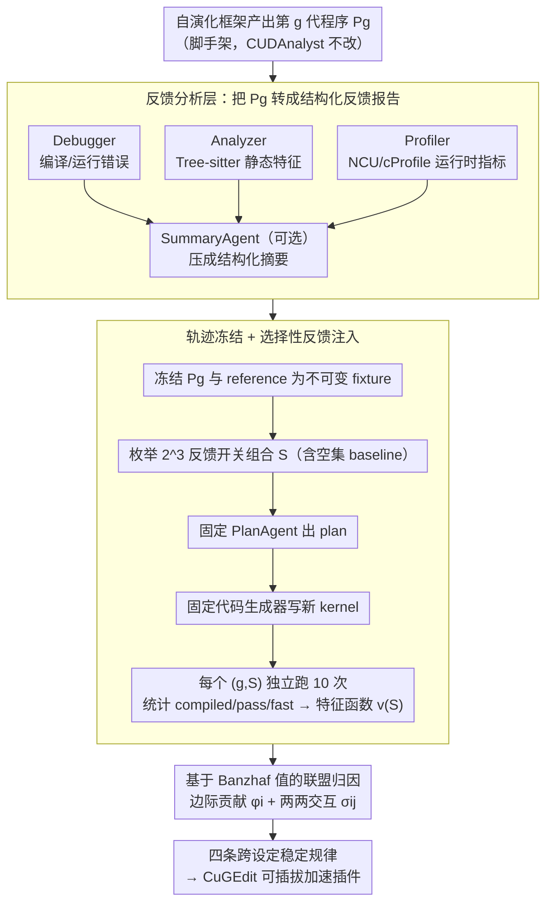

# Towards Feedback-to-Plan Decisions for Self-Evolving LLM Agents in CUDA Kernel Generation

**会议**: ICML 2026  
**arXiv**: [2605.26720](https://arxiv.org/abs/2605.26720)  
**代码**: https://github.com/yuxuan-z19/cudanalyst (有)  
**领域**: LLM Agent / 代码生成 / CUDA Kernel 优化  
**关键词**: self-evolving agent, CUDA kernel, 反馈归因, 轨迹冻结, Banzhaf value

## 一句话总结
针对自演化 LLM agent 写 CUDA kernel 的场景，提出 CUDAnalyst：通过"冻结某一代中间程序状态 + 选择性注入/屏蔽反馈"做生成级干预，并用 Banzhaf 联盟博弈解构 debugger / analyzer / profiler 三类反馈的边际贡献和高阶交互，得出"显式 plan 只有在反馈对齐时才有用、强模型的 plan 可向同家族弱模型迁移"等四条结论，并据此设计出 2.08×–10.32× 超过 torch.compile 的 CuGEdit 插件。

## 研究背景与动机

**领域现状**：当下 CUDA kernel 自动生成已经从一次性合成转向"自演化 agent"——LLM 在每一代里读取上一代代码的 debugger / static analyzer / profiler 输出，规划 (Plan) 出修改方案，再生成新代码。代表系统包括 FM Agent、STARK、ConCuR、OpenEvolve 等，普遍报告了显著加速。

**现有痛点**：评估这些 agent 时，主流做法是 *端到端消融*——关掉某个反馈源，从头或某 checkpoint 重跑整条进化轨迹，比较最终 speedup。这个范式存在两个问题：(1) 早期一点点扰动会被后续代代规划放大，导致"反馈效果"和"轨迹漂移"完全纠缠在一起；(2) 把整条轨迹聚合成单个标量，抹掉了"在哪一代、哪个反馈、起了什么作用"的细粒度信号。

**核心矛盾**：自演化的本质是 *跨代耦合*，而归因要的是 *同一决策点*的因果效应——两者天然冲突。只要还在让 agent 自己往下跑，就永远分不清"是反馈变了"还是"轨迹岔了"。

**本文目标**：(1) 设计一个能在固定决策点上做反馈干预的分析层；(2) 用博弈论工具量化每个反馈的边际贡献与两两交互；(3) 验证得到的结论是否在不同 backbone / 工作负载 / 进化算子下保持稳定；(4) 把稳定的规律封装成可插拔模块去帮真实系统提速。

**切入角度**：作者的关键观察是——反馈归因必须发生在 *固定的代* 上。只要把那一代生成出的程序状态 *冻结* 下来当 fixture，就可以在同一份代码上反复重放 plan，且每次只动反馈输入，这样得到的 plan/代码差异就只能归因于反馈本身。

**核心 idea**：把"自演化"和"反馈归因"在时间维度上解耦——演化照常跑产出轨迹快照；归因则在每个快照上做 controlled patching，用 Banzhaf 值对反馈联盟做博弈论级别的拆解。

## 方法详解

### 整体框架
CUDAnalyst 是一个"夹"在自演化框架（如 OpenEvolve）和 LLM planner 之间的分析层，它要解决的核心问题是：在不让 agent 继续往下跑、不被轨迹漂移污染的前提下，量化每一代里每个反馈对 plan 的因果贡献。做法是把演化和归因在时间上解耦——演化框架照常跑出第 $g$ 代程序 $P_g$，CUDAnalyst 则把 $P_g$ 冻成不可变快照，在这个固定 fixture 上只切换"送哪些反馈给 planner"，反复重放 plan→代码→评估。

具体分四步流转：先用 Debugger（编译/运行错误）、Analyzer（基于 Tree-sitter 的静态特征）、Profiler（NCU/cProfile 运行时指标）三个模块把 $P_g$ 转成结构化反馈报告，可选地交给 SummaryAgent 压缩；再把 $P_g$ 和 reference 冻死，对反馈三件套做 $2^N$ 种开关组合 $S \subseteq \{d,a,p\}$，每种联盟下固定 prompt/温度的 PlanAgent 出 plan、固定代码生成器写新 kernel；每个 $(g,S)$ 组合独立跑 10 次统计 compiled/pass/fast 三档结果，整理成特征函数 $v(S)$；最后用 Banzhaf 值和 Grabisch-Roubens 交互项把 $v(S)$ 拆成每个反馈的边际贡献和两两协同。整个流程刻意让 Plan 只看反馈、不看历史 plan，把"演化记忆"也排除在归因边界之外。

### 关键设计

**1. 轨迹冻结 + 选择性反馈注入：在同一份代码 fixture 上做 controlled patching**

自演化的反馈归因有个根本困难——它天然违反独立同分布：早期一点扰动会被后续代代规划放大，传统端到端消融"关掉某反馈再从头/某 checkpoint 重跑整条轨迹"得到的差异里，"反馈变了"和"轨迹岔了"完全纠缠，数学上根本无法支撑因果归因。本设计的解法是先在时间维度上"切片"：把每一代生成的 $P_g$ 缓存成不可变快照，reference 集合也一并固定避免重采样污染，然后锁死 planner、prompt、解码超参，*只* 切换哪些反馈被送进 PlanAgent。对反馈三件套 $\{d,a,p\}$ 枚举 $2^3=8$ 种开关组合（含空集 baseline $v(\emptyset)$），每种组合在同一份 $P_g$ 上重走"反馈→plan→代码→评估"管线 $k=10$ 次。因为每次实验只动反馈输入、其余全等，得到的 plan/代码差异就只能归因于反馈本身；而且计算预算是 $O(2^{|N|}k)$ 而非端到端的 $O(\text{generations}\times k)$，结果还能严格横向比较。

**2. 基于 Banzhaf 值的联盟归因：用合作博弈把"个体贡献"和"交互项"干净切开**

只看"开/关单一反馈"的差值会高估单个反馈的作用，因为反馈之间存在大量协同——比如 analyzer 先找出潜在 race，debugger 的报错才能定位。本设计把反馈归因建模成合作博弈 $\mathcal{G}=(N,v)$，玩家是 $N=\{\text{debugger},\text{analyzer},\text{profiler}\}$，特征函数 $v(S)$ 取反馈联盟 $S$ 下的 expected generation-level success。每个反馈的边际贡献用 Banzhaf 值

$$\phi_i(v) = \frac{1}{2^{|N|-1}} \sum_{S \subseteq N \setminus \{i\}} [v(S \cup \{i\}) - v(S)]$$

对所有子集等权平均；两两交互用 Grabisch-Roubens 项 $\sigma_{ij} = v(\{i,j\}) - v(\{i\}) - v(\{j\}) + v(\emptyset)$，正值表示互补、负值表示冗余或竞争。选 Banzhaf 而非 Shapley 是个细致但关键的建模区分：plan 决策里所有反馈是 *同时* 出现的、不存在到达顺序，等权平均比 Shapley 的"按排列加权"更契合实际语义。这套框架既给每个玩家公平 credit，又把交互项独立分离出来，比简单的 leave-one-out 信息量大得多。

**3. CuGEdit：把稳定规律封装成可部署插件，验证归因不是 post-hoc 解释**

归因若只停在"分析框架"层面，价值有限；本设计要证明挖出的规律能直接落地。从 RQ1–RQ3 提炼出四条跨 backbone/工作负载/进化算子都稳定的规律——反馈对齐才有用、多反馈晚期靠协同、强模型 plan 可向同家族弱模型迁移、摘要对弱模型尤其有效——封装成可挂到任意自演化框架的 CuGEdit 模块，含三个子组件：(a) Kernel-similarity-aware activation，只在当前 kernel 与缓存中相似 case 接近时才激活完整反馈分析以省 token；(b) Feedback summarization，用 SummaryAgent 把原始 profile 压成结构化摘要供弱模型直接消化；(c) Strong-to-weak plan distillation，在线把同家族强模型（DeepSeek-R1 / Qwen3-235B）的 plan 注入弱模型（DeepSeek-V3.2 / Qwen3-Coder-30B）上下文。在 KernelBench Level 3 上叠到 OpenEvolve 后，相比 torch.compile 取得 $2.08\times$–$10.32\times$ 加速，超过当时 baseline 和 SOTA——直接告诉系统设计者"什么时候开/关哪种反馈、何时上摘要、何时蒸馏 plan"。

### 训练策略
本文不训练任何模型，所有 PlanAgent / SummaryAgent / CodeAgent 都是 *fixed-prompt, fixed-decoding* 的现成 LLM 调用。实验在 PolyBench-ACC 上跑 10 次独立运行，置信区间用 95% CI；评估端用统一的 LLM 评估器保证跨实验可比性。

## 实验关键数据

### 主实验

| 研究问题 | 设定 | 关键发现 |
|---|---|---|
| RQ0 显式规划是否有用 | 2×2: {implicit, explicit} × {no feedback, full feedback} | P+NF (有 plan 无反馈) 持续掉点；P+F (有 plan 有反馈) 在所有模型上稳定提升，弱模型 (DeepSeek-V3.2, Qwen3-Coder-30B) 收益最大 |
| RQ1 哪种反馈最关键 | Banzhaf 值 + $\sigma_{dap}$ 三阶交互 | 早期 (gen 0-2) 单反馈贡献稀疏不稳；晚期 (gen 5-7) 交互项主导；analyzer 主导 compile，profiler 主导 fast，debugger 通过交互生效 |
| RQ2 摘要能否替代规划 | NP+S vs P+S vs P+F | 摘要 (P+S) 对弱模型加速明显，对强模型 (R1, Qwen3-235B) 增益微弱；NP+S 普遍弱于 P+S，证明摘要 ≠ 规划 |
| RQ3 强→弱 plan 蒸馏 | 把强模型的 plan 注入弱模型上下文 | 同家族迁移 (R1→V3.2, Qwen3-235B→Qwen3-Coder-30B) 增益最大；跨家族部分有效 |
| CuGEdit 实战 | KernelBench Level 3 vs torch.compile | $2.08\times$ – $10.32\times$ 加速，超过 SOTA |

### 消融实验

| 配置 | 关键指标变化 | 说明 |
|---|---|---|
| Implicit (OpenEvolve 默认) | baseline | 规划与代码生成耦合在单步内 |
| P+NF (有规划无反馈) | 全线下降 | 证明 plan token 本身没用 |
| P+F (有规划有反馈) | 稳定提升 | 反馈才是关键 |
| DP (Dummy Plan, 模板填充) | 弱模型下降为主 | 排除"token 预算/文本结构"混淆 |
| P+RF (随机反馈) | 所有模型下降 | 证明 "对齐" 是关键，不是"信息量" |
| 跨 backbone (Kimi-K2 / MiniMax-M2.5 / Gemini-2.5-Pro 冻结轨迹) | $\sigma_{ij}$ 模式稳定 | 工具协同结构与底座无关 |
| 跨工作负载 (NPB / XSBench / rkbench) | 定性规律一致 | 收敛速度不同但归因结构稳定 |
| 跨进化算子 (EoH / MCTS-AHD / LHNS / hill-climbing) | 轨迹高度同步 | 归因结构与进化算子解耦 |
| 跨领域 (CPU Numba N-body) | $12.5\times$ 峰值加速 | 归因框架不绑 CUDA |

### 关键发现
- **plan token 本身没价值**：P+NF 和 DummyPlan 都不提升甚至掉点；plan 的作用是"组织和复用对齐的反馈"，不是给 LLM 多一步思考。
- **晚期靠交互、早期靠单项**：随着代数增加，$\sigma_{dap}$ 主导分数增长——晚期程序暴露的失败模式越来越耦合（如 race condition 同时影响 compile 和 perf），需要多反馈合议。
- **强模型对 plan 语义不敏感**：DummyPlan 几乎不影响 R1/Qwen3-235B，但 P+RF (随机反馈) 全线掉点——说明强模型有自我纠错能力，但对"误导信号"无免疫力。
- **同家族迁移友好**：plan 的可迁移性受 representational 兼容性限制，跨家族 (e.g. DeepSeek→Qwen3) 增益打折，启发后续做 "agent ensemble" 时要考虑模型谱系。
- **CuGEdit 把分析变成生产力**：归因发现的"反馈对齐 + 多工具协同 + 同家族蒸馏" 三条规律直接转成可插拔模块，端到端拿到 $10.32\times$ 加速，证明这套分析框架不是 "post-hoc 解释"。

## 亮点与洞察
- **方法论亮点**：把博弈论 (Banzhaf / Grabisch-Roubens) 这套早就成熟的工具引入 LLM agent 归因，干净地切开"个体贡献"和"交互项"，比简单的 leave-one-out 信息量大得多——这套配方完全可以搬到其他 multi-tool agent (browse + code + retrieve) 的分析上去。
- **轨迹冻结 trick 普适**：不只用于 CUDA agent——任何"长 horizon、多反馈、迭代"的 agent (multi-agent debate, deep research, RAG with reflection) 都会被轨迹漂移污染消融，"冻结快照 + controlled patching"是通用解药。
- **令人"啊哈"的反直觉点**：plan 本身没用，反馈才是核心；DummyPlan 反而几乎不掉点说明 LLM 已经能从反馈里现场合成结构。这对"链式思考越长越好"的朴素叙事是一记打击。
- **可迁移 trick**：P+RF (随机反馈)对照——以后做任何 plan/tool agent 论文都该加这个 baseline，验证"是 plan 信号有用，还是仅仅 plan token 长有用"。

## 局限与展望
- **作者承认**：方法假设可以冻结"中间程序状态"，但 CUDA kernel 的 *semantic 演化属于哪个 program state element* 在编译器研究里都还是开放问题；本文为了能做归因，刻意把 cross-generation memory 放在了归因边界之外。
- **可改进**：(1) 反馈成员当前固定为三件套 $\{d,a,p\}$，$2^N$ 联盟枚举可以扩展但成本指数级；后续可以做近似 Banzhaf (Monte-Carlo sampling) 以支持更多反馈源（如 retrieval, performance counter, source diff）；(2) 评估全程用 PolyBench-ACC + KernelBench，对"长尾算子"（如 sparse attention, fused MoE）的泛化没有直接验证；(3) PlanAgent 与 CodeAgent 都用固定 prompt，没研究 prompt 对归因结果的稳定性（属于"实验设计的实验"层级）。
- **更大的疑问**：归因结论可能依赖于具体的反馈实现质量——如果换一个 profiler (例如更细粒度的 hardware counter)，$\phi_p$ 的相对大小会不会反转？这需要"归因的归因"实验。

## 相关工作与启发
- **vs OpenEvolve / FM Agent / STARK**：这些系统强调"如何让 agent 写得更好"，本文强调"如何科学地分析它为什么写得好"；CUDAnalyst 是这些系统的 *分析层*，可以挂上去而不改框架。
- **vs 传统端到端消融 (Novikov 2025, Liu 2024b)**：本文用 Fig.1 直接画出 E2E 的轨迹漂移，并通过 P+RF / DummyPlan / 跨 backbone 三组对照系统性反驳"E2E 消融够用"的常见做法。
- **vs Shapley-based prompt valuation (Liu 2024c)**：本文用 Banzhaf 而非 Shapley，理由是"plan 决策中反馈是并行而非顺序到达"——这是个细致但重要的建模区分。
- **vs CUDA-L1 (Li 2025b)**：CUDA-L1 通过 RL 改进生成器本身；本文不动模型，纯做归因和 plug-in 设计，两条技术栈正交，可叠加。

## 评分
- 新颖性: ⭐⭐⭐⭐ 把 Banzhaf 联盟归因 + 轨迹冻结引入 self-evolving agent 是干净的方法学创新，给"agent 行为归因"提供了可复用的范式。
- 实验充分度: ⭐⭐⭐⭐⭐ 4 个 RQ + 跨 backbone / 跨工作负载 / 跨进化算子 / 跨领域 (CPU Numba) 四套泛化实验 + 真正落地的 CuGEdit 端到端验证，少有的"分析论文带可部署模块"。
- 写作质量: ⭐⭐⭐⭐ 论证链清晰，Fig.1 一图说明"为什么 E2E 不靠谱"是高水平的 framing；偶尔记号略密 (e.g. P+NF / NP+S 缩写)。
- 价值: ⭐⭐⭐⭐⭐ 既是方法论贡献（给整个 self-evolving agent 社区一套归因工具），又是工程贡献（CuGEdit 直接 $10\times$ 提速）；对工业界做 LLM4Code / LLM4HPC 团队尤其有用。

<!-- RELATED:START -->

## 相关论文

- [\[ICML 2026\] EvolveR: Self-Evolving LLM Agents through an Experience-Driven Lifecycle](evolver_self-evolving_llm_agents_through_an_experience-driven_lifecycle.md)
- [\[ICLR 2026\] Your Agent May Misevolve: Emergent Risks in Self-evolving LLM Agents](../../ICLR2026/llm_agent/your_agent_may_misevolve_emergent_risks_in_self-evolving_llm_agents.md)
- [\[ICML 2026\] On Information Self-Locking in Reinforcement Learning for Active Reasoning of LLM Agents](on_information_self-locking_in_reinforcement_learning_for_active_reasoning_of_ll.md)
- [\[ACL 2026\] SEARL: Joint Optimization of Policy and Tool Graph Memory for Self-Evolving Agents](../../ACL2026/llm_agent/searl_joint_optimization_of_policy_and_tool_graph_memory_for_self-evolving_agent.md)
- [\[ICLR 2026\] InfiAgent: Self-Evolving Pyramid Agent Framework for Infinite Scenarios](../../ICLR2026/llm_agent/infiagent_self-evolving_pyramid_agent_framework_for_infinite_scenarios.md)

<!-- RELATED:END -->
