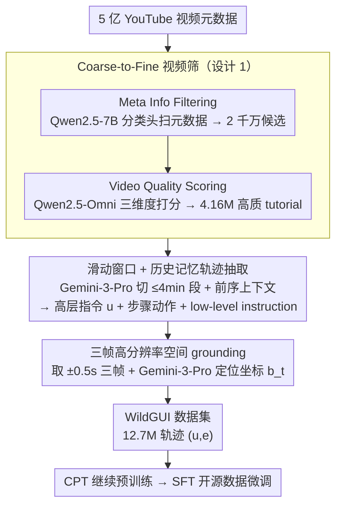

# Video2GUI: Synthesizing Large-Scale Interaction Trajectories for Generalized GUI Agent Pretraining

**会议**: ICML 2026  
**arXiv**: [2605.14747](https://arxiv.org/abs/2605.14747)  
**代码**: 项目页 <https://weiminxiong.github.io/Video2GUI/>  
**领域**: GUI Agent / 多模态预训练 / 数据合成  
**关键词**: GUI agent、视频转轨迹、coarse-to-fine 过滤、空间 grounding、WildGUI 数据集

## 一句话总结
Video2GUI 用「元数据粗筛 → 视频质量精筛 → Gemini-3-Pro 提任务/动作 → 高分辨率三帧精确空间 grounding」四段流水线把 5 亿条 YouTube 视频元数据炼成 WildGUI（12.7M 轨迹、124.5M 截图、1500+ 应用），并把 Qwen2.5-VL/Mimo-VL 在多个 GUI grounding 与 agent benchmark 上提升 5–20%。

## 研究背景与动机
**领域现状**：GUI agent（能在 web/desktop/mobile 上自主点击、输入、滚动完成任务的 MLLM）是 MLLM agent 化趋势里最具实用价值的方向之一。一个通用 GUI agent 的前提是大规模、多样化、带精确坐标的交互轨迹数据，用来记录「界面状态 + 用户动作 + 任务意图」的完整序列。

**现有痛点**：(i) 人工标注数据集（MIND2WEB、AITW、AndroidControl）规模有限（几千到几万），覆盖几百个应用，泛化到新界面/新任务困难；(ii) 模拟环境（MiniWoB++）虽可大规模采但语义贫乏，与真实 UI 差距大；(iii) 已有 web 视频派工作（TongUI、VideoAgentTrek）依赖前/背景检测或逆动力学，只能学到 short-horizon 的低层视觉线索，无法理解动作背后的任务意图，且帧压缩导致坐标定位偏差。

**核心矛盾**：「数据规模 ∝ 标注成本」与「数据质量需要任务级理解 + 像素级 grounding」之间的张力。互联网视频是天然金矿，但绝大多数与 GUI 无关；即便是 GUI 视频，把它转成「带坐标的轨迹」仍要跨过任务分割、动作识别、像素定位三道槛。

**本文目标**：(i) 在 5 亿视频规模上以可控成本筛出真正高质量的 GUI tutorial；(ii) 把视频自动解析为任务级 instruction + 步骤级动作 + 高分辨率坐标三件套；(iii) 用合成数据预训练后能在多平台 GUI benchmark 上稳定增益。

**切入角度**：作者两点关键观察——其一，视频元数据（标题、描述、关键词）几乎免费就能滤掉 95%+ 噪声，把 5 亿压到 2 千万，再用 omnimodal 模型做 dimension-wise 精筛；其二，视频中真正改变的只是几个时刻的截图，把 trajectory 抽取（用强 VLM 在压缩帧上做长视距推理）与 spatial grounding（用三帧高分辨率原图做像素定位）解耦，可以同时享受「长视距理解」和「像素级精度」。

**核心 idea**：「Coarse-to-fine 视频筛 + 高低层指令解耦 + 任务推理与空间 grounding 解耦」三层架构，把视频数据流式炼成 GUI agent 训练资产。

## 方法详解

### 整体框架
Video2GUI 要把 YouTube 上 5 亿条几乎全是噪声的视频元数据，炼成可以直接喂给 GUI agent 的带坐标轨迹。它的做法是一条流式 pipeline：先做 Coarse-to-Fine 视频筛，把 5 亿元数据收敛成 4.16M 条高质量 GUI tutorial（约 30 万小时）；再做 Trajectory Extraction，用强 VLM 把每条长视频解析成「高层任务指令 + 步骤级动作 + reasoning」；最后做 Action Spatial Grounding，回到原始高分辨率帧把每个动作精确定位到像素。产出的每条样本写成 $(u,e)$，其中 $u$ 是高层任务指令、$e=(u,a_1,o_1,\dots,a_n,o_n)$ 是带高清截图与精确坐标的步骤序列，汇成 WildGUI 数据集，最后在 Qwen2.5-VL/Mimo-VL 上先继续预训练再用开源数据微调。

### 关键设计

**1. Coarse-to-Fine 视频筛：用分级成本在 5 亿规模上滤掉 99% 噪声**

如果直接拿强模型去看 5 亿条视频的内容，存储和算力都是 PB 级，根本不可行；但只看元数据又只能判断「主题相关」、保证不了「教学质量」。Video2GUI 因此把筛选拆成成本递增的两层。第一层「Meta Info Filtering」只读标题、描述、关键词这些近乎零成本的文本：先用 DeepSeek-V3 标 10k 样本作监督，把判断能力蒸馏进一个带分类头的 Qwen2.5-7B，再用它扫完全量 5 亿元数据，收敛到约 2 千万候选。第二层「Video Quality Scoring」才真正看视频——对每条候选取前一分钟，用一个 omnimodal 模型（Qwen2.5-Omni，蒸馏自 Gemini 3 Pro 在 200 小时视频上的打分）沿三个维度评分：Topic Relevance（是否在教 GUI 操作）、Instruction Clarity（讲解是否清晰）、Screen Recording Quality（录屏是否清晰稳定），最终留下 4.16M 条、约 30 万小时。两级蒸馏（DeepSeek-V3 → Qwen2.5-7B、Gemini 3 Pro → Qwen2.5-Omni）的本质是把强模型的判断力压进轻量 7B 模型，从而能以可承担的成本对全量数据做规模化筛选。

**2. 滑动窗口 + 历史记忆的轨迹抽取：让强 VLM 理解长视频里的任务意图**

一段 tutorial 可能长达一小时，远超任何 VLM 的 context window；若粗暴切片处理，跨段的任务依赖（某一步建立在前面几步之上）就会被切碎。同时，既有方法（TongUI 靠前/背景检测、VideoAgentTrek 靠逆动力学）只盯低层视觉线索，能捕捉短时相关却读不懂「为什么这样做」。Video2GUI 用 Gemini-3-Pro 把长视频切成不超过 4 分钟的连续段 $\{S_1,\dots,S_M\}$，处理第 $j$ 段时除了当前段帧，还把前序段的抽取结果 $D(S_{1:j-1})$ 作为文本上下文一并喂入，让模型保持跨段长记忆、识别出跨段任务。每个动作都被要求输出一条 low-level instruction（视觉锚定的文本描述），既记录「做了什么」也为后续 grounding 埋好锚点；一段视频最终产出 $D(V)=\{(u^{(k)},e^{(k)})\}_{k=1}^N$，即多个并存的独立任务实例。这样「识别动作 + 解释意图」在一遍推理里同时完成。

**3. 三帧高分辨率空间 grounding：把动作的「大致时刻」钉到像素级目标**

轨迹抽取阶段输入的是被压缩过的视频帧，分辨率不足以定位「点击 Shoes for men 按钮」这种像素级控件，可 grounding 偏偏是 GUI agent 训练最关键的监督信号、必须像素精度。Video2GUI 把这一步从轨迹抽取里解耦出来：对每个时间戳 $t$ 的动作，回到原视频取三元组 $O_t=\{o_{t-0.5s},o_t,o_{t+0.5s}\}$，让 Gemini-3-Pro 结合 low-level instruction $\tau_t$ 判断目标是否可定位，并预测边界框或屏幕坐标 $b_t=g_\phi(o_{t-0.5s},o_t,o_{t+0.5s},\tau_t)$。$\pm 0.5$s 的偏移大致对应单个 GUI 动作的平均时长，使三帧刚好覆盖动作的 pre/at/post 三态。让 VLM 先在低分辨率长上下文里做长视距理解、再在高分辨率短上下文里做局部定位，既省 token 又保住像素精度——这也是全篇「理解与 grounding 解耦」思想的落地点。

### 损失函数 / 训练策略
训练分两阶段：(i) 继续预训练（CPT）：在 Qwen2.5-VL/Mimo-VL 上用 WildGUI 做大规模继续预训练，让模型吸收多平台、多应用的交互模式；(ii) 监督微调（SFT）：在精挑细选的开源 GUI 数据集（ScreenSpot-Pro、OSWorld-G 训练集等）上做任务级监督，精调到具体下游 benchmark。整体目标是把 WildGUI 当作「通用先验」、开源数据当作「task-specific 后置打磨」。

## 实验关键数据

### 主实验
在 ScreenSpot-Pro 与 OSWorld-G 两个 GUI grounding benchmark 上比较：

| 模型 | ScreenSpot-Pro Avg | OSWorld-G Avg |
|------|--------------------|---------------|
| Gemini-2.5-Pro (闭源) | 11.4 | 45.2 |
| Seed1.5-VL (闭源) | 60.9 | 62.9 |
| Qwen3-VL-2B (开源 baseline) | 41.9 | 45.9 |
| Qwen3-VL-8B (开源 baseline) | 49.9 | 54.8 |
| Qwen3-VL-32B | 54.9 | 60.6 |
| GTA1-7B | 50.1 | 55.1 |
| UI-Venus-7B | 50.8 | 58.8 |
| GUI-Owl-7B | 54.9 | 55.9 |
| **Qwen2.5-VL-7B + WildGUI**（本文） | 大幅 +Δ | 大幅 +Δ |

基线 Qwen2.5-VL-7B 在 ScreenSpot-Pro 仅有 26.8，经 WildGUI 继续预训练后跃升到与 Qwen3-VL-32B、GUI-Owl-7B 相当的水平，验证大规模真实视频数据能把通用 VLM 抬到 GUI-specialist 水平。

WildGUI 数据集本身也是与既有 GUI 数据集对比的核心结果：

| 数据集 | 平台覆盖 | 环境数 | 轨迹/指令数 | 截图数 | 平均步数 |
|--------|---------|--------|------------|--------|---------|
| AITW | mobile | 357 | 30k | 715k | 6.5 |
| AndroidControl | mobile | 833 | 14.5k | 15k | 4.8 |
| GUI-World | 三平台 | – | 12k | 83k | 6.7 |
| GUI-Net | 三平台 | 280 | 1M | 1M | 4.7 |
| MONDAY | mobile | – | 20k | 313k | 15.7 |
| GUI-360° | desktop | 3 | 13.75k | 105k | 7.6 |
| **WildGUI** | 三平台 | **1500+** | **12.7M** | **124.5M** | 9.7 |

WildGUI 在环境多样性（1500+）、规模（12.7M 轨迹）、平均轨迹长度（9.7 步）上都全面领先，且同时覆盖 web/mobile/desktop 三平台。

### 消融实验

| 配置 | 关键指标 | 说明 |
|------|---------|------|
| Full pipeline | 最优 | 三段流水 + CPT + SFT |
| w/o Coarse Meta Filter | 训练成本爆炸 | 直接处理 5 亿视频不可行 |
| w/o Fine Quality Scoring | grounding 精度下降 | 引入大量低质 tutorial，instruction 与画面不匹配 |
| w/o 滑动窗口历史记忆 | 跨段任务漏标 | 长视频被切碎后无法识别跨段任务 |
| w/o 三帧高分辨率 grounding | 坐标偏差大 | 压缩帧上直接定位，像素精度下降 |
| w/o CPT (仅 SFT) | 大幅落后 | 验证 WildGUI 作为通用先验的价值 |

### 关键发现
- 数据规模 + 真实多样性才是 GUI agent 通用性的瓶颈：13.75k 高质量人工数据（GUI-360）远不及 12.7M 半自动合成数据带来的提升。
- 「任务理解」与「空间 grounding」解耦是质量保证的关键：前者要求长视距推理（用强 VLM 在压缩帧上做），后者要求像素级定位（用高分辨率原图做），强行合在一起会牺牲其一。
- Coarse-to-fine 元数据/内容两级筛是把 5 亿数据炼成 4M 高质量数据的可行路径，全靠强模型直接看视频在算力上完全不切实际，蒸馏到轻量 7B 模型分级处理是工程关键。
- 跨平台（web + mobile + desktop）+ 跨语言（YouTube 天然多语种）的覆盖让模型对 unseen 界面/任务的泛化能力显著高于单平台数据集。

## 亮点与洞察
- 把「互联网视频 → agent 训练数据」这件事做成了端到端可复现 pipeline，并且每一步的强模型 → 轻量模型蒸馏路径都讲得很清晰，是数据合成方法论的优秀样板。同样的「coarse-to-fine + 强模型蒸馏」策略可以迁移到机器人示教视频、自动驾驶 dashcam、教学课件转结构化课件等场景。
- 「任务理解」与「像素 grounding」的解耦设计揭示一个普适原则：当 token 预算/分辨率受限于上下文窗口时，把同一目标分解成「低分辨长上下文」+「高分辨短上下文」两步处理往往胜过堆 token。这对长视频理解、长文档解析、电影脚本生成都有借鉴价值。
- 把 instruction 拆成「高层用户意图」+「低层视觉锚定」双层，使后续 agent 既能跟自然语言又能精确定位，是 GUI agent 训练数据的「双轨制」范式，比单纯标 click 坐标信息量大一个数量级。

## 局限与展望
- pipeline 严重依赖闭源 Gemini-3-Pro 与 DeepSeek-V3 教师，复现门槛与成本都很高；轻量蒸馏模型的判断质量天花板被教师锁死。
- Spatial grounding 的「三帧 ±0.5s」启发式假设单个动作平均 0.5s，对长按、拖动、双击等更长动作可能定位偏差，论文未细致讨论这些动作类型。
- 训练数据全自动生成，缺乏「执行器闭环验证」环节——预测的动作是否真的能在真实环境复现是没有反馈的，可能存在 trajectory 看起来对但执行起来错的情况。
- 仅在 grounding benchmark 上汇报详细结果，online agent benchmark（如 OSWorld 全任务、WebArena）的具体提升数据有限，端到端 agent 执行能力的提升幅度需更多评估。
- YouTube 视频版权 / 偏见 / 数据污染（含他人个人信息）问题在大规模合成数据里需要更严肃的处理流程。

## 相关工作与启发
- **vs TongUI / VideoAgentTrek**：他们靠前/背景检测或逆动力学从短视频里抽轨迹，只能学短视距低层视觉线索；Video2GUI 用强 VLM + 滑动窗口直接做长视距任务级理解，并显式输出 reasoning，数据质量与任务覆盖都高一个量级。
- **vs AITW / AndroidControl / MIND2WEB**：人工标注数据集规模 1-3 万、单平台，难以泛化；WildGUI 在三平台 12.7M 轨迹、1500+ 应用上具备真正通用性。
- **vs GUI-Net / GUI-World**：同样自动化但用 LLM 在 HTML/截图上合成，缺乏真实视频中蕴含的动作时序与上下文；Video2GUI 直接挖掘真实使用场景，分布更贴近实战。
- **启发**：(i) 大模型蒸馏到小模型做大规模过滤是数据合成的关键工程模式；(ii) 「理解长上下文 + 局部高精度处理」的解耦框架可推广到任何「需同时具备语义和精度的多模态任务」；(iii) 把指令做成「高层 + 低层」双轨能极大提升下游 agent 训练效果。

## 评分
- 新颖性: ⭐⭐⭐⭐ 数据合成路线本身是工程级创新（无重大算法新点），但 coarse-to-fine 多级蒸馏 + trajectory/grounding 解耦的整体设计在 GUI agent 数据生成方向是首次系统化呈现。
- 实验充分度: ⭐⭐⭐⭐ 在 ScreenSpot-Pro、OSWorld-G 两个 grounding benchmark 上比对 10+ 模型，且与既有数据集做了细致对比；agent benchmark 部分覆盖度可再扩大。
- 写作质量: ⭐⭐⭐⭐ pipeline 图把三段流水讲得清楚，表 1 数据集对比一目了然；动机和痛点写得到位，部分细节（消融、定量提升）藏在附录里。
- 价值: ⭐⭐⭐⭐⭐ 12.7M 真实多平台轨迹的开源若兑现，将是 GUI agent 社区少有的公开大规模数据，对开源 agent 生态的推动可能比方法本身更大。

<!-- RELATED:START -->

## 相关论文

- [\[AAAI 2026\] TongUI: Internet-Scale Trajectories from Multimodal Web Tutorials for Generalized GUI Agents](../../AAAI2026/llm_agent/tongui_internet-scale_trajectories_from_multimodal_web_tutor.md)
- [\[ICML 2026\] SE-GA: Memory-Augmented Self-Evolution for GUI Agents](se-ga_memory-augmented_self-evolution_for_gui_agents.md)
- [\[ACL 2026\] LPO: Towards Accurate GUI Agent Interaction via Location Preference Optimization](../../ACL2026/llm_agent/lpo_towards_accurate_gui_agent_interaction_via_location_preference_optimization.md)
- [\[ACL 2026\] YIELD: A Large-Scale Dataset and Evaluation Framework for Information Elicitation Agents](../../ACL2026/llm_agent/yield_a_large-scale_dataset_and_evaluation_framework_for_information_elicitation.md)
- [\[ICML 2026\] Hunt Instead of Wait: Evaluating Deep Data Research on Large Language Models](hunt_instead_of_wait_evaluating_deep_data_research_on_large_language_models.md)

<!-- RELATED:END -->
