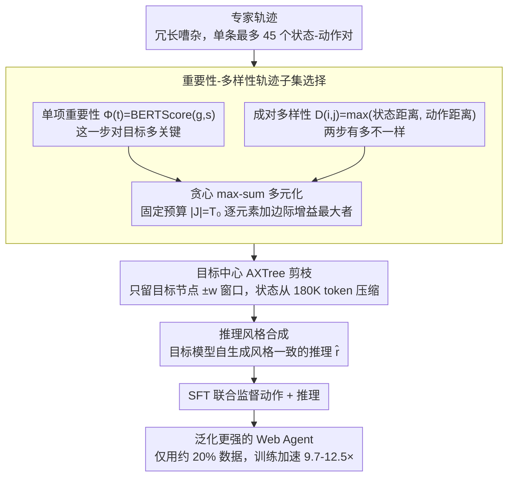

# Weasel: 通过重要性-多样性数据选择实现 Web Agent 的域外泛化

**会议**: ICML 2026  
**arXiv**: [2605.20291](https://arxiv.org/abs/2605.20291)  
**代码**: https://github.com/fatemehpesaran310/weasel  
**领域**: LLM Agent / Web Agent  
**关键词**: 数据选择, Web Agent, 域外泛化, 轨迹精选, 训练效率

## 一句话总结
通过结合目标相关性和多样性的轨迹步骤选择方法，Weasel 在减少训练数据到原始 20% 的同时实现 9.7-12.5 倍训练加速，并显著提升 Web Agent 在未见域上的泛化能力。

## 研究背景与动机

**领域现状**：LLM 驱动的 Web Agent 已通过大规模指令数据和强基础模型取得进展，但多数研究在基准内评估，无法测试真正泛化能力。

**现有痛点**：（1）Agent 在训练分布外的网站或交互模式上性能大幅下降；（2）离线 Web 交互数据通常冗长嘈杂，专家轨迹包含大量冗余步骤；（3）AgentTrek 中单条轨迹可达 45 个状态-动作对，每个 Web 状态的可访问树（AXTree）最长可达 180K tokens。

**核心矛盾**：如何在有限预算内选择既相关又多样的数据子集——这是 NP 困难问题。

**本文目标**：设计轨迹选择方法同时优化（1）改善域外泛化；（2）降低计算成本。

**切入角度**：将轨迹精选建模为约束优化问题，结合目标条件的重要性和成对多样性，用贪心算法高效求解。

**核心 idea**：平衡单项重要性得分与成对多样性距离，从长轨迹中选出固定预算的信息密集子集，实现少数据、高效率、强泛化。

## 方法详解

### 整体框架

Weasel 把"如何用更少数据训出更能泛化的 Web Agent"拆成一条流水线：先从冗长嘈杂的专家轨迹里挑出既相关又多样的步骤子集，再对每个保留步骤的网页状态做目标中心剪枝去掉无关上下文，最后针对推理原生模型补一层风格一致的推理过程。三步分别解决数据"选哪些""留多少""怎么训"的问题，最终只用约 20% 数据就追平甚至超过全量微调。

### 关键设计

**1. 重要性-多样性轨迹子集选择：把精选建模成 max-sum 多元化**

专家轨迹动辄 45 个状态-动作对，绝大多数步骤是冗余翻页或重复操作，若只按相关性贪心取 top-k 会选出一堆彼此相似的状态，覆盖不到异质网页和交互模式。Weasel 因此给每个步骤同时定义两类分数：单项重要性用目标与状态的语义匹配度 $\Phi(t) = \text{BERTScore}(g, s_t)$ 衡量"这一步对完成目标多关键"，成对多样性用状态距离与动作距离取大 $D(i,j) = \max(\delta(s_i, s_j), \delta(y_i, y_j))$ 衡量"两步有多不一样"。选择目标是在固定预算 $|J| = T_0 \ll T$ 下最大化 $\max_J \sum_{j\in J} \Phi(j) + \lambda \sum_{i<j,\, i,j\in J} D(i,j)$，其中 $\lambda$ 平衡重要性与多样性。这是个 NP 困难的 max-sum 多元化问题，Weasel 用贪心求解——先选出得分最高的一对，再每轮加入边际增益最大的元素 $i_m = \arg\max_{k \notin J_{m-1}} \Phi(k) + \lambda \sum_{i \in J_{m-1}} D(k,i)$。实测贪心在 99.7% 的轨迹上落入前 1% 最优解，近似比 0.9999±0.0005，几乎逼近精确解。

**2. 目标中心 AXTree 剪枝：只留目标动作周围的局部上下文**

AgentTrek 里单个网页状态的可访问树（AXTree）线性化后最长可达 180K tokens，全塞进去既慢又稀释信号。Weasel 借助轨迹本身已标注的目标动作位置做剪枝：给定线性化节点序列 $V_t$ 和目标节点位置 $k_t^*$，只保留以 $k_t^*$ 为中心、大小为 $2w+1$ 的连续节点窗口；对 goto 这类不指向具体节点的动作则退化为取固定长度前缀。这样每个状态的 token 量大幅压缩、带来约 2× 速度提升，而消融显示成功率随窗口偏移目标的距离增大近似线性下降，说明目标附近确实是信息最密集的区域。

**3. 推理风格合成：让推理原生模型用自己熟悉的方式思考**

Qwen3 这类推理原生模型在预训练阶段已习得固定的推理书写风格，若直接拿其他模型生成的异质推理痕迹来训练，会造成风格不匹配反而损害泛化。Weasel 的做法是让目标模型自己补全推理：对每个选中步骤 $t \in J^*$，用目标模型基于目标 $g$、历史 $h_t$、剪枝后状态 $\tilde{s}_t$ 和动作 $a_t$ 生成与自身风格一致的推理 $\hat{r}_t$，再以 $\max_\theta \sum_{\tau \in \mathcal{D}} \sum_{t \in J^*(\tau)} \log \pi_\theta(a_t, \hat{r}_t \mid g, h_t, \tilde{s}_t)$ 联合监督动作与推理。消融里仅加这一层风格合成就把成功率从 17.0% 拉到 21.2%，是完整方法增益的主要来源。

## 实验关键数据

### 主实验

| 数据集 | 模型 | 训练配置 | WebArena-Lite | WebArena | MiniWob | 训练加速 |
|--------|------|----------|---------------|----------|---------|----------|
| AgentTrek | Qwen2.5-7B | Full (52K) | 10.9 | 8.7 | 44.6 | 1.0× |
| AgentTrek | Qwen2.5-7B | Weasel (10K) | 14.5 | 9.5 | 48.0 | 11.3× |
| AgentTrek | Gemma3-4B | Full (52K) | 9.1 | 4.3 | 28.6 | 1.0× |
| AgentTrek | Gemma3-4B | Weasel (10K) | 11.5 | 5.5 | 30.6 | 12.5× |
| AgentTrek | Qwen3-8B | Full (52K) | 17.7 | 18.2 | 59.4 | 1.0× |
| AgentTrek | Qwen3-8B | Weasel (10K) | 21.2 | 19.2 | 61.9 | 10.7× |

### 消融

| 方法 | 数据选择 | 推理合成 | WebArena-Lite |
|------|----------|----------|---------------|
| 基础 Qwen3-8B | ✗ | ✗ | 16.4 |
| SFT (Random) | ✗ | ✗ | 16.5 |
| SFT + 推理合成 | ✗ | ✓ | 18.2 |
| Weasel w/o 推理合成 | ✓ | ✗ | 17.0 |
| **Weasel (完整)** | **✓** | **✓** | **21.2** |

### 关键发现
- 三个 LLM 上一致超越全数据 SFT，9.7-12.5× 训练加速，仅用 20% 数据达到或超过完整微调性能。
- 多样性必要性：仅状态多样性 9.7%，仅动作多样性 13.9%，结合 14.5%。
- 重要性-多样性平衡：仅重要性 10.9%，仅多样性 7.9%，结合 14.5%。
- 跨域迁移：移植到 AITW 安卓 GUI 设置，3.1K 子集超过随机采样（5.8% → 6.6%）。

## 亮点与洞察
- **精妙问题建模**：抽象为 max-sum 多元化，既理论有据（贪心近似保证）又实践高效。
- **多维多样性设计**：同时考虑状态空间和动作空间多样性。
- **推理风格匹配的关键洞察**：发现推理原生模型对训练数据推理风格敏感性，从 17% 直接跳到 21%。
- **端到端完整方案**：数据选择 + 状态剪枝 + 推理适配形成完整流程。

## 局限与展望
- 贪心算法理论保证不适用于伪距离（非度量），仅是启发式有效。
- 多模态 GUI 实验改进较小（5.8% → 6.6%），视觉主导场景需进一步优化。
- BERTScore 评分本身可能有偏。
- 改进：探索学习 importance/diversity 权重；结合上下文学习；推理模型侧研究更灵活风格适配。

## 相关工作与启发
- **vs WebRL / WebAgent-R1**：在线交互 RL vs 本文离线数据精选，无需 environment rollout 成本。
- **vs 通用数据选择**：通用方法关注模型独立的样本代表性；Weasel 针对 web agent 特殊性设计 goal-conditioned 重要性。
- **vs 其他 state pruning**：Lee 等通过学习模块或检索引入额外参数；Weasel 是轻量级无参设计。
- **vs 指令微调优化**：偏好优化面向对齐；Weasel 同时优化泛化和效率。

## 评分
- 新颖性: ⭐⭐⭐⭐⭐  首次将 max-sum 多元化引入 web agent 数据选择。
- 实验充分度: ⭐⭐⭐⭐⭐  3 LLM + 多 benchmark + 跨域验证 + 完整消融。
- 写作质量: ⭐⭐⭐⭐⭐  结构清晰，formalization 严谨。
- 价值: ⭐⭐⭐⭐⭐  对 web agent 实际部署有直接帮助。

<!-- RELATED:START -->

## 相关论文

- [\[ICML 2026\] Agent JIT Compilation for Latency-Optimizing Web Agent Planning and Scheduling](agent_jit_compilation_for_latency-optimizing_web_agent_planning_and_scheduling.md)
- [\[CVPR 2026\] Ego2Web: A Web Agent Benchmark Grounded in Egocentric Videos](../../CVPR2026/llm_agent/ego2web_a_web_agent_benchmark_grounded_in_egocentric_videos.md)
- [\[AAAI 2026\] Prune4Web: DOM Tree Pruning Programming for Web Agent](../../AAAI2026/llm_agent/prune4web_dom_tree_pruning_programming_for_web_agent.md)
- [\[ICLR 2026\] Web-CogReasoner: Towards Knowledge-Induced Cognitive Reasoning for Web Agents](../../ICLR2026/llm_agent/web-cogreasoner_towards_knowledge-induced_cognitive_reasoning_for_web_agents.md)
- [\[NeurIPS 2025\] Web-Shepherd: Advancing PRMs for Reinforcing Web Agents](../../NeurIPS2025/llm_agent/web-shepherd_advancing_prms_for_reinforcing_web_agents.md)

<!-- RELATED:END -->
