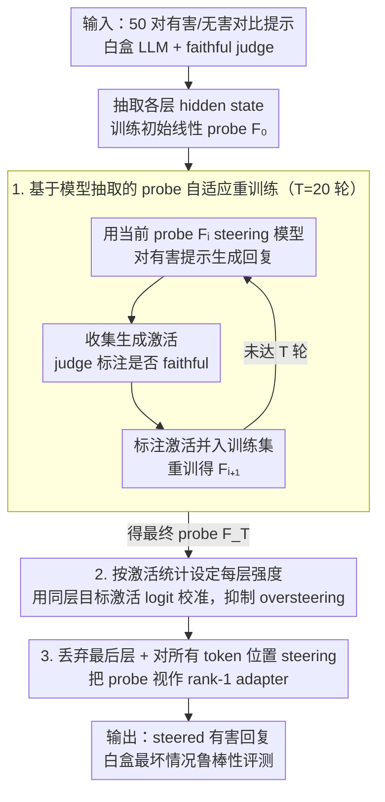

# Adaptive Probe-based Steering for Robust LLM Jailbreaking

**会议**: ICML 2026  
**arXiv**: [2605.20286](https://arxiv.org/abs/2605.20286)  
**代码**: https://github.com/fhdnskfbeuv/adaptiveSteering  
**领域**: LLM安全 / 红队评测  
**关键词**: LLM越狱, 表征干预, probe steering, adaptive retraining, 鲁棒性评测  

## 一句话总结
这篇论文把 probe-based contrastive steering 改造成更强的白盒红队评测工具，用自适应重训练修正有偏 probe，并用激活统计自适应设定 steering 强度，从而显著暴露加固 LLM 的越狱脆弱性。

## 研究背景与动机
**领域现状**：对齐后的 LLM 通常会拒绝有害请求，安全评测需要强攻击来估计最坏情况下的鲁棒性。提示级 jailbreak、梯度优化、fine-tuning attack 和隐藏状态 steering 都被用来做红队测试，其中 contrastive steering 的优势是只需要前向传播和一组对比提示，不依赖目标回复或输入梯度。

**现有痛点**：已有 steering 方法有两个关键不稳定来源。第一，方向搜索依赖少量“有害/无害”对比提示，这些提示不只编码“服从/拒绝”，还混入伦理、主题、文风等耦合方向，学到的 linear probe 可能偏离真正的 jailbreak 行为方向。第二，steering 强度往往需要人工调参，或用统一 logit target 套到所有层；但不同层的激活范数差异很大，统一强度容易导致早层过度干预、回复崩坏。

**核心矛盾**：强安全评测需要攻击足够强，否则会高估防御能力；但 steering 越强，越容易破坏语言能力或生成不连贯内容。本文要解决的是“方向要更接近目标行为，强度又不能靠人工暴力调参”的矛盾。

**本文目标**：作者希望在不额外采集对比提示、不做反向传播、不手工搜索每层强度的前提下，提高 probe-based steering 对 fortified LLM 的攻击有效性和跨模型鲁棒性。

**切入角度**：论文把 probe 的方向搜索视作 model extraction：理想 probe 是不可见的行为判别器，已有对比提示只提供有偏样本；如果能让模型在当前 steering 下生成新激活，再由 judge 标注，就能迭代逼近更可靠的方向。

**核心 idea**：用“judge 标注的自适应激活重训练”修正 steering 方向，用“同层对比激活的统计量”自动设定每层目标强度。

## 方法详解
这篇论文的目标不是构造新的提示模板，而是在白盒可访问隐藏状态的威胁模型下改进 probe-based steering。方法保留 contrastive steering 的基本形式：在 Transformer 某些层的 hidden state 上加一个沿 probe 方向的向量，使模型状态更接近目标行为区域。它的改动集中在两个位置：方向怎么学，以及每层该推多远。

### 整体框架
输入包括少量有害/无害对比提示、一个可访问隐藏状态的 LLM，以及一个用于标注回复是否“faithful to harmful request”的评估器。首先，方法从对比提示中抽取 hidden states，训练每层 linear probe，得到初始方向。然后进入自适应重训练：用当前 probe 对有害提示进行 steering，收集生成过程中的激活和对应回复，由 judge 给回复标注，再把这些新激活加入训练集重训 probe。最后，推理时不再手工设置统一强度，而是根据训练集中目标行为激活的 probe logit 统计量，为每层设定自适应 target，并在所有 token 位置施加 steering。

### 关键设计

**1. 基于模型抽取（model extraction）的 probe 自适应重训练：把"找方向"变成主动逼近理想判别器。** 初始 probe 只能用有害/无害对比提示训练，但这些提示同时编码了伦理、主题、文风等耦合方向，学到的方向其实是"faithful 判别器 × 噪声判别器"，方向偏差无法忽略。作者指出，单纯堆更多对比提示只会继续引入这些耦合维度，治标不治本。关键观察是：方向搜索本质上就是 model extraction——理想 probe $f^*$ 不可见，但可以用一个可靠的 jailbreak judge 当代理标注器。于是方法把 steering 改成迭代过程：第 $i$ 轮用当前 probe $F_i$ steering 模型、对有害提示生成回复并收集中间激活，再用 judge 标注这些激活是否 faithful，把标注样本并入训练集得到 $F_{i+1}$（主实验 $T=20$ 轮）。一个细节是重训练时把目标强度设为 $s^{(l)}=0$，让 steering 后的激活恰好落在当前 probe 决策边界附近——这正是主动学习 / adaptive retraining 的思路，用"分类器最不确定的样本"来采样比随机采样更高效，从而把方向集中地往真正控制行为的子空间逼近。

**2. 基于激活统计的自适应强度设定：用同层目标激活的尺度替代统一 logit target。** probe steering 需要为每层设一个强度，把 hidden state 推到某个 probe logit target；逐层手调是 $L$ 个连续参数的苦力活，而已有方法用层间统一的 target 又忽略了一个事实——各层激活的 $L_2$ 范数相差数个数量级（早层小、晚层大）。统一 target 会让范数小的层受到相对过强的扰动，也就是 oversteering，生成随之崩坏。方法改用同层目标激活 $\mathbf{y}_i^{(l)}$ 的 logit 来设定 $s^{(l)}=\mathbf{w}^{(l)}\cdot\mathbf{y}_i^{(l)}+b^{(l)}$：由于同层激活范数量级相近（$\|\mathbf{y}_i^{(l)}\|_2\approx\|\mathbf{x}_i^{(l)}\|_2$），steering 向量与原激活的范数比可化简为 $\cos\theta_{wy}-\cos\theta_{wx}$，一个只依赖方向、与激活幅度无关的量。这相当于用"该层真实目标激活的尺度"自动校准强度，既免去手工调参，又从根上避免了 oversteering，同时还能丢掉论文证明并不稳定的 accuracy-based layer selection。

**3. 丢弃最后层 + 对所有 token 位置 steering：从干预面上修掉两个易被忽视的坑。** 这两点是论文归在"其他实现细节"里的工程校正，但对 fortified 模型上的攻击有效性影响很大。其一，最后一个 decoder 层的激活直接接 unembedding、近似 logit bias，干预它容易诱发重复，而且它只影响当前 step、不参与后续自回归，属于局部干预，因此方法直接丢弃最后层。其二，以往工作因为方向是从回复 token 位置学的，就只 steering 回复 token；但若把 steering 向量看作 LLM 权重的一部分，它其实是一个带固定 bias 的 rank-1 LoRA，理应作用在所有 token 位置。只改回复 token 会让 prompt token 中被防御方法（如 Circuit Breaker、RepBend）操纵的表示继续主导生成，从而削弱攻击；对所有 token 位置 steering 后，这类能力退化型防御上的有效性明显回升。

### 损失函数 / 训练策略
probe 本身使用线性分类训练，样本来自初始对比激活和后续自适应标注激活。方向搜索使用 100 对 contrastive prompts，其中 50 对用于训练/迭代、50 个 harmful prompts 用于验证选择最佳方向。评估阶段使用 StrongReject 和 HarmBench 的 200 个 harmful prompts；judge 包括 SRF、StrongReject rubric judge 和 HarmBench classifier，分数都归一到 0 到 1。论文把该方法定位为红队鲁棒性评测工具，目标是揭示防御模型在白盒隐藏状态干预下的最坏情况，而不是给普通用户提供绕过安全策略的使用流程。

## 实验关键数据

### 主实验
主实验覆盖 12 个专门防 jailbreak 的 fortified LLM，并报告三个 judge 的 harmfulness score。下表保留平均结果和若干代表模型。

| 方法 | 代表结果 | 平均 harmfulness | 相对结论 |
|--------|------|------|----------|
| RepE | 多数模型接近 0 | 0.02 | 传统 representation engineering 基本无法突破强防御 |
| SCAV | Gemma-DA 可到 0.38/0.47/0.64，但多数模型接近 0 | 0.05 | 原始 probe steering 鲁棒性不足 |
| RD-A | 在 Gemma-DA、Llama3-RB 上较强 | 0.24 | ablation steering 有效但覆盖不稳定 |
| RD-C | 部分模型有效 | 0.18 | constant strength 仍需调参且跨模型不稳 |
| Angular | R2D2、Llama3-DeRTA 有一定效果 | 0.13 | 方向改进不等于强度鲁棒 |
| Ours | Llama2-DA 0.57/0.86/0.85，Llama3-RB 0.71/0.86/0.98，Llama3-CB 0.70/0.83/0.91 | 0.70 | 自适应方向和强度显著提升最坏情况评测强度 |

### 消融实验
论文把强度设定、层选择、token 位置和模型抽取分别消融。下表按论文报告的核心趋势整理。

| 配置 | 关键指标 | 说明 |
|------|---------|------|
| SCAV | 平均 0.05 | 原始 probe steering 大多停留在近零 harmfulness |
| SCAV + AS | 平均 0.14 | 自适应强度能把 Llama2-DA、Vicuna-SU 等模型拉出零区间 |
| SCAV + AS + DLA | 平均 0.29 | 丢弃最后层减少 logit-bias 式干预，连贯性和有效性更好 |
| 加入 SAT | 论文称平均再提升约 15% | 对所有 token 位置 steering，尤其改善 CB/RB 系列 |
| Naive Augmentation | 平均最多约 +6% | 单纯加更多对比提示收益有限，因为仍混有耦合概念方向 |
| Adaptive Retraining | 平均约 +26% | 用 judge 标注的自适应激活更有效地修正 probe 方向 |
| R2D2 专项改进 | 从 0.31/0.41/0.64 提升到最高 0.74/0.87/0.81 | 过滤不服从 benign prompts 的样本并使用回复 token 激活，可处理能力退化型防御 |

### 关键发现
- 论文最强的证据是 fortified LLM 上的平均 harmfulness 从接近零提升到 0.70，说明原先看似鲁棒的模型在更强白盒 steering 评测下仍有明显脆弱性。
- 自适应强度是基础增益，模型抽取式重训练是主要增益。前者解决“推多远”，后者解决“往哪推”。
- R2D2 的分析提醒安全评测要区分“真正安全”和“整体不愿回答”。如果模型连 benign prompt 都无法正常服从，低 harmfulness 不能直接等价为高安全性。

## 亮点与洞察
- 把 probe direction learning 解释成 model extraction 很有启发。它说明 contrastive prompts 的问题不是数量少这么简单，而是它们天然把多个概念方向纠缠在一起。
- 层间激活尺度差异是 steering 中经常被忽视的细节。本文用目标激活统计量替代统一强度，使方法更像按层校准的 adapter，而不是粗暴加向量。
- 这篇论文对防御论文的启发很直接：如果评测只用弱攻击，容易得到过度乐观的鲁棒性结论。红队评测需要持续更新攻击强度，尤其要检查白盒表示干预。

## 局限与展望
- 威胁模型较强，要求攻击者能访问和修改每层 hidden state，因此主要适合作为白盒安全评测工具，不代表普通 API 用户的真实能力。
- 方向学习依赖 LLM judge，可能受到 judge 偏差影响。虽然作者使用多个 judge 做评估，但训练阶段仍主要依赖 SRF。
- 论文聚焦 harmfulness 提升，对防御方如何针对这种 steering attack 设计鲁棒训练或检测机制讨论较少。
- 这种方法揭示的是“模型内部是否仍保留可被激活的有害行为模式”，未来可以与机制解释和安全微调结合，用来定位防御失败的层和表征子空间。

## 相关工作与启发
- **vs Refusal Direction**: RD 直接沿拒绝方向做 constant 或 ablation steering，本文则使用 probe 方向并自适应设定层强度，因此跨模型更稳。
- **vs SCAV**: SCAV 也是 probe-based steering，但依赖 accuracy-based layer selection 和统一 target。本文指出这两点分别不稳定和易 oversteering。
- **vs prompt-level jailbreak**: prompt attack 作用在离散输入空间，可能受代理目标和搜索困难限制；本文直接作用隐藏状态，更适合白盒最坏情况评测。
- **对防御研究的启发**: 防御模型不应只在文本输入层面评估，还应检查 hidden representation 是否存在易被线性方向激活的脆弱行为子空间。

## 评分
- 新颖性: ⭐⭐⭐⭐☆ 组合的模块并非全新，但 model extraction 视角和强度校准很有价值。
- 实验充分度: ⭐⭐⭐⭐⭐ 覆盖 12 个 fortified LLM、多个 judge 和较完整消融。
- 写作质量: ⭐⭐⭐⭐☆ 方法动机清楚，但表格非常长，阅读时需要自己提炼平均趋势。
- 价值: ⭐⭐⭐⭐⭐ 对 LLM 安全红队评测和防御鲁棒性声明都有很强现实意义。

<!-- RELATED:START -->

## 相关论文

- [\[ICML 2026\] Steering Beyond the Support: Adversarial Training on Unsupervised Jailbroken Activation Simulation](steering_beyond_the_support_adversarial_training_on_unsupervised_jailbroken_acti.md)
- [\[ACL 2025\] Don't Say No: Jailbreaking LLM by Suppressing Refusal](../../ACL2025/llm_alignment/dont_say_no_jailbreaking_llm_by_suppressing_refusal.md)
- [\[ICLR 2026\] Robust Preference Alignment via Directional Neighborhood Consensus](../../ICLR2026/llm_alignment/robust_preference_alignment_via_directional_neighborhood_consensus.md)
- [\[ICLR 2026\] AlphaSteer: Learning Refusal Steering with Principled Null-Space Constraint](../../ICLR2026/llm_alignment/alphasteer_learning_refusal_steering_with_principled_null-space_constraint.md)
- [\[ICLR 2026\] Ignore All Previous Instructions: Jailbreaking as a de-escalatory peace building practise to resist LLM social media bots](../../ICLR2026/llm_alignment/ignore_all_previous_instructions_jailbreaking_as_a_de-escalatory_peace_building_.md)

<!-- RELATED:END -->
