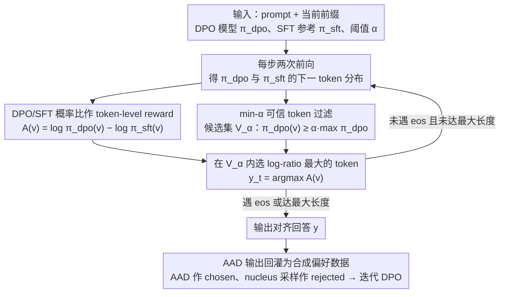

# Alignment-Aware Decoding

**会议**: ICML 2026  
**arXiv**: [2509.26169](https://arxiv.org/abs/2509.26169)  
**代码**: https://github.com/ETH-DISCO/alignment-aware-decoding  
**领域**: LLM 对齐 / 推理时解码 / DPO  
**关键词**: alignment-aware decoding、DPO、推理时对齐、token-level reward、偏好优化  

## 一句话总结
Alignment-Aware Decoding 直接在推理时利用 DPO 模型相对 SFT 参考模型的 token 概率比作为隐式对齐奖励，在无需额外训练或外部 reward model 的情况下，比 greedy、Bo2 和 EFT 更稳定地生成高对齐质量回答，并可进一步产生合成偏好数据改进 DPO。

## 研究背景与动机
**领域现状**：主流 LLM 对齐通常在训练阶段完成，例如 RLHF 先训练 reward model 再用 PPO 优化，DPO 则直接从 chosen/rejected 偏好对训练模型。训练完成后，部署时大多使用 greedy、sampling 或 best-of-N 这类标准解码。

**现有痛点**：DPO 虽然能让模型更接近偏好数据，但它本质上仍受 SFT reference model 的先验约束。理论上，即便一个回答的真实奖励更高，只要 SFT 模型对它的先验概率足够低，DPO 最优策略也可能更偏向另一个低奖励回答。因此，标准解码会继承参考模型的偏差，没有充分利用 DPO 训练中学到的细粒度偏好信号。

**核心矛盾**：训练时偏好优化已经把“哪个 token 更像高偏好回答”编码进 DPO 与 SFT 的概率差里，但推理时如果只按 DPO 概率选 token，这个对齐信号会被语言流畅性和 SFT 先验掩盖。另一方面，直接最大化概率比又容易选到低概率怪 token，导致退化输出。

**本文目标**：作者希望设计一种简单、训练免费、只依赖标准 SFT+DPO 模型对的 inference-time alignment 方法。它要比 greedy DPO 更对齐，又不需要额外 reward model、复杂搜索或针对每个数据集调大量超参。

**切入角度**：DPO 目标可被解释为学习隐式 reward 或 token-level advantage。AAD 把这个解释直接用于 decoding：DPO 模型负责给出候选 token 的可行性，DPO/SFT 概率比负责给出对齐偏好。

**核心 idea**：在 DPO 模型认为“足够可能”的 token 集合内，选择相对 SFT 概率提升最大的 token，从而在保持流畅性的前提下最大化隐式对齐奖励。

## 方法详解
AAD 的方法很短，但背后的关键在于它改变了解码目标。标准 greedy DPO 选择 $\pi_{\mathrm{dpo}}$ 概率最高的 token；AAD 则只把 $\pi_{\mathrm{dpo}}$ 当作候选筛选器，真正排序时使用 $\log \pi_{\mathrm{dpo}}(v|s)-\log \pi_{\mathrm{sft}}(v|s)$，也就是偏好优化相对 SFT 先验给某个 token 增加了多少支持。

### 整体框架
输入包括 prompt $x$、当前生成前缀 $y_{1:t-1}$、DPO 后模型 $\pi_{\mathrm{dpo}}$、DPO 前 SFT 模型 $\pi_{\mathrm{sft}}$、最大长度和过滤阈值 $\alpha$。每一步先分别前向计算两个模型对下一 token 的分布，再用 DPO 分布筛出概率不低于 $\alpha$ 倍最大概率的候选集合 $\mathcal{V}_{\alpha}$。在这个集合内，AAD 选择 log-ratio 最大的 token，遇到 `<eos>` 或达到最大长度时停止，逐 token 循环直到生成完整回答。除了作为部署时解码策略，AAD 生成的高质量回答还能回灌为合成偏好数据，继续迭代 DPO。

### 关键设计
**1. DPO/SFT 概率比作 token-level reward：把训练时的偏好信号拉到每步解码。** 标准 greedy 只跟随 $\pi_{\mathrm{dpo}}$ 的概率排序，问题是 DPO 最优策略仍被 SFT 先验绑住——论文用 $\log\frac{\pi^*(y_1|x)}{\pi^*(y_2|x)}=\Delta_{\mathrm{sft}}+\frac1\beta\Delta_r$ 证明：只要 SFT 对高奖励回答的先验足够低（$\Delta_{\mathrm{sft}}<-\frac1\beta\Delta_r$），最优策略反而会偏向低奖励回答，对齐信号被先验和流畅性掩盖。AAD 改用 DPO 的隐式奖励 $r_{\mathrm{dpo}}(x,y)=\beta\log\frac{\pi_{\mathrm{dpo}}(y|x)}{\pi_{\mathrm{sft}}(y|x)}$，并把它局部化为每个 token 的 advantage $A(v|s)=\log\frac{\pi_{\mathrm{dpo}}(v|s)}{\pi_{\mathrm{sft}}(v|s)}$（$\beta$ 不改变排序故省略），每步挑相对 SFT 被偏好优化上调最多的 token。概率比剥离了 SFT 先验，直接读出“偏好优化到底奖励了什么”，因此比直接最大化 $\pi_{\mathrm{dpo}}$ 更贴近真实奖励。

**2. min-$\alpha$ 可信 token 过滤：给 advantage 套上流畅性约束。** 不加约束地最大化概率比会退化：一方面语法/语义必需的 token 往往被两个模型都赋高概率、比值太小反而选不上；另一方面 $\pi_{\mathrm{sft}}$ 给极低概率的 token，PO 训练带来一点点绝对提升就造成巨大相对变化，产生虚高分数和数值不稳定。借鉴 contrastive decoding，AAD 先用 $\pi_{\mathrm{dpo}}$ 做 min-$\alpha$ 过滤，只保留 $\pi_{\mathrm{dpo}}(v|s)\ge \alpha\max_{v'}\pi_{\mathrm{dpo}}(v'|s)$ 的候选集 $\mathcal{V}_{\alpha}$，再在集合内按 advantage 取 argmax（主实验统一 $\alpha=0.1$，跨数据集与模型规模不调参）。这样高概率候选保证语言可行、概率比排序在可行集内强化对齐——把流畅性与对齐性分工开来，正是 AAD 能稳定不退化的关键工程细节。

**3. AAD 输出回灌为合成偏好数据：把解码策略变成自举数据生成器。** 偏好数据标注昂贵、常常稀缺。作者发现 AAD 不只是部署时解码：用它生成高质量 chosen completion、再用 $\pi_{\mathrm{dpo}}$ 的 nucleus 采样生成 rejected completion，就能构造合成偏好对，从 SFT 或已有 DPO checkpoint 继续迭代 DPO。这条回路把推理时的对齐增益“沉淀”回模型参数：实验显示只用 10% 原始偏好数据时，合成数据训练出的模型在标准解码下就能接近全数据 DPO（且不增加推理开销），不过多轮自举会出现饱和或退化。

### 损失函数 / 训练策略
AAD 本身没有训练损失，只在推理时做两次前向。实验中的 DPO 模型使用 10% preference training split 训练两轮，LoRA rank 为 64，DPO 系数默认 $\beta=0.1$；reward oracle 和 picker reward model 使用 Bradley-Terry 损失训练两轮。生成时 AAD 固定 $\alpha=0.1$，与 EFT 和 Bo2 的计算量大致相当，因为都需要两次模型前向或两条候选生成。

## 实验关键数据

### 主实验
主表在 UltraFeedback、Argilla、OpenRLHF Mixture 等数据集和 Llama/Qwen 多个规模上比较平均 oracle reward。下表摘取三个数据集的代表结果，AAD 均为最高。

| 数据集 / 模型 | Greedy SFT | Greedy DPO | Bo2 | EFT | AAD | AAD 相对最强基线 |
|---------------|------------|------------|-----|-----|-----|------------------|
| UltraFeedback / Llama 3B | 0.58 | 0.68 | 0.85 | 1.04 | 2.21 | +1.17 over EFT |
| UltraFeedback / Qwen 4B | 0.22 | 0.29 | 0.47 | 0.58 | 1.19 | +0.61 over EFT |
| Argilla / Llama 8B | 1.72 | 2.55 | 3.16 | 4.65 | 5.90 | +1.25 over EFT |
| Argilla / Qwen 0.6B | -0.86 | 0.12 | 0.68 | 1.99 | 2.33 | +0.34 over EFT |
| OpenRLHF Mixture / Llama 8B | 3.89 | 4.93 | 5.60 | 6.84 | 7.60 | +0.76 over EFT |
| OpenRLHF Mixture / Qwen 4B | 2.63 | 3.56 | 4.48 | 5.29 | 5.45 | +0.16 over EFT |

### 消融实验
论文还在外部评估、人类偏好、reference choice、数据稀缺和超参数上做了分析。

| 配置 | 关键指标 | 说明 |
|------|----------|------|
| AlpacaEval / Skywork | AAD 对 Greedy SFT、Greedy DPO、Bo2、EFT 的胜率在 Llama/Qwen 上大多为 0.73 到 0.79 | 外部 GPT-4 evaluator 下仍能赢过 baseline |
| AlpacaEval / Nectar | Llama 3B/8B 上 AAD 对 Greedy SFT 胜率 0.80/0.82，对 EFT 0.70/0.63 | 在另一个外部 oracle 数据集上也保持优势 |
| Contrastive decoding reference | Llama-8B DPO 上，Argilla CD 1B/3B reward 为 2.79/2.46，AAD 为 5.90 | AAD 需要匹配的 SFT reference，不是随便减弱模型 logits |
| OLMo-2 open-source DPO | 7B 上 AAD reward 3.84，赢 Greedy DPO 71.5%；13B 上 reward 7.22，赢 Greedy DPO 75.2% | 方法可迁移到公开 DPO 模型 |
| Human evaluation / Skywork 3B | AAD 对 Greedy DPO 胜率 58.7%，对 Bo2 胜率 73.5%，Elo 1610.1 排第一 | 人类评价支持 reward-model 结果 |
| $\alpha$ 消融 | 最优区域约 0.1 到 0.2 | 过滤太松会过优化，太紧又接近 greedy |
| full fine-tuning 数据比例 | Skywork 5% 数据时 AAD reward 1.25，Bo2 为 -1.81；100% 时 AAD 8.36，Bo2 -0.56 | 数据少时 AAD 优势更明显 |
| latency | 单 GPU 吞吐约为 greedy 的 0.5 倍，两 GPU 并行可到约 0.75 倍 | 代价主要来自每 token 双模型前向 |

### 关键发现
- AAD 相比 BoN 的优势来自“每 token 使用偏好信号”，而不是事后从多个完整回答里挑一个。Argilla 和 Nectar 上，即使用 oracle reward 做 BoN，$N=50$ 仍难以匹配 AAD。
- AAD 的 reference 必须是 DPO 训练所用的 SFT 模型。用通用较弱 instruct 模型做 contrastive decoding 明显不如 AAD，说明增益来自 DPO-SFT 概率差的语义，而不是简单反小模型偏差。
- AAD 可作为数据生成器。用 AAD 输出构造 iterative DPO 数据，在只用 10% 原始偏好数据时接近全数据训练效果，但多轮自举会出现饱和或退化。

## 亮点与洞察
- 方法极简但抓住了 DPO 的一个常被浪费的副产品：DPO 模型相对 SFT 模型的概率差本身就是偏好信号。标准解码只用 DPO 分布，等于把这个差分信号揉进总概率后再丢掉一部分信息。
- min-$\alpha$ 过滤是关键工程细节。没有它，最大化概率比很容易选择 SFT 几乎不支持但 DPO 稍微上调的异常 token；有它之后，AAD 才能同时保留语言质量和对齐偏好。
- 这篇论文把 inference-time alignment 做得很轻量：无需额外 reward model，不引入复杂 tree search，也不改变参数。对只有 SFT/DPO checkpoint 的开源模型生态很实用。

## 局限与展望
- AAD 需要同时访问 DPO 模型和其对应的 SFT checkpoint。许多闭源或只发布 merged checkpoint 的模型无法直接使用。
- 每个 token 需要两个前向，单 GPU 推理吞吐约减半。对长文本、高并发服务，必须依赖并行化、KV cache 共享或融合 kernel 才能降低开销。
- 方法主要适用于标准 SFT+DPO pipeline。论文提到与 PPO-trained models 结合结果混合，因为 PPO 直接优化外部 reward，不一定保留 AAD 依赖的 SFT-DPO probability gap。
- AAD 优化的是已有偏好数据中学到的对齐信号。如果偏好数据本身带偏、reward oracle 不可靠，AAD 可能更稳定地放大这种偏好，而不一定更安全。

## 相关工作与启发
- **vs DPO greedy decoding**: Greedy DPO 选择最高概率 token，AAD 选择相对 SFT 被偏好优化上调最多且仍可信的 token，因此更直接使用 alignment signal。
- **vs EFT / proxy alignment**: EFT 也使用模型对的概率差进行推理时引导，但常用于把对齐信号迁移到第三个 base model；AAD 专注于直接改进 DPO 模型自身解码。
- **vs BoN / reward reranking**: BoN 需要生成多个完整候选并依赖 picker reward model，AAD 在每个 token 局部决策，不需要额外 reward model，计算量与 Bo2 相近但效果更强。
- **vs contrastive decoding**: 传统 CD 减去较弱模型 logits 来减少常见错误，AAD 减去精确的 SFT reference，目标不是“反弱模型”，而是显式提取 DPO 学到的偏好增量。

## 评分
- 新颖性: ⭐⭐⭐⭐ 把 DPO/SFT 概率比直接用于解码并不复杂，但理论解释和工程约束组合得很漂亮。
- 实验充分度: ⭐⭐⭐⭐⭐ 覆盖多个偏好数据集、Llama/Qwen/OLMo、外部 oracle、AlpacaEval、人类评测和数据稀缺设置，验证扎实。
- 写作质量: ⭐⭐⭐⭐ 论文主线清楚，公式推导服务于方法；部分图表编号和附录结果较多，需要来回对照。
- 价值: ⭐⭐⭐⭐⭐ 对开源 DPO 模型部署很实用，也提示推理时对齐可以充分利用训练留下的 reference-model 信息。

<!-- RELATED:START -->

## 相关论文

- [\[ICLR 2026\] Semantic-aware Wasserstein Policy Regularization for Large Language Model Alignment](../../ICLR2026/llm_alignment/semantic-aware_wasserstein_policy_regularization_for_large_language_model_alignm.md)
- [\[ICML 2026\] Curriculum Learning for Safety Alignment](curriculum_learning_for_safety_alignment.md)
- [\[ICML 2026\] Implicit Preference Alignment for Human Image Animation](implicit_preference_alignment_for_human_image_animation.md)
- [\[CVPR 2026\] Uncertainty-Aware Exploratory Direct Preference Optimization for Multimodal Large Language Models](../../CVPR2026/llm_alignment/uncertainty-aware_exploratory_direct_preference_optimization_for_multimodal_larg.md)
- [\[AAAI 2026\] Importance-Aware Data Selection for Efficient LLM Instruction Tuning](../../AAAI2026/llm_alignment/importance-aware_data_selection_for_efficient_llm_instruction_tuning.md)

<!-- RELATED:END -->
