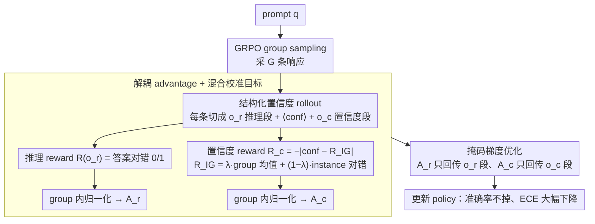

# Decoupling Reasoning and Confidence: Resurrecting Calibration in Reinforcement Learning from Verifiable Rewards

**会议**: ICML 2026  
**arXiv**: [2603.09117](https://arxiv.org/abs/2603.09117)  
**代码**: https://github.com/icip-cas/DCPO (有)  
**领域**: 对齐RLHF / LLM校准 / RLVR  
**关键词**: RLVR、置信度校准、梯度冲突、解耦优化、GRPO

## 一句话总结
本文先理论证明 RLVR（如 GRPO）训练中"提升准确率"与"减小校准误差"两个目标在 Fisher 度量下梯度方向负相关、不可调和，再提出 DCPO：让模型在推理轨迹后显式吐出一段 verbalized 置信度，给推理 token 和置信度 token 分配各自的 reward / advantage / 掩码梯度，从而在保持 GRPO 同等准确率的前提下把 ECE 从 0.435 降到 0.128（相对降 71.6%）。

## 研究背景与动机

**领域现状**：RLVR（Reinforcement Learning from Verifiable Rewards）已成为 GRPO、DeepSeek-R1 等推理大模型的标配训练范式——用可自动验证的 0/1 reward 在线优化策略，能显著提升数学、代码任务的准确率。

**现有痛点**：RLVR 训练出的模型严重 over-confident。论文实测 Qwen3-8B 在 GRPO 训练下，平均预测置信度从 0.88 一路升到 0.98+，置信度方差从 0.006 降到 0.001，PCE（Positive Calibration Error）从 0.312 升到 0.362，错误答案也被赋予近乎 1 的置信度。在医疗、法律、金融等高风险场景，这种过度自信会误导用户。

**核心矛盾**：前人（RLCR、CCGSPG）的做法是把校准目标（Brier loss、token confidence 项）耦合进 RL reward 一起优化，结果出现 "accuracy-calibration tradeoff"——校准好了准确率必掉。作者的诊断是：这两个目标在参数空间根本方向冲突，不是调权重能救的。

**本文目标**：(1) 找出 RLVR 过度自信的数学根因；(2) 设计一种既不牺牲推理准确率、又能压住过度自信的 RL 训练框架。

**切入角度**：作者从 Fisher 度量下的梯度内积出发，证明当模型已经 over-confident（$\text{Conf}_\theta > \mathbb{E}[R]$）时，$\nabla J_\text{acc}$ 与 $\nabla J_\text{cal}$ 的 Fisher 内积严格小于零；因此唯一出路是**结构上把两个目标分到不同的参数子空间/token 子空间去优化**，而不是在同一个 loss 里调系数。

**核心 idea**：让模型先生成推理轨迹 $o_r$、再吐一段 verbalized 置信度 $o_c$，对两段 token 用不同的 reward 和 advantage、并通过 mask 阻断梯度互窜，把"做对题"和"知道自己有几成把握"两件事彻底解耦。

## 方法详解

### 整体框架
DCPO（Decoupled Calibration Policy Optimization）要解决的是"既不掉准确率、又压住过度自信"这对在常规 RLVR 里互斥的目标，它建在 GRPO 的 group sampling 之上。给定 prompt $q$，policy 采样 $G$ 条结构化响应 $o = [o_r\ \texttt{<conf>}\ o_c]$：$o_r$ 是 reasoning 加最终答案，`<conf>` 之后的 $o_c$ 是模型显式吐出的置信度数字。每条响应算两套 reward——推理 reward $R(o_r)=\mathbb{I}(y_\text{pred}=y_\text{label})$ 只看答案对不对，置信度 reward $R_c(o_c)=-|\text{conf}(o_c)-R_{IG}|$ 只看吐出的数字离真实正确率有多远；两套 reward 各自在 group 内归一化成 advantage $A_r, A_c$，再用 token-level mask 让 $A_r$ 只回传到 $o_r$ 段、$A_c$ 只回传到 $o_c$ 段。推理和置信度因此走两条互不干扰的梯度通道，这正是把"梯度冲突定理"翻译成可执行架构的落点。

### 关键设计

**1. 结构化置信度 rollout：把推理和置信度切成物理上分开的两段 token**

前面诊断出过度自信的根子在于推理 token 的概率同时承担"算对"和"表达把握"两件事，根本没法分开优化。如果继续用 logit-based confidence（如 $\text{Conf}(y)=\prod \pi_\theta(y_i|y_{<i})$），置信度就是推理概率的副产品，调一个必然牵动另一个。DCPO 的做法是从生成结构上就把两者拆开：prompt 要求模型先按常规思维链推理给出答案，再在特殊 token `<conf>` 之后单独吐一个标量置信度（如 0.85），不合规的输出追加格式 penalty。这样置信度占据了独立的 token 位置，后续 reward 和 mask 才能精确锚定到各自的 token 子集——这是整套解耦方案能成立的物理前提。

**2. 解耦 advantage + 混合校准目标：给置信度找一个低方差又有区分度的回归靶**

两段 token 分开后，推理 reward 直接沿用 GRPO 的 0/1 正确性，难点落在"置信度该往哪个数字拉"。最朴素的靶是 instance 自己的对错 $R(o_r)$，但理论 4.3 指出它是单次 Bernoulli 采样、方差高达 $4p(1-p)$，会把置信度逼向极端的 0 或 1，反而加重过度自信；而 GRPO 本来就要采 $G$ 条 rollout，它们的平均准确率 $\tilde{R}_G=\frac{1}{G}\sum R(o_{r,i})$ 是真实期望 $\mathbb{E}[R]$ 的无偏估计、方差只有 $O(1/G)$，是个几乎免费又稳定的监督源。DCPO 把两者插值成混合靶 $R_{IG}=\lambda \tilde{R}_G + (1-\lambda) R(o_r)$，置信度 reward 写成 $R_c(o_c)=-|\text{conf}(o_c)-R_{IG}|$，让吐出的数字向"这个 prompt 上模型的真实能力"收敛。$\lambda$ 在稳定性（偏 group 平均）和样本级区分度（偏 instance 对错）之间权衡，消融里纯 group、纯 instance、混合三档各有取舍。两套 reward 最后都在 group 内做 mean/std 归一化，得到 $A_{r,i}, A_{c,i}$。

**3. 掩码梯度优化：用 token mask 把 Fisher 负内积冲突从物理上消掉**

有了两段 token 和两套 advantage，最后一步是让它们的梯度真正互不串扰。DCPO 给每条响应构造 token mask，把序列切成 $o_r$ 与 $o_c$ 两段，优化目标写成

$$\frac{1}{G}\sum_i \frac{1}{|o_i|}\Big[\sum_{y_j \in o_r}\hat{\rho}_{i,j}A_{r,i} + \sum_{y_j \in o_c}\hat{\rho}_{i,j}A_{c,i}\Big]$$

其中 $\hat\rho$ 是 clipped importance ratio。准确率梯度只更新推理 token 的条件分布，置信度梯度只更新 `<conf>` 之后 token 的条件分布，两条 reward 在结构上根本不会落到同一组 logits 上——4.2 节那个"已经 over-confident 时 $\nabla J_\text{acc}$ 与 $\nabla J_\text{cal}$ 的 Fisher 内积严格为负"的冲突，就这样被物理隔离掉了。定理 5.1 进一步保证在这种解耦下，proper scoring rule 的最优置信度恰好等于真实期望准确率 $\mathbb{E}[c|q]=\mathbb{E}_{y\sim\pi_\theta}[R(y)]$，所以压校准这件事完全不会反过来拖累推理策略。

### 损失函数 / 训练策略
基座 Qwen3-8B（non-thinking），训练集 DeepScaler，group size $G$ 取 GRPO 默认；$\lambda$ 在 hybrid 校准目标中通过消融选取（DCPO-I 即 $\lambda=0$、DCPO-G 即 $\lambda=1$、DCPO 为混合）；格式不合规追加 penalty 保证 verbalized confidence 可解析。

## 实验关键数据

### 主实验
在 5 个数学 benchmark（MATH-500 / AIME24 / AIME25 / AMC23 / AMC24）上对比 Base / GRPO / RLCR / CCGSPG / DCPO，置信度统一用 verbalized 形式。

| 方法 | Overall Acc ↑ | Overall ECE ↓ | Overall PCE ↓ | Overall AUROC ↑ |
|------|---------------|---------------|---------------|-----------------|
| Base (verbal) | 46.4 | 0.435 | 0.426 | 0.609 |
| GRPO (verbal) | 57.4 | 0.372 | 0.363 | 0.532 |
| RLCR | 56.5 | 0.139 | 0.128 | 0.753 |
| CCGSPG | 57.6 | 0.230 | 0.283 | 0.815 |
| **DCPO** | **60.8** | **0.128** | 0.126 | **0.881** |

关键对比：DCPO 准确率与 GRPO 持平（60.8 vs 57.4，甚至更高），同时 ECE 从 GRPO 的 0.372 砍到 0.128、相对 Base 降 71.6%；RLCR 校准接近但准确率掉了 1.1 个点，CCGSPG 准确率持平但 ECE 仍达 0.230。

### 消融实验
| 配置 | Overall Acc | Overall ECE | 说明 |
|------|-------------|-------------|------|
| DCPO（混合） | 60.8 | 0.128 | 完整模型 |
| DCPO-G（仅 group） | 60.5 | 0.209 | 校准目标只用 $\tilde R_G$，准确率几乎不掉但 ECE 偏高 |
| DCPO-I（仅 instance） | 58.7 | 0.138 | 校准目标只用 $R(o_r)$，ECE 接近但 Acc 掉 2 个点 |

### 关键发现
- 混合 group + instance 目标在 Acc 和 ECE 上都拿到 SOTA，验证了 4.3 节"group 信号低方差、instance 信号有区分度"的理论判断。
- AUROC 是 DCPO 提升最大的指标（0.532 → 0.881），说明 verbalized confidence 不只是数值上贴近准确率，还具备很强的"对错判别"能力——这是 RLVR + 解耦 reward 自然涌现的副产品。
- 论文额外在 LiveCodeBench、HumanEval+ 上做了代码生成实验，结论一致：DCPO 在跨领域保持 GRPO 准确率的同时大幅压住 over-confidence。

## 亮点与洞察
- **理论 → 架构的直线推导**：Proposition 4.2 的 Fisher 负内积不是事后解释，而是直接催生了"必须把两个目标分到不同 token 子集"的架构决定；从"为什么不能耦合"到"怎么解耦"逻辑闭环，远比纯工程拼接 reward 的论文有说服力。
- **复用 GRPO group sampling 当低方差监督源**：$\tilde R_G$ 几乎是免费的——GRPO 本来就要采 G 条 rollout 算 advantage，作者直接拿这 G 条的平均准确率当置信度回归目标，不引入任何额外标注或 critic 网络，"在已有结构里找新信号"是非常优雅的思路。
- **Verbalized confidence + masked gradient 模式可迁移**：任何需要让 LLM 学会"知道自己不知道"的任务（事实性问答、工具调用、Agent 决策）都可以套用——只要能把输出切成"任务段 + 元认知段"两个 token block，就能用同样的解耦 reward 框架训练。
- **指标设计的细节**：作者引入 PCE（只在 confidence > accuracy 的 bin 上算 ECE）专门刻画 over-confidence，避免 ECE 因为准确率提升而被动下降的假象——这个指标比 ECE 更适合监控 RLVR 训练。

## 局限与展望
- **依赖模型有"verbalize 置信度"的基础能力**：base model 必须能稳定吐出可解析的 confidence 数字，否则格式 penalty 会主导早期训练；对更小模型可能需要 SFT 冷启动。
- **置信度只在轨迹末端给出一次**：是粗粒度的整段置信度，无法定位"推理链哪一步开始动摇"；细粒度的 step-level calibration 可能需要把 mask 扩展到中间 checkpoint。
- **理论假设 $\text{Cov}(R, \phi) > 0$**：要求置信度特征与正确率正相关，对刚训练的、几乎随机的 base model 不一定成立，可能解释为什么早期训练步 calibration loss 抖动较大。
- **未与 RLHF 风格 reward model 路线对比**：DCPO 全程只用可验证 reward，没和"用学到的 confidence head + 偏好数据"路线正面 PK。
- **$\lambda$ 调参**：hybrid 系数靠经验消融，没给出根据 group size 或 task difficulty 自适应的方案。

## 相关工作与启发
- **vs RLCR (Damani et al., 2025)**：RLCR 在 RLVR reward 上加 Brier Score loss，是典型"耦合优化"——本文理论上证明其必然遇到梯度冲突；实验上 RLCR 校准与 DCPO 接近（ECE 0.139 vs 0.128）但准确率掉点（56.5 vs 60.8），印证了 tradeoff。
- **vs CCGSPG (Liu et al., 2025)**：CCGSPG 按 token-level confidence 重塑 GRPO advantage，仍是耦合方案；DCPO 在 ECE 上明显更好（0.128 vs 0.230），且 AUROC 全面领先，说明"结构解耦"比"signal 调权"更彻底。
- **vs Inference-time calibration (Chhikara, Ni et al.)**：post-hoc 方法不动模型权重、靠外部 predictor 或采样 trick；DCPO 直接把校准能力 bake 进权重，部署时不需额外开销，但训练成本更高。
- **vs GRPO 原版**：DCPO 的"两套 advantage + token mask"可以视为 GRPO 的最小侵入式扩展——只增加一段 confidence rollout 和一组 mask，不改 PPO 主体；对已有 GRPO 训练 infra 几乎是 drop-in。

## 评分
- 新颖性: ⭐⭐⭐⭐ 理论诊断（Fisher 梯度冲突）+ 结构解耦的方案组合罕见，但 verbalized confidence 和 group reward 各自都有前作。
- 实验充分度: ⭐⭐⭐⭐ 5 个数学 + 3 个代码 benchmark，含 DCPO-I/G 消融与多种 baseline，但缺少更大模型（70B+）规模验证。
- 写作质量: ⭐⭐⭐⭐⭐ 理论 → 经验观察 → 算法 → 实验的论证链非常清晰，PCE 指标的引入也提升了说服力。
- 价值: ⭐⭐⭐⭐⭐ 直击 RLVR 时代 LLM 部署的关键痛点（过度自信），方案简洁且与现有 GRPO 基础设施兼容，工业落地价值高。

<!-- RELATED:START -->

## 相关论文

- [\[ICML 2026\] Simultaneous Multi-objective Alignment Across Verifiable and Non-verifiable Rewards](simultaneous_multi-objective_alignment_across_verifiable_and_non-verifiable_rewa.md)
- [\[ACL 2026\] Too Correct to Learn: Reinforcement Learning on Saturated Reasoning Data](../../ACL2026/llm_alignment/too_correct_to_learn_reinforcement_learning_on_saturated_reasoning_data.md)
- [\[AAAI 2026\] DeCoRL: Decoupling Reasoning Chains via Parallel Sub-Step Generation and Cascaded Reinforcement for Interpretable and Scalable RLHF](../../AAAI2026/llm_alignment/decorl_decoupling_reasoning_chains_via_parallel_sub-step_gen.md)
- [\[ICML 2026\] Curriculum Learning for Safety Alignment](curriculum_learning_for_safety_alignment.md)
- [\[ACL 2026\] PERSA: Reinforcement Learning for Professor-Style Personalized Feedback with LLMs](../../ACL2026/llm_alignment/persa_reinforcement_learning_for_professor-style_personalized_feedback_with_llms.md)

<!-- RELATED:END -->
