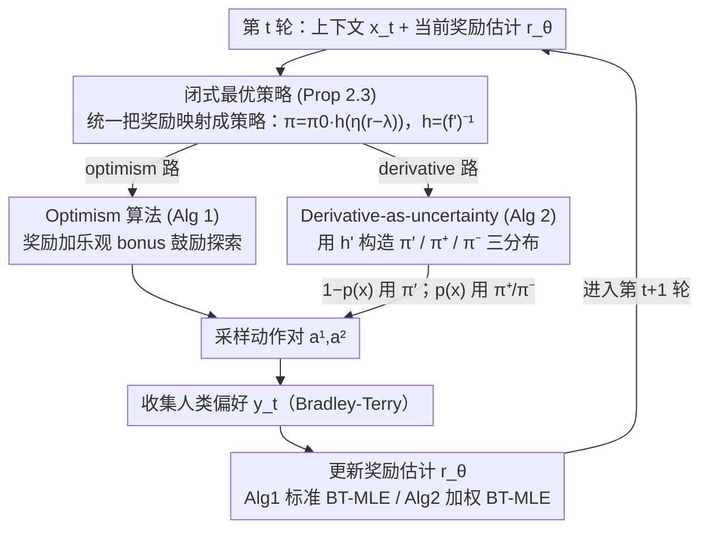

# $f$-Divergence Regularized RLHF: Two Tales of Sampling and Unified Analyses

**会议**: ICML 2026  
**arXiv**: [2605.06977](https://arxiv.org/abs/2605.06977)  
**代码**: 无（理论论文）  
**领域**: RLHF 对齐 / Online Learning / 理论  
**关键词**: $f$-divergence、optimism、derivative-as-uncertainty、regret bound、contextual bandit

## 一句话总结
本文给在线 RLHF 在**通用 $f$-divergence 正则**下首次建立 $O(\log T)$ regret 和 $O(1/T)$ 次优 gap 上界，提出两套采样策略：(1) 基于 optimism in face of uncertainty 加 bonus 项；(2) 一个新颖的 **"derivative-as-uncertainty"** 视角——把 $f'$ 当作不确定性信号，从而设计 derivative-based 采样而无需在每轮显式估计 confidence bound。

## 研究背景与动机

**领域现状**：RLHF 已经是 LLM post-training 的标配（InstructGPT、Llama2、Claude 等），最常见形式是 KL-regularized contextual bandit：$J_{\text{KL}}(\pi)=\mathbb{E}[r^*(x,a)-\eta^{-1}D_{\text{KL}}(\pi,\pi_0)]$。Zhao et al. 2025a 已经证明 online KL-RLHF 能拿 $O(\log T)$ regret、offline 在 single-policy coverage 下能拿 $O(\varepsilon^{-1})$ 样本复杂度。

**现有痛点**：KL 不是万能正则——Huang et al. 2025 证明混合 chi-squared 能更好缓解 reward over-optimization；Shan et al. 2024 指出 forward KL 对扩散模型对齐更稳；$\alpha$-divergence 在 exploration-exploitation 之间提供更灵活的 trade-off。但目前**所有理论分析都按特定 $f$ 一个个做**，没有统一框架；Zhao et al. 2025b 给了通用 $f$-divergence 但只覆盖 offline。online 的统一理论是个空白。

**核心矛盾**：每种 $f$-divergence 都有自己的最优策略闭式解 $\pi_f^*(a|x)=\pi_0(a|x)f'^{-1}(\eta(r^*(x,a)-\lambda_f^*(x)))$，里面的 $f'^{-1}$（记作 $h$）形状千差万别——KL 是 exp、chi-squared 是线性、JS 介于两者。**任何 online 算法的 regret 都会被 $h$ 的曲率主导**，怎么设计一个对所有 $f$ 都管用的 bonus 是难点。

**本文目标**：(1) 把 optimism-based RLHF（Xiong 2023、Ye 2024、Zhao 2025a）从 KL 扩展到通用 $f$；(2) 给一个**不需要显式 confidence ball** 的替代算法，因为 confidence ball 在每轮都要解优化问题、对实际 LLM 落地不友好；(3) 同时给两套算法的 regret/suboptimality 证明，统一在 $f$ 上。

**切入角度**：作者注意到一个关键观察——**$h=(f')^{-1}$ 的导数 $h'$ 本身就在告诉你"reward 估计误差会被放大多少"**。即 $\pi_\theta-\pi_{\theta'}\approx \pi_0\cdot h'(\eta(r_\theta-\lambda))\cdot\eta\cdot\Delta r$，所以 $h'$ 大的地方 = $\pi$ 对 reward 估计敏感 = 该多探索。这是一个把 "$f$-divergence 的几何性质" 直接翻译成 "exploration signal" 的新视角。

**核心 idea**：用 $f'$ 的导数本身作不确定性度量，设计 $\pi'_\theta(a|x)\propto \pi_0(a|x)\cdot h'(\eta(r_\theta-\lambda))$ 当采样策略，再配 $\pi_\theta^\pm$ 两个互补分布在 $h'$ 接近 0 时兜底，统一 $f$ 拿 $O(\log T)$/$O(1/T)$ 保证。

## 方法详解

### 整体框架
全文把在线 RLHF 建模成一个 Bradley-Terry 偏好驱动的 contextual bandit，目标从只针对 KL 的特例换成通用 $f$-divergence 正则 $J_f(\pi)=\mathbb{E}[r^*(x,a)-\eta^{-1}D_f(\pi,\pi_0|x)]$。每一轮 $t$ 的骨架都一样：先采两个 action $a_t^1,a_t^2$，拿到人类偏好 $y_t$，用 MLE 更新奖励估计 $r_{\theta_t}$，再据此构造下一轮策略 $\pi_{t+1}$。其中「怎么从奖励反推策略」由统一的闭式最优策略（Proposition 2.3）承担，两套算法只在它之上对「怎么采样 / 怎么注入探索」分岔——一条走经典 optimism，一条走他们新提出的 derivative-as-uncertainty。

### 关键设计

**1. 闭式最优策略 + 通用可逆条件：把所有 $f$ 的最优解写成同一个模板（Proposition 2.3）**

后面两套算法都得在每轮从奖励估计反推出策略，如果每种 $f$ 都要单独推导，统一分析就无从谈起。作者证明，只要 $\pi_0(a|x)>0$、$f'$ 可逆且 $0\notin\text{dom}(f')$，通用目标的最优解就有统一闭式 $\pi_f^*(a|x)=\pi_0(a|x)\cdot f'^{-1}(\eta(r^*(x,a)-\lambda_f^*(x)))$，其中 $\lambda_f^*(x)$ 是负责归一化的拉格朗日乘子；记 $h=(f')^{-1}$，reverse KL 下 $h(z)=\exp(z-1)$ 就退回大家熟悉的 softmax。这个统一形式之所以关键，是因为它让 regret 能被写成奖励误差的二次型、$\partial J_f/\partial r$ 可直接分析；代价是可逆条件把 Total Variation、纯 chi-squared 这类边界情形排除在外，但 reverse/forward KL、JS、chi-squared-KL 等主流选择都保住了。

**2. Optimism 算法：用「面对不确定性时乐观」把 $O(\log T)$ regret 推广到通用 $f$（Algorithm 1）**

第一条痛点是怎么在通用 $f$ 上拿到对数 regret。作者沿用经典的 optimism 框架：每轮先 MLE 得 $\theta_t$，再给奖励加一个乐观 bonus $\hat r_t=r_{\theta_t}+\mathbb{E}_{a\sim\pi_t}b_t$，其中 $b_t(x,a^1,a^2)=\min\{1,\beta_T\,U(\xi,x,a^1,a^2;\mathcal{R}_t,\mathcal{D}_t)\}$，$U$ 是建立在 Eluder dimension 上的不确定性度量，最后把 $\hat r_t$ 代回 Proposition 2.3 得到 $\pi_{t+1}$。和只做 KL 的前作相比，这里的 regret bound 多出一个 $\mathcal{C}(f,\mathcal{R}_\Theta,\eta)=\max h'/h$ 项——它正是引入通用 $f$ 的代价，量化了「$h$ 越扁、regret 越紧」这件事，也是首次对任意满足条件的 $f$ 给出的 regret 上界。

**3. Derivative-as-uncertainty 算法：拿 $h'$ 的几何直接当探索信号，免去每轮解 confidence ball（Algorithm 2）**

optimism 算法每轮都要解一个 $\sup_{R_1,R_2}$ 去算 $U$，在 LLM 这种参数空间巨大的场景里几乎不可行，这是第二条痛点。作者的核心观察是 $h'=((f')^{-1})'$ 本身就编码了不确定性：因为 $\pi_\theta-\pi_{\theta'}\approx\pi_0\cdot h'(\eta(r_\theta-\lambda))\cdot\eta\cdot\Delta r$，$h'$ 大的地方正是策略对奖励估计最敏感、最该多探的地方。于是他们直接把采样分布定为 $\pi'_\theta(a|x)\propto\pi_0(a|x)\cdot h'(\eta(r_\theta(x,a)-\lambda_\theta(x)))$。麻烦在于奖励估计严重出错时 $h'$ 会接近 0、探索就停摆，所以再补两个互补分布 $\pi_\theta^+\propto\pi'_\theta\exp(r_\theta)$ 与 $\pi_\theta^-\propto\pi'_\theta\exp(-r_\theta)$ 分别兜住奖励被高估和低估的区域；每轮以概率 $1-p(x)$ 用 $\pi'_\theta$ 采出 $(a^1,a^2)$、以 $p(x)$ 用 $(\pi^+,\pi^-)$ 各采一个，混合权 $p(x)=\frac{Z^+Z^-}{1+Z^+Z^-}$ 自适应。整套方法只需要 MLE 加加权采样、不必每轮解优化，工程友好的同时仍能拿到 $O(1/T)$ 的 suboptimality gap。

### 损失函数 / 训练策略
Algorithm 1 用标准 BT-MLE：$\theta_t=\arg\max_\theta\sum_i\big(y_i\log\sigma(r_\theta(x,a_i^1)-r_\theta(x,a_i^2))+(1-y_i)\log\sigma(r_\theta(x,a_i^2)-r_\theta(x,a_i^1))\big)$。Algorithm 2 因为是混合采样，必须用加权 BT-MLE 校正偏差：$\mathcal{L}(\theta)=-\frac{1}{t}\sum_i\omega(x_i)\log\sigma(r_\theta(x_i,a_i^\omega)-r_\theta(x_i,a_i^l))$，其中 importance weight $\omega(x)=(\overline T_\theta(x)+Z^+Z^-\overline T_\theta(x))/\overline Z_\theta$、$\overline T_\theta(x)=\sum_a\pi_0(a|x)h'(\eta(r_\theta-\lambda_\theta))$。

## 实验关键数据

本文以理论 bound 为主，另在**合成 linear contextual bandit**（BT 维度 25、10 个固定 action、每组重复 5 次）上做了小规模验证（Section 6，**无真实 LLM 实验**）。

### 主结果（理论 bound）

| 算法 | 设置 | Regret / SubOpt | 适用 $f$ | 备注 |
|------|------|-----------------|----------|------|
| Algorithm 1 (optimism) | online RLHF | $O(\eta\,\mathcal{C}(f,\mathcal{R},\eta)\log(N_\mathcal{R}T/\delta)\,d(\mathcal{R},\xi,T))$ | 任意 $f'$ 可逆且 $0\notin\text{dom}(f')$ | $d$ 是 Eluder dim，线性 reward 下 $O(\log T)$ |
| Algorithm 2 (derivative) | online RLHF | $\text{SubOpt}=O(1/T)$ | 同上 | 无需 confidence ball |
| Zhao 2025a (KL only) | online KL-RLHF | $O(\log T)$ | 仅 reverse KL | 本文恢复其 bound |
| Zhao 2025b | offline general $f$ | $O(\varepsilon^{-1})$ | 通用 $f$ | offline only |

### 关键 constants 比较

$\mathcal{C}(f,\mathcal{R},\eta)=\max_{r,x,a}\frac{h'(\eta(r-\lambda))}{h(\eta(r-\lambda))}$：

| $f$ | $h(z)=(f')^{-1}(z)$ | $\mathcal{C}$ 主导项 | 说明 |
|------|-----|-------|------|
| reverse KL | $\exp(z-1)$ | $\mathcal{C}=1$ | 最简洁，吻合 Zhao 2025a |
| forward KL | $-1/z$（限定区间） | 与 $r$ 范围相关 | OOD 鲁棒 |
| JS | $\log(2x/(1+x))^{-1}$ | 中等 | 缓和 KL |
| chi-squared-KL | $z+2(x-1)$ | 与 $\eta$ 相关 | 缓解 reward over-opt |

### 关键发现
- **通用 $f$ 不增加 regret 数量级**：所有满足条件的 $f$ 都能拿 $O(\log T)$，差别只在常数 $\mathcal{C}(f)$，说明社区可以放心地按经验需要换 $f$ 而不担心理论 regret 爆掉。
- **derivative-as-uncertainty 是新视角**：以前 RLHF 理论都把 reward 估计误差和策略不确定性分开处理，本文证明 $h'$ 一项就能桥接两者；这个观察对未来 RLHF 算法设计（甚至 DPO、IPO）都可能有启发。
- **三个采样分布的设计很精巧**：$\pi'$ 走 derivative 信号、$\pi^\pm$ 走 reward 极值，互补覆盖"高敏感但 reward 已知"和"低敏感但 reward 未知"两种区域，证明里恰好让 MLE 加权后的 estimation error 闭合到 $O(1/T)$。
- **合成实验印证理论**：linear bandit 上 Algorithm 2（derivative）收敛比 Algorithm 1（optimism）和 greedy 更快；且 chi-squared-mixed KL（$f=x\log x+(x-1)^2$）与 $f=x\log x-\log x$ 的 suboptimality gap 都小于标准 KL，正好对应这两者更小的常数 $\mathcal{C}(f)$。

## 亮点与洞察
- **"$f'$ 作为不确定性信号"** 这个直觉是这篇文章最值得记住的洞察——它把"divergence 的曲率"和"该不该多探索"直接挂钩，把几何性质翻译成算法，简洁得令人惊讶。
- **Algorithm 2 的工程价值不容忽视**：optimism 类算法在大模型上几乎不可行（每轮 sup over reward class 太贵），而 derivative 方法只需要算 $h'$ 这一已知函数 + 加权采样，未来很可能被改造成实用 RLHF 训练 trick。
- **统一框架的清晰度**：作者通过 Proposition 2.3 + Lemma C.6（regret 写成二次 reward error）+ Eluder dim 三件套，把"通用 $f$"的复杂性压到一个常数 $\mathcal{C}(f,\mathcal{R},\eta)$，证明结构很干净。

## 局限与展望
- 假设 $f'$ 可逆且 $0\notin\text{dom}(f')$，**排除了 Total Variation 和纯 chi-squared**——这两个恰好是 over-optimization 论文里最爱用的；作者把它们留到 Appendix B 讨论但没给完整 bound。
- 只在 contextual bandit 框架做，**多轮 RL/CoT setting 未涉及**——而现代 RLHF（如 o1、DeepSeek-R1）越来越多 multi-turn / process reward，理论需要扩展。
- 只在合成 linear bandit 上做了小规模验证，**没有真实 LLM 实验**；合成结果虽显示 derivative 算法收敛更快，但能否迁移到大模型仍未知，对 practitioners 的吸引力会打折。
- $\mathcal{C}(f,\mathcal{R},\eta)$ 这个常数对不同 $f$ 没给具体数值比较，无法直接告诉用户 "对你的任务选哪个 $f$ 最划算"。

## 相关工作与启发
- **vs Zhao 2025a (KL-only online RLHF)**：本文是其严格推广，KL 是 $\mathcal{C}=1$ 的特殊情形，bound 形式完全恢复。
- **vs Zhao 2025b (offline general $f$)**：互补——他们做 offline，本文做 online，合起来是 $f$-RLHF 的理论闭环。
- **vs Huang 2025 (chi-squared regularization)**：Huang 用经验证明 chi-squared 缓解 over-optimization；本文给出第一份理论保证，告诉社区可以放心用。
- **vs Wang 2023 / Sun 2024 ($f$-DPO 经验论文)**：他们改了 DPO 的 divergence 但没理论，本文虽然是 RLHF 不是 DPO，但分析框架可以借鉴到 DPO（DPO 的最优策略也满足 Proposition 2.3 的形式）。

## 评分
- 新颖性: ⭐⭐⭐⭐ derivative-as-uncertainty 是真正的新视角，optimism 部分是 KL 扩展
- 实验充分度: ⭐⭐ 仅合成 linear bandit 小验证、无真实 LLM 实验；以理论为主，限制 immediate impact
- 写作质量: ⭐⭐⭐⭐ 定理证明结构清晰、proof sketch 给得很详细
- 价值: ⭐⭐⭐⭐ 为 $f$-RLHF 提供了 first online theoretical guarantee，且 Algorithm 2 有工程化潜力

<!-- RELATED:START -->

## 相关论文

- [\[NeurIPS 2025\] Greedy Sampling Is Provably Efficient for RLHF](../../NeurIPS2025/llm_alignment/greedy_sampling_is_provably_efficient_for_rlhf.md)
- [\[ICML 2026\] Efficient Preference Poisoning Attack on Offline RLHF](efficient_preference_poisoning_attack_on_offline_rlhf.md)
- [\[NeurIPS 2025\] LLM Safety Alignment is Divergence Estimation in Disguise](../../NeurIPS2025/llm_alignment/llm_safety_alignment_is_divergence_estimation_in_disguise.md)
- [\[ICML 2026\] Mitigating Reward Hacking in RLHF via Bayesian Non-negative Reward Modeling](mitigating_reward_hacking_in_rlhf_via_bayesian_non-negative_reward_modeling.md)
- [\[ICLR 2026\] Learning More with Less: A Dynamic Dual-Level Down-Sampling Framework for Efficient Policy Optimization](../../ICLR2026/llm_alignment/learning_more_with_less_a_dynamic_dual-level_down-sampling_framework_for_efficie.md)

<!-- RELATED:END -->
