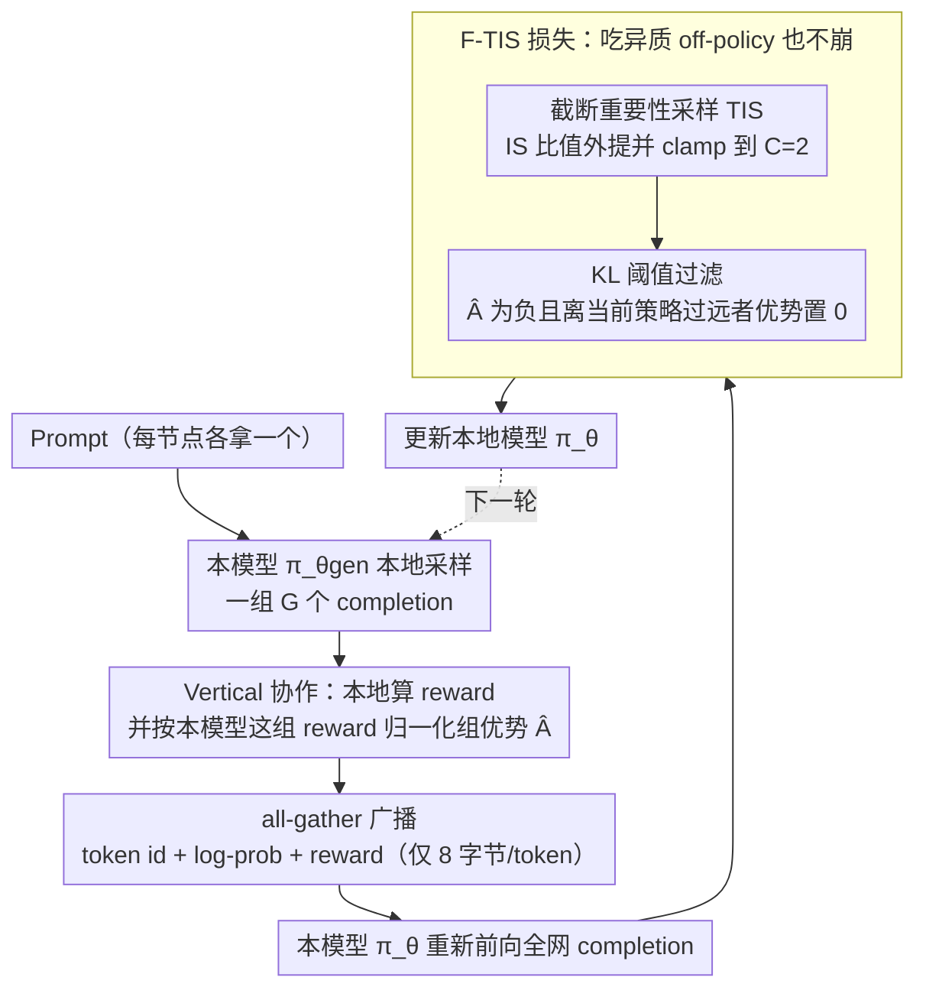

# F-TIS: Harnessing Diverse Models in Collaborative GRPO

**会议**: ICML 2026  
**arXiv**: [2605.22537](https://arxiv.org/abs/2605.22537)  
**代码**: 无  
**领域**: 强化学习 / LLM 后训练 / 去中心化训练  
**关键词**: GRPO, 去中心化 RL, 异质模型协作, 重要性采样, 截断 + 过滤

## 一句话总结
F-TIS 把"截断重要性采样 (TIS)"与"按 KL 阈值过滤负优势 off-policy 样本"两件事拼到一个 GRPO 损失里，让大小不同、专长不同、甚至只有一部分参数可训的多个 LLM 在同一次去中心化 GRPO 训练中互相喂样本，最终收敛和纯 on-policy 持平，并在 OOD 数学任务上最高带来 +12% 的性能。

## 研究背景与动机

**领域现状**：GRPO 已经成为 LLM 后训练（尤其是推理增强）的事实标准。它对每个 prompt 采样一组 $G$ 个 completion，用组内归一化后的 $\hat{A}_i = (r_i - \mu_r)/\sigma_r$ 替代 PPO 的 value model，从而在 PPO 之上省下显存和算力。但 GRPO 的瓶颈不在反传，而在自回归生成——一个 prompt 要采 8 个甚至更多 completion，单卡跑不动。业界做法是把"生成"这一步分布到多节点上并行。

**现有痛点**：现有的分布式 GRPO（LlamaRL、Intellect2、GenRL）几乎都默认所有节点跑同一份模型，目的是让 generator 和 trainer 的分布尽量相同，把样本保持在"接近 on-policy"的状态。这在数据中心里勉强成立，但在"去中心化训练"场景（不同用户、不同算力、不同偏好的模型想合作训同一个任务）里直接破产：模型大小不一样、专长不一样、可训参数子集也不一样。即便所有人从同一个 checkpoint 出发，单纯交换 completion 也会因为浮点不结合性让模型慢慢漂移，产生"看似 on-policy 其实 off-policy"的破坏性噪声，最终让策略崩塌。

**核心矛盾**：GRPO 本质是 on-policy 算法，clipped IS 只能容忍"轻微 stale"，遇到真正的异质 off-policy 样本就垮（论文用 Qwen2.5-1.5B + 3B 联合训练 GSM8K 验证了这一点，两个模型都比单独训差）。要做去中心化，就必须让 GRPO **能吃 off-policy 样本而不崩**，同时通信开销不能爆炸。

**本文目标**：在三类异质场景（模型大小、专长、可训参数）下，让多个不同模型在一次 GRPO 训练中互相投喂样本，最终收敛要达到纯 on-policy 的水平，通信只允许每 token 8 字节级别（log-prob + token id）。

**切入角度**：作者把前人两条独立路线接起来——(1) `yao2025efficient_rl_offpolicy` 提出的 TIS（把重要性比值从 token-level loss 内部抽到外面再 clamp 到 $C$）；(2) DeepSeek-v3、HTTT 系列里"按 KL 阈值过滤掉 $\hat{A}_i<0$ 的 off-policy 样本"的做法。前者负责让梯度方向尽量没偏，后者负责把"负优势 + 远离当前策略"的样本（这些样本恰恰是会放大模型生成不出的 token、产生 gibberish 的元凶）切掉，剩下的 $\hat{A}_i>0$ 样本即便 off-policy 也仍然提供有意义的"该往哪走"的信号。

**核心 idea**：F-TIS = TIS 的低偏置梯度 + 过滤负优势远样本的稳定性，作为去中心化异质 GRPO 的统一损失。

## 方法详解

### 整体框架
F-TIS 跑的是"vertical decentralized RL"：每个节点各自拿一个 prompt，用自己的模型在本地一次生成完整一组 $G$ 个 completion，把 `(token_ids, per-token log-prob, reward)` 通过 all-gather 广播出去；收到全网 completion 后，每个节点把它们一律当成自己策略 $\pi_\theta$ 的训练样本，喂进一个改造过的 GRPO loss 更新本地模型。也就是说，生成阶段各节点用自己的 $\pi_{\theta_{gen}}$ 跑组采样、本地算 reward 和组优势；训练阶段所有 completion 被本节点的 $\pi_\theta$ 重新前向一遍拿到 $\pi_\theta(a_{i,t}|\cdot)$，再与广播来的 $\pi_{\theta_{gen}}(a_{i,t}|\cdot)$ 一起算梯度。整个交换只传 $8\times|p|$ 字节/token（4 字节 token id + 4 字节 log-prob），轻到跨广域网也能跑；而组优势 $\hat{A}_i$ 始终在本地、按"本节点 GRPO 视角"归一化。难点在于：别人的 completion 是用别的模型采的，对本模型来说就是 off-policy 噪声，而 GRPO 本质 on-policy，硬吃就崩——下面三个设计正是让这条 off-policy 数据流不崩的关键。

### 关键设计

**1. 截断重要性采样（TIS）作为骨架：让异质 generator 引入的方差/偏置可控**

异质样本最直接的麻烦是分布失配：别人模型采的 token 在本模型下概率可能很低，标准 GRPO 的 token-level 形式 $\min[r_{i,t}\hat{A}_i,\,\text{clip}(r_{i,t}\hat{A}_i,1\pm\epsilon)]$（其中 $r_{i,t}=\pi_\theta/\pi_{\theta_{gen}}$）在这种大偏移下会被高方差比值带飞。TIS 的做法是把这个重要性比值从 token-loss 内部抽到外面做整体限幅：$\min\big(\pi_\theta/\pi_{\theta_{gen}},\,C\big)\cdot\min\big(\mathcal{R}_{i,\theta}\hat{A}_i,\,\text{clip}(\mathcal{R}_{i,\theta}\hat{A}_i,1-\epsilon,1+\epsilon)\big)$，其中 $\mathcal{R}_{i,\theta}=\pi_\theta/\pi_{\theta_{detach}}$ 用 stop-gradient 防二次反传，外层比值 clamp 到上界 $C=2$。把 IS 外提加封顶，等于给"序列整体有多 off-policy"设了一个天花板，比逐 token 乘 IS 更稳：Figure 2 里纯 NoIS（把异质样本当 on-policy）让 1.5B+3B 双双掉点，VIS（每 token 都乘 IS）对 1.5B 尚可但 3B 明显退化，而 TIS 在 3B 上显著好于 VIS——模型越大，token-level IS 的方差越伤，外提限幅越值。

**2. 基于 KL 阈值的负优势样本过滤：切掉"负优势 + 离得远"这批 gibberish 元凶**

不是所有 off-policy 样本都同样有害。$\hat{A}_i>0$ 的样本在说"这条路是对的，朝它走"，即便 off-policy 方向也有用；真正危险的是 $\hat{A}_i<0$ 又离当前策略很远的样本——它们惩罚的是本模型根本不会生成的 token，反向梯度只会把概率挤到别的低概率 token 上，正是模型崩成 gibberish 的元凶。F-TIS 因此在更新时把同时满足 $\hat{A}_i<0$ 且 $\mathcal{D}_{KL}(\pi_\theta\Vert\pi_{\theta_{gen}})>g$ 的样本 advantage 直接置 0：$\hat{A}_{t,i}=\hat{A}_i$ 当 $\hat{A}_i>0$ 或 $\mathcal{D}_{KL}<g$，否则为 0；被置 0 的 token 不再贡献梯度，但仍参与组优势的均值/方差统计。这里 $g$（默认 50）就是"多远才算远到不能信"的旋钮。Figure 3 表明光这一项（F-NoIS）就能把崩塌的 NoIS 拉回接近 baseline，是稳定性的"大头"，TIS 只是叠在上面收残余收益；而 Section 4.5 进一步显示 $g$ 与模型容量相关：小模型早期偏好小 $g$（更早过滤、不被高方差完成带乱），大模型中后期反而偏好大 $g$（留更多 off-policy 样本做探索）。

**3. Vertical 协作：组优势按"本模型"归一化，而非按 swarm 平均**

异质场景里"怎么分工"会直接决定 advantage 算得对不对。F-TIS 选 vertical——每个节点负责"一个 prompt 的完整一组 completion"，而不是 horizontal 那样"每个节点只贡献一组里的一部分"。区别在于归一化的基准：vertical 下 group advantage 始终用本模型自己这 $G$ 个 reward 算均值方差，干净地反映"对本模型而言哪条完成更好"；horizontal 则会拿 swarm 平均 reward 来归一化，等于把强弱模型混在一起算基线，悄悄引入跨模型的系统性偏差（相当于默认做了一层 reward shaping）。4.7 节的对照实验显示 horizontal F-TIS 对 3B 有明显退化（1.5B 较轻），印证 vertical 才是异质 RL 该默认的分布范式。

### 损失函数 / 训练策略
最终 F-TIS 损失即：
$$\mathcal{L}_{F\text{-}TIS} = \frac{1}{G}\sum_i \frac{1}{|a_i|}\sum_t \min\big(\pi_\theta/\pi_{\theta_{gen}},\;C\big)\cdot \min\big(\mathcal{R}_{i,\theta}\hat{A}_{t,i},\;\text{clip}(\mathcal{R}_{i,\theta}\hat{A}_{t,i},\;1-\epsilon,\;1+\epsilon)\big)$$
其中 $\hat{A}_{t,i}$ 由设计 2 的过滤规则给出。沿用 DR-GRPO 经验**省略 KL 项**（既不增稳也吃显存）。超参：学习率 $1\times 10^{-6}$，group size 12，batch size 16/24，$\epsilon=0.2$，$C=2$，$g=50$，binary 规则奖励（格式+答案都对给 1）；训练数据 GSM8K，50 个迭代，pass@1 greedy decoding 验证。

## 实验关键数据

### 主实验
全部实验在 vertical decentralized RL 下进行，两个模型协同训 GSM8K，OOD 评估用 MATH-500。

| 设置 | 模型 | Alone (MATH-500) | F-TIS 协同 (MATH-500) | 变化 |
|------|------|------------------|-----------------------|------|
| Size: 1.5B + 3B Base | 1.5B Base | 0.406 | 0.470 | **+6.4%** |
|  | 3B Base | 0.575 | 0.540 | −3.5% |
| Size: 1.5B + 3B Coder | 1.5B Coder | 0.410 | 0.470 | **+6.0%** |
|  | 3B Coder | 0.478 | 0.590 | **+11.2%** |
| Expertise: 1.5B Base + 1.5B Coder | 1.5B Base | 0.406 | 0.403 | −0.3% |
|  | 1.5B Coder | 0.410 | 0.410 | 0 |
| Expertise: 3B Base + 3B Coder | 3B Base | 0.575 | 0.520 | −5.5% |
|  | 3B Coder | 0.478 | 0.530 | **+5.2%** |
| Trainable: 1.5B + 1.5B PEFT | 1.5B Base | 0.406 | 0.430 | +2.4% |
|  | 1.5B PEFT | 0.412 | 0.430 | +1.8% |
| Trainable: 3B + 3B PEFT | 3B Base | 0.575 | 0.513 | −6.2% |
|  | 3B PEFT | 0.500 | 0.560 | **+6.0%** |

> 在分布内 GSM8K 上 F-TIS 的验证曲线最终与单独训的 baseline 几乎重合（Figures 4–9），但初期收敛偏慢，作者在 4.5 中归因于过滤掉了早期高方差样本。

### 消融实验

| 配置 | 关键现象 | 说明 |
|------|---------|------|
| NoIS (无 IS) | 1.5B + 3B 双双崩塌，远低于 alone | 异质 off-policy 噪声直接击穿 GRPO |
| VIS (每 token IS) | 1.5B 还行，3B 明显次于 TIS | token-level IS 在大模型上方差大 |
| TIS (无过滤) | 比 NoIS / VIS 都稳，但仍逊于 baseline | IS 外提 + 限幅有效但不够 |
| F-NoIS (仅过滤) | 已接近 baseline | 过滤是稳定性的"大头" |
| **F-TIS (全)** | 与 baseline 持平，OOD 上更好 | TIS + 过滤互补 |
| F-VIS (过滤 + VIS) | 早期更快，后期掉点严重 | 验证 TIS 比 VIS 更适合做底座 |
| Horizontal F-TIS | 3B 明显退化 | 组优势被 swarm 平均带偏，vertical 才合理 |
| $g\in\{5,10,50,100\}$ | 1.5B 偏好小 $g$（早期），3B 偏好大 $g$（后期） | 模型容量越大越能从远 off-policy 探索 |

### 关键发现
- F-TIS 最让人意外的是**它在不少配对里反而提升了 OOD 数学能力**（3B Coder + 1.5B Coder 联合训练让 3B Coder 在 MATH-500 上 +12%），作者解释是 Coder 单独训会过拟合到 coding 风格，混入更通用的样本反而保住了推理。
- 过滤 ($g$) 才是稳定性主因，IS 形式（VIS vs TIS）是次要但决定上限的因素；两者**单独都不够**，必须组合。
- vertical 协作 + 本地组优势是异质 GRPO 的隐藏前提，horizontal 会因为跨模型混合归一化崩。
- 通信只要 8 字节/token（log-prob + token id），让"去中心化跨广域 RL"在工程上可行。

## 亮点与洞察
- **把 TIS 和过滤拼成一个 loss 是 minimum viable patch**：没碰生成、没碰 reward、没碰架构，只在 loss 里多了一个 clamp + 一个 mask，就把 GRPO 从"必须 on-policy"撬到"能吃异质 off-policy"。这种"两条已有路线交叉取并"的拼图思路在工程化论文里很值得借鉴。
- **过滤的 KL 阈值 $g$ 是模型容量相关超参**：小模型早期要严过滤（避免被乱完成带歪），大模型中后期要松过滤（用 off-policy 做探索）。这暗示 $g$ 可以做成自适应、按训练步数或 reward 方差动态调度。
- **OOD 上反而更好的反直觉现象**：联合训不同模型对"弱者"几乎稳赚，对"强者"在分布内略亏但在 OOD 上经常变好，这其实是一种"被动正则化"——同伴的 off-policy 样本充当了 anti-overfit 扰动。把这个观察迁移到 PEFT 场景特别诱人：用全参数模型的 off-policy 样本去训 LoRA，论文里 3B PEFT 涨了 6%。
- **vertical vs horizontal 的解释非常清晰**：advantage 一旦跨模型归一化就把"是不是这个模型的好样本"和"是不是 swarm 的好样本"混在一起，相当于在异质场景里默认引入了 reward shaping。
- **通信预算只是 token + log-prob**，对去中心化 / federated GRPO 是非常实用的工程结论。

## 局限与展望
- 实验全在 Qwen2.5 系（1.5B / 3B / Coder / PEFT）上、仅 GSM8K + MATH-500 两个数据集、50 迭代。还不能下"通用"结论；其它模型家族、code/agent/对话任务、长 horizon RL 都没测。
- "对强者略亏、对弱者大涨"目前只是经验观察，缺少理论刻画。如果不能预测哪个模型会被牺牲，实际去中心化部署里强者节点没动力加入。
- 过滤阈值 $g$ 是固定常数 50，作者自己消融表明它需要随模型大小/训练阶段调，但没给出自动调度策略。
- $C=2$ 的上限来自前人经验，未做敏感性消融。
- KL 估计用 $\mathcal{D}_{KL}(\pi_\theta\Vert\pi_{\theta_{gen}})$ 的 per-sequence 值，长 completion 下数值会偏大，可能让 $g$ 的选择对生成长度敏感（论文没讨论）。
- 没有 wall-clock 速度对比：去中心化的真实收益是"用闲置异质算力换墙钟时间"，但论文没给"传统 on-policy 单机 vs F-TIS 多机"的吞吐表。

## 相关工作与启发
- **vs `yao2025efficient_rl_offpolicy` (TIS)**：原 TIS 主要针对"generator 与 trainer 之间 numeric drift"这种小 off-policy，本文把它拓到"完全不同模型"这种大 off-policy 场景，并发现必须再叠过滤才能稳。
- **vs DeepSeek-v3 / HTTT 的过滤策略**：他们用过滤改单机 GRPO 的稳定性，本文把过滤当成异质协作的关键稳定器，并和 TIS 组合。
- **vs LlamaRL / Intellect2 / GenRL 等分布式 GRPO**：这些工作假设节点同构，本文是第一类系统处理"模型大小 / 专长 / 可训参数都不同"的协作 RL 工作。
- **vs PEFT 的 GRPO 训练**：以前 LoRA + GRPO 通常单训，本文显示掺入全参数模型的 off-policy 样本能显著提升 PEFT 的最终能力（3B PEFT +6%），这是个独立可复用的小贡献。

## 评分
- 新颖性: ⭐⭐⭐⭐ 不是全新算法，但"TIS + filtering + vertical decentralized"的组合首次系统化解决异质 GRPO 的崩塌问题。
- 实验充分度: ⭐⭐⭐ 异质场景三类全覆盖，但只在 Qwen2.5 + GSM8K/MATH-500，缺 wall-clock 和理论分析。
- 写作质量: ⭐⭐⭐⭐ 推导链清晰（NoIS → VIS → TIS → F-NoIS → F-TIS），损失公式和过滤规则都写得明白。
- 价值: ⭐⭐⭐⭐ 对正在搭去中心化 / federated LLM 后训练的团队是直接可用的 minimum viable recipe，对单机训练者也提供了"用 off-policy PEFT 样本提升主模型"的小 trick。

<!-- RELATED:START -->

## 相关论文

- [\[ICML 2026\] UDM-GRPO: 统一离散扩散模型的稳定高效 GRPO](udm-grpo_stable_and_efficient_group_relative_policy_optimization_for_uniform_dis.md)
- [\[ACL 2026\] Mitigating Selection Bias in Large Language Models via Permutation-Aware GRPO](../../ACL2026/llm_alignment/mitigating_selection_bias_in_large_language_models_via_permutation-aware_grpo.md)
- [\[AAAI 2026\] LaF-GRPO: In-Situ Navigation Instruction Generation for the Visually Impaired via GRPO with LLM-as-Follower Reward](../../AAAI2026/llm_alignment/laf-grpo_in-situ_navigation_instruction_generation_for_the_visually_impaired_via.md)
- [\[ICML 2026\] Towards Context-Invariant Safety Alignment for Large Language Models](towards_context-invariant_safety_alignment_for_large_language_models.md)
- [\[ACL 2026\] Taming Extreme Tokens: Covariance-Aware GRPO with Gaussian-Kernel Advantage Reweighting](../../ACL2026/llm_alignment/taming_extreme_tokens_covariance-aware_grpo_with_gaussian-kernel_advantage_rewei.md)

<!-- RELATED:END -->
