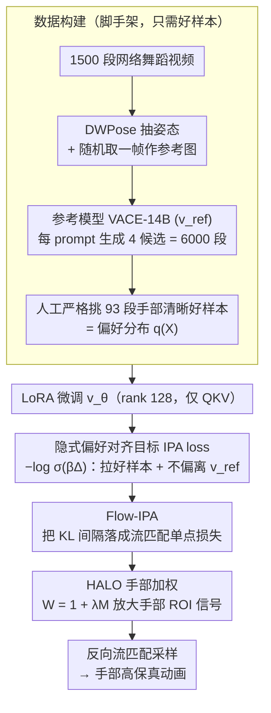

# Implicit Preference Alignment for Human Image Animation

**会议**: ICML 2026  
**arXiv**: [2605.07545](https://arxiv.org/abs/2605.07545)  
**代码**: https://github.com/mdswyz/IPA (有)  
**领域**: 对齐RLHF / 视频生成 / 人体动画  
**关键词**: 偏好对齐, DPO, 流匹配, 人体动画, 手部生成

## 一句话总结
作者提出 Implicit Preference Alignment (IPA)：一种只需"好样本"、不需要构造好/坏配对的后训练方法，通过最大化与预训练参考模型 KL 间隔来等价地最大化隐式奖励，并配合一个把手部 mask 加权进损失的 HALO 模块，让大尺度视频 DiT 在仅 93 个挑选样本下显著改善人体动画的手部保真度。

## 研究背景与动机

**领域现状**：人体图像动画近年从 GAN 范式跃迁到扩散范式（Animate Anyone、MimicMotion）并进一步走向 DiT 大模型（VACE、Wan-Animate），主体外观与时序一致性都已达到很高水平。

**现有痛点**：手指自由度最高、运动复杂度最大，生成视频普遍出现模糊、断指、畸形等"手部塌陷"问题。直接用 RLHF / DPO 来对齐手部偏好是自然的思路，但 DPO 要求"严格的 winner-loser 配对"，而手部状态在帧之间不稳定，绝大多数同一对采样视频要么都还行（Case 1）、要么都崩（Case 2）、要么是混合质量（Case 3），真正满足 DPO 所需 Case 4（一好一坏且每帧都对得上）的样本占比极低。

**核心矛盾**：好/坏严格配对的标注代价对手部任务而言几乎不可承受，但放弃 RLHF 又难以靠 SFT 解决精细结构问题。

**本文目标**：(i) 设计一种只需"good sample"就能完成偏好对齐的目标函数；(ii) 让对齐过程显式聚焦到手部 ROI；(iii) 保留预训练 DiT 的大规模先验知识，避免崩塌。

**切入角度**：作者注意到"难构造严格配对，但孤立挑出好样本相对廉价"——93 个挑出来的好样本 vs. 6000 个候选，只有约 7.5% 能构成 DPO 对。如果能直接对"靠近好样本分布"且"不要偏离预训练先验"两件事联合优化，就能绕开 loser 样本的瓶颈。

**核心 idea**：把"模型分布更靠近偏好分布 q(X) 比参考分布更近"写成 KL 间隔 $\Delta(p_{\text{ref}}, p_\theta) = D_{\text{KL}}(q\|p_{\text{ref}}) - D_{\text{KL}}(q\|p_\theta) > 0$，用 $-\log\sigma(\beta\Delta)$ 作为损失；理论上可证它等价于带 KL 约束的奖励最大化（即隐式奖励），从而只用好样本就完成偏好对齐。

## 方法详解

### 整体框架
整条管线想解决一件事：在拿不到"一好一坏严格配对"的前提下，靠少量挑出来的好样本把大尺度视频 DiT 的手部画质拉上去。作者先用预训练参考模型 VACE-14B 当 $v_{\text{ref}}$，从互联网收 1500 段舞蹈、DWPose 抽姿态、随机取一帧作参考图，让 VACE 每个 prompt 生成 4 个候选共 6000 段视频，再人工严格挑出 93 段"手部清晰"的好样本当偏好分布 $q(X)$。训练侧只挂 LoRA（rank 128，QKV 投影）得到 $v_\theta$，损失是把 KL 间隔落到流匹配上、再叠上手部 mask 加权的目标；推理时直接用 $v_\theta$ 跑反向流匹配采样。

### 关键设计

**1. 隐式偏好对齐目标 (IPA loss)：把"推坏样本"换成"别偏离参考模型"**

DPO 的对比项本质是"拉好样本、推坏样本"，可手部任务里坏样本极难凑齐——6000 个候选里只有约 7.5% 能构成合格的好/坏对。IPA 的做法是干脆不要 loser：只要求模型分布 $p_\theta$ 比参考分布 $p_{\text{ref}}$ 更靠近偏好分布 $q$，写成 $D_{\text{KL}}(q\|p_\theta) < D_{\text{KL}}(q\|p_{\text{ref}})$，等价地令 KL 间隔 $\Delta(p_{\text{ref}}, p_\theta) = D_{\text{KL}}(q\|p_{\text{ref}}) - D_{\text{KL}}(q\|p_\theta) > 0$，再套一层 log-sigmoid 得到损失 $\mathcal{L} = -\log\sigma(\beta\Delta(p_{\text{ref}}, p_\theta))$。这一目标之所以成立，是因为它可被证明等价于一个带 KL 正则的奖励最大化 $\max \mathbb{E}_q[r] - \beta D_{\text{KL}}(p_\theta\|p_{\text{ref}})$：其最优解满足 $p_\theta \propto p_{\text{ref}}\exp(r/\beta)$，反代后得 $\mathbb{E}_q[r] = \beta\Delta + C$，所以最小化 IPA loss 就是在隐式地最大化一个未显式指定的奖励 $r$。换句话说，参考模型的 KL 约束充当了"软的负面信号"，既绕开 loser 标注，又因为不让 $p_\theta$ 跑远而防住 mode collapse。

**2. Flow-IPA：把抽象的 KL 间隔落成流匹配上能反传的损失**

$\Delta(p_{\text{ref}}, p_\theta)$ 直接积分整条概率路径并不可解。作者借 Rectified Flow"线性插值 + 常速度场"的结构，把 KL 沿时间的增量写成解析式 $\frac{d}{dt}D_{\text{KL}} = \frac{1}{2}(1-t)^2 \mathbb{E}\|v - v_\phi(Z_t;t,I,\mathcal{P})\|^2$——每个采样时刻只需一次 forward 就能估出 KL 微分。对 $t\in[0,1]$ 积分后，间隔化简成 $\Delta = \mathbb{E}_{t,v}[\frac{1}{2}(1-t)^2(\|v - v_{\text{ref}}\|^2 - \|v - v_\theta\|^2)]$，代回 log-sigmoid 即得最终可训练损失。这一步的意义在于把"对齐整段概率轨迹"压缩成"在随机时刻 $t$ 上的单点 mini-batch 损失"，让原本抽象的分布距离变成 DiT 上可直接梯度下降的量。

**3. Hand-Aware Local Optimization (HALO)：把对齐预算显式倾斜到手部像素**

好样本里手部只占画面的一小块，若用全局 MSE，模型会把损失"花"在大面积的身体和背景上、把手忽略掉。HALO 直接从 DWPose 关键点取二值手部 mask $\mathbf{M}$，构造空间权重 $\mathbf{W} = \mathbf{1} + \lambda\mathbf{M}$，把损失里的速度场偏差 $\|v - v_\phi\|^2$ 替换成加权形式 $\|\sqrt{\mathbf{W}}\odot(v - v_\phi)\|^2$，相当于在手部位置放大学习信号。$\lambda=10$ 时最优。它把有限的 93 个好样本里最关键的 ROI 信号撑起来，让梯度被推回手部而不是淹没在易学的躯干区域；而且这套 mask 加权几乎零成本，可从手扩展到脸、眼、文字等任意小面积高难度区域。

### 损失函数 / 训练策略
三块拼起来即最终损失（Eq.(29)）：$\mathcal{L} = \mathbb{E}_{t,v}[-\log\sigma(\frac{\beta}{2}(1-t)^2(\|\sqrt{\mathbf{W}}\odot(v - v_{\text{ref}})\|^2 - \|\sqrt{\mathbf{W}}\odot(v - v_\theta)\|^2))]$。用 LoRA 微调而非全参（rank 128，只挂 QKV），跑 1000 步、batch 8、8×H20。$\beta=600$ 控制约束强度，它同时是 KL penalty 系数和 sigmoid 斜率；$\lambda=10$ 控制手部权重。

## 实验关键数据

### 主实验

| 数据集 | 指标 | IPA | 次优 (Wan-Animate) | 提升 |
|--------|------|-----|---------------------|------|
| TikTok | FID-VID ↓ | 5.9 | 8.6 | −31% |
| TikTok | FVD ↓ | 255 | 316 | −19% |
| TikTok | SSIM ↑ | 0.841 | 0.799 | +5.3% |
| TikTok | PSNR ↑ | 23.8 | 20.5 | +3.3dB |
| 自建 hand bench | FID-VID ↓ | 6.3 | 10.6 (UniAnimate-DiT) | −41% |
| 自建 hand bench | SSIM-Hand ↑ | 0.606 | 0.544 | +0.06 |
| 自建 hand bench | PSNR-Hand ↑ | 18.9 | 15.3 (VACE) | +3.6dB |

### 消融实验

| 数据集 | IPA | HALO | FID-VID ↓ | FVD ↓ | SSIM ↑ | PSNR ↑ |
|--------|-----|------|-----------|-------|--------|--------|
| TikTok | ✓ | ✓ | 5.9 | 255 | 0.841 | 23.8 |
| TikTok | ✓ | × | 7.9 | 288 | 0.819 | 22.7 |
| TikTok | × | × | 13.4 | 427 | 0.777 | 20.2 |
| 自建 | ✓ | ✓ | 6.3 | 224 | 0.757 | 21.5 |
| 自建 | × | × | 12.5 | 327 | 0.668 | 18.2 |

### 关键发现
- IPA 单独能从 FID 13.4 → 7.9（−41%），是主要贡献者；HALO 再压到 5.9，说明"全局对齐 + 局部加权"互补。
- $\beta$ 存在明显甜点：$\beta=200$ 约束太弱过拟合 93 样本；$\beta=1000$ 约束过强学不动；$\beta=600$ 最优。
- $\lambda$ 同样单峰：0.1→10 单调提升，到 100 会破坏全局质量。
- 数据效率：93 个好样本能匹配到 DPO 对的只有 7 对（7.5%），在同等成本下做 DPO 不公平也不可行，IPA 的最大价值是降低数据构造门槛。

## 亮点与洞察
- **理论严谨**：从 KL 间隔出发推导出 log-sigmoid 损失，并反向证明等价于隐式奖励最大化——这条链补全了 "为什么去掉 loser 后仍是合理 RLHF" 的理论空白，结构上和 Flow-DPO 长得一样但出发点完全不同。
- **数据范式启发**：把"严格偏好对 (winner, loser)"放宽为"仅 winner + 先验软约束"，对很多 ROI 集中、loser 难定义的任务（医学图像、手写、细粒度纹理）都有迁移价值。
- **HALO 复用性高**：mask 加权可以从手部扩展到脸、眼、文字等任意"小面积高难度 ROI"，几乎是免费的工程升级。
- $\beta$ 的双重解释——KL 强度 + sigmoid 斜率——是个值得借鉴的训练动力学视角。

## 局限与展望
- 仅 93 个好样本来源单一（互联网舞蹈），分布偏窄；在体育、手语、3D 物体抓取等更复杂手势下泛化未验证。
- 依赖 DWPose 提供 mask，mask 质量直接决定 HALO 上限，姿态估计失败的极端遮挡场景可能反受其害。
- $\beta=600$ 与 $\lambda=10$ 是经验设定，对新模型/新分辨率需要重新搜索。
- 只对 QKV 加 LoRA，对全 attention/MLP 加 LoRA 或全量微调是否更好未做对比。

## 相关工作与启发
- **vs Diffusion-DPO / Flow-DPO**：结构形式相同，但 DPO 从 Bradley-Terry 模型推出"对比 winner-loser"，IPA 从 KL 间隔推出"对比 winner 与参考"，因此能砍掉 loser；作者明确说不抢算子上的新意，主张推导路径与适用场景才是贡献。
- **vs MimicMotion 的 hand region enhancement**：MimicMotion 用 loss reweighting 改训练，IPA 把 mask 加权嫁接到偏好对齐阶段，是 post-training 而非 from-scratch，成本低很多。
- **vs Animate Anyone / VACE / Wan-Animate**：本文不重新设计架构，直接复用 VACE-14B 作 $v_{\text{ref}}$，是典型的"小投入大回报"的 post-training 工作。

## 评分
- 新颖性: ⭐⭐⭐⭐ 结构和 Flow-DPO 一样但推导独立，且首次系统分析"好/坏配对在手部任务上的不可行性"。
- 实验充分度: ⭐⭐⭐⭐ 多 baseline、双 benchmark、专门的 hand metric、$\beta$ 与 $\lambda$ 双参数扫，唯一遗憾是没和 DPO 在 7 对小数据下做正面对比（虽然作者解释了为何不公平）。
- 写作质量: ⭐⭐⭐⭐ 理论推导清晰，4 个 Case 把动机讲得很直观；公式编号略多但都必要。
- 价值: ⭐⭐⭐⭐ 给 RLHF 后训练社区提供了"无 loser 也能对齐"的范式，且工程上即插即用，迁移潜力大。

<!-- RELATED:START -->

## 相关论文

- [\[ICML 2026\] Implicit Safety Alignment from Crowd Preferences](implicit_safety_alignment_from_crowd_preferences.md)
- [\[ICML 2026\] Alignment-Aware Decoding](alignment-aware_decoding.md)
- [\[ICML 2026\] Curriculum Learning for Safety Alignment](curriculum_learning_for_safety_alignment.md)
- [\[ICML 2026\] Efficient Preference Poisoning Attack on Offline RLHF](efficient_preference_poisoning_attack_on_offline_rlhf.md)
- [\[ACL 2025\] PKU-SafeRLHF: Towards Multi-Level Safety Alignment for LLMs with Human Preference](../../ACL2025/llm_alignment/pku-saferlhf_towards_multi-level_safety_alignment_for_llms_with_human_preference.md)

<!-- RELATED:END -->
