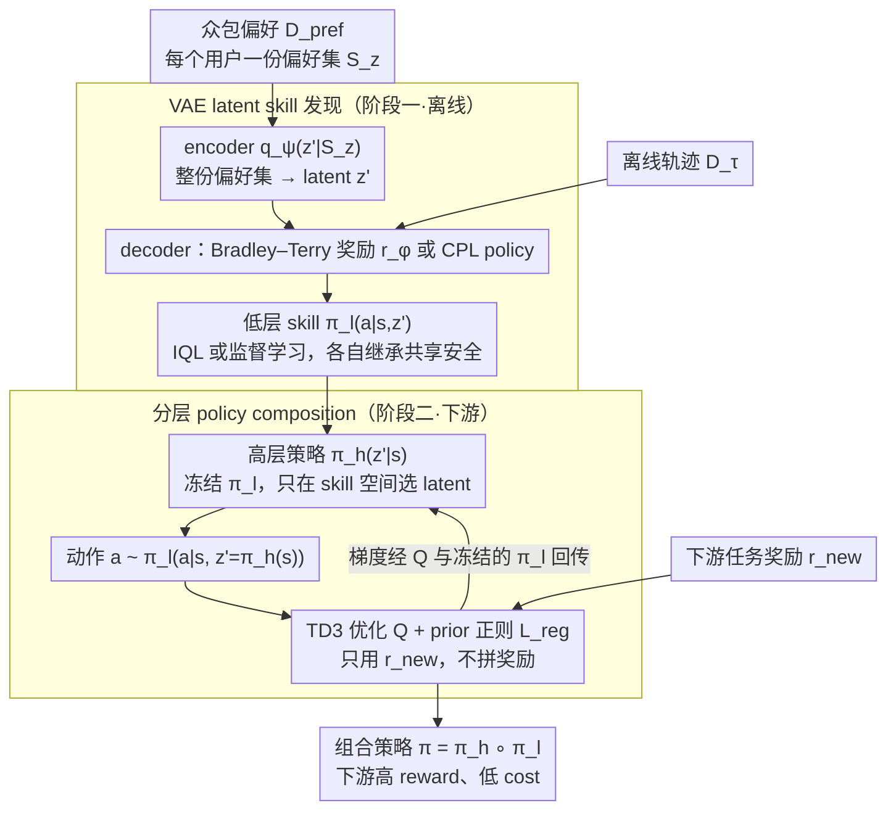

# Implicit Safety Alignment from Crowd Preferences

**会议**: ICML 2026  
**arXiv**: [2605.21822](https://arxiv.org/abs/2605.21822)  
**代码**: 论文未公开  
**领域**: 对齐RLHF / Safe RL / 偏好学习  
**关键词**: 众包偏好, 隐式安全对齐, 技能发现, VAE, 分层强化学习

## 一句话总结
针对众包偏好数据中"用户目标各异但安全准则共享"的结构，作者证明传统 reward combination 会被多数用户偏好污染且对权重敏感，转而提出 Safe Crowd Preference-based RL：用 VAE 把众包偏好编码成 latent-conditioned 低层 skill，再训练高层策略在 skill 空间组合，从而在没有显式安全奖励的情况下把下游 cost 压到接近 Oracle，同时任务回报基本不掉。

## 研究背景与动机

**领域现状**：RLHF 已经从单一标注者扩展到众包偏好场景。多数工作（VPL、MaxMin-RLHF、Personalized Soups）关注的是如何尊重用户**差异**——给不同用户学不同的 reward 或 policy。Safe RLHF 则把安全单独拎出来当作一类额外的偏好标签。

**现有痛点**：现实里更常见的情况是——同一份偏好数据里**既有个体差异、又有共同准则**（"我可能不一定喜欢这条轨迹，但所有人都不想撞车"），而标注时没有人会把这两类信号分开打标签。直接套 vanilla RLHF 学一个全局 reward $\hat r(s,a)$ 再和下游任务奖励 $r_{\text{new}}$ 加权（$r' = (1-\omega)r_{\text{new}} + \omega \hat r$）会出两个问题：(i) $\hat r$ 里既混进了大家共享的安全准则，也混进了多数派的个人偏好；(ii) 权重 $\omega$ 极其敏感，scale 不同就调不动。

**核心矛盾**：众包偏好中**共享的安全准则**和**用户特定目标**在 reward 层面是耦合的，没有自然的解耦信号；而下游任务往往只关心自己的 $r_{\text{new}}$，不希望被多数派的用户偏好"绑架"。

**本文目标**：(1) 形式化"众包偏好中存在共享安全准则"这一结构，并刻画 vanilla RLHF 在此设定下的失败模式；(2) 在没有显式安全奖励、没有 oracle 标签 $z$、且偏好数据可能严重失衡的前提下，把众包共享的安全信号迁移到任意下游任务。

**切入角度**：与其在 **reward** 层面去拼凑，不如在 **policy** 层面做组合。如果能把每个用户的偏好编码成一个 latent-conditioned skill，每个 skill 由于都"在偏好的分布上"而天然继承了安全准则，那么只需要在 skill 空间训一个高层策略，它就会落在"所有人都觉得安全"的行为流形里——下游想优化什么 $r_{\text{new}}$ 都可以，不会越界。

**核心 idea**：用 *policy composition* 替换 *reward combination*——VAE 从众包偏好抽 latent skill，高层策略只在 skill 索引上做决策，安全是 skill 空间结构自动赋予的，而不是靠 reward 加权调出来的。

## 方法详解

### 整体框架

这篇论文要在没有显式安全奖励、也拿不到 oracle 用户标签的前提下，把众包偏好里"大家共享"的安全准则迁移到任意下游任务。它先把众包偏好奖励分解为 $r(s,a,z) = r_{\text{user}}(s,a,z) + r_{\text{share}}(s,a)$（$z$ 是不可观察的用户上下文，$r_{\text{share}}$ 是所有人共享的安全惩罚——落入 $X_{\text{unsafe}}$ 给 $-K$，否则 0），然后用两阶段 pipeline 把安全"焊"进策略空间而非奖励里。第一阶段离线 skill 发现：拿众包偏好集 $\mathcal D_{\text{pref}} = \{S_z\}$，用 VAE 的 encoder $q_\psi(z'|S_z)$ 把每个用户的偏好集映射到 latent $z'$，decoder 给出 latent-conditioned reward $r_\phi(s,a,z')$ 或 policy $\pi_\theta(a|s,z')$，得到一组 *preference-aligned* 的低层 skill $\pi_l(a|s,z')$。第二阶段下游训练：冻住所有低层 skill，只训一个高层策略 $\pi_h(z'|s)$，动作经 $a \sim \pi_l(a|s, z'=\pi_h(s))$ 生成，高层仅用下游 $r_{\text{new}}$ 优化 Q 值。整体输入是 $\mathcal D_{\text{pref}}$（众包偏好）+ $\mathcal D_\tau$（任意一份离线轨迹）+ 下游 $r_{\text{new}}$，输出是组合策略 $\pi = \pi_h \circ \pi_l$。下图画出这条两阶段数据流（理论上给 reward combination "判死刑" 的两个定理是这条路线的动机，不在数据流上、故不画为节点，对应下面的关键设计 1）。

### 关键设计

**1. 用两个定理给 vanilla RLHF 的 reward combination 判死刑**

baseline 路线的自然做法是学一个全局奖励 $\hat r$ 再和任务奖励加权 $r' = (1-\omega)r_{\text{new}} + \omega\hat r$，作者要先证明这条路为什么走不通才有理由换路线。Theorem 4.2 说明：当安全惩罚足够大（$K > 2L\max|r_{\text{user}}|$）时，所有"安全 vs 不安全"的轨迹对都是 consistent 的，因此无穷数据下 $\hat u(\tau^{\text{safe}}) > \hat u(\tau^{\text{unsafe}})$——$\hat r$ 确实学得到安全偏好，这一步不是问题。真正的硬伤在 Theorem 4.3 刻画的失衡场景：只要某个用户 $z_k$ 的占比超过阈值 $p(z_k) > \frac{|\mathcal T|-1}{\min_{(\tau,\tau') \in X_{\text{ics}}} N(\tau,\tau',z_k) + |\mathcal T|}$，学到的 $\hat u$ 在所有 inconsistent pair 上的排序就**完全等同于** $u(\cdot, z_k)$，也就是 $\hat r$ 把多数派的个人偏好整个塞进了下游优化，与 $r_{\text{new}}$ 错配；再叠加权重 $\omega$ 对 reward scale 极度敏感、调不动，这条路就两头堵死了。这两个定理同时给出了实验设计的靶子——后面专门构造 10:1 的失衡数据集，去验证 RC 的 Pareto frontier 整体偏离 Oracle。

**2. VAE-based latent skill discovery：把"用户差异"显式拆成 latent 索引的 skill**

既然没有真实的 $z$ 标签，就用 latent $z'$ 当它的代理。encoder $q_\psi(z'|S_z)$ 把**同一用户的整份偏好集** $S_z$（而非单个 pair）映射到 latent——用集合而非单 pair 是关键，单 pair 的信息量不足以区分用户。decoder 端用 Bradley–Terry 在 $z'$ 上预测偏好 $P(y=1|\tau^1,\tau^2,z') = \frac{\exp \hat u(\tau^1,z')}{\exp \hat u(\tau^1,z') + \exp \hat u(\tau^2,z')}$，配合 KL 正则 $D_{KL}(q_\psi \| p(z'))$ 训练；对应 partial-return 模型时，低层策略由 IQL 在 $\mathcal D_\tau$ 上对每个 $z'$ 做 offline RL：$\max_{\pi_\theta(a|s,z')} \mathbb E_{\tau \sim \mathcal D_\tau}[\sum_t r_\phi(s_t,a_t,z')]$。作者额外提出 **Safe-CPL** 变体：把 VPL 套进 regret-based 模型，用 CPL 的偏好概率 $P(y=1|\tau^1,\tau^2,z') = \frac{\exp f(\tau^1|z')}{\exp f(\tau^1|z') + \exp \lambda f(\tau^2|z')}$，其中 $f(\tau^i|z') = \sum_t \gamma^t \alpha \log \pi_\theta(a_t^i|s_t^i,z')$，直接学 policy 不学 reward，绕开了 RL 优化不稳定。这套设计之所以能继承安全，理论上由 Cor. A.6 保证：只要每个低层 $\pi_l(\cdot|z')$ 对自己的 conditioned utility 最优，由它们组合而成的任何高层都自动安全。

**3. 分层 policy composition + prior regularization：把安全约束从奖励项变成空间结构**

下游不再去拼凑奖励，而是让高层策略只在"已经被偏好对齐"的 skill 空间里搜索：动作 $a \sim \pi_l(a|s, z'=\pi_h(s))$，高层每步可切换 skill，用 TD3 训练，损失 $L_{\pi_h} = -\mathbb E_{a \sim \pi_h \cdot \pi_l}[Q(s,a) + \beta_{\text{reg}} L_{\text{reg}}]$。其中 prior regularization 项 $L_{\text{reg}} = \log p(z' = \pi_h(s))$ 是 VAE 先验下的 log-likelihood，作用是把 $z'$ 拉回训练时见过的 latent 区域，避免高层选出 OOD 的 skill 导致 $\pi_l$ 失控；离线场景再加 $\beta_{\text{BC}} \|a - a_D\|_2^2$ 抑制 OOD 动作。整个过程 $\pi_l$ 冻结，梯度经过 $Q$ 和 $\pi_l$ 回传到 $\pi_h$。这样设计的好处是：skill 空间天然带安全（每个 skill 都来自偏好对齐的训练），下游只优化 $r_{\text{new}}$ 就不会越界，不再有 reward combination 里 $\omega$ 那种 trade-off 旋钮；$\beta_{\text{reg}}$ 虽然也是超参，但实验显示它在很宽范围内对 reward 影响很小、对 cost 单调改善，比 $\omega$ 好调得多；而 Theorem A.7 给出的 cost 上界与低层 skill 次优度成正比，直观地说就是"skill 学得越好，下游越安全"。

### 损失函数 / 训练策略

Skill 发现阶段的 VAE ELBO（Eq. 7）：

$\mathbb E_{S_z \sim \mathcal D_{\text{pref}}}\big[\mathbb E_{z' \sim q_\psi(z'|S_z)}[\sum_{(\tau^1,\tau^2,y) \in S_z} \log P(y|\tau^1,\tau^2,z')] - D_{KL}(q_\psi(z'|S_z) \| p(z'))\big]$。

下游离线训练（Eq. 12）：$L_{\pi_h}^{\text{offline}} = -\mathbb E[Q(s_D,a) + \beta_{\text{reg}} L_{\text{reg}} + \beta_{\text{BC}} L_{\text{BC}}]$。底层 RL 用 IQL（VPL）或纯监督（CPL 变体），下游统一 TD3+BC（offline）或 TD3（online）。

## 实验关键数据

### 主实验

6 个 safe-RL 环境（Bullet-Safety-Gym + Safety-Gymnasium），每个环境构造一组目标特定 reward + 共享安全 reward 模拟众包，offline downstream 设定：

| Env | 指标 | Oracle | Task-Only | SOPL | RC($\omega$=0.5) | Safe-VPL | Safe-CPL |
|------|------|--------|-----------|------|------------------|----------|----------|
| Reach | Rew / Cost | 1.00 / .038 | 1.04 / 1.000 | 0.98 / .024 | 0.83 / .101 | 0.98 / .166 | 0.98 / .069 |
| Run | Rew / Cost | 1.00 / 0 | 1.00 / 1.000 | 0.99 / 0 | 1.00 / 0 | 0.95 / 0 | 0.97 / 0 |
| HalfCheetah-vel | Rew / Cost | 1.00 / 0 | 1.85 / 1.000 | 0.93 / .014 | 0.44 / .107 | 0.96 / .004 | 0.92 / .018 |
| **Average** | Rew / Cost | 1.00 / .01 | **1.46 / 1.00** | 1.04 / .01 | 0.82 / .05 | **0.93 / .03** | **0.92 / .02** |

Task-Only 平均 reward 1.46 但 cost 飙到 1.00（疯狂越界换分数）；本文 Safe-VPL/CPL 把 cost 压回 0.02-0.03（已经接近 Oracle 的 0.01），任务回报 0.92-0.93（仅比 Oracle 低 7-8 个点）。SOPL 需要纯安全偏好数据（作弊基线）才能达到 1.04/0.01。

LLM bandit 验证（Table 2，imbalanced 80:20）：Task-only 0.95 / 0.24，RC($\omega$=0.25) 0.94 / 0.22，RC($\omega$=0.75) 0.50 / 0.00，**Ours 0.75 / 0.00**——RC 要么不安全要么没性能，本文同时兼顾。

### 消融实验

| 配置 | 关键现象 | 说明 |
|------|---------|------|
| 不同 $\beta_{\text{reg}}$ | reward 几乎不动，cost 随 $\beta_{\text{reg}}$ 单调改善 | 比 RC 的 $\omega$ 好调得多 |
| Preference noise（随机翻转 label） | task reward 稳，safety cost 随噪声退化 | 安全信号容易被噪声腐蚀，但 skill 多样性不受影响 |
| Crowd size（用户数） | 适度退化，仍显著好于 Task-only | latent 容量足够 cover 用户增长 |
| Balanced vs Imbalanced（10:1）| 本文平均 reward/cost 退化 < 0.02；RC 退化 ≥ 0.10 | 验证 Theorem 4.3 的 RC 偏置预测 |

### 关键发现
- RC 的 Pareto frontier 在 imbalanced 设定下整体向"高 cost / 低 reward"方向偏移，而本文方法的点几乎贴在 Oracle 上，证明 policy composition 对 preference imbalance 鲁棒。
- $\beta_{\text{reg}}$ 越大 → skill 选择越保守 → 更安全但任务略掉点；$\beta_{\text{reg}}$ 小 → 灵活但安全略退化但仍远好于直接优化 $r_{\text{new}}$，整体是个"易调参"的旋钮。
- preference noise 主要伤 safety 不伤 task：意味着噪声破坏的是"共享准则"信号，而"用户差异"的多样性反而被噪声保留下来给下游用。
- per-task 视角（Fig. 3）：RC 在 imbalanced 下，$\omega$ 偏小时所有任务都不安全，$\omega$ 偏大时只在与多数派对齐的任务上有 reward——一次只能服务一类任务；本文方法跨所有任务都同时安全且高 reward。

## 亮点与洞察
- **把"安全"从奖励项搬到空间结构**。Reward combination 把安全当作 $r_{\text{new}}$ 的加项，永远要调权重；policy composition 把安全当作 skill 空间本身的属性，下游只需优化任务，安全是 free lunch。这种"约束变流形"的思路可以迁移到任何"共享准则 + 个体差异"的偏好学习场景（不仅是安全，也可以是礼貌、风格、价值观）。
- **新提的 Safe-CPL 变体**。把 VPL 从 partial-return 推广到 regret-based + CPL，整个 skill 发现变成 reward-free 的监督学习，绕开 RL 优化不稳定；这是一个独立可用的技术贡献，给 RLHF 社区提供了 VPL × CPL 的乘积空间。
- **两个定理给 baseline 判死刑**。Theorem 4.3 给出失衡阈值的闭式上界——只要某用户比例超过 $\frac{|\mathcal T|-1}{N+|\mathcal T|}$，学到的 reward 就完全等同于该用户的偏好。这种"用定理 kill baseline"的写法非常有说服力，比纯实验对比强很多。
- **prior regularization 的角色**。用 VAE prior 上的 log-likelihood 做高层正则，本质上是"用生成模型限制 policy 搜索空间"——这思路和 SPiRL、PRiOR 等 skill prior 工作同源，但首次和 *crowd preference* 的 latent 结构结合。

## 局限与展望
- 作者承认：假设众包偏好"无噪、共享一致的安全准则"，实际中可能有恶意 / 对抗用户；噪声实验显示 cost 会被腐蚀。
- 我看到的额外局限：(i) 整个 LLM 验证只是个 3-class bandit toy，远没到真实对话场景，"对 LLM 适用"的论断证据偏薄；(ii) latent $z'$ 维度、VAE encoder 看到的 set size 这些超参在主文没有 ablation，可能影响 skill discovery 质量；(iii) Cost upper bound（Thm A.7）依赖低层 skill 接近最优，但实际 IQL 学到的 skill 离最优有多远没有量化；(iv) skill 必须在与 $\mathcal D_\tau$ 同分布的数据上学，跨域迁移没讨论。
- 改进思路：(1) 把 latent prior 替换成可学习的混合分布，避免 KL 把所有用户挤到单峰高斯；(2) 引入 robust aggregation（如 MaxMin-RLHF 风格）显式抵抗对抗用户；(3) 在更真实的 LLM 安全数据集（HH-RLHF / BeaverTails）上验证；(4) 把 $r_{\text{share}}$ 从二值惩罚扩展到连续 cost（论文 Appendix F 提到但未实现）。

## 相关工作与启发
- **vs VPL (Poddar et al., 2024)**：同样用 VAE 建模 latent context，但 VPL 目标是"识别个体偏好以提升多样性"，本文目标是"组合个体行为以解决新任务并继承共享安全"，技术骨架同源、问题设定与下游用法完全不同。
- **vs Safe RLHF (Dai et al., 2024)**：Safe RLHF 假设任务奖励和安全奖励有显式区分的偏好标签，本文则假设两者在 preference 中是耦合不可分的，更贴近现实标注流程。
- **vs ICRL (Malik et al., 2021; Papadimitriou & Brown, 2024)**：ICRL 从 demonstration / preference 反推 constraint，本文不显式建模 constraint，而是把它隐式编进 skill 空间。
- **vs CPL (Hejna et al., 2024)**：本文把 CPL 套进 VPL 的 latent 框架，得到一个 reward-free 的 crowd preference skill discovery 算法，是 CPL 在多用户场景的自然扩展。
- **vs SPiRL / OPAL 等 skill prior 工作**：传统 skill prior 从 demonstration 抽，本文从 preference 抽——给"无 demonstration 但有偏好"的场景（典型如 LLM 标注）补上了一条路。

## 评分
- 新颖性: ⭐⭐⭐⭐ 设定（众包偏好的共享安全）和路线（policy composition 替代 reward combination）都很新，Safe-CPL 是额外技术贡献。
- 实验充分度: ⭐⭐⭐ 6 个 safe-RL 环境 + 失衡设定 + 多组消融充分，但 LLM 验证只是 3-class bandit toy，"对 LLM 适用"的证据偏弱。
- 写作质量: ⭐⭐⭐⭐ 用两个定理把 baseline 路线的失败模式刻画到位，方法-实验呼应紧密，逻辑链清晰。
- 价值: ⭐⭐⭐⭐ "把约束变成空间结构"的思路对偏好对齐社区有启发，VPL × CPL 的组合可被直接复用；对真实 LLM RLHF 的指导价值取决于后续能否扩展到大模型场景。

<!-- RELATED:START -->

## 相关论文

- [\[ICML 2026\] Implicit Preference Alignment for Human Image Animation](implicit_preference_alignment_for_human_image_animation.md)
- [\[ICML 2026\] Curriculum Learning for Safety Alignment](curriculum_learning_for_safety_alignment.md)
- [\[ICML 2026\] MESA: Improving MoE Safety Alignment via Decentralized Expertise](mesa_improving_moe_safety_alignment_via_decentralized_expertise.md)
- [\[ICML 2026\] Towards Context-Invariant Safety Alignment for Large Language Models](towards_context-invariant_safety_alignment_for_large_language_models.md)
- [\[ICML 2026\] Quantifying the Salience of Geo-Cultural Values for Pluralistic Safety Alignment](quantifying_the_salience_of_geo-cultural_values_for_pluralistic_safety_alignment.md)

<!-- RELATED:END -->
