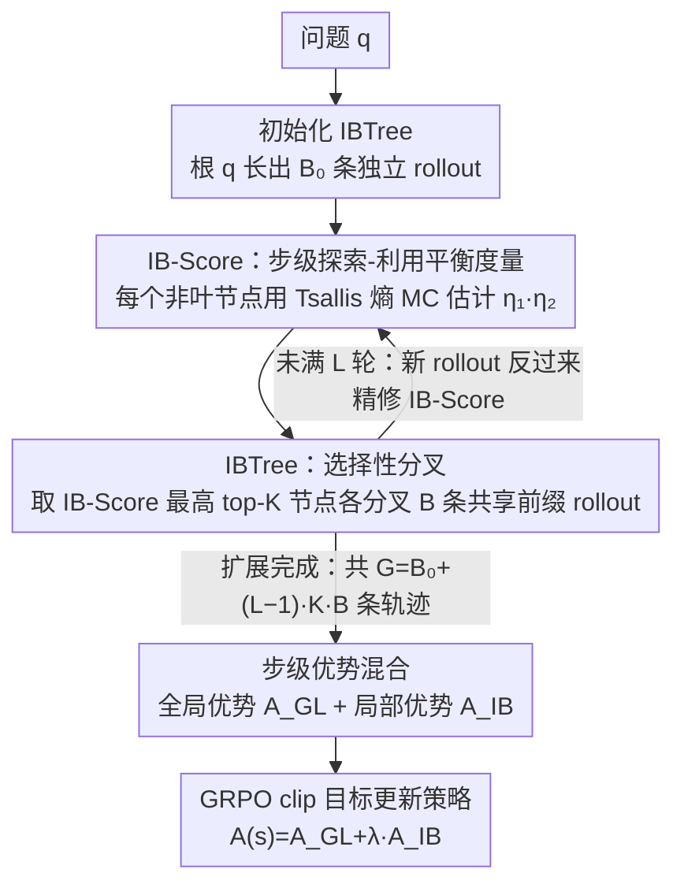

# Long Live The Balance: Information Bottleneck Driven Tree-based Policy Optimization

**会议**: ICML 2026  
**arXiv**: [2605.28109](https://arxiv.org/abs/2605.28109)  
**代码**: https://github.com/ (论文称已开源, 仓库地址未在正文给出)  
**领域**: 对齐RLHF / LLM 推理 / 在线强化学习  
**关键词**: 信息瓶颈, GRPO, 树搜索, 探索-利用平衡, 步级优势

## 一句话总结
本文用信息瓶颈 (IB) 理论提出一个可量化"探索-利用平衡"的步级指标 IB-Score, 并据此设计 IB 引导的树采样 (IBTree) + 步级局部/全局优势, 在 Qwen3-1.7B/8B 上比 GRPO 平均提升 2.9–3.6%, 同时在同 token 预算下多采到 50% 轨迹.

## 研究背景与动机

**领域现状**: 当前 LLM 推理后训练主流是在线 RL, 以 GRPO 为代表——对同一问题独立采样 G 条轨迹, 用结果奖励做组内归一化优势, 再做带 clip 的策略梯度更新.

**现有痛点**: 作者用 Qwen3-8B-Base 复现 GRPO 后发现两个互相耦合的失败模式: ① **过度利用** —— 训练几步后策略熵骤降, 模型早早收敛到高确定性局部最优, 同一组内 G 条轨迹趋同, 有效组比例 (Eff-Rate, 即奖励方差非零的组占比) 持续下滑, 学习信号稀疏; ② **过度探索** —— 加 clip-higher 或 entropy regularization 强行抬熵, 熵能维持但 Eff-Rate 继续掉, 严重时还会出现熵爆炸训练崩塌. 两类正则化在表 1 里都没刷过 vanilla GRPO.

**核心矛盾**: 缺一个**既能量化"探索-利用是否平衡"、又是步级 (step-level) 而非 token 级或序列级**的客观指标. token 级熵会放大无关 token 的影响, 序列级 IB 正则 (如 IBRO) 又太粗粒度看不到中间推理步.

**本文目标**: (1) 给出一个步级、可在线估计的平衡度指标; (2) 把它作为优化目标融进 GRPO; (3) 解决"每步都要估 IB 太贵"的实现瓶颈.

**切入角度**: 把 IB 目标 $\min I(X;Z) - \beta I(Z;Y)$ 套到 LLM 推理上 —— 把推理步序列 $\tau=\{s_i\}$ 当瓶颈表示 $Z$, 问题 $q$ 当输入 $X$, 正确答案 $a^*$ 当输出 $Y$. 这样**探索项**自然写成 $H(s_i|q,s_{<i})$ (步级生成熵), **利用项**写成 $H(s_i|a^*,q,s_{<i})$ (给定正确答案后该步的不确定性, 越低说明该步越"答案相关"). 二者用 $\beta$ 折中就是一个干净的平衡度量.

**核心 idea**: 用 **IB-Score** 同时打分"这一步够不够多样"和"这一步够不够指向正确答案", 再用一棵**只在 IB-Score 最高节点分叉**的搜索树, 一鸟二石地搞定步级 IB 估计 + 高效在线采样.

## 方法详解

### 整体框架
对每个问题 $q$, IB-TPO 跑一棵 IBTree: 初始只有根 $q$, 用 $B_0$ 条独立 rollout 长出一棵初始树, 之后做 $L-1$ 轮扩展, 每轮从所有非叶节点里挑 IB-Score 最高的 $K$ 个, 各分叉出 $B$ 条新轨迹 (共享前缀, 复用 vLLM prefix cache). 总轨迹数 $G = B_0 + (L-1)\cdot K\cdot B$. 树长完后, 对每个节点同时算**全局优势** $A_{GL}$ (该节点到答案的 reward density 减去根) 和**局部优势** $A_{IB}$ (来自 IB-Score 的步级信号), 加权后塞进标准 GRPO clip 目标更新策略.

### 关键设计

1. **IB-Score: 步级探索-利用平衡度量**:

    - 功能: 给推理树里任一非叶节点 $s_i$ 打分, 分数高说明该位置"既有探索多样性又有信息增益", 适合作为分叉点和优化梯度方向.
    - 核心思路: 从 IB 目标 $J_{IB}(\tau)=(\beta+1)H(\tau|q)-\beta H(\tau|a^*,q)$ 出发, 按推理步拆成步级和; 直接算分布不现实, 作者在共享前缀 $(q, s_{<i})$ 下采 $B$ 个候选子步 $\{s_i^b\}$ 当 Monte Carlo 样本, 用 $\alpha=2$ 的 Tsallis 熵代替 Shannon 熵 (稀疏样本下数值更稳), 推出 $J_{IB}(s_i)\approx \tfrac{1+\beta}{B}\sum_b \eta_1(s_i^b)\cdot \eta_2(s_i^b)$, 其中 $\eta_1(s_i^b)=\hat p(a^*|s_i^b)/\hat p(a^*|s_{i-1})-(1+1/\beta)$ 是环境反馈带来的"信息增益", $\eta_2(s_i^b)=\pi_\theta(s_i^b)$ 是模型对该分支的"置信度". 关键洞察: $J_{IB}$ 本质上取决于 $\mathrm{Cov}(\eta_1,\eta_2)$ —— 平衡不是单纯抬高熵, 而是要把置信度策略性地分配到反馈最有信息量的分支.
    - 设计动机: 用 IB-Score 同时诊断了 GRPO 失败现象 —— 训练几步后 $\mathrm{Cov}(\eta_1,\eta_2)$ 从正快速塌到零, 说明模型置信度分布变均匀、与"哪条路径真能到正确答案"完全脱钩, 这是过度利用 / 过度探索的统一解释; 同时 step 用 `\n\n` 切, 训练无关、自然, 且消融 (表 5) 证明对切分噪声鲁棒.

2. **IBTree: IB 引导的选择性分叉树搜索**:

    - 功能: 在固定 token 预算下又当采样器又当 IB-Score 的 MC 估计器, 比独立采样多采 50% 轨迹.
    - 核心思路: 不是每步都分叉 (那样空间爆炸), 也不是按 token 熵分叉 (TreeRL 那样会被无关 token 干扰), 而是每轮按 IB-Score 排序选 top-$K$ 节点分叉 $B$ 条共享前缀的新 rollout; 论文实验里取 $(B_0,L,K,B)=(4,9,1,1)$, 即一棵 12 轨迹的"细高树", token 消耗与独立采样 8 条轨迹相当. 由于新 rollout 又给上层节点提供更多子样本, IBTree 同时充当 IB-Score 的 Monte Carlo 估计器, 估计精度随扩展不断更新, 形成"IB-Score 指导分叉 ↔ 分叉精修 IB-Score"的正反馈.
    - 设计动机: 表 3 横向对比独立 / 随机 / 定宽 / 熵引导 / IB 引导分叉, IB 引导在 $\beta=5$ 下同时拿到最高 Eff-Rate (60.2%) 和 Avg-Rate (23.2%), 而 token 消耗反而比 12 条独立采样少 37%; 这说明分叉位置的选择比分叉策略 (random vs fix-width) 本身重要得多, 且 IB-Score 比 token 熵更对齐模型真实决策点.

3. **IB 局部优势 + 全局优势的步级混合**:

    - 功能: 把 IB-Score 信号转成可塞进 GRPO clip 目标的步级优势, 避开整段轨迹共享同一结果奖励带来的稀疏问题.
    - 核心思路: 把 $\tilde J_{IB}(s)=\eta_1(s)\cdot \eta_2(s)$ 重写成标准策略梯度形式 $A_{IB}(s)\cdot w(s)$, 其中重要性权重 $w(s)=\pi_\theta(s)/\pi_{ref}(s)$, **局部优势** $A_{IB}(s)=\big(\hat p(a^*|s)/\hat p(a^*|s_p)-(1+1/\beta)\big)\cdot \pi_{ref}(s)$ 衡量"从父节点 $s_p$ 走到 $s$ 后, 到正确答案的概率是否上升"; **全局优势** $A_{GL}(s)=(\hat p(a^*|s)-\hat p(a^*|q))/\mathrm{std}(\{R(\tau)\})$ 衡量该节点相对根的总体改进. 最终 $A(s)=A_{GL}(s)+\lambda\cdot A_{IB}(s)$, 消融取 $\lambda=0.1$ 最佳; 然后照搬式 (1) 的 GRPO clip 目标做策略更新.
    - 设计动机: 树结构里每个节点都有多条子 rollout, 天然可算 $\hat p(a^*|s)$ 这种"局部价值", 浪费就太可惜; 表 2 显示只用 IBTree (替 GRPO 的独立采样) 已能比 vanilla GRPO 在 AMC 24 上 +4.4%, 再加 IBTPO 局部优势再 +2.2%, 但若把 IBTree 换成 random/EPTree, IBTPO Adv 效果就大打折扣 —— 说明树结构和 IB 优势必须配套.

### 损失函数 / 训练策略
基础目标沿用 GRPO 的 token 级 clip + KL 正则 (式 1), 把 $A_{i,t}$ 换成步级 $A(s)=A_{GL}+\lambda A_{IB}$. 训练用 DAPO-Math-17K (17K 道数学题, 结果奖励), Qwen3-1.7B/8B-Base, lr=$10^{-6}$, KL 权 $0.001$, 单 epoch, 8×A100. 采样温度 0.7、top-p 0.95、单轨迹最长 2K token, 树参 $(B_0,L,K,B)=(4,9,1,1)$, IB 权 $\beta=5$, $\lambda=0.1$.

## 实验关键数据

### 主实验
benchmark 用 MATH-500 / AIME 24,25 / AMC 23,24 (域内数学) 加 GPQA Diamond 和 IFEval (域外), 全部 avg@32:

| 模型 | 方法 | MATH-500 | AIME 25 | AMC 24 | GPQA | IFEval | 平均 |
|------|------|----------|---------|--------|------|--------|------|
| Qwen3-1.7B | Vanilla GRPO | 66.8 | 4.5 | 19.7 | 26.5 | 24.0 | 26.3 |
| Qwen3-1.7B | TreeRL (前 SOTA) | 67.2 | 4.6 | 20.6 | 26.8 | 23.5 | 26.8 |
| Qwen3-1.7B | **IBTPO** | **70.1** | **6.7** | **23.4** | **29.0** | **26.9** | **29.2** |
| Qwen3-8B | Vanilla GRPO | 81.5 | 13.6 | 39.4 | 38.1 | 42.0 | 40.7 |
| Qwen3-8B | TreeRL | 82.5 | 14.9 | 40.5 | 39.8 | 42.5 | 42.0 |
| Qwen3-8B | **IBTPO** | **83.3** | **15.3** | **46.0** | **41.7** | **46.2** | **44.3** |

两个 scale 上分别比 GRPO 平均 +2.9% / +3.6%, 也全面超过 IBRO (序列级 IB 正则) 和两个 tree-based 基线 TreeRL / TreePO.

### 消融实验

| 配置 | AIME 25 | AMC 24 | GPQA | 说明 |
|------|---------|--------|------|------|
| Vanilla GRPO | 13.6 | 39.4 | 38.1 | 基线 |
| + IBTree (独立采样换树) | 15.0 | 43.8 | 40.8 | 只换采样器就大涨 |
| + IBTPO Adv (Eq 16) | 14.2 | 42.5 | 41.2 | 只换优势函数 |
| + RandTree & IBTPO Adv | 14.5 | 39.8 | 37.3 | IB 优势配随机树, AMC/GPQA 反掉 |
| + EPTree & IBTPO Adv | 15.0 | 42.3 | 40.9 | 配熵引导树仍不及 IB 引导 |
| **+ IBTree & IBTPO Adv** | **15.3** | **46.0** | **41.7** | **完整版** |

分叉策略对比 (Qwen3-8B, 1024 题子集):

| 分叉策略 | G | Eff-Rate | Avg-Rate | tokens |
|----------|---|----------|----------|--------|
| 独立采样 | 8 | 54.7% | 19.6% | 7,469 |
| 独立采样 | 12 | 59.8% | 20.1% | 12,035 |
| 随机分叉 | 12 | 48.4% | 20.0% | 7,579 |
| 熵引导 (TreeRL) | 12 | 57.8% | 21.6% | 7,784 |
| **IB 引导 ($\beta=5$)** | 12 | **60.2%** | **23.2%** | 7,592 |

同 token 预算下 IB 引导比独立采样多 50% 轨迹, 同时 Eff-Rate / Avg-Rate 都最高.

### 关键发现
- 单独引入 IBTree 或单独引入 IBTPO Adv 都能涨, 但**两者必须配套** —— 把 IBTree 换成 RandTree, IBTPO Adv 在 GPQA 反而比 GRPO 掉 0.8%, 说明 IB 优势依赖 IB 引导树提供的高质量分叉位置.
- $\beta$ 控制探索/利用项权重, $\beta=5$ 同时取最高 Eff-Rate/Avg-Rate; $\lambda$ 控制局部优势权重, $\lambda=0.1$ 最优, 0.5 反而崩 (局部信号盖过结果奖励).
- 训练动力学 (图 3,5) 显示 GRPO 的 $\mathrm{Cov}(\eta_1,\eta_2)$ 从训练初的正值快速塌到零是性能停滞的根因; IBTPO 是唯一能在整个训练过程把 IB-Score 和 Cov 维持在正水平的方法.
- 步切分用 `\n\n`, 把 10% 切点随机扰动 (模拟过/欠分割) 后性能基本不变, 不需要单独训练 step segmenter.

## 亮点与洞察
- **把 IB 落到"步级 + 在线"是关键**: 之前 IBRO 把 IB 写成序列级优势加权熵正则, 等于把树压成一根线, 浪费了 LLM 推理本身可分步的结构. 本文用 Tsallis 熵 + Monte Carlo 估计把"每步 IB"做到可在线、可微、可塞进 GRPO 的 clip 目标, 信号比序列级密很多.
- **$\mathrm{Cov}(\eta_1,\eta_2)$ 视角解释了为什么单纯抬熵没用**: 熵高 ≠ 平衡, 真正重要的是"高置信度有没有压在高信息增益的分支上". 这一条几乎可以直接搬去解释其他领域 (RL 探索奖励、主动学习采样) 的"加 entropy bonus 却不涨点"的失败案例.
- **IBTree 的"采样器 = 估计器"双角色**: 一棵树同时提供"在哪分叉"的指导和"该分叉值多少"的 MC 样本, 节省一次单独的 IB 估计过程, 是 IB 类方法首次做到不增加 wall-clock 成本就能用上步级信号 (作者称比独立采样还快, 因为共享前缀 + prefix cache).
- 步切分用 `\n\n` 这种几乎零成本的启发式, 对扰动鲁棒, 是个值得搬到所有"步级 RL/PRM"工作里的轻量 trick.

## 局限与展望
- 作者承认: 多轮树扩展仍带来串行采样的时间开销, 即使做了并行化, IBTree 在同 token 预算下"略慢于"独立采样 (Appendix C.3 给出 wall-clock 对比, 论文宣称比独立采样快但限于带 prefix cache 的实现).
- 训练只在 DAPO-Math-17K 一个数学数据集上, 域外只测了 GPQA 和 IFEval, 是否对代码生成、多模态推理这种结构差异更大的任务仍有效需验证 (作者也把多模态 / function calling 列为 future work).
- IB-Score 估计严重依赖 $B$ 个 sibling 样本, 实验用 $B=1$ (即 IBTree 每轮每节点只分一条), MC 方差应该不小, 之所以训得动很可能是树的多轮扩展隐式补了样本量 —— 这意味着把方法迁移到"单轮浅树"场景可能不灵.
- $\beta=5$ 是经验值, 没给出按任务难度 / 模型规模的自适应调度策略; AIME 这种极稀疏奖励任务的 $\beta$ 是否还应该更大值得进一步实验.

## 相关工作与启发
- **vs IBRO (Lei et al., 2025)**: 都用 IB 理论指导 RL, 但 IBRO 把 IB 写成"序列级 advantage 加权熵正则", 粒度太粗, 对早期 Eff-Rate 崩塌无能为力; 本文做到步级、且把 IB 信号本身变成可优化的优势项, 而不是辅助正则.
- **vs TreeRL (Hou et al., 2025)**: 都用树搜索做在线 RL, 但 TreeRL 按 token 熵选分叉点, 容易被无关 token 干扰; 本文按 IB-Score 选分叉点, 同时考虑模型置信度和环境反馈, 表 2 里 EPTree+IBTPO Adv 也打不过 IBTree+IBTPO Adv, 实锤分叉准则更重要.
- **vs TreePO (Li et al., 2025)**: TreePO 控制采样开销靠限制树宽 (fix-width 分叉), 但表 3 显示 fix-width 的 Avg-Rate 反而不如熵引导; 本文用 IB-Score 做"该分叉才分叉", token 控制和效果兼得.
- **vs GRPO + Clip-higher / Entropy Reg**: 两类朴素正则都没能稳住 Eff-Rate, 后者甚至会触发熵爆炸; 本文从 $\mathrm{Cov}(\eta_1,\eta_2)$ 角度解释了为什么 —— 抬熵不等于让置信度落在正确路径上.

## 评分
- 新颖性: ⭐⭐⭐⭐ 把 IB 从序列级 / token 级正则推进到步级且和树搜索深度耦合, 是 GRPO 路线里少见的"诊断 + 解决"闭环工作; 但 IB 用于 RL 探索本身不新, IBRO 已有先例.
- 实验充分度: ⭐⭐⭐⭐ 两个 scale 模型 + 7 个 benchmark + 5 种分叉策略 + $\beta,\lambda$ 完整消融, 还给了训练动力学曲线和 Cov 分析; 弱点是只覆盖数学单一域.
- 写作质量: ⭐⭐⭐⭐ IB 推导和 Algorithm 1 清晰, $\eta_1\cdot \eta_2$ 分解直观; 图 1 概念图和图 3,5 动力学图配合得很好.
- 价值: ⭐⭐⭐⭐ Eff-Rate / Cov 两个诊断指标本身就值得搬到其他 GRPO 改进工作里; IBTree 的实现是 ms-swift 上的, 工程门槛不高, 估计很快会被 RLHF 社区跟进.

<!-- RELATED:START -->

## 相关论文

- [\[ICLR 2026\] Hierarchy-of-Groups Policy Optimization for Long-Horizon Agentic Tasks](../../ICLR2026/llm_alignment/hierarchy-of-groups_policy_optimization_for_long-horizon_agentic_tasks.md)
- [\[CVPR 2026\] SafeGRPO: Self-Rewarded Multimodal Safety Alignment via Rule-Governed Policy Optimization](../../CVPR2026/llm_alignment/safegrpo_self-rewarded_multimodal_safety_alignment_via_rule-governed_policy_opti.md)
- [\[ACL 2026\] MDP-GRPO: Stabilized Group Relative Policy Optimization for Multi-Constraint Instruction Following](../../ACL2026/llm_alignment/mdp-grpo_stabilized_group_relative_policy_optimization_for_multi-constraint_inst.md)
- [\[ICLR 2026\] Learning More with Less: A Dynamic Dual-Level Down-Sampling Framework for Efficient Policy Optimization](../../ICLR2026/llm_alignment/learning_more_with_less_a_dynamic_dual-level_down-sampling_framework_for_efficie.md)
- [\[AAAI 2026\] Align to Structure: Aligning Large Language Models with Structural Information](../../AAAI2026/llm_alignment/align_to_structure_aligning_large_language_models_with_struc.md)

<!-- RELATED:END -->
