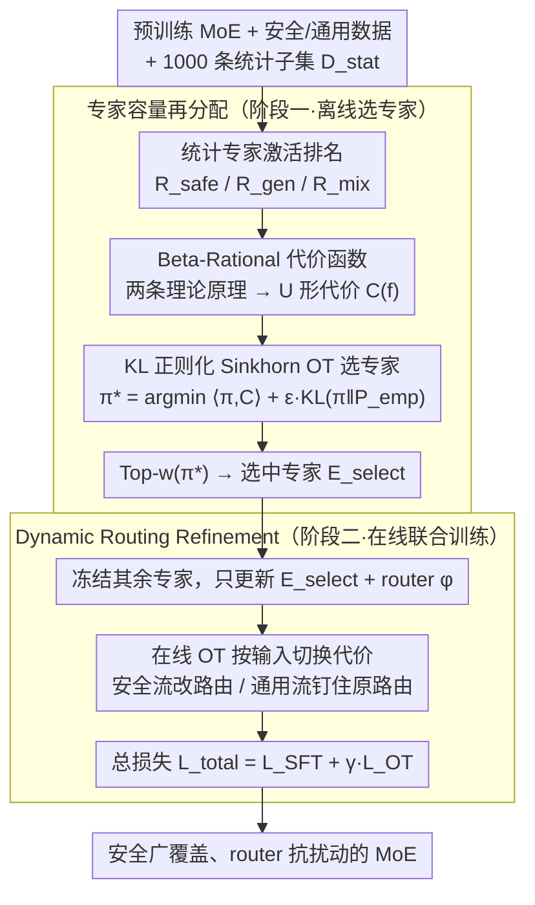

# MESA: Improving MoE Safety Alignment via Decentralized Expertise

**会议**: ICML 2026  
**arXiv**: [2606.00651](https://arxiv.org/abs/2606.00651)  
**代码**: https://github.com/lorraine021/MESA (有)  
**领域**: 对齐RLHF / LLM安全 / MoE  
**关键词**: MoE安全, Safety Sparsity, 最优传输, 路由对齐, 专家选择

## 一句话总结
MESA 把 MoE 安全对齐重塑为"在专家上分配安全责任"的资源分配问题，用 KL 正则化的 Sinkhorn 最优传输（OT）从中间档（shoulder region）专家中挑出代价最低的子集做 SFT，同时用 OT 约束的路由损失把安全 token 引到这些专家，从而在 DeepSeek-V2-Lite / Qwen3-30B-A3B 上把 Strata 安全分推到 95+%，并保住 GSM8K 等推理任务接近原始水平。

## 研究背景与动机

**领域现状**：MoE 已成为扩张 LLM 容量的主流架构（DeepSeek-V2、Qwen3-30B-A3B、Gemini 系列），靠 router 给每个 token 选 Top-k 个专家来摊薄计算，副产物是专家自发地按功能（语言/知识/任务）分化。

**现有痛点**：这种功能分化带来一个独特漏洞——**Safety Sparsity**：安全能力高度集中在极少数"安全专家"上。一旦攻击者构造对抗 prompt 让 router 改选其它专家（如 F-SOUR、PAIR、PAP），整个安全护栏就被绕过。同时，把 SFT/GRPO/DPO 这类为 dense 模型设计的全参对齐方法直接搬到 MoE 上，会出现两难：(1) 全参微调抹掉专家专业知识，让 GSM8K 等推理任务从 56% 掉到 15%（Stair-DPO 的实测）；(2) 路由分布被强行改写，破坏负载均衡甚至开出新的未对齐通路。

**核心矛盾**：MoE 上**安全**（要求安全能力广覆盖）和**通用能力**（要求专家专业化稳定）之间存在结构性 trade-off——前者要尽量摊薄，后者要尽量不动。

**本文目标**：(1) 在不破坏现有专家专业化的前提下，挑选最适合承载安全责任的专家子集；(2) 训练一个 router 能稳定把安全流量导向这些新对齐的专家，同时不扰动通用流量的原路由模式。

**切入角度**：作者通过实证 + 理论分析发现，专家在"安全亲和度"（routing inertia）和"通用敏感度"（Hessian fragility）两个维度上呈非对称分布——纯安全头部专家收益已饱和；纯通用尾部专家曲率爆炸不能动；真正适合做安全适配的是**中间档（shoulder region）**的专家，它们既不在饱和头部也不在脆弱尾部。

**核心 idea**：用 KL 正则化的最优传输把"安全责任"从原始安全专家上**重新分配**到这些 shoulder 专家上，同时用 online OT 在训练中约束 router 行为，做到"专家选哪些"+"router 怎么用"协同对齐。

## 方法详解

### 整体框架
MESA 把"给 MoE 做安全对齐"从一个微调问题改写成一个资源分配问题：先离线挑出一小撮"既不饱和也不脆弱"的中间档专家来承载安全责任，再在线训练 router 学会把安全流量导向它们、同时让通用流量原路不动。输入是一个预训练 MoE（DeepSeek-V2-Lite 或 Qwen3-30B-A3B）、安全数据集 $\mathcal{D}_{safe}$（SafeRLHF，15k）、通用数据集 $\mathcal{D}_{gen}$（UltraFeedback，15k），外加一个仅 1000 条（安全/通用各 500）的统计子集 $\mathcal{D}_{stat}$ 用来估专家激活频率。

第一阶段（离线选专家）先在 $\mathcal{D}_{stat}$ 上跑前向，统计每个专家在安全/通用/混合数据上的激活排名 $R_{safe}, R_{gen}, R_{mix}$，用一个代价函数把"适配代价"写成专家在 $R_{mix}$ 上排名的函数，再用 KL 正则化的 Sinkhorn 最优传输解出全局传输方案 $\pi^*$，按 $\pi^*$ 取 Top-$w$ 得到选中专家集合 $\mathcal{E}_{select}$。第二阶段（在线联合训练）冻结其余专家，只更新 $\mathcal{E}_{select}$ 的参数 $\theta_{\mathcal{E}_{select}}$ 和 router 参数 $\phi$，用 $\mathcal{L}_{total} = \mathcal{L}_{SFT} + \gamma \mathcal{L}_{OT}$ 同时把安全知识写进选中专家、把 router 行为对齐过去。输出是一个安全广覆盖、router 更抗扰动的 MoE。

### 关键设计

**1. Beta-Rational 代价函数：把"哪些专家值得动"写成一条闭式曲线**

直接按 $R_{safe}$ 或 $R_{gen}$ 排序挑专家都会踩坑——挑头部安全专家收益已饱和、再训也涨不动，挑尾部专家又会引爆通用能力。MESA 用两条原理把这个直觉变成可计算的代价。Principle 1（Safety Affinity）说头部安全专家饱和、尾部安全休眠专家要被调动就得让 router 大改，理论上参数扰动有下界 $\|\Delta\phi\|_2 \geq \Omega(p_i^{-1/2})$（Theorem 3.1，由统计流形局部曲率推出，激活概率 $p_i$ 越小代价越高）。Principle 2（General Stability）说通用头部专家 loss landscape 平坦、动它无妨，但通用尾部专家落在 sharp minima 里，Hessian 谱范数 $\Lambda_i \sim \bar{p}_i^{-\gamma}$（$\gamma>1$）随激活频率下降而爆炸，任何小更新都让通用能力暴跌——Theorem 3.2 给出界 $\mathbb{E}_x[\Delta\mathcal{L}_g] \leq \frac{1}{2}\|\Delta\theta_i\|_2^2 \cdot \bar{p}_i \Lambda_i$ 并证明风险 $R_i$ 在尾部发散到 $\infty$。

两条原理一头一尾都堵死，逼出一个结论：最优专家落在 $R_{mix}$ 的 shoulder（肩部）区域，整条偏好曲线呈非对称 U 形。作者用最大熵 Beta 分布按"最低阶满足约束"取 $\alpha=2,\beta=3$，得到能力势 $\Phi(f) \propto (f+\alpha_{shift})(100-f)^2$，取倒数即代价 $C(f) = 1/[(f+\alpha_{shift})(100-f)^2]$，其中偏移量 $\alpha_{shift}$ 把头部本会发散的 $C(0)\to\infty$ 软化成可控约束。这样一条闭式曲线替掉了靠 grid search 调启发式阈值的做法，把两条理论原理直接压进 OT 求解器的代价矩阵里。

**2. KL 正则化 Sinkhorn OT 选专家：在不破坏原始路由拓扑的前提下找最省的专家子集**

有了代价矩阵 $\mathbf{C}$ 还不能贪心地按代价从小到大挑——贪心只最小化局部风险，会忽略全局路由拓扑，可能把流量挤垮、引发 router mode collapse。MESA 改成解一个带 KL 正则的最优传输：

$$\pi^* = \arg\min_{\pi \in \mathcal{U}(\mathbf{r},\mathbf{c})} \big(\langle \pi, \mathbf{C} \rangle + \epsilon\, D_{KL}(\pi \,\|\, \mathbf{P}_{emp})\big)$$

其中 $\mathbf{P}_{emp}$ 是原始 router 的经验激活分布，KL 项把解 $\pi$ 钉在原分布附近不让它乱跑。这个问题严格凸、有闭式解，走 Gibbs 核 $\mathbf{K} = \mathbf{P}_{emp} \odot \exp(-\mathbf{C}/\epsilon)$ 配 Sinkhorn-Knopp 迭代即可求出 $\pi^*$，最后 $\mathcal{E}_{select} = \text{Top}_w(\pi^*)$。它的意义是把"选专家"重铸成"在原始 router 流形约束下做最优传输"——等价于在不动原路由拓扑的前提下找代价最低的承载者，因此比纯贪心 $E_{C_{max}}$、固定中段启发式 $E_{C_{mid}}$ 都鲁棒，消融里 $E_{OT}$ 明显胜出。

**3. Dynamic Routing Refinement：用同一套 OT 公式让 router"该改的改、该保的保"**

光选好专家还不够——消融里只 OT 选专家不动 router（$E_{OT}$ 行），WildJB 只能到 76% 而到不了 90%，因为 router 不会自己发现这些新的安全专家。MESA 把同一套 OT 在线化，对每个输入 $x$ 解 $\pi^*(x) = \arg\min_{\pi} (\langle \pi, \mathbf{C}(x) \rangle + \epsilon D_{KL}(\pi \,\|\, \mathbf{P}_{ref}(x)))$，参考分布 $\mathbf{P}_{ref}(x)$ 取冻结 base model 的路由。妙处在于代价矩阵 $\mathbf{C}(x)$ 随数据流切换：安全流上 $\mathbf{C}(x)$ 用 3.1 节的全局代价矩阵，OT 解出的 $\pi^*_{safe}$ 把质量从高风险专家挪到 $\mathcal{E}_{select}$，router 损失 $\mathcal{L}_{OT} = \mathbb{E}_{x \sim \mathcal{D}_{safe}}[D_{KL}(\pi^*_{safe}(x) \,\|\, \mathbf{P}_\phi(x))]$；通用流上 $\mathbf{C}(x)=0$，OT 退化成纯熵正则、最优解恰好就是 $\mathbf{P}_{ref}(x)$ 本身，损失变成保守的 $\mathbb{E}_{x \sim \mathcal{D}_{gen}}[D_{KL}(\mathbf{P}_{ref}(x) \,\|\, \mathbf{P}_\phi(x))]$。一个公式同时表达"安全流要改路由"和"通用流要钉住原路由"，避免拆成两套损失互相打架。

### 损失函数 / 训练策略
总目标 $\mathcal{L}_{total} = \mathcal{L}_{SFT}(\mathcal{D}_{safe}; \theta_{\mathcal{E}_{select}}, \phi) + \gamma \cdot \mathcal{L}_{OT}(\phi)$：安全 SFT 损失只作用在选中的专家上、把安全知识写进去，OT 路由损失对齐 router 行为。训练时冻结 $\mathcal{E}_{select}$ 以外的所有专家，只更新选中专家参数和 router；安全数据 SafeRLHF 15k，通用数据 UltraFeedback 15k，统计子集 $\mathcal{D}_{stat}$ 安全/通用各 500 共 1000 条。

## 实验关键数据

### 主实验

在 DeepSeek-V2-Lite 上对比安全 vs. 通用 trade-off（节选关键列）：

| 方法 | Strata (安全↑) | WildJB (安全↑) | GSM8K (通用↑) | HumanEval (通用↑) |
|------|---------------|---------------|--------------|-------------------|
| Base | 70.50 | 43.40 | 55.95 | 42.07 |
| SFT | 92.00 | 77.70 | **16.15**（崩） | 31.10 |
| Stair-DPO（SOTA 内容级） | 93.00 | 83.60 | **15.54**（崩） | 26.22 |
| SafeX（MoE-specific） | 81.00 | 64.00 | 63.46 | 35.98 |
| **MESA (Ours)** | **95.00** | **90.90** | **66.11** | **42.07** |

在 Qwen3-30B-A3B 上同样能在保持 Math500=91.00 / GSM8K=96.44 / HumanEval=94.51 接近 base 的同时把 Strata 推到 99.00 / WildJB 推到 97.65。

### 消融实验（DeepSeek-V2-Lite，Table 2 / Table 3 节选）

| 配置 | WildJB | Strata | GSM8K | 说明 |
|------|--------|--------|-------|------|
| Base | 43.40 | 70.50 | 55.95 | 起点 |
| 只调 Router | 60.20 | 86.00 | 52.90 | 没新安全知识，安全涨幅有限 |
| $E_{ALL}$（全专家 SFT） | 83.00 | 93.00 | **8.33** | 通用能力崩盘 |
| $E_{OT}$（只 OT 选专家） | 76.15 | 88.50 | 51.48 | 缺 router 对齐，安全分到不了 90 |
| $E_{OT}$ + Router | 83.05 | 96.00 | 61.00 | 接近 full MESA |
| $E_{C_{max}}$（按最大代价选） | 70.45 | 88.50 | 45.11 | 启发式不如 OT |
| **Full MESA** | **90.90** | **95.00** | **66.11** | OT 选专家 + Routing Refinement 协同 |

### 关键发现
- **OT 选专家**是首要贡献：把 $E_{ALL}$ 换成 $E_{OT}$，GSM8K 从 8.33 救回 51.48，证明 shoulder 区域选专家有效避开了 Hessian fragility 陷阱。
- **Routing Refinement** 是把安全分从 88.50 推到 95.00 的关键：单独动 router 没意义（缺安全知识），单独 OT 选专家不够（router 不会用），两者协同才能完整。
- **架构敏感性**：DeepSeek 容量受限，对全参微调极敏感，MESA 在它上的相对优势更明显（Stair-DPO GSM8K 跌到 15.54，MESA 反而到 66.11，反超 base 55.95）；Qwen3-30B-A3B 本身更鲁棒，但 MESA 仍是唯一不掉 Math500 的方法。
- **抗路由攻击**：F-SOUR routing-exploitation attack 在 JailbreakBench 上 MESA ASR=0.00%，SafeX=15.38%，GRPO=22.73%——topological expansion 比 localized patching 抗结构扰动强很多。

## 亮点与洞察
- **把"安全对齐"重新定义为"最优传输问题"**：之前 MoE 安全文献要么按激活频率挑专家（启发式），要么直接全参微调（暴力），MESA 给出第一个把"全局路由拓扑"作为硬约束的 principled 方案，且两个阶段（选专家 / 训 router）共享同一套 OT 公式，统一感很强。
- **Shoulder Hypothesis** 是值得记住的经验性洞察：在 MoE 的功能分化中，最适合做新能力适配的从来不是头部专家，也不是尾部专家，而是中段——这个直觉可以直接迁移到"在 MoE 上做风格对齐 / 领域适配 / 知识注入"等任意"想加新能力又不破坏原有能力"的场景。
- **Theorem 3.1 / 3.2** 把"为什么头尾都不能动"上升到统计流形和 Hessian 谱的层面，给后续工作提供了一个干净的理论模板：尾部专家 $\Lambda_i \sim p_i^{-\gamma}$ 的发散是 MoE 微调中各种"小更新大灾难"现象的统一解释。

## 局限与展望
- **作者承认**：评估只覆盖了 DeepSeek-V2-Lite（容量受限）和 Qwen3-30B-A3B（高性能）两个 MoE 架构，没在更大规模（如 DeepSeek-V3、Mixtral-8x22B）上验证；OT 求解的计算开销随专家数 $N$ 平方级增长，在超大 MoE 上可能成为瓶颈。
- **自己发现**：(1) 整套方法依赖一个 1000 条的 $\mathcal{D}_{stat}$ 来估激活频率 $\mathbf{P}_{emp}$，作者没分析这个估计的方差以及 $|\mathcal{D}_{stat}|$ 对最终结果的敏感性。(2) Beta 分布的 $\alpha=2, \beta=3$ 是按"最低阶满足约束"原则选的，但没消融其它 $\alpha, \beta$ 组合，shoulder 区域的具体位置是否对参数敏感不明。(3) Routing Refinement 假设安全/通用 input 可以清晰二分（来自不同数据集），但实际部署中混合 query 怎么动态判定 $\mathbf{C}(x)$ 没讨论。(4) 安全评估的 judge 用 Octopus-SEval-14B，可能存在 judge 偏置。
- **改进思路**：(1) 把 $\alpha_{shift}, \alpha, \beta$ 做成可学习参数随训练自适应；(2) 给混合 query 设计 token-level 的代价矩阵 $\mathbf{C}(x_t)$ 而不是 sequence-level；(3) 把这套 OT 框架推广到 multi-task 持续学习——每加一个新任务就解一次 OT 选专家。

## 相关工作与启发
- **vs SafeX (Lai et al., 2025)**：SafeX 同样意识到 MoE 安全的特殊性，但走"localized additive merging"——只在已有安全激活路径上做参数合并，不扩张路由拓扑。结果是路径数量不变，被对抗攻击时容易被绕开（Strata 81% vs. MESA 95%）。MESA 选择"topological expansion"，把安全责任摊到更多专家上，对路由攻击更鲁棒（F-SOUR ASR 0% vs SafeX 15.38%）。
- **vs Stair-DPO (Zhang et al., 2025)**：Stair-DPO 是 dense LLM 上的 SOTA 内容级对齐，安全分极高（Strata 93%）但 MoE 上代价惨烈（GSM8K 从 56 跌到 15）——典型的"把 MoE 当 dense 用"问题。MESA 把 GSM8K 维持在 66.11 同时安全分 95，证明 architecture-aware 对齐比 content-level 对齐更适合 MoE。
- **vs GRPO**：GRPO 因为探索性能保住通用能力（GSM8K 59.06），但安全只到 64%，且对 routing-exploitation attack 反而更脆弱（ASR 22.73%）——RL-based 方法学到的是 shallow refusal heuristics 而非 robust defensive reasoning。MESA 的结构化约束相当于给 router 也加了"先验"，减少了对抗空间。
- **启发**：把 Optimal Transport 当作"在保持原始拓扑约束下做参数子集选择"的通用工具——任何"想动一部分参数又不能破坏全局分布"的场景（PEFT, multi-task learning, model editing）都可以套这个公式。

## 评分
- 新颖性: ⭐⭐⭐⭐⭐ 把 MoE 安全对齐重铸为 OT 问题，且给出两条理论原理支撑"shoulder 选专家"的直觉，是真正 architecture-aware 的方案。
- 实验充分度: ⭐⭐⭐⭐ 双架构（DeepSeek + Qwen3-30B-A3B）、6 个安全 benchmark、6 个通用 benchmark、ablation 覆盖路由/专家/选择策略/掩码鲁棒性/F-SOUR 对抗攻击，但缺 OT 计算开销分析和 $\mathcal{D}_{stat}$ 敏感性消融。
- 写作质量: ⭐⭐⭐⭐ 两条 Principle 的命名与对应理论清晰，Beta 分布推导有连贯逻辑链；不足是 OT 求解、$\mathcal{E}_{select}$ 大小 $w$ 等关键实现细节藏在附录。
- 价值: ⭐⭐⭐⭐⭐ MoE 已是 LLM 主流，安全对齐是部署必经环节，MESA 是第一个同时解决"安全广覆盖"和"通用不退化"的可行方案，代码开源；shoulder hypothesis 和 OT 框架对其它 MoE 适配任务有直接迁移价值。

<!-- RELATED:START -->

## 相关论文

- [\[ICML 2026\] Curriculum Learning for Safety Alignment](curriculum_learning_for_safety_alignment.md)
- [\[ICML 2026\] Implicit Safety Alignment from Crowd Preferences](implicit_safety_alignment_from_crowd_preferences.md)
- [\[ICML 2026\] Towards Context-Invariant Safety Alignment for Large Language Models](towards_context-invariant_safety_alignment_for_large_language_models.md)
- [\[ICML 2026\] Quantifying the Salience of Geo-Cultural Values for Pluralistic Safety Alignment](quantifying_the_salience_of_geo-cultural_values_for_pluralistic_safety_alignment.md)
- [\[ICLR 2026\] Superficial Safety Alignment Hypothesis](../../ICLR2026/llm_alignment/superficial_safety_alignment_hypothesis.md)

<!-- RELATED:END -->
