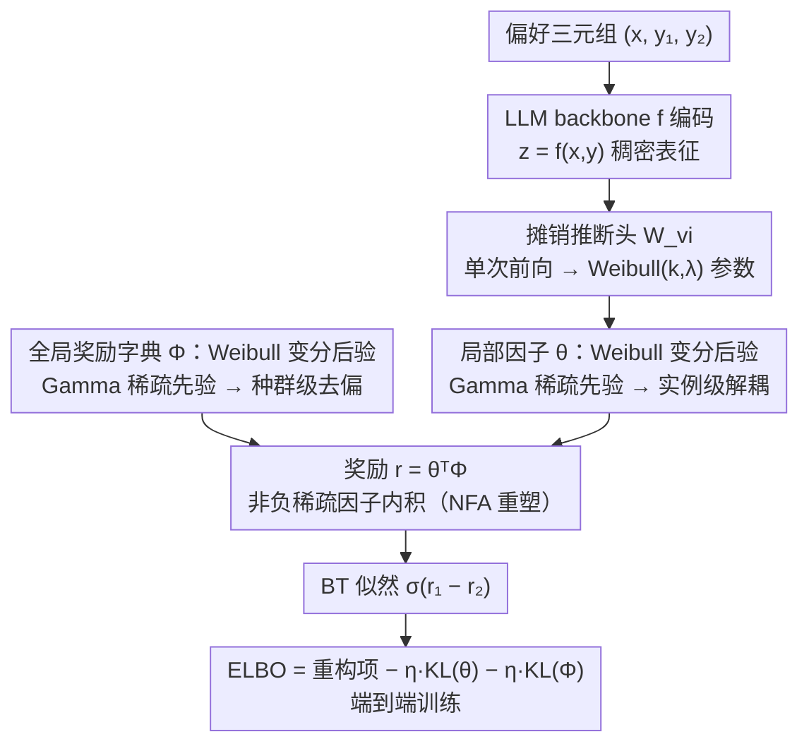

# Mitigating Reward Hacking in RLHF via Bayesian Non-negative Reward Modeling

**会议**: ICML 2026 Oral  
**arXiv**: [2602.10623](https://arxiv.org/abs/2602.10623)  
**代码**: https://github.com/GuoweiRong/Bayesian-Non-negative-Reward-Model (有)  
**领域**: 对齐RLHF  
**关键词**: 奖励建模, 奖励黑客, 贝叶斯非负因子分析, 变分推断, Weibull 分布

## 一句话总结
本文把 Bradley–Terry 奖励模型重写成一个贝叶斯非负因子分析（NFA）的生成过程——局部稀疏的实例隐变量 $\bm{\theta}$ 与全局稀疏的奖励字典 $\Phi$ 同时建模，以"先解耦再去偏"抑制 RLHF 中由长度/风格等捷径特征引起的 reward hacking，并通过 Weibull 重参数化的摊销变分推断把整个框架塞进现代 LLM 主干，在 Unified-Feedback、RewardBench、HHH、MT-Bench 上一致超过 BT、Ensemble、InfoRM 等强基线。

## 研究背景与动机

**领域现状**：RLHF 已成 LLM 对齐主流范式，其核心是把人类成对偏好蒸馏成可微的奖励模型（RM），再用 PPO 等 RL 算法优化策略；标准做法是在 LLM backbone 后加一个线性头 $W_{\text{bt}}$，按 Bradley–Terry 排序损失训练，给响应打一个确定性的标量分。

**现有痛点**：这种 RM 在实践中极易被"hack"——策略学到去优化代理奖励而非真实人类目标，最常见的捷径是响应长度、措辞风格、模板化表达等表面线索；其根本原因是 reward misgeneralization：训练分布外 RM 外推得很烂，而深度网络又天然偏爱 shortcut features。

**核心矛盾**：现有缓解手段都各有副作用。Ensemble 方法（如 BT-Ensemble、ENS）要养好几个大模型，算力开销翻倍；信息瓶颈方法（如 InfoRM）只能隐式压低无关特征，无法显式把"语义意图"从"风格噪声"中拆开；针对长度等单一偏置的监督修正方法只在自己定义的窄场景里有效。问题在于：标量奖励 $r=\bm{z}^{\top}W_{\text{bt}}$ 本身是稠密、黑盒、确定性的，结构上根本没给"不确定性"和"稀疏因子"留位置。

**本文目标**：(1) 给 RM 引入显式的不确定性建模——既包含人类标注本身的 aleatoric uncertainty，也包含全局奖励参数的 epistemic uncertainty；(2) 让奖励表示具备稀疏可解释结构，从机制上抑制对 spurious correlations 的依赖；(3) 在不依赖多模型集成的情况下，把方案 scale 到 8B 级别的 LLM。

**切入角度**：作者把目光重新投向稀疏感知贝叶斯模型（SBM），尤其是非负因子分析（NFA，如 PFA、LDA）。NFA 天然有三个对 RM 友好的性质：概率隐变量自带不确定性、非负稀疏先验可作隐式正则、非负基向量能给出 parts-based 可解释表示。

**核心 idea**：把"奖励 $r=\bm{z}^{\top}W_{\text{bt}}$"重新生成为"$r=\bm{\theta}^{\top}\Phi$"，其中 $\bm{\theta}$（实例局部因子）和 $\Phi$（全局奖励字典）都加 Gamma 先验强制非负稀疏——局部稀疏负责实例级 disentanglement，全局稀疏负责种群级 debiasing，二者协同从源头上让 RM "对捷径不敏感"。

## 方法详解

### 整体框架
BNRM（Bayesian Non-negative Reward Model）把标准 BT 奖励模型重写成一个分层贝叶斯生成过程：给定偏好三元组 $(\bm{x},\bm{y}_1,\bm{y}_2)$，LLM backbone $f$（如 Gemma-2B-it / Skywork-Reward-Llama-3.1-8B）先把每个 $(\bm{x},\bm{y})$ 编码成稠密表征 $\bm{z}=f(\bm{x},\bm{y})\in\mathbb{R}^{d_{\text{model}}}$，再由它推断出非负稀疏的实例局部因子 $\bm{\theta}\in\mathbb{R}^{K}_+$，与同样非负稀疏的全局奖励字典 $\Phi\in\mathbb{R}^{K}_+$ 内积得到奖励 $r=\bm{\theta}^{\top}\Phi$，最后塞回 BT 似然 $p(\bm{y}_1\succ\bm{y}_2)=\sigma(r_1-r_2)$。关键是 $\bm{\theta}$ 与 $\Phi$ 都用 Weibull 变分后验建模、Gamma 先验约束，整套框架借摊销变分推断 + Weibull 重参数化做端到端训练——单次前向就同时给出"奖励均值 + 不确定性 + $K$ 个语义因子的分解"，全程不需要训多个模型。

### 关键设计

**1. NFA 重塑奖励生成过程：从稠密黑盒到非负稀疏因子，先解耦再去偏**

稠密标量奖励 $r=\bm{z}^{\top}W_{\text{bt}}$ 是 reward hacking 的温床——它把语义意图和长度、模板等无关特征全揉成一团，结构上根本没给"哪些维度该信、哪些该忽略"留位置。BNRM 直接换掉奖励的数学形式，把它生成为 $r(\bm{x},\bm{y})=\bm{\theta}^{\top}\Phi$：局部隐变量 $\bm{\theta}$ 加 $\mathrm{Gamma}(\alpha_0,\beta_0)$ 先验、全局字典 $\Phi$ 加 $\mathrm{Gamma}(\gamma_0,\delta_0)$ 先验，二者都被强制非负且高度稀疏。局部稀疏让每个 prompt–response 只激活少数几个语义因子，达成实例级 disentanglement；全局稀疏让字典里只保留少量稳定不变的奖励维度，把跨样本反复出现的系统性偏置（长度、风格、模板）当成"非不变特征"在源头压成接近 0。这样"语义意图"和"风格噪声"被结构性地拆到不同因子里，再用全局稀疏抹掉噪声因子的权重，从表示形式上让 RM 对捷径不敏感，而不是事后打补丁去删某个已知偏置。

**2. 双层不确定性 + Weibull 变分后验：让古典稀疏模型第一次接得上 LLM 反传**

要给奖励引入不确定性，就得把 BT 推广为对所有隐变量积分的形式 $p(\bm{y}_1\succ\bm{y}_2|\bm{x},\bm{y}_1,\bm{y}_2)=\int p(\bm{y}_1\succ\bm{y}_2|\bm{\theta}_1,\bm{\theta}_2,\Phi)\,q(\bm{\theta}_1)q(\bm{\theta}_2)q(\Phi)\,d\bm{\theta}_1 d\bm{\theta}_2 d\Phi$，从而同时刻画 aleatoric（标注噪声）和 epistemic（全局参数）两类不确定性。三个后验都取 Weibull 分布 $q(\bm{\theta}|\bm{x},\bm{y})=\mathrm{Weibull}(\bm{k},\bm{\lambda})$，其中 shape $\bm{k}$ 用 Softplus 保证可微稳定、scale $\bm{\lambda}$ 用 ReLU 经验性地鼓励样本稀疏。之所以不直接用与 Gamma 先验共轭的 Gamma 后验，是因为 Gamma 难以重参数化、采样代价高；Weibull 在尾部行为上与 Gamma 相近却带解析的重参数化，能走标准反传——这让 NFA 这类需要 Gibbs/SVI 的古典稀疏模型第一次能方便地嵌进现代 LLM 训练流。附带的好处是，这套双层不确定性给下游 BoN/PPO 提供了"置信度感知"的奖励信号，可以惩罚 RM 不确定的区域，缓解 over-optimization。

**3. 摊销变分推断 + ELBO 端到端训练：用 LLM 表征当推断网络，单 forward 出后验**

传统 NFA 要逐文档跑 Gibbs 采样或 SVI，根本接不上 LLM 的大批量训练。BNRM 把 LLM backbone $f$ 直接复用成变分推断网络（encoder）：一个线性头 $W_{\text{vi}}\in\mathbb{R}^{d_{\text{model}}\times 2K}$ 把表征 $\bm{z}$ 映成 Weibull 的 $(\bm{k},\bm{\lambda})$，单次前向就摊销出 $\bm{\theta}$ 的后验，省掉逐样本的迭代推断。训练目标是 ELBO

$$\mathcal{L}(\mathcal{D})=\mathbb{E}_{q(\bm{\theta})q(\Phi)}\big[\log p(\mathcal{D}|\bm{\theta},\Phi)\big]-\eta\,\mathrm{KL}\big(q(\bm{\theta})\|p(\bm{\theta})\big)-\eta\,\mathrm{KL}\big(q(\Phi)\|p(\Phi)\big),$$

第一项（重构项）保证因子能解释观测到的偏好，两项 KL 把后验拉向稀疏 Gamma 先验、控制模型复杂度；超参 $\eta$ 平衡 likelihood 与 KL，本质就是"稀疏正则强度"的旋钮。$W_{\text{llm}},W_{\text{vi}},\Phi$ 在偏好数据上一起端到端优化，使整套贝叶斯框架能在 LoRA + 2 epoch / 8B 全参数微调这种现实预算下跑完。

### 损失函数 / 训练策略
训练目标即上面的 ELBO，$\eta$ 是控制稀疏强度的关键超参（论文在 appendix 给出敏感性分析）。具体设置：Gemma-2B-it / Gemma2-2B-it 用 LoRA 训练 2 epoch；Skywork-Reward-Llama-3.1-8B 在 Skywork-Preference-v0.2 上全参数微调 1 epoch；RL 阶段把 BNRM 作为代理奖励，对 Llama3.1-8B-Instruct 和 OpenRLHF-Llama3-8B-SFT 用 PPO + LoRA 训 1 epoch；Best-of-N 测试仅使用两个 Gemma 模型。

## 实验关键数据

### 主实验：ID + OOD 奖励建模精度（Gemma2-2B-it，LoRA，UF 训练）

| 训练规模 | 方法 | UF (ID) | HHH | MT | RewardBench Avg |
|----------|------|---------|-----|-----|-----------------|
| 40K | BT | 74.5 | 84.2 | 73.3 | 75.7 |
| 40K | BT-Ensemble | 75.1 | 84.9 | 74.3 | 77.8 |
| 40K | GRM-SFT | 75.8 | 85.5 | 74.2 | 77.3 |
| 40K | InfoRM | 73.9 | 83.9 | 74.6 | 79.2 |
| 40K | **BT-BNRM** | **77.2 ↑2.7** | **87.8 ↑3.6** | **76.8 ↑3.5** | **79.7 ↑4.0** |
| 400K | BT | 76.6 | 86.4 | 75.2 | 77.5 |
| 400K | BT-Ensemble | 76.9 | 83.9 | 76.3 | 78.2 |
| 400K | InfoRM | 77.3 | 85.4 | 76.3 | 80.7 |
| 400K | **BT-BNRM** | **78.8 ↑2.2** | **88.2 ↑1.8** | **78.2 ↑3.0** | **79.5 ↑2.0** |

40K 小数据下 BT-BNRM 比 BT 在 RewardBench 上涨 4.0，比单价值远高的 BT-Ensemble 也涨 1.9；400K 大数据下仍稳定领先 ≥2 个点，说明稀疏正则不仅在低资源场景救命，也不会被大数据"吃掉"。

### 与商业 / 开源大 RM 横向对比（RewardBench）

| 类别 | 方法 | Average | Chat | Chat-Hard | Safety | Reasoning |
|------|------|---------|------|-----------|--------|-----------|
| 生成式 | GPT-4o | 86.7 | 96.1 | 76.1 | 88.1 | 86.6 |
| 生成式 | Gemini-1.5 | 86.8 | 94.1 | 77.0 | 85.8 | 90.2 |
| 判别式 | Nemotron-340B-Reward | 92.2 | 95.8 | 87.1 | 92.2 | 93.6 |
| 判别式 | ArmoRM-Llama3-8B | 90.8 | 96.9 | 76.8 | 92.2 | 97.3 |
| 判别式 | Skywork-1-1BT-RM-8B | 91.8 | — | — | — | — |

论文展示 BNRM 在与 8B/70B 量级判别式 RM 同台时仍具竞争力（主要看 Chat-Hard 与 Safety），且模型只有 2B/8B 级别 + 不需要集成，性价比显著高于 Nemotron-340B、ArmoRM 这类大模型路线。

### 关键发现
- **小数据收益最大**：40K UF 上 RewardBench 涨幅（+4.0）明显大于 400K（+2.0），印证稀疏先验在数据稀缺时充当强正则；而到大数据规模仍保持优势，说明非负稀疏因子不仅是"缺数据时凑数"。
- **HHH 与 Chat-Hard 涨得最猛**：BT-BNRM 在 HHH 上比 BT 涨 13 个点（40K 设置），在 RewardBench Chat-Hard 上也常涨 5–8 个点；这两个子集恰好是最依赖"语义辨别能力"、最容易被风格捷径欺骗的场景，与"稀疏因子能抑制 spurious correlation"的假设直接对得上。
- **与 InfoRM 的对照**：InfoRM 用信息瓶颈隐式压无关特征，BNRM 用稀疏因子显式拆解；两者在 InD 上互有胜负，但 BNRM 在 OOD（HHH、MT）上更稳，说明显式 disentanglement-then-debiasing 在分布漂移下更鲁棒。
- **可解释性副产物**：$\Phi$ 的每个非负列对应一个 "奖励原子"，可以通过聚类对应响应得到人类可读的语义因子（论文 Figure 给出 case study），这是稠密 RM 无法提供的能力。

## 亮点与洞察
- **结构性反 hacking**：以往工作大多在"症状层"打补丁（去掉长度偏置、加 ensemble、加 KL 惩罚），本文是少数从"表示形式"层动刀的工作——把奖励的数学形式从 $\bm{z}^{\top}W$ 改成 $\bm{\theta}^{\top}\Phi$，让稀疏与非负成为内置不变量。这种"换 representation 而非堆 trick"的思路值得借鉴。
- **NFA × LLM 的可复用范式**：用 Weibull 重参数化 + LLM 摊销编码器把古典稀疏贝叶斯模型塞进现代深度网络，整套机制完全可以平移到 DPO/KTO 奖励建模、reasoning 评分器、甚至对比学习的相似度头。
- **不确定性 ≠ ensemble**：作者证明了单模型也能拿到与 ensemble 接近甚至更好的鲁棒性，前提是给模型一个能"承载不确定性"的结构（Weibull 分布 + 全局参数后验），而不是简单地训 N 个模型平均。

## 局限与展望
- **稀疏强度敏感**：$\eta$ 与 Gamma 先验超参 $(\alpha_0,\beta_0,\gamma_0,\delta_0)$ 直接影响稀疏度，论文虽给敏感性分析但没给统一推荐表，迁移到新数据集需调参。
- **因子维度 K 与可解释性的张力**：K 过小则因子被迫纠缠回去，K 过大则稀疏过度可能丢语义；论文没充分讨论 K 如何自适应（如类似 nonparametric Bayes 的自动定阶）。
- **PPO 阶段评估有限**：方法核心收益在"RM 更鲁棒"，但下游 PPO/BoN 仅在 2B/8B 量级 + 单一 SFT base 上验证，70B+ 与多 base 的跨规模可比性仍待补。
- **可改进方向**：把 $\Phi$ 的全局稀疏与 reward editing / interpretability tooling 结合，让人类直接"挑因子、调权重"，从被动 debias 走向主动可控对齐。

## 相关工作与启发
- **vs BT-Ensemble (Coste et al., 2024)**：Ensemble 用 N 个 RM 取均值/方差近似 epistemic uncertainty，代价是 N× 显存和算力；BNRM 用单模型 + 全局 Weibull 后验抓同一信号，开销低、效果相近甚至更好。
- **vs InfoRM (Miao et al., 2024)**：InfoRM 用变分信息瓶颈隐式压 spurious feature，BNRM 用 NFA 显式给每个因子打稀疏先验；BNRM 在 OOD 与 HHH 上更稳，可解释性也更强（每个因子有明确含义）。
- **vs GRM (Yang et al., 2024)**：GRM 通过 SFT/DPO 头辅助做正则；BNRM 直接改奖励的概率结构，二者正交，论文也给出 GRM-BNRM 的组合版本，确认稀疏先验可以叠加在其他正则之上继续涨点。
- **vs BT-Margin / Label Smooth**：这些 trick 等价于在 BT 损失上加小 perturbation，对长度等单一捷径有效；BNRM 通过结构而非损失修正问题，对未知捷径泛化更好。

## 评分
- 新颖性: ⭐⭐⭐⭐ 把 NFA 这一古典工具用现代变分技巧塞进 RM，理论清晰、视角新颖，但 NFA + 深度网络组合在主题模型领域并非首次。
- 实验充分度: ⭐⭐⭐⭐ 覆盖 ID/OOD/BoN/PPO，对比包含 BT 家族、Ensemble、InfoRM、GRM 等强基线，且在两个规模（40K/400K）和三个 base 上都做了验证。
- 写作质量: ⭐⭐⭐⭐ 公式与图示并重，从 BT → Bayesian BT → BNRM 的推导链条流畅，初学者也能跟上。
- 价值: ⭐⭐⭐⭐ 提供了 reward hacking 的一个有结构、可解释、低成本的解法，对生产级 RLHF 与对齐研究都有直接落地价值。

<!-- RELATED:START -->

## 相关论文

- [\[NeurIPS 2025\] Provably Efficient Online RLHF with One-Pass Reward Modeling](../../NeurIPS2025/llm_alignment/provably_efficient_online_rlhf_with_one-pass_reward_modeling.md)
- [\[ACL 2026\] AgentV-RL: Scaling Reward Modeling with Agentic Verifier](../../ACL2026/llm_alignment/agentv-rl_scaling_reward_modeling_with_agentic_verifier.md)
- [\[ACL 2025\] Dynamic Scaling of Unit Tests for Code Reward Modeling](../../ACL2025/llm_alignment/dynamic_scaling_of_unit_tests_for_code_reward_modeling.md)
- [\[ACL 2026\] Aligning Agents via Planning: A Benchmark for Trajectory-Level Reward Modeling](../../ACL2026/llm_alignment/aligning_agents_via_planning_a_benchmark_for_trajectory-level_reward_modeling.md)
- [\[ACL 2025\] Reward Generalization in RLHF: A Topological Perspective](../../ACL2025/llm_alignment/reward_generalization_in_rlhf_a_topological_perspective.md)

<!-- RELATED:END -->
