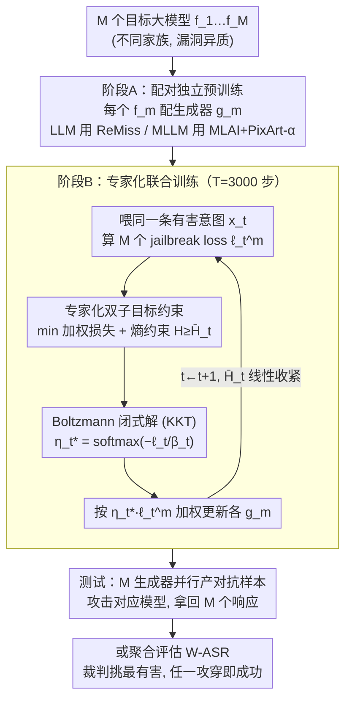

# New Wide-Net-Casting Jailbreak Attacks Risk Large Models

**会议**: ICML 2026  
**arXiv**: [2605.17128](https://arxiv.org/abs/2605.17128)  
**代码**: 论文中标注 "Code is available here"，仓库链接未在正文中显式给出  
**领域**: LLM 安全 / 对抗攻击 / 多模型联合越狱  
**关键词**: wide-net-casting, jailbreak, 模型族特异性漏洞, exploration-to-exploitation, 对抗样本生成器

## 一句话总结
本文首次定义并系统分析了"广撒网"越狱场景（攻击者同时向一组大模型发起请求，只要任一模型被攻破即视为成功），并据此设计了一种基于 exploration-to-exploitation 调度的"专家化"对抗样本生成器联合训练方法，在多个 LLM/MLLM 上把无外加防御时的攻击成功率推到 100%，揭示现行单模型越狱评估严重低估了真实世界风险。

## 研究背景与动机

**领域现状**：当前对 LLM 与 MLLM 的越狱研究几乎全部建立在"单模型威胁模型"之上 —— 给定一个目标模型 $f_m$，攻击者用 GCG、AutoDAN、ReMiss、MLAI 等优化方法找一个对抗后缀或对抗图像让 $f_m$ 输出有害内容，评估指标也以单模型 ASR 为主。

**现有痛点**：真实世界里用户并不只用一个模型 —— 数学题问 Llama 不行就换 Gemma、Mistral 或 Vicuna。这种"换一家试试"的使用习惯一旦被恶意复用，攻击者只要让 $M$ 个模型中**任意一个**给出技术细节就算赢。现有 benchmark 完全没刻画这种"联合脆弱性"，对部署侧的真实风险评估出现系统性低估。

**核心矛盾**：不同家族（Llama / Gemma / Mistral / Vicuna；LLaVA / MiniGPT / InstructBLIP / Qwen-VL）的训练数据、对齐配方、KV cache 结构都不同，所以漏洞天然异质 —— 单模型攻击在某个模型上失败的样本，可能在另一家上一打就穿；漏洞在群体层面会被"或运算"放大，而单模型 ASR 完全捕捉不到这种放大效应。

**本文目标**：(1) 形式化 wide-net-casting 场景并给出能反映"任一模型被攻破即成功"的评估指标；(2) 量化单模型攻击直接迁移到该场景时的风险放大幅度，并分析同家族目标群与外加防御下的变化；(3) 模拟"懂这个场景"的高水平攻击者，设计针对该场景定制的越狱方法，把风险上界暴露出来。

**切入角度**：作者注意到，把 $M$ 份模型型生成器各自独立训练在全部有害意图上（"all-cover"策略）天然不适配 wide-net-casting —— 因为只要任一生成器在某一意图上"打穿"它对应的模型就够了，强迫每个生成器都覆盖所有弱点反而稀释了专长。更优策略应该是**专家化**：每个生成器只盯紧它对应模型的独特漏洞。

**核心 idea**：把"专家化"形式化为"在生成器损失最小处加大更新权重（exploitation）+ 保持单调下降的非零探索（exploration）"的双子目标约束优化，用拉格朗日 + KKT 解出唯一的 Boltzmann 更新权重 $\eta_t^{m,*} = \exp(-\ell_t^m/\beta_t) / \sum_j \exp(-\ell_t^j/\beta_t)$，从而在 $M$ 个生成器间动态分配联合训练的更新预算。

## 方法详解

### 整体框架
方法分两阶段，最终交付一个"群体越狱器"。阶段 A 给每个目标大模型 $f_m$（$m=1,\dots,M$）单独配一个对抗样本生成器 $g_m$ 并用现有单模型方法独立预训练，此时每个生成器只掌握了一些"通用"越狱知识、没有专长；阶段 B 再把 $M$ 个生成器拉到一起做专家化联合训练 $T=3000$ 步，每步喂同一条有害意图 $x_t$、解一个带熵约束的优化问题决定"这一步该重点更新哪几个生成器"，逼它们各自演化成只盯紧自己那个模型独特漏洞的专家。测试时给一条意图，$M$ 个生成器并行各产一个对抗样本攻击对应模型，拿回 $M$ 个候选响应后用裁判挑出最有害的那条即为输出——只要其中任一条攻穿就算赢。

衡量这套场景的核心指标是 **W-ASR**（Wide-net-casting ASR）：$\text{WASR}=\frac{1}{N}\sum_{n=1}^N\bigvee_{m=1}^M s_m^n$，其中 $s_m^n\in\{0,1\}$ 标记第 $n$ 条意图是否攻破了第 $m$ 个模型。这里的逻辑或 $\bigvee$ 正是"任一即赢"的本质——只要意图在任一模型上得逞，这条就计成功。配套的 W-Toxicity Score 则模拟攻击者用大模型从 $M$ 个响应里挑最有害那条来打分。

### 关键设计

**1. Wide-net-casting 场景的形式化与单模型方法的"或聚合"基线：把"换一家试试"变成可量化的威胁模型**

现有越狱论文几乎只报单模型 ASR，掩盖了"这家不行换那家"这个再普通不过的真实威胁，所以第一步得先把"群体越狱"从直觉立成可量化的协议。作者的做法是把任意单模型方法直接搬进来做基线：实例型方法对每个 $f_m$ 跑一份独立优化得到 $M$ 个对抗样本，模型型方法则实例化 $M$ 份生成器各自在全量训练集上独立训练；测试时用 Beaver-Dam-7B 作统一裁判逐个判断是否攻破，再做逻辑或聚合，只要任一样本攻破对应模型就记 WASR=1。这个"或聚合"基线之所以重要，是因为它先把标尺立起来，才能定量回答"群体场景把风险放大了多少"——实验里它就把 GCG 在 AdvBench 上的单模型 ASR 从 46.2% 抬到 WASR 75.0%（+28.8 pt）、ReMiss 从 86.5% 抬到 92.3%，证明放大效应非平凡。

**2. 专家化联合训练目标：exploitation 与 sustainable exploration 的双子目标约束**

基线虽已放大风险，但"每个生成器都在全量意图上训练"（all-cover）其实并不适配 wide-net-casting——既然只要任一生成器在某条意图上打穿对应模型就够，强迫每个都覆盖所有弱点反而稀释了专长。理想策略是让 $M$ 个生成器分工成专家，但难点在于训练中观测到的中间 loss 只是"真专家化后 loss"的噪声估计：纯贪心（永远只更新当前最小 loss 那个生成器）会被噪声误导，使某些模型的漏洞从未被针对性挖掘，而恒定均匀更新又退回 all-cover。作者把这层张力形式化成对更新权重 $\bm{\eta_t}\in\Delta_M$（simplex）的双子目标优化：子目标 ❶ 最小化加权损失 $\sum_m \eta_t^m \ell_t^m$，让小损失生成器拿大权重以最大化 exploitation；子目标 ❷ 用 Shannon 熵 $H(\bm{\eta_t})=-\sum_m \eta_t^m \log \eta_t^m$ 度量权重的铺开程度，约束 $H(\bm{\eta_t})\ge \bar{H}_t$，且阈值 $\bar{H}_t=\log M\cdot (T-t)/T$ 随训练线性单调收紧，保证探索始终非零、却逐步让位给利用。这套调度并非临时拼凑——优化理论里 simulated annealing 与 PSO 处理"目标函数只有噪声观测"时用的正是这种 exploration-to-exploitation 退火，作者把它直接迁到了对抗生成器的更新分配上。

**3. Boltzmann 闭式解与 KKT 推导：让专家化几乎零额外开销**

第 2 点是个带约束的优化问题，若每步都要数值求解就太贵；作者证明它有唯一闭式解。对熵约束 $H(\bm{\eta_t})\ge\bar{H}_t$ 引入拉格朗日乘子 $\beta_t\ge 0$、对 simplex 约束引入 $\nu_t$ 和 $\alpha_t^m$，写出拉格朗日 $\mathcal{L}$ 后对 $\eta_t^i$ 取 KKT 一阶条件得 $\ell_t^i+\nu_t-\alpha_t^i+\beta_t(1+\log\eta_t^i)=0$，再套互补松弛条件即解出

$$\eta_t^{i,*}=\frac{\exp(-\ell_t^i/\beta_t)}{\sum_m \exp(-\ell_t^m/\beta_t)},$$

正好是温度为 $\beta_t$ 的 Boltzmann 分布，而 $\beta_t$ 由 $\bar{H}_t$ 与当前 $\bm{\ell_t}$ 唯一确定、一维搜索即可。这个形式之所以漂亮，是因为它让训练每步只比单模型方法多算一次 $\beta_t$、开销同量级，且 $\beta_t$ 天然就是退火温度：$\bar{H}_t$ 大时 $\beta_t$ 也大、分布趋平（探索），$\bar{H}_t$ 缩到 0 时 $\beta_t\to 0$、分布趋于 one-hot（利用）。整套方法没有引入任何新超参，唯一要选的只是 $\bar{H}_t$ 的退火调度。

### 损失函数 / 训练策略
联合训练步数 $T=3000$；阶段 A 的独立预训练对 LLM 用 ReMiss、对 MLLM 用 "MLAI + PixArt-α"（把 MLAI 产出的对抗图像当伪标签微调出 PixArt-α 对抗图像生成器）。每步用同一条有害意图 $x_t$ 算出 $M$ 个生成器的 jailbreak loss $\ell_t^m$，解出 $\beta_t$ 后以 $\eta_t^{m,*}\cdot\ell_t^m$ 加权反传更新各生成器。$\bar{H}_t$ 默认走 $\log M\cdot(T-t)/T$ 线性退火（消融显示 exponential / cosine 退火结果几乎一致，但 random / fixed 退火显著更差，说明方法只对"单调收紧"这一性质敏感）。硬件 4×A100。

## 实验关键数据

### 主实验：单模型方法直接迁移到 wide-net-casting（AdvBench / 4 个不同家族 LLM）

| 防御 | 攻击 | 单模型最佳 ASR | WASR | 提升幅度 |
|------|------|----------------|------|----------|
| 仅原生对齐 | GCG | 46.2% (Mistral) | 75.0% | +28.8 pt |
| 仅原生对齐 | ReMiss | 86.5% (Mistral) | 92.3% | +5.8 pt |
| + SmoothLLM | GCG | 26.9% | 46.1% | +19.2 pt |
| + SmoothLLM | ReMiss | 38.5% | 61.5% | +23.0 pt |
| + RobustKV | GCG | 24.6% | 37.3% | +12.7 pt |
| + RobustKV | ReMiss | 34.4% | 56.1% | +21.7 pt |

MLLM 在 MM-SafetyBench 上同样观察到 WASR 显著高于单模型最佳 ASR，且即使把目标限制在同家族（LLaVA-1.5 / 1.6 / llama2 变种）放大效应仍然存在。

### 本文方法 vs 基线 vs 两个 Naive 策略（W-ASR）

| 数据集 + 防御 | Baseline (ReMiss/MLAI+PixArt) | Naive 1 | Naive 2 | Ours |
|---|---|---|---|---|
| AdvBench LLM, 仅对齐 | 92.3% | 95.1% | 95.8% | **100%** |
| AdvBench LLM, +SmoothLLM | 61.5% | 64.1% | 64.9% | **76.7%** |
| AdvBench LLM, +RobustKV | 56.1% | 59.2% | 60.3% | **72.8%** |
| MM-SafetyBench MLLM, 仅对齐 | 93.7% | 94.9% | 95.1% | **100%** |
| MM-SafetyBench MLLM, +VLGuard | 40.2% | 43.4% | 44.1% | **53.5%** |
| MM-SafetyBench MLLM, +ASTRA | 32.9% | 35.2% | 35.6% | **43.6%** |

### 消融：调度策略与 $\bar{H}_t$ 形式（MLLM / AdvBench / 仅对齐）

| 配置 | W-ASR | 说明 |
|------|-------|------|
| Baseline (MLAI+PixArt) | 93.3% | 单模型方法直接 OR 聚合 |
| Naive 1（独立训练后 loss 分意图） | 95.5% | 用独立训练 loss 分意图，再各自微调 |
| Naive 2（联合训练中只更新最小 loss） | 95.8% | 纯贪心，被噪声 loss 误导 |
| Variant I (Inverse-prop to loss) | 96.2% | 启发式，无理论 |
| Variant II (Fixed $\lambda_0=0.8$) | 96.1% | 启发式，无理论 |
| Variant III (Dynamic $\lambda_0$) | 96.7% | 启发式但有 exploration→exploitation 形态 |
| Variant IV (Random $\bar{H}_t$) | 97.2% | 闭式解但无单调收紧 |
| Variant V (Fixed $\bar{H}_t = \log M / 2$) | 98.0% | 闭式解但无退火 |
| Variant VI (Exponential decay) | **100%** | 单调收紧 |
| Variant VII (Cosine decay) | **100%** | 单调收紧 |
| **Ours (Linear decay)** | **100%** | 主推；最简单 |

### 关键发现
- "或聚合"本身就够吓人：单模型 ASR 远未饱和的 GCG 一旦套上 wide-net-casting，WASR 直接 +28.8 pt；这说明现行 benchmark 严重低估了部署侧的真实风险
- 同家族目标群（LLaVA-1.5-13b / 1.6-vicuna-13b/7b / llama2-13b）的 WASR 仍能从单模型 64.1% 抬到 87.6%，说明"漏洞异质性"不需要跨家族就能出现 —— 同家族不同 size 与不同 base LLM 也足够异质
- 闭式解 + 单调收紧的 $\bar{H}_t$（Ours / VI / VII）显著优于启发式调度（Naive 1/2 / Variant I-III），证明"理论最优 + 退火"两个要素缺一不可；而 $\bar{H}_t$ 取线性、指数、cosine 几乎等价，说明方法对调度形状不敏感、只对"单调收紧"这一性质敏感
- 即使加上 VLGuard / IMMUNE / ASTRA 等 MLLM 专用外部防御，WASR 也只压到 42-53%，远高于可接受阈值，说明现行防御范式（只盯单模型 ASR）本质上漏掉了群体威胁

## 亮点与洞察
- **威胁模型层面的"重新定义"贡献远大于方法本身**：把"用户换一家试试"这个再普通不过的使用习惯重新解释成攻击向量，并把它形式化为 $\bigvee_m s_m$，瞬间让一整批 benchmark 上的"安全"模型重新变成不安全；这是典型的低成本高杠杆 framing 贡献
- **把 simulated annealing / PSO 的退火思想搬到对抗生成器的更新调度上**很巧妙：训练中间 loss 是噪声 → 不能纯贪心 → 用熵约束 + 拉格朗日 → 自然解出温度退火的 Boltzmann 权重；整条推理链没有引入新超参，且最终更新规则只是 softmax，工程上几乎零成本
- **这套"群体放大"+"专家化"框架完全可以反过来用做防御**：作者自己也提到可以把各模型的"易被攻破意图"提炼出来训轻量过滤器，或把生成器塞进对齐过程做对抗训练 —— 也就是说 attack 与 defense 是对偶的，方法本身是"双向兼容"的工具
- **"模型族特异性漏洞 (model-specific vulnerabilities)" 这个分析维度可以迁移到 ensemble 鲁棒性、模型路由、MoE 安全等更广的话题** —— 任何"多模型协同 / 选择"的场景都该重新评估群体威胁

## 局限与展望
- **作者承认的局限**：明确说论文含潜在有害示例，需谨慎使用；评估依赖 Beaver-Dam-7B 与 Toxicity Score，裁判模型自身的偏差可能影响绝对数值
- **方法侧局限**：联合训练需要 $M$ 个生成器同步反传，显存占用线性增长（4×A100 跑 4 个 MLLM 已是上限）；$M$ 进一步增大（如 10+ 模型联合）时计算可行性需要稀疏采样或异步更新
- **威胁模型侧局限**：当前 wide-net-casting 假设攻击者能同时查询全部 $M$ 个模型且每个都独立计费/独立可用；现实中可能存在 rate limit、IP 关联、跨 provider 协同检测等约束，论文未讨论
- **评估覆盖局限**：只在 AdvBench / MM-SafetyBench 上测；对更新颖的红队基准（如 HarmBench、JailbreakBench 的复合任务）、以及含工具调用 / 长上下文场景的越狱效果未知
- **改进方向**：跨 provider 协同防御（多家厂商共享"高风险意图签名"）、按 routing 动态决定要不要回答的 group-aware safety filter、把 $\eta_t^*$ 的解作为 explanation 工具反推出每个模型的"独特漏洞模式"用于针对性 red-teaming

## 相关工作与启发
- **vs GCG (Zou et al. 2023)**：GCG 是单模型 instance-based 攻击的代表，本文直接把它作为基线"或聚合"上来；GCG 的 token-level 离散搜索仍是核心引擎，本文的贡献在调度而非搜索算子
- **vs ReMiss (Xie et al. 2024)**：ReMiss 是单模型 model-based 的 SOTA（训一个后缀生成器），本文 LLM 阶段直接用它做阶段 A 的独立预训练，再叠加联合专家化训练；可以看成是 ReMiss 在群体场景下的"升级版"
- **vs MLAI + PixArt-α (Hao et al. 2025; Chen et al. 2024)**：MLAI 是 MLLM 的 instance-based 攻击，本文为了得到 MLLM 上的 model-based 生成器，把 MLAI 产出的对抗图像作为伪标签微调 PixArt-α，再喂给联合训练 —— 这本身就是"MLLM model-based 越狱"方向上一个独立可复用的副产物
- **vs Guzman-Rivera et al. 2012 "Multiple Choice Learning"**：MCL 也是给 $M$ 个预测器分配每个样本"归谁负责"以最大化 oracle 性能，思想接近但 MCL 用 winner-takes-all 离散分配；本文用熵约束做软分配 + 退火，更稳健
- **vs Perera et al. 2024 (exploration-to-exploitation in optimization)**：本文 Section 4.1 的拉格朗日 + KKT 框架与该工作的优化范式高度同源，把它从纯优化场景搬到对抗样本生成器联合训练是本文的迁移亮点

<!-- RELATED:START -->

## 相关论文

- [\[ICCV 2025\] Heuristic-Induced Multimodal Risk Distribution Jailbreak Attack for Multimodal Large Language Models](../../ICCV2025/llm_alignment/heuristic-induced_multimodal_risk_distribution_jailbreak_attack_for_multimodal_l.md)
- [\[ICLR 2026\] JULI: Jailbreak Large Language Models by Self-Introspection](../../ICLR2026/llm_alignment/juli_jailbreak_large_language_models_by_self-introspection.md)
- [\[ICLR 2026\] Toward Universal and Transferable Jailbreak Attacks on Vision-Language Models (UltraBreak)](../../ICLR2026/llm_alignment/toward_universal_and_transferable_jailbreak_attacks_on_vision-language_models.md)
- [\[ACL 2025\] AGD: Adversarial Game Defense Against Jailbreak Attacks in Large Language Models](../../ACL2025/llm_alignment/agd_adversarial_game_defense_against_jailbreak_attacks_in_large_language_models.md)
- [\[ICML 2026\] Towards Context-Invariant Safety Alignment for Large Language Models](towards_context-invariant_safety_alignment_for_large_language_models.md)

<!-- RELATED:END -->
