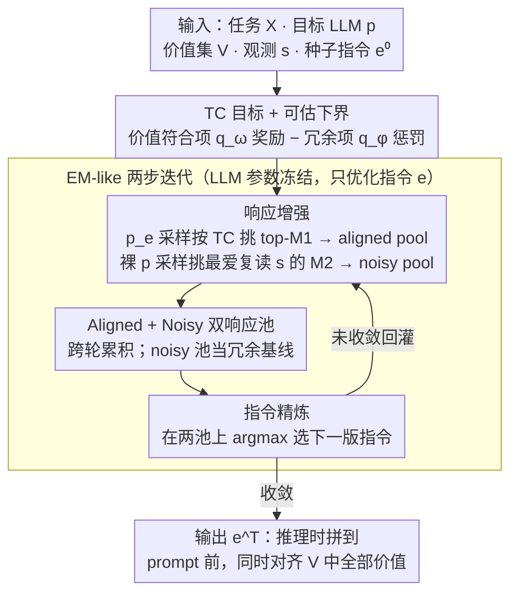

# PICACO: Pluralistic In-Context Value Alignment of LLMs via Total Correlation Optimization

**会议**: ICML 2026  
**arXiv**: [2507.16679](https://arxiv.org/abs/2507.16679)  
**代码**: https://github.com/Salomeeeee/PICACO  
**领域**: 对齐RLHF / 价值对齐 / In-Context Alignment  
**关键词**: 多元价值对齐, 上下文对齐 (ICA), 总相关性 (Total Correlation), 元指令优化, 黑盒优化

## 一句话总结
PICACO 把"让 LLM 在一个 prompt 里同时遵守多个甚至互相冲突的人类价值"形式化为最大化"价值集与响应之间的条件总相关性"(Total Correlation, TC),不动模型参数,通过 EM-like 的"响应增强 + 指令精炼"两步迭代自动搜索一条 meta-instruction,使 GPT-3.5 / LLaMA-3.1-8B / Gemini-1.5-Flash 在 Schwartz、HH 等 5 套最多 8 个价值的组合上都超过 OPRO、Modular Pluralism 等强基线。

## 研究背景与动机

**领域现状**:相比 RLHF / SFT 这种动模型参数的代价,**In-Context Alignment (ICA)** 直接在推理时把价值描述、示例塞进 prompt,就能借 LLM 已有知识做对齐,灵活、便宜、能实时切换偏好,因而成为对齐研究的新分支(URIAL、OPRO、Modular Pluralism、CICL 等)。

**现有痛点**:人类价值天然多元、常常彼此冲突(helpful vs harmless、stimulation vs tradition),但现有 ICA 方法在一条 prompt 里塞多个价值时,LLM 经常**只接收其中一两个,其它被无声忽略**——作者把这称作 **Instruction Bottleneck**(图 1 中 GPT-4o 在被要求同时遵守多个 Schwartz 价值时,响应里只有部分价值被反映)。

**核心矛盾**:LLM 对 prompt 的理解过程是"agnostic"的——你写在 prompt 里的若干价值之间,谁强谁弱、谁压制谁,完全由 LLM 自己默默决定,你既看不见也控制不了。基于人工 prompt 的 URIAL、基于 persona 的 MP、基于多社区模型的 Modular Pluralism,要么需要大量人工、要么依赖预定义价值集、要么只能处理少数几个价值,都没法真正"显式"调节多价值之间的关系。

**本文目标**:在不微调、不依赖大量标注、不限定价值集的前提下,自动搜出一条能同时承载 K 个价值的 meta-instruction,使响应对每个 $v_k$ 的拟合都强、且不引入与 $v_k$ 无关的冗余话术。

**切入角度**:借用信息论里的 **Total Correlation** $\text{TC}(\bm{V},\bm{y})=\sum_k I(\bm{v}_k;\bm{y}) - I(\bm{V};\bm{y})$ ——它刚好"奖励每个单一价值与响应的互信息,惩罚价值集整体与响应的冗余重叠",和"多价值平衡"的需求 1:1 对应。把 LLM 当黑盒,只把 meta-instruction $\bm{e}$ 当作可优化变量,问题就变成了一个 **Black-Box Optimization**。

**核心 idea**:把 $\text{TC}_{\bm{e}}(\bm{V},\bm{y}|\bm{x})$ 推出一个可估计的下界,然后用 EM-like 两步迭代——一步增强"高 TC 的响应池",一步在该池上选出最大化 TC 的下一版 meta-instruction——从而**让"多价值平衡"从一个 prompt 工程难题,变成一个有显式目标函数的优化问题**。

## 方法详解

### 整体框架
**输入**:一组任务 prompt $\mathcal{X}=\{\bm{x}_i\}_{i=1}^N$、目标 LLM $p$、价值组合 $\bm{V}=\{\bm{v}_k\}_{k=1}^K$、文本观测 $\bm{s}$(体现这些价值的少量示例)、种子 meta-instruction $\bm{e}^0$。**输出**:迭代 $T$ 轮后的 meta-instruction $\bm{e}^T$,在推理时直接拼到任务 prompt 前就能让 $p$ 同时对齐 $\bm{V}$ 中的所有价值。

整个 pipeline 是 EM-like 的循环(Alg.1):对每个 $\bm{x}_i$ 同时维护两个"响应池"——**aligned pool** $\bm{R}^a_i$(从带 meta-instruction 的 $p_{\bm{e}}$ 采样、按 TC 分数挑选 top $M_1$)和 **noisy pool** $\bm{R}^n_i$(从裸 LLM $p$ 采样、挑 $M_2$ 个最容易复读 $\bm{s}$ 的"反例")。每轮交替执行"响应增强 → 指令精炼",直到 $\bm{e}^t$ 收敛。

### 关键设计

1. **TC 目标 + 可估下界**:

    - 功能:把"多价值同时对齐"形式化为一个有显式目标的优化问题,而不是手写 prompt 试错。
    - 核心思路:用条件总相关性 $\text{TC}_{\bm{e}}(\bm{V},\bm{y}|\bm{x})=\sum_{k=1}^K I_{\bm{e}}(\bm{v}_k;\bm{y}|\bm{x})-I_{\bm{e}}(\bm{V};\bm{y}|\bm{x})$ 作为优化对象;第一项对每个 $\bm{v}_k$ 用 Barber-Agakov 下界、第二项把 CLUB 上界扩成条件版,合起来得到 $\text{TC}_{\bm{e}} \geq \mathbb{E}_{\hat p(\bm{x})}\{\beta\sum_k \mathbb{E}_{p_{\bm{e}}}[\log q_{\bm{\omega}}(\bm{v}_k|\bm{x},\bm{y})] - \mathbb{E}_{p_{\bm{e}}}[\log q_{\bm{\phi}}(\bm{s}|\bm{x},\bm{y})] + \mathbb{E}_{p}[\log q_{\bm{\phi}}(\bm{s}|\bm{x},\bm{y})]\}$,其中 $q_{\bm{\omega}}$ 是 LLM-as-judge 充当的价值评估器,$q_{\bm{\phi}}$ 用 $\bm{s},\bm{x},\bm{y}$ 之间的余弦相似度刻画"响应里有多少是从 $\bm{s}$ 直接复读的废话"。
    - 设计动机:把"价值符合度"和"指令冗余"显式拆成两项,**用一项奖励多元符合,用另一项惩罚浅层模仿/复读**,从理论上对应 Zhou et al. 2023 提到的 "superficial alignment" 问题——这是后面所有"既能贴合价值又不靠抄袭"性质的源头。

2. **EM-like 两步迭代:响应增强 (Response Enhancement) + 指令精炼 (Instruction Refinement)**:

    - 功能:把上面下界变成可执行算法,LLM 参数全程冻结,只优化 $\bm{e}$。
    - 核心思路:在第 $t$ 轮——(a) **响应增强 (Response Enhancement)**:固定 $\bm{e}^{t-1}$,从 $p_{\bm{e}^{t-1}}$ 采若干响应 $\{\bm{y}_{i,j}\}$,对每个算 $q_{\bm{\omega}},q_{\bm{\phi}}$,把 $\log q_{\bm{\omega}}(\bm{v}_k|\cdot)-\log q_{\bm{\phi}}(\bm{s}|\cdot)$ 最大的 top-$M_1$ 累积到 aligned pool;再从裸 $p$ 采样、按高 $q_{\bm{\phi}}$ 挑 $M_2$ 个进 noisy pool 充当"反例正则化"。(b) **指令精炼 (Instruction Refinement)**:固定两个池子,用 $\bm{e}^t=\arg\max_{\bm{e}}\frac{1}{N}\sum_i\{\sum_{j=1}^{M_1}[\sum_k\log\frac{q_{\bm{\omega}}^{\beta}}{q_{\bm{\phi}}^{1/K}}]p_{\bm{e}}(\bm{y}_{i,j}^t|\bm{x}_i)+\sum_{j=1}^{M_2}p(\hat{\bm{y}}_{i,j}|\bm{x}_i)\log q_{\bm{\phi}}\}$ 选出能让"高 TC 响应"概率最大、同时压住"复读型噪声响应"概率的新指令;具体做法是采样一批候选 $\{\bm{e}_k\}$ 按上式打分挑最优。
    - 设计动机:LLM 参数冻结 + 离散 prompt 空间意味着不能反传梯度,EM-like 交替优化(类似 Sun et al. 2022 的 Black-Box Optimization)是兼顾"可执行"和"有理论解释"的最自然选择;同时**两个池子跨轮累积**而非每轮重采,把昂贵的 LLM call 摊到多轮,实测下来既稳定又便宜(N=50, $M_1=10, M_2=15, T=10$)。

3. **Aligned + Noisy 双响应池(冗余正则)**:

    - 功能:防止优化结果 collapse 到"复读 $\bm{s}$ 里的关键词"这种 fake alignment 上。
    - 核心思路:第三项 $\mathbb{E}_p[\log q_{\bm{\phi}}(\bm{s}|\bm{x},\bm{y})]$ 来自裸 $p$(没有 meta-instruction)的采样,扮演"基线复读概率"的角色;最终目标里 $-\log q_{\bm{\phi}}+\log q_{\bm{\phi}}^{\text{baseline}}$ 形成一个"相对冗余"项——只有当 $\bm{e}$ 让响应**比裸模型还多复读 $\bm{s}$** 时才被惩罚,而不会无脑压低所有相似度。
    - 设计动机:作者在分析里专门指出 Schwartz 价值上特别容易出现 fake alignment——响应只是把价值名字念一遍、内容空洞还能拿高 conformity 分;noisy pool 充当"参考分布",让模型既能学到价值又被迫保持内容相关性(第 4.2 节 finding b 实验观察到 PICACO 比 OPRO 显著缓解这一现象)。

### 损失函数 / 训练策略
没有任何参数训练。优化器=LLM 自己当 prompt sampler(主实验用与目标模型同一个 LLM 来 sample 候选 $\bm{e}_k$,鲁棒性实验里换成 GPT-4o 影响很小,见 Fig.4(a));$q_{\bm{\omega}}$=GPT-4o-mini,$q_{\bm{\phi}}$=$\bm{s},\bm{x},\bm{y}$ 间的余弦相似度;超参 $N=50, M_1=10, M_2=15, T=10, \beta$ 控制 conformity vs redundancy 的 trade-off。每轮的两个池子跨迭代累积,因此 LLM 调用量随 $T$ 线性增长而非平方增长。

## 实验关键数据

### 主实验
5 个价值组合(Helpfulness-4、Harmlessness-4、HH Balance-8、Confucianism-4、Modern Liberalism-4),3 个目标 LLM(GPT-3.5-Turbo、LLaMA-3.1-8B-Instruct、Gemini-1.5-Flash),GPT-4o 当 judge。Friedman 检验 $p<10^{-4}$ 表明方法间差异统计显著。

| 目标模型 | 价值组合 | PICACO | OPRO | URIAL | Modular | Q+IF |
|---------|---------|--------|------|-------|---------|------|
| GPT-3.5-Turbo | Confucianism-4 | **3.788** | 3.713 | 3.622 | 3.567 | 3.306 |
| GPT-3.5-Turbo | Liberalism-4 | **3.135** | 2.961 | 3.030 | 3.036 | 2.728 |
| GPT-3.5-Turbo | HH Balance-8 | 4.257 | **4.286** | 4.097 | 4.245 | 4.082 |
| GPT-3.5-Turbo | Helpfulness-4 | **4.287** | **4.287** | 4.164 | 4.236 | 4.247 |
| LLaMA-3.1-8B | Confucianism-4 | **3.471** | 3.437 | 3.530 | 3.427 | 3.164 |
| LLaMA-3.1-8B | HH Balance-8 | 4.110 | **4.114** | 4.085 | 3.793 | 3.977 |

观察:PICACO 在 Schwartz 类(Confucianism / Liberalism)上最稳,在 HH-8(8 个价值同框)上与 OPRO 不相上下,**优势随价值数量增加而扩大**。

### 消融实验(Table 10,F.3)
| 配置 | 三个 composition 平均掉点 | 说明 |
|------|-----|------|
| Full PICACO | — | 完整方法 |
| w/o redundancy terms $q_{\bm{\phi}}$ | 显著掉 | 去掉两个冗余项 → 出现 fake alignment / 复读 $\bm{s}$ |
| w/o EM 迭代(只跑 1 轮) | 显著掉 | 退化成单步 prompt 优化,失去累积响应池 |
| w/o Response Enhancement | 显著掉 | 没有高 TC 响应池 → 指令精炼缺监督 |
| w/o Instruction Refinement | 显著掉 | 等价于只在固定 $\bm{e}^0$ 下采响应,无法搜出更好指令 |
| w/o noisy pool $M_2$ | 显著掉 | 冗余项失去基线参考,容易过度压相关性 |

### 关键发现
- **多价值越多,PICACO 优势越大**(Fig.3):HH 价值从 2 个加到 8 个时,PICACO 相对 Q 的 delta 始终最大、且各价值符合度的变异系数最小——说明 TC 优化天然倾向"均衡分配注意力"而不是只顾 1-2 个价值。
- **小模型对 ICA 方法更敏感**:LLaMA-3.1-8B 上有近一半 baseline 跑得比裸 Q 还差,而 PICACO 仍稳定提升——侧面验证 Instruction Bottleneck 在弱模型上更严重,而 PICACO 用迭代搜索把这一瓶颈缓解。
- **PICACO + GPT-3.5-Turbo > 裸 O4-Mini**(Fig.4(b)):便宜模型加上 PICACO 能逼近贵模型的对齐水平,给出有实用价值的 cost-performance trade-off。
- **抗 jailbreak**(Fig.4(c)):在 Andriushchenko et al. 2025 的越狱模板下,PICACO 让 GPT-3.5-Turbo 的 toxic 响应比例显著低于 OPRO/Modular,同时 helpful 响应比例反而更高——作者把这归因于 aligned pool 持续累积"helpful refusal"模式 + $q_{\bm{\phi}}$ 惩罚表面安全话术的协同效应。
- **OOD 任务保持优势**(Table 2):换到 Value Portrait 上(creative writing、thread reply 等没见过的任务),PICACO 在 Confucianism / Liberalism 上仍排第一,提示优化出的 meta-instruction 跨任务类型可复用。
- **不依赖 $q_{\bm{\omega}}$**:把评估器换成 Moonshot-V1-8k(更弱),PICACO 仍稳定超过 OPRO,说明优化没在过拟合特定 judge。

## 亮点与洞察
- **目标函数的"完美对位"**:Total Correlation 把"每个价值都要被反映 + 价值集整体不要冗余"两个直觉一次性形式化,这种"问题陈述与优化目标一一对应"的优雅是这篇论文最让人"啊哈"的地方——以前 ICA 论文都是手写 prompt 后做消融,这里是先有目标再有算法。
- **冗余项 = fake alignment 的天敌**:用 $q_{\bm{\phi}}$ + noisy pool 去测"响应是不是只是把 $\bm{s}$ 抄了一遍",这是 prompt 优化领域少见的"显式反 superficial alignment"机制,可以平移到任何 demonstration-based 方法(URIAL、ICL、RAG-style alignment)。
- **EM-like + 双池累积**:把 LLM 采样的高成本摊在多轮上、且每轮的"top-$M_1$"是从历史累积池里挑而非当轮重采,这是把黑盒优化做实用的关键工程 trick——同样的思路可以用在"LLM 调 LLM"的任何 RL-free 优化场景。
- **理论扩展指出冲突价值的方向**(App. C.4):TC 框架天生只处理"非冲突的多元价值",但作者把它推广到了"显式冲突"和"动态权重"两种情形,给后续工作留了清晰接口。

## 局限与展望
- 作者承认:PICACO 主要针对 **Instruction Bottleneck**(LLM 接收不到全部价值),对**真正硬冲突的价值**(Tradition vs Hedonism)只能"鼓励 LLM 折中地整合",并不能给出可调的优先级权重——后续靠 App. C.4 的扩展处理。
- 实测局限:$q_{\bm{\omega}}$ 是 LLM-as-judge(GPT-4o-mini),即便加了 DeepSeek-V3.1 / Moonshot 双 judge 与人评(Krippendorff $\alpha$ 达 0.93)交叉验证,Schwartz 价值上仍有相当部分"高分但内容空洞"的 fake alignment 案例(图 13);要彻底消解只靠 cosine $q_{\bm{\phi}}$ 不够。
- $q_{\bm{\phi}}$ 用 cosine 相似度只是 proxy,无法捕捉"语义复读 + 措辞改写"这种深层 superficial alignment;换更强的相关性判别器(对比学习 / NLI 模型)可能带来质的提升。
- 多次采样 + EM 迭代意味着即便不微调,优化一次 meta-instruction 的 LLM call 量级在万级别(N=50, M=25, T=10);对于希望"每个查询一条专属指令"的应用还偏重,需要研究"摊销式"优化器把单查询成本降下来。
- 自己发现:实验主要是 4-8 个价值的封闭集合,而真实场景的"价值集"既动态又模糊(用户随对话临时加新偏好),目前框架还没演示"在线增删价值"的能力。

## 相关工作与启发
- **vs OPRO** (Yang et al., 2024a):同样是 LLM-自己优化-prompt 的迭代式 ICA;OPRO 用 trajectory + score 做 in-context black-box,目标函数是"裸 evaluation score";PICACO 把目标函数换成 TC 下界、并加入显式的冗余项,因而在**多价值**特别是 Schwartz 类、价值数量大的场景下显著超过 OPRO(Confucianism 3.788 vs 3.713,Liberalism 3.135 vs 2.961)。
- **vs URIAL / URIAL+Sum** (Lin et al., 2024;Lake et al., 2024):URIAL 靠手工 meta-instruction + 高质量 demo,在单价值或 HH 上很强;但作者实验显示**没人工就崩**(URIAL+Sum 用 GPT-4o 生成 demo 就掉点),而 PICACO 不需要任何人写的 meta-instruction,优化产物的迁移性更强(OOD 任务上 URIAL 反而最差 2.648/2.726 vs PICACO 3.598/3.323)。
- **vs Modular Pluralism** (Feng et al., 2024):同样针对多元价值,但 Modular 靠多个微调过的社区 LM 做对话聚合,代价高、价值集预定义;PICACO 不需要任何辅助微调模型,且 Fig.3 显示在价值数量增长时**平衡性(coefficient of variation)显著更好**。
- **vs Constitutional AI** (Bai et al., 2022b):CAI 通过 RLAIF 把宪法注入模型权重;PICACO 完全推理时、不动权重,**价值组合可热替换**——同一个目标 LLM 切换 Confucianism / Liberalism 不需要重新训练,只需重跑一次几十次迭代的优化。
- **启发**:TC 作为优化目标的思路可以迁移到——(1) 多任务 / 多约束的 prompt 优化(把"约束集"当 $\bm{V}$);(2) RAG 系统里"如何让回答同时反映多个检索文档而非只挑一个";(3) Agent 系统中"工具调用要同时满足多个 user intent"——任何"多目标要平衡 + 内容不要冗余"的设定都能套这个框架。

## 评分
- 新颖性: ⭐⭐⭐⭐⭐ Total Correlation 首次用于 ICA,且和"多价值平衡 + 反 fake alignment"两个直觉一次性对应,框架优雅。
- 实验充分度: ⭐⭐⭐⭐⭐ 5 套价值组合 × 3 个目标 LLM × 9 个基线 + Friedman 显著性 + 人评 + 双 judge + OOD + jailbreak + 消融 6 类,几乎所有维度都覆盖。
- 写作质量: ⭐⭐⭐⭐ 数学推导完整、术语统一,但 4.2 节 finding 标签 a/b/c/d 嵌入过深,初读容易迷路。
- 价值: ⭐⭐⭐⭐⭐ 训练-free + 黑盒兼容 + 价值组合可热替换,在 LLM-as-service 时代有非常直接的工业落地价值。

<!-- RELATED:START -->

## 相关论文

- [\[ICML 2026\] Quantifying the Salience of Geo-Cultural Values for Pluralistic Safety Alignment](quantifying_the_salience_of_geo-cultural_values_for_pluralistic_safety_alignment.md)
- [\[ICML 2026\] Toward Stable Value Alignment: Introducing Independent Modules for Consistent Value Guidance](toward_stable_value_alignment_introducing_independent_modules_for_consistent_val.md)
- [\[ICML 2026\] Towards Context-Invariant Safety Alignment for Large Language Models](towards_context-invariant_safety_alignment_for_large_language_models.md)
- [\[ACL 2025\] Internal Value Alignment in Large Language Models through Controlled Value Vector Activation](../../ACL2025/llm_alignment/internal_value_alignment_in_large_language_models_through_controlled_value_vecto.md)
- [\[ACL 2026\] How Value Induction Reshapes LLM Behaviour](../../ACL2026/llm_alignment/how_value_induction_reshapes_llm_behaviour.md)

<!-- RELATED:END -->
