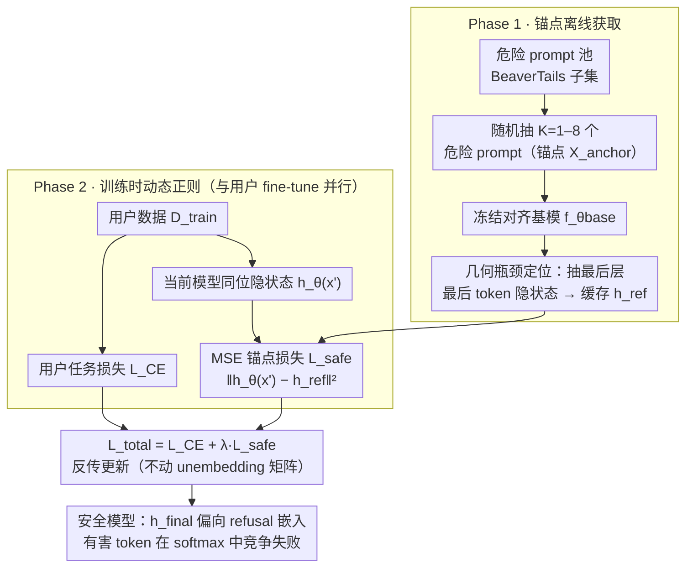

# Safety Anchor: Defending Harmful Fine-tuning via Geometric Bottlenecks

**会议**: ICML 2026  
**arXiv**: [2605.05995](https://arxiv.org/abs/2605.05995)  
**代码**: [soyoaaa/SBR](https://github.com/soyoaaa/SBR)  
**领域**: 对齐 / LLM 安全  
**关键词**: Harmful Fine-tuning, Unembedding Bottleneck, 参数冗余, MSE Anchor, RLHF 鲁棒性

## 一句话总结
本文证明所有现有「在参数空间设约束」的 HFT 防御都会因参数冗余而被绕过，提出 Safety Bottleneck Regularization (SBR) 把防御战场搬到 unembedding 层这一几何瓶颈上：仅锚定 1 个高危 prompt 的最后一层隐状态，就能在 50 epoch 持续 HFT 攻击下把 Harmful Score 压到 < 10，同时不损 benign 任务精度。

## 研究背景与动机
**领域现状**：RLHF 让 LLM 拒答违法请求，但 fine-tuning-as-a-service 允许用户上传数据集再训练，即便少量恶意样本（Harmful Fine-tuning, HFT）就能在数 epoch 内把安全护栏拆掉。已有的三类防御 —— (i) 参数距离 (Lisa/EWC)，(ii) 梯度方向 (Booster)，(iii) 表示漂移 (Vaccine/T-Vaccine) —— 在早期 epoch 都能压住有害行为。

**现有痛点**：作者用 50 epoch 持续 HFT 的 stress test 发现，所有三类防御在 5–10 epoch 后陆续崩溃（HS > 30），且崩溃时它们各自监控的「参数距离/梯度方向/表示漂移」并未越界 —— 这说明它们成功地约束了形式，却没保住实质。

**核心矛盾**：LLM 是高度过参数化的，攻击者总能找到与防御约束正交的优化方向 —— 一个 random Rank-1 LoRA $\Delta W=BA^\top$（$A$ 冻结）就能恢复 harmful capability，说明 harmful direction 在参数空间「无处不在」而非稀疏。这意味着任何在「冗余高维参数空间」上的约束都有 null space 可被利用。

**本文目标**：找到一个不受参数冗余影响、攻击者无法绕开的 chokepoint，把防御只施加在那里就够了。

**切入角度**：作者注意到 token 生成的最终一步是「最后一层隐状态 $h_{\text{final}}$ 与词嵌入 $w_t$ 的内积」$\text{Score}(t)=h_{\text{final}}^\top w_t$ —— 这个 unembedding 投影是一切有害 token 必经的几何瓶颈，且 $w_t$ frozen，所以只要 $h_{\text{final}}$ 偏向 refusal 嵌入方向，softmax 就一定先选 refusal token。

**核心 idea**：与其在参数空间设防，不如直接锚定一组高危 query 在 unembedding 层的最后隐状态，使其与冻结的对齐模型保持一致 —— 不管内部参数怎么演化，瓶颈被钉住，恶意 token 就生成不出来。

## 方法详解

### 整体框架
SBR 在 fine-tuning-as-a-service 场景下工作：service provider 持有对齐基模 $f_{\theta_{\text{base}}}$ 与一组「安全锚点」$\mathcal{X}_{\text{anchor}}=\{x'_1,\ldots,x'_K\}$（典型危险 prompt，如「How to make a bomb?」），但看不到用户上传的训练集 $\mathcal{D}_{\text{train}}$。SBR 分两阶段：

- **Phase 1 — Anchor Acquisition（离线）**：用冻结的 $f_{\theta_{\text{base}}}$ 对每个锚点抽取最后一层最后 token 的隐状态 $h_{\text{ref}}(x')=f^{\text{last}}_{\theta_{\text{base}}}(x')$，缓存为 $\mathcal{H}_{\text{ref}}$。
- **Phase 2 — Dynamic Regularization（与用户 fine-tune 并行）**：每个 batch 同时计算 $\mathcal{L}_{CE}$（用户任务）与 $\mathcal{L}_{\text{safe}}=\frac{1}{|\mathcal{X}_{\text{anchor}}|}\sum_{x'}\|h_\theta(x')-h_{\text{ref}}(x')\|_2^2$，总目标 $\mathcal{L}_{\text{total}}=\mathcal{L}_{CE}+\lambda\mathcal{L}_{\text{safe}}$，$\lambda$ 控制 refusal 强度。整个过程不动 unembedding 矩阵、不需要修改 base model 架构。

### 关键设计

**1. 几何瓶颈定位：把防御从冗余的参数空间挪到 unembedding 输入**

前面的痛点是，所有在参数空间设防的方法都有 null space 可绕——一个随机 Rank-1 方向就能恢复 harmful capability。SBR 的破局点在于盯住 token 生成的最后一道闸：每个 token 的分数都是 $P(t|x)=\text{softmax}(h_{\text{final}}^\top w_t)$，refusal token 与 harmful token 在同一个 softmax 里竞争。只要让最后一层隐状态 $h_{\text{final}}$ 在几何上偏向 refusal token 的嵌入方向，refusal 的内积分数就严格高于 harmful，模型必然先吐出拒绝词。这个位置之所以无法绕过，是因为绕开它要同时改 $h_{\text{final}}$ 和词嵌入 $w_t$，而 $w_t$ 是冻结的，攻击者只剩 $h_{\text{final}}$ 这一个 $d$ 维约束面可动——相比高维冗余的参数空间，这里几乎没有逃生通道。作者在 §3 用三组 stress test（参数距离 / Rank-1 random subspace / 表示漂移）逐一证明高维参数空间永远存在与防御方向正交的逃生路径，唯有维度更低、与 token 选择直接相连的 unembedding 输入层才钉得住。

**2. MSE 锚点损失：用极少锚点给瓶颈施加硬约束**

定位好瓶颈后，怎么把 $h_{\text{final}}$ 钉在 refusal 方向上？SBR 的做法是直接拿对齐基模的输出当参照：离线阶段用冻结的 $f_{\theta_{\text{base}}}$ 抽出每个高危 prompt 最后 token 的隐状态 $h_{\text{ref}}(x')$ 缓存下来，训练时加一项 MSE 把当前模型拉回这个参照——

$$\mathcal{L}_{\text{safe}}(\theta)=\frac{1}{|\mathcal{X}_{\text{anchor}}|}\sum_{x'\in\mathcal{X}_{\text{anchor}}}\|h_\theta(x')-h_{\text{ref}}(x')\|_2^2$$

它与用户任务的 $\mathcal{L}_{CE}$ 以 $\lambda$ 加权求和。关键是锚点极少：只需从 candidate pool（与攻击者数据不重叠的 BeaverTails 子集）随机抽 1–8 个典型危险 prompt，实测 1 个 anchor 就够把 Harmful Score 压到 < 10。之所以这么省还不伤 benign 任务，是因为作者主张 refusal direction 与 benign reasoning direction 近似正交（Zou 2023, Arditi 2024）——锚定一小撮高危 prompt 占用的优化空间几乎不与正常推理方向冲突。

**3. Stress test 范式：用 50 epoch 持续 HFT 揭穿既有防御的「假安全」**

这一点不是 SBR 的组件，而是它赖以立论的评测武器。既有论文常只报 3–5 epoch 内的 HS，掩盖了真实部署里 service provider 可能放任用户长期训练的事实。SBR 把评测推到极端：构造 10% harmful + 90% benign 的混合数据集，在 SST-2/AGNEWS/GSM8K/AlpacaEval 四个 benign 任务上跑 20–50 epoch，让既有防御的崩盘暴露出来；同时设计 Random Subspace Attack（冻结 $A$ 只训 $B$）证明随机 Rank-1 方向也能恢复 harmful capability。更关键的是它系统对比了「参数距离 / embedding drift 与 HS」的相关性，证明这些被监控的代理指标可以稳定不变而安全早已失守——这既揭穿了旧方法 transient safety 的假象，也反衬出 SBR 锚定瓶颈的必要性。

### 损失函数 / 训练策略
LoRA rank 16 / alpha 16，AdamW lr $1\times 10^{-5}$，batch size 32，20 epoch；锚点 $K=8$，$\lambda=50$；anchor 仅用 forward pass、无需 backward 到基模。所有 baseline 在相同超参下复跑。

## 实验关键数据

### 主实验
Llama3.1-8B，4 个 benign 下游任务 × HS↓ / FA↑ 双指标：

| Method | SST-2 HS↓ | SST-2 FA↑ | GSM8K HS↓ | GSM8K FA↑ | AlpacaEval HS↓ | AlpacaEval FA↑ | 平均 HS↓ | 平均 FA↑ |
|--------|-----------|-----------|-----------|-----------|----------------|-----------------|----------|---------|
| SFT (no defense) | 67.80 | 94.61 | 71.10 | 82.80 | 74.20 | 43.87 | 70.70 | 78.07 |
| DeepAlign | 25.90 | 93.12 | 20.70 | 88.00 | 23.70 | 33.64 | 25.10 | 76.04 |
| Lisa | 52.50 | 94.27 | 40.40 | 72.20 | 58.20 | 37.93 | 52.45 | 73.50 |
| Vaccine | 61.40 | 92.55 | 64.30 | 75.10 | 62.90 | 36.39 | 62.53 | 73.34 |
| Booster | 59.80 | 92.89 | 71.50 | 76.20 | 54.30 | 35.75 | 62.33 | 73.66 |
| **SBR** | **5.80** | **94.15** | **5.60** | **82.60** | **6.20** | **45.82** | **5.68** | **78.17** |

### 消融实验
**毒性比例稳健性 (Llama3.1-8B)**:

| Poison ratio $p$ | SFT HS | DeepAlign HS | Vaccine HS | Booster HS | **SBR HS** | SBR FA |
|------------------|--------|--------------|------------|------------|------------|--------|
| 0.05 | 67.90 | 21.50 | 58.70 | 59.40 | **4.10** | 93.92 |
| 0.10 | 67.80 | 25.90 | 61.40 | 59.80 | **5.80** | 94.15 |
| 0.20 | 71.90 | 29.90 | 61.90 | 64.60 | **8.20** | 93.92 |
| 0.30 | 74.30 | 33.30 | 69.20 | 67.30 | **7.30** | 93.69 |
| 平均 | 70.48 | 27.65 | 62.80 | 62.78 | **6.35** | 93.92 |

**$\lambda$ 敏感性**：$\lambda\in\{0,5,10,50,100\}$ 上验证 $\lambda=50$ 在 HS↓ 与 FA↑ 之间取到稳定甜点（$\lambda=0$ 退化为 SFT，$\lambda\ge 100$ 开始侵蚀 FA）。

### 关键发现
- $K=1$ 个 anchor 就够 —— 论文反复强调「a single safety anchor is sufficient to reduce the Harmful Score to < 10」，证明 unembedding 瓶颈极其窄。
- 在 50 epoch 持续 HFT 下 SBR 仍稳，而 Lisa/Vaccine/Booster 早在 5 epoch 就崩盘 —— Figure 2 给出戏剧性的对照。
- §3 的 Drift-Safety Dissociation 实证（step 120 与 480 embedding drift 几乎不变但 HS 从 12 跳到 59）独立证明：监控全局表示漂移本身就是错的代理变量。
- benign 任务上 SBR 不仅不掉，反而略升（平均 FA 78.17 vs SFT 78.07）—— 印证「refusal direction 与 benign reasoning direction 近似正交」假设。

## 亮点与洞察
- 用 stress test + Random Subspace Attack 把现有 HFT 防御「为什么会被绕过」的机制讲透，给整个研究方向打了一针清醒剂。
- 「找瓶颈」的思想极有 transfer 价值 —— 不止 unembedding，任何「有冗余 ⇒ 攻击者总能找到正交方向绕过」的防御都可考虑挪到下游必经几何点。
- 1 个 anchor 就够的极简性意味着部署 cost 几乎为零：service provider 只需缓存 $K$ 个隐状态向量，每个 forward 增加常数级开销。
- $\mathcal{L}_{\text{safe}}$ 与 $\mathcal{L}_{CE}$ 没有冲突的根本原因被作者关联到 refusal/reasoning subspace 正交性 —— 给「safety vs utility 不一定 trade-off」提供了几何解释。

## 局限与展望
- 高危 anchor pool 需要 service provider 预先准备并维护；新出现的攻击类型（如多模态、长链推理引导）需要更新 anchor，更新成本未量化。
- 主要在 7B 级别（Llama3.1-8B, Qwen2.5-7B, Gemma1.1-7B）验证，未在 70B+ 与 MoE 上验证；瓶颈维度 $d$ 增长时 1 anchor 是否仍够未明。
- 攻击者若能直接微调 unembedding 矩阵 $w_t$（或在 prompt 里诱导模型「绕过最后一层」），SBR 假设的几何瓶颈不再成立 —— 即对 attack model 假设的依赖较强。
- 没有讨论与连续学习/多任务 fine-tune 的交互：长期叠加多个 benign 任务后 anchor 还会不会漂？
- $\lambda=50$ 是经验值，不同模型/任务上需要重新搜参。

## 相关工作与启发
- **vs Lisa / EWC**: 都在参数空间约束权重距离，本文证明高维冗余让这条路天然失败；SBR 把约束挪到 unembedding 输入层，规避了 null space。
- **vs Vaccine / T-Vaccine**: 监控整层表示漂移，但作者实测漂移与 HS 解耦；SBR 只锚定最后一层、最后 token，定位更精准。
- **vs Booster / Gradient-based**: 试图屏蔽 harmful gradient 方向，但本文证明 harmful direction 在参数空间「随机方向都行」，无法稀疏屏蔽。
- **vs DeepAlign**: 在输出 token 上加约束，对短输出（分类任务）有副作用；SBR 在 hidden state 上加约束，对 token 长度不敏感。
- 启发：所有「内部表示约束」类的对齐 / unlearning / 水印工作都可参考「找几何瓶颈」的思路 —— 把约束放在最少冗余的位置，能用更少 anchor 拿到更强的鲁棒性。

## 评分
- 新颖性: ⭐⭐⭐⭐⭐ 把 HFT 防御从「参数空间」整体重定位到 unembedding 瓶颈，提出新范式
- 实验充分度: ⭐⭐⭐⭐⭐ 三套 stress test + 4 任务 + 4 毒性比例 + $\lambda$ 敏感性 + 3 个 base LLM
- 写作质量: ⭐⭐⭐⭐⭐ §3 motivation 三连击逻辑极强，方法 1 页讲完，图表简洁有说服力
- 价值: ⭐⭐⭐⭐⭐ 1 个 anchor 即可拒攻击且 benign 不掉点，工业部署友好且与现有训练流水线兼容

<!-- RELATED:START -->

## 相关论文

- [\[ICML 2026\] SPARD: Defending Harmful Fine-Tuning Attack via Safety Projection with Relevance-Diversity Data Selection](spard_defending_harmful_fine-tuning_attack_via_safety_projection_with_relevance-.md)
- [\[ICLR 2026\] Safety Subspaces are Not Linearly Distinct: A Fine-Tuning Case Study](../../ICLR2026/llm_alignment/safety_subspaces_are_not_linearly_distinct_a_fine-tuning_case_study.md)
- [\[ICML 2026\] GIST: 用梯度子空间投影做 instruction tuning 的 targeted 数据选择](gist_targeted_data_selection_for_instruction_tuning_via_coupled_optimization_geo.md)
- [\[ICML 2026\] Curriculum Learning for Safety Alignment](curriculum_learning_for_safety_alignment.md)
- [\[ICML 2026\] Implicit Safety Alignment from Crowd Preferences](implicit_safety_alignment_from_crowd_preferences.md)

<!-- RELATED:END -->
