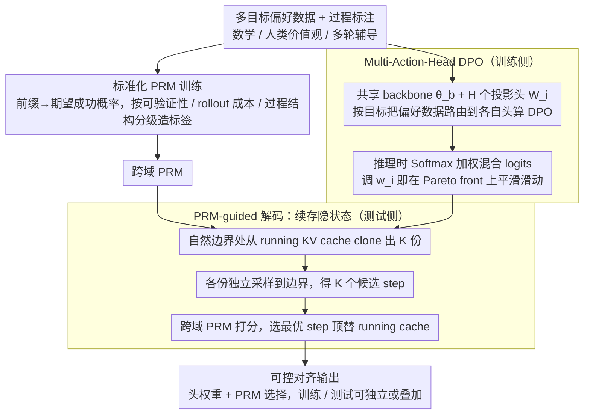

# Simultaneous Multi-objective Alignment Across Verifiable and Non-verifiable Rewards

**会议**: ICML2026  
**arXiv**: [2510.01167](https://arxiv.org/abs/2510.01167)  
**代码**: https://github.com/pearls-lab/multiobj-align  
**领域**: 对齐RLHF  
**关键词**: 多目标对齐, Multi-Action-Head DPO, PRM-guided decoding, 过程奖励模型, 可验证/不可验证奖励

## 一句话总结
MAHALO 把"标准化 PRM 训练 + 多动作头 DPO + 带 KV-cache 续存的 PRM 引导解码"拼成一套统一框架，让一个 LLM 在数学（可验证）、人类价值观（不可验证）、多轮辅导（交互式）三类目标上同时被对齐，并且在推理时能通过头权重与 PRM 选择平滑地切换偏好。

## 研究背景与动机
**领域现状**：主流对齐路线（RLHF / DPO）都把多维偏好压成一个标量奖励，要么训练时定一组固定权重（如 MODPO 的线性化、参数 soup），要么测试时用单一 RM 引导生成。

**现有痛点**：（1）训练时的标量化抹掉了维度间的 trade-off，且换权重就要重训；（2）DPO Soup / 个性化 soup 等参数合并方法在加新目标时要重训单目标专家，代价高；（3）测试时的 reward-guided decoding 大多依赖 outcome RM，对部分序列打分时有"训练-推理粒度不一致"的问题；（4）PRM 类方法当前几乎只覆盖数学这种可验证域，非可验证域（helpfulness/honesty）缺一套通用的 step-level 训练范式。

**核心矛盾**：训练时若收紧成一个标量就丢失了多维结构，若开成多模型又承担巨大算力；测试时若只用 outcome RM 就缺少 step-level 控制，若想用 PRM 又训不出来——本质是"训练时多维度结构"和"测试时细粒度可控"之间没人统一打通。

**本文目标**：在一套框架里同时解决三个子问题——(a) 怎么在可验证与不可验证域里统一地训 PRM；(b) 怎么用一个共享 backbone 训出 H 个可解耦的目标头、推理时按需混合；(c) 怎么把 PRM 用在 step-level 解码上而不引入额外的"重新 encode prompt"开销。

**切入角度**：作者观察到——"奖励是否可验证"应当决定优化精力花在训练还是推理。可验证目标（数学正确性）天然有精确 step-level 信号，测试时 PRM 搜索收益最大；不可验证目标（helpfulness/engagement）信号噪声大，更适合通过多头训练塑形共享表示。基于这个二分法，作者把训练侧（MAH-DPO）和测试侧（PRM-guided decoding）做成互补组件。

**核心 idea**：用一个共享 backbone + H 个 DPO 头 做"向量化多目标对齐"，再用一个跨域 PRM 在 KV-cache 续存的状态下做 step-level guided decoding，训练与推理可独立或叠加调用，实现"一次训练、推理时按需调配"。

## 方法详解

### 整体框架
MAHALO 的输入是一组多目标偏好数据 $\{\mathcal{D}_i\}_{i=1}^H$（Math 的 Acc / Eng，UltraFeedback 的 Help / Honest / Truth，Socratic Mind 的 Acc / Eng）和对应的过程级标注。整套框架顺着作者的核心二分法展开：可验证目标天然有精确的 step 信号，把优化精力花在**测试时搜索**上回报最高；不可验证目标信号噪声大，更适合靠**训练时多头塑形**共享表示。于是训练侧用 Multi-Action-Head DPO（一个共享 backbone $\theta_b$ + H 个线性头 $W_i$）让每个目标长在自己的头上、推理时按权重混合 logits；测试侧用一个跨域 PRM 在生成边界处做"采候选 → PRM 打分 → 提交"的 step-level 引导，并用续存的 KV cache 抹掉重复 encode 的开销。两条线由一套**标准化 PRM 训练范式**打底——它把"过程奖励"从数学域的对错判断抽象成"前缀 → 期望成功概率"，使同一形态的信号 $r_t$ 能覆盖整张对齐图谱。三个组件可独立或叠加调用，做到"一次训练、推理时按需调配"。

### 关键设计

**1. 标准化 PRM 训练：把过程奖励从数学域抽象成"前缀→期望成功概率"，统一可验证 / 非可验证域**

之前的 PRM 工作几乎只能在数学这类有自动验证器的域上训，因为只有那里能廉价地判定每一步"对不对"；helpfulness、honesty 这种主观目标缺一套通用的 step-level 监督。本文的关键一步是把过程奖励重新定义成"给定前缀、期望最终成功的概率"，再按"是否可验证 + rollout 成本 + 有没有清晰过程结构"把标签构造分级处理。可验证域用 step-level reward 叠 hindsight relabeling，把最终正确性 $z$ 折扣回传到每一步 $\tilde r_t = r_t + \gamma^{n-t} z$，对 $M$ 次 rollout 取平均得到拟合目标 $V_t^{\text{target}}$，PRM 用 MSE 去逼近：$\mathcal{L}_{\text{PRM}} = \mathbb{E}[(p_t - V_t^{\text{target}})^2]$，等于把 PRM 同时训成"step 质量 + 未来正确性"的预测器。非可验证域则分三种 case：Case A（有清晰 step 且 rollout 便宜）用校准过的 LLM-as-Judge 对多条 rollout 投多数票，$r_t = \mathbb{I}[\frac{1}{M}\sum_m \mathbb{I}(J(y_{1:t}, y_{t+1:n}^{(m)})=\text{pos}) > 1/2]$；Case B（rollout 贵，如多轮对话）直接让 judge 给前缀打分 $r_t = J(y_{1:t})$；Case C（无清晰过程结构）退化成 Bradley-Terry 风格的部分序列打分。正因为这层抽象按 rollout 成本和过程结构分级，同一套 PRM 训练范式才能从数学扩散到整个对齐谱，这也是后面"一个 PRM 跨域迁移"成立的前提。

**2. Multi-Action-Head DPO：把目标分离放在最后一层、知识共享放在 backbone，避免 H 倍训练开销又让推理时可重权**

MODPO 把多个目标硬塞进一个标量损失，权重在训练时就钉死、推理时改不了；DPO Soup 之类要为每个目标独立训一整个模型再合并参数，加新目标就得重训单目标专家，代价高。MAH-DPO 的做法是让共享 backbone 给出隐状态 $h_{\theta_b}(x, y_{1:t}) \in \mathbb{R}^d$，再为每个目标 $i$ 配一个独立投影头 $W_i \in \mathbb{R}^{d \times |V|}$，得到目标特定 logits $z_i = W_i^\top h_{\theta_b}$。每个头都从 SFT 头复制再加小扰动初始化，参考模型 $\pi_\text{ref}$ 共用一份冻结的 SFT 头；训练时把每条样本按目标路由到对应头各算各的 DPO，单目标损失 $\mathcal{L}_i = -\mathbb{E}_{\mathcal{D}_i}[\log \sigma(\beta \Delta_i)]$（$\Delta_i$ 是用 $\pi_{\theta_b, W_i}$ 算的 DPO 优势），总损失是加权和 $\mathcal{L}_{\text{MAH-DPO}} = \sum_i \alpha_i \cdot \frac{1}{|\mathcal{B}_i|}\sum_{\mathcal{B}_i} \mathcal{L}_i$。推理时只需对 logits 加权 $\pi_\text{MAH}(y_t \mid \cdot) = \text{Softmax}(\sum_i w_i z_i)$（$\sum_i w_i = 1$）即可在 Pareto front 上平滑滑动，完全不用重训。把"目标分离"压到轻量的最后一层、把"知识共享"留在重量的 backbone，让它既绕开了 H 倍训练成本，又能即时重权——实测两头集成相对单头 DPO 仅 +13% 延迟、+7% 显存。

**3. PRM-guided Decoding with Continuing Hidden State：用续存 KV cache 抹掉每步重 encode，让 step-level 引导真正可部署**

现有 reward-guided decoding 每选完一个 step 就把"已生成前缀 + 新 step"当成文本重新拼接再 encode 一次，tokenization、相对位置、特殊 token 摆放上的细微差异会让下一步的分布偏离真实增量解码，分步多次拼接后误差还会累积。本文的解法是维护一个 running past KV cache $\text{kv}_t$：每到一个"自然边界"（数学的换行 step、价值观的句子/段落、对话的一轮），就从 $\text{kv}_t$ clone 出 $K$ 份本地 cache，各自独立采样直到触发边界检测 $\mathcal{Q}$，得到候选 $y_{t+1}^k$ 及其末态 cache $\text{kv}_{t+1}^k$；PRM 给每个候选打分 $r_k = P(x, y_{1:t}, y_{t+1}^k)$，选 $k^\star = \arg\max_k r_k$，把对应的 $\text{kv}_{t+1}^{k^\star}$ 直接顶替为下一步的 running cache。这样生成始终在"隐状态连续"的层面进行，既保住了分布的真实性，又省掉了重复 encode——实测对随机采样 4.9×、对 PRM-guided 4.2× 加速，把 step-level guidance 的成本压到能落地的量级。

### 损失函数 / 训练策略
PRM 用 MSE 拟合 hindsight value target；MAH-DPO 在 batch 里把样本按目标路由到对应头，分头算 DPO 再加权汇总（$\beta$ 控制偏好强度，$\alpha_i$ 控制目标重要性）。实验里为公平对比统一用相等的 $\alpha_i$ 与平衡采样。所有头从 SFT head 加微扰初始化，参考策略固定为 SFT。Math/Socratic Mind 用 Qwen2.5-7B-Instruct，UltraFeedback 用 Llama-3.1-8B-Instruct，所有结果 3 次独立运行平均。

## 实验关键数据

### 主实验：训练时对齐（MAH-DPO vs 基线）

| 数据集 | 指标 | Base | SFT | Single-Head DPO | MODPO | DPO Soup | **MAH-DPO Ensemble** |
|--------|------|------|-----|-----------------|-------|----------|----------------------|
| Math | Acc | 0.711 | 0.730 | 0.725 | 0.728 | 0.726 | 0.725 |
| Math | Eng | 0.501 | 0.592 | 0.716 | 0.737 | 0.735 | **0.873** |
| Human Values | Help | 0.580 | 0.555 | 0.604 | 0.618 | 0.613 | **0.639** |
| Human Values | Honest | 0.304 | 0.300 | 0.306 | 0.348 | 0.322 | **0.369** |
| Human Values | Truth | 0.189 | 0.199 | 0.201 | 0.233 | 0.215 | **0.248** |
| Socratic Mind | Acc | 0.656 | 0.679 | 0.704 | 0.705 | – | 0.689 |
| Socratic Mind | Eng | 0.322 | 0.347 | 0.446 | 0.360 | – | **0.451** |

MAH-DPO Ensemble 在 Human Values 三个维度全面最强；Math 上 Eng 大幅领先而 Acc 仅微落后。

### 主实验：测试时 PRM-guided decoding 收益

| 数据集 | 配置 | 主目标 | 副目标 |
|--------|------|--------|--------|
| Math | Base | Acc 0.685, Eng 0.513 | — |
| Math | Accuracy Value-guided | **Acc 0.799** (+11.4) | Eng 0.455 |
| Math | Engaging PRM-guided | Acc 0.701 | **Eng 0.719** (+20.6) |
| Human Values | Helpful PRM-guided | **Help 0.671** | Honest 0.405, Truth 0.279 |
| Human Values | Honesty PRM-guided | Help 0.645 | **Honest 0.469**, Truth 0.338 |
| Socratic Mind | Engaging PRM-guided | Acc 0.651 | **Eng 0.466** (+12.8) |

可验证目标（数学 Acc）测试时收益最大，与"奖励可验证 → 测试时搜索回报最高"的核心论断吻合。

### 训练+测试协同（Table 5 摘录）

| 数据集 | 配置 | 关键指标 |
|--------|------|---------|
| Math | MAH-DPO + Accuracy Value | Acc **0.800** / Eng 0.855 |
| Math | MAH-DPO + Engaging PRM | Acc 0.721 / Eng **0.906** |
| Human Values | MAH-DPO + Honest PRM | Honest **0.520** / Truth **0.411** |
| Socratic Mind | MAH-DPO + Engaging PRM | Acc 0.712 / Eng **0.542** |

训练 + 推理叠加把 Pareto front 整体外推，且对相关目标（如 Honest PRM 同时拉高 Truth）出现正迁移。

### 消融 / 分析实验

| 配置 | 关键发现 | 说明 |
|------|---------|------|
| 冲突子集 Help vs Honest | Single-Head DPO 崩到 Help 0.34 / Honest 0.07 | 单标量在显式冲突下会坍塌 |
| 冲突子集 + MAH-DPO Ensemble | Help 0.612 / Honest 0.353 | 提供平衡操作点，不偏废任一维 |
| 5-head 跨域统一训练 | Acc 0.72 / Eng 0.86 / Help 0.65 / Honest 0.45 / Truth 0.35 | 全部维度同时优于 Base，目标数量增多不崩 |
| 统一 PRM（7 维混训） | 全维度优于 Base，逼近各专用 PRM | 单个 PRM 可跨域迁移 |
| Continuing hidden state | 随机采样 4.9× 加速，PRM-guided 4.2× 加速 | 续存 KV 消除重 encode 开销 |
| MAH-DPO (H=2) vs Single | +13% 延迟、+7% 显存、吞吐基本持平 | 多头开销远小于训多模型 |

### 关键发现
- **奖励可验证性决定优化重心**：Math Acc 等高度可验证奖励主要靠测试时 PRM 搜索拉升（+11.4），而 Help/Honest/Eng 这种主观奖励主要靠多头训练塑形（Ensemble 全面碾压标量化基线），训练 + 推理叠加进一步把上限推高。
- **头权重平滑控制 Pareto front**：在 Math 上调节 Acc/Eng 头权重能画出一条平滑 accuracy–engagement 曲线，几乎没有"非目标维突崩"的现象，意味着不重训就能落地不同应用偏好。
- **统一 PRM 可跨域迁移**：一个在 7 维混合数据上训出来的 PRM 在所有 3 个域 7 个维度上都优于 Base，且贴近各域专用 PRM，证明过程级奖励的结构是有共性的、可共享的。

## 亮点与洞察
- 把"是否可验证 + rollout 成本 + 过程结构"做成 PRM 训练范式的二维决策表，是把 process supervision 从数学域扩散到对齐全栈的关键工程贡献；之前 PRM 工作只回答"怎么在数学里训"，本文回答"怎么在任何对齐目标上训"。
- Multi-Action-Head DPO 的"共享 backbone + 多头投影 + 推理时 softmax 加权 logits"非常像 mixture-of-experts 在对齐场景的极简变体，但通过把每个目标的 DPO 数据路由到自己头上避免梯度互相打架，是用最低 overhead 拿到"可重权多目标"的优雅方案。
- Continuing hidden state 这个工程 trick 看似小，但实测 4× 加速，让 step-level guided decoding 第一次具备真正的可部署性——这类"消除重 encode"的思路完全可以迁移到 speculative decoding、tree search、agent 多轮调用等几乎所有需要"前缀稳定 + 多候选打分"的场景。
- "可验证 → 测试时搜索；不可验证 → 训练时塑形"这条经验性 recipe 给后续对齐工作提供了清晰的设计 prior，避免在主观目标上浪费 inference compute、也避免在可验证目标上死磕训练。

## 局限与展望
- 作者承认：非可验证域的 PRM 标签由 LLM-as-Judge + 多数票/单次打分得到，judge 校准依赖少量人标 ratings，judge 偏差会直接传染到 PRM 与下游对齐策略，缺少更系统的 judge 鲁棒性消融。
- 实验集中在 7B–8B 量级、3 个域 7 个维度，对更大规模模型（70B+）以及更多目标同时存在（>10 维）时的 backbone 容量瓶颈和头之间梯度干涉的缩放规律尚无验证。
- MAH-DPO 推理时的头权重需要按下游目标手工设定；如何在线根据用户反馈自适应调节（contextual bandit / RL on weights）是一个自然的延伸方向。
- PRM-guided decoding 当前在"自然边界"（换行、句子）处采候选，对结构化输出（代码、表格、JSON）或长输出（>4k token）的 step 切分策略缺失，可能影响实际工程落地。

## 相关工作与启发
- **vs MODPO**：MODPO 把 H 个目标合并成一个标量损失，权重必须训练时确定且固定；MAH-DPO 把目标解耦到独立头，推理时改 $w_i$ 即可滑动 Pareto，且 Ensemble 全面优于 MODPO（Human Values 三个维度全胜）。
- **vs DPO Soup / Personalized Soup**：Soup 类方法需要为每个目标独立训整模，再做参数合并，加新目标要重训；MAH-DPO 只新增一个线性头，训练成本几乎不变。
- **vs ARGS / Reward-Guided Decoding**：现有 RGD 用 outcome RM 做 token-level/部分序列打分，存在"训练-推理粒度不一致"和"每步重 encode"两大顽疾；本文把 PRM 与 KV-cache 续存结合，同时解决信号粒度和效率问题。
- **vs Math-Shepherd / Process Reward Models**：Math-Shepherd 等只覆盖数学，本文把 PRM 训练抽象成"前缀 → 期望成功"，再针对非可验证域设计 Case A/B/C 标签构造法，把 PRM 训练范式扩展到对齐全谱。

## 评分
- 新颖性: ⭐⭐⭐⭐ 单个组件（PRM、多头 DPO、guided decoding）都不是首创，但"按可验证性分配训练/推理优化精力"这条 recipe + 三件套统一框架是清晰的新贡献。
- 实验充分度: ⭐⭐⭐⭐⭐ 3 个域 7 个维度 + 训练时/测试时/协同三段对比 + 冲突子集 + 5 头 scaling + 统一 PRM 跨域 + 计算开销分析，覆盖面非常完整。
- 写作质量: ⭐⭐⭐⭐ 7 条 Finding 把核心结论压缩得很清楚，背景对 RLHF/DPO/PRM/RGD 谱系交代到位；公式与算法描述稍密但准确。
- 价值: ⭐⭐⭐⭐⭐ MAH-DPO + Continuing-state PRM decoding 都是可直接落地的组件，且"可验证性决定优化重心"这条经验法则对未来多目标对齐工作有指导意义。

<!-- RELATED:START -->

## 相关论文

- [\[ICML 2026\] Decoupling Reasoning and Confidence: Resurrecting Calibration in Reinforcement Learning from Verifiable Rewards](decoupling_reasoning_and_confidence_resurrecting_calibration_in_reinforcement_le.md)
- [\[ICML 2026\] Mitigating Reward Hacking in RLHF via Bayesian Non-negative Reward Modeling](mitigating_reward_hacking_in_rlhf_via_bayesian_non-negative_reward_modeling.md)
- [\[ACL 2026\] Teaching LLM to be Persuasive: Reward-Enhanced Policy Optimization for Alignment from Heterogeneous Rewards](../../ACL2026/llm_alignment/teaching_llm_to_be_persuasive_reward-enhanced_policy_optimization_for_alignment_.md)
- [\[ACL 2025\] AMoPO: Adaptive Multi-objective Preference Optimization without Reward Models and Reference Models](../../ACL2025/llm_alignment/amopo_adaptive_multi-objective_preference_optimization_without_reward_models_and.md)
- [\[ICML 2026\] Alignment-Aware Decoding](alignment-aware_decoding.md)

<!-- RELATED:END -->
